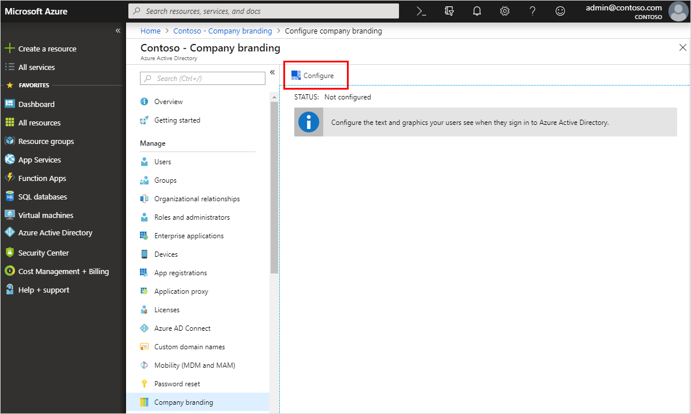
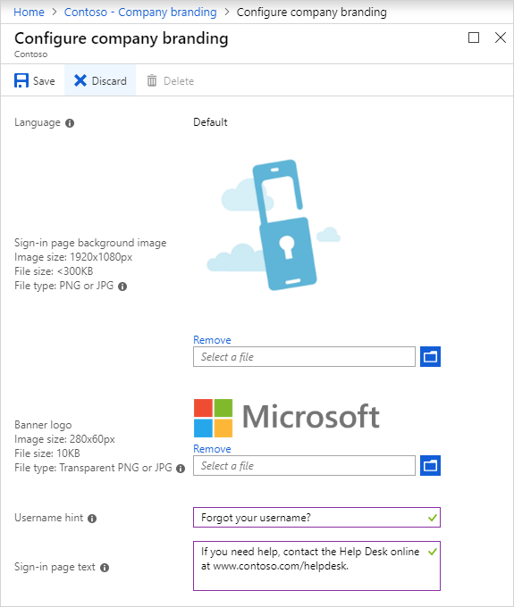
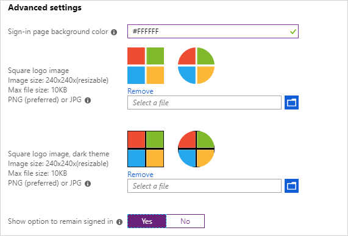
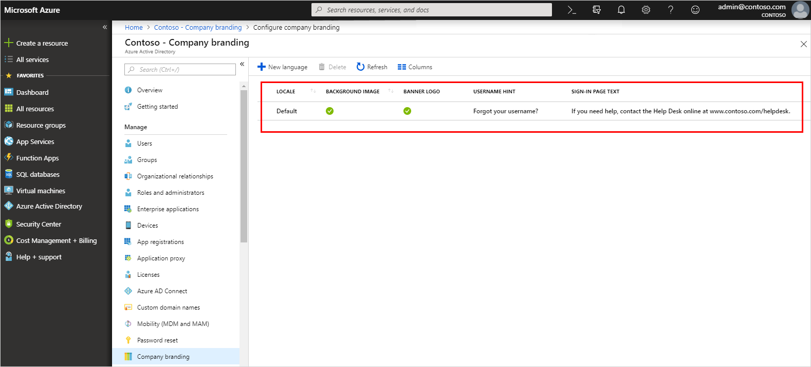
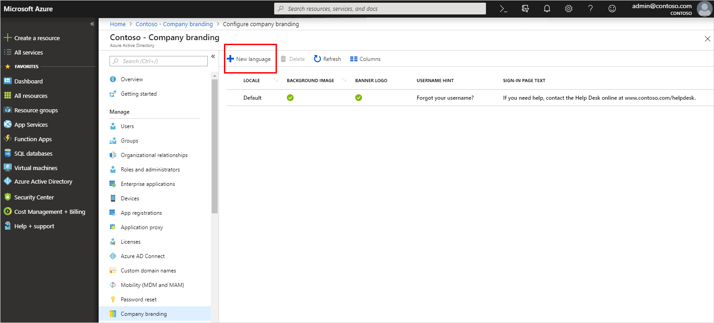
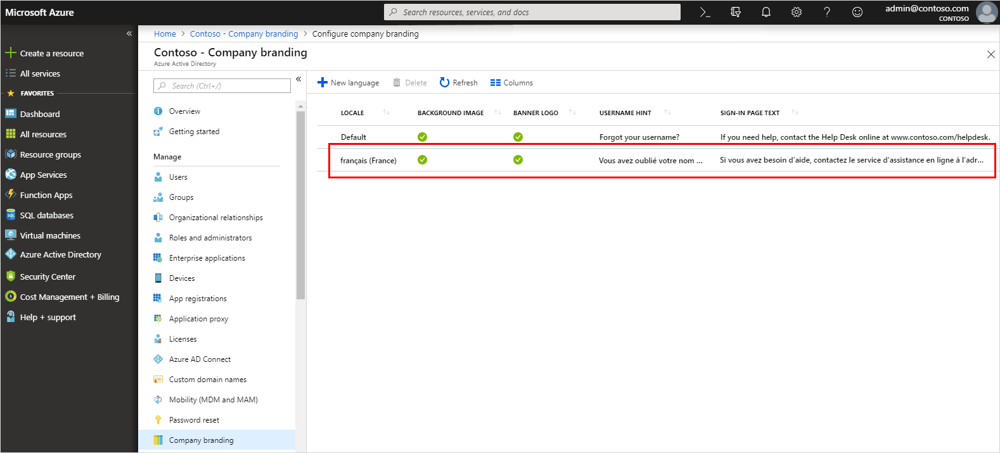

# Add branding to your organization's Azure Active Directory sign-in page
Use your organization's logo and custom color schemes to provide a consistent look-and-feel on your Azure Active Directory (Azure AD) sign-in pages. Your sign-in pages appear when users sign in to your organization's web-based apps, such as Office 365, which uses Azure AD as your identity provider.

>[!NOTE]
>Adding custom branding requires you to use Azure Active Directory Premium 1, Premium 2, or Basic editions, or to have an Office 365 license. For more information about licensing and editions, see [Sign up for Azure AD Premium](active-directory-get-started-premium.md).  Azure AD Premium and Basic editions are available for customers in China using the worldwide instance of Azure Active Directory. Azure AD Premium and Basic editions aren't currently supported in the Azure service operated by 21Vianet in China. For more information, talk to us using the [Azure Active Directory Forum](https://feedback.azure.com/forums/169401-azure-active-directory/).

## Customize your Azure AD sign-in page
You can customize your Azure AD sign-in pages, which appear when users sign in to your organization's tenant-specific apps, such as `https://outlook.com/contoso.com`, or when passing a domain variable, such as `https://passwordreset.microsoftonline.com/?whr=contoso.com`.

Your custom branding won't immediately appear when your users go to sites such as, www\.office.com. Instead, the user has to sign-in before your customized branding appears. After the user has signed in, the branding may take 15 minutes or longer to appear. 

> [!NOTE]
> All branding elements are optional. For example, if you specify a banner logo with no background image, the sign-in page will show your logo with a default background image from the destination site (for example, Office 365).  Additionally, sign-in page branding doesn't carry over to personal Microsoft accounts. If your users or business guests sign in using a personal Microsoft account, the sign-in page won't reflect the branding of your organization.

### To customize your branding
1. Sign in to the [Azure portal](https://portal.azure.com/) using a Global administrator account for the directory.

2. Select **Azure Active Directory**, and then select **Company branding**, and then select **Configure**.

    

3. On the **Configure company branding** page, provide any or all of the following information.

    >[!IMPORTANT]
    >All the custom images you add on this page have image size (pixels), and potentially file size (KB), restrictions. Because of these restrictions, you'll most-likely need to use a photo editor to create the right-sized images.

    - **General settings**

        

        - **Language.** The language is automatically set as your default and can't be changed.
        
        - **Sign-in page background image.** Select a .png or .jpg image file to appear as the background for your sign-in pages. The image will be anchored to the center of the browser, and will scale to the size of the viewable space. You can't select an image larger than 1920x1080 pixels in size or that has a file size more than 300 KB.
        
            It's recommended to use images without a strong subject focus, e.g., an opaque white box appears in the center of the screen, and could cover any part of the image depending on the dimensions of the viewable space.

        - **Banner logo.** Select a .png or .jpg version of your logo to appear on the sign-in page after the user enters a username and on the **My Apps** portal page.
            
            The image can't be taller than 60 pixels or wider than 280 pixels. We recommend using a transparent image since the background might not match your logo background. We also recommend not adding padding around the image or it might make your logo look small.

        - **Username hint.** Type the hint text that appears to users if they forget their username. This text must be Unicode, without links or code, and can't exceed 64 characters. If guests sign in to your app, we suggest not adding this hint.

        - **Sign-in page text.** Type the text that appears on the bottom of the sign-in page. You can use this text to communicate additional information, such as the phone number to your help desk or a legal statement. This text must be Unicode and not exceed 256 characters.

    - **Advanced settings**
            
           

        - **Sign-in page background color.** Specify the hexadecimal color (for example, white is #FFFFFF) that will appear in place of your background image in low-bandwidth connection situations. We recommend using the primary color of your banner logo or your organization color.

        - **Square logo image.** Select a .png (preferred) or .jpg image of your organization's logo to appear to users during the setup process for new Windows 10 Enterprise devices. This image is only used for Windows authentication and appears only on tenants that are using [Windows Autopilot]( https://docs.microsoft.com/windows/deployment/windows-autopilot/windows-10-autopilot) for deployment or for password entry pages in other Windows 10 experiences. In some cases it may also appear in the consent dialog.
        
            The image can't be larger than 240x240 pixels in size and must have a file size of less than 10 KB. We recommend using a transparent image since the background might not match your logo background. We also recommend not adding padding around the image or it might make your logo look small.
    
        - **Square logo image, dark theme.** Same as the square logo image above. This logo image takes the place of the square logo image when used with a dark background, such as with Windows 10 Azure AD joined screens during the out-of-box experience (OOBE).  If your logo looks good on white, dark blue, and black backgrounds, you don't need to add this image. 
        
        - **Show option to remain signed in.** You can choose to let your users remain signed in to Azure AD until explicitly signing out. If you choose **No**,  this option is hidden, and users must sign in each time the browser is closed and reopened.

            To learn more about configuring and troubleshooting the option to remain signed in, see [Configure the 'Stay signed in?' prompt for Azure AD accounts](keep-me-signed-in.md)
        
            >[!NOTE]
            >Some features of SharePoint Online and Office 2010 depend on users being able to choose to remain signed in. If you set this option to **No**, your users may see additional and unexpected prompts to sign-in.
   

3. After you've finished adding your branding, select **Save**.

    If this process creates your first custom branding configuration, it becomes the default for your tenant. If you have additional configurations, you'll be able to choose your default configuration.
    
    >[!IMPORTANT]
    >To add more corporate branding configurations to your tenant, you must choose **New language** on the **Contoso - Company branding** page. This opens the **Configure company branding** page, where you can follow the same steps as above.

## Update your custom branding
After you've created your custom branding, you can go back and change anything you want.

### To edit your custom branding
1. Sign in to the [Azure portal](https://portal.azure.com/) using a Global administrator account for the directory.

2. Select **Azure Active Directory**, and then select **Company branding**, and then select **Configure**.

    

3. On the **Configure company branding** page, add, remove, or change any of the information, based on the descriptions in the [Customize your Azure AD sign-in page](#customize-your-azure-ad-sign-in-page) section of this article.

4. Select **Save**.

   It can take up to an hour for any changes you made to the sign-in page branding to appear.

## Add language-specific company branding to your directory
You can't change your original configuration's language from your default language. However, if you need a configuration in a different language, you can create a new configuration.

### To add a language-specific branding configuration

1. Sign in to the [Azure portal](https://portal.azure.com/) using a Global administrator account for the directory.

2. Select **Azure Active Directory**, and then select **Company branding**, and then select **New language**.

    

3. On the **Configure company branding** page, select your language (for example, French) and then add your translated information, based on the descriptions in the [Customize your Azure AD sign-in page](#customize-your-azure-ad-sign-in-page) section of this article.

4. Select **Save**.

    The **Contoso – Company branding** page updates to show your new French configuration.

    

## Add your custom branding to pages
Add your custom branding to pages by modifying the end of the URL with the text, `?whr=yourdomainname`. This modification works on several pages, including the Multi-Factor Authentication (MFA) setup page, the Self-service Password Reset (SSPR) setup page, and the sign in page.

**Examples:**

**Original URL:** https://aka.ms/MFASetup 
**Custom URL:** `https://account.activedirectory.windowsazure.com/proofup.aspx?whr=contoso.com`

**Original URL:** https://aka.ms/SSPR 
**Custom URL:** `https://passwordreset.microsoftonline.com/?whr=contoso.com`
