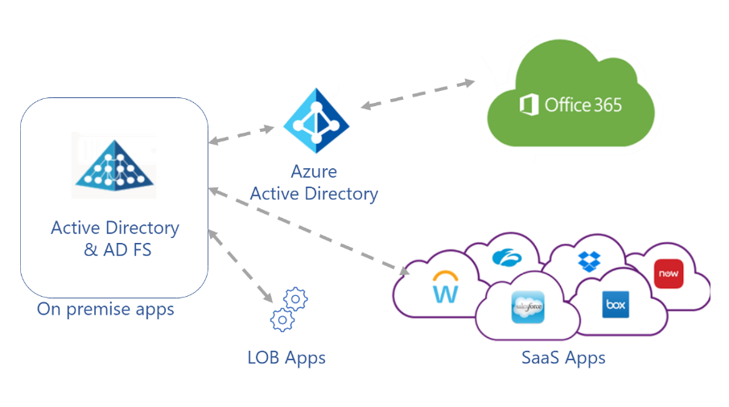
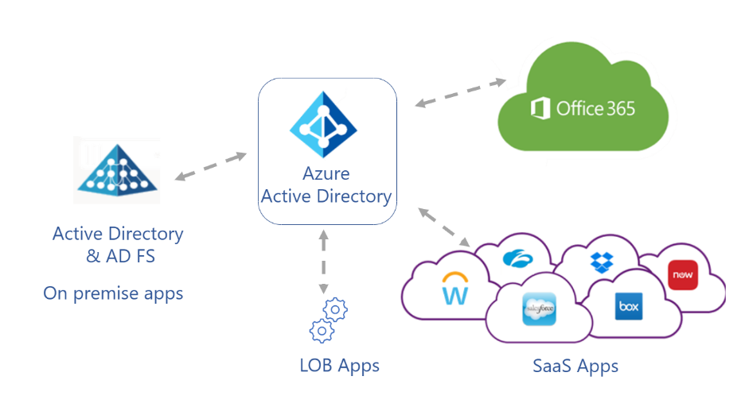
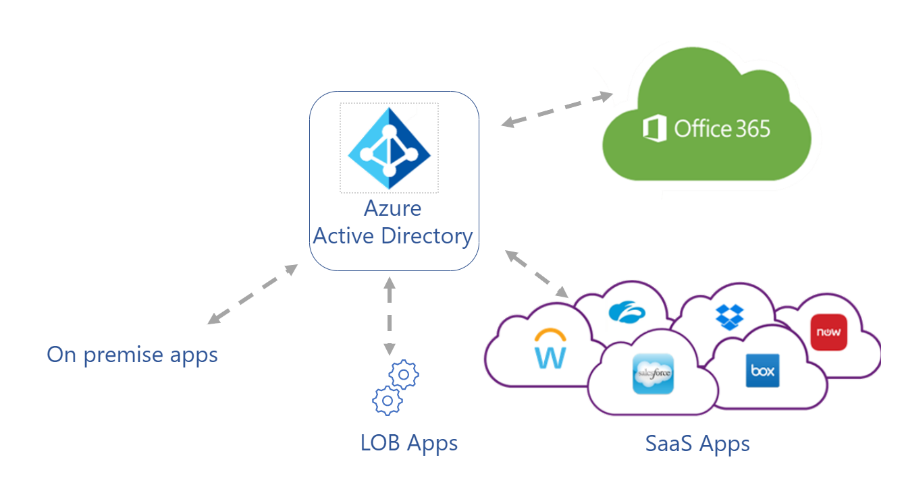

# Five steps to integrate your apps with Azure Active Directory

You can learn to integrate your applications with Azure Active Directory (Azure AD), which is a cloud-based identity and access management service. Organizations use Azure AD for secure authentication and authorization so customers, partners, and employees can access applications. With Azure AD, features such as Conditional Access, Azure AD Multi-Factor Authentication (MFA), single sign-on, and applicatoin provisioning make identity and access management easier to manage and more secure.

Learn more:

* [What is Conditional Access](../conditional-access/overview.md)
* [How it works: Azure AD Multi-Factor Authentication](../authentication/concept-mfa-howitworks.md)
* [Azure AD seamless single sign-on](../hybrid/how-to-connect-sso.md)
* [What is app provisioning in Azure AD?](../app-provisioning/user-provisioning.md)

If your company has a Microsoft 365 subscription, you likely use Azure AD. However, you can Azure AD for applications. If you centralize application management, you can use identity management features, tools, and policies for your app portfolio. The benefit is a unified solution that improves security, reduces costs, increases productivity, and enables compliance. In addition, there's remote access to on-premises apps.

Learn more:

* [Deploy your identity infrastructure for Microsoft 365](/microsoft-365/enterprise/deploy-identity-solution-overview?view=o365-worldwide&preserve-view=true)
* [What is application management in Azure AD?](../manage-apps/what-is-application-management.md)

## Azure AD for new applications

When your business acquires new applications, add them to the Azure AD tenant. Establish a company policy of adding new apps to Azure AD. 

See, [Quickstart: Add an enterprise application](../manage-apps/add-application-portal.md

Azure AD has a gallery of integrated applications to make it easy to get started. You can add a gallery app to your Azure AD organization (see, previous link) amd learn about integrating software as a service (SaaS) tutorials.

See, [Tutorials for integrating SaaS applications with Azure AD](../saas-apps/tutorial-list.md) 

### Integration tutorials

Use the following tutorials to learn to integrate common tools with Azure AD single sign-on (SSO).

* [Tutorial: Azure AD SSO integration with ServiceNow](../saas-apps/servicenow-tutorial.md)
* [Tutorial: Azure AD SSO integration with Workday](../saas-apps/workday-tutorial.md)
* [Tutorial: Azure AD SSO integration with Salesforce](../saas-apps/salesforce-tutorial.md)
* [Tutorial: Azure AD SSO integration with AWS Single-Account Access](../saas-apps/amazon-web-service-tutorial.md)
* [Tutorial: Azure AD SSO integration with Slack](../saas-apps/slack-tutorial.md)

### Apps not in the gallery

You can integrate applications not in the gallery, including applications in your organization, or third-party application from vendors not in the Azure AD gallery. You can make a request to publish your app in the gallery. To learn about integrating apps you develop in-house, see Integrate apps your developers build.

Learn more:

* [Quickstart: View enterprise applications](../manage-apps/view-applications-portal.md)
* [Submit a request to publish your application in Azure AD application gallery](../manage-apps/v2-howto-app-gallery-listing.md)

## Determine application usage and prioritize integration 

Discover the applications employees use, and prioritize integrating the apps with Azure AD. Use the Microsoft Defender for Cloud Apps Cloud Discovery tools to discover and manage apps not managed by your IT team. Microsoft Defender for Endpoint (formerly known as Microsoft Defender Advanced Threat Protection) simplifies and extends the discovery process.

Learn more:

* [Set up Cloud Discovery](/defender-cloud-apps/set-up-cloud-discovery)
* [Microsoft Defender for Endpoint](/microsoft-365/security/defender-endpoint/microsoft-defender-endpoint?view=o365-worldwide&preserve-view=true)

In addition, you can use the Active Directory Federation Services (AD FS) in the Azure portal to discover AD FS apps in your organization. You can discover unique users that signed in to the apps, and see information about integratino compatibility.

See, [Review the application activity report](../manage-apps/migrate-adfs-application-activity.md

### Application migration

After you discover apps in your environment, prioritize the apps to migrate and integrate. Consider the following parameters:

- Apps used most frequently 
- Riskiest apps
- Apps to be decommissioned, therefore not in migration
- Apps that stay on-premises

See, [Resources for migrating applications to Azure AD](../manage-apps/migration-resources.md)

## Integrate apps and identity providers

During discovery, there might be applications not tracked by the IT team, which can create vulnerabilities. Some applications use alternative identity solutions, including AD FS, or other identity providers (IdPs). We recommend you consolidate identity and access management. Benefits include:

* Reduce on-premises user set-up, authentication, and IdP licensing fees
* Lower administrative overhead with streamlined identity and access management process
* Enable single sign-on (SSO) access to applications in the My Apps portal
  * See, [Create collections on the My Apps portal](../manage-apps/access-panel-collections.md)
* Use Identity Protection and Conditional Access to increase data from app usage, and extend benefits to recently added apps
  * [What is Identity Protection?](../identity-protection/overview-identity-protection.md)
  * [What is Conditional Access?](../conditional-access/overview.md)

### App owner awareness

To help manage app integration with Azure AD, use the following material for application owner awareness and interest. You can modify the material with your branding.

You can download:

* Zip file, [Editable Azure AD App Integration One-Pager](https://aka.ms/AppOnePager)
* PowerPoint presentation, [Azure AD application integration guidelines](https://aka.ms/AppGuideline)

### Active Directory Federation Services

Evaluate use of AD FS for authentication with SaaS apps, line-of-business apps, also Microsoft 365 and Azure AD apps. 

   

You can improve the configuration illustrated in the previous diagram by moving application authentication to Azure AD. You can enable sign-on for apps and ease application discovery with the My Apps portal.

Learn more:

* [Move application authentication to Azure AD](../manage-apps/migrate-adfs-apps-to-azure.md)
* [Sign in and start apps from the My Apps portal](https://support.microsoft.com/account-billing/sign-in-and-start-apps-from-the-my-apps-portal-2f3b1bae-0e5a-4a86-a33e-876fbd2a4510)

   

Once Azure AD becomes the central identity provider, you may be able to switch from ADFS completely, rather than using a federated solution. Apps that previously used ADFS for authentication can now use Azure AD alone.

   

You can also migrate apps that use a different cloud-based identity provider to Azure AD. Your organization may have multiple Identity Access Management (IAM) solutions in place. Migrating to one Azure AD infrastructure is an opportunity to reduce dependencies on IAM licenses (on-premises or in the cloud) and infrastructure costs. In cases where you may have already paid for Azure AD via M365 licenses, there is no reason to pay the added cost of another IAM solution.

## Integrate on-premises applications

Traditionally, applications were kept secure by allowing access only while connected to the corporate network. However, in an increasingly connected world we want to allow access to apps for customers, partners, and/or employees, regardless of where they are in the world. [Azure AD Application Proxy](../app-proxy/what-is-application-proxy.md) (AppProxy) is a feature of Azure AD that connects your existing on-premises apps to Azure AD and does not require that you maintain edge servers or other additional infrastructure to do so.

You can use [Tutorial: Add an on-premises application for remote access through Application Proxy in Azure Active Directory](../app-proxy/application-proxy-add-on-premises-application.md) to enable Application Proxy and add an on-premises application to your Azure AD tenant.

In addition, you can integrate application delivery controllers like F5 BIG-IP APM or Zscaler Private Access. By integrating these with Azure AD, you get the modern authentication and identity management of Azure AD alongside the traffic management and security features of the partner product. We call this solution [Secure Hybrid Access](../manage-apps/secure-hybrid-access.md). If you use any of the following services today, we have tutorials that will step you through how to integrate them with Azure AD.

- [Akamai Enterprise Application Access (EAA)](../saas-apps/akamai-tutorial.md)
- [Citrix Application Deliver Controller (ADC)](../saas-apps/citrix-netscaler-tutorial.md) (Formerly known as Citrix Netscaler)
- [F5 BIG-IP APM](../manage-apps/f5-aad-integration.md)
- [Zscaler Private Access (ZPA)](../saas-apps/zscalerprivateaccess-tutorial.md)

## Integrate apps your developers build

For apps that are built within your company, your developers can use the [Microsoft identity platform](../develop/index.yml) to implement authentication and authorization. Applications integrated with the platform with be [registered with Azure AD](../develop/quickstart-register-app.md) and managed just like any other app in your portfolio.

Developers can use the platform for both internal-use apps and customer facing apps, and there are other benefits that come with using the platform. [Microsoft Authentication Libraries (MSAL)](../develop/msal-overview.md), which is part of the platform, allows developers to enable modern experiences like multi-factor authentication and the use of security keys to access their apps without needing to implement it themselves. Additionally, apps integrated with the Microsoft identity platform can access [Microsoft Graph](/graph/overview) - a unified API endpoint providing the Azure AD data that describes the patterns of productivity, identity, and security in an organization. Developers can use this information to implement features that increase productivity for your users. For example, by identifying the people the user has been interacting with recently and surfacing them in the app's UI.

We have a [video series](https://www.youtube.com/watch?v=zjezqZPPOfc&amp;list=PLLasX02E8BPBxGouWlJV-u-XZWOc2RkiX) that provides a comprehensive introduction to the platform as well as [many code samples](../develop/sample-v2-code.md) in supported languages and platforms.

## Next steps

- [Resources for migrating applications to Azure Active Directory](../manage-apps/migration-resources.md)
