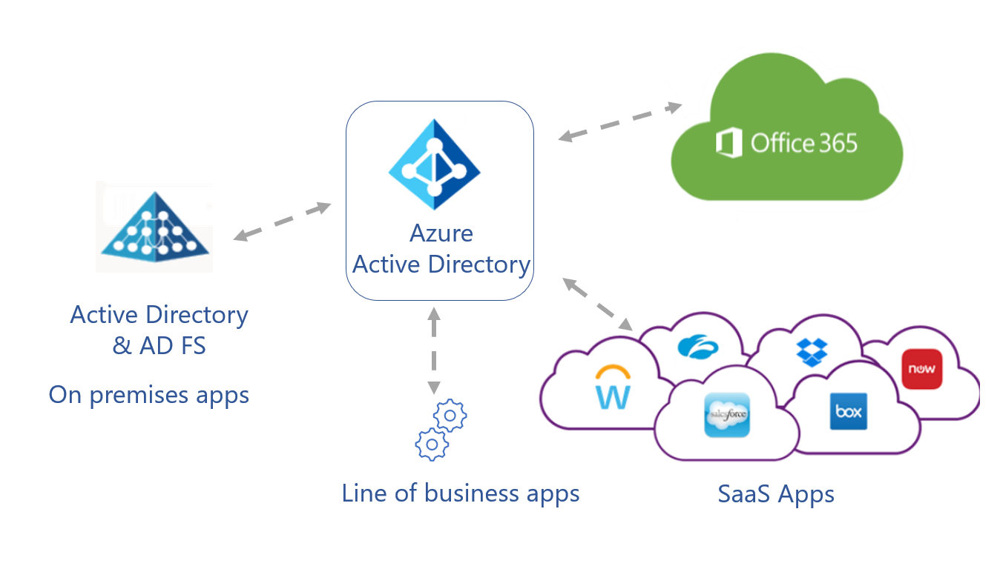
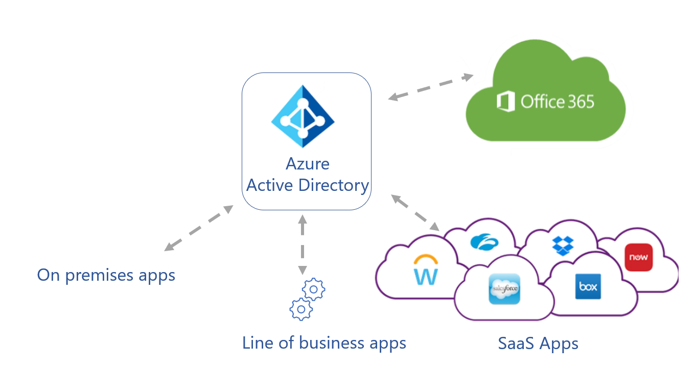
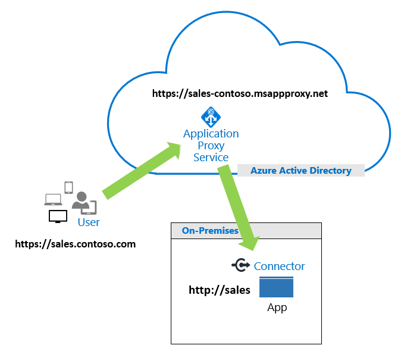

# Five steps to integrate your apps with Azure Active Directory

Learn to integrate your applications with Azure Active Directory (Azure AD), which is a cloud-based identity and access management service. Organizations use Azure AD for secure authentication and authorization so customers, partners, and employees can access applications. With Azure AD, features such as Conditional Access, Azure AD Multi-Factor Authentication (MFA), single sign-on, and application provisioning make identity and access management easier to manage and more secure.

Learn more:

* [What is Conditional Access?](../conditional-access/overview.md)
* [How it works: Azure AD Multi-Factor Authentication](../authentication/concept-mfa-howitworks.md)
* [Azure AD seamless single sign-on](../hybrid/how-to-connect-sso.md)
* [What is app provisioning in Azure AD?](../app-provisioning/user-provisioning.md)

If your company has a Microsoft 365 subscription, you likely use Azure AD. However, you can use Azure AD for applications. If you centralize application management, identity management features, tools, and policies for your app portfolio. The benefit is a unified solution that improves security, reduces costs, increases productivity, and enables compliance. In addition, there's remote access to on-premises apps.

Learn more:

* [Deploy your identity infrastructure for Microsoft 365](/microsoft-365/enterprise/deploy-identity-solution-overview?view=o365-worldwide&preserve-view=true)
* [What is application management in Azure AD?](../manage-apps/what-is-application-management.md)

## Azure AD for new applications

When your business acquires new applications, add them to the Azure AD tenant. Establish a company policy of adding new apps to Azure AD. 

See, [Quickstart: Add an enterprise application](../manage-apps/add-application-portal.md)

Azure AD has a gallery of integrated applications to make it easy to get started. Add a gallery app to your Azure AD organization (see, previous link) and learn about integrating software as a service (SaaS) tutorials.

See, [Tutorials for integrating SaaS applications with Azure AD](../saas-apps/tutorial-list.md) 

### Integration tutorials

Use the following tutorials to learn to integrate common tools with Azure AD single sign-on (SSO).

* [Tutorial: Azure AD SSO integration with ServiceNow](../saas-apps/servicenow-tutorial.md)
* [Tutorial: Azure AD SSO integration with Workday](../saas-apps/workday-tutorial.md)
* [Tutorial: Azure AD SSO integration with Salesforce](../saas-apps/salesforce-tutorial.md)
* [Tutorial: Azure AD SSO integration with AWS Single-Account Access](../saas-apps/amazon-web-service-tutorial.md)
* [Tutorial: Azure AD SSO integration with Slack](../saas-apps/slack-tutorial.md)

### Apps not in the gallery

You can integrate applications that don't appear in the gallery, including applications in your organization, or third-party application from vendors. Submit a request to publish your app in the gallery. To learn about integrating apps you develop in-house, see **Integrate apps your developers build**.

Learn more:

* [Quickstart: View enterprise applications](../manage-apps/view-applications-portal.md)
* [Submit a request to publish your application in Azure AD application gallery](../manage-apps/v2-howto-app-gallery-listing.md)

## Determine application usage and prioritize integration 

Discover the applications employees use, and prioritize integrating the apps with Azure AD. Use the Microsoft Defender for Cloud Apps Cloud Discovery tools to discover and manage apps not managed by your IT team. Microsoft Defender for Endpoint (formerly known as Microsoft Defender Advanced Threat Protection) simplifies and extends the discovery process.

Learn more:

* [Set up Cloud Discovery](/defender-cloud-apps/set-up-cloud-discovery)
* [Microsoft Defender for Endpoint](/microsoft-365/security/defender-endpoint/microsoft-defender-endpoint?view=o365-worldwide&preserve-view=true)

In addition, use the Active Directory Federation Services (AD FS) in the Azure portal to discover AD FS apps in your organization. Discover unique users that signed in to the apps, and see information about integration compatibility.

See, [Review the application activity report](../manage-apps/migrate-adfs-application-activity.md)

### Application migration

After you discover apps in your environment, prioritize the apps to migrate and integrate. Consider the following parameters:

- Apps used most frequently 
- Riskiest apps
- Apps to be decommissioned, therefore not in migration
- Apps that stay on-premises

See, [Resources for migrating applications to Azure AD](../manage-apps/migration-resources.md)

## Integrate apps and identity providers

During discovery, there might be applications not tracked by the IT team, which can create vulnerabilities. Some applications use alternative identity solutions, including AD FS, or other identity providers (IdPs). We recommend you consolidate identity and access management. Benefits include:

* Reduce on-premises user set-up, authentication, and IdP licensing fees
* Lower administrative overhead with streamlined identity and access management process
* Enable single sign-on (SSO) access to applications in the My Apps portal
  * See, [Create collections on the My Apps portal](../manage-apps/access-panel-collections.md)
* Use Identity Protection and Conditional Access to increase data from app usage, and extend benefits to recently added apps
  * [What is Identity Protection?](../identity-protection/overview-identity-protection.md)
  * [What is Conditional Access?](../conditional-access/overview.md)

### App owner awareness

To help manage app integration with Azure AD, use the following material for application owner awareness and interest. Modify the material with your branding.

You can download:

* Zip file, [Editable Azure AD App Integration One-Pager](https://aka.ms/AppOnePager)
* Microsoft PowerPoint presentation, [Azure AD application integration guidelines](https://aka.ms/AppGuideline)

### Active Directory Federation Services

Evaluate use of AD FS for authentication with SaaS apps, line-of-business apps, also Microsoft 365 and Azure AD apps. 

   

Improve the configuration illustrated in the previous diagram by moving application authentication to Azure AD. Enable sign-on for apps and ease application discovery with the My Apps portal.

Learn more:

* [Move application authentication to Azure AD](../manage-apps/migrate-adfs-apps-to-azure.md)
* [Sign in and start apps from the My Apps portal](https://support.microsoft.com/account-billing/sign-in-and-start-apps-from-the-my-apps-portal-2f3b1bae-0e5a-4a86-a33e-876fbd2a4510)

See the following diagram of app authentication simplified by Azure AD.

   

After Azure AD is the central IdP, you might be able to discontinue ADFS. 

   

You can migrate apps that use a different cloud-based IdP. Your organization might have multiple Identity Access Management (IAM) solutions. Migrating to one Azure AD infrastructure can reduce dependencies on IAM licenses and infrastructure costs. If you paid for Azure AD with Microsoft 365 licenses, likely you don't have to purchase another IAM solution.

## Integrate on-premises applications

Traditionally, application security enabled access during a connection to a corporate network. However, organization grant access to apps for customers, partners, and/or employees, regardless of location. Application Proxy Service in Azure AD connects on-premises apps to Azure AD and doesn't require edge servers or more infrastructure.

See, [Using Azure AD Application Proxy to publish on-premises apps for remote users](../app-proxy/what-is-application-proxy.md)

The following diagram illustrates Application Proxy Service processing a user request.

   

See, [Tutorial: Add an on-premises application for remote access through Application Proxy in Azure AD](../app-proxy/application-proxy-add-on-premises-application.md) 

In addition, integrate application delivery controllers like F5 BIG-IP APM, or Zscaler Private Access, with Azure AD. Benefits are modern authentication and identity management, traffic management, and security features. We call this solution secure hybrid access. 

See, [Secure hybrid access: Protect legacy apps with Azure AD](../manage-apps/secure-hybrid-access.md)

For the following services, there are Azure AD integration tutorials.

* [Tutorial: Azure AD SSO integration with Akamai](../saas-apps/akamai-tutorial.md)
* [Tutorial: Azure AD SSO integration with Citrix ADC SAML Connector for Azure AD (Kerberos-based authentication)](../saas-apps/citrix-netscaler-tutorial.md)
  * Formerly known as Citrix Netscaler
* [Integrate F5 BIG-IP with Azure AD](../manage-apps/f5-integration.md)
* [Tutorial: Integrate Zscaler Private Access (ZPA) with Azure AD](../saas-apps/zscalerprivateaccess-tutorial.md)

## Integrate apps your developers build

For your developers' apps, use the Microsoft identity platform for authentication and authorization. Integrated applications are registered and managed like other apps in your portfolio.

Learn more:

* [Microsoft identity platform documentation](../develop/index.yml)
* [Quickstart: Register an application with the Microsoft identity platform](../develop/quickstart-register-app.md)

Developers can use the platform for internal and customer-facing apps. For instance, use Microsoft Authentication Libraries (MSAL) to enable multi-factor authentication and security to access apps.

Learn more:

* [Overview of the Microsoft Authentication Library (MSAL)](../develop/msal-overview.md)
* [Microsoft identity platform code samples](../develop/sample-v2-code.md) 
* Video: [Overview of the Microsoft identity platform for developers](https://www.youtube.com/watch?v=zjezqZPPOfc&amp;list=PLLasX02E8BPBxGouWlJV-u-XZWOc2RkiX) (33:54)

## Next step

[Resources for migrating applications to Azure AD](../manage-apps/migration-resources.md)
