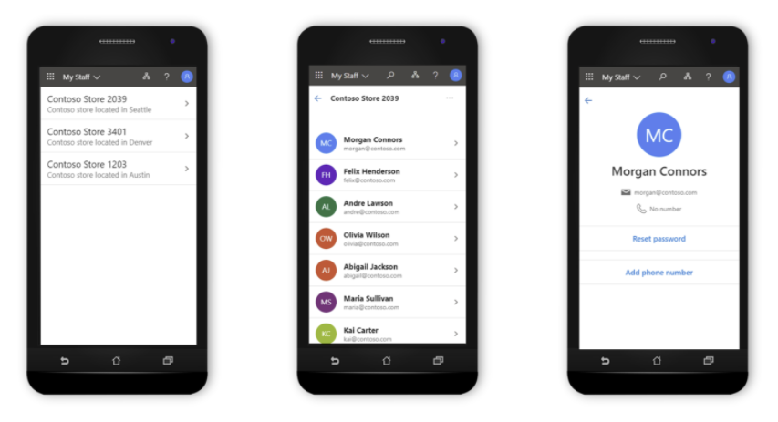
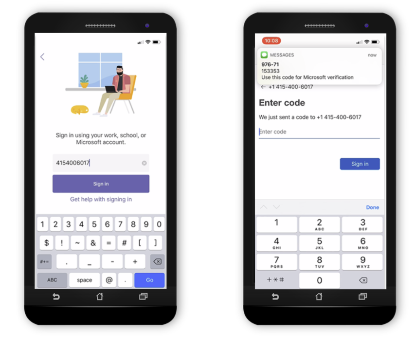
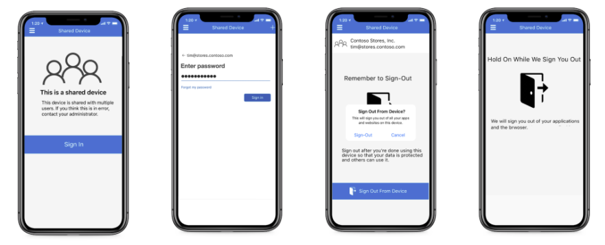

# Frontline worker management

Frontline workers account for over 80 percent of the global workforce. Yet because of high scale, rapid turnover, and fragmented processes, frontline workers often lack the tools to make their demanding jobs a little easier. Frontline worker management brings digital transformation to the entire frontline workforce. The workforce may include managers, frontline workers, operations, and IT.

Frontline worker management empowers the frontline workforce by making the following activities easier to accomplish:

- Streamlining common IT tasks with My Staff
- Easy onboarding of frontline workers through simplified authentication
- Seamless provisioning of shared devices and secure sign-out of frontline workers

## Delegated user management through My Staff

Microsoft Entra ID in the My Staff portal enables delegation of user management. Frontline managers can save valuable time and reduce risks using the [My Staff portal](../roles/my-staff-configure.md). When an administrator enables simplified password resets and phone management directly from the store or factory floor, managers can grant access to employees without routing the request through the help-desk, IT, or operations.

## Accelerated onboarding with simplified authentication

My Staff also enables frontline managers to register their team members' phone numbers for [SMS sign-in](../authentication/howto-authentication-sms-signin.md). In many verticals, frontline workers maintain a local username and password combination, a solution that is often cumbersome, expensive, and error-prone. When IT enables authentication using SMS sign-in, frontline workers can log in with [Single Sign-On (SSO)](../manage-apps/what-is-single-sign-on.md) for Microsoft Teams and other applications using just their phone number and a one-time passcode (OTP) sent via SMS. Single Sign-On makes signing in for frontline workers simple and secure, delivering quick access to the apps they need most.

Frontline managers can also use Managed Home Screen (MHS) application to allow workers to have access to a specific set of applications on their Intune-enrolled Android dedicated devices. The dedicated devices are enrolled with [Microsoft Entra shared device mode](../develop/msal-shared-devices.md). When configured in multi-app kiosk mode in the Microsoft Intune admin center, MHS is automatically launched as the default home screen on the device and appears to the end user as the *only* home screen. To learn more, see how to [configure the Microsoft Managed Home Screen app for Android Enterprise](/mem/intune/apps/app-configuration-managed-home-screen-app).

## Secure sign-out of frontline workers from shared devices

Frontline workers in many companies use shared devices to do inventory management and sales transactions. Sharing devices reduces the IT burden of provisioning and tracking them individually. With shared device sign-out, it's easy for a frontline worker to securely sign out of all apps on any shared device before handing it back to a hub or passing it off to a teammate on the next shift. Frontline workers can use Microsoft Teams to view their assigned tasks. Once a worker signs out of a shared device, Intune and Microsoft Entra ID clear all of the company data so the device can safely be handed off to the next associate. You can choose to integrate this capability into all your line-of-business [iOS](../develop/msal-ios-shared-devices.md) and [Android](../develop/msal-android-shared-devices.md) apps using the [Microsoft Authentication Library](../develop/msal-overview.md).

## Next steps

- For more information on delegated user management, see [My Staff user documentation](https://support.microsoft.com/account-billing/manage-front-line-users-with-my-staff-c65b9673-7e1c-4ad6-812b-1a31ce4460bd).
