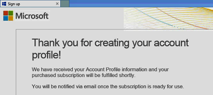

# Sign up for Microsoft Entra ID P1 or P2 editions

You can purchase and associate Microsoft Entra ID P1 or P2 editions with your Azure subscription. If you need to create a new Azure subscription, you'll also need to activate your licensing plan and Microsoft Entra service access.

Before you sign up for Active Directory Premium 1 or Premium 2, you must first determine which of your existing subscription or plan to use:

- Through your existing Azure or Microsoft 365 subscription

- Through your Enterprise Mobility + Security licensing plan

- Through a Microsoft Volume Licensing plan

Signing up using your Azure subscription with previously purchased and activated Microsoft Entra ID licenses, automatically activates the licenses in the same directory. If that's not the case, you must still activate your license plan and your Microsoft Entra ID access. For more information about activating your license plan, see [Activate your new license plan](#activate-your-new-license-plan). For more information about activating your Microsoft Entra ID access, see [Activate your Microsoft Entra ID access](#activate-your-azure-ad-access). 

## Sign up using your existing Azure or Microsoft 365 subscription

As an Azure or Microsoft 365 subscriber, you can purchase the Microsoft Entra ID P1 or P2 editions online. For detailed steps, see [Buy or remove licenses](/microsoft-365/commerce/licenses/buy-licenses?view=o365-worldwide&preserve-view=true).

## Sign up using your Enterprise Mobility + Security licensing plan

Enterprise Mobility + Security is a suite, comprised of Microsoft Entra ID P1 or P2, Azure Information Protection, and Microsoft Intune. If you already have an EMS license, you can get started with Microsoft Entra ID, using one of these licensing options:

For more information about EMS, see [Enterprise Mobility + Security web site](https://www.microsoft.com/cloud-platform/enterprise-mobility-security).

- Try out EMS with a free [Enterprise Mobility + Security E5 trial subscription](https://signup.microsoft.com/Signup?OfferId=87dd2714-d452-48a0-a809-d2f58c4f68b7&ali=1)

- Purchase [Enterprise Mobility + Security E5 licenses](https://signup.microsoft.com/Signup?OfferId=e6de2192-536a-4dc3-afdc-9e2602b6c790&ali=1)

- Purchase [Enterprise Mobility + Security E3 licenses](https://signup.microsoft.com/Signup?OfferId=4BBA281F-95E8-4136-8B0F-037D6062F54C&ali=1)

## Sign up using your Microsoft Volume Licensing plan

Through your Microsoft Volume Licensing plan, you can sign up for Microsoft Entra ID P1 or P2 using one of these two programs, based on the number of licenses you want to get:

- **For 250 or more licenses.** [Microsoft Enterprise Agreement](https://www.microsoft.com/en-us/licensing/licensing-programs/enterprise.aspx)

- **For 5 to 250 licenses.** [Open Volume License](https://www.microsoft.com/en-us/licensing/licensing-programs/open-license.aspx)

For more information about volume licensing purchase options, see [How to purchase through Volume Licensing](https://www.microsoft.com/en-us/licensing/how-to-buy/how-to-buy.aspx).

## Activate your new license plan

If you signed up using a new Microsoft Entra ID license plan, you must activate it for your organization, using the confirmation email sent after purchase.

### To activate your license plan

- Open the confirmation email you received from Microsoft after you signed up, and then select either **Sign In** or **Sign Up**.
   
    

    - **Sign in.** Choose this link if you have an existing tenant, and then sign in using your existing administrator account. You must be a Global Administrator on the tenant where the licenses are being activated.

    - **Sign up.** Choose this link if you want to open the **Create Account Profile** page and create a new Microsoft Entra tenant for your licensing plan.

        

When you're done, you'll see a confirmation box thanking you for activating the license plan for your tenant.

## Activate your Microsoft Entra ID access

If you're adding new Microsoft Entra ID P1 or P2 licenses to an existing subscription, your Microsoft Entra ID access should already be activated. Otherwise, you need to activate Microsoft Entra ID access after you receive the **Welcome email**.  

After your purchased licenses are provisioned in your directory, you'll receive a **Welcome email**. This email confirms that you can start managing your Microsoft Entra ID P1 or P2 or Enterprise Mobility + Security licenses and features. 

> [!TIP]
> You won't be able to access Microsoft Entra ID for your new tenant until you activate Microsoft Entra directory access from the welcome email.

### To activate your Microsoft Entra ID access

1. Open the **Welcome email**, and then select **Sign In**.
   
    

2. After successfully signing in, you'll go through two-step verification using a mobile device.
   
    

The activation process typically takes only a few minutes and then you can use your Microsoft Entra tenant. 

## Next steps

Now that you have Microsoft Entra ID P1 or P2, you can [customize your domain](add-custom-domain.md), add your [corporate branding](./how-to-customize-branding.md), [create a tenant](create-new-tenant.md), and [add groups](./how-to-manage-groups.md) and [users](./add-users.md).
