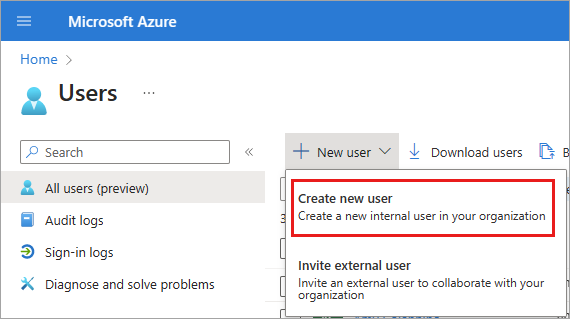
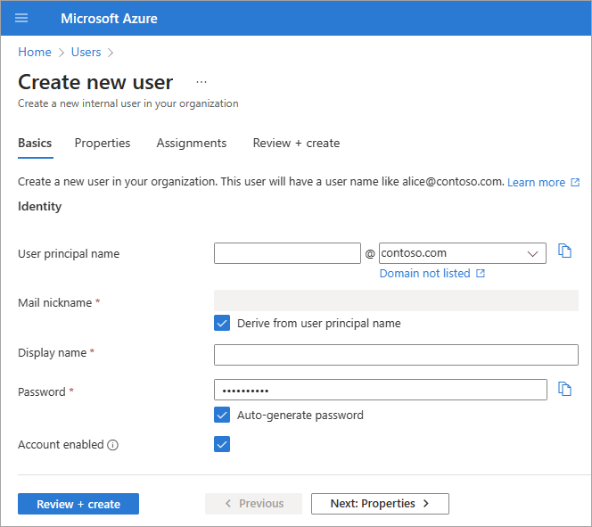
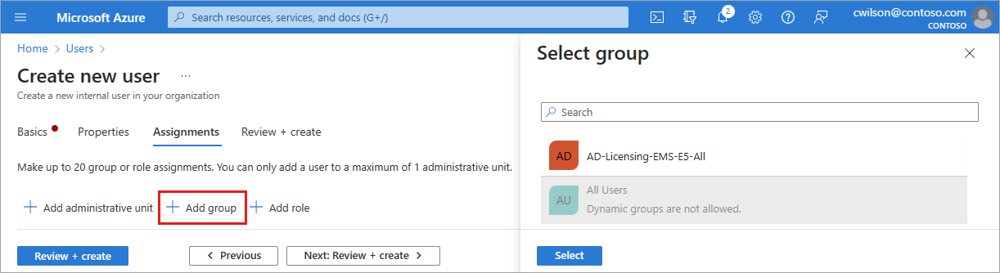
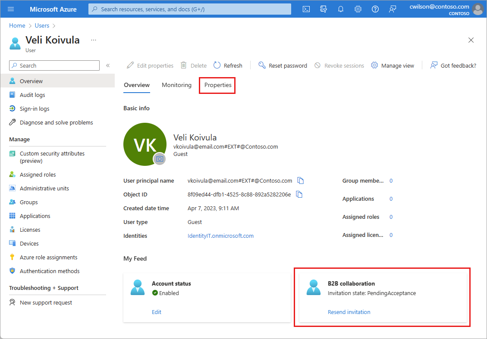

# How to create, invite, and delete users

This article explains how to create a new user, invite an external guest, and delete a user in your tenant. 

Instructions for the legacy create user process can be found in the [Add or delete users](./add-users.md) article.

[!INCLUDE [GDPR-related guidance](../../../includes/gdpr-hybrid-note.md)]

## Before you begin

Before you create or invite a new user, take some time to review the types of users, their authentication methods, and their access within the Microsoft Entra tenant. For example, do you need to create an internal guest, an internal user, or an external guest? Does your new user need guest or member privileges?

- **Internal member**: These users are most likely full-time employees in your organization.
- **Internal guest**: These users have an account in your tenant, but have guest-level privileges. It's possible they were created within your tenant prior to the availability of B2B collaboration.
- **External member**: These users authenticate using an external account, but have member access to your tenant. These types of users are common in [multi-tenant organizations](../multi-tenant-organizations/overview.md#what-is-a-multi-tenant-organization).
- **External guest**: These users are true guests of your tenant who authenticate using an external method and who have guest-level privileges. 

For more information abut the differences between internal and external guests and members, see [B2B collaboration properties](../external-identities/user-properties.md).

Authentication methods vary based on the type of user you create. Internal guests and members have credentials in your Microsoft Entra tenant that can be managed by administrators. These users can also reset their own password. External members authenticate to their home Microsoft Entra tenant and your Microsoft Entra tenant authenticates the user through a federated sign-in with the external member's Microsoft Entra tenant. If external members forget their password, the administrator in their Microsoft Entra tenant can reset their password. External guests set up their own password using the link they receive in email when their account is created.

Reviewing the default user permissions may also help you determine the type of user you need to create. For more information, see [Set default user permissions](users-default-permissions.md)

## Required roles

The required role of least privilege varies based on the type of user you're adding and if you need to assign Microsoft Entra roles at the same time. **Global Administrator** can create users and assign roles, but whenever possible you should use the least privileged role. 

| Role | Task |
| -- | -- |
| Create a new user | User Administrator |
| Invite an external guest | Guest Inviter | 
| Assign Microsoft Entra roles | Privileged Role Administrator |

## Create a new user

[!INCLUDE [portal updates](~/articles/active-directory/includes/portal-update.md)]

1. Sign in to the [Microsoft Entra admin center](https://entra.microsoft.com) as at least a [User Administrator](../roles/permissions-reference.md#user-administrator).

1. Browse to **Identity** > **Users** > **All users**.
1. Select  **New user** > **Create new user**.

    

### Basics

The **Basics** tab contains the core fields required to create a new user. 

- **User principal name**: Enter a unique username and select a domain from the menu after the @ symbol. Select **Domain not listed** if you need to create a new domain. For more information, see [Add your custom domain name](add-custom-domain.md)
- **Mail nickname**: If you need to enter an email nickname that is different from the user principal name you entered, uncheck the **Derive from user principal name** option, then enter the mail nickname.
- **Display name**: Enter the user's name, such as Chris Green or Chris A. Green
- **Password**: Provide a password for the user to use during their initial sign-in. Uncheck the **Auto-generate password** option to enter a different password.
- **Account enabled**: This option is checked by default. Uncheck to prevent the new user from being able to sign-in. You can change this setting after the user is created. This setting was called **Block sign in** in the legacy create user process.

Either select the **Review + create** button to create the new user or **Next: Properties** to complete the next section.

Either select the **Review + create** button to create the new user or **Next: Properties** to complete the next section.

### Properties

There are six categories of user properties you can provide. These properties can be added or updated after the user is created. To manage these details, go to **Identity** > **Users** > **All users** and select a user to update.

- **Identity:** Enter the user's first and last name. Set the User type as either Member or Guest. 
- **Job information:** Add any job-related information, such as the user's job title, department, or manager.
- **Contact information:** Add any relevant contact information for the user.
- **Parental controls:** For organizations like K-12 school districts, the user's age group may need to be provided. *Minors* are 12 and under, *Not adult* are 13-18 years old, and *Adults* are 18 and over. The combination of age group and consent provided by parent options determine the Legal age group classification. The Legal age group classification may limit the user's access and authority.
- **Settings:** Specify the user's global location.

Either select the **Review + create** button to create the new user or **Next: Assignments** to complete the next section.

### Assignments

You can assign the user to an administrative unit, group, or Microsoft Entra role when the account is created. You can assign the user to up to 20 groups or roles. You can only assign the user to one administrative unit. Assignments can be added after the user is created. 

**To assign a group to the new user**:

1. Select **+ Add group**.
1. From the menu that appears, choose up to 20 groups from the list and select the **Select** button.
1. Select the **Review + create** button.

    

**To assign a role to the new user**:

1. Select **+ Add role**.
1. From the menu that appears, choose up to 20 roles from the list and select the **Select** button.
1. Select the **Review + create** button.

**To add an administrative unit to the new user**:

1. Select **+ Add administrative unit**.
1. From the menu that appears, choose one administrative unit from the list and select the **Select** button.
1. Select the **Review + create** button.

### Review and create

The final tab captures several key details from the user creation process. Review the details and select the **Create** button if everything looks good.

## Invite an external user

The overall process for inviting an external guest user is similar, except for a few details on the **Basics** tab and the email invitation process. You can't assign external users to administrative units. 

1. Sign in to the [Microsoft Entra admin center](https://entra.microsoft.com) as at least a [User Administrator](../roles/permissions-reference.md#user-administrator).
1. Browse to **Identity** > **Users** > **All users**.
1. Select  **New user** > **Invite external user**.

    

### Basics for external users

In this section, you're inviting the guest to your tenant using *their email address*. If you need to create a guest user with a domain account, use the [create new user process](#create-a-new-user) but change the **User type** to **Guest**. 

- **Email**: Enter the email address for the guest user you're inviting.
- **Display name**: Provide the display name.
-  **Invitation message**: Select the **Send invite message** checkbox to customize a brief message to the guest. Provide a Cc recipient, if necessary.

### Guest user invitations

When you invite an external guest user by sending an email invitation, you can check the status of the invitation from the user's details.

1. Browse to **Identity** > **Users** > **All users**.
1. Select the invited guest user.
1. In the **My Feed** section, locate the **B2B collaboration** tile. 
    - If the invitation state is **PendingAcceptance**, select the **Resend invitation** link to send another email.
    - You can also select the **Properties** for the user and view the **Invitation state**.

## Add other users

There might be scenarios in which you want to manually create consumer accounts in your Azure Active Directory B2C (Azure AD B2C) directory. For more information about creating consumer accounts, see [Create and delete consumer users in Azure AD B2C](../../active-directory-b2c/manage-users-portal.md).

If you have an environment with both Microsoft Entra ID (cloud) and Windows Server Active Directory (on-premises), you can add new users by syncing the existing user account data. For more information about hybrid environments and users, see [Integrate your on-premises directories with Microsoft Entra ID](../hybrid/whatis-hybrid-identity.md).

## Delete a user

You can delete an existing user using Azure portal.

- You must have a Global Administrator, Privileged Authentication Administrator, or User Administrator role assignment to delete users in your organization.
- Global Administrators and Privileged Authentication Administrators can delete any users including other administrators.
- User Administrators can delete any non-admin users, Helpdesk Administrators, and other User Administrators.
- For more information, see [Administrator role permissions in Microsoft Entra ID](../roles/permissions-reference.md).

To delete a user, follow these steps:

1. Sign in to the [Microsoft Entra admin center](https://entra.microsoft.com) as at least a [User Administrator](../roles/permissions-reference.md#user-administrator).
1. Browse to **Identity** > **Users** > **All users**.
1. Search for and select the user you want to delete.
1. Select **Delete user**.

    

The user is deleted and no longer appears on the **All users** page. The user can be seen on the **Deleted users** page for the next 30 days and can be restored during that time. For more information about restoring a user, see [Restore or remove a recently deleted user using Microsoft Entra ID](./users-restore.md).

When a user is deleted, any licenses consumed by the user are made available for other users.

> [!NOTE]
> To update the identity, contact information, or job information for users whose source of authority is Windows Server Active Directory, you must use Windows Server Active Directory. After you complete the update, you must wait for the next synchronization cycle to complete before you'll see the changes.

## Next steps

* [Learn about B2B collaboration users](../external-identities/add-users-administrator.md)
* [Review the default user permissions](users-default-permissions.md)
* [Add a custom domain](add-custom-domain.md)
