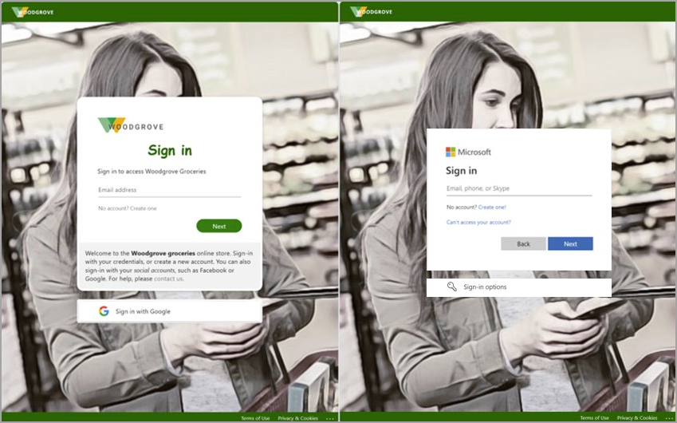
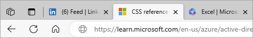
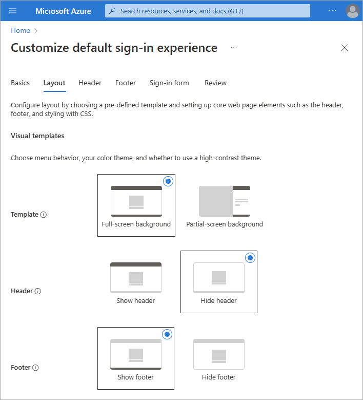
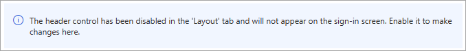
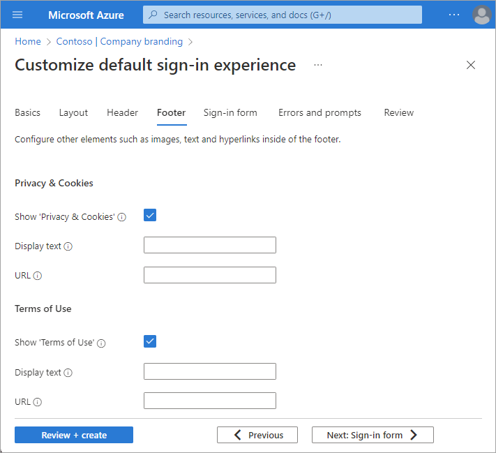
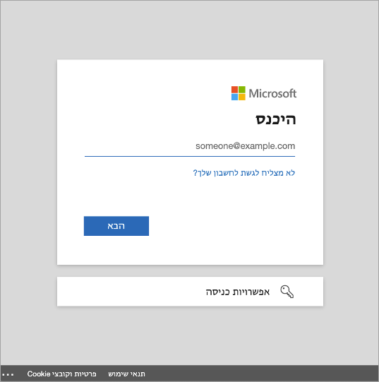

# Configure your company branding

When users authenticate into your corporate intranet or web-based applications, Microsoft Entra ID provides the identity and access management (IAM) service. You can add company branding that applies to all these experiences to create a consistent sign-in experience for your users.

The default sign-in experience is the global look and feel that applies across all sign-ins to your tenant. Before you customize any settings, the default Microsoft branding appears in your sign-in pages. You can customize this default experience with a custom background image and/or color, favicon, layout, header, and footer. You can also upload a custom CSS.

> [!NOTE]
> Instructions for how to manage the **'Stay signed in prompt?'** can be found in the **[Manage the 'Stay signed in?' prompt](how-to-manage-stay-signed-in-prompt.md)** article.

## Prerequisites

Adding custom branding requires one of the following licenses:

- Microsoft Entra ID P1 or P2 1
- Microsoft Entra ID P1 or P2 2
- Office 365 (for Office apps)

For more information about licensing and editions, see the [Sign up for Microsoft Entra ID P1 or P2](./get-started-premium.md) article.

Microsoft Entra ID P1 or P2 editions are available for customers in China using the worldwide instance of Microsoft Entra ID. Microsoft Entra ID P1 or P2 editions aren't currently supported in the Azure service operated by 21Vianet in China

The **Global Administrator** role is required to customize company branding.

## Before you begin

**All branding elements are optional. Default settings will remain, if left unchanged.** For example, if you specify a banner logo but no background image, the sign-in page shows your logo with a default background image from the destination site such as Microsoft 365. Additionally, sign-in page branding doesn't carry over to personal Microsoft accounts. If your users or guests authenticate using a personal Microsoft account, the sign-in page doesn't reflect the branding of your organization.

**Images have different image and file size requirements.** Take note of the image requirements for each option. You may need to use a photo editor to create the right size images. The preferred image type for all images is PNG, but JPG is accepted. 

**Use Microsoft Graph with Microsoft Entra company branding.** Company branding can be viewed and managed using Microsoft Graph on the `/beta` endpoint and the `organizationalBranding` resource type. For more information, see the [organizational branding API documentation](/graph/api/resources/organizationalbranding?view=graph-rest-beta&preserve-view=true).

The branding elements are called out in the following example. Text descriptions are provided following the image.

:::image type="content" source="media/how-to-customize-branding/sign-in-page-map.png" alt-text="Screenshot of the sign-in page, with each of the company branding elements highlighted." lightbox="media/how-to-customize-branding/sign-in-page-map-expanded.png":::

1. **Favicon**: Small icon that appears on the left side of the browser tab.
1. **Header**: Space across the top of the sign-in page, behind the header log.
1. **Header logo**: Logo that appears in the upper-left corner of the sign-in page.
1. **Background image**: The entire space behind the sign-in box.
1. **Page background color**: The entire space behind the sign-in box.
1. **Banner logo**: Logo that appears at the top of the sign-in box
1. **Sign-in page title**: Larger text that appears below the banner logo.
1. **Sign-in page description**: Text to describe the sign-in page.
1. **Username hint and text**: The text that appears before a user enters their information.
1. **Self-service password reset**: A link you can add below the sign-in page text for password resets.
1. **Sign-in page text**: Text you can add below the username field.
1. **Footer link: Privacy & Cookies**: Link you can add to the lower-right corner for privacy information.
1. **Footer: Terms of Use**: Text in the lower-right corner of the page where you can add Terms of use information.
1. **Footer**: Space across the bottom of the page for privacy and Terms of Use information.
1. **Template**: The layout of the page and sign-in boxes.

### User experience

There are some scenarios you to consider when you customize the sign-in pages for your organization's tenant-specific applications.

For Microsoft, Software as a Service (SaaS), and multi-tenant applications such as <https://myapps.microsoft.com>, or <https://outlook.com>, the customized sign-in page appears only after the user types their **Email** or **Phone number** and selects the **Next** button. 

Some Microsoft applications support [Home Realm Discovery](../manage-apps/home-realm-discovery-policy.md) for authentication. In these scenarios, when a customer signs in to a Microsoft Entra common sign-in page, Microsoft Entra ID can use the customer's user name to determine where they should sign in. 

For customers who access applications from a custom URL, the `whr` query string parameter, or a domain variable, can be used to apply company branding at the initial sign-in screen, not just after adding the email or phone number. For example, `whr=contoso.com` would appear in the custom URL for the app. With the Home Realm Discover and domain parameter included, the company branding appears immediately in the first sign-in step. Other domain hints can be included.

In the following examples, replace the contoso.com with your own tenant name, or verified domain name:

- For Microsoft Outlook `https://outlook.com/contoso.com` 
- For SharePoint online `https://contoso.sharepoint.com`
- For my app portal `https://myapps.microsoft.com/?whr=contoso.com` 
- Self-service password reset `https://passwordreset.microsoftonline.com/?whr=contoso.com`

For B2B collaboration end-users who perform cross-tenant sign-ins, their home tenant branding appears, even if there isn't custom branding specified.

In the following example, the company branding for Woodgrove Groceries appears on the left. The example on the right displays the default branding for the user's home tenant.

## How to navigate the company branding process

[!INCLUDE [portal updates](~/articles/active-directory/includes/portal-update.md)]

1. Sign in to the [Microsoft Entra admin center](https://entra.microsoft.com) as a [Global Administrator](../roles/permissions-reference.md#global-administrator).

1. Browse to **Identity** > **User experiences** > **Company branding**.
    - If you currently have a customized sign-in experience, the **Edit** button is available.

    

The sign-in experience process is grouped into sections. At the end of each section, select the **Review + create** button to review what you have selected and submit your changes or the **Next** button to move to the next section.

## Basics

- **Favicon**: Select a PNG or JPG of your logo that appears in the web browser tab.

    

- **Background image**: Select a PNG or JPG to display as the main image on your sign-in page. This image scales and crops according to the window size, but the sign-in prompt may partially block it.

- **Page background color**: If the background image isn't able to load because of a slower connection, your selected background color appears instead.

## Layout

- **Visual Templates**: Customize the layout of your sign-in page using templates or custom CSS.

    - Choose one of two **Templates**: Full-screen or partial-screen background. The full-screen background could obscure your background image, so choose the partial-screen background if your background image is important.
    - The details of the **Header** and **Footer** options are set on the next two sections of the process.
    
    

- **Custom CSS**: Upload custom CSS to replace the Microsoft default style of the page.
    - [Download the CSS template](https://download.microsoft.com/download/7/2/7/727f287a-125d-4368-a673-a785907ac5ab/custom-styles-template-013023.css).
    - View the [CSS template reference guide](reference-company-branding-css-template.md).

## Header

If you haven't enabled the header, go to the **Layout** section and select **Show header**. Once enabled, select a PNG or JPG to display in the header of the sign-in page.

## Footer

If you haven't enabled the footer, go to the **Layout** section and select **Show footer**. Once enabled, adjust the following settings.

- **Show 'Privacy & Cookies'**: This option is selected by default and displays the [Microsoft 'Privacy & Cookies'](https://privacy.microsoft.com/privacystatement) link.
    
    Uncheck this option to hide the default Microsoft link. Optionally provide your own **Display text** and **URL**. The text and links don't have to be related to privacy and cookies.

- **Show 'Terms of Use'**: This option is also selected by default and displays the [Microsoft 'Terms of Use'](https://www.microsoft.com/servicesagreement/) link.

    Uncheck this option to hide the default Microsoft link. Optionally provide your own **Display text** and **URL**. The text and links don't have to be related to your terms of use.

    >[!IMPORTANT]
    >The default Microsoft 'Terms of Use' link is not the same as the Conditional Access Terms of Use. Seeing the terms here doesn't mean you've accepted those terms and conditions. 

    

## Sign-in form

- **Banner logo**: Select a PNG or JPG image file of a banner-sized logo (short and wide) to appear on the sign-in pages.

- **Square logo (light theme)**: Select a square PNG or JPG image file of your logo to be used in browsers that are using a light color theme. This logo is used to represent your organization on the Microsoft Entra web interface and in Windows.

- **Square logo (dark theme)** Select a square PNG or JPG image file of your logo to be used in browsers that are using a dark color theme. This logo is used to represent your organization on the Microsoft Entra web interface and in Windows. If your logo looks good on light and dark backgrounds, there's no need to add a dark theme logo.

- **Username hint text**: Enter hint text for the username input field on the sign-in page. If guests use the same sign-in page, we don't recommend using hint text here.

- **Sign-in page text**: Enter text that appears on the bottom of the sign-in page. You can use this text to communicate additional information, such as the phone number to your help desk or a legal statement. This page is public, so don't provide sensitive information here. This text must be Unicode and can't exceed 1024 characters.

    To begin a new paragraph, use the enter key twice. You can also change text formatting to include bold, italics, an underline, or clickable link. Use the following syntax to add formatting to text: 

    - Hyperlink: `[text](link)` 
    - Bold: `**text**` or `__text__`
    - Italics: `*text*` or `_text_`
    - Underline: `++text++` 
         
    > [!IMPORTANT]
    > Hyperlinks that are added to the sign-in page text render as text in native environments, such as desktop and mobile applications.

- **Self-service password reset**:
    - Show self-service password reset (SSPR): Select the checkbox to turn on SSPR. 
    - Common URL: Enter the destination URL for where your users reset their passwords. This URL appears on the username and password collection screens.
    - Username collection display text: Replace the default text with your own custom username collection text.
    - Password collection display text: Replace the default text with your own customer password collection text.

## Review

All of the available options appear in one list so you can review everything you've customized or left at the default setting. When you're done, select the **Create** button. 

Once your default sign-in experience is created, select the **Edit** button to make any changes. You can't delete a default sign-in experience after it's created, but you can remove all custom settings.

## Customize the sign-in experience by browser language

You can create a personalized sign-in experience for users who sign in using a specific browser language by customizing the branding elements for that browser language. This customization overrides any configurations made to the default branding. If you don't make any changes to the elements, the default elements are displayed.

1. Sign in to the [Microsoft Entra admin center](https://entra.microsoft.com) as a [Global Administrator](../roles/permissions-reference.md#global-administrator).

1. Browse to **Identity** > **User experiences** > **Company branding**.

1. Select **Add browser language**.

The process for customizing the experience is the same as the [default sign-in experience](#basics) process, except you must select a language from the dropdown list in the **Basics** section. We recommend adding custom text in the same areas as your default sign-in experience. 

Microsoft Entra ID supports right-to-left functionality for languages such as Arabic and Hebrew that are read right-to-left. The layout adjusts automatically, based on the user's browser settings.

## Next steps

- [View the CSS template reference guide](reference-company-branding-css-template.md).
- [Learn more about default user permissions in Microsoft Entra ID](../fundamentals/users-default-permissions.md)
- [Manage the 'stay signed in' prompt](how-to-manage-stay-signed-in-prompt.md)
