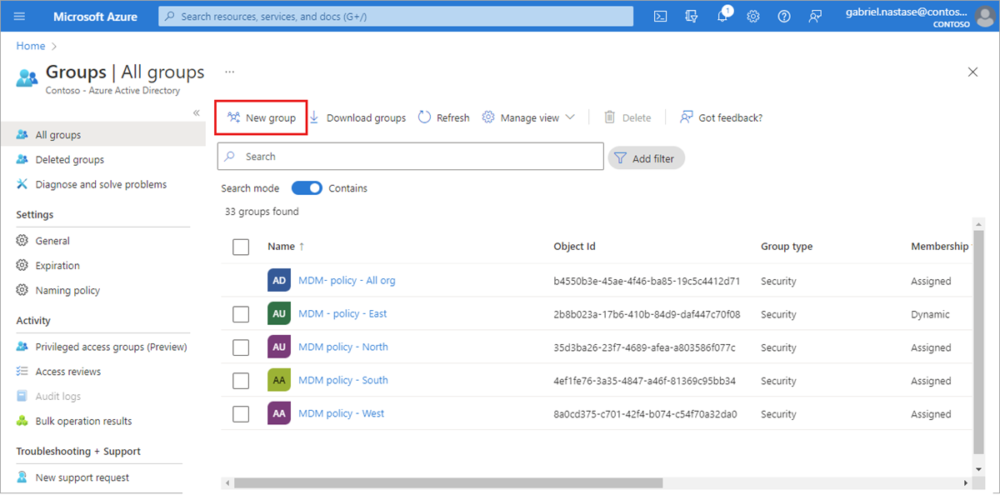
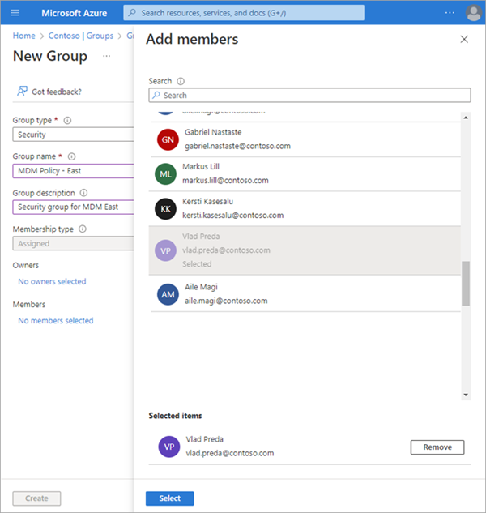
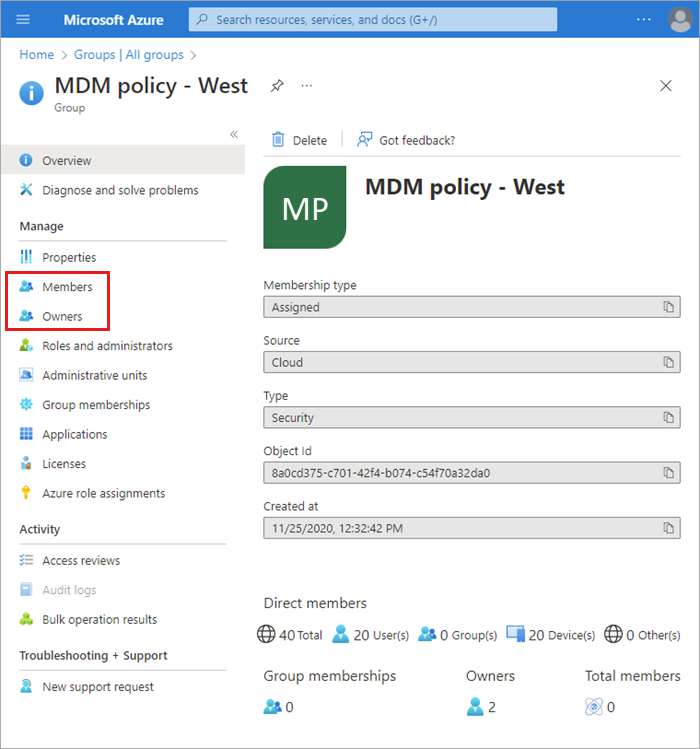
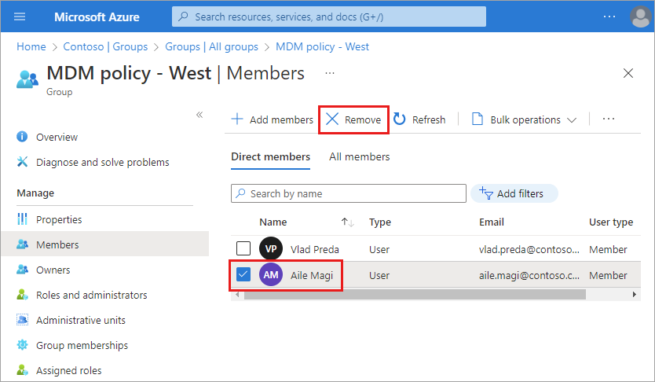
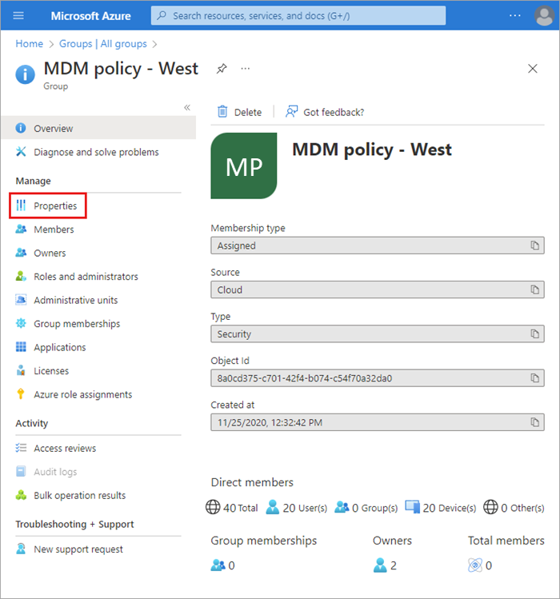
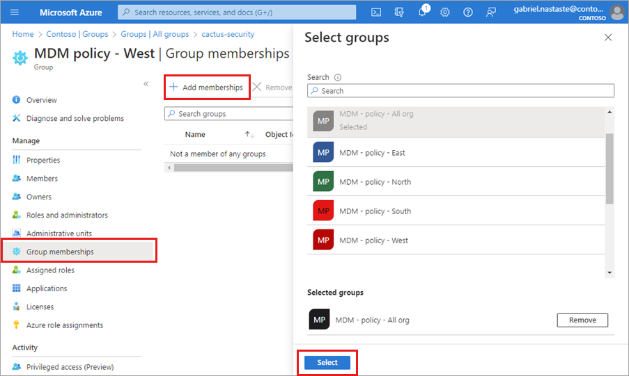
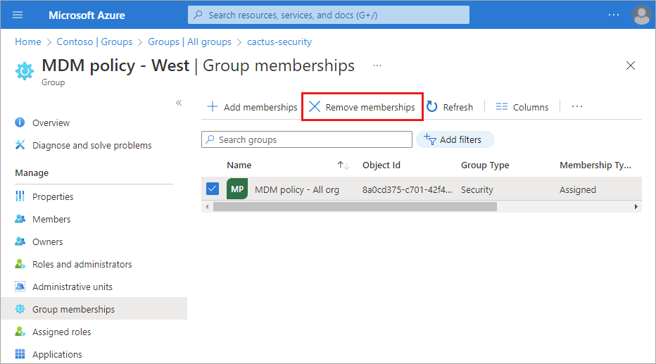

# Manage Microsoft Entra groups and group membership

Microsoft Entra groups are used to manage users that all need the same access and permissions to resources, such as potentially restricted apps and services. Instead of adding special permissions to individual users, you create a group that applies the special permissions to every member of that group. 

This article covers basic group scenarios where a single group is added to a single resource and users are added as members to that group. For more complex scenarios like dynamic memberships and rule creation, see the [Microsoft Entra user management documentation](../enterprise-users/index.yml).

Before adding groups and members, [learn about groups and membership types](concept-learn-about-groups.md) to help you decide which options to use when you create a group.

## Create a basic group and add members

[!INCLUDE [portal updates](~/articles/active-directory/includes/portal-update.md)]

You can create a basic group and add your members at the same time using the Microsoft Entra admin center. Microsoft Entra roles that can manage groups include **Groups Administrator**, **User Administrator**, **Privileged Role Administrator**, or **Global Administrator**. Review the [appropriate Microsoft Entra roles for managing groups](../roles/delegate-by-task.md#groups)

To create a basic group and add members:

1. Sign in to the [Microsoft Entra admin center](https://entra.microsoft.com) as at least a [Groups Administrator](../roles/permissions-reference.md#groups-administrator).

1. Browse to **Identity** > **Groups** > **All groups**.
 
1. Select **New group**.

    

1. Select a **Group type**. For more information on group types, see the [learn about groups and membership types](concept-learn-about-groups.md) article.

    - Selecting the **Microsoft 365** Group type enables the **Group email address** option.

1. Enter a **Group name.** Choose a name that you'll remember and that makes sense for the group. A check will be performed to determine if the name is already in use. If the name is already in use, you'll be asked to change the name of your group.

    - The name of the group can't start with a space. Starting the name with a space prevents the group from appearing as an option for steps such as adding role assignments to group members.

1. **Group email address**: Only available for Microsoft 365 group types. Enter an email address manually or use the email address built from the Group name you provided.
 
1. **Group description.** Add an optional description to your group.

1. Switch the **Microsoft Entra roles can be assigned to the group** setting to yes to use this group to assign Microsoft Entra roles to members.
    - This option is only available with P1 or P2 licenses.
    - You must have the **Privileged Role Administrator** or **Global Administrator** role.
    - Enabling this option automatically selects **Assigned** as the Membership type.
    - The ability to add roles while creating the group is added to the process.
    - [Learn more about role-assignable groups](../roles/groups-create-eligible.md).

1. Select a **Membership type.** For more information on membership types, see the [learn about groups and membership types](concept-learn-about-groups.md) article.

1. Optionally add **Owners** or **Members**. Members and owners can be added after creating your group.
    1. Select the link under **Owners** or **Members** to populate a list of every user in your directory.
    1. Choose users from the list and then select the **Select** button at the bottom of the window.

    

1. Select **Create**. Your group is created and ready for you to manage other settings.

### Turn off group welcome email

A welcome notification is sent to all users when they're added to a new Microsoft 365 group, regardless of the membership type. When an attribute of a user or device changes, all dynamic group rules in the organization are processed for potential membership changes. Users who are added then also receive the welcome notification. You can turn off this behavior in [Exchange PowerShell](/powershell/module/exchange/users-and-groups/Set-UnifiedGroup).

## Add or remove members and owners

Members and owners can be added to and removed from existing groups. The process is the same for members and owners. You'll need the **Groups Administrator** or **User Administrator** role to add and remove members and owners.

Need to add multiple members at one time? Learn about the [add members in bulk](../enterprise-users/groups-bulk-import-members.md) option.

### Add members or owners of a group

1. Sign in to the [Microsoft Entra admin center](https://entra.microsoft.com) as at least a [Groups Administrator](../roles/permissions-reference.md#groups-administrator).

1. Browse to **Identity** > **Groups** > **All groups**.

1. Select the group you need to manage.

1. Select either **Members** or **Owners**.

    

1. Select **+ Add** (members or owners).

1. Scroll through the list or enter a name in the search box. You can choose multiple names at one time. When you're ready, select the **Select** button.

    The **Group Overview** page updates to show the number of members who are now added to the group.

### Remove members or owners of a group

1. Sign in to the [Microsoft Entra admin center](https://entra.microsoft.com) as at least a [Groups Administrator](../roles/permissions-reference.md#groups-administrator).

1. Browse to **Identity** > **Groups** > **All groups**.

1. Select the group you need to manage.

1. Select either **Members** or **Owners**.

1. Check the box next to a name from the list and select the **Remove** button.

    

## Edit group settings

You can edit a group's name, description, or membership type. You'll need the **Groups Administrator** or **User Administrator** role to edit a group's settings.

To edit your group settings:

1. Sign in to the [Microsoft Entra admin center](https://entra.microsoft.com) as at least a [Groups Administrator](../roles/permissions-reference.md#groups-administrator).

1. Browse to **Identity** > **Groups** > **All groups**.

1. Scroll through the list or enter a group name in the search box. Select the group you need to manage.

1. Select **Properties** from the side menu.

    

1. Update the **General settings** information as needed, including:

    - **Group name.** Edit the existing group name.
    
    - **Group description.** Edit the existing group description.

    - **Group type.** You can't change the type of group after it's been created. To change the **Group type**, you must delete the group and create a new one.
    
    - **Membership type.** Change the membership type. If you enabled the **Microsoft Entra roles can be assigned to the group** option, you can't change the membership type. For more info about the available membership types, see the [learn about groups and membership types](concept-learn-about-groups.md) article. 
    
    - **Object ID.** You can't change the Object ID, but you can copy it to use in your PowerShell commands for the group. For more info about using PowerShell cmdlets, see [Microsoft Entra cmdlets for configuring group settings](../enterprise-users/groups-settings-v2-cmdlets.md).

## Add or remove a group from another group

You can add an existing Security group to another Security group (also known as nested groups). Depending on the group types, you can add a group as a member of another group, just like a user, which applies settings like roles and access to the nested groups. You'll need the **Groups Administrator** or **User Administrator** role to edit group membership.

We currently don't support:
- Adding groups to a group synced with on-premises Active Directory.
- Adding Security groups to Microsoft 365 groups.
- Adding Microsoft 365 groups to Security groups or other Microsoft 365 groups.
- Assigning apps to nested groups.
- Applying licenses to nested groups.
- Adding distribution groups in nesting scenarios.
- Adding security groups as members of mail-enabled security groups.
- Adding groups as members of a role-assignable group.

### Add a group to another group

1. Sign in to the [Microsoft Entra admin center](https://entra.microsoft.com) as at least a [Groups Administrator](../roles/permissions-reference.md#groups-administrator).

1. Browse to **Identity** > **Groups** > **All groups**.

1. On the **All groups** page, search for and select the group you want to become a member of another group.

    >[!Note]
    >You only can add your group as a member to one other group at a time. Wildcard characters aren't supported in the **Select Group** search box.

1. On the group Overview page, select **Group memberships** from the side menu.

1.  Select **+ Add memberships**.

1.  Locate the group you want your group to be a member of and choose **Select**. 

    For this exercise, we're adding "MDM policy - West" to the "MDM policy - All org" group. The "MDM - policy - West" group will have the same access as the "MDM policy - All org" group.

    

Now you can review the "MDM policy - West - Group memberships" page to see the group and member relationship.

For a more detailed view of the group and member relationship, select the parent group name (MDM policy - All org) and take a look at the "MDM policy - West" page details.

### Remove a group from another group
You can remove an existing Security group from another Security group; however, removing the group also removes any inherited access for its members.

1. On the **All groups** page, search for and select the group you need to remove as a member of another group.

1. On the group Overview page, select **Group memberships**.

1. Select the parent group from the **Group memberships** page.

1. Select **Remove**.

    For this exercise, we're now going to remove "MDM policy - West" from the "MDM policy - All org" group.

    

## Delete a group

You can delete a group for any number of reasons, but typically it will be because you:

- Choose the incorrect **Group type** option.
- Created a duplicate group by mistake. 
- No longer need the group.

1. Sign in to the [Microsoft Entra admin center](https://entra.microsoft.com) as at least a [Groups Administrator](../roles/permissions-reference.md#groups-administrator).

1. Browse to **Identity** > **Groups** > **All groups**.

1. Search for and select the group you want to delete.

1. Select **Delete**.

## Next steps

- [Learn about groups and assigning access rights to groups](concept-learn-about-groups.md)
- [Manage groups using PowerShell commands](../enterprise-users/groups-settings-v2-cmdlets.md)
- [Manage dynamic rules for users in a group](../enterprise-users/groups-create-rule.md)
- [Scenarios, limitations, and known issues using groups to manage licensing in Microsoft Entra ID](../enterprise-users/licensing-group-advanced.md#limitations-and-known-issues)
- [Associate or add an Azure subscription to Microsoft Entra ID](./how-subscriptions-associated-directory.md)
