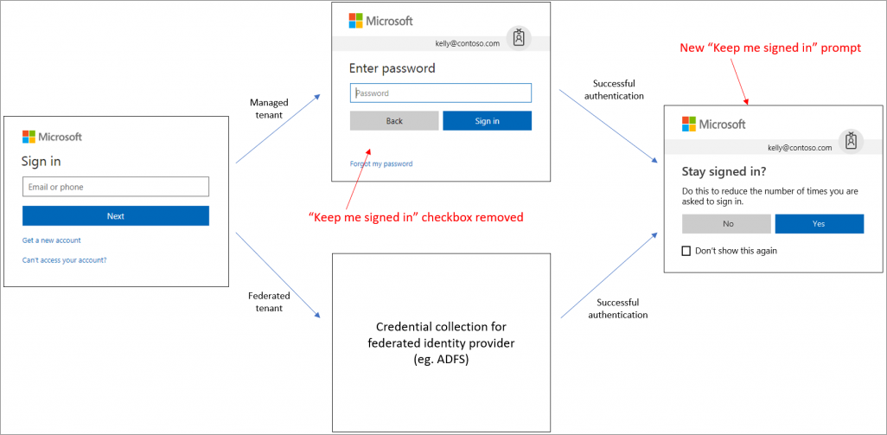
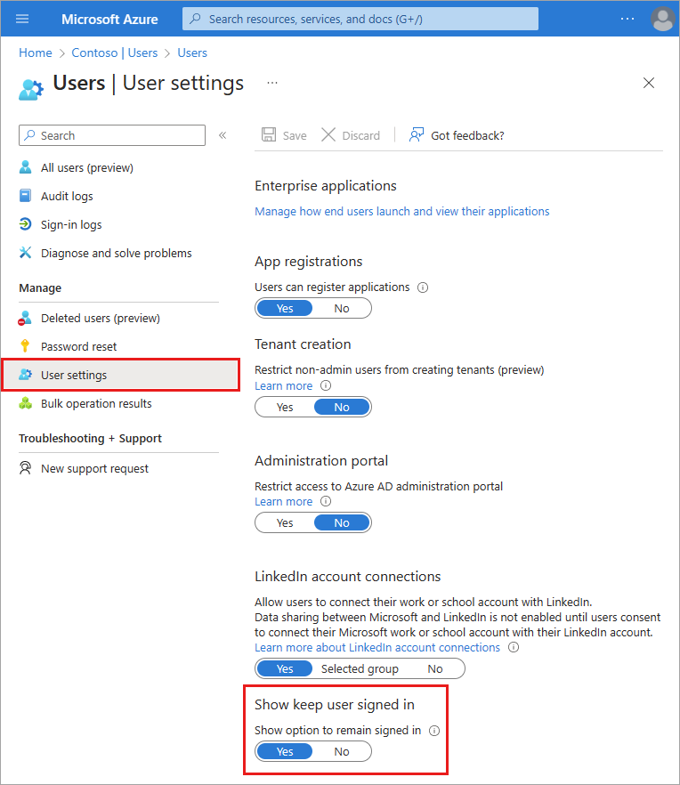

# Manage the 'Stay signed in?' prompt

The **Stay signed in?** prompt appears after a user successfully signs in. This process is known as **Keep me signed in** (KMSI) and was previously part of the [customize branding](how-to-customize-branding.md) process.

This article covers how the KMSI process works, how to enable it for customers, and how to troubleshoot KMSI issues.

## How does it work? 

If a user answers **Yes** to the **'Stay signed in?'** prompt, a persistent authentication cookie is issued. The cookie must be stored in session for KMSI to work. KMSI won't work with locally stored cookies. If KMSI isn't enabled, a non-persistent cookie is issued and lasts for 24 hours or until the browser is closed. 

The following diagram shows the user sign-in flow for a managed tenant and federated tenant using the KMSI in prompt. This flow contains smart logic so that the **Stay signed in?** option won't be displayed if the machine learning system detects a high-risk sign-in or a sign-in from a shared device. For federated tenants, the prompt will show after the user successfully authenticates with the federated identity service.

Some features of SharePoint Online and Office 2010 depend on users being able to choose to remain signed in. If you uncheck the **Show option to remain signed in** option, your users may see other unexpected prompts during the sign-in process.

## License and role requirements

Configuring the 'keep me signed in' (KMSI) option requires one of the following licenses:

- Azure AD Premium 1
- Azure AD Premium 2
- Office 365 (for Office apps)
- Microsoft 365

You must have the **Global Administrator** role to enable the 'Stay signed in?' prompt.

## Enable the 'Stay signed in?' prompt

The KMSI setting is managed in the **User settings** of Azure Active Directory (Azure AD).

1. Sign in to the [Azure portal](https://portal.azure.com/).
1. Go to **Azure Active Directory** > **Users** > **User settings**.
1. Set the **Show keep user signed in** toggle to **Yes**.

    

## Troubleshoot 'Stay signed in?' issues

If a user doesn't act on the **Stay signed in?** prompt but abandons the sign-in attempt, a sign-in log entry appears in the Azure AD **Sign-ins** page. The prompt the user sees is called an "interrupt."

Details about the sign-in error are found in the **Sign-in logs** in Azure AD. Select the impacted user from the list and locate the following details in the **Basic info** section.

* **Sign in error code**: 50140
* **Failure reason**: This error occurred due to "Keep me signed in" interrupt when the user was signing in.

You can stop users from seeing the interrupt by setting the **Show option to remain signed in** setting to **No** in the user settings. This setting disables the KMSI prompt for all users in your Azure AD directory.

You also can use the [persistent browser session controls in Conditional Access](../conditional-access/howto-conditional-access-session-lifetime.md) to prevent users from seeing the KMSI prompt. This option allows you to disable the KMSI prompt for a select group of users (such as the global administrators) without affecting sign-in behavior for everyone else in the directory.

To ensure that the KMSI prompt is shown only when it can benefit the user, the KMSI prompt is intentionally not shown in the following scenarios:

* User is signed in via seamless SSO and integrated Windows authentication (IWA)
* User is signed in via Active Directory Federation Services and IWA
* User is a guest in the tenant
* User's risk score is high
* Sign-in occurs during user or admin consent flow
* Persistent browser session control is configured in a conditional access policy

## Next steps

- [Learn how to customize branding for sign-in experiences](how-to-customize-branding.md)
- [Manage user settings in Azure AD](how-to-manage-user-profile-info.md)
