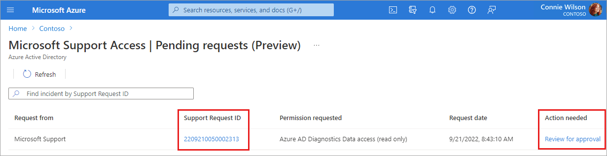
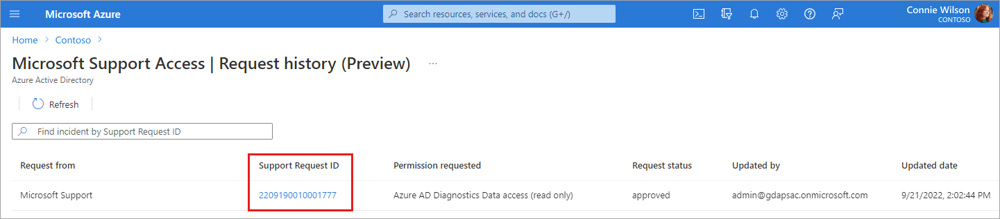
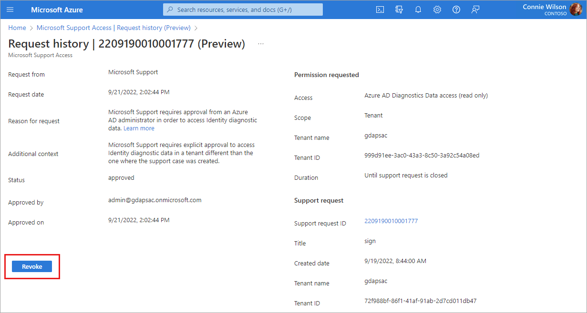

# Managing Microsoft Support Access Requests (preview)

You can use the Azure Active Directory (Azure AD) administration portal to manage Microsoft Support Access Requests (preview). Microsoft Support Access Requests enable you to give Microsoft Support engineers access to [diagnostic data](concept-diagnostic-data-access.md) in your identity service to help solve support requests you submitted to Microsoft.

Only certain Azure AD roles are authorized to manage Microsoft Support Access Requests. To manage Microsoft Support Access Requests, a role must have the permission `microsoft.azure.supportTickets/allEntities/allTasks`. To see which Azure AD roles have this permission, search the [Azure AD built-in roles](../roles/permissions-reference.md) for the required permission.

## Microsoft Support Access Request workflow

In many situations, enabling the collection **Advanced diagnostic information** during the creation of a support access request is sufficient for troubleshooting your issue. In some situations though, a separate approval may be needed to allow Microsoft support to access your identity diagnostic data.

If your scenario warrants this special approval, a Microsoft support engineer submits a Microsoft Support Access Request. A notification appears in the Azure portal for the tenant where the initial support request was filed. This notification appears in the Azure portal for the user who submitted the request. 

## Pending requests

When the Microsoft support engineer assigned to your case tells you they have created a Microsoft Support Access Request, you need to approve that request in order for Microsoft Support to access your identity diagnostic data. 

*ALT*

When a notification for a Microsoft Support Access Request in your tenant, you need to approve that request in order for Microsoft Support to access your identity diagnostic data. 

### See your pending requests

1. Sign in to the [Azure portal](https://portal.azure.com) and navigate to **Diagnose and solve problems**.

1. Select **Pending requests** from the **Microsoft Support Access Requests (Preview)** section at the bottom of the page.    

1. Select the **Support request ID** link for the request you need to approve.

    You can also select the **Review for approval** link.

     

### Pending request details

The **Pending request** page shows information about your support case, and the reason that Microsoft Support needs your approval in order to access your diagnostic data.

- To approve the Support Access Request, select the **Approve** button.
    - Microsoft Support now has *read-only* access to your identity diagnostic data until your support request is completed.
- To reject the Support Access Request, select the **Reject** button.
    - Microsoft Support does *not* have access to your identity diagnostic data.
    - A message appears, indicating this choice may result in slower resolution of your support request.
    - Your support engineer will ask you for data needed to diagnose the issue, and you'll need to collect and provide that information to your support engineer. 

## Approved access

To view all Support Access Requests for your tenant that are no longer pending and less than 30 days old, navigate to the **Diagnose and solve problems** page in Azure AD, select **Approved access**. 

Select the **Support request ID** link to see the details of the Support Access Request. The details page shows information about your support request.

Select the **Revoke** button to revoke access to an **Approved** Support Access Request. The status of a **Rejected, Revoked,** or **Completed** Support Access request can't be changed. 

When your support request is closed, the status of an approved Microsoft Support Access Request is automatically set to **Completed.** Microsoft Support Access Requests remain in **Approved access** for 30 days.

## Next steps

- [How to create a support request](how-to-get-support.md)

- [Learn about the diagnostic data Azure identity support can access](concept-diagnostic-data-access.md)
