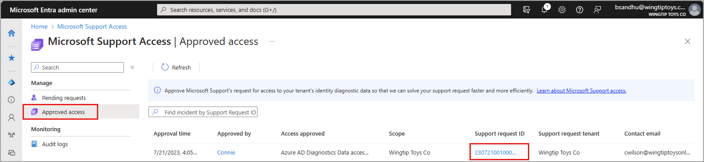
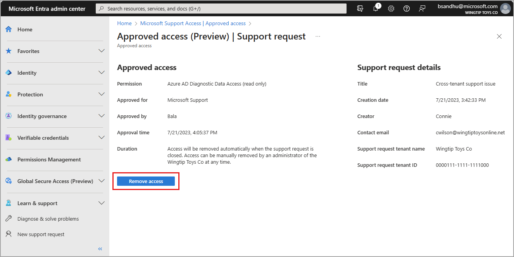

# Manage Microsoft Support access requests (preview)

You can use the Microsoft Entra admin center and the Azure portal to manage Microsoft Support access requests (preview). Microsoft Support access requests enable you to [give Microsoft Support engineers access to identity diagnostic data](concept-support-access-requests.md) in your identity service to help solve support requests you submitted to Microsoft.

## Prerequisites

Only certain Microsoft Entra roles are authorized to manage Microsoft Support access requests. To manage Microsoft Support access requests, a role must have the permission `microsoft.azure.supportTickets/allEntities/allTasks`. To see which Microsoft Entra roles have this permission, search the [Microsoft Entra built-in roles](../roles/permissions-reference.md) for the required permission.

## View support access requests

1. Sign in to the [Microsoft Entra admin center](https://entra.microsoft.com) as at least a [Service Support Administrator](../roles/permissions-reference.md#service-support-administrator).

1. Browse to **Learn & support** > **Diagnose and solve problems**.

1. Scroll to the bottom of the page and select **Approved access** from the **Microsoft Support Access Requests** section.

    :::image type="content" source="media/how-to-manage-support-access-requests/diagnose-solve-problems-access-requests.png" alt-text="Screenshot of the Diagnose and solve problems page with the Manage pending requests link highlighted." lightbox="media/how-to-manage-support-access-requests/diagnose-solve-problems-access-requests-expanded.png":::

1. Select the **Support request ID** link for the request you need to approve.

    

## Revoke access to an approved support access request

Closing a support request automatically revokes the support engineer's access to your identity diagnostic data. You can manually revoke Microsoft Support's access to identity diagnostic data for the support request *before* your support request is closed. 

Select the **Remove access** button to revoke access to an approved support access request. 

When your support request is closed, the status of an approved Microsoft Support access request is automatically set to **Completed.** Microsoft Support access requests remain in the **Approved access** list for 30 days.

## Next steps

- [Approve Microsoft Support access requests](how-to-approve-support-access-requests.md)
- [View Microsoft Support access request logs](how-to-view-support-access-request-logs.md)
- [Learn how Microsoft uses data for Azure support](https://azure.microsoft.com/support/legal/support-diagnostic-information-collection/)
