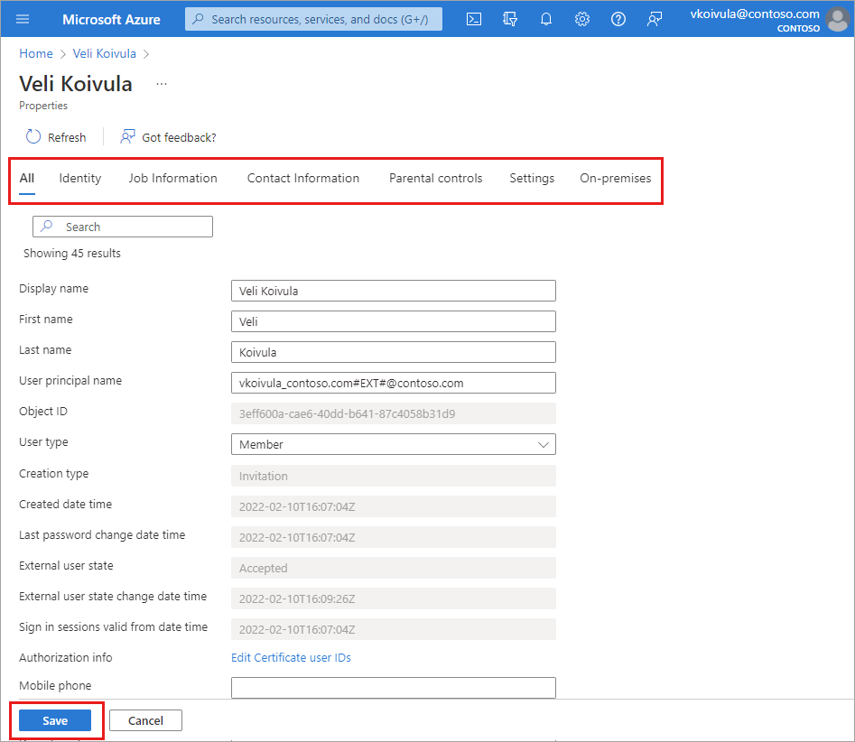
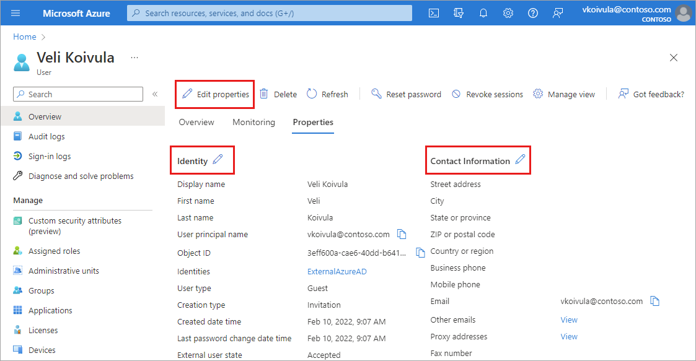
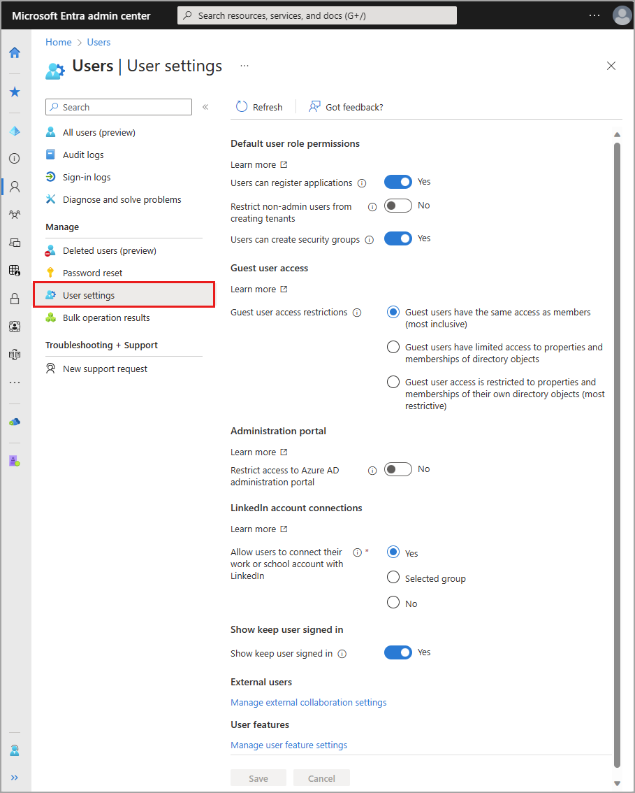

# Add or update a user's profile information and settings
A user's profile information and settings can be managed on an individual basis and for all users in your directory. When you look at these settings together, you can see how permissions, restrictions, and other connections work together.

This article covers how to add user profile information, such as a profile picture and job-specific information. You can also choose to allow users to connect their LinkedIn accounts or restrict access to the Azure AD administration portal. Some settings may be managed in more than one area of Azure AD. For more information about adding new users, see [How to add or delete users in Azure Active Directory](add-users-azure-active-directory.md). 

## Add or change profile information

[!INCLUDE [portal updates](~/articles/active-directory/includes/portal-update.md)]

When new users are created, only some details are added to their user profile. If your organization needs more details, they can be added after the user is created. 

1. Sign in to the [Azure portal](https://portal.azure.com) in the User Administrator role for the organization.

1. Go to **Azure Active Directory** > **Users** and select a user.
   
1. There are two ways to edit user profile details. Either select **Edit properties** from the top of the page or select **Properties**.

    

1. After making any changes, select the **Save** button. 

If you selected the **Edit properties option**:
   - The full list of properties appears in edit mode on the **All** category.
   - To edit properties based on the category, select a category from the top of the page.
   - Select the **Save** button at the bottom of the page to save any changes.
    
   
    
If you selected the **Properties tab option**:
   - The full list of properties appears for you to review.
   - To edit a property, select the pencil icon next to the category heading.
   - Select the **Save** button at the bottom of the page to save any changes.
    
   

### Profile categories
There are six categories of profile details you may be able to edit. 

- **Identity:** Add or update other identity values for the user, such as a married last name. You can set this name independently from the values of First name and Last name. For example, you could use it to include initials, a company name, or to change the sequence of names shown. If you have two users with the same name, such as ‘Chris Green,’ you could use the Identity string to set their names to 'Chris B. Green' and 'Chris R. Green.'

- **Job information:** Add any job-related information, such as the user's job title, department, or manager.

- **Contact info:** Add any relevant contact information for the user.

- **Parental controls:** For organizations like K-12 school districts, the user's age group may need to be provided. *Minors* are 12 and under, *Not adult* are 13-18 years old, and *Adults* are 18 and over. The combination of age group and consent provided by parent options determine the Legal age group classification. The Legal age group classification may limit the user's access and authority.

- **Settings:** Decide whether the user can sign in to the Azure Active Directory tenant. You can also specify the user's global location.

- **On-premises:** Accounts synced from Windows Server Active Directory include other values not applicable to Azure AD accounts.

> [!Note]
> You must use Windows Server Active Directory to update the identity, contact info, or job info for users whose source of authority is Windows Server Active Directory. After you complete your update, you must wait for the next synchronization cycle to complete before you'll see the changes.

### Add or edit the profile picture
On the user's overview page, select the camera icon in the lower-right corner of the user's thumbnail. If no image has been added, the user's initials appear here. This picture appears in Azure Active Directory and on the user's personal pages, such as the myapps.microsoft.com page. 

All your changes are saved for the user.

> [!Note]
> If you're having issues updating a user's profile picture, please ensure that your Office 365 Exchange Online Enterprise App is Enabled for users to sign in.

## Manage settings for all users
In the **User settings** area of Azure AD, you can adjust several settings that affect all users. Some settings are managed in a separate area of Azure AD and linked from this page. These settings require the Global Administrator role.

Go to **Azure AD** > **User settings**. 

The following settings can be managed from Azure AD **User settings**.

- Allow users to register their own applications
- Prevent non-admins from creating their own tenants
    - For more information, see [default user permissions](users-default-permissions.md#restrict-member-users-default-permissions)
- Allow users to create security groups
- Guest user access restrictions
    - Guest users have the same access as members (most inclusive)
    - Guest users have limited access to properties and memberships of directory objects
    - Guest user access is restricted to properties and memberships of their own directory objects (most restrictive)
- Restrict access to the Azure AD administration portal
- [Allow users to connect their work or school account with LinkedIn](../enterprise-users/linkedin-user-consent.md)
- [Enable the "Stay signed in?" prompt](how-to-manage-stay-signed-in-prompt.md)
- Manage external collaboration settings
    - [Guest user access](../enterprise-users/users-restrict-guest-permissions.md)
    - [Guest invite setting](../external-identities/external-collaboration-settings-configure.md)
    - [External user leave settings](../external-identities/self-service-sign-up-user-flow.md#enable-self-service-sign-up-for-your-tenant)
    - Collaboration restrictions
- Manage user feature settings
    - Users can use preview features for My Apps
    - Administrators can access My Staff

## Next steps

- [Add or delete users](add-users-azure-active-directory.md)

- [Assign roles to users](active-directory-users-assign-role-azure-portal.md)

- [Create a basic group and add members](active-directory-groups-create-azure-portal.md)

- [View Azure AD enterprise user management documentation](../enterprise-users/index.yml).
