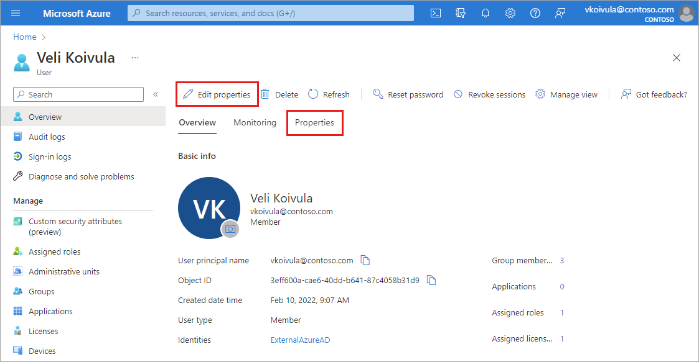
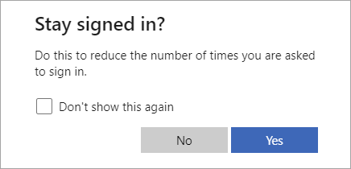

# Add or update a user's profile information and settings
A user's profile information and settings can be managed on an individual basis and for all users in your directory. When you look at these settings together, you can see how permissions, restrictions, and other connections work together.

This article covers how to add user profile information, such as a profile picture and job-specific information. You can also choose to allow users to connect their LinkedIn accounts or restrict access to the Azure AD administration portal. Some settings may be managed in more than one area of Azure AD. For more information about adding new users, see [How to add or delete users in Azure Active Directory](add-users-azure-active-directory.md). 

## Add or change profile information
When new users are created, only some details are added to their user profile. If your organization needs more details, they can be added after the user is created. 

1. Sign in to the [Azure portal](https://portal.azure.com/) in the User Administrator role for the organization.

1. Go to **Azure Active Directory** > **Users** and select a user.
   
1. There are two ways to edit user profile details. Either select **Edit properties** from the top of the page or select **Properties**.

    

1. After making any changes, select the **Save** button. 

If you selected the **Edit properties option**:
   - The full list of properties appears in edit mode on the **All** category.
   - To edit properties based on the category, select a category from the top of the page.
   - Select the **Save** button at the bottom of the page to save any changes.
    
   
    
If you selected the **Properties tab option**:
   - The full list of properties appears for you to review.
   - To edit a property, select the pencil icon next to the category heading.
   - Select the **Save** button at the bottom of the page to save any changes.
    
   

### Profile categories
There are six categories of profile details you may be able to edit. 

- **Identity:** Add or update other identity values for the user, such as a married last name. You can set this name independently from the values of First name and Last name. For example, you could use it to include initials, a company name, or to change the sequence of names shown. If you have two users with the same name, such as ‘Chris Green,’ you could use the Identity string to set their names to 'Chris B. Green' and 'Chris R. Green.'

- **Job information:** Add any job-related information, such as the user's job title, department, or manager.

- **Contact info:** Add any relevant contact information for the user.

- **Parental controls:** For organizations like K-12 school districts, the user's age group may need to be provided. *Minors* are 12 and under, *Not adult* are 13-18 years old, and *Adults* are 18 and over. The combination of age group and consent provided by parent options determine the Legal age group classification. The Legal age group classification may limit the user's access and authority.

- **Settings:** Decide whether the user can sign in to the Azure Active Directory tenant. You can also specify the user's global location.

- **On-premises:** Accounts synced from Windows Server Active Directory include other values not applicable to Azure AD accounts.

    >[!Note]
    >You must use Windows Server Active Directory to update the identity, contact info, or job info for users whose source of authority is Windows Server Active Directory. After you complete your update, you must wait for the next synchronization cycle to complete before you'll see the changes.

### Add or edit the profile picture
On the user's overview page, select the camera icon in the lower-right corner of the user's thumbnail. If no image has been added, the user's initials appear here. This picture appears in Azure Active Directory and on the user's personal pages, such as the myapps.microsoft.com page. 

All your changes are saved for the user.

>[!Note]
> If you're having issues updating a user's profile picture, please ensure that your Office 365 Exchange Online Enterprise App is Enabled for users to sign in.

## Manage settings for all users
In the **User settings** area of Azure AD, you can adjust several settings that affect all users, such as restricting access to the Azure AD administration portal, how external collaboration is managed, and providing users the option to connect their LinkedIn account. Some settings are managed in a separate area of Azure AD and linked from this page.

Go to **Azure AD** > **User settings**.

### Learn about the 'Stay signed in?' prompt

The **Stay signed in?** prompt appears after a user successfully signs in. This process is known as **Keep me signed in** (KMSI). If a user answers **Yes** to this prompt, a persistent authentication cookie is issued. The cookie must be stored in session for KMSI to work. KMSI won't work with locally stored cookies. If KMSI isn't enabled, a non-persistent cookie is issued and lasts for 24 hours or until the browser is closed.

The following diagram shows the user sign-in flow for a managed tenant and federated tenant using the KMSI in prompt. This flow contains smart logic so that the **Stay signed in?** option won't be displayed if the machine learning system detects a high-risk sign-in or a sign-in from a shared device. For federated tenants, the prompt will show after the user successfully authenticates with the federated identity service.

The KMSI setting is available in **User settings**. Some features of SharePoint Online and Office 2010 depend on users being able to choose to remain signed in. If you uncheck the **Show option to remain signed in** option, your users may see other unexpected prompts during the sign-in process.

Configuring the 'keep me signed in' (KMSI) option requires one of the following licenses:

- Azure AD Premium 1
- Azure AD Premium 2
- Office 365 (for Office apps)
- Microsoft 365

#### Troubleshoot 'Stay signed in?' issues

If a user doesn't act on the **Stay signed in?** prompt but abandons the sign-in attempt, a sign-in log entry appears in the Azure AD **Sign-ins** page. The prompt the user sees is called an "interrupt."

Details about the sign-in error are found in the **Sign-in logs** in Azure AD. Select the impacted user from the list and locate the following error code details in the **Basic info** section.

* **Sign in error code**: 50140
* **Failure reason**: This error occurred due to "Keep me signed in" interrupt when the user was signing in.

You can stop users from seeing the interrupt by setting the **Show option to remain signed in** setting to **No** in the user settings. This setting disables the KMSI prompt for all users in your Azure AD directory.

You also can use the [persistent browser session controls in Conditional Access](../conditional-access/howto-conditional-access-session-lifetime.md) to prevent users from seeing the KMSI prompt. This option allows you to disable the KMSI prompt for a select group of users (such as the global administrators) without affecting sign-in behavior for everyone else in the directory.

To ensure that the KMSI prompt is shown only when it can benefit the user, the KMSI prompt is intentionally not shown in the following scenarios:

* User is signed in via seamless SSO and integrated Windows authentication (IWA)
* User is signed in via Active Directory Federation Services and IWA
* User is a guest in the tenant
* User's risk score is high
* Sign-in occurs during user or admin consent flow
* Persistent browser session control is configured in a conditional access policy

## Next steps
- [Add or delete users](add-users-azure-active-directory.md)

- [Assign roles to users](active-directory-users-assign-role-azure-portal.md)

- [Create a basic group and add members](active-directory-groups-create-azure-portal.md)

- [View Azure AD enterprise user management documentation](../enterprise-users/index.yml).
