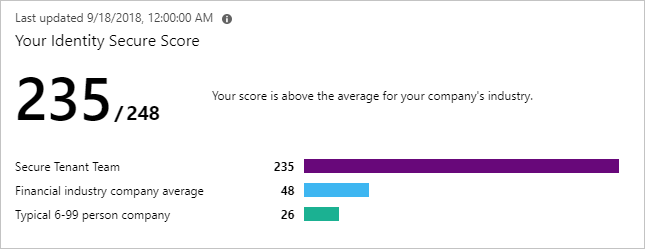
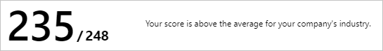
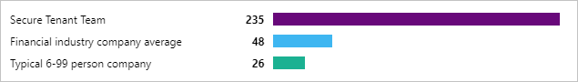
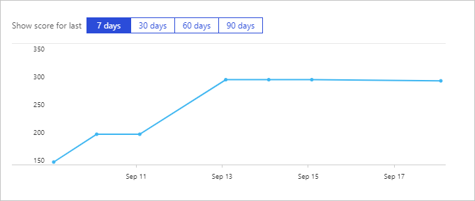
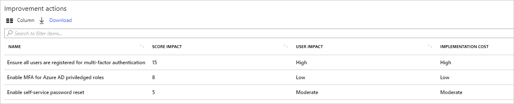
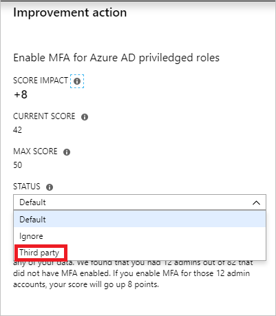
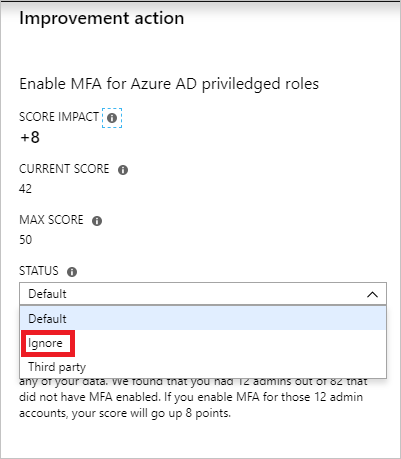

# What is the identity secure score in Azure AD? - preview

How secure is your Azure AD tenant? If you don't know how to answer this question, read this article to learn how the identity secure score helps you to monitor and improve your identity security posture. 

## What is an identity secure score?

The identity secure score is number between 1 and 248 that functions as indicator for how aligned you are with Microsoft's best practices recommendations for security.

The score helps you to:

- Objectively measure your identity security posture

- Plan identity security improvements

- Review the success of your improvements 

You can access the score and related information on the identity secure score dashboard. On this dashboard, you find:

- Your score

    

- A comparison graph

    

- A trend graph

    

- A list of identity security best practices. 

    

By following the improvement actions, you can:

- Improve your security posture and your score.
 
- Take advantage of Microsoft’s Identity features. 

## How do I get my secure score?

The Identity Secure Score is available in all editions of Azure AD.

To access your score, go to the [Azure AD Overview dashboard](https://portal.azure.com/#blade/Microsoft_AAD_IAM/ActiveDirectoryMenuBlade/IdentitySecureScore).

## How does it work?

Every 48 hours, Azure looks at your security configuration and compares your settings with the recommended best practices. Based on the outcome of this evaluation, a new score is calculated for your tenant. This means that it can take up to 48 hours until a configuration change you have made is reflected in your score. 

Each recommendation is measured based on your Azure AD configuration. If you are using third-party products to enable a best practice recommendation, you can indicate this in the settings of an improvement action.

Additionally, you also have the option to set recommendations to be ignored if they don't apply to your environment. An ignored recommendation does not contribute to the calculation of your score. 
 

## How does it help me?

The secure score helps you to:

- Objectively measure your identity security posture

- Plan identity security improvements

- Review the success of your improvements

## What you should know

### Who can use the identity secure score?

The identity secure score can be used by the following roles:

- Global admin
- Security admin 
- Security readers 

### What does [Not Scored] mean?

Actions labeled as [Not Scored] are ones you can perform in your organization but won't be scored because they aren't hooked up in the tool (yet!). So, you can still improve your security, but you won't get credit for those actions right now.

### How often is my score updated?

The score is calculated once per day (around 1:00 AM PST). If you make a change to a measured action, the score will automatically update the next day. It takes up to 48 hours for a change to be reflected in your score.

### My score changed. How do I figure out why?

On the score analyzer page on the [secure score portal](https://securescore.microsoft.com/#!/score), click a data point for a specific day, then scroll down to see the completed and incomplete actions for that day to find out what changed.

### Does the Secure Score measure my risk of getting breached?

In short, no. The Secure Score does not express an absolute measure of how likely you are to get breached. It expresses the extent to which you have adopted features that can offset the risk of being breached. No service can guarantee that you will not be breached, and the Secure Score should not be interpreted as a guarantee in any way.

### How should I interpret my score?

You're given points for configuring recommended security features or performing security-related tasks (like reading reports). Some actions are scored for partial completion, like enabling multi-factor authentication (MFA) for your users. Your Secure Score is directly representative of the Microsoft security services you use. Remember that security should always be balanced with usability. All security controls have a user impact component. Controls with low user impact should have little to no effect on your users' day-to-day operations.

To see your score history, go to the score analyzer page on the [secure score portal](https://securescore.microsoft.com/#!/score). Choose a specific date to see which controls were enabled for that day and what points you earned for each one.

### How does the identity secure score relate to the Office 365 secure score? 

The [Office 365 secure score](https://docs.microsoft.com/office365/securitycompliance/office-365-secure-score) is about to be migrated into an aggregate of five different scores:

- Identity

- Data

- Devices

- Infrastructure

- Apps

The identity secure score represents the identity part of the Office 365 secure score. This means that your recommendations for the identity secure score and the identity score in Office 365 are the same. 

## Next steps

If you would like to see a video about the Office 365 secure score, click [here](https://www.youtube.com/watch?v=jzfpDJ9Kg-A).
 
