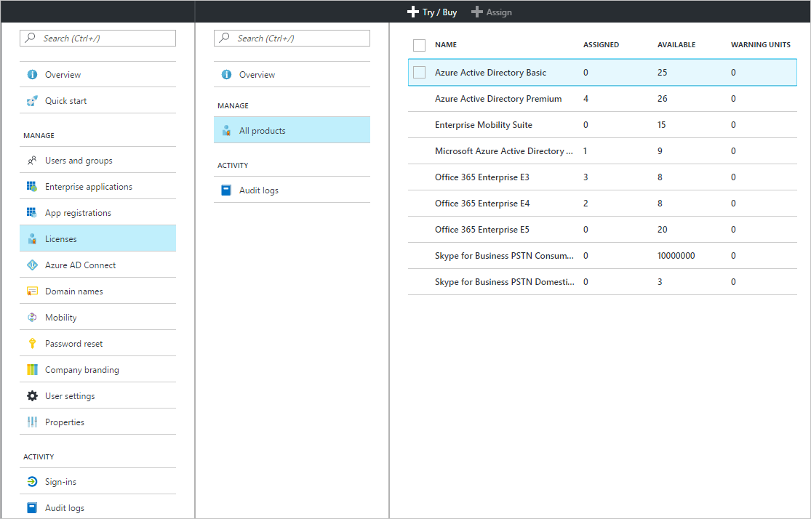
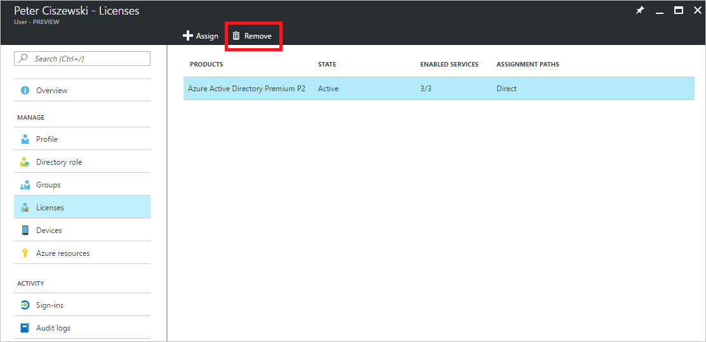

# Quickstart: License users in Azure Active Directory
License-based Azure AD services work by activating an Azure Active Directory (Azure AD) subscription in your Azure tenant. After the subscription is active, service capabilities are managed by Azure AD administrators and used by licensed users. When you purchase Enterprise Mobility + Security, Azure AD Premium, or Azure AD Basic, your tenant is updated with the subscription, including its validity period and prepaid licenses. Your subscription information, including the number of assigned or available licenses, is available through the Azure portal under **Azure Active Directory** by opening the **Licenses** tile. The **Licenses** blade is also the best place to manage your license assignments.

Although obtaining a subscription is all you need to configure paid capabilities, you must still assign user licenses for paid Azure AD paid features. Any user who should have access to, or who is managed through, an Azure AD paid feature must be assigned a license. License assignment is a mapping between a user and a purchased service, such as Azure AD Premium, Basic, or Enterprise Mobility + Security.

You can use [group-based license assignment](active-directory-licensing-whatis-azure-portal.md) to set up rules such as the following:
* All users in your directory automatically get a license
* Everyone with the appropriate job title gets a license
* You can delegate the decision to other managers in the organization (by using [self-service groups](../users-groups-roles/groups-self-service-management.md))

> [!TIP]
> For a detailed discussion of license assignment to groups, including advanced scenarios and Office 365 licensing scenarios, see [Assign licenses to users by group membership in Azure Active Directory](../users-groups-roles/licensing-groups-assign.md).

## Assign licenses to users and groups
Using an active subscription, you should first assign a license to yourself and refresh your browser to ensure that you see all of the expected features included with your subscription. The next step is to assign licenses to the users who need access to paid Azure AD features. An easy way to assign licenses is to assign licenses to groups of users rather than to individuals. When you assign licenses to a group, all group members are assigned a license. If users are added or removed from the group, the appropriate license is automatically assigned or removed. 

> [!NOTE]
> Some Microsoft services are not available in all locations. Before a license can be assigned to a user, the administrator must specify the **Usage location** property for the user. You can set this property under **User** &gt; **Profile** &gt; **Settings** in the Azure portal. When using group license assignment, any user whose usage location is not specified inherits the location of the directory.

To assign a license, under **Azure Active Directory** &gt; **Licenses** &gt; **All Products**, select one or more products, and then select **Assign** on the command bar.

You can use the **Users and groups** blade to choose multiple users or groups or to disable service plans in the product. Use the search box on top to search for user and group names.

When you assign licenses to a group, it can take some time before all users inherit the license depending on the size of the group. You can check the processing status on the **Group** blade, under the **Licenses** tile.

Assignment errors can occur during Azure AD license assignment but are relatively rare when managing Azure AD and Enterprise Mobility + Security products. Potential assignment errors are limited to:
- Assignment conflict: When a user was previously assigned a license that is incompatible with the current license. In this case, assigning the new license requires removing the current one.
- Exceeded available licenses: When the number of users in assigned groups exceeds the available licenses, a user's assignment status reflects a failure to assign due to missing licenses.

### Azure AD B2B collaboration licensing

B2B collaboration allows you to invite guest users into your Azure AD tenant to provide access to Azure AD services and any Azure resources you make available.  

There is no charge for inviting B2B users and assigning them to an application in Azure AD. Up to 10 apps per guest user and 3 basic reports are also free for B2B collaboration users. If your guest user has any appropriate licenses assigned in the partner's Azure AD tenant, they'll be licensed in yours as well.

It's not required, but if you want to provide access to paid Azure AD features, those B2B guest users must be licensed with appropriate Azure AD licenses. An inviting tenant with an Azure AD paid license can assign B2B collaboration user rights to an additional five guest users invited to the tenant. For scenarios and information, see [B2B collaboration licensing guidance](../b2b/licensing-guidance.md).

## View assigned licenses

A summary view of assigned and available licenses is displayed under **Azure Active Directory** &gt; **Licenses** &gt; **All products**.

A detailed list of assigned users and groups is available when selecting a specific product. The **Licensed Users** list shows all users currently consuming a license and whether the license was assigned directly to the user or if it is inherited from a group.

Similarly, the **Licensed Groups** list shows all groups to which licenses have been assigned. Select a user or group to open the **Licenses** blade, which shows all licenses assigned to that object.

## Remove a license

To remove a license, go to the user or group, and open the **Licenses** tile. Select the license, and click **Remove**.

Licenses inherited by the user from a group cannot be removed directly. Instead, remove the user from the group from which they are inheriting the license.

## Next steps
In this quickstart, you’ve learned how to assign licenses to users and groups in Azure AD directory. 

You can use the following link to configure subscription license assignments in Azure AD from the Azure portal.

> [!div class="nextstepaction"]
> [Assign Azure AD licenses](https://aad.portal.azure.com/#blade/Microsoft_AAD_IAM/LicensesMenuBlade/Overview) 