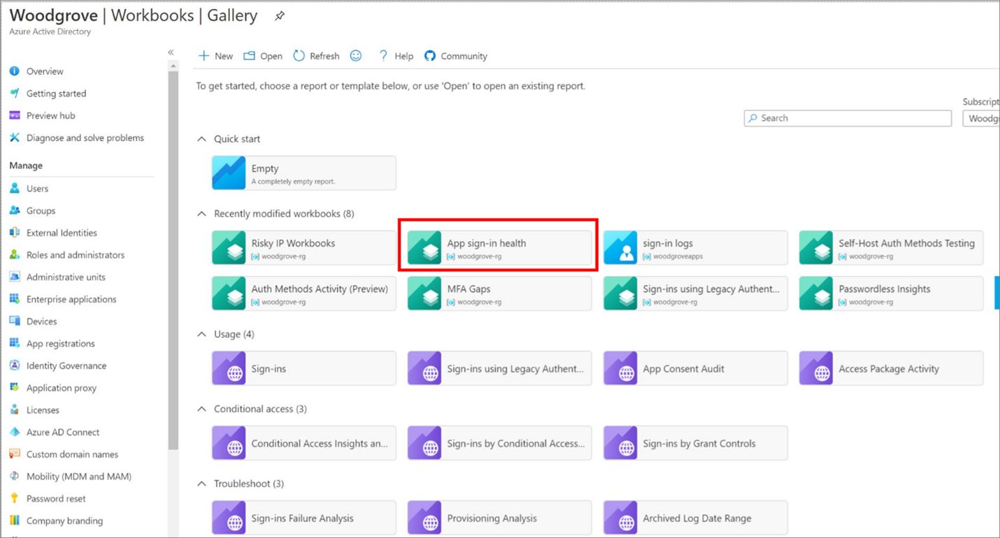
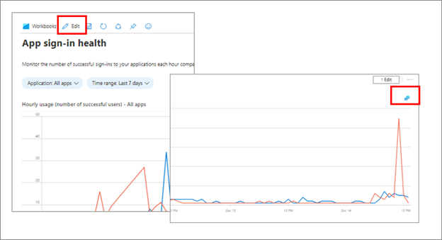
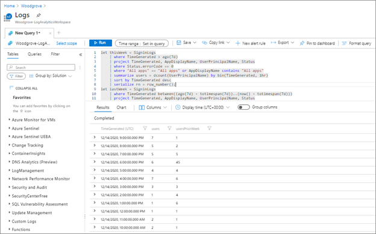
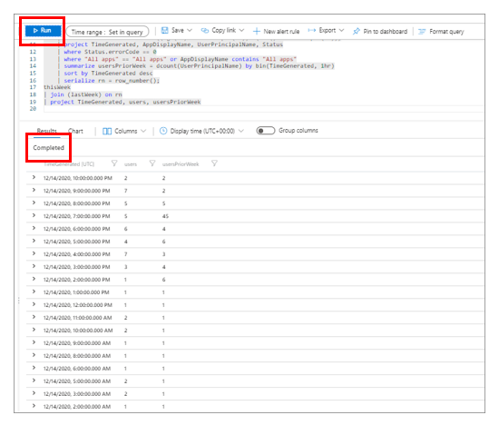
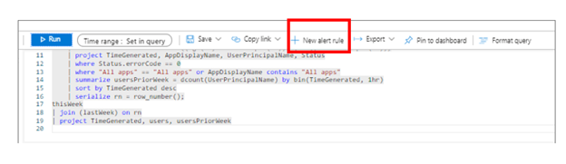
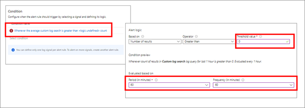
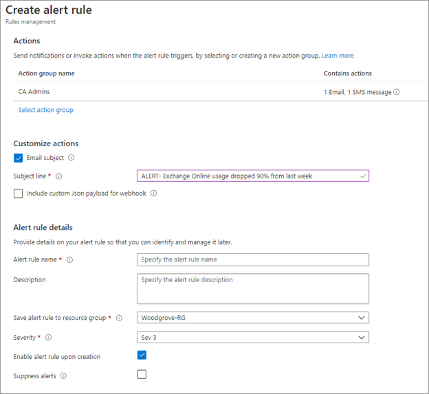
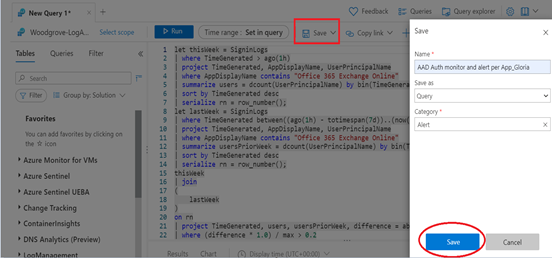

# Monitoring application sign-in health for resilience

To increase infrastructure resilience, set up monitoring of application sign-in health for your critical applications so that you receive an alert if an impacting incident occurs. To assist you in this effort, you can configure alerts based on the sign-in health workbook. 

This workbook enables administrators to monitor authentication requests for applications in your tenant. It provides these key capabilities:

* Configure the workbook to monitor all or individual apps with near real-time data.

* Configure alerts to notify you when authentication patterns change so that you can investigate and take action.

* Compare trends over a period, for example week over week, which is the workbook’s default setting.

> [!NOTE]
> To see all available workbooks, and the prerequisites for using them, please see [How to use Azure Monitor workbooks for reports](../reports-monitoring/howto-use-azure-monitor-workbooks.md).

During an impacting event, two things may happen:

* The number of sign-ins for an application may drop precipitously because users can't sign in.

* The number of sign-in failures can increase. 

This article walks through setting up the sign-in health workbook to monitor for disruptions to your users’ sign-ins.

## Prerequisites 

* An Azure AD tenant.

* A user with global administrator or security administrator role for the Azure AD tenant.

* A Log Analytics workspace in your Azure subscription to send logs to Azure Monitor logs. 

   * Learn how to [create a Log Analytics workspace](../../azure-monitor/logs/quick-create-workspace.md)

* Azure AD logs integrated with Azure Monitor logs

   * Learn how to [Integrate Azure AD Sign- in Logs with Azure Monitor Stream.](../reports-monitoring/howto-integrate-activity-logs-with-log-analytics.md)

 

## Configure the App sign in health workbook 

To access workbooks, open the **Azure portal**, select **Azure Active Directory**, and then select **Workbooks**.

You'll see workbooks under Usage, Conditional Access, and Troubleshoot. The App sign in health workbook appears in the usage section.

Once you use a workbook, it may appear in the Recently modified workbooks section.




The App sign in health workbook enables you to visualize what is happening with your sign-ins. 

By default the workbook presents two graphs. These graphs compare what is happening to your app(s) now, versus the same period a week ago. The blue lines are current, and the orange lines are the previous week.


**The first graph is Hourly usage (number of successful users)**. Comparing your current number of successful users to a typical usage period helps you to spot a drop in usage that may require investigation. A drop in successful usage rate can help detect performance and utilization issues that the failure rate can't. For example if users can't reach your application to attempt to sign in, there would be no failures, only a drop in usage. A sample query for this data can be found in the following section.

The second graph is Hourly failure rate. A spike in failure rate may indicate an issue with your authentication mechanisms. Failure rate can only be measured if users can attempt to authenticate. If users Can't gain access to make the attempt, failures Won't show.

You can configure an alert that notifies a specific group when the usage or failure rate exceeds a specified threshold. A sample query for this data can be found in the following section.

 ## Configure the query and alerts

You create alert rules in Azure Monitor and can automatically run saved queries or custom log searches at regular intervals.

Use the following instructions to create email alerts based on the queries reflected in the graphs. Sample scripts below will send an email notification when

* the successful usage drops by 90% from the same hour two days ago, as in the hourly usage graph in the previous section. 

* the failure rate increases by 90% from the same hour two days ago, as in the hourly failure rate graph in the previous section. 

 To configure the underlying query and set alerts, complete the following steps. You'll use the Sample Query as the basis for your configuration. An explanation of the query structure appears at the end of this section.

For more information on how to create, view, and manage log alerts using Azure Monitor see [Manage log alerts](../../azure-monitor/alerts/alerts-log.md).

 
1. In the workbook, select **Edit**, then select the **query icon** just above the right-hand side of the graph.   

   [](./media/monitor-sign-in-health-for-resilience/edit-workbook.png)

   The query log opens.

  [](/media/monitor-sign-in-health-for-resilience/query-log.png)
‎

2. Copy one of the following sample scripts for a new Kusto query.

**Kusto query for drop in usage**

```Kusto

let thisWeek = SigninLogs

| where TimeGenerated > ago(1h)

| project TimeGenerated, AppDisplayName, UserPrincipalName

//| where AppDisplayName contains "Office 365 Exchange Online"

| summarize users = dcount(UserPrincipalName) by bin(TimeGenerated, 1hr)

| sort by TimeGenerated desc

| serialize rn = row_number();

let lastWeek = SigninLogs

| where TimeGenerated between((ago(1h) - totimespan(2d))..(now() - totimespan(2d)))

| project TimeGenerated, AppDisplayName, UserPrincipalName

//| where AppDisplayName contains "Office 365 Exchange Online"

| summarize usersPriorWeek = dcount(UserPrincipalName) by bin(TimeGenerated, 1hr)

| sort by TimeGenerated desc

| serialize rn = row_number();

thisWeek

| join

(

 lastWeek

)

on rn

| project TimeGenerated, users, usersPriorWeek, difference = abs(users - usersPriorWeek), max = max_of(users, usersPriorWeek)

| where (difference * 2.0) / max > 0.9

```

 

**Kusto query for increase in failure rate**


```kusto

let thisWeek = SigninLogs

| where TimeGenerated > ago(1 h)

| project TimeGenerated, UserPrincipalName, AppDisplayName, status = case(Status.errorCode == "0", "success", "failure")

| where AppDisplayName == **APP NAME**

| summarize success = countif(status == "success"), failure = countif(status == "failure") by bin(TimeGenerated, 1h)

| project TimeGenerated, failureRate = (failure * 1.0) / ((failure + success) * 1.0)

| sort by TimeGenerated desc

| serialize rn = row_number();

let lastWeek = SigninLogs

| where TimeGenerated between((ago(1 h) - totimespan(2d))..(ago(1h) - totimespan(2d)))

| project TimeGenerated, UserPrincipalName, AppDisplayName, status = case(Status.errorCode == "0", "success", "failure")

| where AppDisplayName == **APP NAME**

| summarize success = countif(status == "success"), failure = countif(status == "failure") by bin(TimeGenerated, 1h)

| project TimeGenerated, failureRatePriorWeek = (failure * 1.0) / ((failure + success) * 1.0)

| sort by TimeGenerated desc

| serialize rn = row_number();

thisWeek

| join (lastWeek) on rn

| project TimeGenerated, failureRate, failureRatePriorWeek

| where abs(failureRate – failureRatePriorWeek) > **THRESHOLD VALUE**

```

3. Paste the query in the window and select **Run**. Ensure you see the Completed message shown in the image below, and results below that message.

   [](./media/monitor-sign-in-health-for-resilience/run-query.png)

4. Highlight the query, and select + **New alert rule**. 
 
   [](./media/monitor-sign-in-health-for-resilience/new-alert-rule.png)


5. Configure alert conditions. 
‎In the Condition section, select the link **Whenever the average custom log search is greater than logic defined count**. In the configure signal logic pane, scroll to Alert logic

   [](./media/monitor-sign-in-health-for-resilience/configure-alerts.png)
 
   * **Threshold value**: 0. This value will alert on any results.

   * **Evaluation period (in minutes)**: 60. This value looks at an hour of time

   * **Frequency (in minutes)**: 60. This value sets the evaluation period to once per hour for the previous hour.

   * Select **Done**.

6. In the **Actions** section, configure these settings:  

    [](./media/monitor-sign-in-health-for-resilience/create-alert-rule.png)

   * Under **Actions**, choose **Select action group**, and add the group you want to be notified of alerts.

   * Under **Customize actions** select **Email alerts**.

   * Add a **subject line**.

7. Under **Alert rule details**, configure these settings:

   * Add a descriptive name and a description.

   * Select the **resource group** to which to add the alert.

   * Select the default **severity** of the alert.

   * Select **Enable alert rule upon creation** if you want it live immediately, else select **Suppress alerts**.

8. Select **Create alert rule**.

9. Select **Save**, enter a name for the query, **Save as a Query with a category of Alert**. Then select **Save** again.  

   [](./media/monitor-sign-in-health-for-resilience/save-query.png)


### Refine your queries and alerts
Modify your queries and alerts for maximum effectiveness.

* Be sure to test your alerts.

* Modify alert sensitivity and frequency so that you get important notifications. Admins can become desensitized to alerts if they get too many and miss something important. 

* Ensure the email from which alerts come in your administrator’s email clients is added to allowed senders list. Otherwise you  may miss notifications due to a spam filter on your email client. 

* Alerts query in Azure Monitor can only include results from past 48 hours. [This is a current limitation by design](https://github.com/MicrosoftDocs/azure-docs/issues/22637).

## Create processes to manage alerts

Once you have set up the query and alerts, create business processes to manage the alerts.

* Who will monitor the workbook and when?
* When an alert is generated, who will investigate?

* What are the communication needs? Who will create the communications and who will receive them?

* If an outage occurs, what business processes need to be triggered?

## Next steps

[Learn more about workbooks](../reports-monitoring/howto-use-azure-monitor-workbooks.md)

 

 

