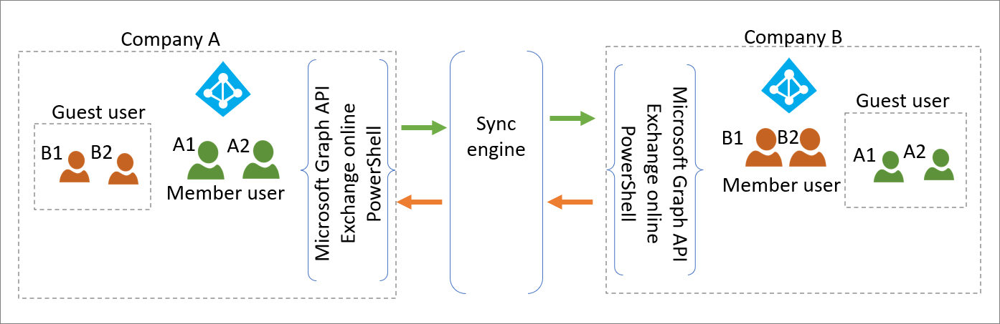
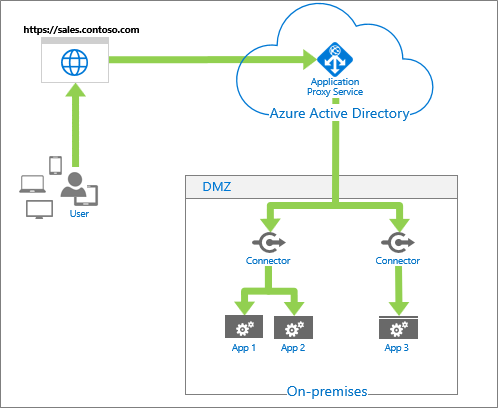

# Common solutions for multi-tenant user management

There are two specific challenges our customers have solved using current tools. Their solutions are detailed below. Microsoft recommends a single tenant wherever possible and is working on tools to resolve these challenges more easily. If single tenancy does not work for your scenario, these solutions have worked for customers today. 

## Automatic User Lifecycle Management and resource allocation across tenants

A customer acquires a competitor they previously had close business relationships with. The organizations will maintain their corporate identities.

### Current state

Currently, the organizations are synchronizing each other’s users as contact-mail objects so that they show in each other’s directories. 

* Each resource tenant has a mail-contact object enabled for all users in the other tenant.

* No access to applications is possible across tenants.

### Goals

This customer had the following goals:

* Every user continues to be shown in each organization’s GAL.

   * User account lifecycle changes in the home tenant automatically reflected in the resource tenant GAL. 

   * Attribute changes in home tenants (such as department, name, SMTP address) automatically reflected in resource tenant GAL and the home GAL.

* Users can access applications and resources in the resource tenant.

* Users can self-serve access requests to resources.

### Solution architecture 

The organizations will use a point-to-point architecture with a synchronization engine such as MIM.

Each tenant admin does the following to create the user objects:

1. Ensure that their database of users is up to date.

1. [Deploy and configure MIM](/microsoft-identity-manager/microsoft-identity-manager-deploy).

   1. Address existing contact objects.

   1. Create B2B External Member objects for the other tenant’s members.

   1. Synchronize user object attributes.

1. Deploy and configure [Entitlement Management](../governance/entitlement-management-overview.md) access packages.

   1. Resources to be shared

   1. Expiration and access review policies

## Sharing on-premises apps across tenants

This customer, with multiple peer organizations, has a need to share on-premises applications from one of the tenants.

### Current state

Multiple peer organizations are synchronizing B2B Guest users in a mesh topology, enabling resource allocation to their cloud applications across tenants. They currently

* Share applications in Azure AD.

* Ensure user Lifecycle Management in resource tenant is automated based on home tenant. That is, add, modify, delete is reflected.

* Only member users in Company A access Company A’s on-premises apps.

### Goals

Along with the current functionality, they would like to

* Provide access to Company A’s on-premises resources for the external guest users. 

* Apps with SAML authentication

* Apps with Integrated Windows Authentication and Kerberos

### Solution architecture

Company A is currently providing SSO to on premises apps for its own members via Azure Application Proxy.

To enable their guest users to access the same on-premises applications Admins in tenet A will:

1. [Configure access to SAML apps](../external-identities/hybrid-cloud-to-on-premises.md#access-to-saml-apps).

2. [Configure access to other applications](../external-identities/hybrid-cloud-to-on-premises.md#access-to-iwa-and-kcd-apps).

3. Create on-premises guest users through [MIM](../external-identities/hybrid-cloud-to-on-premises.md#create-b2b-guest-user-objects-through-mim) or [PowerShell](https://www.microsoft.com/en-us/download/details.aspx?id=51495).

For more information about B2B collaboration, see

[Grant B2B users in Azure AD access to your on-premises resources](../external-identities/hybrid-cloud-to-on-premises.md)

[Azure Active Directory B2B collaboration for hybrid organizations](../external-identities/hybrid-organizations.md)

## Next steps
[Multi-tenant user management introduction](multi-tenant-user-management-introduction.md)

[Multi-tenant end user management scenarios](multi-tenant-user-management-scenarios.md)

[Multi-tenant common considerations](multi-tenant-common-considerations.md)
