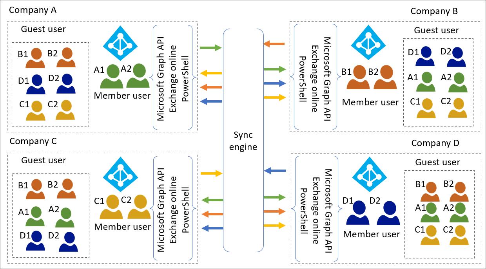
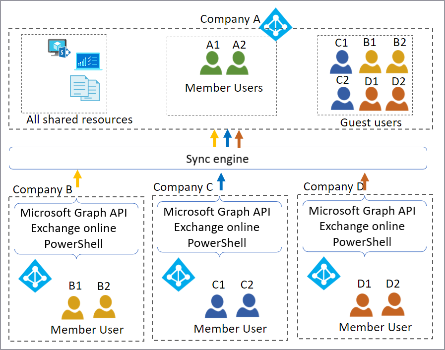

# Multi-tenant user management scenarios

## End-user initiated scenario
For the end-user initiated scenario, resource tenant administrators delegate certain abilities to users in the tenant. Administrators enable end users to invite guest users to the tenant, an app, or a resource. Users from the home tenant are invited or sign up individually.

An example use case would be for a global professional services firm who works with subcontractors on a project. Subcontractor users require access to the firm’s applications and documents. Admins at the firm can delegate to firm end users the ability to invite subcontractors or configure self-service for subcontractor resource access.

### Provision accounts

There are many ways end users can get invited to access resource tenant resources. Here are five of the most widely used: 

* [Application-based invitations](../external-identities/o365-external-user.md). Microsoft applications may enable invitation of guest users. B2B invitation settings must be configured both in Azure AD B2B and in the relevant application or applications.

* [MyApps](../manage-apps/my-apps-deployment-plan.md). Users invite and assign a guest user to an application using MyApps. The user account must have [application self-service sign up](../manage-apps/manage-self-service-access.md) approver permissions. They can invite guest users to a group if they're a group owner.

* [Entitlement Management](../governance/entitlement-management-overview.md): Enables admins or resource owners to tie resources, allowed external organizations, guest user expiration, and access policies together in access packages. Access packages can be published to enable self-service sign-up for resource access by guest users.

* [Azure portal ](../external-identities/add-users-administrator.md) End users given the [Guest Inviter role](../external-identities/external-collaboration-settings-configure.md) can sign in to the Azure portal and invite guest users from the Users menu in Azure Active Directory.

* [Programmatic (PowerShell, Graph API)](../external-identities/customize-invitation-api.md) End users given the [Guest Inviter role](../external-identities/external-collaboration-settings-configure.md) can invite guest users via PowerShell or Graph API. 

### Redeem invitations

As part of provisioning accounts to access a resource, email invitations are sent to the invited users email address. When an invited user receives an invitation, they can:
* Follow the link contained in the email to the redemption URL.
* Try to access the resource directly. 

When the user tries to access the resource directly, it is named just-in-time (JIT) redemption. The following are the user experiences for each redemption method. 

#### Redemption URL

By accessing the [redemption URL](../external-identities/redemption-experience.md) in the email, the invited user can approve or deny the invitation (creating a guest user account if necessary). 

#### Just-In-Time Redemption

The user can access the resource URL directly for just-in-time redemption if:

* The invited user already has an Azure AD or Microsoft account  
‎-or-

* If [email one-time passcodes](../external-identities/one-time-passcode.md) is enabled

A few points during JIT redemption:

* If administrators have not suppressed accepting privacy terms, the user must accept the Privacy Terms agreement page before accessing the resource.

* PowerShell allows control over whether an email is sent when inviting [via PowerShell](/powershell/module/azuread/new-azureadmsinvitation?view=azureadps-2.0&preserve-view=true).

* You can allow or block invitations to guest users from specific organizations by using an [allowlist or a blocklist](../external-identities/allow-deny-list.md).

For more information, see [Azure Active Directory B2B collaboration invitation redemption](../external-identities/redemption-experience.md).

#### Important – enable one-time passcode authentication 

We strongly recommend enabling [email one time passcode authentication](../external-identities/one-time-passcode.md). This feature authenticates guest users when they can't be authenticated through other means, such as:

* Azure AD

* A Microsoft account (MSA)

* A Gmail account through Google federation

* An account from a SAML/WS-Fed IDP through Direct Federation

With one-time passcode authentication, there's no need to create a Microsoft account. When the guest user redeems an invitation or accesses a shared resource, they receive a temporary code. The code is sent to their email address and then they enter the code to continue signing in. 

Without email one-time passcode authentication enabled, a Microsoft Account or a just-in-time “unmanaged” Azure AD tenant may be created.

>**Important**: Microsoft is deprecating the creation of unmanaged tenants and their users as this feature becomes Generally Available (GA) in each cloud environment. 

### Manage accounts

The resource tenant administrator manages guest user accounts in the resource tenant. Guest users accounts aren't updated based on the updated values in the home tenant. In fact, the only visible attributes received include the email address and display name.

You can configure more attributes on guest user objects to facilitate scenarios. For example, you can include populating the address book with contact details, or in entitlement scenarios. For example, consider:

* HiddenFromAddressListsEnabled

* GivenName

* Surname

* Title

* Department

* TelephoneNumber

These attributes might be set to [add guests to the global address list](/microsoft-365/admin/create-groups/manage-guest-access-in-groups?view=o365-worldwide&preserve-view=true). Other scenarios may require different attributes, such as for setting entitlements and permissions for Access Packages, Dynamic Group Membership, SAML Claims, etc.

Note: Invited guest users are hidden from the global address list (GAL) by default. Set guest user attributes to be unhidden for them to be included in the unified GAL. For more information, see the [Microsoft Exchange Online](multi-tenant-common-considerations.md#microsoft-exchange-online) documentation.

### Deprovision accounts

End-user initiated scenarios decentralize access decisions. However, decentralizing access decisions creates the challenge of deciding when to remove a guest user and its associated access. [Entitlement Management](../governance/entitlement-management-overview.md) and [access reviews](../governance/manage-guest-access-with-access-reviews.md) provide a way to review and remove existing guest users and their access to resources. 

Note: If users are invited outside of entitlement management, you must create a separate process to review and manage those guest users’ access. For example, if the guest user is invited directly through SharePoint Online, it is not included in your entitlement management process.

## Scripted scenario

For the scripted scenario, resource tenant administrators deploy a scripted pull process to automate discovery and provisioning of guest users. This approach is common for customers using a scripted mechanism.

An example use case would be a global shipping company that is acquired a competitor. Each company has a single Azure AD tenant. They want the following “day one” scenarios to work, without users having to perform any invitation or redemption steps. All users must be able to: 

* Use single sign-on to all resources to which they are provisioned

* Find each other and also find other resources in a unified GAL

* Determine each other’s presence and be able to initiate instant messages

* Access an application based on dynamic group membership

In this case, each organization’s tenant is the home tenant for its existing employees, and the resource tenant for the other organization’s employees.

### Provision accounts

With [Delta Query](/graph/delta-query-overview), tenant admins can deploy a scripted pull process to automate discovery and provisioning of identities to support resource access. This process checks the home tenant for new users and uses the B2B Graph APIs to provision those users as invited users in the resource tenant. The following diagram shows the components. 
### Multi-tenant topology

* Administrators of each tenant pre-arrange credentials and consent to allow read of each tenant.

* Allows tenant administrators to automate enumeration and “pulling” scoped users to resource tenant.

* Use MS Graph API with consented permissions to read and provision users via the invitation API.

* Initial provisioning can read source attributes and apply them to the target user object.

### Manage accounts

The resource organization may choose to augment profile data to support sharing scenarios by updating the user’s metadata attributes in the resource tenant. However, if ongoing synchronization is necessary, then a synchronized solution might be a better option.

### Deprovision accounts

[Delta Query](/graph/delta-query-overview) can signal when a guest user needs to be deprovisioned. [Entitlement Management](../governance/entitlement-management-overview.md) and [access reviews](../governance/manage-guest-access-with-access-reviews.md) can also provide a way to review and remove existing guest users and their access to resources. 

Note: If users are invited outside of entitlement management, you must create a separate process to review and manage those guest users’ access. For example, if the guest user is invited directly through SharePoint Online, it is not included in your entitlement management process.

## Automated Scenario

By far, the most complex pattern is synchronized sharing across tenants. This pattern enables more automated management and deprovisioning scenarios than user-initiated or scripted. For automated scenarios, resource tenant admins use an identity provisioning system to automate the provisioning and deprovisioning processes.

An example use case would be a multinational conglomeration that has multiple subsidiaries. Each has their own Azure AD tenant, but need to work together. In addition to synchronizing new users among tenants, attribute updates must be automatically synchronized. Deprovisioning must be automated. For example, if an employee is no longer at a subsidiary, their account should be removed from all other tenants during the next synchronization.

Or, consider the following expanded scenario. A Defense Industrial Base (DIB) contractor has a defence-based and commercial-based subsidiary. These have competing regulation requirements:

* The US defense business resides in a US sovereign cloud tenant. For example, Microsoft 365 US Government GCC High.

* The commercial business resides in a separate Azure AD tenant in the public. For example, an Azure AD environment running on the global Azure cloud. 

 To act like a single company deployed into a “cross-sovereign cloud” architecture, all users are synchronized to both tenants. This enables a unified GAL available across both tenants. It may also ensure that users automatically synchronized to both tenants include entitlements and restrictions to applications and content. For example:

* US employees may have ubiquitous access to both tenants.

* Non-US employees show in the unified GAL of both tenants but does not have access to protected content in the GCC High tenant. 

This will require automatic synchronization and identity management to configure users in both tenants while associating them with the proper entitlement and data protection policies.

### Provision accounts

This advanced deployment uses [Microsoft Identity Manager](/microsoft-identity-manager/microsoft-identity-manager-2016) (MIM) as a synchronization engine. MIM calls the [MS Graph API](https://developer.microsoft.com/graph) and [Exchange Online PowerShell](/powershell/exchange/exchange-online/exchange-online-powershell?view=exchange-ps&preserve-view=true). Alternative implementations can include the cloud hosted [Active Directory Synchronization Services](/windows-server/identity/ad-ds/get-started/virtual-dc/active-directory-domain-services-overview) (ADSS) managed service offering from [Microsoft Consulting Services](https://www.microsoft.com/en-us/msservices). There are also non-Microsoft offerings that can be created from scratch with other identity management offerings.

These are complex scenarios and we recommend you work with your partners, Microsoft account team, and any other available resources throughout your planning and execution. 

Note: There are considerations that are outside the scope of this document. For example, [integration of on-premises applications](../app-proxy/what-is-application-proxy.md). 

### Choose the right topology

Most customers use one of two topologies in automated scenarios. 

* A mesh topology enables sharing of all resources in all tenants. Users from other tenants are created in each resource tenant as guest users.

* A single resource tenant topology uses a single tenant (the resource tenant), in which users from other companies are external guest users. 

The following table can be used s a decision tree while you are designing your solution. We illustrate both topologies following the table. To help you determine which is right for your organization, consider the following. 

Comparison of mesh versus single resource tenant topologies

| Consideration| Mesh topology| Single resource tenant |
| - | - |-|
| Each company has separate Azure AD tenant with users and resources| Yes| Yes |
| **Resource location and collaboration**| |  |
| Shared apps and other resources remain in their current home tenant| Yes| No - only resources in the resource tenant are shared. |
| All viewable in individual company’s GALs (Unified GAL)| Yes| No |
| **Resource access and administration**| |  |
| ALL applications connected to Azure AD can be shared among all companies| Yes| No - only those in the resource tenant are shared. Those remaining in other tenants aren't. |
| Global resource administration ‎| Continue at tenant level| Consolidated in the resource tenant |
| Licensing – Office 365  SharePoint Online, unified GAL, Teams access all support guests; however, other Exchange Online scenarios do not| Continues at tenant level| Continues at tenant level |
| Licensing – [Azure AD (premium)](../external-identities/external-identities-pricing.md)| First 50 K Monthly Active Users are free (per tenant).| First 50 K Monthly Active Users are free. |
| Licensing – SaaS apps| Remain in individual tenants, may require licenses per user per tenant| All shared resources reside in the single resource tenant. You can investigate consolidating licenses to the single tenant if appropriate. |

#### Mesh topology

In a mesh topology, every user in each home tenant is synchronized to each of the other tenants, which become resource tenants. 

* This enables any resource within a tenant to be shared with guest users. 

* This enables each organization to see all users in the conglomerate. In the illustration above there are four unified GALs, each of which contains the home users and the guest users from the other three tenants.

See the [common considerations](multi-tenant-common-considerations.md#directory-object-considerations) section of this document for additional information on provisioning, managing, and deprovisioning users in this scenario.

#### Mesh topology for cross-sovereign cloud

The mesh topology can be used in as few as two tenants, such as in the scenario for the DIB defense contractor straddling a cross-sovereign cloud solution. As with the mesh topology, every user in each home tenant is synchronized to the other tenant, that effectively becomes a resource tenant. In the illustration above, the public Commercial tenant member user is synchronized to the US sovereign GCC High tenant as a guest user account. At the same time, the GCC High member user is synchronized to Commercial as a guest user account.

>**Note**: The illustration also describes where the data is stored. Data categorization and compliance is outside the scope of this whitepaper, but demonstrates that you can include entitlements and restrictions to applications and content. Content may include where a member user’s ‘personal data’ resides. For example, data stored in their Exchange Online mailbox or OneDrive for Business. The content might only be in their home tenant, not in the resource tenant. Shared data might reside in either tenant. You can restrict access to the content through access control and conditional access policies.

#### Single resource tenant topology

In a single resource tenant topology, users and their attributes are synchronized to the resource tenant (Company A in the illustration above). 

* All resources shared among the member organizations must reside in the single resource tenant.
  * If multiple subsidiaries have subscriptions to the same SaaS apps, this could be an opportunity to consolidate those subscriptions.

* Only the GAL in the resource tenant displays users from all companies.

### Manage accounts

This solution detects and syncs attribute changes from source tenant users to resource tenant guest users. These attributes can be used to make authorization decisions. For example, when using dynamic groups.

### Deprovision accounts

Automation detects deletion of the object in source environment and deletes the associated guest user object in the target environment.

See the [Common considerations](multi-tenant-common-considerations.md) section of this document for additional information on provisioning, managing, and deprovisioning users in this scenario.

## Next steps
[Multi-tenant user management introduction](multi-tenant-user-management-introduction.md)

[Multi-tenant common considerations](multi-tenant-common-considerations.md)

[Multi-tenant common solutions](multi-tenant-common-solutions.md)
