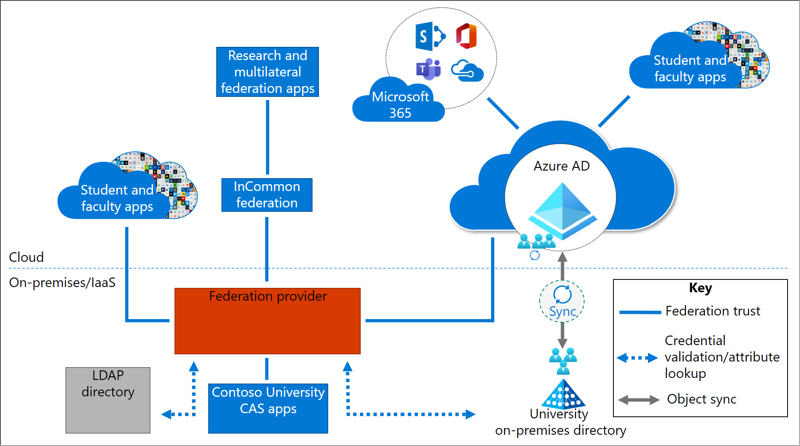

# Baseline architecture overview

Microsoft frequently speaks with research universities that operate in hybrid environments in which applications are either cloud-based or hosted on-premises. In both cases, applications can use different authentication protocols. In some cases, these protocols are reaching end-of-life or are not providing the required level of security.

Applications drive much of the need for different authentication protocols and different identity management mechanisms (IdM).

In research university environments, research apps often drive IdM requirements. A federation provider, such as Shibboleth, might be used as a primary identity provider (IdP). If this is the case, Azure AD is often configured to federate with Shibboleth. If Microsoft 365 apps are also in use, Azure AD enables you to configure integration.

Applications used in research universities operate in various portions of the overall IT footprint:

* Research and multilateral federation applications are made available through InCommon and EduGAIN.

* Library applications provide access to electronic journals and other e-content providers.

* Some applications use legacy authentication protocols such as Central Authentication Service (CAS) to enable single sign-on.

* Student and faculty applications often use multiple authentication mechanisms. For example, some are integrated with Shibboleth or other federation providers, while others are integrated with Azure AD.

* Microsoft 365 applications are integrated with Azure AD.

* Windows Server Active Directory (AD) might be in use and synchronized to Azure AD.

* Lightweight Directory Access Protocol (LDAP) is in use at many universities that might have an external LDAP directory or Identity Registry. These registries are often used to house confidential attributes, role hierarchy information, and even certain types of users, such as applicants. 

* On-premises AD, or an external LDAP directory, is often used to enable single-credential sign-in for non-web applications and various non-Microsoft operating system sign-ins. 

## Baseline architecture challenges

Often, baseline architectures evolve over time, introducing complexity and rigidness to the design and ability to update. Some of the challenges with using the baseline architecture include:

* **Hard to react to new requirements** - Having a complex environment makes it hard to quickly adapt and keep up with the most recent regulations and requirements. For example, if you have apps in lots of different locations and these apps are all connected in different ways with different IdMs, you run into the problem of where to locate multi-factor authentication (MFA) services and how to enforce MFA. Higher education also experiences fragmented service ownership. The people responsible for key services such as enterprise resource planning (ERP), learning management system (LMS), division, and department solutions might resist efforts to change or modify the systems they operate.

* **Can't take advantage of all Microsoft 365 capabilities for all apps** (Intune, Conditional Access, passwordless, etc.) - Many universities want to move towards the cloud and leverage their existing investments in Azure AD. However, with a different federation provider as their primary IdP, universities can't take advantage of all the Microsoft 365 capabilities for the rest of their apps.

* **Complexity of solution** - There are many different components to manage, with some components in the cloud and some on-premises or in IaaS instances. Apps are operated in many different places. From a user perspective, this can be a disjointed experience. For example, sometimes users see a Shibboleth login page and other times an Azure AD login page.

We present three different solutions, designed to solve these challenges, while also addressing the following requirements:

* Ability to participate in multilateral federations such as InCommon and eduGAIN

* Ability to support all types of apps (even those that require legacy protocols)

* Ability to support external directories and attribute stores

These three solutions are presented in order from most preferred to least preferred. Each satisfies requirements but introduces tradeoff decisions expected in a complex architecture. Based on your requirements and starting point, select the one that best suits your environment. A decision tree is provided to help aid in this decision.

## Next steps

See these related multilateral federation articles:

[Multilateral federation introduction](multilateral-federation-introduction.md)

[Multilateral federation solution one - Azure AD with Cirrus Bridge](multilateral-federation-solution-one.md)

[Multilateral federation solution two - Azure AD to Shibboleth as SP Proxy](multilateral-federation-solution-two.md)

[Multilateral federation solution three - Azure AD with ADFS and Shibboleth](multilateral-federation-solution-three.md)

[Multilateral federation decision tree](multilateral-federation-decision-tree.md)

