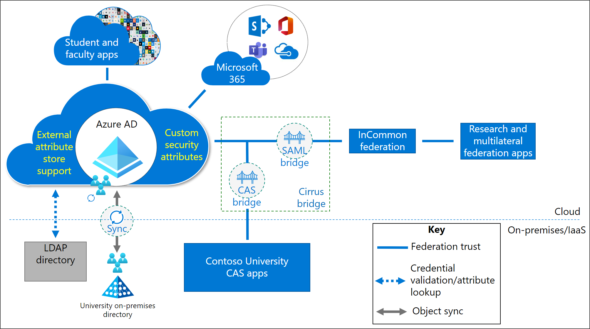

# Solution 1: Azure AD with Cirrus Bridge

In Solution 1, Azure AD is used as the primary IdP for all applications while a managed service provides multilateral federation. In this example, Cirrus Bridge is the managed service used for integration of CAS and multilateral federation apps.

If on-premises Active Directory is also being used, then [AD is configured](../hybrid/whatis-hybrid-identity.md) with hybrid identities. Implementing this Azure AD with Cirrus Bridge solution provides:

* **A Security Assertion Markup Language (SAML) bridge** - Enables you to configure multilateral federation and participation in InCommon and EduGAIN. The SAML bridge also enables you to configure Azure AD conditional access policies, app assignment, governance, and other features for each multilateral federation app.

* **CAS bridge** - Enables you to provide protocol translation to support on-premises CAS apps to authenticate with Azure AD. The CAS bridge enables you to configure Azure AD conditional access policies, app assignment, and governance for all CAS apps, as a whole.

Implementing Azure AD with Cirrus bridge enables you to take advantage of more capabilities available in Azure AD:

* **External attribute store support** - [Azure AD custom claims provider](../develop/custom-claims-provider-overview.md) enables you to use an external attribute store (like an external LDAP Directory) to add additional claims into tokens on a per app basis. It uses a custom extension that calls an external REST API to fetch claims from external systems.

* **Custom security attributes** - Provides you with the ability to add custom attributes to objects in the directory and control who can read them. [Custom security attributes](../fundamentals/custom-security-attributes-overview.md) enable you to store more of your attributes directly in Azure AD.

## Advantages

The following are some of the advantages of implementing Azure AD with Cirrus bridge:

* **Seamless cloud authentication for all apps**

  * Elimination of all on-premises identity components can lower your operational effort and potentially reduce security risks.

  * You may realize cost savings resulting from not having to host on-premises infrastructure.

  * This managed solution may help you save on operational administration costs and improve security posture and free up resources for other efforts.

* **Streamlined configuration, deployment, and support model**

  * [Cirrus Bridge](../saas-apps/cirrus-identity-bridge-for-azure-ad-tutorial.md) is registered in the Azure AD app gallery.

  * You benefit from an established process for configuring and setting up the bridge solution.

  * Cirrus Identity provides 24/7 support.

* **Conditional Access (CA) support for multilateral federation apps**

  * You receive support for [National Institutes of Health (NIH)](https://auth.nih.gov/CertAuthV3/forms/help/compliancecheckhelp.html) and Research and Education FEDerations group (REFEDS).

  * This solution is the only architecture that enables you to configure granular Azure AD CA for multilateral federation apps.

  * Granular CA is supported for both multilateral federation apps and CAS apps. Implementation of CA controls enables you to comply with the [NIH](https://auth.nih.gov/CertAuthV3/forms/help/compliancecheckhelp.html) and [REFEDS](https://refeds.org/category/research-and-scholarship) requirements.

* **Enables you to use other Azure AD-related solutions for all apps** (Intune, AADJ devices, etc.)

  * Enables you to use Azure AD Join for device management.

  * Azure AD Join provides you with the ability to use Autopilot, Azure AD Multi-Factor Authentication, passwordless features, and supports achieving a Zero Trust posture.

> [!NOTE]
> Switching to Azure AD Multi-Factor Authentication may allow you to realize significant cost savings over other solutions you have in place.

## Considerations and trade-offs

The following are some of the trade-offs of using this solution:

* **Limited ability to customize your authentication experience** - This scenario provides a managed solution. Therefore, this solution might not offer you the flexibility or granularity to build a custom solution using federation provider products.

* **Limited third-party MFA integration** - You might be limited by the number of integrations available to third-party MFA solutions.

* **One time integration effort required** - To streamline integration, you need to perform a one-time migration of all student and faculty apps to Azure AD, as well as set up the Cirrus Bridge.

* **Subscription required for Cirrus Bridge** - An annual subscription is required for the Cirrus Bridge. The subscription fee is based on anticipated annual authentication usage of the bridge.

## Migration resources

The following are resources to help with your migration to this solution architecture.

| Migration Resource   | Description           |
| - | - |
| [Resources for migrating applications to Azure Active Directory (Azure AD)](../manage-apps/migration-resources.md) | List of resources to help you migrate application access and authentication to Azure AD |
| [Azure AD custom claims provider](../develop/custom-claims-provider-overview.md)|This article provides an overview to the Azure AD custom claims provider |
| [Custom security attributes documentation](../fundamentals/custom-security-attributes-manage.md) | This article describes how to manage access to custom security attributes |
| [Azure AD SSO integration with Cirrus Identity Bridge](../saas-apps/cirrus-identity-bridge-for-azure-ad-tutorial.md) | Tutorial to integrate Cirrus Identity Bridge for Azure AD with Azure AD |
| [Cirrus Identity Bridge Overview](https://blog.cirrusidentity.com/documentation/azure-bridge-setup-rev-6.0) | Link to the documentation for the Cirrus Identity Bridge |
| [Azure MFA deployment considerations](../authentication/howto-mfa-getstarted.md) | Link to guidance for configuring multi-factor authentication (MFA) using Azure AD | 

## Next steps

See these other multilateral federation articles:

[Multilateral federation introduction](multilateral-federation-introduction.md)

[Multilateral federation  baseline design](multilateral-federation-baseline.md)

[Multilateral federation solution two - Azure AD to Shibboleth as SP Proxy](multilateral-federation-solution-two.md)

[Multilateral federation solution three - Azure AD with ADFS and Shibboleth](multilateral-federation-solution-three.md)

[Multilateral federation decision tree](multilateral-federation-decision-tree.md)
