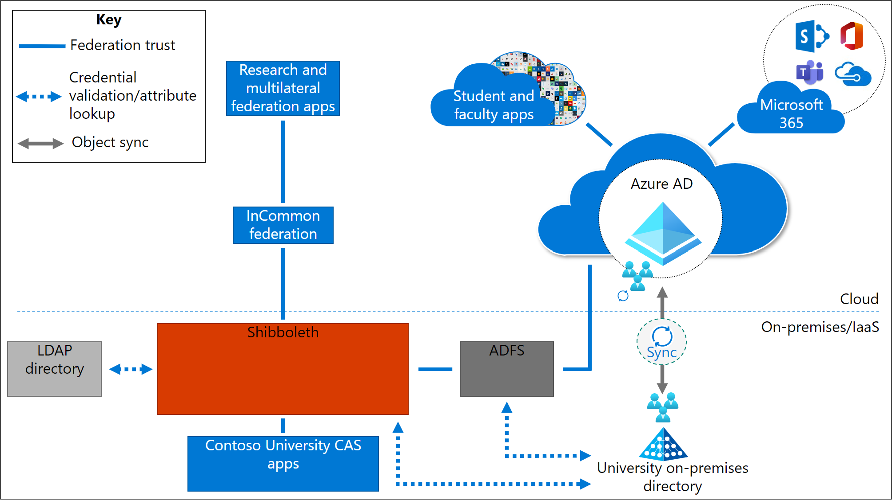

# Solution 3: Azure AD with ADFS and Shibboleth

In Solution 3, the federation provider is the primary IdP. As shown in this example, Shibboleth is the federation provider for integration of multilateral federation apps, on-premises CAS apps, and any LDAP directories.

In this scenario, Shibboleth is the primary IdP. Participation in multilateral federations (for example, with InCommon) is done through Shibboleth, which natively supports this integration. On-premises CAS apps and the LDAP directory are also integrated with Shibboleth.

Student apps, faculty apps, and Microsoft 365 apps are integrated with Azure AD. Any on-premises instance of AD is synced to Azure AD. Active Directory Federated Services (ADFS) is used for third-party multi-factor authentication (MFA) integration. ADFS is also used to perform protocol translation and to enable certain Azure AD features such as Azure AD Join for device management, Autopilot, and passwordless features.

## Advantages

The following are some of the advantages of using this solution:

* **Customized authentication** - Enables you to customize the experience for multilateral federation apps through Shibboleth.

* **Ease of execution** - Simple to implement in the short-term for institutions already using Shibboleth as their primary IdP. You need to migrate student and faculty apps to Azure AD and add an ADFS instance.

* **Minimal disruption** - Allows third-party MFA so you can keep existing MFA solutions such as Duo in place until you're ready for an update.

## Considerations and trade-offs

The following are some of the trade-offs of using this solution:

* **Higher complexity and security risk** - With an on-premises footprint, there may be higher complexity to the environment and extra security risks. There may also be increased overhead and fees associated with managing these on-premises components.

* **Suboptimal authentication experiences** - For multilateral federation and CAS apps, there's no cloud-based authentication mechanism and there might be multiple redirects.

* **No granular CA support** - This solution doesn't provide granular Conditional Access (CA) support.

* **No Azure AD Multi-Factor Authentication support** - This solution doesn't enable Azure AD Multi-Factor Authentication support for multilateral federation or CAS apps and might cause you to miss out on potential cost savings.

* **Significant ongoing staff allocation** - IT staff must maintain infrastructure and software for the authentication solution. Any staff attrition might introduce risk.

## Migration resources

The following are resources to help with your migration to this solution architecture.

| Migration Resource   | Description           |
| - | - |
| [Resources for migrating applications to Azure Active Directory (Azure AD)](../manage-apps/migration-resources.md) | List of resources to help you migrate application access and authentication to Azure AD |

## Next steps

See these related multilateral federation articles:

[Multilateral federation introduction](multilateral-federation-introduction.md)

[Multilateral federation  baseline design](multilateral-federation-baseline.md)

[Multilateral federation solution one - Azure AD with Cirrus Bridge](multilateral-federation-solution-one.md)

[Multilateral federation solution two - Azure AD to Shibboleth as SP Proxy](multilateral-federation-solution-two.md)

[Multilateral federation decision tree](multilateral-federation-decision-tree.md)
