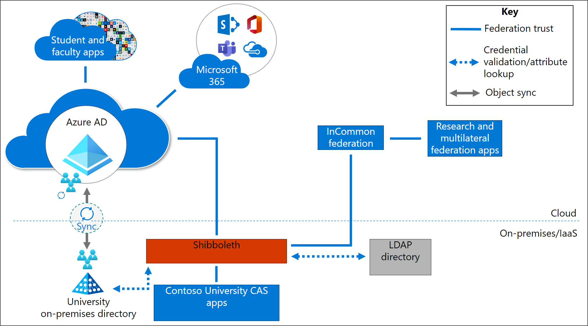

# Solution 2: Azure AD to Shibboleth as SP Proxy

In Solution 2, Azure AD acts as the primary IdP and the federation provider acts as a SAML proxy to the CAS apps and the multilateral federation apps. In this example, we show [Shibboleth acting as the SAML proxy](https://shibboleth.atlassian.net/wiki/spaces/KB/pages/1467056889/Using+SAML+Proxying+in+the+Shibboleth+IdP+to+connect+with+Azure+AD) to provide a reference link.

Azure AD is the primary IdP so all student and faculty apps are integrated with Azure AD. All Microsoft 365 apps are also integrated with Azure AD. If Active Directory Domain Services (AD) is in use, then it also is synchronized with Azure AD.

The SAML proxy feature of Shibboleth integrates with Azure AD. In Azure AD, Shibboleth appears as a non-gallery enterprise application. Universities can get single sign-on (SSO) for their CAS apps and can participate in the InCommon environment. Additionally, Shibboleth provides integration for Lightweight Directory Access Protocol (LDAP) directory services.

## Advantages

The following are some of the advantages of using this solution:

* **Provides cloud authentication for all apps** - All apps
    authenticate through Azure AD.

* **Ease of execution** - This solution provides short-term
    ease-of-execution for universities that are already using
    Shibboleth.

## Considerations and trade-offs

The following are some of the trade-offs of using this solution:

* **Limited authentication experience customization** - There are
    limited options for customizing the authentication experience for
    end users.

* **Limited third-party MFA integration** - The number of integrations
    available to third-party MFA solutions might be limited.

* **Higher complexity and security risk** - With an on-premises
    footprint, there might be higher complexity to the environment and
    extra security risks. There might also be increased overhead
    and fees associated with managing these on-premises components.

* **Suboptimal authentication experiences** - For multilateral
    federation and CAS apps, the authentication experience for end users
    might be suboptimal due to redirects through Shibboleth.

* **No granular CA support** - This solution doesn't provide
    granular Conditional Access (CA) support, meaning that you would
    have to decide on either the least common denominator (optimize for
    less friction, but limited security controls) or the highest common
    denominator (optimize for security controls, but at the expense of
    user friction) with limited ability to make granular decisions.

## Migration resources

The following are resources to help with your migration to this solution architecture.

| Migration Resource   | Description           |
| - | - |
| [Resources for migrating applications to Azure Active Directory (Azure AD)](../manage-apps/migration-resources.md) | List of resources to help you migrate application access and authentication to Azure AD |
| [Configuring Shibboleth as SAML Proxy](https://shibboleth.atlassian.net/wiki/spaces/KB/pages/1467056889/Using+SAML+Proxying+in+the+Shibboleth+IdP+to+connect+with+Azure+AD) | Link to a Shibboleth article that describes how to use the SAML proxying feature to connect Shibboleth IdP to Azure AD |
| [Azure MFA deployment considerations](../authentication/howto-mfa-getstarted.md) | Link to guidance for configuring multi-factor authentication (MFA) using Azure AD |

## Next steps

See these other multilateral federation articles:

[Multilateral federation introduction](multilateral-federation-introduction.md)

[Multilateral federation  baseline design](multilateral-federation-baseline.md)

[Multilateral federation solution one - Azure AD with Cirrus Bridge](multilateral-federation-solution-one.md)

[Multilateral federation solution three - Azure AD with ADFS and Shibboleth](multilateral-federation-solution-three.md)

[Multilateral federation decision tree](multilateral-federation-decision-tree.md)
