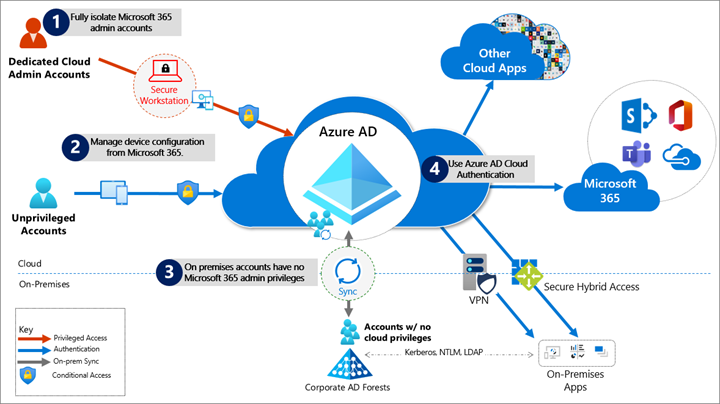

  
# Protecting Microsoft 365 from on-premises attacks

Many customers connect their private corporate networks to Microsoft 365
to benefit their users, devices, and applications. However, these private networks can be compromised in 
many well-documented ways. Because Microsoft 365 acts as a sort of nervous system for many organizations, it's critical to protect it from compromised on-premises infrastructure.

This article shows you how to configure your systems to protect
your Microsoft 365 cloud environment from on-premises compromise. We
focus primarily on: 

- Azure Active Directory (Azure AD) tenant configuration settings.
- How Azure AD tenants can be safely connected to on-premises systems.
- The tradeoffs required to operate your systems in ways that protect your
cloud systems from on-premises compromise.

We strongly recommend you implement this guidance to secure your
Microsoft 365 cloud environment.
> [!NOTE]
> This article was initially published as a blog post. It has been moved to its current location for longevity and maintenance.
>
> To create an offline version of this article, use your browser's print-to-PDF functionality. Check back here frequently for updates.

## Primary threat vectors from compromised on-premises environments

Your Microsoft 365 cloud environment benefits from an extensive
monitoring and security infrastructure. Using machine learning and human
intelligence, Microsoft 365 looks across worldwide traffic. It can rapidly detect
attacks and allow you to reconfigure nearly in real time. 

In hybrid
deployments that connect on-premises infrastructure to Microsoft 365,
many organizations delegate trust to on-premises components for critical
authentication and directory object state management decisions.
Unfortunately, if the on-premises environment is compromised, these
trust relationships become an attacker's opportunities to compromise
your Microsoft 365 environment.

The two primary threat vectors are *federation trust relationships*
and *account synchronization.* Both vectors can grant an attacker
administrative access to your cloud.

* **Federated trust relationships**, such as SAML authentication, are
    used to authenticate to Microsoft 365 through your on-premises identity
    infrastructure. If a SAML token-signing certificate is compromised,
    federation allows anyone who has that certificate to impersonate
    any user in your cloud. *We recommend you disable federation trust
    relationships for authentication to Microsoft 365 when possible.*

* **Account synchronization** can be used to modify privileged users
    (including their credentials) or groups that have administrative
    privileges in Microsoft 365. *We recommend you ensure that
    synchronized objects hold no privileges beyond a user in
    Microsoft 365,* either directly or through inclusion in trusted roles
    or groups. Ensure these objects have no direct or nested assignment
    in trusted cloud roles or groups.

## Protecting Microsoft 365 from on-premises compromise

To address the threat vectors outlined earlier, we recommend you adhere to
the principles illustrated in the following diagram:

1. **Fully isolate your Microsoft 365 administrator accounts.** They
    should be:

    * Mastered in Azure AD.

     * Authenticated by using multifactor authentication.

     *  Secured by Azure AD Conditional Access.

     *  Accessed only by using Azure-managed workstations.

    These administrator accounts are restricted-use accounts. *No on-premises accounts should have administrative privileges in Microsoft 365.* 

    For more information, see the [overview of Microsoft 365 administrator roles](/microsoft-365/admin/add-users/about-admin-roles). Also see [Roles for Microsoft 365 in Azure AD](../roles/m365-workload-docs.md).

1. **Manage devices from Microsoft 365.** Use Azure AD join and
    cloud-based mobile device management (MDM) to eliminate dependencies
    on your on-premises device management infrastructure. These dependencies can
    compromise device and security controls.

1. **Ensure no on-premises account has elevated privileges to Microsoft 365.**
    Some accounts access on-premises applications that require NTLM, LDAP,
    or Kerberos authentication. These accounts must be in the organization's
    on-premises identity infrastructure. Ensure that these accounts,
    including service accounts, aren't included in privileged cloud
    roles or groups. Also ensure that changes to these accounts can't affect the
    integrity of your cloud environment. Privileged on-premises software
    must not be capable of affecting Microsoft 365 privileged accounts
    or roles.

1. **Use Azure AD cloud authentication** to eliminate dependencies on
    your on-premises credentials. Always use strong authentication,
    such as Windows Hello, FIDO, Microsoft Authenticator, or Azure
    AD multifactor authentication.

## Specific security recommendations

The following sections provide specific guidance about how to implement the
principles described earlier.

### Isolate privileged identities

In Azure AD, users who have privileged roles, such as administrators, are the root of trust to build and manage the rest of the environment. Implement the following practices to minimize the effects of a compromise.

* Use cloud-only accounts for Azure AD and Microsoft 365 privileged
    roles.

* Deploy [privileged access devices](/security/compass/privileged-access-devices#device-roles-and-profiles) for privileged access to manage Microsoft 365 and Azure AD.

*  Deploy [Azure AD Privileged Identity Management](../privileged-identity-management/pim-configure.md) (PIM) for just-in-time (JIT) access to all human accounts that have privileged roles. Require strong authentication to activate roles.

* Provide administrative roles that allow the [least privilege necessary to do required tasks](../roles/delegate-by-task.md).

* To enable a rich role assignment experience that includes delegation and multiple roles at the same time, consider using Azure AD security groups or Microsoft 365 Groups. These groups are collectively called *cloud groups*. Also [enable role-based access control](../roles/groups-assign-role.md). You can use [administrative units](../roles/administrative-units.md) to restrict the scope of roles to a portion of the organization.

* Deploy [emergency access accounts](../roles/security-emergency-access.md). Do *not* use on-premises password vaults to store credentials.

For more information, see [Securing privileged access](/security/compass/overview). Also see [Secure access practices for administrators in Azure AD](../roles/security-planning.md).

### Use cloud authentication 

Credentials are a primary attack vector. Implement the following
practices to make credentials more secure:

* [Deploy passwordless authentication](../authentication/howto-authentication-passwordless-deployment.md). Reduce the use of passwords as much as possible by deploying passwordless credentials. These credentials are managed and
    validated natively in the cloud. Choose from these authentication methods:

   * [Windows Hello for business](/windows/security/identity-protection/hello-for-business/passwordless-strategy)

   * [The Microsoft Authenticator app](../authentication/howto-authentication-passwordless-phone.md)

   * [FIDO2 security keys](../authentication/howto-authentication-passwordless-security-key-windows.md)

* [Deploy multifactor authentication](../authentication/howto-mfa-getstarted.md). Provision
    [multiple strong credentials by using Azure AD multifactor authentication](../fundamentals/resilience-in-credentials.md). That way, access to cloud resources will require a credential that's managed in Azure AD in addition to an on-premises password that can be manipulated. For more information, see [Create a resilient access control management strategy by using Azure AD](./resilience-overview.md).

### Limitations and tradeoffs

* Hybrid account password management requires hybrid components such as password protection agents and password writeback agents. If your on-premises infrastructure is compromised, attackers can control the machines on which these agents reside. This vulnerability won't
    compromise your cloud infrastructure. But your cloud accounts won't protect these components from on-premises compromise.

*  On-premises accounts synced from Active Directory are marked to never expire in Azure AD. This setting is usually mitigated by on-premises Active Directory password settings. However, if your on-premises instance of Active Directory is compromised and synchronization is disabled, you must set the [EnforceCloudPasswordPolicyForPasswordSyncedUsers](../hybrid/how-to-connect-password-hash-synchronization.md) option to force password changes.

## Provision user access from the cloud

*Provisioning* refers to the creation of user accounts and groups in applications or identity providers.

We recommend the following provisioning methods:

* **Provision from cloud HR apps to Azure AD**: This provisioning enables an on-premises compromise to be isolated, without disrupting your joiner-mover-leaver cycle from your cloud HR apps to Azure AD.

* **Cloud applications**: Where possible, deploy [Azure AD app
    provisioning](../app-provisioning/user-provisioning.md) as
    opposed to on-premises provisioning solutions. This method protects
    some of your software-as-a-service (SaaS) apps from being affected by malicious hacker
    profiles in on-premises breaches. 

* **External identities**: Use [Azure AD B2B
    collaboration](../external-identities/what-is-b2b.md).
    This method reduces the dependency on on-premises accounts for external
    collaboration with partners, customers, and suppliers. Carefully
    evaluate any direct federation with other identity providers. We
    recommend limiting B2B guest accounts in the following ways:

   *  Limit guest access to browsing groups and other properties in
        the directory. Use the external collaboration settings to restrict guests'
            ability to read groups they're not members of. 

    *   Block access to the Azure portal. You can make rare necessary
        exceptions.  Create a Conditional Access policy that includes all guests
            and external users. Then [implement a policy to block
            access](../../role-based-access-control/conditional-access-azure-management.md). 

* **Disconnected forests**: Use [Azure AD cloud
    provisioning](../cloud-sync/what-is-cloud-sync.md). This method enables you to connect to disconnected forests, eliminating the need to establish cross-forest connectivity or trusts, which can
    broaden the effect of an on-premises breach. 
 
### Limitations and tradeoffs

When used to provision hybrid accounts, the Azure-AD-from-cloud-HR system relies on on-premises synchronization to complete the data flow from Active Directory to Azure AD. If synchronization is interrupted, new employee records won't be available in Azure AD.

## Use cloud groups for collaboration and access

Cloud groups allow you to decouple your collaboration and access from
your on-premises infrastructure.

* **Collaboration**: Use Microsoft 365 Groups and Microsoft Teams for
    modern collaboration. Decommission on-premises distribution lists,
    and [upgrade distribution lists to Microsoft 365 Groups in
    Outlook](/office365/admin/manage/upgrade-distribution-lists).

* **Access**: Use Azure AD security groups or Microsoft 365 Groups to
    authorize access to applications in Azure AD.
* **Office 365 licensing**: Use group-based licensing to provision to
    Office 365 by using cloud-only groups. This method decouples control of group
    membership from on-premises infrastructure.

Owners of groups that are used for access should be considered privileged
identities to avoid membership takeover in an on-premises compromise.
A takeover would include direct manipulation of group membership on-premises
or manipulation of on-premises attributes that can affect dynamic group
membership in Microsoft 365.

## Manage devices from the cloud

Use Azure AD capabilities to securely manage devices.

-   **Use Windows 10 workstations**: [Deploy Azure AD
    joined](../devices/azureadjoin-plan.md)
    devices with MDM policies. Enable [Windows
    Autopilot](/mem/autopilot/windows-autopilot)
    for a fully automated provisioning experience.

    -   Deprecate machines that run Windows 8.1 and earlier.

    -   Don't deploy server OS machines as workstations.

    -   Use [Microsoft Intune](https://www.microsoft.com/microsoft-365/enterprise-mobility-security/microsoft-intune)
        as the source of authority for all device management workloads.

-   [**Deploy privileged access devices**](/security/compass/privileged-access-devices#device-roles-and-profiles):
    Use privileged access to manage Microsoft 365 and Azure AD as part of a complete approach to [Securing privileged access](/security/compass/overview).

## Workloads, applications, and resources 

-   **On-premises single-sign-on (SSO) systems** 

    Deprecate any on-premises federation
    and web access management infrastructure. Configure applications
    to use Azure AD.  

-   **SaaS and line-of-business (LOB) applications that support modern authentication
    protocols** 

    [Use Azure AD for SSO](../manage-apps/what-is-single-sign-on.md). The
    more apps you configure to use Azure AD for authentication, the less
    risk in an on-premises compromise.

* **Legacy applications** 

   * You can enable authentication, authorization, and remote access to legacy applications that don't support modern authentication. Use [Azure AD Application Proxy](../app-proxy/application-proxy.md). You can also enable them through a network or application delivery controller solution by using [secure hybrid access partner integrations](../manage-apps/secure-hybrid-access.md).   

   * Choose a VPN vendor that supports modern authentication. Integrate its authentication with Azure AD. In an on-premises compromise, you can use Azure AD to disable or block access by disabling the VPN.

*  **Application and workload servers**

   * Applications or resources that required servers can be migrated to Azure infrastructure as a service (IaaS). Use [Azure AD Domain Services](../../active-directory-domain-services/overview.md) (Azure AD DS) to decouple trust and dependency on on-premises instances of Active Directory. To achieve this decoupling, make sure virtual networks used for Azure AD DS don't have a connection to corporate networks.

   * Follow the guidance for [credential tiering](/security/compass/privileged-access-access-model#ADATM_BM). Application servers are typically considered tier-1 assets.

## Conditional Access policies

Use Azure AD Conditional Access to interpret signals and use them to make
authentication decisions. For more information, see the
[Conditional Access deployment plan](../conditional-access/plan-conditional-access.md).

* Use Conditional Access to [block legacy authentication protocols](../conditional-access/howto-conditional-access-policy-block-legacy.md) whenever possible. Additionally, disable legacy authentication protocols at the application level by using an application-specific configuration.

   For more information, see [Legacy authentication protocols](../fundamentals/auth-sync-overview.md). Or see specific details for [Exchange Online](/exchange/clients-and-mobile-in-exchange-online/disable-basic-authentication-in-exchange-online#how-basic-authentication-works-in-exchange-online) and [SharePoint Online](/powershell/module/sharepoint-online/set-spotenant).

* Implement the recommended [identity and device access configurations](/microsoft-365/security/office-365-security/identity-access-policies).

* If you're using a version of Azure AD that doesn't include Conditional Access, ensure that you're using the [Azure AD security defaults](../fundamentals/concept-fundamentals-security-defaults.md).

   For more information about Azure AD feature licensing, see the [Azure AD pricing guide](https://www.microsoft.com/security/business/identity-access-management/azure-ad-pricing).

## Monitor 

After you configure your environment to protect your Microsoft 365
from an on-premises compromise, [proactively monitor](../reports-monitoring/overview-monitoring.md)
the environment.
### Scenarios to monitor

Monitor the following key scenarios, in addition to any scenarios
specific to your organization. For example, you should proactively
monitor access to your business-critical applications and resources.

* **Suspicious activity** 

    Monitor all [Azure AD risk events](../identity-protection/overview-identity-protection.md#risk-detection-and-remediation) for suspicious activity. [Azure AD Identity Protection](../identity-protection/overview-identity-protection.md) is natively integrated with Azure Security Center.

    Define the network [named locations](../conditional-access/location-condition.md) to avoid noisy detections on location-based signals. 
*  **User and Entity Behavioral Analytics (UEBA) alerts** 

    Use UEBA
    to get insights on anomaly detection.
    * Microsoft Cloud App Security (MCAS) provides [UEBA in the cloud](/cloud-app-security/tutorial-ueba).

    * You can [integrate on-premises UEBA from Azure Advanced Threat Protection (ATP)](/defender-for-identity/install-step2). MCAS reads signals from Azure AD Identity Protection. 

* **Emergency access accounts activity** 

    Monitor any access that uses [emergency access accounts](../roles/security-emergency-access.md). Create alerts for investigations. This monitoring must include: 

   * Sign-ins. 

   * Credential management. 

   * Any updates on group memberships. 

   * Application assignments. 
* **Privileged role activity**

    Configure and review
    security [alerts generated by Azure AD Privileged Identity Management (PIM)](../privileged-identity-management/pim-how-to-configure-security-alerts.md?tabs=new#security-alerts).
    Monitor direct assignment of privileged roles outside PIM by
    generating alerts whenever a user is assigned directly.

* **Azure AD tenant-wide configurations**

    Any change to tenant-wide configurations should generate alerts in the system. These changes include but aren't limited to:

  *  Updated custom domains.  

  * Azure AD B2B changes to allowlists and blocklists.

  * Azure AD B2B changes to allowed identity providers (SAML identity providers through direct federation or social sign-ins).  

  * Conditional Access or Risk policy changes. 

* **Application and service principal objects**
    
   * New applications or service principals that might require Conditional Access policies. 

   * Credentials added to service principals.
   * Application consent activity. 

* **Custom roles**
   * Updates to the custom role definitions. 

   * Newly created custom roles. 

### Log management

Define a log storage and retention strategy, design, and implementation to facilitate a consistent tool set. For example, you could consider security information and event management (SIEM) systems like Azure Sentinel, common queries, and investigation and forensics playbooks.

* **Azure AD logs**: Ingest generated logs and signals by consistently following best practices for settings such as diagnostics, log retention, and SIEM ingestion. 

    The log strategy must include the following Azure AD logs:
   * Sign-in activity 

   * Audit logs 

   * Risk events 

    Azure AD provides [Azure Monitor integration](../reports-monitoring/concept-activity-logs-azure-monitor.md) for the sign-in activity log and audit logs. Risk events can be ingested through the [Microsoft Graph API](/graph/api/resources/identityriskevent). You can [stream Azure AD logs to Azure Monitor logs](../reports-monitoring/howto-integrate-activity-logs-with-log-analytics.md).

* **Hybrid infrastructure OS security logs**: All hybrid identity infrastructure OS logs should be archived and carefully monitored as a tier-0 system, because of the surface-area implications. Include the following elements: 

   *  Azure AD Connect. [Azure AD Connect Health](../hybrid/whatis-azure-ad-connect.md) must be deployed to monitor identity synchronization.

   *  Application Proxy agents 

   * Password writeback agents 

   * Password Protection Gateway machines  

   * Network policy servers (NPSs) that have the Azure AD multifactor authentication RADIUS extension 

## Next steps
* [Build resilience into identity and access management by using Azure AD](resilience-overview.md)

* [Secure external access to resources](secure-external-access-resources.md) 
* [Integrate all your apps with Azure AD](five-steps-to-full-application-integration-with-azure-ad.md)
