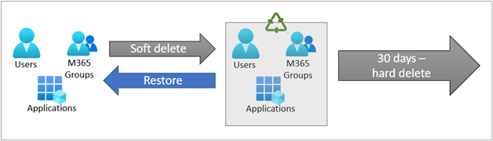
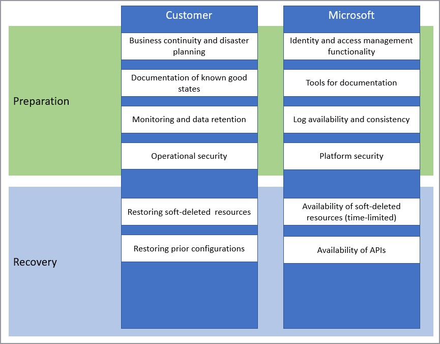

# Recoverability best practices

Unintended deletions and misconfigurations will happen to your tenant. To minimize the impact of these unintended events, you must prepare for their occurrence. 

Recoverability is the preparatory processes and functionality that enable you to return your services to a prior functioning state after an unintended change. Unintended changes include the soft- or hard-deletion or misconfiguration of applications, groups, users, policies, and other objects in your Azure Active Directory (Azure AD) tenant.

Recoverability helps your organization be more resilient. Resilience while related, is different. Resilience is the ability to endure disruption to system components and recover with minimal impact to your business, users, customers, and operations. For more information about making your systems more resilient, see [Building resilient identity and access management with Azure Active Directory](resilience-overview.md).

This article describes the best practices in preparing for deletions and misconfigurations to minimize the unintended consequences to your organization’s business.

## Deletions and misconfigurations

Deletions and misconfigurations have different impacts on your tenant.

### Deletions

The impact of deletions depends on the object type.

Users, Microsoft 365 (Microsoft 365) Groups, and applications can be “soft deleted.” Soft deleted items are sent to the Azure AD recycle bin. While in the recycle bin, items are not available for use. However, they retain all their properties, and can be restored via a Microsoft Graph API call, or in the Azure AD portal. Items in the soft delete state that aren't restored within 30 days, are permanently or “hard deleted.”

> [!IMPORTANT]
> All other object types are hard deleted immediately when selected for deletion. When an object is hard deleted, it cannot be recovered. It must be recreated and reconfigured.
For more information on deletions and how to recover from them, see [Recover from deletions](recover-from-deletions.md).

### Misconfigurations

Configurations are any changes in Azure AD that alter the behavior or capabilities of an Azure AD service or feature. For example, when you configure a Conditional Access policy you alter who can access the targeted applications and under what circumstances. Tenant-wide configurations affect your entire tenant. Configurations of specific objects or services affect only that object and its dependencies.

For more information on misconfigurations and how to recover from them, see [Recover from misconfigurations](recover-from-misconfigurations.md). 

## Shared responsibility

Recoverability is a shared responsibility between Microsoft as your cloud service provider, and your organization.

You can use the tools and services that Microsoft provides to prepare for deletions and misconfigurations.

## Business continuity and disaster planning

Restoring a hard deleted or misconfigured item is a resource-intensive process. You can minimize the resources needed by planning ahead. Consider having a specific team of admins in charge of restorations.

### Test your restoration process

You should rehearse your restoration process for different object types, and the communication that will go out as a result. Be sure to do rehearse with test objects, ideally in a test tenant.

Testing your plan can help you to determine the following:

- Validity and completeness of your object state documentation.

- Typical time to resolution.

- Appropriate communications and their audiences.

- Expected successes and potential challenges.

### Create the communication process

Create a process of pre-defined communications to make others aware of the issue and timelines for restoration. Include the following in your restoration communication plan.

- The types of communications to go out. Consider creating pre-defined templates.

- Stakeholders to receive communications. Include the following as applicable:

  - impacted business owners.

  - operational admins who will perform recovery.

  - Business and technical approvers.

  - Impacted users.

- Define the events that trigger communications, such as

 - Initial deletion

 - Impact assessment

 - Time to resolution

 - Restoration 

## Document known good states

Document the state of your tenant and its objects regularly so that in the event of a hard delete or misconfiguration you have a road map to recovery. The following tools can help you in documenting your current state.

- The [Microsoft Graph APIs](/graph/overview) can be used to export the current state of many Azure AD configurations.

- You can use the [Azure AD Exporter](https://github.com/microsoft/azureadexporter) to regularly export your configuration settings. 

- The [Microsoft 365 desired state configuration](https://github.com/microsoft/Microsoft365DSC/wiki/What-is-Microsoft365DSC) module is a module of the PowerShell Desired State Configuration framework. It can be used to export the configurations for reference, and application of the prior state of many settings.

- The [Conditional Access APIs](https://github.com/Azure-Samples/azure-ad-conditional-access-apis) can be used to manage your Conditional Access policies as code.

### Commonly used Microsoft Graph APIs

The Microsoft Graph APIs can be used to export the current state of many Azure AD configurations. The APIs cover most scenarios where reference material about the prior state, or the ability to apply that state from an exported copy, could become vital to keep your business running.

Graph APIs are highly customizable based on your organizational needs. To implement a solution for backups or reference material requires developers to engineer code to query for, store, and display the data. Many implementations use online code repositories as part of this functionality. 

### Useful APIS for recovery

| Resource types| Reference links |
| - | - | 
| Users, groups, and other directory objects| [directoryObject API](/graph/api/resources/directoryObject) |
| Directory roles| [directoryRole API](/graph/api/resources/directoryrole) |
| Conditional Access policies| [Conditional Access policy API](/graph/api/resources/conditionalaccesspolicy) |
| Devices| [devices API](/graph/api/resources/device) |
| Domains| [domains API](/graph/api/domain-list?tabs=http) |
| Administrative Units| [administrativeUnit API)](/graph/api/resources/administrativeunit) |
| Deleted Items*| [deletedItems API](/graph/api/resources/directory) |

Securely store these configuration exports with access provided to a limited number of admins. 

The [Azure AD Exporter](https://github.com/microsoft/azureadexporter) can provide most of the documentation you'll need.

- Verify that you've implemented the desired configuration.
- Use the exporter to capture current configurations.
- Review the export, understand the settings for your tenant that aren't exported, and manually document them.
- Store the output in a secure location with limited access.

> [!NOTE]
> Settings in the legacy MFA portal, for Application Proxy and federation settings may not be exported with the Azure AD Exporter, or with the Graph API.
The [Microsoft 365 desired state configuration](https://github.com/microsoft/Microsoft365DSC/wiki/What-is-Microsoft365DSC) module uses Microsoft Graph and PowerShell to retrieve the state of many of the configurations in Azure AD. This information can be used as reference information or, by using PowerShell Desired State Configuration scripting, to reapply a known-good state.

 Use [Conditional Access Graph APIs](https://github.com/Azure-Samples/azure-ad-conditional-access-apis) to manage policies like code. Automate approvals to promote policies from preproduction environments, backup and restore, monitor change, and plan ahead for emergencies. 

### Map the dependencies among objects.

The deletion of some objects can cause a ripple effect due to dependencies. For example, deletion of a security group used for application assignment would result in users who were members of that group being unable to access the applications to which the group was assigned.

#### Common dependencies

| Object Type| Potential Dependencies |
| - | - |
| Application object| Service Principal (Enterprise Application).   Groups assigned to the application.   Conditional Access Policies affecting the application. |
| Service principals| Application object |
| Conditional Access Policies| Users assigned to the policy. Groups assigned to the policy. Service Principal (Enterprise Application) targeted by the policy. |
| Groups other than Microsoft 365 Groups| Users assigned to the group. Conditional access policies to which the group is assigned. Applications to which the group is assigned access. |

## Monitoring and data retention

The [Azure AD Audit Log](../reports-monitoring/concept-audit-logs.md) contains information on all delete and configuration operations performed in your tenant. We recommend that you export these logs to a security information and event management (SIEM) tool such as [Microsoft Sentinel](../../sentinel/overview.md). You can also use Microsoft Graph to audit changes, and build a custom solution to monitor differences over time. For more information on finding deleted items using Microsoft Graph, see [List deleted items - Microsoft Graph v1.0 ](/graph/api/directory-deleteditems-list?tabs=http)

### Audit logs

The Audit Log always records a "Delete \<object\>" event when an object in the tenant is removed from an active state (either from active to soft-deleted or active to hard-deleted).

:::image type="content" source="media/recoverability/deletions-audit-log.png" alt-text="Screenshot of audit log detail." lightbox="media/recoverability/deletions-audit-log.png":::

A Delete event for applications, users, and Microsoft 365 Groups is a soft delete. For any other object type it's a hard delete.

| Object Type | Activity in log| Result |
| - | - | - |
| Application| Delete application| Soft deleted |
| Application| Hard delete application| Hard deleted |
| User| Delete user| Soft deleted |
| User| Hard delete user| Hard deleted |
| Microsoft 365 Groups| Delete group| Soft deleted |
| Microsoft 365 Groups| Hard delete group| Hard deleted |
| All other objects| Delete “objectType”| Hard deleted |

> [!NOTE]
> The audit log does not distinguish the group type of a deleted group. Only Microsoft 365 Groups are soft-deleted. If you see a Delete group entry, it may be the soft delete of a M365 group, or the hard delete of another type of group. It is therefore important that your documentation of your known good state include the group type for each group in your organization.

For information on monitoring configuration changes, see [Recover from misconfigurations](recover-from-misconfigurations.md). 

### Use workbooks to track configuration changes

There are several Azure Monitor workbooks that can help you to monitor configuration changes.

[The Sensitive Operations Report workbook](../reports-monitoring/workbook-sensitive-operations-report.md) can help identify suspicious application and service principal activity that may indicate a compromise, including:

- Modified application or service principal credentials or authentication methods
- New permissions granted to service principals
- Directory role and group membership updates for service principals
- Modified federation settings

The [Cross-tenant access activity workbook ](../reports-monitoring/workbook-cross-tenant-access-activity.md)can help you monitor which applications in external tenants your users are accessing, and which applications in your tenant external users are accessing. Use this workbook to look for anomalous changes in either inbound or outbound application access across tenants.

## Operational security 

Preventing unwanted changes is far less difficult than needing to recreate and reconfigure objects. Include the following in your change management processes to minimize accidents:

- Use a least privilege model. Ensure that each member of your team has the least privileges necessary to complete their usual tasks and require a process to escalate privileges for more unusual tasks.

- Administrative control of an object enables configuration and deletion. Use Read Only admin roles, for example the Global Reader role, for any tasks that do not require operations to create, update, or delete (CRUD). When CRUD operations are required, use object specific roles when possible. For example, User Administrators can delete only users, and Application Administrators can delete only applications. Use these more limited roles whenever possible, instead of a Global Administrator role, which can delete anything, including the tenant. 

- [Use Privileged Identity Management (PIM)](../privileged-identity-management/pim-configure.md). PIM enables just-in-time escalation of privileges to perform tasks like hard deletion. You can configure PIM to have notifications and or approvals for the privilege escalation. 

## Next steps   

[Recover from deletions](recover-from-deletions.md)

[Recover from misconfigurations](recover-from-misconfigurations.md)
