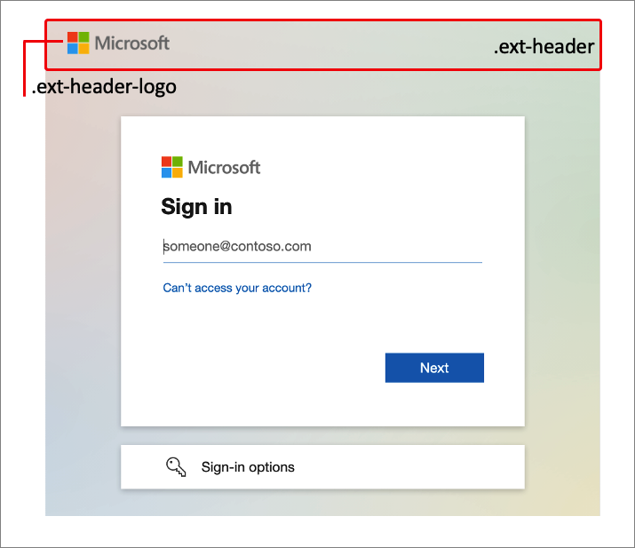
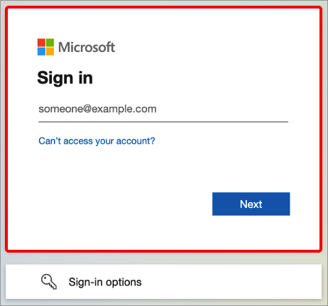
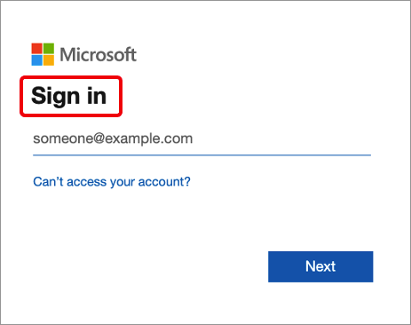
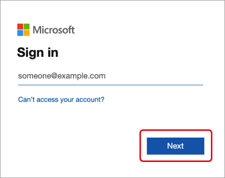
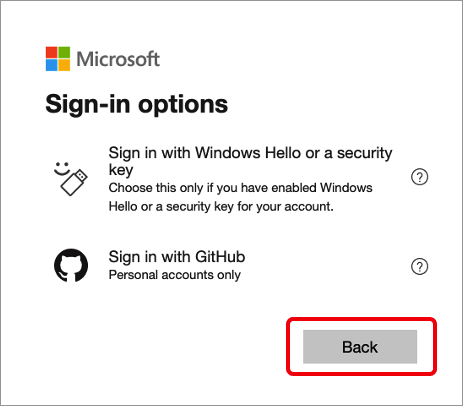
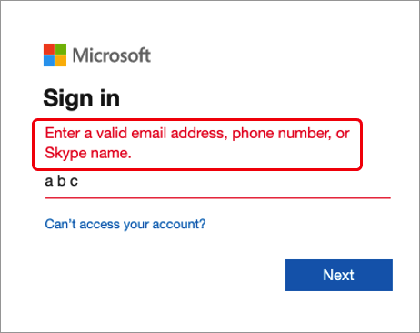
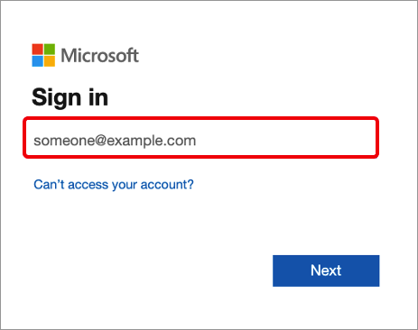
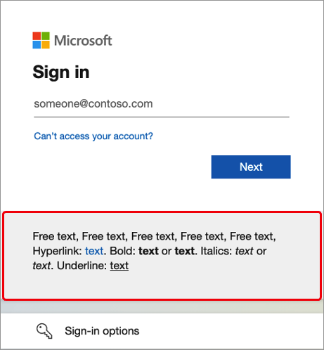
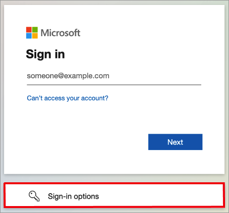

# CSS template reference guide

Configuring your company branding for the user sign-in process provides a seamless experience in your applications that use Azure Active Directory (Azure AD) as the identity and access management service. Use this CSS reference guide if you're using the [CSS template](https://download.microsoft.com/download/7/2/7/727f287a-125d-4368-a673-a785907ac5ab/custom-styles-template-013023.css) as part of the [customize company branding](reference-company-branding-css-template.md) process.

## HTML selectors

The following CSS styles become the default body and link styles for the whole page. Applying styles for other links or text override CSS selectors.

- `body` - Styles for the whole page
- Styles for links:
    - `a, a:link` - All links
    - `a:hover` - When the mouse is over the link
    - `a:focus` - When the link has focus
    - `a:focus:hover` - When the link has focus *and* the mouse is over the link
    - `a:active` - When the link is being clicked

## Azure AD CSS selectors

Use the following CSS selectors to configure the details of the sign-in experience. 

- `.ext-background-image` - Container that includes the background image in the default lightbox template
- `.ext-header` - Header at the top of the container
- `.ext-header-logo` - Header logo at the top of the container

    

- `.ext-middle` - Style for the full-screen background that aligns the sign-in box vertically to the middle and horizontally to the center
- `.ext-vertical-split-main-section` - Style for the container of the partial-screen background in the vertical split template that contains both a sign-in box and a background (This style is also known as the Active Directory Federation Services (ADFS) template.)
- `.ext-vertical-split-background-image-container` - Sign-in box background in the vertical split/ADFS template
- `.ext-sign-in-box` - Sign-in box container

    

- `.ext-title` - Title text

    

- `.ext-subtitle` - Subtitle text

- Styles for primary buttons:
    - `.ext-button.ext-primary` - Primary button default style
    - `.ext-button.ext-primary:hover` - When the mouse is over the button
    - `.ext-button.ext-primary:focus` - When the button has focus
    - `.ext-button.ext-primary:focus:hover` - When the button has focus *and* the mouse is over the button
    - `.ext-button.ext-primary:active` - When the button is being clicked

    

- Styles for secondary buttons:
    - `.ext-button.ext-secondary` - Secondary buttons
    - `.ext-button.ext-secondary:hover` - When the mouse is over the button
    - `.ext-button.ext-secondary:focus` When the button has focus
    - `.ext-button.ext-secondary:focus:hover` - When the button has focus *and* the mouse is over the button
    - `.ext-button.ext-secondary:active` - When the button is being clicked

    

- `.ext-error` - Error text

    

- Styles for text boxes:
    - `.ext-input.ext-text-box` - Text boxes
    - `.ext-input.ext-text-box.ext-has-error` - When there's a validation error associated with the text box
    - `.ext-input.ext-text-box:hover` - When the mouse is over the text box
    - `.ext-input.ext-text-box:focus` - When the text box has focus
    - `.ext-input.ext-text-box:focus:hover` - When the text box has focus *and* the mouse is over the text box

    

- `.ext-boilerplate-text` - Custom message text at the bottom of the sign-in box

    

- `.ext-promoted-fed-cred-box` - Sign-in options text box

    
 
-  Styles for the footer:
    - `.ext-footer` - Footer area at the bottom of the page
    - `.ext-footer-links` - Links area in the footer at the bottom of the page
    - `.ext-footer-item` - Link items (such as "Terms of use" or "Privacy & cookies") in the footer at the bottom of the page
    - `.ext-debug-item` - Debug details ellipsis in the footer at the bottom of the page

