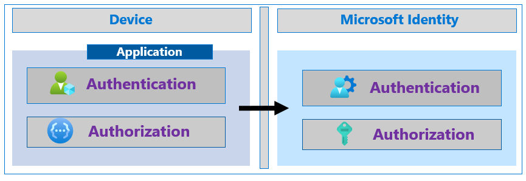

# Increase resilience of authentication and authorization in your applications

Microsoft Identity uses modern, token-based authentication and authorization. This means that an application acquires tokens from an Identity provider to authenticate the user and to authorize the application to call protected APIs.

A token is valid for a certain length of time before the app must acquire a new one. Rarely, a call to retrieve a token could fail due to an issue like network or infrastructure failure or authentication service outage. In this document, we outline steps a developer can take to increase resilience in their applications if a token acquisition failure occurs.

These articles provide guidance for client applications that work on behalf of a signed in user as well as daemon applications that work on their own behalf. There are best practices for using tokens as well as calling resources.

## Next steps

- [Build resilience into applications that sign-in users](resilience-client-app.md)
- [Build resilience into applications without users](resilience-daemon-app.md)
- [Build resilience in your identity and access management infrastructure](resilience-in-infrastructure.md)
- [Build resilience in your customer identity and access management with Azure Active Directory B2C](resilience-b2c.md)