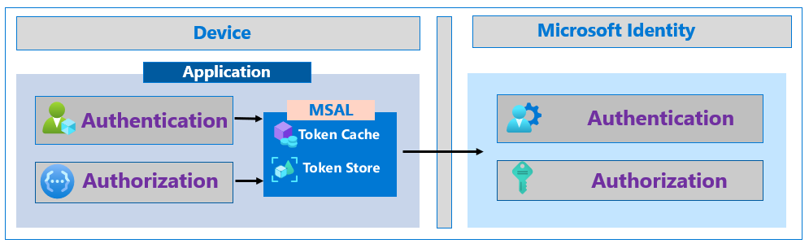
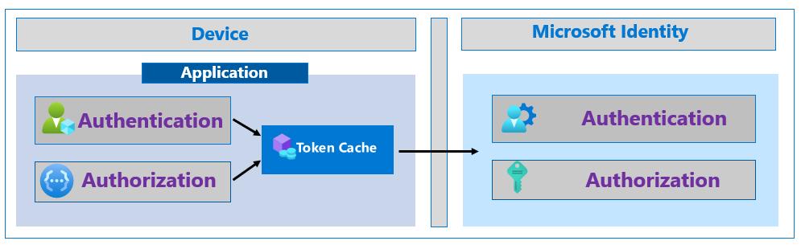
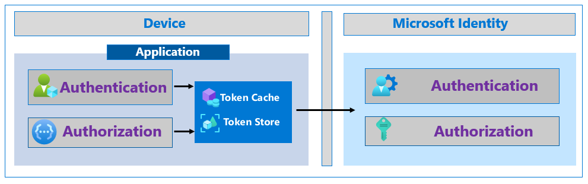

# Increase the resilience of authentication and authorization in client applications you develop

This section provides guidance on building resilience into client applications that use the Microsoft identity platform and Azure Active Directory to sign in users and perform actions on behalf of those users.

## Use the Microsoft Authentication Library (MSAL)

The [Microsoft Authentication Library (MSAL)](../develop/msal-overview.md) is a key part of the [Microsoft identity platform](../develop/index.yml). It simplifies and manages acquiring, managing, caching, and refreshing tokens, and uses best practices for resilience. MSAL is designed to enable a secure solution without developers having to worry about the implementation details.

MSAL caches tokens and uses a silent token acquisition pattern. It also automatically serializes the token cache on platforms that natively provide secure storage like Windows UWP, iOS and Android. Developers can customize the serialization behavior when using [Microsoft.Identity.Web](https://github.com/AzureAD/microsoft-identity-web/wiki/token-cache-serialization), [MSAL.NET](../develop/msal-net-token-cache-serialization.md), [MSAL for Java](../develop/msal-java-token-cache-serialization.md), and [MSAL for Python](../develop/msal-python-token-cache-serialization.md).



When using MSAL, token caching, refreshing, and silent acquisition is supported automatically. You can use simple patterns to acquire the tokens necessary for modern authentication. We support many languages, and you can find a sample that matches your language and scenario on our [Samples](../develop/sample-v2-code.md) page.

## [C#](#tab/csharp)

```csharp
try
{
    result = await app.AcquireTokenSilent(scopes, account).ExecuteAsync();
}
catch(MsalUiRequiredException ex)
{
    result = await app.AcquireToken(scopes).WithClaims(ex.Claims).ExecuteAsync()
}
```

## [JavaScript](#tab/javascript)

```javascript
return myMSALObj.acquireTokenSilent(request).catch(error => {
    console.warn("silent token acquisition fails. acquiring token using redirect");
    if (error instanceof msal.InteractionRequiredAuthError) {
        // fallback to interaction when silent call fails
        return myMSALObj.acquireTokenPopup(request).then(tokenResponse => {
            console.log(tokenResponse);

            return tokenResponse;
        }).catch(error => {
            console.error(error);
        });
    } else {
        console.warn(error);
    }
});
```

---

MSAL can in some cases proactively refresh tokens. When Microsoft Identity issues a long-lived token, it can send information to the client for the optimal time to refresh the token ("refresh\_in"). MSAL will proactively refresh the token based on this information. The app will continue to run while the old token is valid but will have a longer timeframe during which to make another successful token acquisition.

### Stay up to date

Developers should have a process for updating to the latest MSAL release. Authentication is part of your app security and your app needs to stay current with the security improvements contained in new MSAL releases. This is generally good practice for libraries under continuous development and doing so will ensure you have the most up to date code with respect to app resilience. As Microsoft Identity continues to innovate on ways for applications to be more resilient, apps that use the latest MSAL will be the most prepared to build on these innovations.

[Check the latest MSAL.js version and release notes](https://github.com/AzureAD/microsoft-authentication-library-for-js/releases)

[Check the latest MSAL .NET version and release notes](https://github.com/AzureAD/microsoft-authentication-library-for-dotnet/releases)

[Check the latest MSAL Python version and release notes](https://github.com/AzureAD/microsoft-authentication-library-for-python/releases)

[Check the latest MSAL Java version and release notes](https://github.com/AzureAD/microsoft-authentication-library-for-java/releases)

[Check the latest MSAL iOS and macOS version and release notes](https://github.com/AzureAD/microsoft-authentication-library-for-objc/releases)

[Check the latest MSAL Android version and release notes](https://github.com/AzureAD/microsoft-authentication-library-for-android/releases)

[Check the latest MSAL Angular version and release notes](https://github.com/AzureAD/microsoft-authentication-library-for-js/releases)

[Check the latest Microsoft.Identity.Web version and release notes](https://github.com/AzureAD/microsoft-identity-web/releases)

## Use resilient patterns for token handling

If you are not using MSAL, you can use these resilient patterns for token handling. These best practices are implemented automatically by the MSAL library. 

In general, an application that uses modern authentication will call an endpoint to retrieve tokens that authenticate the user or authorize the application to call protected APIs. MSAL is meant to handle the details of authentication and implements several patterns to improve resilience of this process. Use the guidance in this section to implement best practices if you choose to use a library other than MSAL. If you use MSAL, you get all of these best-practices for free, as MSAL implements them automatically.

### Cache tokens

Apps should properly cache tokens received from Microsoft Identity. When your app receives tokens, the HTTP response that contains the tokens also contains an "expires_in" property that tells the application how long to cache, and reuse, the token. It is important that applications use the "expires_in" property to determine the lifespan of the token. Application must never attempt to decode an API access token.



Using the cached token prevents unnecessary traffic between your app and Microsoft Identity, and makes your app less susceptible to token acquisition failures by reducing the number of token acquisition calls. Cached tokens also improve your application's performance as the app needs to block on acquiring tokens less. Your user can stay signed-in to your application for the length of that token's lifetime.

### Serialize and persist tokens

Apps should securely serialize their token cache to persist the tokens between instances of the app. Tokens can be reused as long as they are within their valid lifetime. [Refresh tokens](../develop/v2-oauth2-auth-code-flow.md#refresh-the-access-token), and, increasingly, [access tokens](../develop/access-tokens.md), are issued for many hours. This valid time can span a user starting your application many times. When your app starts, it should check to see if there is a valid access or refresh token that can be used. This will increase the app's resilience and performance as it avoids any unnecessary calls to Microsoft Identity.



The persistent token storage should be access controlled and encrypted to the owning user or process identity. On platforms like mobile, Windows and Mac, the developer should take advantage of built-in capabilities for storing credentials.

### Acquire tokens silently

The process of authenticating a user or retrieving authorization to call an API can require multiple steps in Microsoft Identity. For example, when the user signs in for the first time they may need to enter credentials and perform a multi-factor authentication via a text message. Each step adds a dependency on the resource that provides that service. The best experience for the user, and the one with the least dependencies, is to attempt to acquire a token silently to avoid these extra steps before requesting user interaction.


Acquiring a token silently starts with using a valid token from the app's token cache. If there is no valid token available, the app should attempt to acquire a token using a refresh token, if available, and the token endpoint. If neither of these options is available, the app should acquire a token using the "prompt=none" parameter. This will use the authorization endpoint, but not show any UI to the user. If the Microsoft Identity can provide a token to the app without interacting with the user, it will. If none of these methods result in a token, then a user will need to re-authenticate interactively.

> [!NOTE]
> In general, apps should avoid using prompts like "login" and "consent" as they will force user interaction even when no interaction is required.

## Handle service responses properly

While applications should handle all error responses, there are some responses that can impact resilience. If your application receives an HTTP 429 response code, Too Many Requests, Microsoft Identity is throttling your requests. If your app continues to make too many requests, it will continue to be throttled preventing your app from receiving tokens. Your application should not attempt to acquire a token again until after the time, in seconds, in the Retry-After response field has passed. Receiving a 429 response is often an indication that the application is not caching and reusing tokens correctly. Developers should review how tokens are cached and reused in the application.

When an application receives an HTTP 5xx response code the app must not enter a fast retry loop. When present, the application should honor the same Retry-After handling as it does for a 429 response. If no Retry-After header is provided by the response, we recommend implementing an exponential back-off retry with the first retry at least 5 seconds after the response.

When a request times out applications should not retry immediately. Implement an exponential back-off retry with the first retry at least 5 seconds after the response.

## Evaluate options for retrieving authorization related information

Many applications and APIs need specific information about the user to make authorization decisions. There are a few ways for an application to get this information. Each method has its advantages and disadvantages. Developers should weigh these to determine which strategy is best for resilience in their app.

### Tokens

Identity (ID) tokens and access tokens contain standard claims that provide information about the subject. These are documented in [Microsoft identity platform ID tokens](../develop/id-tokens.md) and [Microsoft identity platform access tokens](../develop/access-tokens.md). If the information your app needs is already in the token, then the most efficient technique for retrieving that data is to use token claims as that will save the overheard of an additional network call to retrieve information separately. Fewer network calls mean higher overall resilience for the application.

> [!NOTE]
> Some applications call the UserInfo endpoint to retrieve claims about the user that authenticated. The information available in the ID token that your app can receive is a superset of the information it can get from the UserInfo endpoint. Your app should use the ID token to get information about the user instead of calling the UserInfo endpoint.

An app developer can augment standard token claims with [optional claims](../develop/active-directory-optional-claims.md). One common optional claim is [groups](../develop/active-directory-optional-claims.md#configuring-groups-optional-claims). There are several ways to add group claims. The "Application Group" option only includes groups assigned to the application. The "All" or "Security groups" options include groups from all apps in the same tenant, which can add many groups to the token. It is important to evaluate the effect in your case, as it can potentially negate the efficiency gained by requesting groups in the token by causing token bloat and even requiring additional calls to get the full list of groups.

Instead of using groups in your token you can instead use and include app roles. Developers can define [app roles](../develop/howto-add-app-roles-in-azure-ad-apps.md) for their apps and APIs which the customer can manage from their directory using the portal or APIs. IT Pros can then assign roles to different users and groups to control who has access to what content and functionality. When a token is issued for the application or API, the roles assigned to the user will be available in the roles claim in the token. Getting this information directly in a token can save additional APIs calls.

Finally, IT Admins can also add claims based on specific information in a tenant. For example, an enterprise can have an extension to have an enterprise specific User ID.

In all cases, adding information from the directory directly to a token can be efficient and increase the apps resilience by reducing the number of dependencies the app has. On the other hand, it does not address any resilience issues from being unable to acquire a token. You should only add optional claims for the main scenarios of your application. If the app requires information only for the admin functionality, then it is best for the application to obtain that information only as needed.

### Microsoft Graph

Microsoft Graph provides a unified API endpoint to access the Microsoft 365 data that describes the patterns of productivity, identity and security in an organization. Applications that use Microsoft Graph can potentially use any of the information across Microsoft 365 for authorization decisions.

Apps require just a single token to access all of Microsoft 365. This is more resilient than using the older APIs that are specific to Microsoft 365 components like Microsoft Exchange or Microsoft SharePoint where multiple tokens are required.

When using Microsoft Graph APIs, we suggest your use a [Microsoft Graph SDK](/graph/sdks/sdks-overview). The Microsoft Graph SDKs are designed to simplify building high-quality, efficient, and resilient applications that access Microsoft Graph.

For authorization decisions, developers should consider when to use the claims available in a token as an alternative to some Microsoft Graph calls. As mentioned above, developers could request groups, app roles, and optional claims in their tokens. In terms of resilience, using Microsoft Graph for authorization requires additional network calls that rely on Microsoft Identity (to get the token to access Microsoft Graph) as well as Microsoft Graph itself. However, if your application already relies on Microsoft Graph as its data layer, then relying on the Graph for authorization is not an additional risk to take.

## Use broker authentication on mobile devices

On mobile devices, using an authentication broker like Microsoft Authenticator will improve resilience. The broker adds benefits above what is available with other options such as the system browser or an embedded WebView. The authentication broker can utilize a [primary refresh token](../devices/concept-primary-refresh-token.md) (PRT) that contains claims about the user and the device and can be used to get authentication tokens to access other applications from the device. When a PRT is used to request access to an application, its device and MFA claims are trusted by Azure AD. This increases resilience by avoiding additional steps to authenticate the device again. Users won't be challenged with multiple MFA prompts on the same device, therefore increasing resilience by reducing dependencies on external services and improving the user experience.


Broker authentication is automatically supported by MSAL. You can find more information on using brokered authentication on the following pages:

- [Configure SSO on macOS and iOS](../develop/single-sign-on-macos-ios.md#sso-through-authentication-broker-on-ios)
- [How to enable cross-app SSO on Android using MSAL](../develop/msal-android-single-sign-on.md)

## Adopt Continuous Access Evaluation

[Continuous Access Evaluation (CAE)](../conditional-access/concept-continuous-access-evaluation.md) is a recent development that can increase application security and resilience with long-lived tokens. CAE is an emerging industry standard being developed in the Shared Signals and Events Working Group of the OpenID Foundation. With CAE, an access token can be revoked based on [critical events](../conditional-access/concept-continuous-access-evaluation.md#critical-event-evaluation) and [policy evaluation](../conditional-access/concept-continuous-access-evaluation.md#conditional-access-policy-evaluation), rather than relying on a short token lifetime. For some resource APIs, because risk and policy are evaluated in real time, CAE can substantially increase token lifetime up to 28 hours. As resource APIs and applications adopt CAE, Microsoft Identity will be able to issue access tokens that are revocable and are valid for extended periods of time. These long-lived tokens will be proactively refreshed by MSAL.

While CAE is in early phases, it is possible to [develop client applications today that will benefit from CAE](../develop/app-resilience-continuous-access-evaluation.md) when the resources (APIs) the application uses adopt CAE. As more resources adopt CAE, your application will be able to acquire CAE enabled tokens for those resources as well. The Microsoft Graph API, and [Microsoft Graph SDKs](/graph/sdks/sdks-overview), will preview CAE capability early 2021. If you would like to participate in the public preview of Microsoft Graph with CAE, you can let us know you are interested here: [https://aka.ms/GraphCAEPreview](https://aka.ms/GraphCAEPreview).

If you develop resource APIs, we encourage you to participate in the [Shared Signals and Events WG](https://openid.net/wg/sse/). We are working with this group to enable the sharing of security events between Microsoft Identity and resource providers.

## Next steps

- [How to use Continuous Access Evaluation enabled APIs in your applications](../develop/app-resilience-continuous-access-evaluation.md)
- [Build resilience into daemon applications](resilience-daemon-app.md)
- [Build resilience in your identity and access management infrastructure](resilience-in-infrastructure.md)
- [Build resilience in your CIAM systems](resilience-b2c.md)
