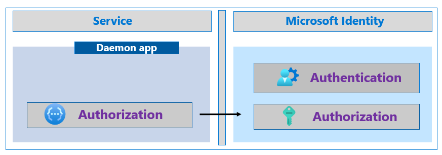

# Increase the resilience of authentication and authorization in daemon applications you develop

This article provides guidance on how developers can use the Microsoft identity platform and Azure Active Directory to increase the resilience of daemon applications. This includes background processes, services, server to server apps, and applications without users.

## Use Managed Identities for Azure Resources

Developers building daemon apps on Microsoft Azure can use [Managed Identities for Azure Resources](../managed-identities-azure-resources/overview.md). Managed Identities eliminate the need for developers to manage secrets and credentials. The feature improves resilience by avoiding mistakes around certificate expiry, rotation errors, or trust. It also has several built-in features meant specifically to increase resilience.

Managed Identities use long lived access tokens and information from Microsoft Identity to proactively acquire new tokens within a large window of time before the existing token expires. Your app can continue to run while attempting to acquire a new token.

Managed Identities also use regional endpoints to improve performance and resilience against out-of-region failures. Using a regional endpoint helps to keep all traffic inside a geographical area. For example, if your Azure Resource is in WestUS2, all the traffic, including Microsoft Identity generated traffic, should stay in WestUS2. This eliminates possible points of failure by consolidating the dependencies of your service.

## Use the Microsoft Authentication Library

Developers of daemon apps who do not use Managed Identities can use the [Microsoft Authentication Library (MSAL)](../develop/msal-overview.md), which makes implementing authentication and authorization simple, and automatically uses best practices for resilience. MSAL will make the process of providing the required Client Credentials easier. For example, your application does not need to implement creating and signing JSON Web Token assertions when using certificate-based credentials.

### Use Microsoft.Identity.Web for .NET Developers

Developers building daemon apps on ASP.NET Core can use the [Microsoft.Identity.Web](../develop/microsoft-identity-web.md) library. This library is built on top of MSAL to make implementing authorization even easier for ASP.NET Core apps. It includes several [distributed token cache](https://github.com/AzureAD/microsoft-identity-web/wiki/token-cache-serialization#distributed-token-cache) strategies for distributed apps that can run in multiple regions.

## Cache and store tokens

If you are not using MSAL to implement authentication and authorization, you can implement some best practices for caching and storing tokens. MSAL implements and follows these best practices automatically.

An application acquires tokens from an Identity provider to authorize the application to call protected APIs. When your app receives tokens, the response that contains the tokens also contains an "expires\_in" property that tells the application how long to cache, and reuse, the token. It is important that applications use the "expires\_in" property to determine the lifespan of the token. Application must never attempt to decode an API access token. Using the cached token prevents unnecessary traffic between your app and Microsoft Identity. Your user can stay signed-in to your application for the length of that token's lifetime.

## Properly handle service responses

Finally, while applications should handle all error responses, there are some responses that can impact resilience. If your application receives an HTTP 429 response code, Too Many Requests, Microsoft Identity is throttling your requests. If your app continues to make too many requests, it will continue to be throttled preventing your app from receiving tokens. Your application should not attempt to acquire a token again until after the time, in seconds, in the "Retry-After" response field has passed. Receiving a 429 response is often an indication that the application is not caching and reusing tokens correctly. Developers should review how tokens are cached and reused in the application.

When an application receives an HTTP 5xx response code the app must not enter a fast retry loop. When present, the application should honor the same "Retry-After" handling as it does for a 429 response. If no "Retry-After" header is provided by the response, we recommend implementing an exponential back-off retry with the first retry at least 5 seconds after the response.

When a request times out applications should not retry immediately. Implement an exponential back-off retry with the first retry at least 5 seconds after the response.

## Next steps

- [Build resilience into applications that sign-in users](resilience-client-app.md)
- [Build resilience in your identity and access management infrastructure](resilience-in-infrastructure.md)
- [Build resilience in your CIAM systems](resilience-b2c.md)