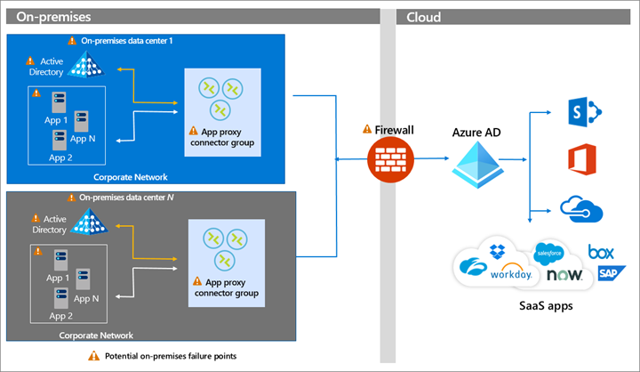

## Build resilience in application access with Application Proxy

Application Proxy is a feature of Azure AD that enables users to access on-premises web applications from a remote client. Application Proxy includes both the Application Proxy service in the cloud, and the Application Proxy connectors, which run on an on-premises server. 

Users access on-premises resources through a URL published via Application Proxy. They are redirected to the Azure AD sign in page. The Application Proxy service in Azure AD then sends a token to the Application Proxy connector in the corporate network, which passes the token to the on-premises Active Directory The authenticated user can then access the on-premises resource. In the diagram below, [connectors](../manage-apps/application-proxy-connectors) are shown in a [connector group](../manage-apps/application-proxy-connector-groups). 

> [!IMPORTANT]
> When you publish your applications via Application Proxy, you must implement capacity planning and appropriate redundancy for the Application Proxy connectors.

)

 ### How do I implement Application Proxy?

To implement remote access with Azure AD Application Proxy, see the following resources.

* [Planning an Application Proxy deployment](../manage-apps/application-proxy-deployment-plan)

* [High availability and load balancing best practices](../manage-apps/application-proxy-high-availability-load-balancing)

* [Configure proxy servers](../manage-apps/application-proxy-configure-connectors-with-proxy-servers)

* [Design a resilient access control strategy](../authentication/concept-resilient-controls)

## Next steps
Resilience resources for administrators and architects
 
* [Build resilience with credential management](build-resilience-in-credentials.md)

* [Build resilience with device states](build-resilience-with-device-states.md)

* [Build resilience by using Continuous Access Evaluation (CAE)](build-resilience-with-cae.md)

* [Build resilience in external user authentication](build-resilience-b2b-authentication.md)

* [Build resilience in your hybrid authentication](build-resilience-in-hybrid.md)

Resilience resources for developers

* [Build IAM resilience in your applications](https://aka.ms/azureadresilience/developer)

* [Build IAM resilience in your Azure AD B2C systems](https://aka.ms/azureadresilience/b2c)