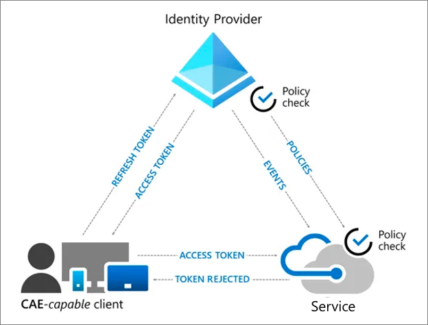

# Build resilience by using Continuous Access Evaluation

[Continuous Access Evaluation](../conditional-access/concept-continuous-access-evaluation.md) (CAE) allows Azure AD applications to subscribe to critical events that can then be evaluated and enforced. This includes evaluation of the following events:

* The user account being deleted or disabled

* Password for a user is changed

* MFA is enabled for the user.

* Administrator explicitly revokes a token.

* Elevated user risk is detected.

As a result, applications can reject unexpired tokens based on the events signaled by Azure AD, as depicted in the following diagram.

## How does CAE help?

This mechanism allows Azure AD to issue longer-lived tokens, while enabling applications a way to revoke access and force re-authentication only when needed. The net result of this pattern is fewer calls to acquire tokens, which means that the end-to-end flow is more resilient. 

To use CAE, both the service and the client must be CAE-capable. Microsoft 365 services such as Exchange Online, Teams, and SharePoint Online support CAE. On the client side, browser-based experiences that use these Office 365 services (e.g. Outlook Web App) and specific versions of Office 365 native clients are CAE-capable. More Microsoft cloud services will become CAE-capable.

Microsoft is working with the industry to build [standards](https://openid.net/wg/sse/) that will allow third party applications to use this capability. You can also develop applications that are CAE-capable. See How to build resilience in your application for more information.

## How do I implement CAE?

* [Update your code to use CAE-enabled APIs](../develop/app-resilience-continuous-access-evaluation.md).

* [Enable CAE](../conditional-access/concept-continuous-access-evaluation.md) in the Azure AD Security Configuration.

* Ensure that your organization is using [compatible versions](../conditional-access/concept-continuous-access-evaluation.md) of Microsoft Office native applications.

* [Optimize your reauthentication prompts](../authentication/concepts-azure-multi-factor-authentication-prompts-session-lifetime.md).

 
## Next steps
Resilience resources for administrators and architects
 
* [Build resilience with credential management](resilience-in-credentials.md)

* [Build resilience with device states](resilience-with-device-states.md)

* [Build resilience in external user authentication](resilience-b2b-authentication.md)

* [Build resilience in your hybrid authentication](resilience-in-hybrid.md)

* [Build resilience in application access with Application Proxy](resilience-on-premises-access.md)

Resilience resources for developers

* [Build IAM resilience in your applications](resilience-app-development-overview.md)

* [Build resilience in your CIAM systems](resilience-b2c.md)
