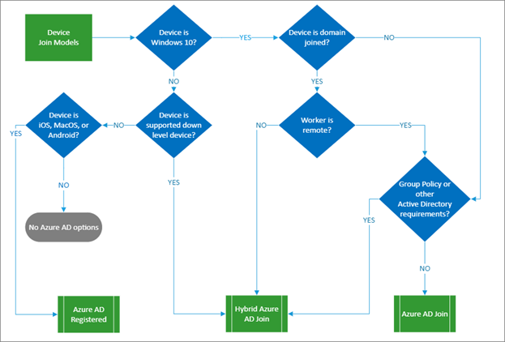

# Build resilience with device states

By enabling [device states](../devices/overview.md) with Azure AD, administrators can author [Conditional Access policies](../conditional-access/overview.md) that control access to applications based on device state. The added benefit of devices is that it satisfies strong authentication requirements for access to resources thus reducing additional MFA authentication requests and improving resiliency. 

The following flow chart presents the different ways to onboard devices in Azure AD that enable device states. You can use more than one in your organization.

When you use [device states](../devices/overview.md), users will in most cases experience single sign-on to resources through a [Primary Refresh Token](../devices/concept-primary-refresh-token.md) (PRT). The PRT contains claims about the user and the device and can be used to get authentication tokens to access applications from the device. The PRT is valid for 14 days and is continuously renewed as long as the user actively uses the device, providing users a resilient experience. A PRT can also get a multi-factor authentication claim in several ways. For more information, see [When does a PRT get an MFA claim](../devices/concept-primary-refresh-token.md).

## How do device states help?

When a PRT is used to request access to an application, its device, session, and MFA claims are trusted by Azure AD. When administrators create policies that requires either a device-based control or a Multi-factor authentication control, then the policy requirement can be met through its device state without attempting Multi-factor authentication. Users will not see additional Multi-factor authentication prompts on the same device. This increases resilience to a disruption of the Azure MFA service, or its dependencies like local telecom providers.

## How do I implement device states?

* Enable [hybrid Azure AD Joined](../devices/hybrid-azuread-join-plan.md) and [Azure AD Join](../devices/azureadjoin-plan.md) for company owned Windows devices, and require they be joined if possible. If not possible, require they be registered.

  If there are older versions of Windows in your organization, upgrade those devices to use Windows 10.

* Standardize user browser access to use either [Microsoft Edge](/deployedge/microsoft-edge-security-identity) or Google Chrome with [supported](https://chrome.google.com/webstore/detail/windows-10-accounts/ppnbnpeolgkicgegkbkbjmhlideopiji) [extensions](https://chrome.google.com/webstore/detail/office/ndjpnladcallmjemlbaebfadecfhkepb) that enabled seamless SSO to web applications using the PRT.

* For personal or company owned iOS and Android devices deploy the [Microsoft Authenticator App](https://support.microsoft.com/account-billing/how-to-use-the-microsoft-authenticator-app-9783c865-0308-42fb-a519-8cf666fe0acc). In addition to the Multi-factor authentication and password-less sign in capabilities, the Microsoft Authenticator app will enable single sign across native application through [brokered authentication](../develop/msal-android-single-sign-on.md) with fewer authentication prompts for end users.

* For personal or company owned iOS and Android devices use [mobile application management](/mem/intune/apps/app-management) to securely access company resources with fewer authentication requests. 

* [Use the Microsoft Enterprise SSO plug-in for Apple devices (preview)](../develop/apple-sso-plugin.md). This registers the device and provides SSO across browser and native Azure AD applications. 

## Next steps
Resilience resources for administrators and architects
 
* [Build resilience with credential management](resilience-in-credentials.md)

* [Build resilience by using Continuous Access Evaluation (CAE)](resilience-with-continuous-access-evaluation.md)

* [Build resilience in external user authentication](resilience-b2b-authentication.md)

* [Build resilience in your hybrid authentication](resilience-in-hybrid.md)

* [Build resilience in application access with Application Proxy](resilience-on-premises-access.md)

Resilience resources for developers

* [Build IAM resilience in your applications](resilience-app-development-overview.md)

* [Build resilience in your CIAM systems](resilience-b2c.md)
