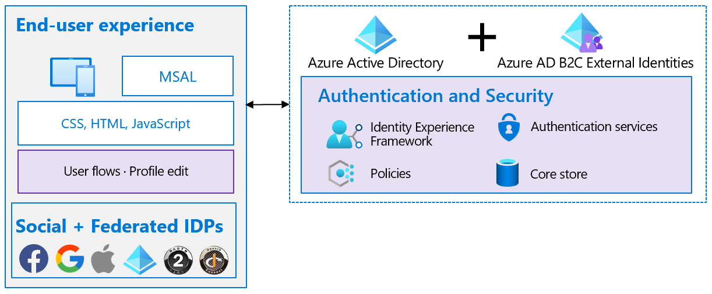

# Resilient end-user experience

The sign-up and sign-in end-user experience is made up of the following elements:

- The interfaces the user interacts with – such as CSS, HTML, and JavaScript

- The user flows and custom policies you create – such as sign-up, sign-in, and profile edit

- The identity providers (IDPs) for your application – such as local account username/password, Outlook, Facebook, and Google

## Choose between user flow and custom policy  

To help you set up the most common identity tasks, Azure AD B2C provides built-in configurable [user flows](../../active-directory-b2c/user-flow-overview.md). You can also build your own [custom policies](../../active-directory-b2c/custom-policy-overview.md) that offer you maximum flexibility. However, it's recommended to use custom policies only to address complex scenarios.

### How to decide between user flow and custom policy

Choose built-in user flows if your business requirements can be met by them. Since extensively tested by Microsoft, you can minimize the testing needed for validating policy-level functional, performance, or scale of these identity user flows. You still need to test your applications for functionality, performance, and scale.

Should you [choose custom policies](../../active-directory-b2c/user-flow-overview.md) because of your business requirements, make sure you perform policy-level testing for functional, performance, or scale in addition to application-level testing.

See the article that [compares user flows and custom polices](../../active-directory-b2c/user-flow-overview.md#comparing-user-flows-and-custom-policies) to help you decide.

## Choose multiple IDPs

When using an [external identity provider](../../active-directory-b2c/add-identity-provider.md) such as Facebook, make sure to have a fallback plan in case the external provider becomes unavailable.

### How to set up multiple IDPs

As part of the external identity provider registration process, include a verified identity claim such as the user's mobile number or email address. Commit the verified claims to the underlying Azure AD B2C directory instance. If the external provider is unavailable, revert to the verified identity claim, and fall back to the phone number as an authentication method. Another option is to send the user a one-time passcode to allow the user to sign in.

 Follow these steps to [build alternate authentication paths](https://github.com/azure-ad-b2c/samples/tree/master/policies/idps-filter):

 1. Configure your sign-up policy to allow sign up by local account and external IDPs.

 2. Configure a profile policy to allow users to [link the other identity to their account](https://github.com/Azure-Samples/active-directory-b2c-advanced-policies/tree/master/account-linking) after they sign in.

 3. Notify and allow users to [switch to an alternate IDP](../../active-directory-b2c/customize-ui-with-html.md#configure-dynamic-custom-page-content-uri) during an outage.

## Availability of Multi-factor authentication

When using a [phone service for Multi-factor authentication (MFA)](../../active-directory-b2c/phone-authentication-user-flows.md), make sure to consider an alternative service provider. The local Telco or phone service provider may experience disruptions in their service.

### How to choose an alternate MFA  

The Azure AD B2C service uses a built-in phone-based MFA provider, to deliver time-based One-time passcodes (OTPs). It is in the form of a voice call and text message to user's pre-registered phone number. The following alternative methods are available for various scenarios:

When you use **user flows**, there are two methods to build resilience:

- **Change user flow configuration**:  Upon detecting a disruption in the phone-based OTP delivery, change the OTP delivery method from phone-based to email-based and redeploy the user flow, leaving the applications unchanged.

- **Change applications**: For each identity task such as sign-up and sign-in, define two sets of user flows. Configure first set to use phone-based OTP and the second to email-based OTP. Upon detecting a disruption in the phone-based OTP delivery, change and redeploy the applications to switch from the first set of user flows to the second, leaving the user flows unchanged.  

When you use **custom policies**, there are four methods to build resilience. Below list is in the order of complexity and you'll need to redeploy updated policies.

- **Enable user selection of either phone-based OTP or email-based OTP**: Expose both options to the users and enable users to self-select one of the options. There's no need to make changes to the policies or applications.

- **Dynamically switch between phone-based OTP and email-based OTP**:  Collect both phone and email information at sign-up. Define custom policy in advance to conditionally switch during a phone disruption, from phone-based to email-based OTP delivery. There's no need to make changes to the policies or applications.

- **Use an Authenticator app**: Update custom policy to use an [Authenticator app](https://github.com/azure-ad-b2c/samples/tree/master/policies/custom-mfa-totp). If your normal MFA is either phone-based or email-based OTP, then redeploy your custom policies to switch to use the Authenticator app.

>[!Note]
>Users need to configure Authenticator app integration during the sign-up.

- **Use Security Questions**: If none of the above methods are applicable, implement Security Questions as a backup. Set up Security Questions for users during onboarding or profile edit and store the answers in a separate database other than the directory. This method doesn't meet the MFA requirement of "something you have" for example, phone, but offers a secondary "something that you know".

## Use a content delivery network

Content delivery networks (CDNs) are better performant and less expensive than blob stores for storage of custom user flow UI. The web page content is delivered faster from a geographically distributed network of highly available servers.  

Periodically test your CDN's availability and the performance of content distribution through end-to-end scenario and load testing. If you're planning for an upcoming surge because of promotion or holiday traffic, revise your estimates for load testing.
  
## Next steps

- [Resilience resources for Azure AD B2C developers](resilience-b2c.md)
  
  - [Resilient interfaces with external processes](resilient-external-processes.md)
  - [Resilience through developer best practices](resilience-b2c-developer-best-practices.md)
  - [Resilience through monitoring and analytics](resilience-with-monitoring-alerting.md)
- [Build resilience in your authentication infrastructure](resilience-in-infrastructure.md)
- [Increase resilience of authentication and authorization in your applications](resilience-app-development-overview.md)
