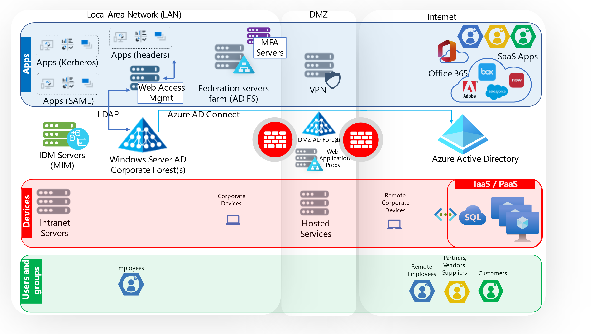
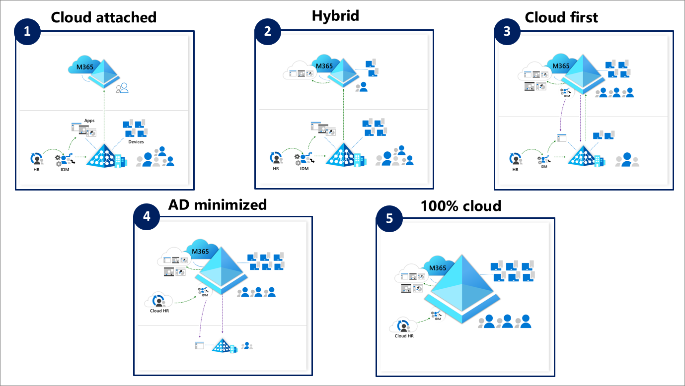

# Cloud transformation posture

Active Directory (AD) and Azure Active Directory (Azure AD) and other Microsoft tools are at the core of identity and access management. For example, device management in AD is provided by Active Directory Domain Services (AD DS) and Microsoft Endpoint Configuration Manager (MECM). In Azure AD, the same capability is provided using Azure AD and Intune.

As part of most modernization, migration, or zero-trust initiatives, identity and access management (IAM) activities are shifted from using on-premises or Infrastructure-as-a-Service (IaaS) solutions to using built-for-the-cloud solutions. For an IT environment with Microsoft products and services, Active Directory (AD) and Azure Active Directory (Azure AD) play a role.

Many companies migrating from Active Directory (AD) to Azure Active Directory (Azure AD) start with an environment similar to the following diagram. The diagram also overlays three pillars:

* **Applications**: This pillar includes the applications, resources, and their underlying domain-joined servers.

* **Devices**: This pillar focuses on domain-joined client devices.

* **Users and Groups**: Represent the human and non-human identities and attributes that access resources from different devices as specified.

Microsoft has modeled five states of transformation that commonly align with the business goals of our customers. As the goals of customers mature, it's typical for them to shift from one state to the next at a pace that suits their resourcing and culture. This approach closely follows [Active Directory in Transition: Gartner Survey| Results and Analysis](https://www.gartner.com/en/documents/4006741).

The five states have exit criteria to help you determine where your environment resides today. Some projects, such as application migration span all five states, while others span a single state.

The content then provides more detailed guidance organized to help with intentional changes to people, process, and technology to:

* Establish Azure AD footprint

* Implement a cloud-first approach

* Start to migrate out of your AD environment

Guidance is provided organized by user management, device management, and application management per the pillars above.

Organizations that are formed in Azure AD rather than in AD don't have the legacy on-premises environment that more established organizations must contend with. For them, or customers that are completely recreating their IT environment in the cloud, becoming 100% cloud-centric can be accomplished as the new IT environment is established.

For customers with established on-premises IT capability, the transformation process introduces complexity that requires careful planning. Additionally, since AD and Azure AD are separate products targeted at different IT environments, there aren't like-by-like features. For example, Azure AD does not have the notion of AD domain and forest trusts.

## Five States of transformation

In enterprise-sized organizations, IAM transformation, or even transformation from AD to Azure AD is typically a multi-year effort with multiple states. You analyze your environment to determine your current state, and then set a goal for your next state. Your goal might remove the need for AD entirely, or you might decide not to migrate some capability to Azure AD and leave it in place. The states are meant to logically group initiatives into projects towards completing a transformation. During the state transitions, interim solutions are put in place. The interim solutions enable the IT environment to support IAM operations in both AD and Azure AD. The interim solutions must also enable the two environments to interoperate. The following diagram shows the five states:

>[!NOTE]
> The states in this diagram represent a logical progression of cloud transformation. Your ability to move from one state to the next is dependent on the functionality that you have implemented and the capabilities within that functionality to move to the cloud.

**State 1 Cloud attached** - In this state, organizations have created an Azure AD tenant to enable user productivity and collaboration tools and the tenant is fully operational. Most companies that use Microsoft products and services in their IT environment are already in or beyond this state. In this state operational costs may be higher because there's an on-premises environment and cloud environment to maintain and make interactive. Also, people must have expertise in both environments to support their users and the organization. In this state:

* Devices are joined to AD and managed using group policy and or on-premises device management tools.
* Users are managed in AD, provisioned via on-premises IDM systems, and synchronized to Azure AD with Azure AD Connect.
* Apps are authenticated to AD, federation servers like AD FS, or Web Access Manager (WAM), Microsoft 365 or other tools such as SiteMinder and Oracle Access Manager (OAM).

**State 2 Hybrid** - In this state, the organizations start to enhance their on-premises environment through cloud capabilities. The solutions can be planned to reduce complexity, increase security posture, and reduce the footprint of the on-premises environment. During transition and operating in this state, organizations grow the skills and expertise using Azure AD for IAM solutions. Since user accounts and device attachments are relatively easy and a common part of day-to-day IT operations, this is the approach most organizations have used. In this state:

* Windows clients are hybrid Azure AD joined.

* Non-Microsoft SaaS-based start being integrated with Azure AD, for example Salesforce and ServiceNow.

* Legacy apps are authenticating to Azure AD via App Proxy or secure hybrid access partner solutions.

* Self-service password reset (SSPR) and password protection for users are enabled.

* Some legacy apps are authenticated in the cloud using Azure AD Directory Service (Azure AD DS) and App Proxy.

**State 3 Cloud first**  - In this state, the teams across the organization build a track record of success and start planning to move more challenging workloads to Azure AD. Organizations typically spend the most time in this state of transformation. As complexity and number of workloads grow over time, the longer an organization has used Active Directory (AD) the greater the effort and number of initiatives needed to shift to the cloud. In this state:

* New Windows clients are joined to Azure AD and are managed with Intune.
* ECMA connectors are used for provision users and groups for on-premises apps.
* All apps that were previously using an AD DS-integrated federated identity provider such as Active Directory Federation Services (ADFS), are updated to use Azure AD for authentication. And, if you were using password-based authentication via that identity provider for Azure AD, that is migrated to Password Hash Synchronization (PHS).
* Plans to shift file and print services to Azure AD are being developed.
* Collaboration capability is provided by Azure AD B2B.
* New groups are created and managed in Azure AD.

**State 4 AD minimized** - Most IAM capability is provided by Azure AD while edge cases and exceptions continue to utilize on-premises AD. This state is more difficult to achieve, especially for larger organizations with significant on-premises technical debt. Azure AD continues to evolve as your organization’s transformation matures, bringing new features and tools that you can utilize. Organizations are required to deprecate capability or build new capability to provide replacement. In this state:

* New users provisioned using the HR provisioning capability are created directly in Azure AD.

* A plan to move apps that depend on AD and are part of the vision for the future state Azure AD environment is being executed. A plan to replace services that won't move (file, print, fax services) is in place.

* On-premises workloads have been replaced with cloud alternatives such as Windows Virtual Desktop, Azure Files, Cloud Print. SQL is replaced by SQL MI. Azure AD Kerberos is being migrated to Azure AD.

**State 5 100% cloud** - In this state, IAM capability is all provided by Azure AD and other Azure tools. This is the long-term aspiration for many organizations. In this state:

* No on-premises IAM footprint required.

* All devices are managed in Azure AD and cloud solution such as Intune.

* User identity lifecycle is managed using Azure AD.

* All users and groups are cloud native.

* Network services that rely on AD are relocated.

The transformation between the states is similar to moving locations:

* **Establish new location** - You purchase your destination and establish connectivity between the current location and the new location. This enables you to maintain your productivity and ability to operate. In this content, the activities are described in **[Establish Azure AD footprint](road-to-the-cloud-establish.md)**. The results transition you to State 2.

* **Limit new items in old location** - You stop investing in the old location and set policy to stage new items in new location. In this content, the activities are described in **[Implement cloud-first approach](road-to-the-cloud-implement.md)**. The activities set the foundation to migrate at scale and reach State 3.

* **Move existing items to new location** - You move items from the old location to the new location. You assess the business value of the items to determine if you'll move them as-is, upgrade them, replace them, or deprecate them. In this content, the activities are described in **[Transition to the cloud](road-to-the-cloud-migrate.md)**. These activities enable you to complete State 3 and reach State 4 and State 5. Based on your business objectives, you decide what end state you want to target.

Transformation to the cloud isn't only the identity team's responsibility. Coordination across teams to define policies beyond technology that include people and process change are required. Using a coordinated approach helps to ensure consistent progress and reduces the risk of regressing to on-premises solutions. Involve teams that manage:

* Device/endpoint
* Networking
* Security/risk
* Application owners
* Human resources
* Collaboration 
* Procurement
* Operations

As a migration of IAM to Azure AD is started, organizations must determine the prioritization of efforts based on their specific needs. Teams of operational staff and support staff must be trained to perform their jobs in the new environment. The following shows the high-level journey for AD to Azure AD migration:

:::image type="content" source="media/road-to-cloud-posture/road-to-the-cloud-migration.png" alt-text="Table depicting three major milestones that organizations move through when implementing an AD to Azure AD migration. These include Establish Azure AD capabilities, Implement cloud-first approach, and Move workloads to the cloud." border="false":::

* **Establish Azure AD footprint**: Initialize your new Azure AD tenant to supports the vision for your end-state deployment. Adopt a [Zero Trust](https://www.microsoft.com/security/blog/2020/04/30/zero-trust-deployment-guide-azure-active-directory/) approach and a security model that [protects your tenant from on-premises compromise](../fundamentals/protect-m365-from-on-premises-attacks.md) early in your journey.

* **Implement cloud-first approach**: Establish a policy that mandates all new devices, apps and services should be cloud-first. New applications and services using legacy protocols (NTLM, Kerberos, LDAP etc.) should be by exception only.

* **Transition to the cloud**: Shift the management and integration of users, apps and devices away from on-premises and over to cloud-first alternatives. Optimize user provisioning by taking advantage of [cloud-first provisioning capabilities](../governance/what-is-provisioning.md) that integrate with Azure AD. 

The transformation changes how users accomplish tasks and how support teams provide end-user support. Initiatives or projects should be designed and implemented in a manner that minimizes the impact on user productivity. As part of the transformation, self-service IAM capabilities are introduced. Some portions of the workforce more easily adapt to the self-service user environment prevalent in cloud-based businesses.

Aging applications might require updating or replacing to operate well in cloud-based IT environments. Application updates or replacements can be costly and time-consuming. The planning and Stages must also take the age and capability of the applications an organization uses.

## Next steps

* [Introduction](road-to-the-cloud-introduction.md)

* [Establish an Azure AD footprint](road-to-the-cloud-establish.md)

* [Implement a cloud-first approach](road-to-the-cloud-implement.md)

* [Transition to the cloud](road-to-the-cloud-migrate.md)
