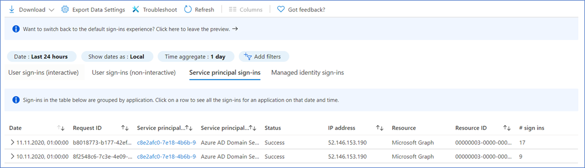

# Governing Azure AD service accounts

There are three types of service accounts in Azure Active Directory (Azure AD): [managed identities](service-accounts-managed-identities.md), [service principals](service-accounts-principal.md), and user accounts employed as service accounts. As you create these service accounts for automated use, they're granted permissions to access resources in Azure and Azure AD. Resources can include Microsoft 365 services, software as a service (SaaS) applications, custom applications, databases, HR systems, and so on. Governing Azure AD service accounts means that you manage their creation, permissions, and lifecycle to ensure security and continuity.

> [!IMPORTANT] 
> We do not recommend using user accounts as service accounts as they are inherently less secure. This includes on-premises service accounts that are synced to Azure AD, as they are  not converted to service principals. Instead, we recommend the use of managed identities or service principals. Note that at this time the use of conditional access policies with service principals is called Conditional Access for workload identities and it's in public preview.

## Plan your service account

Before creating a service account, or registering an application, document the service account’s key information. Having information documented makes it easier to effectively monitor and govern the account. We recommend collecting the following data and tracking it in your centralized Configuration Management Database (CMDB).

| Data| Description| Details |
| - | - | - |
| Owner| User or group that is accountable for managing and monitoring the service account.| Provision the owner with necessary permissions to monitor the account and implement a way to mitigate issues. Issue mitigation may be done by the owner, or via a request to IT. |
| Purpose| How the account will be used.| Map the service account to a specific service, application, or script. Avoid creating multi-use service accounts. |
| Permissions (Scopes)| Anticipated set of permissions.| Document the resources it will access and the permissions to those resources. |
| CMDB Link| Link to the resources to be accessed, and scripts in which the service account is used.| Ensure you document the resource and script owners so that you can communicate any necessary upstream and downstream effects of changes. |
| Risk assessment| Risk and business impact if the account were to be compromised.| Use this information to narrow the scope of permissions and determine who should have access to the account information. |
| Period for review| The schedule on which the service account is to be reviewed by the owner.| Use this to schedule review communications and reviews. Document what should happen if a review is not performed by a specific time after the scheduled review period. |
| Lifetime| Anticipated maximum lifetime of account.| Use this to schedule communications to the owner, and to ultimately disable then delete the accounts. Where possible, set an expiration date for credentials, where credentials cannot be rolled over automatically. |
| Name| Standardized name of account| Create a naming schema for all service accounts so that you can easily search, sort, and filter on service accounts. |

## Use the principle of least privileges
Grant the service account only the permissions necessary to perform its tasks, and no more. If a service account needs high-level permissions, for example a global administrator level of privilege, evaluate why and try to reduce the necessary permissions.

We recommend the following practices for service account privileges.

**Permissions**

* Do not assign built-in roles to service accounts. Instead, use the [OAuth2 permission grant model for Microsoft Graph](/graph/api/resources/oauth2permissiongrant),

* If the service principal must be assigned a privileged role, consider assigning a [custom role](../roles/custom-create.md) with specific, required privileged, in a time-bound fashion.

* Do not include service accounts as members of any groups with elevated permissions. 

* [Use PowerShell to enumerate members of privileged roles](/powershell/module/azuread/get-azureaddirectoryrolemember), such as   
‎`Get-AzureADDirectoryRoleMember`, and filter for objectType "Service Principal".

   or use  
‎   `Get-AzureADServicePrincipal | % { Get-AzureADServiceAppRoleAssignment -ObjectId $_ }`

* [Use OAuth 2.0 scopes](../develop/v2-permissions-and-consent.md) to limit the functionality a service account can access on a resource.
* Service principals and managed identities can use OAuth 2.0 scopes in either a delegated context that is impersonating a signed-on user, or as service account in the application context. In the application context no is signed-on.

* Check the scopes service accounts request for resources to ensure they're appropriate. For example, if an account is requesting Files.ReadWrite.All, evaluate if it actually needs only File.Read.All. For more information on permissions, see to [Microsoft Graph permission reference](/graph/permissions-reference).

* Ensure you trust the developer of the application or API with the access requested to your resources.

**Duration**

* Limit service account credentials (client secret, certificate) to an anticipated usage period.

* Schedule periodic reviews the use and purpose of service accounts. Ensure reviews are conducted prior to expiration of the account.

Once you have a clear understanding of the purpose, scope, and necessary permissions, create your service account. 

[Create and use managed identities](../../app-service/overview-managed-identity.md?tabs=dotnet)

[Create and use service principals](../develop/howto-create-service-principal-portal.md)

Use a managed identity when possible. If you cannot use a managed identity, use a service principal. If you cannot use a service principal, then and only then use an Azure AD user account.

 

## Build a lifecycle process

Managing the lifecycle of a service account starts with planning and ends with its permanent deletion. 

This article has previously covered the planning and creation portion. You must also monitor, review permissions, determine an account's continued usage, and ultimately deprovision the account.

### Monitor service accounts

Proactively monitor your service accounts to ensure the service account’s usage patterns reflects the intended patterns and that the service account is still actively used.

**Collect and monitor service account sign-ins using one of the following methods:**

* Using the Azure AD Sign-In Logs in the Azure AD Portal.

* Exporting the Azure AD Sign-In Logs to [Azure Storage](../../storage/index.yml), [Azure Event Hubs](../../event-hubs/index.yml), or [Azure Monitor](../../azure-monitor/logs/data-platform-logs.md).

**Intelligence that you should look for in the Sign-In logs includes:**

* Are there service accounts that no longer sign in to the tenant?

* Are sign-in patterns of service accounts changing?

We recommend you export Azure AD sign-In logs and import them into your existing Security Information and Event Management (SIEM) tools such as Microsoft Sentinel. Use your SIEM to build alerting and dashboards.

### Review service account permissions

Regularly review the permissions granted and scopes accessed by service accounts to see if they can be reduced eliminated.

* Use [PowerShell](/powershell/module/azuread/get-azureadserviceprincipaloauth2permissiongrant) to [build automation for checking and documenting](https://gist.github.com/psignoret/41793f8c6211d2df5051d77ca3728c09) scopes to which consent is granted to a service account.

* Use PowerShell to [review existing service principals' credentials](https://github.com/AzureAD/AzureADAssessment) and check their validity.

* Do not set service principal’s credentials to "Never expire".

* Use certificates or credentials stored in Azure KeyVault where possible.

Microsoft's free PowerShell sample collects service principal’s OAuth2 grants and credential information, records them in a comma-separated values file (CSV), and a Power BI sample dashboard to interpret and use the data. for more information, see [AzureAD/AzureADAssessment: Tooling for assessing an Azure AD tenant state and configuration (github.com)](https://github.com/AzureAD/AzureADAssessment)

### Recertify service account use

Establish a review process to ensure that service accounts are regularly reviewed by their owners and the security or IT team at regular intervals. 

**The process should include:**

* How to determine each service accounts’ review cycle (should be documented in your CMDB).

* The communications to owner and security or IT teams before reviews start.

* The timing and content of warning communications if the review is missed.

* Instructions on what to do if the owners fail to review or respond. For example, you may want to disable (but not delete) the account until the review is complete.

* Instructions on determining upstream and downstream dependencies and notifying other resource owners of any effects.

**The review should include the owner and their IT partner certifying that:**

* The account is still necessary.

* The permissions granted to the account are adequate and necessary, or a change is requested.

* The access to the account and its credentials is controlled.

* The credentials the account uses are appropriate, in respect to the risk the account was assessed with (both credential type and credential lifetime)

* The account’s risk scoring hasn't changed since the last recertification

* An update on the expected lifetime of the account, and the next recertification date.

### Deprovision service accounts

**Deprovision service accounts under the following circumstances:****

* The script or application the service account was created for is retired.

* The function within the script or application the service account is used for (for example, access to a specific resource) is retired.

* The service account is replaced with a different service account.

* The credentials expired, or the account is otherwise non-functional, and there aren’t any complaints.

**The processes for deprovisioning should include the following tasks.**

1. Once the associated application or script is deprovisioned, [monitor sign-ins](../reports-monitoring/concept-sign-ins.md) and resource access by the service account.

   * If the account still is active, determine how it's being used before taking subsequent steps.
 
2. If this is a managed service identity, then disable the service account from signing in, but don't remove it from the directory.

3. Revoke role assignments and OAuth2 consent grants for the service account.

4. After a defined period, and ample warning to owners, delete the service account from the directory.

## Next steps
For more information on securing Azure service accounts, see:

[Introduction to Azure service accounts](service-accounts-introduction-azure.md)

[Securing managed identities](service-accounts-managed-identities.md)

[Securing service principles](service-accounts-principal.md)

 
