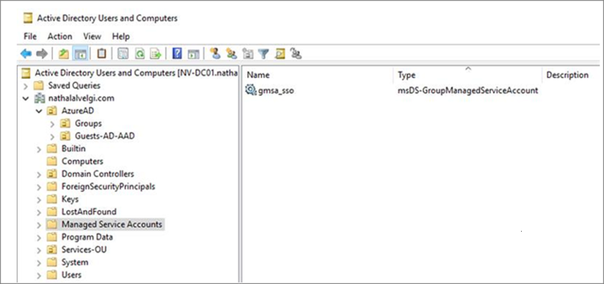

# Securing group managed service accounts

Group managed service accounts (gMSAs) are managed domain accounts that are used for securing services. gMSAs can run on a single server, or in a server farm, such as systems behind a Network Load Balancer (NLB) or an Internet Information Services (IIS) server. Once you configure your services to use a gMSA principal, password management for that account is handled by Windows.

## Benefits of using gMSAs

gMSAs offer a single identity solution with greater security while reducing administrative overhead by:

* **Setting strong passwords**. gMSAs use 240 byte randomly generated complex passwords. The complexity and length of gMSA passwords minimizes the likelihood of a service getting compromised by brute force or dictionary attacks.

* **Cycling passwords regularly**. gMSAs shift password management to Windows, which changes the password every 30 days. Service and domain administrators no longer need to schedule password changes or manage service outages to keep service accounts secure. 

* **Supporting deployment to server farms**. The ability to deploy gMSAs to multiple servers allows for the support of load balanced solutions where multiple hosts run the same service. 

* **Supporting simplified Server Principal Name (SPN) management**. You can set up SPN using PowerShell at the time of account creation. In addition, services that support automatic SPN registrations may do so against the gMSA, provided gMSA permissions are correctly set. 

## When to use gMSAs

Use gMSAs as the preferred account type for on-premises services unless a service, such as Failover Clustering, doesn't support it.

> [!IMPORTANT]
> You must test your service with gMSAs prior to deployment into production. To do so, set up a test environment and ensure the application can use the gMSA, and access the resources it needs to access. For more information, see [Support for group managed service accounts](/system-center/scom/support-group-managed-service-accounts?view=sc-om-2019).


If a service doesn't support the use of gMSAs, your next best option is to use a standalone Managed Service Account (sMSA). sMSAs provide the same functionality as a gMSA, but are intended for deployment on a single server only.

If you can't use a gMSA or sMSA is supported by your service, then the service must be configured to run as a standard user account. Service and domain administrators are required to observe strong password management processes to keep the account secure.

## Assess the security posture of gMSAs

gMSAs are inherently more secure than standard user accounts, which require ongoing password management. However, it's important to consider gMSAs’ scope of access as you look at their overall security posture.

The following table shows potential security issues and mitigations for using gMSAs.

| Security issues| Mitigations |
| - | - |
| gMSA is a member of privileged groups. | Review your group memberships. To do so you can create a PowerShell script to enumerate all group memberships, and then filter a resultant CSV file by the names of your gMSA files. <br>Remove the gMSA from privileged groups.<br> Grant the gMSA only the rights and permissions it requires to run its service (consult with your service vendor). 
| gMSA has read/write access to sensitive resources. | Audit access to sensitive resources. Archive audit logs to a SIEM, for example Azure Log Analytics or Azure Sentinel, for analysis. Remove unnecessary resource permissions if an undesirable level of access is detected. |


## Find gMSAs

Your organization may already have gMSAs created. Run the following PowerShell cmdlet to retrieve these accounts:

To work effectively, gMSAs must be in the Managed Service Accounts organizational unit (OU).

  


To find service MSAs that may not be there, see the following commands.

**To find all service accounts, including gMSAs and sMSAs:**


```powershell

Get-ADServiceAccount -Filter *

# This PowerShell cmdlet will return all Managed Service Accounts (both gMSAs and sMSAs). An administrator can differentiate between the two by examining the ObjectClass attribute on returned accounts.

# For gMSA accounts, ObjectClass = msDS-GroupManagedServiceAccount

# For sMSA accounts, ObjectClass = msDS-ManagedServiceAccount

# To filter results to only gMSAs:

Get-ADServiceAccount –Filter * | where $_.ObjectClass -eq "msDS-GroupManagedServiceAccount”}
```

## Manage gMSAs

You can use the following Active Directory PowerShell cmdlets for managing gMSAs:

`Get-ADServiceAccount`

`Install-ADServiceAccount`

`New-ADServiceAccount`

`Remove-ADServiceAccount`

`Set-ADServiceAccount`

`Test-ADServiceAccount`

`Uninstall-ADServiceAccount`

> [!NOTE]
> Beginning with Windows Server 2012, the *-ADServiceAccount cmdlets work with gMSAs by default. For more information on usage of the above cmdlets, see [**Getting Started with Group Managed Service Accounts**](/windows-server/security/group-managed-service-accounts/getting-started-with-group-managed-service-accounts).

## Move to a gMSA
gMSAs are the most secure type of service account for on-premises needs. If you can move to one, you should. Additionally, consider moving your services to Azure and your service accounts to Azure Active directory.

1.  Ensure that the [KDS Root Key is deployed in the forest](/windows-server/security/group-managed-service-accounts/create-the-key-distribution-services-kds-root-key). This is a one-time operation.

2. [Create a new gMSA](/windows-server/security/group-managed-service-accounts/getting-started-with-group-managed-service-accounts).

3. Install the new gMSA on each host running the service.
   > [!NOTE] 
   > For more information on creation and installation of gMSA on a host, prior to configuring your service to use gMSA, see [Getting Started with Group Managed Service Accounts](/previous-versions/windows/it-pro/windows-server-2012-R2-and-2012/jj128431(v=ws.11))

 
4. Change your service identity to gMSA and specify a blank password.

5. Validate that your service is working under the new gMSA identity.

6. Delete the old service account identity.

 

## Next steps
See the following articles on securing service accounts

* [Introduction to on-premises service accounts](service-accounts-on-premises.md)

* [Secure group managed service accounts](service-accounts-group-managed.md)

* [Secure standalone managed service accounts](service-accounts-standalone-managed.md)

* [Secure computer accounts](service-accounts-computer.md)

* [Secure user accounts](service-accounts-user-on-premises.md)

* [Govern on-premises service accounts](service-accounts-govern-on-premises.md)