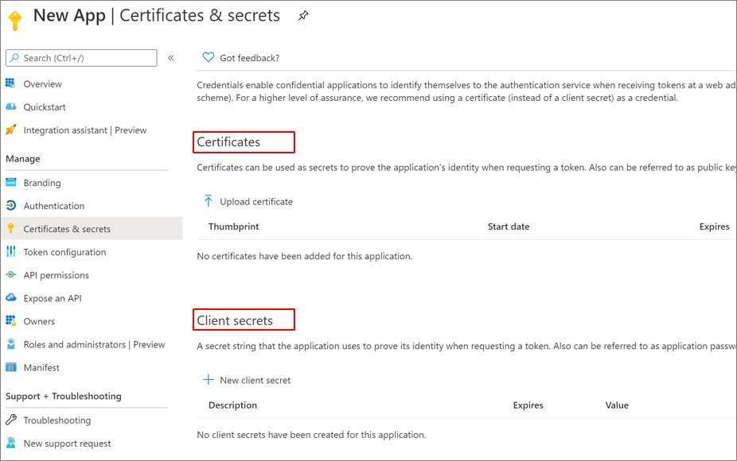

# Securing service principals

An Azure Active Directory (Azure AD) [service principal](../develop/app-objects-and-service-principals.md) is the local representation of an application object in a single tenant or directory.  ‎It functions as the identity of the application instance. Service principals define who can access the application, and what resources the application can access. A service principal is created in each tenant where the application is used and references the globally unique application object. The tenant secures the service principal’s sign in and access to resources.  

### Tenant-service principal relationships
A single-tenant application has only one service principal in its home tenant. A multi-tenant web application or API requires a service principal in each tenant. A service principal is created when a user from that tenant has consented to the application's or API's use. ​This consent creates a one-to-many relationship between the multi-tenant application and its associated service principals.

A multi-tenant application is homed in a single tenant and is designed to have instances in other tenants. Most software-as-a-service (SaaS) applications are designed for multi-tenancy. 
Use service principals to ensure the right security posture for the application and its users in both single tenant and multi-tenant use cases.

## ApplicationID and ObjectID

A given application instance has two distinct properties: the ApplicationID (also known as ClientID) and the ObjectID.

> [!NOTE] 
> You may find that the terms application and service principal are used interchangeably when loosely referring to an application in the context of authentication related tasks. However, they are two different representations of applications in Azure AD.
 

The ApplicationID represents the global application and is the same for all the application instances across tenants. The ObjectID is a unique value for an application object. As with users, groups, and other resources, the ObjectID helps uniquely identify an application instance in Azure AD.

​​For more detailed information on this topic, see [Application and service principal relationship](../develop/app-objects-and-service-principals.md).

You can also create an application and its service principal object (ObjectID) in a tenant using Azure PowerShell, Azure CLI, Microsoft Graph, the Azure portal, and other tools. 

## Service principal authentication

There are two mechanisms for authentication using service principals—client certificates and client secrets. 

​Certificates are more secure: use client certificates if possible. Unlike client secrets, client certificates cannot accidentally be embedded in code. Use Azure Key Vault for certificate and secrets management when possible to encrypt the following assets by using keys protected by hardware security modules:

* authentication keys

* storage account keys

* data encryption keys

* .pfx files

* passwords 

For more information on Azure Key Vault and how to use it for certificate and secret management, see 
[About Azure Key Vault](../../key-vault/general/overview.md) and [Assign a Key Vault access policy using the Azure portal](../../key-vault/general/assign-access-policy-portal.md). 

 ### Challenges and mitigations
The following table presents mitigations to challenges you may encounter when using service principals.

| Challenges​| Mitigations​ |
| - | - |
| Access reviews for service principals​ assigned to privileged roles.| This functionality is in preview, and not yet widely available. |
| Reviews service principals’ access| Manual check of resource’s access control list using the Azure portal. |
| Over permissioned service principals| When you create automation service accounts or or service principals, provide only the permissions that are required for the task. Evaluate existing service principals to see if you can reduce privileges. |
|Identify modifications to service principals' credentials or authentication methods |Use the Sensitive Operations Report workbook, which can help mitigate this issue. [See the explanation in this blog post](https://techcommunity.microsoft.com/t5/azure-active-directory-identity/azure-ad-workbook-to-help-you-assess-solorigate-risk/ba-p/2010718).|

## Find accounts using service principals
Run the following commands to find accounts using service principals.

Using Azure CLI

`az ad sp list`

Using PowerShell

`Get-AzureADServicePrincipal -All:$true` 

For more information see [Get-AzureADServicePrincipal](/powershell/module/azuread/get-azureadserviceprincipal)

## Assess service principal security

To assess the security of your service principals, ensure you evaluate privileges and credential storage.

Mitigate potential challenges using the following information.

|Challenges | Mitigations|
| - | - |
| Detect the user that consented to a multi-tenant app​, and detect illicit consent grants to a multi-tenant app | Run the following PowerShell to find multi-tenant apps. `Get-AzureADServicePrincipal -All:$true ? {$_.Tags -eq WindowsAzureActiveDirectoryIntegratedApp"}` Disable user consent. ​ Allow user consent from verified publishers, for selected permissions (recommended)   Use conditional access to block service principals from untrusted locations. Configure them under the user context, and their tokens should be used to trigger the service principal.|
|Use of a hard-coded shared secret in a script using a service principal.|Use a certificate or Azure Key Vault​.|
|Tracking who is using the certificate or the secret​| Monitor the service principal's sign-ins using the Azure AD sign-in logs.|
Can't manage service principals' sign-in with Conditional Access.| Monitor the sign-ins using the Azure AD sign-in logs
| The default Azure RBAC role is Contributor​. |Evaluate the needs and apply the role with the least possible permissions to meet that need.|

## Move from a user account to a service principal​  
‎If you are using an Azure user account as a service principal, evaluate if you can move to a [Managed Identity](../../app-service/overview-managed-identity.md?tabs=dotnet) or a service principal. If you cannot use a managed identity, provision a service principal that has just enough permissions and scope to run the required tasks. You can create a service principal by [registering an application](../develop/howto-create-service-principal-portal.md), or with [PowerShell](../develop/howto-authenticate-service-principal-powershell.md).

When using Microsoft Graph, check the documentation of the specific API, [like in this example](/powershell/azure/create-azure-service-principal-azureps), ‎and make sure the permission type for application is showing as supported.

## Next steps

**To learn more about service principals:**

[Create a service principal](../develop/howto-create-service-principal-portal.md)

 [Monitor service principal sign-ins](../reports-monitoring/concept-sign-ins.md)

**To learn more about securing service accounts:**

[Introduction to Azure service accounts](service-accounts-introduction-azure.md)

[Securing managed identities](service-accounts-managed-identities.md)

[Governing Azure service accounts](service-accounts-governing-azure.md)

[Introduction to on-premises service accounts](service-accounts-on-premises.md)
