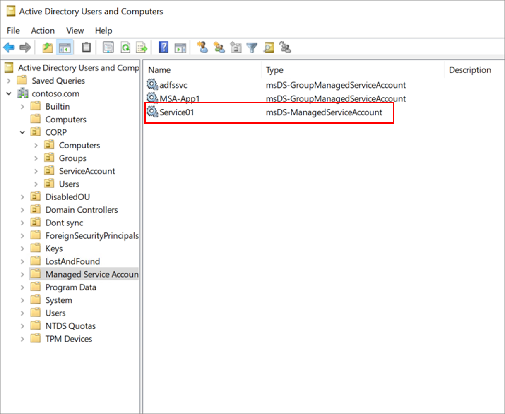

# Secure standalone managed service accounts

Standalone managed service accounts (sMSAs) are managed domain accounts that you use to help secure one or more services that run on a server. They can't be reused across multiple servers. sMSAs provide automatic password management, simplified service principal name (SPN) management, and the ability to delegate management to other administrators. 

In Active Directory, sMSAs are tied to a specific server that runs a service. You can find these accounts listed in the Active Directory Users and Computers snap-in of the Microsoft Management Console.

Managed service accounts were introduced with Windows Server 2008 R2 Active Directory Schema, and they require at least Windows Server 2008 R2​. 

## Benefits of using sMSAs

sMSAs offer greater security than user accounts that are used as service accounts. At the same time, to help reduce administrative overhead, they:

* **Set strong passwords**: sMSAs use 240-byte, randomly generated complex passwords. The complexity and length of sMSA passwords minimizes the likelihood of a service getting compromised by brute force or dictionary attacks.

* **Cycle passwords regularly**: Windows automatically changes the sMSA password every 30 days. Service and domain administrators don’t need to schedule password changes or manage the associated downtime.

* **Simplify SPN management**: Service principal names are automatically updated if the domain functional level is Windows Server 2008 R2. For instance, the service principal name is automatically updated when you:
   * Rename the host computer account.  
   * Change the domain name server (DNS) name of the host computer.  
   * Add or remove other sam-accountname or dns-hostname parameters by using [PowerShell](/powershell/module/activedirectory/set-adserviceaccount).

## When to use sMSAs

sMSAs can simplify management and security tasks. Use sMSAs when you have one or more services deployed to a single server and you can't use a group managed service account (gMSA). 

> [!NOTE] 
> Although you can use sMSAs for more than one service, we recommend that each service have its own identity for auditing purposes. 

If the creator of the software can’t tell you whether it can use an MSA, you must test your application. To do so, create a test environment and ensure that it can access all required resources. For more information, see [Create and install an sMSA](/archive/blogs/askds/managed-service-accounts-understanding-implementing-best-practices-and-troubleshooting).

### Assess the security posture of sMSAs

sMSAs are inherently more secure than standard user accounts, which require ongoing password management. However, it's important to consider sMSAs’ scope of access as part of their overall security posture.

To see how to mitigate potential security issues posed by sMSAs, refer to the following table:

| Security issue| Mitigation |
| - | - |
| sMSA is a member of privileged groups. | <li>Remove the sMSA from elevated privileged groups, such as Domain Admins.<li>Use the *least privileged* model, and grant the sMSA only the rights and permissions it requires to run its services.<li>If you're unsure of the required permissions, consult the service creator. |
| sMSA has read/write access to sensitive resources. | <li>Audit access to sensitive resources.<li>Archive audit logs to a Security Information and Event Management (SIEM) program, such as Azure Log Analytics or Microsoft Sentinel, for analysis.<li>Remediate resource permissions if an undesirable level of access is detected. |
| By default, the sMSA password rollover frequency is 30 days. | You can use group policy to tune the duration, depending on enterprise security requirements. To set the password expiration duration, use the following path: *Computer Configuration\Policies\Windows Settings\Security Settings\Security Options*. For domain member, use **Maximum machine account password age**. |
| | |

### Challenges with sMSAs

The challenges associated with sMSAs are as follows:

| Challenge| Mitigation |
| - | - |
| sMSAs can be used on a single server only. | Use a gMSA if you need to use the account across servers. |
| sMSAs can't be used across domains. | Use a gMSA if you need to use the account across domains. |
| Not all applications support sMSAs. | Use a gMSA if possible. Otherwise, use a standard user account or a computer account, as recommended by the application creator. |
| | |

## Find sMSAs

On any domain controller, run DSA.msc, and then expand the managed service accounts container to view all sMSAs. 

To return all sMSAs and gMSAs in the Active Directory domain, run the following PowerShell command: 

`Get-ADServiceAccount -Filter *`

To return only sMSAs in the Active Directory domain, run the following command:

`Get-ADServiceAccount -Filter * | where { $_.objectClass -eq "msDS-ManagedServiceAccount" }`

## Manage sMSAs

To manage your sMSAs, you can use the following Active Directory PowerShell cmdlets:

`Get-ADServiceAccount`
`Install-ADServiceAccount`
`New-ADServiceAccount`
`Remove-ADServiceAccount`
`Set-ADServiceAccount`
`Test-ADServiceAccount`
`Uninstall-ADServiceAccount`

## Move to sMSAs

If an application service supports sMSAs but not gMSAs, and you're currently using a user account or computer account for the security context, [Create and install an sMSA](/archive/blogs/askds/managed-service-accounts-understanding-implementing-best-practices-and-troubleshooting) on the server. 

Ideally, you would move resources to Azure and use Azure Managed Identities or service principals.

## Next steps

To learn more about securing service accounts, see the following articles:

* [Introduction to on-premises service accounts](service-accounts-on-premises.md)  
* [Secure group managed service accounts](service-accounts-group-managed.md)  
* [Secure computer accounts](service-accounts-computer.md)  
* [Secure user accounts](service-accounts-user-on-premises.md)  
* [Govern on-premises service accounts](service-accounts-govern-on-premises.md)
