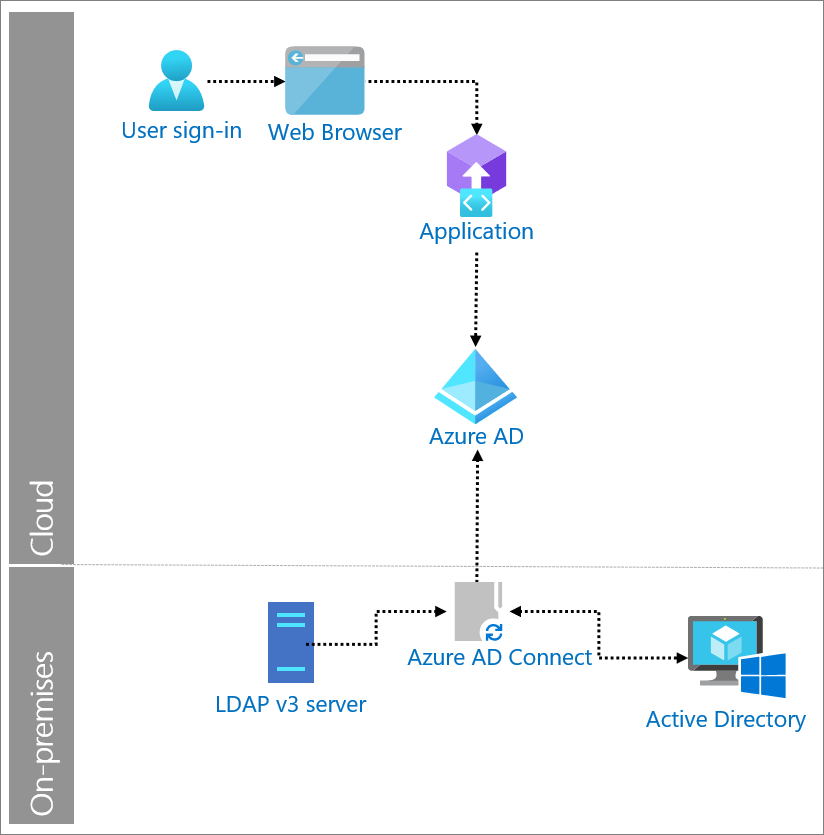

# LDAP synchronization with Azure Active Directory

The Lightweight Directory Access Protocol (LDAP) is a directory service protocol that runs on the TCP/IP stack. It provides a mechanism used to connect to, search, and modify internet directories. The LDAP directory service is based on a client-server model and its function is to enable access to an existing directory. Many companies depend on on-premises LDAP servers to store users and groups for their critical business apps. 

Azure Active Directory (Azure AD) can replace LDAP synchronization with Azure AD Connect. The Azure AD Connect synchronization service performs all the operations related to synchronizing identity data between your on-premises environments and Azure AD. 

## Use when

You need to synchronize identity data between your on-premises LDAP v3 directories and Azure AD. 

## Components of system

* **User**: Accesses an application that relies on the use of a LDAP v3 directory for sorting users and passwords.

* **Web browser**: The component that the user interacts with to access the external URL of the application

* **Web app**: Application with dependencies on LDAP v3 directories.

* **Azure AD**: Azure AD synchronizes identity information (users, groups, passwords) from organization’s on-premises LDAP directories via Azure AD Connect. 

* **Azure AD Connect**: is a tool for connecting on premises identity infrastructures to Microsoft Azure AD. The wizard and guided experiences help to deploy and configure pre-requisites and components required for the connection. 

* **Custom Connector**: A Generic LDAP Connector enables you to integrate the Azure AD Connect synchronization service with an LDAP v3 server. It sits on Azure AD Connect.

* **Active Directory**: Active Directory is a directory service included in most Windows Server operating systems. Servers running Active Directory Directory Services are called domain controllers and they authenticate and authorize all users and computers in a Windows domain.

* **LDAP v3 server**: LDAP protocol-compliant directory storing corporate users and passwords used for directory services authentication.

## Implement LDAP synchronization with Azure AD

* [Hybrid Identity directory integration tools](https://docs.microsoft.com/azure/active-directory/hybrid/plan-hybrid-identity-design-considerations-tools-comparison) 

* [Azure AD Connect installation roadmap](https://docs.microsoft.com/azure/active-directory/hybrid/how-to-connect-install-roadmap) 

* [Overview and creation a LDAP Connector](https://docs.microsoft.com/microsoft-identity-manager/reference/microsoft-identity-manager-2016-connector-genericldap) 

   > [!NOTE]
   > LDAP Connectors are an advanced configuration requiring some familiarity with Forefront Identity Manager and/or Microsoft Identity Manager. If used in production, we advise questions about this configuration should go through [Premier Support](https://support.microsoft.com/premier) or Microsoft Partner Network.

 
