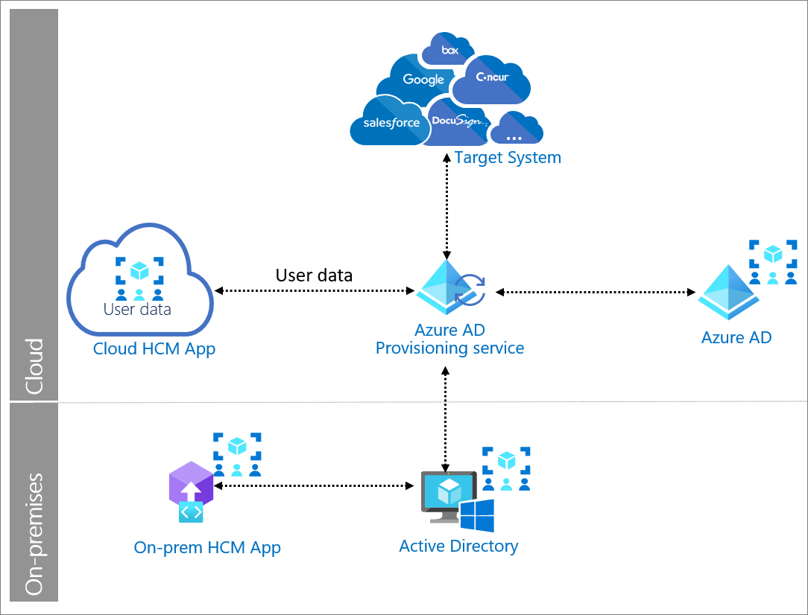

# SCIM synchronization with Azure Active Directory

System for Cross-Domain Identity Management (SCIM) is an open standard protocol for automating the exchange of user identity information between identity domains and IT systems. SCIM ensures that employees added to the Human Capital Management (HCM) system  automatically have accounts created in Azure Active Directory (Azure AD) or Windows Server Active Directory. User attributes and profiles are synchronized between the two systems, updating removing users based on the user status or role change.

SCIM is a standardized definition of two endpoints: a /Users’ endpoint and a /Groups endpoint. It uses common REST verbs to create, update, and delete objects. It also uses a pre-defined schema for common attributes like group name, username, first name, last name, and email. Applications that offer a SCIM 2.0 REST API can reduce or eliminate the pain of working with proprietary user management APIs or products. For example, any SCIM-compliant client can make an HTTP POST of a JSON object to the /Users endpoint to create a new user entry. Instead of needing a slightly different API for the same basic actions, apps that conform to the SCIM standard can instantly take advantage of pre-existing clients, tools, and code. 

## Use when: 

You want to automatically provision user information from an HCM system to Azure AD and Windows Server Active Directory, and then to target systems if necessary. 

## Components of system 

* **HCM system**: Applications and technologies that enable Human Capital Management process and practices that support and automate HR processes throughout the employee lifecycle. 

* **Azure AD Provisioning Service**: Uses the SCIM 2.0 protocol for automatic provisioning. The service connects to the SCIM endpoint for the application, and uses the SCIM user object schema and REST APIs to automate provisioning and de-provisioning of users and groups.  

* **Azure AD**: User repository used to manage the lifecycle of identities and their entitlements. 

* **Target system**: Application or system that has SCIM endpoint and works with the Azure AD provisioning to enable automatic provisioning of users and groups.  

## Implement SCIM with Azure AD 

* [How provisioning works in Azure AD ](../app-provisioning/how-provisioning-works.md)

* [Managing user account provisioning for enterprise apps in the Azure portal ](../app-provisioning/configure-automatic-user-provisioning-portal.md)

* [Build a SCIM endpoint and configure user provisioning with Azure AD  ](../app-provisioning/use-scim-to-provision-users-and-groups.md)

* [SCIM 2.0 protocol compliance of the Azure AD Provisioning Service](../app-provisioning/application-provisioning-config-problem-scim-compatibility.md)
