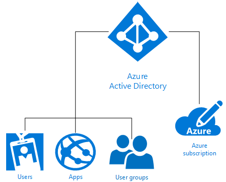

# What is Microsoft Azure identity?
Microsoft Azure Active Directory (Azure AD) is an identity and access management cloud solution that provides directory services, identity governance, and application access management. Azure AD quickly [enables single sign on (SSO)](https://docs.microsoft.com/azure/active-directory/active-directory-enterprise-apps-manage-sso) to 1,000’s of pre-integrated commercial and custom apps in the [Azure AD application gallery](https://azure.microsoft.com/marketplace/active-directory/all/). Many of these apps you probably already use such as Office 365, Salesforce.com, Box, ServiceNow, and Workday.

A single Azure AD directory is automatically associated with an Azure subscription when it is created. As the identity service in Azure, Azure AD then provides all identity management and access control functions for cloud-based resources. These resources can include users, apps, and groups for an individual tenant (organization) as shown in the following diagram:

Microsoft Azure offers several ways to leverage identity as a service (IDaaS) with varying levels of complexity to meet your individual organization’s needs. The rest of this article helps you understand basic Azure identity terminology and concepts as well as recommendations for you to make the best choice from the available options.

## Terms to know

Before you can decide on an Azure identity solution for your organization, you need a basic understanding of the terms commonly used when talking about Azure identity services.

|Term to know| Description|
|-----|-----|
|Azure subscription |Subscriptions are used to pay for Azure cloud services and are usually linked to a credit card. You can have several subscriptions, but it can be difficult to share resources between subscriptions.|
|Azure tenant | An Azure AD tenant is representative of a single organization. It is a dedicated, trusted instance of Azure AD that is automatically created when an organization signs up for a Microsoft cloud service subscription such as Azure, Intune, or Office 365. Tenants can gain access to services in either a dedicated environment (single tenant) or in a shared environment with other organizations (multitenant).|
|Azure AD directory | Each Azure tenant has a dedicated, trusted Azure AD directory that contains the tenant’s users, groups, and applications. It is used to perform identity and access management functions for tenant resources. Because a unique Azure AD directory is automatically provisioned to represent your organization when you sign up for a Microsoft cloud service like Azure, Microsoft Intune, or Office 365, you’ll sometimes see the terms *tenant*, *Azure AD*, and *Azure AD directory* used interchangeably. |
|Custom domain | When you first sign up for a Microsoft cloud service subscription, your tenant (organization) uses an *.onmicrosoft.com* domain name. However, most organizations have one or more domain names that are used to do business and that end users use to access company resources. You can add your custom domain name to Azure AD so that the domain name is familiar to your users, such as *alice@contoso.com* instead of *alice@contoso.onmicrosoft.com*. |
|Azure AD account | These are identities that are created by using Azure AD or another Microsoft cloud service such as Office 365. They are stored in Azure AD and accessible to any of the organization’s cloud service subscriptions. |
|Azure subscription administrator| The account administrator is the person who signed up for or bought the Azure subscription. They can use the [Account Center](https://account.azure.com/Subscriptions) to perform various management tasks like create subscriptions, cancel subscriptions, change the billing for a subscription, or change the Service Administrator. |
|Azure AD Global administrator | Azure AD Global administrators have full access to all Azure AD administrative features. The person who signs up for a Microsoft cloud service subscription automatically becomes a global administrator by default. You can have more than one global administrator, but only global administrators can assign any of [the other administrator roles](https://docs.microsoft.com/azure/active-directory/active-directory-assign-admin-roles-azure-portal) to users. |
|Microsoft account | Microsoft accounts (created by you for personal use) provide access to consumer-oriented Microsoft products and cloud services, like Outlook (Hotmail), OneDrive, Xbox LIVE, or Office 365. These identities are created and stored in the Microsoft consumer identity account system run by Microsoft.|
|Work or school accounts | Work or school accounts (issued by an admin for business/academic use) provide access to enterprise business-level Microsoft cloud services, such as Azure, Intune, or Office 365.|

## Concepts to understand

Now that you know the basic Azure identity terms, you should learn more about these Azure identity concepts that help you make an informed Azure identity service decision.

|Concept to understand |Description|
|-----|-----|
|[How Azure subscriptions are associated with Azure Active Directory](https://docs.microsoft.com/azure/active-directory/active-directory-how-subscriptions-associated-directory) |Every Azure subscription has a trust relationship with an Azure AD directory to authenticate users, services, and devices. *Multiple subscriptions can trust the same Azure AD directory, but a subscription will only trust a single Azure AD directory*. This trust relationship is unlike the relationship that a subscription has with other Azure resources (websites, databases, and so on), which are more like child resources of a subscription. If a subscription expires, then access to resources associated with the subscription other than Azure AD also stops. However, the Azure AD directory remains in Azure, so that you can associate another subscription with that directory and continue to manage tenant resources.|
|[How Azure AD licensing works](https://docs.microsoft.com/azure/active-directory/active-directory-licensing-get-started-azure-portal) | When you purchase or activate Enterprise Mobility Suite, Azure AD Premium, or Azure AD Basic, your directory is updated with the subscription, including its validity period and prepaid licenses. Once the subscription is active, the service can be managed by Azure AD global administrators and used by licensed users. Your subscription information, including the number of assigned or available licenses, is available in the Azure portal from the **Azure Active Directory** > **Licenses** blade. This is also the best place to manage your license assignments.|
|[Role-Based Access Control in the Azure portal](https://docs.microsoft.com/azure/role-based-access-control/overview)|Azure Role-Based Access Control (RBAC) helps provide fine-grained access management for Azure resources. Too many permissions can expose and account to attackers. Too few permissions means that employees can’t get their work done efficiently. Using RBAC, you can give employees the exact permissions they need based on three basic roles that apply to all resource groups: owner, contributor, reader. You can also create up to 2,000 of your own [custom RBAC roles](https://docs.microsoft.com/azure/role-based-access-control/custom-roles) to meet your specific needs. |
|[Hybrid identity](https://docs.microsoft.com/azure/active-directory/connect/active-directory-aadconnect)|Hybrid identity is achieved by integrating your on-premises Windows Server Active Directory (AD DS) with Azure AD using [Azure AD Connect](https://docs.microsoft.com/azure/active-directory/connect/active-directory-aadconnect). This allows you to provide a common identity for your users for Office 365, Azure, and on-premises apps or SaaS applications integrated with Azure AD. With hybrid identity, you effectively extend your on-premises environment to the cloud for identity and access.|

### The difference between Windows Server AD DS and Azure AD
Both Azure Active Directory (Azure AD) and on-premises Active Directory (Active Directory Domain Services or AD DS) are systems that store directory data and manage communication between users and resources, including user logon processes, authentication, and directory searches.

If you are already familiar with on-premises Windows Server Active Directory Domain Services (AD DS), first introduced with Windows 2000 Server, then you probably understand the basic concept of an identity service. However, it’s also important to understand that Azure AD is not just a domain controller in the cloud. It is an entirely new way of providing identity as a service (IDaaS) in Azure that requires an entirely new way of thinking to fully embrace cloud-based capabilities and protect your organization from modern threats. 

AD DS is a server role on Windows Server, which means that it can be deployed on physical or virtual machines. It has a hierarchical structure based on X.500. It uses DNS for locating objects, can be interacted with using LDAP, and it primarily uses Kerberos for authentication. Active Directory enables organizational units (OUs) and Group Policy Objects (GPOs) in addition to joining machines to the domain, and trusts are created between domains.

IT has protected their security perimeter for years using AD DS, but modern, perimeter-less enterprises supporting identity needs for employees, customers, and partners require a new control plane. Azure AD is that identity control plane. Security has moved beyond the corporate firewall to the cloud where Azure AD protects company resources and access by providing one common identity for users (either on-premises or in the cloud). This gives your users the flexibility to securely access the apps they need to get their work done from almost any device. Seamless risk-based data protection controls, backed by machine-learning capabilities and in-depth reporting, are also provided that IT needs to keep company data secure.

Azure AD is a multi-customer public directory service, which means that within Azure AD you can create a tenant for your cloud servers and applications such as Office 365. Users and groups are created in a flat structure without OUs or GPOs. Authentication is performed through protocols such as SAML, WS-Federation, and OAuth. It's possible to query Azure AD, but instead of using LDAP you must use a REST API called AD Graph API. These all work over HTTP and HTTPS.

### Extend Office 365 management and security capabilities
Already using Office 365? You can accelerate your digital transformation by extending built-in Office 365 capabilities with Azure AD to secure all your resources, enabling secure productivity for your entire workforce. When you use Azure AD, in addition to Office 365 capabilities, you can secure your entire application portfolio with one identity that enables single sign-on for all apps. You can expand your conditional access capabilities based not just on device state, but user, location, application, and risk as well. Multi-factor authentication (MFA) capabilities provide even more protection when you need it. You’ll gain additional oversight of user privileges and provide on-demand, just-in-time administrative access. Your users will be more productive, and create fewer helpdesk tickets, thanks to the self-service capabilities Azure AD provides like resetting forgotten passwords, application access requests, and creating and managing groups.

> [!TIP]
> Want to learn more about using Azure AD identity management with Office 365? [Get the e-book](https://info.microsoft.com/Extend-Office-365-security-with-EMS.html).

## Microsoft Azure identity solutions

Microsoft Azure offers several ways to manage your users’ identities whether they are maintained fully on-premises, only in the cloud, or even somewhere in between. These options include: do-it-yourself (DIY) AD DS in Azure, Azure Active Directory (Azure AD), Hybrid Identity, and Azure AD Domain Services.

### Do-it-yourself (DIY) AD DS
For companies that need only a small footprint in the cloud, **do-it-yourself (DIY) AD DS** in Azure can be used. This option supports many Windows Server AD DS scenarios that are well-suited for deployment as virtual machines (VMs) on Azure. For example, you can create an Azure VM as a domain controller running in a faraway datacenter that is connected to the remote network. From there, the VM would be able to support authentication requests from remote users and improve authentication performance. This option is also well-suited as a relatively low-cost substitute to otherwise costly disaster recovery sites by hosting a small number of domain controllers and a single virtual network on Azure. Finally, you might need to deploy an application on Azure, such as SharePoint, that requires Windows Server AD DS, but has no dependency on the on-premises network or the corporate Windows Server Active Directory. In this case, you could deploy an isolated forest on Azure to meet the SharePoint server farm’s requirements. It’s also supported to deploy network applications that do require connectivity to the on-premises network and the on-premises Active Directory.

### Azure Active Directory (Azure AD)
**Azure AD standalone** is a fully cloud-based Identity and access management as a Service (IDaaS) solution. Azure AD gives you a robust set of capabilities to manage users and groups. It helps secure access to on-premises and cloud applications, including Microsoft web services like Office 365, and many non-Microsoft software as a service (SaaS) applications. Azure AD comes in three editions: Free, Basic, and Premium. Azure AD boosts organizational effectiveness and extends security beyond the perimeter firewall to a new control plane protected by Azure machine learning and other advanced security features.

### Hybrid identity
Rather than choose between on-premises or cloud-based identity solutions, many forward-thinking CIOs and businesses, that have begun anticipating their company’s long-term direction, are extending their on-premises directories to the cloud through **hybrid identity** solutions. With hybrid identity, you get a truly global identity and access management solution that provides secure and productive access to the applications users need to do their jobs.

> [!TIP]
> To learn more about how CIOs have made Azure Active Directory a central part of their IT strategies, download the [CIO’s Guide to Azure Active Directory](https://aka.ms/AzureADCIOGuide).

### Azure AD Domain Services
**Azure AD Domain Services** provides a cloud-based option to use AD DS for lightweight Azure VM configuration control and a way to meet on-premises identity requirements for network application development and testing. Azure AD Domain Services is not meant to lift and shift your on-premises AD DS infrastructure to Azure VMs managed by Azure AD Domain Services. Instead, the Azure VMs in managed domains should be used to support the development, testing, and movement of on-premises applications that require AD DS authentication methods to the cloud.

## Common scenarios and recommendations

Here are some common identity and access scenarios with recommendations as to which Azure identity option might be most appropriate for each.

|Identity scenario| Recommendation|
|-----|-----|
|My organization has made large investments in on-premises Windows Server Active Directory, but we want to extend identity to the cloud.| The most widely used Azure identity solution is [hybrid identity](https://docs.microsoft.com/azure/active-directory/active-directory-hybrid-identity-design-considerations-overview). If you’ve already made investments in on-premises AD DS, you can easily extend identity to the cloud using Azure AD Connect.|
|My business was born in the cloud and we have no investments in on-premises identity solutions.| [Azure Active Directory](https://docs.microsoft.com/azure/active-directory/active-directory-whatis) is the best choice for cloud-only businesses with no on-premises investments.|
|I need lightweight Azure VM configuration and control to meet on-premises identity requirements for app development and testing.|[Azure AD Domain Services](https://docs.microsoft.com/azure/active-directory-domain-services/active-directory-ds-overview) is a good choice if you need to use AD DS for lightweight Azure VM configuration control or are looking to develop or migrate legacy, directory-aware on-premises applications to the cloud.|  
|I need to support a few virtual machines in Azure, but my company is still heavily invested in on-premises Active Directory (AD DS).|Use [DIY AD DS](https://docs.microsoft.com/azure/active-directory-domain-services/active-directory-ds-comparison#do-it-yourself-diy-ad-deployment-options) to use Azure VMs when you need to support a few virtual machines and have large AD DS investments on-premises. |

## Where can I learn more?
We have a ton of great resources online to help you learn all about Azure AD. Here’s a list of great articles to get you started:

* [Enabling your directory for hybrid management with Azure AD Connect](../hybrid/whatis-hybrid-identity.md)
* [Additional security for an ever connected world](../authentication/multi-factor-authentication.md)
* [Automate User Provisioning and Deprovisioning to SaaS Applications with Azure Active Directory](../manage-apps/user-provisioning.md)
* [Manage your passwords from anywhere](../user-help/active-directory-passwords-update-your-own-password.md)
* [What is application access and single sign-on with Azure Active Directory?](../manage-apps/what-is-single-sign-on.md)
* [Automate User Provisioning and Deprovisioning to SaaS Applications with Azure Active Directory](../manage-apps/user-provisioning.md)
* [How to provide secure remote access to on-premises applications](../manage-apps/application-proxy.md)
* [Managing access to resources with Azure Active Directory groups](active-directory-manage-groups.md)
* [What is Microsoft Azure Active Directory licensing?](active-directory-licensing-whatis-azure-portal.md)
* [How can I discover unsanctioned cloud apps that are used within my organization](../manage-apps/cloud-app-discovery.md)

## Next steps

Now that you understand Azure identity concepts and the options available to you, you can use the following resources to get started implementing the option you’ve chosen:

[Learn more about Azure hybrid identity solutions](https://docs.microsoft.com/azure/active-directory/choose-hybrid-identity-solution)

[Learn more in an Azure Proof of Concept environment](https://aka.ms/aad-poc)
