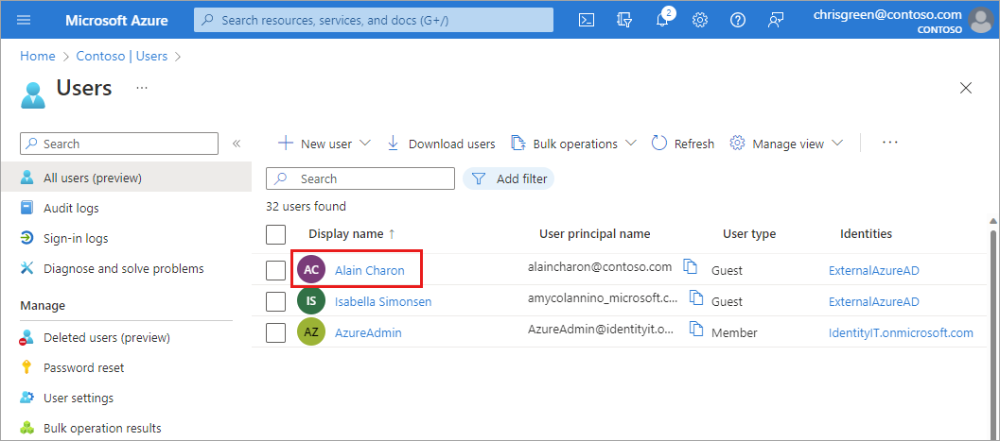
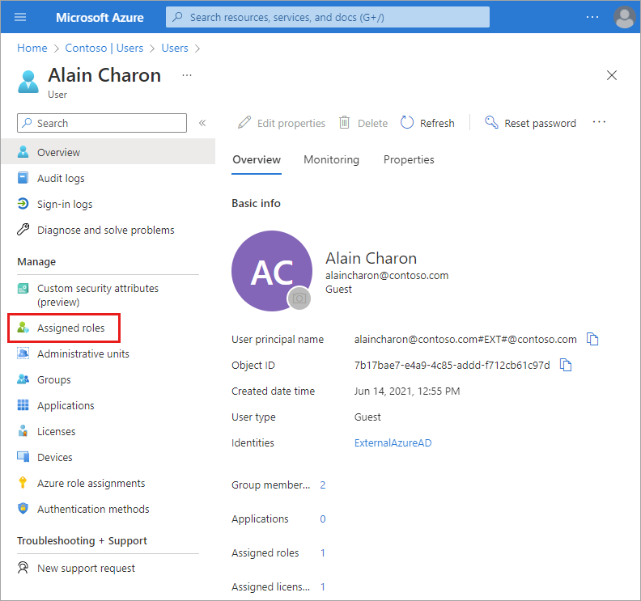
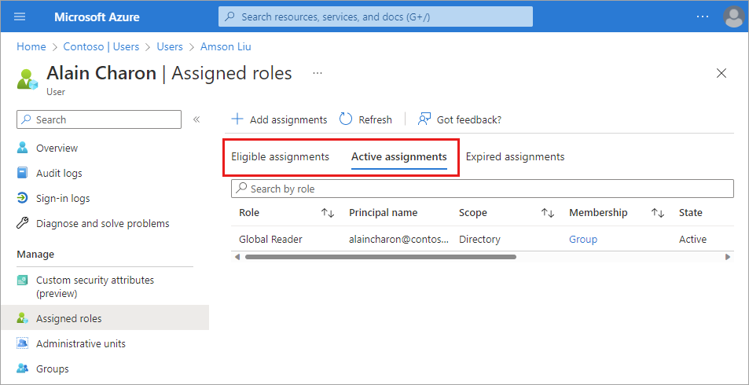
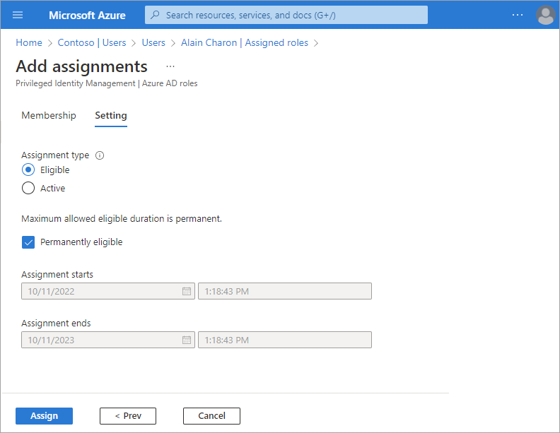
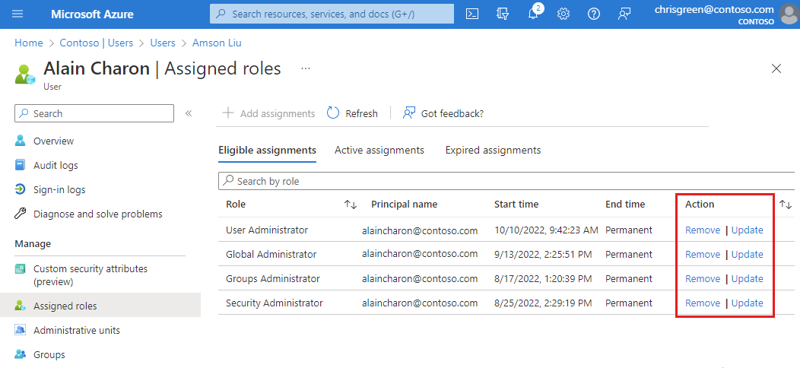

# Assign user roles with Microsoft Entra ID

The ability to manage resources is granted by assigning roles that provide the required permissions. Roles can be assigned to individual users or groups. To align with the [Zero Trust guiding principles](/azure/security/fundamentals/zero-trust), use Just-In-Time and Just-Enough-Access policies when assigning roles.

Before assigning roles to users, review the following Microsoft Learn articles:

- [Learn about Microsoft Entra roles](../roles/concept-understand-roles.md)
- [Learn about role based access control](/azure/role-based-access-control/rbac-and-directory-admin-roles)
- [Explore the Azure built-in roles](../roles/permissions-reference.md)

## Assign roles

There are two main steps to the role assignment process. First you'll select the role to assign. Then you'll adjust the role settings and duration.

### Select the role to assign

[!INCLUDE [portal updates](~/articles/active-directory/includes/portal-update.md)]

1. Sign in to the [Microsoft Entra admin center](https://entra.microsoft.com) as a [Privileged Role Administrator](../roles/permissions-reference.md#privileged-role-administrator).

1. Browse to **Identity** > **Users** > **All users**.

1. Search for and select the user getting the role assignment.

      

1. Select **Assigned roles** from the side menu, then select **Add assignments**. 

    

1. Select a role to assign from the dropdown list and select the **Next** button.

### Adjust the role settings

You can assign roles as either _eligible_ or _active_. Eligible roles are assigned to a user but must be elevated Just-In-Time by the user through Privileged Identity Management (PIM). For more information about how to use PIM, see [Privileged Identity Management](../privileged-identity-management/index.yml).

1. From the Setting section of the **Add assignments** page, select an **Assignment type** option.

1. Leave the **Permanently eligible** option selected if the role should always be available to elevate for the user.

    If you uncheck this option, you can specify a date range for the role eligibility.

1. Select the **Assign** button.

    Assigned roles appear in the associated section for the user, so eligible and active roles are listed separately. 

    

## Update roles

You can change the settings of a role assignment, for example to change an active role to eligible.

1. Browse to **Identity** > **Users** > **All users**.

1. Search for and select the user getting their role updated.

1. Go to the **Assigned roles** page and select the **Update** link for the role that needs to be changed.

1. Change the settings as needed and select the **Save** button.

    

## Remove roles

You can remove role assignments from the **Administrative roles** page for a selected user.

1. Browse to **Identity** > **Users** > **All users**.

1. Search for and select the user getting the role assignment removed.

1. Go to the **Assigned roles** page and select the **Remove** link for the role that needs to be removed. Confirm the change in the pop-up message.

## Next steps

- [Add or delete users](./add-users.md)

- [Add or change profile information](./how-to-manage-user-profile-info.md)

- [Add guest users from another directory](../external-identities/what-is-b2b.md)

- [Explore other user management tasks](../enterprise-users/index.yml)
