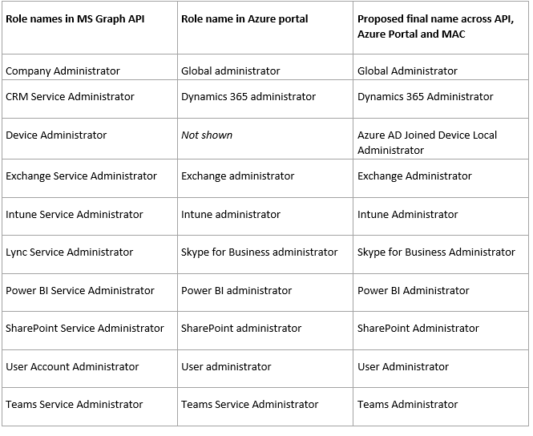
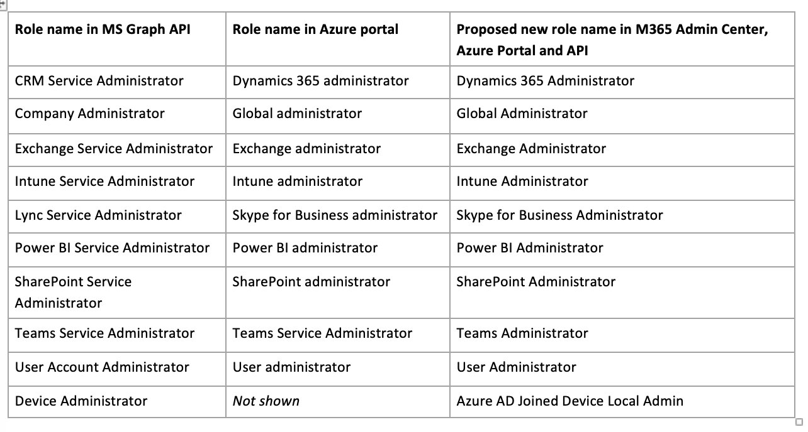
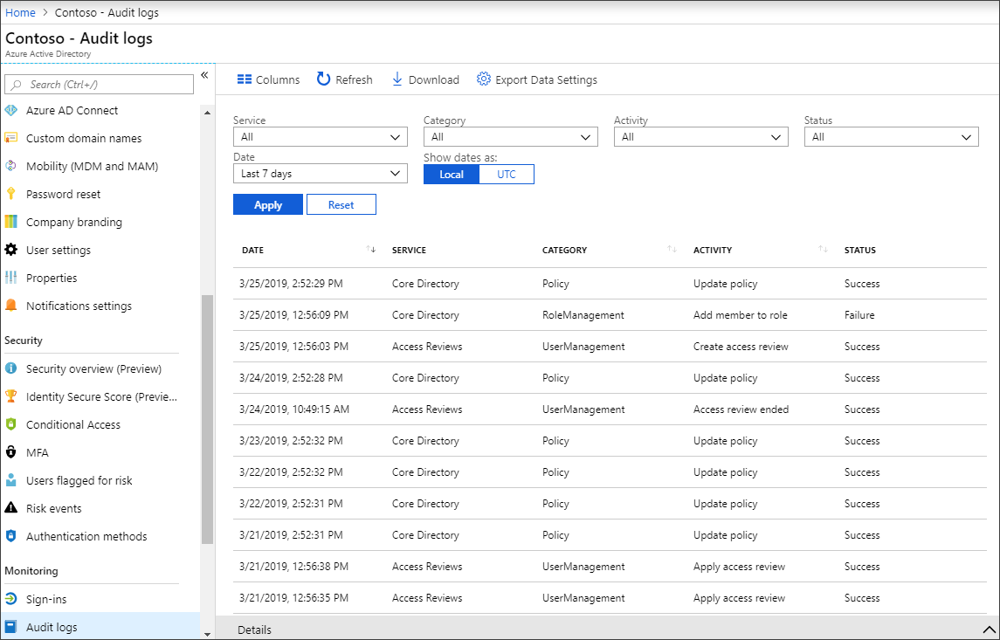
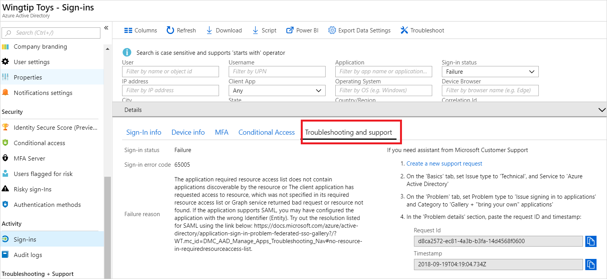

# Archive for What's new in Azure Active Directory?

The primary [What's new in Azure Active Directory? release notes](whats-new.md) article contains updates for the last six months, while this article contains all the older information.

The What's new in Azure Active Directory? release notes provide information about:

- The latest releases
- Known issues
- Bug fixes
- Deprecated functionality
- Plans for changes

---

## September 2022 

### General Availability - SSPR writeback is now available for disconnected forests using Azure AD Connect cloud sync

**Type:** New feature  
**Service category:** Azure AD Connect Cloud Sync   
**Product capability:** Identity Lifecycle Management 

Azure AD Connect Cloud Sync Password writeback now provides customers the ability to synchronize Azure AD password changes made in the cloud to an on-premises directory in real time. This can be accomplished using the lightweight Azure AD cloud provisioning agent. For more information, see: [Tutorial: Enable cloud sync self-service password reset writeback to an on-premises environment](../authentication/tutorial-enable-cloud-sync-sspr-writeback.md).

---

### General Availability - Device-based conditional access on Linux Desktops

**Type:** New feature  
**Service category:** Conditional Access  
**Product capability:** SSO 

This feature empowers users on Linux clients to register their devices with Azure AD, enroll into Intune management, and satisfy device-based Conditional Access policies when accessing their corporate resources.

- Users can register their Linux devices with Azure AD.
- Users can enroll in Mobile Device Management (Intune), which can be used to provide compliance decisions based upon policy definitions to allow device based conditional access on Linux Desktops.
- If compliant, users can use Microsoft Edge Browser to enable Single-Sign on to M365/Azure resources and satisfy device-based Conditional Access policies.

For more information, see:

- [Azure AD registered devices](../devices/concept-azure-ad-register.md)
- [Plan your Azure Active Directory device deployment](../devices/plan-device-deployment.md)

---

### General Availability - Azure AD SCIM Validator

**Type:** New feature  
**Service category:** Provisioning  
**Product capability:** Outbound to SaaS Applications 

Independent Software Vendors(ISVs) and developers can self-test their SCIM endpoints for compatibility: We have made it easier for ISVs to validate that their endpoints are compatible with the SCIM-based Azure AD provisioning services. This is now in general availability (GA) status.

For more information, see: [Tutorial: Validate a SCIM endpoint](../app-provisioning/scim-validator-tutorial.md)

---

### General Availability - prevent accidental deletions

**Type:** New feature  
**Service category:** Provisioning  
**Product capability:** Outbound to SaaS Applications 

Accidental deletion of users in any system could be disastrous. We’re excited to announce the general availability of the accidental deletions prevention capability as part of the Azure AD provisioning service. When the number of deletions to be processed in a single provisioning cycle spikes above a customer defined threshold the following will happen. The Azure AD provisioning service pauses, provide you with visibility into the potential deletions, and allow you to accept or reject the deletions. This functionality has historically been available for Azure AD Connect, and Azure AD Connect Cloud Sync. It's now available across the various provisioning flows, including both HR-driven provisioning and application provisioning.

For more information, see: [Enable accidental deletions prevention in the Azure AD provisioning service](../app-provisioning/accidental-deletions.md)

---

### General Availability - Identity Protection Anonymous and Malicious IP for ADFS on-premises logins

**Type:** New feature  
**Service category:** Identity Protection  
**Product capability:** Identity Security & Protection

Identity protection expands its Anonymous and Malicious IP detections to protect ADFS sign-ins. This automatically applies to all customers who have AD Connect Health deployed and enabled, and show up as the existing "Anonymous IP" or "Malicious IP" detections with a token issuer type of "AD Federation Services".

For more information, see: [What is risk?](../identity-protection/concept-identity-protection-risks.md)

---

### New Federated Apps available in Azure AD Application gallery - September 2022

**Type:** New feature  
**Service category:** Enterprise Apps  
**Product capability:** 3rd Party Integration 

In September 2022 we've added the following 15 new applications in our App gallery with Federation support:

[RocketReach SSO](../saas-apps/rocketreach-sso-tutorial.md), [Arena EU](../saas-apps/arena-eu-tutorial.md), [Zola](../saas-apps/zola-tutorial.md), [FourKites SAML2.0 SSO for Tracking](../saas-apps/fourkites-tutorial.md), [Syniverse Customer Portal](../saas-apps/syniverse-customer-portal-tutorial.md), [Rimo](https://rimo.app/), [Q Ware CMMS](https://qware.app/), [Mapiq (OIDC)](https://app.mapiq.com/), [NICE Cxone](../saas-apps/nice-cxone-tutorial.md), [dominKnow|ONE](../saas-apps/dominknowone-tutorial.md), [Waynbo for Azure AD](https://webportal-eu.waynbo.com/Login), [innDex](https://web.inndex.co.uk/azure/authorize), [Profiler Software](https://www.profiler.net.au/), [Trotto go links](https://trot.to/_/auth/login), [AsignetSSOIntegration](../saas-apps/asignet-sso-tutorial.md).

You can also find the documentation of all the applications from here https://aka.ms/AppsTutorial,

For listing your application in the Azure AD app gallery, read the details here: https://aka.ms/AzureADAppRequest

---

## August 2022 

### General Availability - Ability to force reauthentication on Intune enrollment, risky sign-ins, and risky users

**Type:** New feature  
**Service category:** Conditional Access  
**Product capability:** Identity Security & Protection

Customers can now require a fresh authentication each time a user performs a certain action. Forced reauthentication supports requiring a user to reauthenticate during Intune device enrollment, password change for risky users, and risky sign-ins.

For more information, see: [Configure authentication session management with Conditional Access](../conditional-access/howto-conditional-access-session-lifetime.md#require-reauthentication-every-time)

---

### General Availability - Multi-Stage Access Reviews

**Type:** Changed feature  
**Service category:** Access Reviews  
**Product capability:** Identity Governance  

Customers can now meet their complex audit and recertification requirements through multiple stages of reviews. For more information, see: [Create a multi-stage access review](../governance/create-access-review.md#create-a-multi-stage-access-review).

---

### Public Preview - External user leave settings

**Type:** New feature  
**Service category:** Enterprise Apps  
**Product capability:** B2B/B2C 

Currently, users can self-service leave for an organization without the visibility of their IT administrators. Some organizations may want more control over this self-service process.

With this feature, IT administrators can now allow or restrict external identities to leave an organization by Microsoft provided self-service controls via Azure Active Directory in the Microsoft Entra portal. In order to restrict users to leave an organization, customers need to include "Global privacy contact" and "Privacy statement URL" under tenant properties.
 
A new policy API is available for the administrators to control tenant wide policy:
[externalIdentitiesPolicy resource type](/graph/api/resources/externalidentitiespolicy?view=graph-rest-beta&preserve-view=true)

 For more information, see:

- [Leave an organization as an external user](../external-identities/leave-the-organization.md)
- [Configure external collaboration settings](../external-identities/external-collaboration-settings-configure.md)

---

### Public Preview - Restrict self-service BitLocker for devices

**Type:** New feature  
**Service category:** Device Registration and Management  
**Product capability:** Access Control

In some situations, you may want to restrict the ability for end users to self-service BitLocker keys. With this new functionality, you can now turn off self-service of BitLocker keys, so that only specific individuals with right privileges can recover a BitLocker key.

For more information, see: [Block users from viewing their BitLocker keys (preview)](../devices/device-management-azure-portal.md#configure-device-settings)

---

### Public Preview- Identity Protection Alerts in Microsoft 365 Defender

**Type:** New feature  
**Service category:** Identity Protection  
**Product capability:** Identity Security & Protection 

Identity Protection risk detections (alerts) are now also available in Microsoft 365 Defender to provide a unified investigation experience for security professionals. For more information, see: [Investigate alerts in Microsoft 365 Defender](/microsoft-365/security/defender/investigate-alerts?view=o365-worldwide#alert-sources&preserve-view=true)

---

### New Federated Apps available in Azure AD Application gallery - August 2022

**Type:** New feature  
**Service category:** Enterprise Apps  
**Product capability:** 3rd Party Integration 

In August 2022, we've added the following 40 new applications in our App gallery with Federation support

[Albourne Castle](https://village.albourne.com/castle), [Adra by Trintech](../saas-apps/adra-by-trintech-tutorial.md), [workhub](../saas-apps/workhub-tutorial.md), [4DX](../saas-apps/4dx-tutorial.md), [Ecospend IAM V1](https://iamapi.sb.ecospend.com/account/login), [TigerGraph](../saas-apps/tigergraph-tutorial.md), [Sketch](../saas-apps/sketch-tutorial.md), [Lattice](../saas-apps/lattice-tutorial.md), [snapADDY Single Sign On](https://app.snapaddy.com/login), [RELAYTO Content Experience Platform](https://relayto.com/signin), [oVice](https://tour.ovice.in/login), [Arena](../saas-apps/arena-tutorial.md), [QReserve](../saas-apps/qreserve-tutorial.md), [Curator](../saas-apps/curator-tutorial.md), [NetMotion Mobility](../saas-apps/netmotion-mobility-tutorial.md), [HackNotice](../saas-apps/hacknotice-tutorial.md), [ERA_EHS_CORE](../saas-apps/era-ehs-core-tutorial.md), [AnyClip Teams Connector](https://videomanager.anyclip.com/login), [Wiz SSO](../saas-apps/wiz-sso-tutorial.md), [Tango Reserve by AgilQuest (EU Instance)](../saas-apps/tango-reserve-tutorial.md), [valid8Me](../saas-apps/valid8me-tutorial.md), [Ahrtemis](../saas-apps/ahrtemis-tutorial.md), [KPMG Leasing Tool](../saas-apps/kpmg-tool-tutorial.md) [Mist Cloud Admin SSO](../saas-apps/mist-cloud-admin-tutorial.md), [Work-Happy](https://live.work-happy.com/?azure=true), [Ediwin SaaS EDI](../saas-apps/ediwin-saas-edi-tutorial.md), [LUSID](../saas-apps/lusid-tutorial.md), [Next Gen Math](https://nextgenmath.com/), [Total ID](https://www.tokyo-shoseki.co.jp/ict/), [Cheetah For Benelux](../saas-apps/cheetah-for-benelux-tutorial.md), [Live Center Australia](https://au.livecenter.com/), [Shop Floor Insight](https://www.dmsiworks.com/apps/shop-floor-insight), [Warehouse Insight](https://www.dmsiworks.com/apps/warehouse-insight), [myAOS](../saas-apps/myaos-tutorial.md), [Hero](https://admin.linc-ed.com/), [FigBytes](../saas-apps/figbytes-tutorial.md), [VerosoftDesign](https://verosoft-design.vercel.app/), [ViewpointOne - UK](https://identity-uk.team.viewpoint.com/), [EyeRate Reviews](https://azure-login.eyeratereviews.com/), [Lytx DriveCam](../saas-apps/lytx-drivecam-tutorial.md)

You can also find the documentation of all the applications from here https://aka.ms/AppsTutorial,

For listing your application in the Azure AD app gallery, please read the details here https://aka.ms/AzureADAppRequest 

---
### Public preview - New provisioning connectors in the Azure AD Application Gallery - August 2022

**Type:** New feature  
**Service category:** App Provisioning  
**Product capability:** 3rd Party Integration  

You can now automate creating, updating, and deleting user accounts for these newly integrated apps:

- [Ideagen Cloud](../saas-apps/ideagen-cloud-provisioning-tutorial.md)
- [Lucid (All Products)](../saas-apps/lucid-all-products-provisioning-tutorial.md)
- [Palo Alto Networks Cloud Identity Engine - Cloud Authentication Service](../saas-apps/palo-alto-networks-cloud-identity-engine-provisioning-tutorial.md)
- [SuccessFactors Writeback](../saas-apps/sap-successfactors-writeback-tutorial.md)
- [Tableau Cloud](../saas-apps/tableau-online-provisioning-tutorial.md)

For more information about how to better secure your organization by using automated user account provisioning, see: [Automate user provisioning to SaaS applications with Azure AD](../app-provisioning/user-provisioning.md).

---
### General Availability - Workload Identity Federation with App Registrations are available now

**Type:** New feature  
**Service category:** Other  
**Product capability:** Developer Experience 

Entra Workload Identity Federation allows developers to exchange tokens issued by another identity provider with Azure AD tokens, without needing secrets. It eliminates the need to store, and manage, credentials inside the code or secret stores to access Azure AD protected resources such as Azure and Microsoft Graph. By removing the secrets required to access Azure AD protected resources, workload identity federation can improve the security posture of your organization. This feature also reduces the burden of secret management and minimizes the risk of service downtime due to expired credentials. 

For more information on this capability and supported scenarios, see [Workload identity federation](../develop/workload-identity-federation.md).

---

### Public Preview - Entitlement management automatic assignment policies

**Type:** Changed feature  
**Service category:** Entitlement Management  
**Product capability:** Identity Governance 

In Azure AD entitlement management, a new form of access package assignment policy is being added. The automatic assignment policy includes a filter rule, similar to a dynamic group, that specifies the users in the tenant who should have assignments. When users come into scope of matching that filter rule criteria, an assignment is automatically created, and when they no longer match, the assignment is removed.

 For more information, see: [Configure an automatic assignment policy for an access package in Azure AD entitlement management (Preview)](../governance/entitlement-management-access-package-auto-assignment-policy.md).

---

## July 2022
 
### Public Preview - ADFS to Azure AD: SAML App Multi-Instancing

**Type:** New feature  
**Service category:** Enterprise Apps  
**Product capability:** SSO  

Users can now configure multiple instances of the same application within an Azure AD tenant. It's now supported for both IdP, and Service Provider (SP), initiated single sign-on requests. Multiple application accounts can now have a separate service principal to handle instance-specific claims mapping and roles assignment. For more information, see:

- [Configure SAML app multi-instancing for an application - Microsoft Entra](../develop/reference-app-multi-instancing.md)
- [Customize app SAML token claims - Microsoft Entra](../develop/active-directory-saml-claims-customization.md)

---

### Public Preview - ADFS to Azure AD: Apply RegEx Replace to groups claim content

**Type:** New feature  
**Service category:** Enterprise Apps  
**Product capability:** SSO  

 

Administrators up until recently has the capability to transform claims using many transformations, however using regular expression for claims transformation wasn't exposed to customers. With this public preview release, administrators can now configure and use regular expressions for claims transformation using portal UX. 
For more information, see:[Customize app SAML token claims - Microsoft Entra](../develop/active-directory-saml-claims-customization.md).
 

---
 

### Public Preview - Azure AD Domain Services - Trusts for User Forests

**Type:** New feature  
**Service category:** Azure AD Domain Services  
**Product capability:** Azure AD Domain Services  
 

You can now create trusts on both user and resource forests. On-premises AD DS users can't authenticate to resources in the Azure AD DS resource forest until you create an outbound trust to your on-premises AD DS. An outbound trust requires network connectivity to your on-premises virtual network on which you have installed Azure AD Domain Service. On a user forest, trusts can be created for on-premises AD forests that aren't synchronized to Azure AD DS.

To learn more about trusts and how to deploy your own, visit [How trust relationships work for forests in Active Directory](../../active-directory-domain-services/concepts-forest-trust.md).
 
 

---
 

### New Federated Apps available in Azure AD Application gallery - July 2022

**Type:** New feature  
**Service category:** Enterprise Apps  
**Product capability:** 3rd Party Integration  
 

In July 2022 we've added the following 28 new applications in our App gallery with Federation support:

[Lunni Ticket Service](https://ticket.lunni.io/login), [Spring Health](https://benefits.springhealth.com/care), [Sorbet](https://lite.sorbetapp.com/login), [Planview ID](../saas-apps/planview-id-tutorial.md), [Karbonalpha](https://saas.karbonalpha.com/settings/api), [Headspace](../saas-apps/headspace-tutorial.md), [SeekOut](../saas-apps/seekout-tutorial.md), [Stackby](../saas-apps/stackby-tutorial.md), [Infrascale Cloud Backup](../saas-apps/infrascale-cloud-backup-tutorial.md), [Keystone](../saas-apps/keystone-tutorial.md), [LMS・教育管理システム Leaf](../saas-apps/lms-and-education-management-system-leaf-tutorial.md), [ZDiscovery](../saas-apps/zdiscovery-tutorial.md), [ラインズeライブラリアドバンス (Lines eLibrary Advance)](../saas-apps/lines-elibrary-advance-tutorial.md), [Rootly](../saas-apps/rootly-tutorial.md), [Articulate 360](../saas-apps/articulate360-tutorial.md), [Rise.com](../saas-apps/risecom-tutorial.md), [SevOne Network Monitoring System (NMS)](../saas-apps/sevone-network-monitoring-system-tutorial.md), [PGM](https://ups-pgm.4gfactor.com/azure/), [TouchRight Software](https://app.touchrightsoftware.com/), [Tendium](../saas-apps/tendium-tutorial.md), [Training Platform](../saas-apps/training-platform-tutorial.md), [Znapio](https://app.znapio.com/), [Preset](../saas-apps/preset-tutorial.md), [itslearning MS Teams sync](https://itslearning.com/global/), [Veza](../saas-apps/veza-tutorial.md),

You can also find the documentation of all the applications from here https://aka.ms/AppsTutorial,

For listing your application in the Azure AD app gallery, please read the details here https://aka.ms/AzureADAppRequest

 
---
 

### General Availability - No more waiting, provision groups on demand into your SaaS applications.

**Type:** New feature  
**Service category:** Provisioning  
**Product capability:** Identity Lifecycle Management  
 

Pick a group of up to five members and provision them into your third-party applications in seconds. Get started testing, troubleshooting, and provisioning to non-Microsoft applications such as ServiceNow, ZScaler, and Adobe. For more information, see: [On-demand provisioning in Azure Active Directory](../app-provisioning/provision-on-demand.md).
 

---
 

###  General Availability – Protect against by-passing of cloud Azure AD Multi-Factor Authentication when federated with Azure AD

**Type:** New feature  
**Service category:** MS Graph  
**Product capability:** Identity Security & Protection  
 

We're delighted to announce a new security protection that prevents bypassing of cloud Azure AD Multi-Factor Authentication when federated with Azure AD. When enabled for a federated domain in your Azure AD tenant, it ensures that a compromised federated account can't bypass Azure AD Multi-Factor Authentication by imitating that a multi factor authentication has already been performed by the identity provider. The protection can be enabled via new security setting, [federatedIdpMfaBehavior](/graph/api/resources/internaldomainfederation?view=graph-rest-beta#federatedidpmfabehavior-values&preserve-view=true).

 
We highly recommend enabling this new protection when using Azure AD Multi-Factor Authentication as your multi factor authentication for your federated users. To learn more about the protection and how to enable it, visit [Enable protection to prevent by-passing of cloud Azure AD Multi-Factor Authentication when federated with Azure AD](/windows-server/identity/ad-fs/deployment/best-practices-securing-ad-fs#enable-protection-to-prevent-by-passing-of-cloud-azure-ad-multi-factor-authentication-when-federated-with-azure-ad). 
 

---
 

### Public preview - New provisioning connectors in the Azure AD Application Gallery - July 2022

**Type:** New feature  
**Service category:** App Provisioning  
**Product capability:** 3rd Party Integration  
 

You can now automate creating, updating, and deleting user accounts for these newly integrated apps:

- [Tableau Cloud](../saas-apps/tableau-online-provisioning-tutorial.md)

For more information about how to better secure your organization by using automated user account provisioning, see [Automate user provisioning to SaaS applications with Azure AD](../app-provisioning/user-provisioning.md).
 

---
 

### General Availability - Tenant-based service outage notifications

**Type:** New feature  
**Service category:** Other  
**Product capability:** Platform  
 

Azure Service Health supports service outage notifications to Tenant Admins for Azure Active Directory issues. These outages will also appear on the Azure portal Overview page with appropriate links to Azure Service Health. Outage events will be able to be seen by built-in Tenant Administrator Roles. We'll continue to send outage notifications to subscriptions within a tenant for transition. More information is available at: [What are Service Health notifications in Azure Active Directory?](../reports-monitoring/overview-service-health-notifications.md).

 

---
 

### Public Preview - Multiple Passwordless Phone sign-in Accounts for iOS devices

**Type:** New feature  
**Service category:** Authentications (Logins)  
**Product capability:** User Authentication  
 

End users can now enable passwordless phone sign-in for multiple accounts in the Authenticator App on any supported iOS device. Consultants, students, and others with multiple accounts in Azure AD can add each account to Microsoft Authenticator and use passwordless phone sign-in for all of them from the same iOS device. The Azure AD accounts can be in either the same, or different, tenants. Guest accounts aren't supported for multiple account sign-ins from one device.

Note that end users are encouraged to enable the optional telemetry setting in the Authenticator App, if not done so already.  For more information, see:  [Enable passwordless sign-in with Microsoft Authenticator](../authentication/howto-authentication-passwordless-phone.md)

 

---
 
 

### Public Preview - Azure AD Domain Services - Fine Grain Permissions

**Type:** Changed feature  
**Service category:** Azure AD Domain Services  
**Product capability:** Azure AD Domain Services  

 

Previously to set up and administer your AAD-DS instance you needed top level permissions of Azure Contributor and Azure AD Global Administrator. Now for both initial creation, and ongoing administration, you can utilize more fine grain permissions for enhanced security and control. The prerequisites now minimally require:

- You need [Application Administrator](../roles/permissions-reference.md#application-administrator) and [Groups Administrator](../roles/permissions-reference.md#groups-administrator) Azure AD roles in your tenant to enable Azure AD DS.
- You need [Domain Services Contributor](../../role-based-access-control/built-in-roles.md#domain-services-contributor) Azure role to create the required Azure AD DS resources.
 

Check out these resources to learn more:

- [Tutorial - Create an Azure Active Directory Domain Services managed domain](../../active-directory-domain-services/tutorial-create-instance.md#prerequisites)
- [Least privileged roles by task](../roles/delegate-by-task.md#domain-services)
- [Azure built-in roles - Azure RBAC](../../role-based-access-control/built-in-roles.md#domain-services-contributor)

 

---
 

### General Availability- Azure AD Connect update release with new functionality and bug fixes

**Type:** Changed feature  
**Service category:** Provisioning  
**Product capability:** Identity Lifecycle Management  

 

A new Azure AD Connect release fixes several bugs and includes new functionality. This release is also available for auto upgrade for eligible servers. For more information, see: [Azure AD Connect: Version release history](../hybrid/reference-connect-version-history.md#21150).

---
 

### General Availability - Cross-tenant access settings for B2B collaboration

**Type:** Changed feature  
**Service category:** B2B  
**Product capability:** B2B/B2C  

 

Cross-tenant access settings enable you to control how users in your organization collaborate with members of external Azure AD organizations. Now you’ll have granular inbound and outbound access control settings that work on a per org, user, group, and application basis. These settings also make it possible for you to trust security claims from external Azure AD organizations like multi-factor authentication (MFA), device compliance, and hybrid Azure AD joined devices. For more information, see: [Cross-tenant access with Azure AD External Identities](../external-identities/cross-tenant-access-overview.md).
 

---
 

### General Availability- Expression builder with Application Provisioning

**Type:** Changed feature  
**Service category:** Provisioning  
**Product capability:** Outbound to SaaS Applications  
 

Accidental deletion of users in your apps or in your on-premises directory could be disastrous. We’re excited to announce the general availability of the accidental deletions prevention capability. When a provisioning job would cause a spike in deletions, it will first pause and provide you visibility into the potential deletions. You can then accept or reject the deletions and have time to update the job’s scope if necessary. For more information, see [Understand how expression builder in Application Provisioning works](../app-provisioning/expression-builder.md).
 

---
 

### Public Preview - Improved app discovery view for My Apps portal

**Type:** Changed feature  
**Service category:** My Apps  
**Product capability:** End User Experiences  
 

An improved app discovery view for My Apps is in public preview. The preview shows users more apps in the same space and allows them to scroll between collections. It doesn't currently support drag-and-drop and list view. Users can opt into the preview by selecting Try the preview and opt out by selecting Return to previous view. To learn more about My Apps, see [My Apps portal overview](../manage-apps/myapps-overview.md).

 

---
 

### Public Preview - New Azure portal All Devices list

**Type:** Changed feature  
**Service category:** Device Registration and Management  
**Product capability:** End User Experiences  

 

We're enhancing the All Devices list in the Azure portal to make it easier to filter and manage your devices. Improvements include:

All Devices List:

- Infinite scrolling
- More devices properties can be filtered on
- Columns can be reordered via drag and drop
- Select all devices

For more information, see: [Manage devices in Azure AD using the Azure portal](../devices/device-management-azure-portal.md#view-and-filter-your-devices-preview).

 

---
 

### Public Preview - ADFS to Azure AD: Persistent NameID for IDP-initiated Apps

**Type:** Changed feature  
**Service category:** Enterprise Apps  
**Product capability:** SSO  
 

Previously the only way to have persistent NameID value was to ​configure user attribute with an empty value. Admins can now explicitly configure the NameID value to be persistent ​along with the corresponding format.

For more information, see: [Customize app SAML token claims - Microsoft identity platform](../develop/active-directory-saml-claims-customization.md#attributes).
 

---
 

### Public Preview - ADFS to Azure Active Directory: Customize attrname-format​

**Type:** Changed feature  
**Service category:** Enterprise Apps  
**Product capability:** SSO  
 

With this new parity update, customers can now integrate non-gallery applications such as Socure DevHub with Azure AD to have SSO via SAML.

For more information, see [Claims mapping policy - Microsoft Entra](../develop/reference-claims-mapping-policy-type.md#claim-schema-entry-elements).
 

---

## June 2022
 

### Public preview - New provisioning connectors in the Azure AD Application Gallery - June 2022

**Type:** New feature  
**Service category:** App Provisioning  
**Product capability:** 3rd Party Integration  
 

You can now automate creating, updating, and deleting user accounts for these newly integrated apps:

- [Whimsical](../saas-apps/whimsical-provisioning-tutorial.md)

For more information about how to better secure your organization by using automated user account provisioning, see [Automate user provisioning to SaaS applications with Azure AD](../app-provisioning/user-provisioning.md).
 

---
 

### Public Preview - Roles are being assigned outside of Privileged Identity Management

**Type:** New feature  
**Service category:** Privileged Identity Management  
**Product capability:** Privileged Identity Management  
 
Customers can be alerted on assignments made outside PIM either directly on the Azure portal or also via email. For the current public preview, the assignments are being tracked at the subscription level. For more information, see [Configure security alerts for Azure roles in Privileged Identity Management](../privileged-identity-management/pim-resource-roles-configure-alerts.md#alerts).
 
---

### General Availability - Temporary Access Pass is now available

**Type:** New feature  
**Service category:** MFA  
**Product capability:** User Authentication  

 

Temporary Access Pass (TAP) is now generally available. TAP can be used to securely register password-less methods such as Phone Sign-in, phishing resistant methods such as FIDO2, and even help Windows onboarding (AADJ and WHFB). TAP also makes recovery easier when a user has lost or forgotten their strong authentication methods and needs to sign in to register new authentication methods. For more information, see: [Configure Temporary Access Pass in Azure AD to register Passwordless authentication methods](../authentication/howto-authentication-temporary-access-pass.md).
 

---
 

### Public Preview of Dynamic Group support for MemberOf

**Type:** New feature  
**Service category:** Group Management  
**Product capability:** Directory  

 

Create "nested" groups with Azure AD Dynamic Groups! This feature enables you to build dynamic Azure AD Security Groups and Microsoft 365 groups based on other groups! For example, you can now create Dynamic-Group-A with members of Group-X and Group-Y. For more information, see: [Steps to create a memberOf dynamic group](../enterprise-users/groups-dynamic-rule-member-of.md#steps-to-create-a-memberof-dynamic-group).
 

---
 

### New Federated Apps available in Azure AD Application gallery - June 2022

**Type:** New feature  
**Service category:** Enterprise Apps  
**Product capability:** 3rd Party Integration  

 

In June 2022 we've added the following 22 new applications in our App gallery with Federation support:

[Leadcamp Mailer](https://app.leadcamp.io/sign-in), [PULCE](https://ups.pulce.tech/index.php), [Hive Learning](../saas-apps/hive-learning-tutorial.md), [Planview LeanKit](../saas-apps/planview-leankit-tutorial.md), [Javelo](../saas-apps/javelo-tutorial.md), [きょうしつでビスケット,Agile Provisioning](https://online.viscuit.com/v1/all/?server=7), [xCarrier®](../saas-apps/xcarrier-tutorial.md), [Skillcast](../saas-apps/skillcast-tutorial.md), [JTRA](https://www.jingtengtech.com/r/#/register?id=1), [InnerSpace inTELLO](https://intello.innerspace.io/), [Seculio](../saas-apps/seculio-tutorial.md), [XplicitTrust Partner Console](https://console.xplicittrust.com/#/partner/auth), [Veracity Single-Sign On](https://www.veracity.com/), [Guardium Data Protection](../saas-apps/guardium-data-protection-tutorial.md), [IntellicureEHR v7](https://www.intellicure.com/wound-care-software/ehr/), [BMIS - Battery Management Information System](../saas-apps/battery-management-information-system-tutorial.md), [Finbiosoft Cloud](https://account.finbiosoft.com/), [Standard for Success K-12](../saas-apps/standard-for-success-tutorial.md), [E2open LSP](../saas-apps/e2open-lsp-tutorial.md), [TVU Service](../saas-apps/tvu-service-tutorial.md), [S4 - Digitsec](../saas-apps/s4-digitsec-tutorial.md).

You can also find the documentation of all the applications from here https://aka.ms/AppsTutorial,

For listing your application in the Azure AD app gallery, see the details here https://aka.ms/AzureADAppRequest

 

---
 
 

### General Availability – Protect against by-passing of cloud Azure AD Multi-Factor Authentication when federated with Azure AD

**Type:** New feature  
**Service category:** MS Graph  
**Product capability:** Identity Security & Protection  

 

We're delighted to announce a new security protection that prevents bypassing of cloud Azure AD Multi-Factor Authentication when federated with Azure AD. When enabled for a federated domain in your Azure AD tenant, it ensures that a compromised federated account can't bypass Azure AD Multi-Factor Authentication by imitating that a multi factor authentication has already been performed by the identity provider. The protection can be enabled via new security setting, [federatedIdpMfaBehavior](/graph/api/resources/internaldomainfederation?view=graph-rest-1.0#federatedidpmfabehavior-values&preserve-view=true). 

We highly recommend enabling this new protection when using Azure AD Multi-Factor Authentication as your multi factor authentication for your federated users. To learn more about the protection and how to enable it, visit [Enable protection to prevent by-passing of cloud Azure AD Multi-Factor Authentication when federated with Azure AD](/windows-server/identity/ad-fs/deployment/best-practices-securing-ad-fs#enable-protection-to-prevent-by-passing-of-cloud-azure-ad-multi-factor-authentication-when-federated-with-azure-ad). 
 

---
 

### Public Preview - New Azure portal All Users list and User Profile UI

**Type:** Changed feature  
**Service category:** User Management  
**Product capability:** User Management  
 

We're enhancing the All Users list and User Profile in the Azure portal to make it easier to find and manage your users. Improvements include: 

All Users List:
- Infinite scrolling (yes, no 'Load more')
- More user properties can be added as columns and filtered on
- Columns can be reordered via drag and drop
- Default columns shown and their order can be managed via the column picker 
- The ability to copy and share the current view

User Profile:
- A new Overview page that surfaces insights (that is, group memberships, account enabled, MFA capable, risky user, etc.)
- A new monitoring tab
- More user properties can be viewed and edited in the properties tab

 For more information, see: [User management enhancements in Azure Active Directory](../enterprise-users/users-search-enhanced.md).

---
 

### General Availability - More device properties supported for Dynamic Device groups

**Type:** Changed feature  
**Service category:** Group Management  
**Product capability:** Directory  

 

You can now create or update dynamic device groups using the following properties:
- deviceManagementAppId
- deviceTrustType
- extensionAttribute1-15
- profileType

For more information on how to use this feature, see: [Dynamic membership rule for device groups](../enterprise-users/groups-dynamic-membership.md#rules-for-devices).
 

---
 

 

## May 2022
 
### General Availability: Tenant-based service outage notifications

**Type:** Plan for change  
**Service category:** Other  
**Product capability:** Platform  

 
Azure Service Health will soon support service outage notifications to Tenant Admins for Azure Active Directory issues soon. These outages will also appear on the Azure portal overview page with appropriate links to Azure Service Health. Outage events will be able to be seen by built-in Tenant Administrator Roles. We'll continue to send outage notifications to subscriptions within a tenant for transition. More information will be available when this capability is released. The expected release is for June 2022.
 
---

### New Federated Apps available in Azure AD Application gallery - May 2022

**Type:** New feature  
**Service category:** Enterprise Apps  
**Product capability:** 3rd Party Integration  
 

In May 2022 we've added the following 25 new applications in our App gallery with Federation support:

[UserZoom](../saas-apps/userzoom-tutorial.md), [AMX Mobile](https://www.amxsolutions.co.uk/), [i-Sight](../saas-apps/isight-tutorial.md), [Method InSight](https://digital.methodrecycling.com/), [Chronus SAML](../saas-apps/chronus-saml-tutorial.md), [Attendant Console for Microsoft Teams](https://attendant.anywhere365.io/), [Skopenow](../saas-apps/skopenow-tutorial.md), [Fidelity PlanViewer](../saas-apps/fidelity-planviewer-tutorial.md), [Lyve Cloud](../saas-apps/lyve-cloud-tutorial.md), [Framer](../saas-apps/framer-tutorial.md), [Authomize](../saas-apps/authomize-tutorial.md), [gamba!](../saas-apps/gamba-tutorial.md), [Datto File Protection Single Sign On](../saas-apps/datto-file-protection-tutorial.md), [LONEALERT](https://portal.lonealert.co.uk/auth/azure/saml/signin), [Payfactors](https://pf.payfactors.com/client/auth/login), [deBroome Brand Portal](../saas-apps/debroome-brand-portal-tutorial.md), [TeamSlide](../saas-apps/teamslide-tutorial.md), [Sensera Systems](https://sitecloud.senserasystems.com/), [YEAP](https://prismaonline.propay.be/logon/login.aspx), [Monaca Education](https://monaca.education/ja/signup), [Personify Inc](https://personifyinc.com/login), [Phenom TXM](../saas-apps/phenom-txm-tutorial.md), [Forcepoint Cloud Security Gateway - User Authentication](../saas-apps/forcepoint-cloud-security-gateway-tutorial.md), [GoalQuest](../saas-apps/goalquest-tutorial.md), [OpenForms](https://login.openforms.com/Login).

You can also find the documentation of all the applications from here https://aka.ms/AppsTutorial,

For listing your application in the Azure AD app gallery, please read the details here https://aka.ms/AzureADAppRequest

 

---
 

### General Availability – My Apps users can make apps from URLs (add sites)

**Type:** New feature  
**Service category:** My Apps  
**Product capability:** End User Experiences  
 

When editing a collection using the My Apps portal, users can now add their own sites, in addition to adding apps that have been assigned to them by an admin. To add a site, users must provide a name and URL. For more information on how to use this feature, see: [Customize app collections in the My Apps portal](https://support.microsoft.com/account-billing/customize-app-collections-in-the-my-apps-portal-2dae6b8a-d8b0-4a16-9a5d-71ed4d6a6c1d).
 

---
 

### Public preview - New provisioning connectors in the Azure AD Application Gallery - May 2022

**Type:** New feature  
**Service category:** App Provisioning  
**Product capability:** 3rd Party Integration  
 

You can now automate creating, updating, and deleting user accounts for these newly integrated apps:

- [Alinto Protect](../saas-apps/alinto-protect-provisioning-tutorial.md)
- [Blinq](../saas-apps/blinq-provisioning-tutorial.md)
- [Cerby](../saas-apps/cerby-provisioning-tutorial.md)

For more information about how to better secure your organization by using automated user account provisioning, see: [Automate user provisioning to SaaS applications with Azure AD](../app-provisioning/user-provisioning.md).
 

---
 

### Public Preview: Confirm safe and compromised in sign-ins API beta

**Type:** New feature  
**Service category:** Identity Protection  
**Product capability:** Identity Security & Protection  
 

The sign-ins Microsoft Graph API now supports confirming safe and compromised on risky sign-ins. This public preview functionality is available at the beta endpoint. For more information, please check out the Microsoft Graph documentation: [signIn: confirmSafe - Microsoft Graph beta](/graph/api/signin-confirmsafe?view=graph-rest-beta&preserve-view=true)
 

---
 

### Public Preview of Microsoft cloud settings for Azure AD B2B

**Type:** New feature  
**Service category:** B2B  
**Product capability:** B2B/B2C  

 

Microsoft cloud settings let you collaborate with organizations from different Microsoft Azure clouds. With Microsoft cloud settings, you can establish mutual B2B collaboration between the following clouds:

-Microsoft Azure global cloud and Microsoft Azure Government
-Microsoft Azure global cloud and Microsoft Azure China 21Vianet

To learn more about Microsoft cloud settings for B2B collaboration, see: [Cross-tenant access overview - Azure AD](../external-identities/cross-tenant-access-overview.md#microsoft-cloud-settings).
 

---
 

### General Availability of SAML and WS-Fed federation in External Identities

**Type:** Changed feature  
**Service category:** B2B  
**Product capability:** B2B/B2C  

 

When setting up federation with a partner's IdP, new guest users from that domain can use their own IdP-managed organizational account to sign in to your Azure AD tenant and start collaborating with you. There's no need for the guest user to create a separate Azure AD account. To learn more about federating with SAML or WS-Fed identity providers in External Identities, see: [Federation with a SAML/WS-Fed identity provider (IdP) for B2B - Azure AD](../external-identities/direct-federation.md).
 

---
 

### Public Preview - Create Group in Administrative Unit

**Type:** Changed feature  
**Service category:** Directory Management  
**Product capability:** Access Control  

 

Groups Administrators assigned over the scope of an administrative unit can now create groups within the administrative unit.  This enables scoped group administrators to create groups that they can manage directly, without needing to elevate to Global Administrator or Privileged Role Administrator. For more information, see: [Administrative units in Azure Active Directory](../roles/administrative-units.md).
 

---
 

### Public Preview - Dynamic administrative unit support for onPremisesDistinguishedName property

**Type:** Changed feature  
**Service category:** Directory Management  
**Product capability:** AuthZ/Access Delegation  

 

The public preview of dynamic administrative units now supports the **onPremisesDistinguishedName** property for users. This makes it possible to create dynamic rules that incorporate the organizational unit of the user from on-premises AD. For more information, see: [Manage users or devices for an administrative unit with dynamic membership rules (Preview)](../roles/admin-units-members-dynamic.md).
 

---
 

### General Availability - Improvements to Azure AD Smart Lockout

**Type:** Changed feature  
**Service category:** Other  
**Product capability:** User Management  

 

Smart Lockout now synchronizes the lockout state across Azure AD data centers, so the total number of failed sign-in attempts allowed before an account is locked out will match the configured lockout threshold. For more information, see: [Protect user accounts from attacks with Azure Active Directory smart lockout](../authentication/howto-password-smart-lockout.md).
 

---
 

## April 2022

### General Availability - Entitlement management separation of duties checks for incompatible access packages

**Type:** Changed feature
**Service category:** Other 
**Product capability:** Identity Governance  

In Azure AD entitlement management, an administrator can now configure the incompatible access packages and groups of an access package in the Azure portal.  This prevents a user who already has one of those incompatible access rights from being able to request further access. For more information, see: [Configure separation of duties checks for an access package in Azure AD entitlement management](../governance/entitlement-management-access-package-incompatible.md).

---

### General Availability - Microsoft Defender for Endpoint Signal in Identity Protection

**Type:** New feature  
**Service category:** Identity Protection  
**Product capability:** Identity Security & Protection  
 

Identity Protection now integrates a signal from Microsoft Defender for Endpoint (MDE) that will protect against PRT theft detection. To learn more, see: [What is risk? Azure AD Identity Protection](../identity-protection/concept-identity-protection-risks.md).
 

---

### General Availability - Entitlement management 3 stages of approval

**Type:** Changed feature  
**Service category:** Other  
**Product capability:** Entitlement Management  

 

This update extends the Azure AD entitlement management access package policy to allow a third approval stage.  This will be able to be configured via the Azure portal or Microsoft Graph. For more information, see: [Change approval and requestor information settings for an access package in Azure AD entitlement management](../governance/entitlement-management-access-package-approval-policy.md).
 

---

### General Availability - Improvements to Azure AD Smart Lockout

**Type:** Changed feature  
**Service category:** Identity Protection  
**Product capability:** User Management  

 

With a recent improvement, Smart Lockout now synchronizes the lockout state across Azure AD data centers, so the total number of failed sign-in attempts allowed before an account is locked out will match the configured lockout threshold. For more information, see: [Protect user accounts from attacks with Azure Active Directory smart lockout](../authentication/howto-password-smart-lockout.md).
 

---

### Public Preview - Integration of Microsoft 365 App Certification details into Azure Active Directory UX and Consent Experiences

**Type:** New feature  
**Service category:** User Access Management  
**Product capability:** AuthZ/Access Delegation  

Microsoft 365 Certification status for an app is now available in Azure AD consent UX, and custom app consent policies. The status will later be displayed in several other Identity-owned interfaces such as enterprise apps. For more information, see: [Understanding Azure AD application consent experiences](../develop/application-consent-experience.md).

---

### Public preview - Use Azure AD access reviews to review access of B2B direct connect users in Teams shared channels

**Type:** New feature  
**Service category:** Access Reviews  
**Product capability:** Identity Governance

Use Azure AD access reviews to review access of B2B direct connect users in Teams shared channels. For more information, see: [Include B2B direct connect users and teams accessing Teams Shared Channels in access reviews (preview)](../governance/create-access-review.md#include-b2b-direct-connect-users-and-teams-accessing-teams-shared-channels-in-access-reviews).

---

### Public Preview - New MS Graph APIs to configure federated settings when federated with Azure AD

**Type:** New feature  
**Service category:** MS Graph  
**Product capability:** Identity Security & Protection  

We're announcing the public preview of following MS Graph APIs and PowerShell cmdlets for configuring federated settings when federated with Azure AD:

|Action  |MS Graph API  |PowerShell cmdlet  |
|---------|---------|---------|
|Get federation settings for a federated domain        | [Get internalDomainFederation](/graph/api/internaldomainfederation-get?view=graph-rest-beta&preserve-view=true)           | [Get-MgDomainFederationConfiguration](/powershell/module/microsoft.graph.identity.directorymanagement/get-mgdomainfederationconfiguration?view=graph-powershell-beta&preserve-view=true)        |
|Create federation settings for a federated domain     | [Create internalDomainFederation](/graph/api/domain-post-federationconfiguration?view=graph-rest-beta&preserve-view=true)        | [New-MgDomainFederationConfiguration](/powershell/module/microsoft.graph.identity.directorymanagement/new-mgdomainfederationconfiguration?view=graph-powershell-beta&preserve-view=true)        |
|Remove federation settings for a federated domain     | [Delete internalDomainFederation](/graph/api/internaldomainfederation-delete?view=graph-rest-beta&preserve-view=true)        | [Remove-MgDomainFederationConfiguration](/powershell/module/microsoft.graph.identity.directorymanagement/remove-mgdomainfederationconfiguration?view=graph-powershell-beta&preserve-view=true)     |
|Update federation settings for a federated domain     | [Update internalDomainFederation](/graph/api/internaldomainfederation-update?view=graph-rest-beta&preserve-view=true)        | [Update-MgDomainFederationConfiguration](/powershell/module/microsoft.graph.identity.directorymanagement/update-mgdomainfederationconfiguration?view=graph-powershell-beta&preserve-view=true)     |

If using older MSOnline cmdlets ([Get-MsolDomainFederationSettings](/powershell/module/msonline/get-msoldomainfederationsettings?view=azureadps-1.0&preserve-view=true) and [Set-MsolDomainFederationSettings](/powershell/module/msonline/set-msoldomainfederationsettings?view=azureadps-1.0&preserve-view=true)), we highly recommend transitioning to the latest MS Graph APIs and PowerShell cmdlets. 

For more information, see [internalDomainFederation resource type - Microsoft Graph beta](/graph/api/resources/internaldomainfederation?view=graph-rest-beta&preserve-view=true).

---

### Public Preview – Ability to force reauthentication on Intune enrollment, risky sign-ins, and risky users

**Type:** New feature  
**Service category:** RBAC role  
**Product capability:** AuthZ/Access Delegation  

Added functionality to session controls allowing admins to reauthenticate a user on every sign-in if a user or particular sign-in event is deemed risky, or when enrolling a device in Intune. For more information, see [Configure authentication session management with conditional Access](../conditional-access/howto-conditional-access-session-lifetime.md).

---

###  Public Preview – Protect against by-passing of cloud Azure AD Multi-Factor Authentication when federated with Azure AD

**Type:** New feature  
**Service category:** MS Graph  
**Product capability:** Identity Security & Protection  

We're delighted to announce a new security protection that prevents bypassing of cloud Azure AD Multi-Factor Authentication when federated with Azure AD. When enabled for a federated domain in your Azure AD tenant, it ensures that a compromised federated account can't bypass Azure AD Multi-Factor Authentication by imitating that a multi factor authentication has already been performed by the identity provider. The protection can be enabled via new security setting, [federatedIdpMfaBehavior](/graph/api/resources/internaldomainfederation?view=graph-rest-beta#federatedidpmfabehavior-values&preserve-view=true). 

We highly recommend enabling this new protection when using Azure AD Multi-Factor Authentication as your multi factor authentication for your federated users. To learn more about the protection and how to enable it, visit [Enable protection to prevent by-passing of cloud Azure AD Multi-Factor Authentication when federated with Azure AD](/windows-server/identity/ad-fs/deployment/best-practices-securing-ad-fs#enable-protection-to-prevent-by-passing-of-cloud-azure-ad-multi-factor-authentication-when-federated-with-azure-ad).

---

### New Federated Apps available in Azure AD Application gallery - April 2022

**Type:** New feature  
**Service category:** Enterprise Apps  
**Product capability:** Third Party Integration

In April 2022 we added the following 24 new applications in our App gallery with Federation support:
[X-1FBO](https://www.x1fbo.com/), [select Armor](https://app.clickarmor.ca/), [Smint.io Portals for SharePoint](https://www.smint.io/portals-for-sharepoint/), [Pluto](../saas-apps/pluto-tutorial.md), [ADEM](../saas-apps/adem-tutorial.md), [Smart360](../saas-apps/smart360-tutorial.md), [MessageWatcher SSO](https://messagewatcher.com/), [Beatrust](../saas-apps/beatrust-tutorial.md), [AeyeScan](https://aeyescan.com/azure_sso), [ABa Customer](https://abacustomer.com/), [Twilio Sendgrid](../saas-apps/twilio-sendgrid-tutorial.md), [Vault Platform](../saas-apps/vault-platform-tutorial.md), [Speexx](../saas-apps/speexx-tutorial.md), [Clicksign](https://app.clicksign.com/signin), [Per Angusta](../saas-apps/per-angusta-tutorial.md), [EruditAI](https://dashboard.erudit.ai/login), [MetaMoJi ClassRoom](https://business.metamoji.com/), [Numici](https://app.numici.com/), [MCB.CLOUD](https://identity.mcb.cloud/Identity/Account/Manage), [DepositLink](https://depositlink.com/external-login), [Last9](https://last9.io/), [ParkHere Corporate](../saas-apps/parkhere-corporate-tutorial.md), [Keepabl](../saas-apps/keepabl-tutorial.md), [Swit](../saas-apps/swit-tutorial.md)

You can also find the documentation of all the applications from here https://aka.ms/AppsTutorial.

For listing your application in the Azure AD app gallery, please read the details here https://aka.ms/AzureADAppRequest

---

### General Availability - Customer data storage for Japan customers in Japanese data centers

**Type:** New feature  
**Service category:** App Provisioning  
**Product capability:** GoLocal  

From April 15, 2022, Microsoft began storing Azure AD’s Customer Data for new tenants with a Japan billing address within the Japanese data centers.  For more information, see: [Customer data storage for Japan customers in Azure Active Directory](active-directory-data-storage-japan.md).

---

### Public Preview - New provisioning connectors in the Azure AD Application Gallery - April 2022

**Type:** New feature  
**Service category:** App Provisioning  
**Product capability:** Third Party Integration  

You can now automate creating, updating, and deleting user accounts for these newly integrated apps:
- [Adobe Identity Management (OIDC)](../saas-apps/adobe-identity-management-provisioning-oidc-tutorial.md)
- [embed signage](../saas-apps/embed-signage-provisioning-tutorial.md)
- [KnowBe4 Security Awareness Training](../saas-apps/knowbe4-security-awareness-training-provisioning-tutorial.md)
- [NordPass](../saas-apps/nordpass-provisioning-tutorial.md)

For more information about how to better secure your organization by using automated user account provisioning, see: [Automate user provisioning to SaaS applications with Azure AD](../app-provisioning/user-provisioning.md)

---

## March 2022
 

### Tenant enablement of combined security information registration for Azure Active Directory

**Type:** Plan for change  
**Service category:** MFA  
**Product capability:** Identity Security & Protection  

 

We announced in April 2020 General Availability of our new combined registration experience, enabling users to register security information for multi-factor authentication and self-service password reset at the same time, which was available for existing customers to opt in. We're happy to announce the combined security information registration experience will be enabled to all non-enabled customers after September 30, 2022. This change doesn't impact tenants created after August 15, 2020, or tenants located in the China region. For more information, see: [Combined security information registration for Azure Active Directory overview](../authentication/concept-registration-mfa-sspr-combined.md).
 

---
 

### Public preview - New provisioning connectors in the Azure AD Application Gallery - March 2022

**Type:** New feature  
**Service category:** App Provisioning  
**Product capability:** Third Party Integration  

 

You can now automate creating, updating, and deleting user accounts for these newly integrated apps:

- [AlexisHR](../saas-apps/alexishr-provisioning-tutorial.md)
- [embed signage](../saas-apps/embed-signage-provisioning-tutorial.md)
- [Joyn FSM](../saas-apps/joyn-fsm-provisioning-tutorial.md)
- [KPN Grip](../saas-apps/kpn-grip-provisioning-tutorial.md)
- [MURAL Identity](../saas-apps/mural-identity-provisioning-tutorial.md)
- [Palo Alto Networks SCIM Connector](../saas-apps/palo-alto-networks-scim-connector-provisioning-tutorial.md)
- [Tap App Security](../saas-apps/tap-app-security-provisioning-tutorial.md)
- [Yellowbox](../saas-apps/yellowbox-provisioning-tutorial.md)

For more information about how to better secure your organization by using automated user account provisioning, see: [Automate user provisioning to SaaS applications with Azure AD](../app-provisioning/user-provisioning.md).
 

---
 

### Public preview - Azure AD Recommendations

**Type:** New feature  
**Service category:** Reporting  
**Product capability:** Monitoring & Reporting  

 

Azure AD Recommendations is now in public preview. This feature provides personalized insights with actionable guidance to help you identify opportunities to implement Azure AD best practices, and optimize the state of your tenant. For more information, see: [What is Azure Active Directory recommendations](../reports-monitoring/overview-recommendations.md)
 

---
 

### Public Preview: Dynamic administrative unit membership for users and devices

**Type:** New feature  
**Service category:** RBAC role  
**Product capability:** Access Control  
 

Administrative units now support dynamic membership rules for user and device members. Instead of manually assigning users and devices to administrative units, tenant admins can set up a query for the administrative unit. The membership will be automatically maintained by Azure AD. For more information, see:[Administrative units in Azure Active Directory](../roles/administrative-units.md).
 

---
 

### Public Preview: Devices in Administrative Units

**Type:** New feature  
**Service category:** RBAC role  
**Product capability:** AuthZ/Access Delegation  
 

Devices can now be added as members of administrative units. This enables scoped delegation of device permissions to a specific set of devices in the tenant. Built-in and custom roles are also supported. For more information, see: [Administrative units in Azure Active Directory](../roles/administrative-units.md).
 

---
 

### New Federated Apps available in Azure AD Application gallery - March 2022

**Type:** New feature  
**Service category:** Enterprise Apps  
**Product capability:** Third Party Integration  

 
In March 2022 we've added the following 29 new applications in our App gallery with Federation support:

[Informatica Platform](../saas-apps/informatica-platform-tutorial.md), [Buttonwood Central SSO](../saas-apps/buttonwood-central-sso-tutorial.md), [Blockbax](../saas-apps/blockbax-tutorial.md), [Datto Workplace Single Sign On](../saas-apps/datto-workplace-tutorial.md), [Atlas by Workland](https://atlas.workland.com/), [Simply.Coach](https://app.simply.coach/signup), [Benevity](https://benevity.com/), [Engage Absence Management](https://engage.honeydew-health.com/users/sign_in), [LitLingo App Authentication](https://www.litlingo.com/litlingo-deployment-guide), [ADP EMEA French HR Portal mon.adp.com](../saas-apps/adp-emea-french-hr-portal-tutorial.md), [Ready Room](https://app.readyroom.net/), [Axway CSOS](../saas-apps/axway-csos-tutorial.md), [Alloy](https://alloyapp.io/), [U.S. Bank Prepaid](../saas-apps/us-bank-prepaid-tutorial.md), [EdApp](https://admin.edapp.com/login), [GoSimplo](https://app.gosimplo.com/External/Microsoft/Signup), [Snow Atlas SSO](https://www.snowsoftware.io/), [Abacus.AI](https://alloyapp.io/), [Culture Shift](../saas-apps/culture-shift-tutorial.md), [StaySafe Hub](https://hub.staysafeapp.net/login), [OpenLearning](../saas-apps/openlearning-tutorial.md), [Draup, Inc](https://draup.com/platformlogin/), [Air](../saas-apps/air-tutorial.md), [Regulatory Lab](https://clientidentification.com/), [SafetyLine](https://slmonitor.com/login), [Zest](../saas-apps/zest-tutorial.md), [iGrafx Platform](../saas-apps/igrafx-platform-tutorial.md), [Tracker Software Technologies](../saas-apps/tracker-software-technologies-tutorial.md)

You can also find the documentation of all the applications from here https://aka.ms/AppsTutorial,

For listing your application in the Azure AD app gallery, please read the details here https://aka.ms/AzureADAppRequest

---
 

### Public Preview - New APIs for fetching transitive role assignments and role permissions

**Type:** New feature  
**Service category:** RBAC role  
**Product capability:** Access Control  
 

1. **transitiveRoleAssignments** - Last year the ability to assign Azure AD roles to groups was created. Originally it took four calls to fetch all direct, and transitive, role assignments of a user. This new API call allows it all to be done via one API call. For more information, see:
[List transitiveRoleAssignment - Microsoft Graph beta](/graph/api/rbacapplication-list-transitiveroleassignments).

2. **unifiedRbacResourceAction** - Developers can use this API to list all role permissions and their descriptions in Azure AD. This API can be thought of as a dictionary that can help build custom roles without relying on UX. For more information, see:
[List resourceActions - Microsoft Graph beta](/graph/api/unifiedrbacresourcenamespace-list-resourceactions).

 

---

## February 2022
 

---
 

### General Availability - France digital accessibility requirement

**Type:** Plan for change  
**Service category:** Other  
**Product capability:** End User Experiences  
 

This change provides users who are signing into Azure Active Directory on iOS, Android, and Web UI flavors information about the accessibility of Microsoft's online services via a link on the sign-in page. This ensures that the France digital accessibility compliance requirements are met. The change will only be available for French language experiences.[Learn more](https://www.microsoft.com/fr-fr/accessibility/accessibilite/accessibility-statement)
 

---
 

### General Availability - Downloadable access review history report

**Type:** New feature  
**Service category:** Access Reviews  
**Product capability:** Identity Governance  
 

With Azure Active Directory (Azure AD) Access Reviews, you can create a downloadable review history to help your organization gain more insight. The report pulls the decisions that were taken by reviewers when a report is created. These reports can be constructed to include specific access reviews, for a specific time frame, and can be filtered to include different review types and review results.[Learn more](../governance/access-reviews-downloadable-review-history.md)
 

---

---
 

### Public Preview of Identity Protection for Workload Identities

**Type:** New feature  
**Service category:** Identity Protection  
**Product capability:** Identity Security & Protection  
 

Azure AD Identity Protection is extending its core capabilities of detecting, investigating, and remediating identity-based risk to workload identities. This allows organizations to better protect their applications, service principals, and managed identities. We're also extending Conditional Access so you can block at-risk workload identities. [Learn more](../identity-protection/concept-workload-identity-risk.md)
 

---
 

### Public Preview - Cross-tenant access settings for B2B collaboration

**Type:** New feature  
**Service category:** B2B  
**Product capability:** Collaboration  

 

Cross-tenant access settings enable you to control how users in your organization collaborate with members of external Azure AD organizations. Now you’ll have granular inbound and outbound access control settings that work on a per org, user, group, and application basis. These settings also make it possible for you to trust security claims from external Azure AD organizations like multi-factor authentication (MFA), device compliance, and hybrid Azure AD joined devices. [Learn more](../external-identities/cross-tenant-access-overview.md)
 

---
 

### Public preview - Create Azure AD access reviews with multiple stages of reviewers

**Type:** New feature  
**Service category:** Access Reviews  
**Product capability:** Identity Governance  
 

Use multi-stage reviews to create Azure AD access reviews in sequential stages, each with its own set of reviewers and configurations. Supports multiple stages of reviewers to satisfy scenarios such as: independent groups of reviewers reaching quorum, escalations to other reviewers, and reducing burden by allowing for later stage reviewers to see a filtered-down list. For public preview, multi-stage reviews are only supported on reviews of groups and applications. [Learn more](../governance/create-access-review.md)
 

---
 

### New Federated Apps available in Azure AD Application gallery - February 2022

**Type:** New feature  
**Service category:** Enterprise Apps  
**Product capability:** Third Party Integration  
 

In February 2022 we added the following 20 new applications in our App gallery with Federation support:

[Embark](../saas-apps/embark-tutorial.md),  [FENCE-Mobile RemoteManager SSO](../saas-apps/fence-mobile-remotemanager-sso-tutorial.md), [カオナビ](../saas-apps/kao-navi-tutorial.md), [Adobe Identity Management (OIDC)](../saas-apps/adobe-identity-management-tutorial.md), [AppRemo](../saas-apps/appremo-tutorial.md), [Live Center](https://livecenter.norkon.net/Login), [Offishall](https://app.offishall.io/), [MoveWORK Flow](https://www.movework-flow.fm/login), [Cirros SL](https://www.cirros.net/), [ePMX Procurement Software](https://azure.epmxweb.com/admin/index.php?), [Vanta O365](https://app.vanta.com/connections), [Hubble](../saas-apps/hubble-tutorial.md), [Medigold Gateway](https://gateway.medigoldcore.com), [クラウドログ](../saas-apps/crowd-log-tutorial.md),[Amazing People Schools](../saas-apps/amazing-people-schools-tutorial.md), [Salus](https://salus.com/login), [XplicitTrust Network Access](https://console.xplicittrust.com/#/dashboard), [Spike Email - Mail & Team Chat](https://spikenow.com/web/), [AltheaSuite](https://planmanager.altheasuite.com/), [Balsamiq Wireframes](../saas-apps/balsamiq-wireframes-tutorial.md).

You can also find the documentation of all the applications from here: [https://aka.ms/AppsTutorial](../saas-apps/tutorial-list.md),

For listing your application in the Azure AD app gallery, please read the details here: [https://aka.ms/AzureADAppRequest](../manage-apps/v2-howto-app-gallery-listing.md)

 

---
 

### Two new MDA detections in Identity Protection

**Type:** New feature  
**Service category:** Identity Protection  
**Product capability:** Identity Security & Protection  
 

Identity Protection has added two new detections from Microsoft Defender for Cloud Apps, (formerly MCAS). The Mass Access to Sensitive Files detection detects anomalous user activity, and the Unusual Addition of Credentials to an OAuth app detects suspicious service principal activity.[Learn more](../identity-protection/concept-identity-protection-risks.md)
 

---
 

### Public preview - New provisioning connectors in the Azure AD Application Gallery - February 2022

**Type:** New feature  
**Service category:** App Provisioning  
**Product capability:** 3rd Party Integration  
 

You can now automate creating, updating, and deleting user accounts for these newly integrated apps:

- [BullseyeTDP](../saas-apps/bullseyetdp-provisioning-tutorial.md)
- [GitHub Enterprise Managed User (OIDC)](../saas-apps/github-enterprise-managed-user-oidc-provisioning-tutorial.md)
- [Gong](../saas-apps/gong-provisioning-tutorial.md)
- [LanSchool Air](../saas-apps/lanschool-air-provisioning-tutorial.md)
- [ProdPad](../saas-apps/prodpad-provisioning-tutorial.md)

For more information about how to better secure your organization by using automated user account provisioning, see [Automate user provisioning to SaaS applications with Azure AD](../app-provisioning/user-provisioning.md).
 

---
 

### General Availability - Privileged Identity Management (PIM) role activation for SharePoint Online enhancements

**Type:** Changed feature  
**Service category:** Privileged Identity Management  
**Product capability:** Privileged Identity Management  
 

We've improved the Privileged Identity management (PIM) time to role activation for SharePoint Online.  Now, when activating a role in PIM for SharePoint Online, you should be able to use your permissions right away in SharePoint Online.  This change will roll out in stages, so you might not yet see these improvements in your organization. [Learn more](../privileged-identity-management/pim-how-to-activate-role.md) 
 

---

## January 2022

### Public preview - Custom security attributes

**Type:** New feature  
**Service category:** Directory Management  
**Product capability:** Directory  
 
Enables you to define business-specific attributes that you can assign to Azure AD objects. These attributes can be used to store information, categorize objects, or enforce fine-grained access control. Custom security attributes can be used with Azure attribute-based access control. [Learn more](custom-security-attributes-overview.md).
 
---

### Public preview - Filter groups in tokens using a substring match

**Type:** New feature  
**Service category:** Enterprise Apps  
**Product capability:** SSO  
 
In the past, Azure AD only permitted groups to be filtered based on whether they were assigned to an application. Now, you can also use Azure AD to filter the groups included in the token. You can filter with the substring match on the display name or onPremisesSAMAccountName attributes of the group object on the token. Only groups that the user is a member of will be included in the token. This token will be recognized whether it's on the ObjectID or the on premises SAMAccountName or security identifier (SID). This feature can be used together with the setting to include only groups assigned to the application if desired to further filter the list.[Learn more](../hybrid/how-to-connect-fed-group-claims.md)

---

### General availability - Continuous Access Evaluation

**Type:** New feature  
**Service category:** Other  
**Product capability:** Access Control   
 
With Continuous access evaluation (CAE), critical security events and policies are evaluated in real time. This includes account disable, password reset, and location change. [Learn more](../conditional-access/concept-continuous-access-evaluation.md). 
 
---

### General Availability - User management enhancements are now available

**Type:** New feature  
**Service category:** User Management  
**Product capability:** User Management  
 
The Azure portal has been updated to make it easier to find users in the All users and Deleted users pages. Changes in the preview include:

- More visible user properties including object ID, directory sync status, creation type, and identity issuer.
- **Search now** allows substring search and combined search of names, emails, and object IDs.
- Enhanced filtering by user type (member, guest, and none), directory sync status, creation type, company name, and domain name.
- New sorting capabilities on properties like name, user principal name, creation time, and deletion date.
- A new total users count that updates with any searches or filters.

For more information, go to [User management enhancements (preview) in Azure Active Directory](../enterprise-users/users-search-enhanced.md).

---

### General Availability - My Apps customization of default Apps view

**Type:** New feature  
**Service category:** My Apps  
**Product capability:** End User Experiences  

Customization of the default My Apps view in now in general availability. For more information on My Apps, you can go to [Sign in and start apps from the My Apps portal](https://support.microsoft.com/en-us/account-billing/sign-in-and-start-apps-from-the-my-apps-portal-2f3b1bae-0e5a-4a86-a33e-876fbd2a4510).
 
---

### General Availability - Audited BitLocker Recovery

**Type:** New feature  
**Service category:** Device Access Management  
**Product capability:** Device Lifecycle Management  
 
BitLocker keys are sensitive security items. Audited BitLocker recovery ensures that when BitLocker keys are read, an audit log is generated so that you can trace who accesses this information for given devices. [Learn more](../devices/device-management-azure-portal.md#view-or-copy-bitlocker-keys).

---

### General Availability - Download a list of devices

**Type:** New feature  
**Service category:** Device Registration and Management  
**Product capability:** Device Lifecycle Management 

Download a list of your organization's devices to a .csv file for easier reporting and management. [Learn more](../devices/device-management-azure-portal.md#download-devices).
 
---

### New provisioning connectors in the Azure AD Application Gallery - January 2022

**Type:** New feature  
**Service category:** App Provisioning  
**Product capability:** 3rd Party Integration  
 
You can now automate creating, updating, and deleting user accounts for these newly integrated apps:

- [Autodesk SSO](../saas-apps/autodesk-sso-provisioning-tutorial.md)
- [frankli.io](../saas-apps/frankli-io-provisioning-tutorial.md)
- [Plandisc](../saas-apps/plandisc-provisioning-tutorial.md)
- [Swit](../saas-apps/swit-provisioning-tutorial.md)
- [TerraTrue](../saas-apps/terratrue-provisioning-tutorial.md)
- [TimeClock 365 SAML](../saas-apps/timeclock-365-saml-provisioning-tutorial.md)

For more information about how to better secure your organization by using automated user account provisioning, go to [Automate user provisioning to SaaS applications with Azure AD](../manage-apps/user-provisioning.md).

---

### New Federated Apps available in Azure AD Application gallery - January 2022

**Type:** New feature  
**Service category:** Enterprise Apps  
**Product capability:** 3rd Party Integration  

In January 2022, we've added the following 47 new applications in our App gallery with Federation support:

[Jooto](../saas-apps/jooto-tutorial.md), [Proprli](https://app.proprli.com/), [Pace Scheduler](https://www.pacescheduler.com/accounts/login/), [DRTrack](../saas-apps/drtrack-tutorial.md), [Dining Sidekick](../saas-apps/dining-sidekick-tutorial.md), [Cryotos](https://app.cryotos.com/oauth2/authorization/azure-client), [Emergency Management Systems](https://secure.emsystems.com.au/), [Manifestly Checklists](../saas-apps/manifestly-checklists-tutorial.md), [eLearnPOSH](../saas-apps/elearnposh-tutorial.md), [Scuba Analytics](../saas-apps/scuba-analytics-tutorial.md), [Athena Systems sign-in Platform](../saas-apps/athena-systems-login-platform-tutorial.md), [TimeTrack](../saas-apps/timetrack-tutorial.md), [MiHCM](../saas-apps/mihcm-tutorial.md), [Health Note](https://www.healthnote.com/), [Active Directory SSO for DoubleYou](../saas-apps/active-directory-sso-for-doubleyou-tutorial.md), [Emplifi platform](../saas-apps/emplifi-platform-tutorial.md), [Flexera One](../saas-apps/flexera-one-tutorial.md), [Hypothesis](https://web.hypothes.is/help/authorizing-hypothesis-from-the-azure-ad-app-gallery/), [Recurly](../saas-apps/recurly-tutorial.md), [XpressDox AU Cloud](https://au.xpressdox.com/Authentication/Login.aspx), [Zoom for Intune](https://zoom.us/), [UPWARD AGENT](https://app.upward.jp/login/), [Linux Foundation ID](https://openprofile.dev/), [Asset Planner](../saas-apps/asset-planner-tutorial.md), [Kiho](https://v3.kiho.fi/index/sso), [chezie](https://app.chezie.co/), [Excelity HCM](../saas-apps/excelity-hcm-tutorial.md), [yuccaHR](https://app.yuccahr.com/), [Blue Ocean Brain](../saas-apps/blue-ocean-brain-tutorial.md), [EchoSpan](../saas-apps/echospan-tutorial.md), [Archie](../saas-apps/archie-tutorial.md), [Equifax Workforce Solutions](../saas-apps/equifax-workforce-solutions-tutorial.md), [Palantir Foundry](../saas-apps/palantir-foundry-tutorial.md), [ATP SpotLight and ChronicX](../saas-apps/atp-spotlight-and-chronicx-tutorial.md), [DigiSign](https://app.digisign.org/selfcare/sso), [mConnect](https://mconnect.skooler.com/), [BrightHR](https://login.brighthr.com/), [Mural Identity](../saas-apps/mural-identity-tutorial.md), [CloudClarity](https://portal.cloudclarity.app/dashboard), [Twic](../saas-apps/twic-tutorial.md), [Eduhouse Online](https://app.eduhouse.fi/palvelu/kirjaudu/microsoft), [Bealink](../saas-apps/bealink-tutorial.md), [Time Intelligence Bot](https://teams.microsoft.com/), [SentinelOne](https://sentinelone.com/)

You can also find the documentation of all the applications from: https://aka.ms/AppsTutorial,

For listing your application in the Azure AD app gallery, read the details in: https://aka.ms/AzureADAppRequest

---

### Azure Ad access reviews reviewer recommendations now account for non-interactive sign-in information

**Type:** Changed feature  
**Service category:** Access Reviews  
**Product capability:** Identity Governance  

Azure AD access reviews reviewer recommendations now account for non-interactive sign-in information, improving upon original recommendations based on interactive last sign-ins only. Reviewers can now make more accurate decisions based on the last sign-in activity of the users they're reviewing. To learn more about how to create access reviews, go to [Create an access review of groups and applications in Azure AD](../governance/create-access-review.md).
 
---

### Risk reason for offline Azure AD Threat Intelligence risk detection

**Type:** Changed feature  
**Service category:** Identity Protection  
**Product capability:** Identity Security & Protection  
 
The offline Azure AD Threat Intelligence risk detection can now have a risk reason that will help customers with the risk investigation. If a risk reason is available, it will show up as **Additional Info** in the risk details of that risk event. The information can be found in the Risk detections report. It will also be available through the additionalInfo property of the riskDetections API. [Learn more](../identity-protection/howto-identity-protection-investigate-risk.md).
 
---

## December 2021

### Tenant enablement of combined security information registration for Azure Active Directory

**Type:** Plan for change  
**Service category:** MFA  
**Product capability:** Identity Security & Protection  
 
We previously announced in April 2020, a new combined registration experience enabling users to register authentication methods for SSPR and multi-factor authentication at the same time was generally available for existing customer to opt in. Any Azure AD tenants created after August 2020 automatically have the default experience set to combined registration. Starting in 2022 Microsoft will be enabling the multi-factor authentication and SSPR combined registration experience for existing customers. [Learn more](../authentication/concept-registration-mfa-sspr-combined.md).
 
---

### Public Preview - Number Matching now available to reduce accidental notification approvals

**Type:** New feature  
**Service category:** Microsoft Authenticator App  
**Product capability:** User Authentication  
 
To prevent accidental notification approvals, admins can now  require users to enter the number displayed on the sign-in screen when approving a multi-factor authentication notification in the Authenticator app. This feature adds an extra security measure to the Microsoft Authenticator app. [Learn more](../authentication/how-to-mfa-number-match.md).
 
---

### Pre-authentication error events removed from Azure AD Sign-in Logs

**Type:** Deprecated  
**Service category:** Reporting  
**Product capability:** Monitoring & Reporting  
 
We're no longer publishing sign-in logs with the following error codes because these events are pre-authentication events that occur before our service has authenticated a user. Because these events happen before authentication, our service isn't always able to correctly identify the user. If a user continues on to authenticate, the user sign-in will show up in your tenant Sign-in logs. These logs are no longer visible in the Azure portal UX, and querying these error codes in the Graph API will no longer return results.

|Error code | Failure reason|
| --- | --- |
|50058| Session information isn't sufficient for single-sign-on.|
|16000| Either multiple user identities are available for the current request or selected account isn't supported for the scenario.|
|500581| Rendering JavaScript. Fetching sessions for single-sign-on on V2 with prompt=none requires JavaScript to verify if any MSA accounts are signed in.|
|81012| The user trying to sign in to Azure AD is different from the user signed into the device.|

---

## November 2021

### Tenant enablement of combined security information registration for Azure Active Directory

**Type:** Plan for change  
**Service category:** MFA  
**Product capability:** Identity Security & Protection
 
We previously announced in April 2020, a new combined registration experience enabling users to register authentication methods for SSPR and multi-factor authentication at the same time was generally available for existing customer to opt in. Any Azure AD tenants created after August 2020 automatically have the default experience set to combined registration. Starting 2022, Microsoft will be enabling the MFA/SSPR combined registration experience for existing customers. [Learn more](../authentication/concept-registration-mfa-sspr-combined.md).
 
---

### Windows users will see prompts more often when switching user accounts

**Type:** Fixed  
**Service category:** Authentications (Logins)  
**Product capability:** User Authentication
 
A problematic interaction between Windows and a local Active Directory Federation Services (ADFS) instance can result in users attempting to sign into another account, but be silently signed into their existing account instead, with no warning. For federated IdPs such as ADFS, that support the [prompt=login](/windows-server/identity/ad-fs/operations/ad-fs-prompt-login) pattern, Azure AD will now trigger a fresh sign-in at ADFS when a user is directed to ADFS with a sign-in hint. This ensures that the user is signed into the account they requested, rather than being silently signed into the account they're already signed in with. 

For more information, see the [change notice](../develop/reference-breaking-changes.md). 
 
---

### Public preview - Conditional Access Overview Dashboard

**Type:** New feature  
**Service category:** Conditional Access  
**Product capability:** Monitoring & Reporting
 
The new Conditional Access overview dashboard enables all tenants to see insights about the impact of their Conditional Access policies without requiring an Azure Monitor subscription. This built-in dashboard provides tutorials to deploy policies, a summary of the policies in your tenant, a snapshot of your policy coverage, and security recommendations. [Learn more](../conditional-access/overview.md).
 
---

### Public preview - SSPR writeback is now available for disconnected forests using Azure AD Connect cloud sync

**Type:** New feature  
**Service category:** Azure AD Connect Cloud Sync  
**Product capability:** Identity Lifecycle Management
 
The Public Preview feature for Azure AD Connect Cloud Sync Password writeback provides customers the capability to write back a user's password changes in the cloud to the on-premises directory in real time using the lightweight Azure AD cloud provisioning agent.[Learn more](../authentication/tutorial-enable-cloud-sync-sspr-writeback.md).

---

### Public preview - Conditional Access for workload identities

**Type:** New feature  
**Service category:** Conditional Access for workload identities  
**Product capability:** Identity Security & Protection
 
Previously, Conditional Access policies applied only to users when they access apps and services like SharePoint online or the Azure portal. This preview adds support for Conditional Access policies applied to service principals owned by the organization. You can block service principals from accessing resources from outside trusted-named locations or Azure Virtual Networks. [Learn more](../conditional-access/workload-identity.md).

---

### Public preview - Extra attributes available as claims

**Type:** Changed feature  
**Service category:** Enterprise Apps  
**Product capability:** SSO
 
Several user attributes have been added to the list of attributes available to map to claims to bring attributes available in claims more in line with what is available on the user object in Microsoft Graph. New attributes include mobilePhone and ProxyAddresses. [Learn more](../develop/reference-claims-mapping-policy-type.md#table-3-valid-id-values-per-source).
 
---

### Public preview - "Session Lifetime Policies Applied" property in the sign-in logs

**Type:** New feature  
**Service category:** Authentications (Logins)  
**Product capability:** Identity Security & Protection
 
We have recently added other property to the sign-in logs called "Session Lifetime Policies Applied". This property will list all the session lifetime policies that applied to the sign-in for example, Sign-in frequency, Remember multi-factor authentication and Configurable token lifetime. [Learn more](../reports-monitoring/concept-sign-ins.md#authentication-details).
 
---

### Public preview - Enriched reviews on access packages in entitlement management

**Type:** New feature  
**Service category:** User Access Management  
**Product capability:** Entitlement Management
 
Entitlement Management's enriched review experience allows even more flexibility on access packages reviews. Admins can now choose what happens to access if the reviewers don't respond, provide helper information to reviewers, or decide whether a justification is necessary. [Learn more](../governance/entitlement-management-access-reviews-create.md).
 
---

### General availability - randomString and redact provisioning functions

**Type:** New feature  
**Service category:** Provisioning  
**Product capability:** Outbound to SaaS Applications
 

The Azure AD Provisioning service now supports two new functions, randomString() and Redact(): 
- randomString - generate a string based on the length and characters you would like to include or exclude in your string.
- redact - remove the value of the attribute from the audit and provisioning logs. [Learn more](../app-provisioning/functions-for-customizing-application-data.md#randomstring).

---

### General availability - Now access review creators can select users and groups to receive notification on completion of reviews

**Type:** New feature  
**Service category:** Access Reviews  
**Product capability:** Identity Governance
 
Now access review creators can select users and groups to receive notification on completion of reviews. [Learn more](../governance/create-access-review.md).
 
---
 
### General availability - Azure AD users can now view and report suspicious sign-ins and manage their accounts within Microsoft Authenticator

**Type:** New feature  
**Service category:** Microsoft Authenticator App  
**Product capability:** Identity Security & Protection
 
This feature allows Azure AD users to manage their work or school accounts within the Microsoft Authenticator app. The management features will allow users to view sign-in history and sign-in activity. Users can also report any suspicious or unfamiliar activity, change their Azure AD account passwords, and update the account's security information.

For more information on how to use this feature visit [View and search your recent sign-in activity from the My Sign-ins page](../user-help/my-account-portal-sign-ins-page.md).

---

### General availability - New Microsoft Authenticator app icon

**Type:** New feature  
**Service category:** Microsoft Authenticator App  
**Product capability:** Identity Security & Protection
 
New updates have been made to the Microsoft Authenticator app icon. To learn more about these updates, see the [Microsoft Authenticator app](https://techcommunity.microsoft.com/t5/azure-active-directory-identity/microsoft-authenticator-app-easier-ways-to-add-or-manage/ba-p/2464408) blog post.

---

### General availability - Azure AD single sign-on and device-based Conditional Access support in Firefox on Windows 10/11

**Type:** New feature  
**Service category:** Authentications (Logins)  
**Product capability:** SSO
 
We now support native single sign-on (SSO) support and device-based Conditional Access to Firefox browser on Windows 10 and Windows Server 2019 starting in Firefox version 91. [Learn more](../conditional-access/require-managed-devices.md#prerequisites).
 
---

### New provisioning connectors in the Azure AD Application Gallery - November 2021

**Type:** New feature  
**Service category:** App Provisioning  
**Product capability:** 3rd Party Integration
 
You can now automate creating, updating, and deleting user accounts for these newly integrated apps:

- [Appaegis Isolation Access Cloud](../saas-apps/appaegis-isolation-access-cloud-provisioning-tutorial.md)
- [BenQ IAM](../saas-apps/benq-iam-provisioning-tutorial.md)
- [BIC Cloud Design](../saas-apps/bic-cloud-design-provisioning-tutorial.md)
- [Chaos](../saas-apps/chaos-provisioning-tutorial.md)
- [directprint.io](../saas-apps/directprint-io-provisioning-tutorial.md)
- [Documo](../saas-apps/documo-provisioning-tutorial.md)
- [Facebook Work Accounts](../saas-apps/facebook-work-accounts-provisioning-tutorial.md)
- [introDus Pre and Onboarding Platform](../saas-apps/introdus-pre-and-onboarding-platform-provisioning-tutorial.md)
- [Kisi Physical Security](../saas-apps/kisi-physical-security-provisioning-tutorial.md)
- [Klaxoon](../saas-apps/klaxoon-provisioning-tutorial.md)
- [Klaxoon SAML](../saas-apps/klaxoon-saml-provisioning-tutorial.md)
- [MX3 Diagnostics](../saas-apps/mx3-diagnostics-connector-provisioning-tutorial.md)
- [Netpresenter](../saas-apps/netpresenter-provisioning-tutorial.md)
- [Peripass](../saas-apps/peripass-provisioning-tutorial.md)
- [Real Links](../saas-apps/real-links-provisioning-tutorial.md)
- [Sentry](../saas-apps/sentry-provisioning-tutorial.md)
- [Teamgo](../saas-apps/teamgo-provisioning-tutorial.md)
- [Zero](../saas-apps/zero-provisioning-tutorial.md)

For more information about how to better secure your organization by using automated user account provisioning, see [Automate user provisioning to SaaS applications with Azure AD](../manage-apps/user-provisioning.md).
 
---

### New Federated Apps available in Azure AD Application gallery - November 2021

**Type:** New feature  
**Service category:** Enterprise Apps  
**Product capability:** 3rd Party Integration
 
In November 2021, we have added following 32 new applications in our App gallery with Federation support:

[Tide - Connector](https://gallery.ctinsuretech-tide.com/), [Virtual Risk Manager - USA](../saas-apps/virtual-risk-manager-usa-tutorial.md), [Xorlia Policy Management](https://app.xoralia.com/), [WorkPatterns](https://app.workpatterns.com/oauth2/login?data_source_type=office_365_account_calendar_workspace_sync&utm_source=azure_sso), [GHAE](../saas-apps/ghae-tutorial.md), [Nodetrax Project](../saas-apps/nodetrax-project-tutorial.md), [Touchstone Benchmarking](https://app.touchstonebenchmarking.com/), [SURFsecureID - Azure AD Multi-Factor Authentication](../saas-apps/surfsecureid-azure-mfa-tutorial.md), [AiDEA](https://truebluecorp.com/en/prodotti/aidea-en/),[R and D Tax Credit Services: 10-wk Implementation](../saas-apps/r-and-d-tax-credit-services-tutorial.md), [Mapiq Essentials](../saas-apps/mapiq-essentials-tutorial.md), [Celtra Authentication Service](https://auth.celtra.com/login), [Snackmagic](../saas-apps/snackmagic-tutorial.md), [FileOrbis](../saas-apps/fileorbis-tutorial.md), [ClarivateWOS](../saas-apps/clarivatewos-tutorial.md), [ZoneVu](https://zonevu.ubiterra.com/onboarding/index), [V-Client](../saas-apps/v-client-tutorial.md), [Netpresenter Next](https://www.netpresenter.com/), [UserTesting](../saas-apps/usertesting-tutorial.md), [InfinityQS ProFicient on Demand](../saas-apps/infinityqs-proficient-on-demand-tutorial.md), [Feedonomics](https://auth.feedonomics.com/), [Customer Voice](https://cx.pobuca.com/), [Zanders Inside](https://home.zandersinside.com/), [Connecter](https://teamwork.connecterapp.com/azure_login), [Paychex Flex](https://login.flex.paychex.com/azfed-app/v1/azure/federation/admin), [InsightSquared](https://us2.insightsquared.com/#/boards/office365.com/settings/userconnection), [Kiteline Health](https://my.kitelinehealth.com/), [Fabrikam Enterprise Managed User (OIDC)](https://github.com/login), [PROXESS for Office365](https://www.proxess.de/office365), [Coverity Static Application Security Testing](../saas-apps/coverity-static-application-security-testing-tutorial.md)

You can also find the documentation of all the applications [here](../saas-apps/tutorial-list.md).

For listing your application in the Azure AD app gallery, read the details [here](../manage-apps/v2-howto-app-gallery-listing.md).

---

### Updated "switch organizations" user experience in My Account.

**Type:** Changed feature  
**Service category:** My Profile/Account  
**Product capability:** End User Experiences
 
Updated "switch organizations" user interface in My Account. This visually improves the UI and provides the end-user with clear instructions. Added a manage organizations link to blade per customer feedback. [Learn more](https://support.microsoft.com/account-billing/switch-organizations-in-your-work-or-school-account-portals-c54c32c9-2f62-4fad-8c23-2825ed49d146).
 
---

## October 2021
 
### Limits on the number of configured API permissions for an application registration will be enforced starting in October 2021

**Type:** Plan for change  
**Service category:** Other  
**Product capability:** Developer Experience
 
Sometimes, application developers configure their apps to require more permissions than it's possible to grant. To prevent this from happening, a limit on the total number of required permissions that can be configured for an app registration will be enforced.

The total number of required permissions for any single application registration mustn't exceed 400 permissions, across all APIs. The change to enforce this limit will begin rolling out mid-October 2021. Applications exceeding the limit can't increase the number of permissions they're configured for. The existing limit on the number of distinct APIs for which permissions are required remains unchanged and may not exceed 50 APIs.

In the Azure portal, the required permissions are listed under API permissions for the application you wish to configure. Using Microsoft Graph or Microsoft Graph PowerShell, the required permissions are listed in the requiredResourceAccess property of an [application](/graph/api/resources/application) entity. [Learn more](../enterprise-users/directory-service-limits-restrictions.md).
 
---

### Email one-time passcode on by default change beginning rollout in November 2021

**Type:** Plan for change  
**Service category:** B2B  
**Product capability:** B2B/B2C
 
Previously, we announced that starting October 31, 2021, Microsoft Azure Active Directory [email one-time passcode](../external-identities/one-time-passcode.md) authentication will become the default method for inviting accounts and tenants for B2B collaboration scenarios. However, because of deployment schedules, we'll begin rolling out on November 1, 2021. Most of the tenants will see the change rolled out in January 2022 to minimize disruptions during the holidays and deployment lock downs. After this change, Microsoft will no longer allow redemption of invitations using Azure Active Directory accounts that are unmanaged. [Learn more](../external-identities/one-time-passcode.md#frequently-asked-questions).
 
---

### Conditional Access Guest Access Blocking Screen

**Type:** Fixed  
**Service category:** Conditional Access  
**Product capability:** End User Experiences
 
If there's no trust relation between a home and resource tenant, a guest user would have previously been asked to re-register their device, which would break the previous registration. However, the user would end up in a registration loop because only home tenant device registration is supported. In this specific scenario, instead of this loop, we've created a new conditional access blocking page. The page tells the end user that they can't get access to conditional access protected resources as a guest user. [Learn more](../external-identities/b2b-quickstart-add-guest-users-portal.md#prerequisites).
 
---

### 50105 Errors will now result in a UX error message instead of an error response to the application

**Type:** Fixed  
**Service category:** Authentications (Logins)  
**Product capability:** Developer Experience
 
Azure AD has fixed a bug in an error response that occurs when a user isn't assigned to an app that requires a user assignment. Previously, Azure AD would return error 50105 with the OIDC error code "interaction_required" even during interactive authentication. This would cause well-coded applications to loop indefinitely, as they do interactive authentication and receive an error telling them to do interactive authentication, which they would then do.  

The bug has been fixed, so that during non-interactive auth an "interaction_required" error will still be returned. Also, during interactive authentication an error page will be directly displayed to the user.  

For greater details, see the change notices for [Azure AD protocols](../develop/reference-breaking-changes.md#error-50105-has-been-fixed-to-not-return-interaction_required-during-interactive-authentication). 

---

### Public preview - New claims transformation capabilities

**Type:** New feature  
**Service category:** Enterprise Apps  
**Product capability:** SSO
 
The following new capabilities have been added to the claims transformations available for manipulating claims in tokens issued from Azure AD:
 
- Join() on NameID. Used to be restricted to joining an email format address with a verified domain. Now Join() can be used on the NameID claim in the same way as any other claim, so NameID transforms can be used to create Windows account style NameIDs or any other string. For now if the result is an email address, the Azure AD will still validate that the domain is one that is verified in the tenant.
- Substring(). A new transformation in the claims configuration UI allows extraction of defined position substrings such as five characters starting at character three - substring(3,5)
- Claims transformations. These transformations can now be performed on Multi-valued attributes, and can emit multi-valued claims. Microsoft Graph can now be used to read/write multi-valued directory schema extension attributes. [Learn more](../develop/active-directory-saml-claims-customization.md).

---

### Public Preview – Flagged Sign-ins  

**Type:** New feature  
**Service category:** Reporting  
**Product capability:** Monitoring & Reporting
 
Flagged sign-ins are a feature that will increase the signal to noise ratio for user sign-ins where users need help. The functionality is intended to empower users to raise awareness about sign-in errors they want help with. Also to help admins and help desk workers find the right sign-in events quickly and efficiently. [Learn more](../reports-monitoring/overview-flagged-sign-ins.md).

---

### Public preview - Device overview

**Type:** New feature  
**Service category:** Device Registration and Management  
**Product capability:** Device Lifecycle Management
 
The new Device Overview feature provides actionable insights about devices in your tenant. [Learn more](../devices/device-management-azure-portal.md).
 
---

### Public preview - Azure Active Directory workload identity federation

**Type:** New feature  
**Service category:** Enterprise Apps  
**Product capability:** Developer Experience
 
Azure AD workload identity federation is a new capability that's in public preview. It frees developers from handling application secrets or certificates. This includes secrets in scenarios such as using GitHub Actions and building applications on Kubernetes. Rather than creating an application secret and using that to get tokens for that application, developers can instead use tokens provided by the respective platforms such as GitHub and Kubernetes without having to manage any secrets manually.[Learn more](../develop/workload-identity-federation.md).

---

### Public Preview - Updates to Sign-in Diagnostic

**Type:** Changed feature  
**Service category:** Reporting  
**Product capability:** Monitoring & Reporting
 
With this update, the diagnostic covers more scenarios and is made more easily available to admins.

New scenarios covered when using the Sign-in Diagnostic:
- Pass Through Authentication sign-in failures
- Seamless Single-Sign On sign-in failures
 
Other changes include:
- Flagged Sign-ins will automatically appear for investigation when using the Sign-in Diagnostic from Diagnose and Solve.
- Sign-in Diagnostic is now available from the Enterprise Apps Diagnose and Solve blade.
- The Sign-in Diagnostic is now available in the Basic Info tab of the Sign-in Log event view for all sign-in events. [Learn more](../reports-monitoring/concept-sign-in-diagnostics-scenarios.md#supported-scenarios).

---

### General Availability - Privileged Role Administrators can now create Azure AD access reviews on role-assignable groups

**Type:** Fixed  
**Service category:** Access Reviews  
**Product capability:** Identity Governance
 
Privileged Role Administrators can now create Azure AD access reviews on Azure AD role-assignable groups, in addition to Azure AD roles. [Learn more](../governance/deploy-access-reviews.md#who-will-create-and-manage-access-reviews).
 
---

### General Availability - Azure AD single Sign-on and device-based Conditional Access support in Firefox on Windows 10/11

**Type:** New feature  
**Service category:** Authentications (Logins)  
**Product capability:** SSO
 
We now support native single sign-on (SSO) support and device-based Conditional Access to Firefox browser on Windows 10 and Windows Server 2019 starting in Firefox version 91. [Learn more](../conditional-access/require-managed-devices.md#prerequisites).
 
---

### General Availability - New app indicator in My Apps

**Type:** New feature  
**Service category:** My Apps  
**Product capability:** End User Experiences
 
Apps that have been recently assigned to the user show up with a "new" indicator. When the app is launched or the page is refreshed, this indicator disappears. [Learn more](/azure/active-directory/user-help/my-apps-portal-end-user-access).
 
---

### General availability - Custom domain support in Azure AD B2C

**Type:** New feature  
**Service category:** B2C - Consumer Identity Management  
**Product capability:** B2B/B2C
 
Azure AD B2C customers can now enable custom domains so their end-users are redirected to a custom URL domain for authentication. This is done via integration with Azure Front Door's custom domains capability. [Learn more](../../active-directory-b2c/custom-domain.md?pivots=b2c-user-flow).
 
---

### General availability - Edge Administrator built-in role

**Type:** New feature  
**Service category:** RBAC  
**Product capability:** Access Control
 

Users in this role can create and manage the enterprise site list required for Internet Explorer mode on Microsoft Edge. This role grants permissions to create, edit, and publish the site list and additionally allows access to manage support tickets. [Learn more](/deployedge/edge-ie-mode-cloud-site-list-mgmt)
 
---

### General availability - Windows 365 Administrator built-in role

**Type:** New feature  
**Service category:** RBAC  
**Product capability:** Access Control
 
Users with this role have global permissions on Windows 365 resources, when the service is present. Additionally, this role contains the ability to manage users and devices to associate a policy, and create and manage groups. [Learn more](../roles/permissions-reference.md)
 
---

### New Federated Apps available in Azure AD Application gallery - October 2021

**Type:** New feature  
**Service category:** Enterprise Apps  
**Product capability:** 3rd Party Integration
 
In October 2021 we've added the following 10 new applications in our App gallery with Federation support:

[Adaptive Shield](../saas-apps/adaptive-shield-tutorial.md), [SocialChorus Search](https://socialchorus.com/), [Hiretual-SSO](../saas-apps/hiretual-tutorial.md), [TeamSticker by Communitio](../saas-apps/teamsticker-by-communitio-tutorial.md), [embed signage](../saas-apps/embed-signage-tutorial.md), [JoinedUp](../saas-apps/joinedup-tutorial.md), [VECOS Releezme Locker management system](../saas-apps/vecos-releezme-locker-management-system-tutorial.md), [Altoura](../saas-apps/altoura-tutorial.md), [Dagster Cloud](../saas-apps/dagster-cloud-tutorial.md), [Qualaroo](../saas-apps/qualaroo-tutorial.md)

You can also find the documentation of all the applications here: https://aka.ms/AppsTutorial

For listing your application in the Azure AD app gallery, read the following article: https://aka.ms/AzureADAppRequest

---

### Continuous Access Evaluation migration with Conditional Access

**Type:** Changed feature  
**Service category:** Conditional Access  
**Product capability:** User Authentication
 
A new user experience is available for our CAE tenants. Tenants will now access CAE as part of Conditional Access. Any tenants that were previously using CAE for some (but not all) user accounts under the old UX or had previously disabled the old CAE UX will now be required to undergo a one time migration experience.[Learn more](../conditional-access/concept-continuous-access-evaluation.md#migration).
 
---

###  Improved group list blade

**Type:** Changed feature  
**Service category:** Group Management  
**Product capability:** Directory
 
The new group list blade offers more sort and filtering capabilities, infinite scrolling, and better performance. [Learn more](../enterprise-users/groups-members-owners-search.md).
 
---

### General availability - Google deprecation of Gmail sign-in support on embedded webviews on September 30, 2021

**Type:** Changed feature  
**Service category:** B2B  
**Product capability:** B2B/B2C
 
Google has deprecated Gmail sign-ins on Microsoft Teams mobile and custom apps that run Gmail authentications on embedded webviews on Sept. 30th, 2021.

If you would like to request an extension, impacted customers with affected OAuth client ID(s) should have received an email from Google Developers with the following information regarding a one-time policy enforcement extension, which must be completed by Jan 31, 2022.

To continue allowing your Gmail users to sign in and redeem, we strongly recommend that you refer to [Embedded vs System Web](../develop/msal-net-web-browsers.md#embedded-vs-system-web-ui) UI in the MSAL.NET documentation and modify your apps to use the system browser for sign-in. All MSAL SDKs use the system web-view by default. 

As a workaround, we're deploying the device sign-in flow by October 8. Between today and until then, it's likely that it may not be rolled out to all regions yet (in which case, end-users will be met with an error screen until it gets deployed to your region.) 

For more details on the device sign-in flow and details on requesting extension to Google, see [Add Google as an identity provider for B2B guest users](../external-identities/google-federation.md#deprecation-of-web-view-sign-in-support).
 
---

### Identity Governance Administrator can create and manage Azure AD access reviews of groups and applications

**Type:** Changed feature  
**Service category:** Access Reviews  
**Product capability:** Identity Governance
 
Identity Governance Administrator can create and manage Azure AD access reviews of groups and applications. [Learn more](../governance/deploy-access-reviews.md#who-will-create-and-manage-access-reviews).
 
---

## September 2021

### Limits on the number of configured API permissions for an application registration will be enforced starting in October 2021

**Type:** Plan for change  
**Service category:** Other  
**Product capability:** Developer Experience
 
Occasionally, application developers configure their apps to require more permissions than it's possible to grant. To prevent this from happening, we're enforcing a limit on the total number of required permissions that can be configured for an app registration.

The total number of required permissions for any single application registration must not exceed 400 permissions, across all APIs. The change to enforce this limit will begin rolling out no sooner than mid-October 2021. Applications exceeding the limit can't increase the number of permissions they're configured for. The existing limit on the number of distinct APIs for which permissions are required remains unchanged and can't exceed 50 APIs.

In the Azure portal, the required permissions are listed under Azure Active Directory > Application registrations > (select an application) > API permissions. Using Microsoft Graph or Microsoft Graph PowerShell, the required permissions are listed in the requiredResourceAccess property of an application entity. [Learn more](../enterprise-users/directory-service-limits-restrictions.md).

---

###  My Apps performance improvements

**Type:** Fixed  
**Service category:** My Apps  
**Product capability:** End User Experiences
 
The load time of My Apps has been improved. Users going to myapps.microsoft.com load My Apps directly, rather than being redirected through another service. [Learn more](../user-help/my-apps-portal-end-user-access.md).

---

### Single Page Apps using the `spa` redirect URI type must use a CORS enabled browser for auth

**Type:** Known issue  
**Service category:** Authentications (Logins)  
**Product capability:** Developer Experience
 
The modern Edge browser is now included in the requirement to provide an `Origin` header when redeeming a [single page app authorization code](../develop/v2-oauth2-auth-code-flow.md#redirect-uris-for-single-page-apps-spas). A compatibility fix accidentally exempted the modern Edge browser from CORS controls, and that bug is being fixed during October. A subset of applications depended on CORS being disabled in the browser, which has the side effect of removing the `Origin` header from traffic. This is an unsupported configuration for using Azure AD, and these apps that depended on disabling CORS can no longer use modern Edge as a security workaround.  All modern browsers must now include the `Origin` header per HTTP spec, to ensure CORS is enforced. [Learn more](../develop/reference-breaking-changes.md#the-device-code-flow-ux-will-now-include-an-app-confirmation-prompt). 

---

### General availability - On the My Apps portal, users can choose to view their apps in a list

**Type:** New feature  
**Service category:** My Apps  
**Product capability:** End User Experiences
 
By default, My Apps displays apps in a grid view. Users can now toggle their My Apps view to display apps in a list. [Learn more](../user-help/my-apps-portal-end-user-access.md).
 
---

### General availability - New and enhanced device-related audit logs

**Type:** New feature  
**Service category:** Audit  
**Product capability:** Device Lifecycle Management
 
Admins can now see various new and improved device-related audit logs. The new audit logs include the create and delete passwordless credentials (Phone sign-in, FIDO2 key, and Windows Hello for Business), register/unregister device and pre-create/delete pre-create device. Additionally, there have been minor improvements to existing device-related audit logs that include adding more device details. [Learn more](../reports-monitoring/concept-audit-logs.md).

---

### General availability - Azure AD users can now view and report suspicious sign-ins and manage their accounts within Microsoft Authenticator

**Type:** New feature  
**Service category:** Microsoft Authenticator App  
**Product capability:** Identity Security & Protection
 
This feature allows Azure AD users to manage their work or school accounts within the Microsoft Authenticator app. The management features will allow users to view sign-in history and sign-in activity. They can report any suspicious or unfamiliar activity based on the sign-in history and activity if necessary. Users also can change their Azure AD account passwords and update the account's security information. [Learn more](../user-help/my-account-portal-sign-ins-page.md).
 
---

### General availability - New MS Graph APIs for role management

**Type:** New feature  
**Service category:** RBAC  
**Product capability:** Access Control
 
New APIs for role management to MS Graph v1.0 endpoint are generally available. Instead of old [directory roles](/graph/api/resources/directoryrole?view=graph-rest-1.0&preserve-view=true), use [unifiedRoleDefinition](/graph/api/resources/unifiedroledefinition?view=graph-rest-1.0&preserve-view=true) and [unifiedRoleAssignment](/graph/api/resources/unifiedroleassignment?view=graph-rest-1.0&preserve-view=true).
 
---

### General availability - Access Packages can expire after number of hours

**Type:** New feature  
**Service category:** User Access Management  
**Product capability:** Entitlement Management

It's now possible in entitlement management to configure an access package that will expire in a matter of hours in addition to the previous support for days or specific dates. [Learn more](../governance/entitlement-management-access-package-create.md#lifecycle).
 
---

### New provisioning connectors in the Azure AD Application Gallery - September 2021

**Type:** New feature  
**Service category:** App Provisioning  
**Product capability:** 3rd Party Integration
 
You can now automate creating, updating, and deleting user accounts for these newly integrated apps:

- [BLDNG APP](../saas-apps/bldng-app-provisioning-tutorial.md)
- [Cato Networks](../saas-apps/cato-networks-provisioning-tutorial.md)
- [Rouse Sales](../saas-apps/rouse-sales-provisioning-tutorial.md)
- [SchoolStream ASA](../saas-apps/schoolstream-asa-provisioning-tutorial.md)
- [Taskize Connect](../saas-apps/taskize-connect-provisioning-tutorial.md)

For more information about how to better secure your organization by using automated user account provisioning, see [Automate user provisioning to SaaS applications with Azure AD](../manage-apps/user-provisioning.md).
 
---

### New Federated Apps available in Azure AD Application gallery - September 2021

**Type:** New feature  
**Service category:** Enterprise Apps  
**Product capability:** 3rd Party Integration
 
In September 2021, we have added following 44 new applications in our App gallery with Federation support

[Studybugs](https://studybugs.com/signin), [Yello](https://yello.co/yello-for-microsoft-teams/), [LawVu](../saas-apps/lawvu-tutorial.md), [Formate eVo Mail](https://www.document-genetics.co.uk/formate-evo-erp-output-management), [Revenue Grid](https://app.revenuegrid.com/login), [Orbit for Office 365](https://azuremarketplace.microsoft.com/marketplace/apps/aad.orbitforoffice365?tab=overview), [Upmarket](https://app.upmarket.ai/), [Alinto Protect](https://protect.alinto.net/), [Cloud Concinnity](https://cloudconcinnity.com/), [Matlantis](https://matlantis.com/), [ModelGen for Visio (MG4V)](https://crecy.com.au/model-gen/), [NetRef: Classroom Management](https://oauth.net-ref.com/microsoft/sso), [VergeSense](../saas-apps/vergesense-tutorial.md), [SafetyCulture](../saas-apps/safety-culture-tutorial.md), [Secutraq](https://secutraq.net/login), [Active and Thriving](../saas-apps/active-and-thriving-tutorial.md), [Inova](https://login.microsoftonline.com/organizations/oauth2/v2.0/authorize?client_id=1bacdba3-7a3b-410b-8753-5cc0b8125f81&response_type=code&redirect_uri=https:%2f%2fbroker.partneringplace.com%2fpartner-companion%2f&code_challenge_method=S256&code_challenge=YZabcdefghijklmanopqrstuvwxyz0123456789._-~&scope=1bacdba3-7a3b-410b-8753-5cc0b8125f81/.default), [TerraTrue](../saas-apps/terratrue-tutorial.md), [Beyond Identity Admin Console](../saas-apps/beyond-identity-admin-console-tutorial.md), [Visult](https://visult.app), [ENGAGE TAG](https://app.engagetag.com/), [Appaegis Isolation Access Cloud](../saas-apps/appaegis-isolation-access-cloud-tutorial.md), [CrowdStrike Falcon Platform](../saas-apps/crowdstrike-falcon-platform-tutorial.md), [MY Emergency Control](https://my-emergency.co.uk/app/auth/login), [AlexisHR](../saas-apps/alexishr-tutorial.md), [Teachme Biz](../saas-apps/teachme-biz-tutorial.md), [Zero Networks](../saas-apps/zero-networks-tutorial.md), [Mavim iMprove](https://improve.mavimcloud.com/), [Azumuta](https://app.azumuta.com/login?microsoft=true), [Frankli](https://beta.frankli.io/login), [Amazon Managed Grafana](../saas-apps/amazon-managed-grafana-tutorial.md), [Productive](../saas-apps/productive-tutorial.md), [Create!Webフロー](../saas-apps/createweb-tutorial.md), [Evercate](https://evercate.com/), [Ezra Coaching](../saas-apps/ezra-coaching-tutorial.md), [Baldwin Safety and Compliance](../saas-apps/baldwin-safety-&-compliance-tutorial.md), [Nulab Pass (Backlog,Cacoo,Typetalk)](../saas-apps/nulab-pass-tutorial.md), [Metatask](../saas-apps/metatask-tutorial.md), [Contrast Security](../saas-apps/contrast-security-tutorial.md), [Animaker](../saas-apps/animaker-tutorial.md), [Traction Guest](../saas-apps/traction-guest-tutorial.md), [True Office Learning - LIO](../saas-apps/true-office-learning-lio-tutorial.md), [Qiita Team](../saas-apps/qiita-team-tutorial.md)

You can also find the documentation of all the applications here: https://aka.ms/AppsTutorial

For listing your application in the Azure AD app gallery, read the details here: https://aka.ms/AzureADAppRequest

---

###  Gmail users signing in on Microsoft Teams mobile and desktop clients will sign in with device sign-in flow starting September 30, 2021

**Type:** Changed feature  
**Service category:** B2B  
**Product capability:** B2B/B2C
 
Starting on September 30 2021, Azure AD B2B guests and Azure AD B2C customers signing in with their self-service signed up or redeemed Gmail accounts will have an extra sign-in step. Users will now be prompted to enter a code in a separate browser window to finish signing in on Microsoft Teams mobile and desktop clients. If you haven't already done so, make sure to modify your apps to use the system browser for sign-in. See [Embedded vs System Web UI in the MSAL.NET](../develop/msal-net-web-browsers.md#embedded-vs-system-web-ui) documentation for more information. All MSAL SDKs use the system web-view by default. 

As the device sign-in flow will start September 30, 2021, it may not be available in your region immediately. If it's not available yet, your end-users will be met with the error screen shown in the doc until it gets deployed to your region.) For more details on the device sign-in flow and details on requesting extension to Google, see [Add Google as an identity provider for B2B guest users](../external-identities/google-federation.md#deprecation-of-web-view-sign-in-support).
 
---

### Improved Conditional Access Messaging for Non-compliant Device

**Type:** Changed feature  
**Service category:** Conditional Access  
**Product capability:** End User Experiences
 
The text and design on the Conditional Access blocking screen shown to users when their device is marked as non-compliant has been updated. Users will be blocked until they take the necessary actions to meet their company's device compliance policies. Additionally, we have streamlined the flow for a user to open their device management portal. These improvements apply to all conditional access supported OS platforms. [Learn more](https://support.microsoft.com/account-billing/troubleshooting-the-you-can-t-get-there-from-here-error-message-479a9c42-d9d1-4e44-9e90-24bbad96c251) 

---

## August 2021

### New major version of AADConnect available

**Type:** Fixed  
**Service category:** AD Connect  
**Product capability:** Identity Lifecycle Management
 
We've released a new major version of Azure Active Directory Connect. This version contains several updates of foundational components to the latest versions and is recommended for all customers using Azure AD Connect. [Learn more](../hybrid/whatis-azure-ad-connect-v2.md).
 
---

### Public Preview - Azure AD single sign-on and device-based Conditional Access support in Firefox on Windows 10

**Type:** New feature  
**Service category:** Authentications (Logins)  
**Product capability:** SSO
 

We now support native single sign-on (SSO) support and device-based Conditional Access to the Firefox browser on Windows 10 and Windows Server 2019. Support is available in Firefox version 91. [Learn more](../conditional-access/require-managed-devices.md#prerequisites).
 
---

### Public preview - beta MS Graph APIs for Azure AD access reviews returns list of contacted reviewer names

**Type:** New feature  
**Service category:** Access Reviews  
**Product capability:** Identity Governance
 

We've released beta MS Graph API for Azure AD access reviews. The API has methods to return a list of contacted reviewer names in addition to the reviewer type. [Learn more](/graph/api/resources/accessreviewinstance).
 
---

### General Availability - "Register or join devices" user action in Conditional Access

**Type:** New feature  
**Service category:** Conditional Access  
**Product capability:** Identity Security & Protection
 

The "Register or join devices" user action is generally available in Conditional access. This user action allows you to control multi-factor authentication policies for Azure Active Directory (AD) device registration. Currently, this user action only allows you to enable multi-factor authentication as a control when users register or join devices to Azure AD. Other controls that are dependent on or not applicable to Azure AD device registration continue to be disabled with this user action. [Learn more](../conditional-access/concept-conditional-access-cloud-apps.md#user-actions).

---

### General Availability - customers can scope reviews of privileged roles to eligible or permanent assignments

**Type:** New feature  
**Service category:** Access Reviews  
**Product capability:** Identity Governance
 
Administrators can now create access reviews of only permanent or eligible assignments to privileged Azure AD or Azure resource roles. [Learn more](../privileged-identity-management/pim-create-azure-ad-roles-and-resource-roles-review.md).
 
--- 

### General availability - assign roles to Azure Active Directory (AD) groups

**Type:** New feature  
**Service category:** RBAC  
**Product capability:** Access Control
 

Assigning roles to Azure AD groups is now generally available. This feature can simplify the management of role assignments in Azure AD for Global Administrators and Privileged Role Administrators. [Learn more](../roles/groups-concept.md). 
 
---

### New Federated Apps available in Azure AD Application gallery - Aug 2021

**Type:** New feature  
**Service category:** Enterprise Apps  
**Product capability:** 3rd Party Integration
 
In August 2021, we have added following 46 new applications in our App gallery with Federation support:

[Siriux Customer Dashboard](https://portal.siriux.tech/login), [STRUXI](https://struxi.app/), [Autodesk Construction Cloud - Meetings](https://acc.autodesk.com/), [Eccentex AppBase for Azure](../saas-apps/eccentex-appbase-for-azure-tutorial.md), [Bookado](https://adminportal.bookado.io/), [FilingRamp](https://app.filingramp.com/login), [BenQ IAM](../saas-apps/benq-iam-tutorial.md), [Rhombus Systems](../saas-apps/rhombus-systems-tutorial.md), [CorporateExperience](../saas-apps/corporateexperience-tutorial.md), [TutorOcean](../saas-apps/tutorocean-tutorial.md), [Bookado Device](https://adminportal.bookado.io/), [HiFives-AD-SSO](https://app.hifives.in/login/azure), [Darzin](https://au.darzin.com/), [Simply Stakeholders](https://au.simplystakeholders.com/), [KACTUS HCM - Smart People](https://kactusspc.digitalware.co/), [Five9 UC Adapter for Microsoft Teams V2](https://uc.five9.net/?vendor=msteams), [Automation Center](https://automationcenter.cognizantgoc.com/portal/boot/signon), [Cirrus Identity Bridge for Azure AD](../saas-apps/cirrus-identity-bridge-for-azure-ad-tutorial.md), [ShiftWizard SAML](../saas-apps/shiftwizard-saml-tutorial.md), [Safesend Returns](https://www.safesendwebsites.com/), [Brushup](../saas-apps/brushup-tutorial.md), [directprint.io Cloud Print Administration](../saas-apps/directprint-io-cloud-print-administration-tutorial.md), [plain-x](https://app.plain-x.com/#/login),[X-point Cloud](../saas-apps/x-point-cloud-tutorial.md), [SmartHub INFER](../saas-apps/smarthub-infer-tutorial.md), [Fresh Relevance](../saas-apps/fresh-relevance-tutorial.md), [FluentPro G.A. Suite](https://gas.fluentpro.com/Account/SSOLogin?provider=Microsoft), [Clockwork Recruiting](../saas-apps/clockwork-recruiting-tutorial.md), [WalkMe SAML2.0](../saas-apps/walkme-saml-tutorial.md), [Sideways 6](https://app.sideways6.com/account/login?ReturnUrl=/), [Kronos Workforce Dimensions](../saas-apps/kronos-workforce-dimensions-tutorial.md), [SysTrack Cloud Edition](https://cloud.lakesidesoftware.com/Cloud/Account/Login), [mailworx Dynamics CRM Connector](https://www.mailworx.info/), [Palo Alto Networks Cloud Identity Engine - Cloud Authentication Service](../saas-apps/palo-alto-networks-cloud-identity-engine---cloud-authentication-service-tutorial.md), [Peripass](https://accounts.peripass.app/v1/sso/challenge), [JobDiva](https://www.jobssos.com/index_azad.jsp?SSO=AZURE&ID=1), [Sanebox For Office365](https://sanebox.com/login), [Tulip](../saas-apps/tulip-tutorial.md), [HP Wolf Security](https://www.hpwolf.com/), [Genesys Engage cloud Email](https://login.microsoftonline.com/common/oauth2/authorize?prompt=consent&accessType=offline&state=07e035a7-6fb0-4411-afd9-efa46c9602f9&resource=https://graph.microsoft.com/&response_type=code&redirect_uri=https://iwd.api01-westus2.dev.genazure.com/iwd/v3/emails/oauth2/microsoft/callback&client_id=36cd21ab-862f-47c8-abb6-79facad09dda), [Meta Wiki](https://meta.dunkel.eu/), [Palo Alto Networks Cloud Identity Engine Directory Sync](https://directory-sync.us.paloaltonetworks.com/directory?instance=L2qoLVONpBHgdJp1M5K9S08Z7NBXlpi54pW1y3DDu2gQqdwKbyUGA11EgeaDfZ1dGwn397S8eP7EwQW3uyE4XL), [Valarea](https://www.valarea.com/en/download), [LanSchool Air](../saas-apps/lanschool-air-tutorial.md), [Catalyst](https://www.catalyst.org/sso-login/), [Webcargo](../saas-apps/webcargo-tutorial.md)

You can also find the documentation of all the applications here: https://aka.ms/AppsTutorial

For listing your application in the Azure AD app gallery, read the details here: https://aka.ms/AzureADAppRequest

---

### New provisioning connectors in the Azure AD Application Gallery - August 2021

**Type:** New feature  
**Service category:** App Provisioning  
**Product capability:** 3rd Party Integration
 
You can now automate creating, updating, and deleting user accounts for these newly integrated apps:

- [Chatwork](../saas-apps/chatwork-provisioning-tutorial.md)
- [Freshservice](../saas-apps/freshservice-provisioning-tutorial.md)
- [InviteDesk](../saas-apps/invitedesk-provisioning-tutorial.md)
- [Maptician](../saas-apps/maptician-provisioning-tutorial.md)

For more information about how to better secure your organization by using automated user account provisioning, see Automate user provisioning to SaaS applications with Azure AD.
 
---

### Multifactor fraud report – new audit event

**Type:** Changed feature  
**Service category:** MFA  
**Product capability:** Identity Security & Protection
 

To help administrators understand that their users are blocked for multi-factor authentication as a result of fraud report, we've added a new audit event. This audit event is tracked when the user reports fraud. The audit log is available in addition to the existing information in the sign-in logs about fraud report. To learn how to get the audit report, see [multi-factor authentication Fraud alert](../authentication/howto-mfa-mfasettings.md#report-suspicious-activity).

---

### Improved Low-Risk Detections

**Type:** Changed feature  
**Service category:** Identity Protection  
**Product capability:** Identity Security & Protection

To improve the quality of low risk alerts that Identity Protection issues, we've modified the algorithm to issue fewer low risk Risky sign-ins. Organizations may see a significant reduction in low risk sign-in in their environment. [Learn more](../identity-protection/concept-identity-protection-risks.md).
 
---

### Non-interactive risky sign-ins

**Type:** Changed feature  
**Service category:** Identity Protection  
**Product capability:** Identity Security & Protection
 
Identity Protection now emits risky sign-ins on non-interactive sign-ins. Admins can find these risky sign-ins using the **sign-in type** filter in the risky sign-ins report. [Learn more](../identity-protection/howto-identity-protection-investigate-risk.md).
 
---

### Change from User Administrator to Identity Governance Administrator in Entitlement Management 

**Type:** Changed feature  
**Service category:** Roles  
**Product capability:** Identity Governance
 
The permissions assignments to manage access packages and other resources in Entitlement Management are moving from the User Administrator role to the Identity Governance administrator role. 

Users that have been assigned the User administrator role can longer create catalogs or manage access packages in a catalog they don't own. If users in your organization have been assigned the User administrator role to configure catalogs, access packages, or policies in entitlement management, they'll need a new assignment. You should instead assign these users the Identity Governance administrator role. [Learn more](../governance/entitlement-management-delegate.md)

---

### Microsoft Azure Active Directory connector is deprecated

**Type:** Deprecated  
**Service category:** Microsoft Identity Manager  
**Product capability:** Identity Lifecycle Management
 
The Microsoft Azure Active Directory Connector for FIM is at feature freeze and deprecated. The solution of using FIM and the Azure AD Connector has been replaced. Existing deployments should migrate to [Azure AD Connect](../hybrid/whatis-hybrid-identity.md), Azure AD Connect Sync, or the [Microsoft Graph Connector](/microsoft-identity-manager/microsoft-identity-manager-2016-connector-graph), as the internal interfaces used by the Azure AD Connector for FIM are being removed from Azure AD. [Learn more](/microsoft-identity-manager/microsoft-identity-manager-2016-deprecated-features).

---

### Retirement of older Azure AD Connect versions

**Type:** Deprecated  
**Service category:** AD Connect  
**Product capability:** User Management
 
Starting August 31 2022, all V1 versions of Azure AD Connect will be retired. If you haven't already done so, you need to update your server to Azure AD Connect V2.0. You need to make sure you're running a recent version of Azure AD Connect to receive an optimal support experience.

If you run a retired version of Azure AD Connect, it may unexpectedly stop working. You may also not have the latest security fixes, performance improvements, troubleshooting, and diagnostic tools and service enhancements. Also, if you require support we can't provide you with the level of service your organization needs.

See [Azure Active Directory Connect V2.0](../hybrid/whatis-azure-ad-connect-v2.md), what has changed in V2.0 and how this change impacts you.

---

### Retirement of support for installing MIM on Windows Server 2008 R2 or SQL Server 2008 R2

**Type:** Deprecated  
**Service category:** Microsoft Identity Manager  
**Product capability:** Identity Lifecycle Management
 
Deploying MIM Sync, Service, Portal or CM on Windows Server 2008 R2, or using SQL Server 2008 R2 as the underlying database, is deprecated as these platforms are no longer in mainstream support. Installing MIM Sync and other components on Windows Server 2016 or later, and with SQL Server 2016 or later, is recommended.

Deploying MIM for Privileged Access Management with a Windows Server 2012 R2 domain controller in the PRIV forest is deprecated. Use Windows Server 2016 or later Active Directory, with Windows Server 2016 functional level, for your PRIV forest domain. The Windows Server 2012 R2 functional level is still permitted for a CORP forest's domain. [Learn more](/microsoft-identity-manager/microsoft-identity-manager-2016-supported-platforms).

---

## July 2021

### New Google sign-in integration for Azure AD B2C and B2B self-service sign-up and invited external users will stop working starting July 12, 2021

**Type:** Plan for change  
**Service category:** B2B  
**Product capability:** B2B/B2C
 
Previously we announced that [the exception for Embedded WebViews for Gmail authentication will expire in the second half of 2021](https://www.yammer.com/cepartners/threads/1188371962232832).

On July 7, 2021, we learned from Google that some of these restrictions will apply starting **July 12, 2021**. Azure AD B2B and B2C customers who set up a new Google ID sign-in in their custom or line of business applications to invite external users or enable self-service sign-up will have the restrictions applied immediately. As a result, end-users will be met with an error screen that blocks their Gmail sign-in if the authentication is not moved to a system webview. See the docs linked below for details. 

Most apps use system web-view by default, and will not be impacted by this change. This only applies to customers using embedded webviews (the non-default setting.) We advise customers to move their application's authentication to system browsers instead, prior to creating any new Google integrations. To learn how to move to system browsers for Gmail authentications, read the Embedded vs System Web UI section in the [Using web browsers (MSAL.NET)](../develop/msal-net-web-browsers.md#embedded-vs-system-web-ui) documentation. All MSAL SDKs use the system web-view by default. [Learn more](../external-identities/google-federation.md#deprecation-of-web-view-sign-in-support).

---

### Google sign-in on embedded web-views expiring September 30, 2021

**Type:** Plan for change  
**Service category:** B2B  
**Product capability:** B2B/B2C
 

About two months ago we announced that the exception for Embedded WebViews for Gmail authentication will expire in the second half of 2021. 

Recently, Google has specified the date to be **September 30, 2021**. 

Rolling out globally beginning September 30, 2021, Azure AD B2B guests signing in with their Gmail accounts will now be prompted to enter a code in a separate browser window to finish signing in on Microsoft Teams mobile and desktop clients. This applies to invited guests and guests who signed up using Self-Service Sign-Up. 

Azure AD B2C customers who have set up embedded webview Gmail authentications in their custom/line of business apps or have existing Google integrations, will no longer can let their users sign in with Gmail accounts. To mitigate this, make sure to modify your apps to use the system browser for sign-in. For more information, read the Embedded vs System Web UI section in the [Using web browsers (MSAL.NET)](../develop/msal-net-web-browsers.md#embedded-vs-system-web-ui) documentation. All MSAL SDKs use the system web-view by default. 

As the device sign-in flow will start rolling out on September 30, 2021, it's likely that it may not be rolled out to your region yet (in which case, your end-users will be met with the error screen shown in the documentation until it gets deployed to your region.) 

For details on known impacted scenarios and what experience your users can expect, read [Add Google as an identity provider for B2B guest users](../external-identities/google-federation.md#deprecation-of-web-view-sign-in-support).

---

### Bug fixes in My Apps

**Type:** Fixed  
**Service category:** My Apps  
**Product capability:** End User Experiences
 
- Previously, the presence of the banner recommending the use of collections caused content to scroll behind the header. This issue has been resolved. 
- Previously, there was another issue when adding apps to a collection, the order of apps in All Apps collection would get randomly reordered. This issue has also been resolved. 

For more information on My Apps, read [Sign in and start apps from the My Apps portal](https://support.microsoft.com/account-billing/sign-in-and-start-apps-from-the-my-apps-portal-2f3b1bae-0e5a-4a86-a33e-876fbd2a4510).

---

### Public preview -  Application authentication method policies

**Type:** New feature  
**Service category:** MS Graph  
**Product capability:** Developer Experience
 
Application authentication method policies in MS Graph which allow IT admins to enforce lifetime on application password secret credential or block the use of secrets altogether. Policies can be enforced for an entire tenant as a default configuration and it can be scoped to specific applications or service principals. [Learn more](/graph/api/resources/policy-overview).
 
---

### Public preview -  Authentication Methods registration campaign to download Microsoft Authenticator

**Type:** New feature  
**Service category:** Microsoft Authenticator App  
**Product capability:** User Authentication
 
The Authenticator registration campaign helps admins to move their organizations to a more secure posture by prompting users to adopt the Microsoft Authenticator app. Prior to this feature, there was no way for an admin to push their users to set up the Authenticator app. 

The registration campaign comes with the ability for an admin to scope users and groups by including and excluding them from the registration campaign to ensure a smooth adoption across the organization. [Learn more](../authentication/how-to-mfa-registration-campaign.md)
 
---

### Public preview -  Separation of duties check 

**Type:** New feature  
**Service category:** User Access Management  
**Product capability:** Entitlement Management
 
In Azure AD entitlement management, an administrator can define that an access package is incompatible with another access package or with a group. Users who have the incompatible memberships will be then unable to request more access. [Learn more](../governance/entitlement-management-access-package-request-policy.md#prevent-requests-from-users-with-incompatible-access).
 
---

### Public preview -  Identity Protection logs in Log Analytics, Storage Accounts, and Event Hubs

**Type:** New feature  
**Service category:** Identity Protection  
**Product capability:** Identity Security & Protection
 
You can now send the risky users and risk detections logs to Azure Monitor, Storage Accounts, or Log Analytics using the Diagnostic Settings in the Azure AD blade. [Learn more](../identity-protection/howto-export-risk-data.md).
 
---

### Public preview -  Application Proxy API addition for backend SSL certificate validation

**Type:** New feature  
**Service category:** App Proxy  
**Product capability:** Access Control
 
The onPremisesPublishing resource type now includes the property, "isBackendCertificateValidationEnabled" which indicates whether backend SSL certificate validation is enabled for the application. For all new Application Proxy apps, the property will be set to true by default. For all existing apps, the property will be set to false. For more information, read the [onPremisesPublishing resource type](/graph/api/resources/onpremisespublishing?view=graph-rest-beta&preserve-view=true) api.
 
---

### General availability - Improved Authenticator setup experience for add Azure AD account in Microsoft Authenticator app by directly signing into the app.

**Type:** New feature  
**Service category:** Microsoft Authenticator App  
**Product capability:** User Authentication
 
Users can now use their existing authentication methods to directly sign into the Microsoft Authenticator app to set up their credential. Users don't need to scan a QR Code anymore and can use a Temporary Access Pass (TAP) or Password + SMS (or other authentication method) to configure their account in the Authenticator app.

This improves the user credential provisioning process for the Microsoft Authenticator app and gives the end user a self-service method to provision the app. [Learn more](https://support.microsoft.com/account-billing/add-your-work-or-school-account-to-the-microsoft-authenticator-app-43a73ab5-b4e8-446d-9e54-2a4cb8e4e93c#sign-in-with-your-credentials).
 
---

### General availability - Set manager as reviewer in Azure AD entitlement management access packages

**Type:** New feature  
**Service category:** User Access Management  
**Product capability:** Entitlement Management
 
Access packages in Azure AD entitlement management now support setting the user's manager as the reviewer for regularly occurring access reviews. [Learn more](../governance/entitlement-management-access-reviews-create.md).

---

### General availability - Enable external users to self-service sign up in Azure Active Directory using MSA accounts

**Type:** New feature  
**Service category:** B2B  
**Product capability:** B2B/B2C
 
Users can now enable external users to self-service sign up in Azure Active Directory using Microsoft accounts. [Learn more](../external-identities/microsoft-account.md).
 
---
 
### General availability - External Identities Self-Service Sign-Up with Email One-time Passcode

**Type:** New feature  
**Service category:** B2B  
**Product capability:** B2B/B2C
 

Now users can enable external users to self-service sign up in Azure Active Directory using their email and one-time passcode. [Learn more](../external-identities/one-time-passcode.md).
 
---

### General availability - Anomalous token

**Type:** New feature  
**Service category:** Identity Protection  
**Product capability:** Identity Security & Protection
 
Anomalous token detection is now available in Identity Protection. This feature can detect that there are abnormal characteristics in the token such as time active and authentication from unfamiliar IP address. [Learn more](../identity-protection/concept-identity-protection-risks.md#sign-in-risk).
 
---

### General availability - Register or join devices in Conditional Access

**Type:** New feature  
**Service category:** Conditional Access  
**Product capability:** Identity Security & Protection
 
The Register or join devices user action in Conditional access is now in general availability. This user action allows you to control multifactor authentication (MFA) policies for Azure AD device registration. 

Currently, this user action only allows you to enable multifactor authentication as a control when users register or join devices to Azure AD. Other controls that are dependent on or not applicable to Azure AD device registration continue to be disabled with this user action. [Learn more](../conditional-access/concept-conditional-access-cloud-apps.md#user-actions). 

---

### New provisioning connectors in the Azure AD Application Gallery - July 2021

**Type:** New feature  
**Service category:** App Provisioning  
**Product capability:** 3rd Party Integration
 
You can now automate creating, updating, and deleting user accounts for these newly integrated apps:

- [Clebex](../saas-apps/clebex-provisioning-tutorial.md)
- [Exium](../saas-apps/exium-provisioning-tutorial.md)
- [SoSafe](../saas-apps/sosafe-provisioning-tutorial.md)
- [Talentech](../saas-apps/talentech-provisioning-tutorial.md)
- [Thrive LXP](../saas-apps/thrive-lxp-provisioning-tutorial.md)
- [Vonage](../saas-apps/vonage-provisioning-tutorial.md)
- [Zip](../saas-apps/zip-provisioning-tutorial.md)
- [TimeClock 365](../saas-apps/timeclock-365-provisioning-tutorial.md)

For more information about how to better secure your organization by using automated user account provisioning, read [Automate user provisioning to SaaS applications with Azure AD](../app-provisioning/user-provisioning.md).

---

### Changes to security and Microsoft 365 group settings in Azure portal

**Type:** Changed feature  
**Service category:** Group Management  
**Product capability:** Directory
 

In the past, users could create security groups  and Microsoft 365 groups in the Azure portal. Now users will have the ability to create  groups across Azure portals, PowerShell, and API. Customers are required to verify and update the new settings have been configured for their organization. [Learn More](../enterprise-users/groups-self-service-management.md#group-settings).
 
---

### "All Apps" collection has been renamed to "Apps"

**Type:** Changed feature  
**Service category:** My Apps  
**Product capability:** End User Experiences
 
In the My Apps portal, the collection that was called "All Apps" has been renamed to be called "Apps". As the product evolves, "Apps" is a more fitting name for this default collection. [Learn more](../manage-apps/my-apps-deployment-plan.md#plan-the-user-experience).
 
---

## June 2021

### Context panes to display risk details in Identity Protection Reports

**Type:** Plan for change  
**Service category:** Identity Protection  
**Product capability:** Identity Security & Protection
 
For the Risky users, Risky sign-ins, and Risk detections reports in Identity Protection, the risk details of a selected entry will be shown in a context pane appearing from the right of the page July 2021. The change only impacts the user interface and won't affect any existing functionalities. To learn more about the functionality of these features, refer to [How To: Investigate risk](../identity-protection/howto-identity-protection-investigate-risk.md).
 
---

### Public preview -  create Azure AD access reviews of Service Principals that are assigned to privileged roles

**Type:** New feature  
**Service category:** Access Reviews  
**Product capability:** Identity Governance
 
 You can use Azure AD access reviews to review service principal's access to privileged Azure AD and Azure resource roles. [Learn more](../privileged-identity-management/pim-create-azure-ad-roles-and-resource-roles-review.md#create-access-reviews).
 
---

### Public preview -  group owners in Azure AD can create and manage Azure AD access reviews for their groups

**Type:** New feature  
**Service category:** Access Reviews  
**Product capability:** Identity Governance
 
Now group owners in Azure AD can create and manage Azure AD access reviews on their groups. This ability can be enabled by tenant administrators through Azure AD access review settings and is disabled by default. [Learn more](../governance/create-access-review.md#allow-group-owners-to-create-and-manage-access-reviews-of-their-groups).
 
---

### Public preview -  customers can scope access reviews of privileged roles to just users with eligible or active access

**Type:** New feature  
**Service category:** Access Reviews  
**Product capability:** Identity Governance
 
When admins create access reviews of assignments to privileged roles, they can scope the reviews to only eligibly assigned users or only actively assigned users. [Learn more](../privileged-identity-management/pim-create-azure-ad-roles-and-resource-roles-review.md).
 
---

### Public preview -  Microsoft Graph APIs for Mobility (MDM/MAM) management policies

**Type:** New feature  
**Service category:** Other  
**Product capability:** Device Lifecycle Management
 
Microsoft Graph support for the Mobility (MDM/MAM) configuration in Azure AD is in public preview. Administrators can configure user scope and URLs for MDM applications like Intune using Microsoft Graph v1.0. For more information, see [mobilityManagementPolicy resource type](/graph/api/resources/mobilitymanagementpolicy?view=graph-rest-beta&preserve-view=true)

---

### General availability - Custom questions in access package request flow in Azure Active Directory entitlement management

**Type:** New feature  
**Service category:** User Access Management  
**Product capability:** Entitlement Management
 
Azure AD entitlement management now supports the creation of custom questions in the access package request flow. This feature allows you to configure custom questions in the access package policy. These questions are shown to requestors who can input their answers as part of the access request process. These answers will be displayed to approvers, giving them helpful information that empowers them to make better decisions on the access request. [Learn more](../governance/entitlement-management-access-package-create.md).

---

### General availability - Multi-geo SharePoint sites as resources in Entitlement Management Access Packages

**Type:** New feature  
**Service category:** User Access Management  
**Product capability:** Entitlement Management
 
Access  packages in Entitlement Management now support multi-geo SharePoint sites for customers who use the multi-geo capabilities in SharePoint Online. [Learn more](../governance/entitlement-management-catalog-create.md#add-a-multi-geo-sharepoint-site).
 
---

### General availability - Knowledge Admin and Knowledge Manager built-in roles

**Type:** New feature  
**Service category:** RBAC  
**Product capability:** Access Control
 
Two new roles, Knowledge Administrator and Knowledge Manager are now in general availability.

- Users in the Knowledge Administrator role have full access to all Organizational knowledge settings in the Microsoft 365 admin center. They  can create and manage content, like topics and acronyms. Additionally, these users can create content centers, monitor service health, and create service requests. [Learn more](../roles/permissions-reference.md#knowledge-administrator)
- Users in the Knowledge Manager role can create and manage content and are primarily responsible for the quality and structure of knowledge. They have full rights to topic management actions to confirm a topic, approve edits, or delete a topic. This role can also manage taxonomies as part of the term store management tool and create content centers. [Learn more](../roles/permissions-reference.md#knowledge-manager).

---

### General availability - Cloud App Security Administrator built-in role

**Type:** New feature  
**Service category:** RBAC  
**Product capability:** Access Control
 
 Users with this role have full permissions in Cloud App Security. They can add administrators, add Microsoft Cloud App Security (MCAS) policies and settings, upload logs, and do governance actions. [Learn more](../roles/permissions-reference.md#cloud-app-security-administrator).
 
---

### General availability - Windows Update Deployment Administrator

**Type:** New feature  
**Service category:** RBAC  
**Product capability:** Access Control
 

 Users in this role can create and manage all aspects of Windows Update deployments through the Windows Update for Business deployment service. The deployment service enables users to define settings for when and how updates are deployed. Also, users can specify which updates are offered to groups of devices in their tenant. It also allows users to monitor the update progress. [Learn more](../roles/permissions-reference.md#windows-update-deployment-administrator).
 
---

### General availability - multi-camera support for Windows Hello

**Type:** New feature  
**Service category:** Authentications (Logins)  
**Product capability:** User Authentication
 
Now with the Windows 10 21H1 update, Windows Hello supports multiple cameras. The update includes defaults to use the external camera when both built-in and outside cameras are present. [Learn more](https://techcommunity.microsoft.com/t5/windows-it-pro-blog/it-tools-to-support-windows-10-version-21h1/ba-p/2365103).

---
 
### General availability - Access Reviews MS Graph APIs now in v1.0

**Type:** New feature  
**Service category:** Access Reviews  
**Product capability:** Identity Governance
 
Azure Active Directory access reviews MS Graph APIs are now in v1.0 support fully configurable access reviews features. [Learn more](/graph/api/resources/accessreviewsv2-overview?view=graph-rest-1.0&preserve-view=true).
 
---

### New provisioning connectors in the Azure AD Application Gallery - June 2021

**Type:** New feature  
**Service category:** App Provisioning  
**Product capability:** 3rd Party Integration
 
You can now automate creating, updating, and deleting user accounts for these newly integrated apps:

- [askSpoke](../saas-apps/askspoke-provisioning-tutorial.md)
- [Cloud Academy - SSO](../saas-apps/cloud-academy-sso-provisioning-tutorial.md)
- [CheckProof](../saas-apps/checkproof-provisioning-tutorial.md)
- [GoLinks](../saas-apps/golinks-provisioning-tutorial.md)
- [Holmes Cloud](../saas-apps/holmes-cloud-provisioning-tutorial.md)
- [H5mag](../saas-apps/h5mag-provisioning-tutorial.md)
- [LimbleCMMS](../saas-apps/limblecmms-provisioning-tutorial.md)
- [LogMeIn](../saas-apps/logmein-provisioning-tutorial.md)
- [SECURE DELIVER](../saas-apps/secure-deliver-provisioning-tutorial.md)
- [Sigma Computing](../saas-apps/sigma-computing-provisioning-tutorial.md)
- [Smallstep SSH](../saas-apps/smallstep-ssh-provisioning-tutorial.md)
- [Tribeloo](../saas-apps/tribeloo-provisioning-tutorial.md)
- [Twingate](../saas-apps/twingate-provisioning-tutorial.md)

For more information, see [Automate user provisioning to SaaS applications with Azure AD](../app-provisioning/user-provisioning.md).
 
---

### New Federated Apps available in Azure AD Application gallery - June 2021

**Type:** New feature  
**Service category:** Enterprise Apps  
**Product capability:** 3rd Party Integration
 
In June 2021, we have added following 42 new applications in our App gallery with Federation support

[Taksel](https://help.ubuntu.com/community/Tasksel), [IDrive360](../saas-apps/idrive360-tutorial.md), [VIDA](../saas-apps/vida-tutorial.md), [ProProfs Classroom](../saas-apps/proprofs-classroom-tutorial.md), [WAN-Sign](../saas-apps/wan-sign-tutorial.md), [Citrix Cloud SAML SSO](../saas-apps/citrix-cloud-saml-sso-tutorial.md), [Fabric](../saas-apps/fabric-tutorial.md), [DssAD](https://cloudlicensing.deepseedsolutions.com/), [RICOH Creative Collaboration RICC](https://www.ricoh-europe.com/products/software-apps/collaboration-board-software/ricc/), [Styleflow](../saas-apps/styleflow-tutorial.md), [Chaos](https://accounts.chaosgroup.com/corporate_login), [Traced Connector](https://control.traced.app/signup), [Squarespace](https://account.squarespace.com/org/azure), [MX3 Diagnostics Connector](https://www.mx3diagnostics.com/), [Ten Spot](https://tenspot.co/api/v1/sso/azure/login/), [Finvari](../saas-apps/finvari-tutorial.md), [Mobile4ERP](https://play.google.com/store/apps/details?id=com.negevsoft.mobile4erp), [WalkMe US OpenID Connect](https://www.walkme.com/), [Neustar UltraDNS](../saas-apps/neustar-ultradns-tutorial.md), [cloudtamer.io](../saas-apps/cloudtamer-io-tutorial.md), [A Cloud Guru](../saas-apps/a-cloud-guru-tutorial.md), [PetroVue](../saas-apps/petrovue-tutorial.md), [Postman](../saas-apps/postman-tutorial.md), [ReadCube Papers](../saas-apps/readcube-papers-tutorial.md), [Peklostroj](https://app.peklostroj.cz/), [SynCloud](https://onboard.syncloud.io/), [Polymerhq.io](https://www.polymerhq.io/), [Bonos](../saas-apps/bonos-tutorial.md), [Astra Schedule](../saas-apps/astra-schedule-tutorial.md), [Draup](../saas-apps/draup-inc-tutorial.md), [Inc](../saas-apps/draup-inc-tutorial.md), [Applied Mental Health](../saas-apps/applied-mental-health-tutorial.md), [iHASCO Training](../saas-apps/ihasco-training-tutorial.md), [Nexsure](../saas-apps/nexsure-tutorial.md), [XEOX](https://login.xeox.com/), [Plandisc](https://create.plandisc.com/account/logon), [foundU](../saas-apps/foundu-tutorial.md), [Standard for Success Accreditation](../saas-apps/standard-for-success-accreditation-tutorial.md), [Penji Teams](https://web.penjiapp.com/), [CheckPoint Infinity Portal](../saas-apps/checkpoint-infinity-portal-tutorial.md), [Teamgo](../saas-apps/teamgo-tutorial.md), [Hopsworks.ai](../saas-apps/hopsworks-ai-tutorial.md), [HoloMeeting 2](https://backend2.holomeeting.io/)

You can also find the documentation of all the applications here: https://aka.ms/AppsTutorial

For listing your application in the Azure AD app gallery, read the details here: https://aka.ms/AzureADAppRequest
 
---

### Device code flow now includes an app verification prompt

**Type:** Changed feature  
**Service category:** Authentications (Logins)  
**Product capability:** User Authentication
 
The [device code flow](../develop/v2-oauth2-device-code.md) has been updated to include one extra user prompt. While signing in, the user will see a prompt asking them to validate the app they're signing into.  The prompt ensures that they aren't subject to a phishing attack. [Learn more](../develop/reference-breaking-changes.md#the-device-code-flow-ux-will-now-include-an-app-confirmation-prompt).
 
---

### User last sign-in date and time is now available on Azure portal

**Type:** Changed feature  
**Service category:** User Management  
**Product capability:** User Management
 
You can now view your users' last sign-in date and time stamp on the Azure portal. The information is available for each user on the user profile page. This information helps you identify inactive users and effectively manage risky events. [Learn more](./active-directory-users-profile-azure-portal.md?context=%2fazure%2factive-directory%2fenterprise-users%2fcontext%2fugr-context).
 
---

### MIM BHOLD Suite impact of end of support for Microsoft Silverlight

**Type:** Changed feature  
**Service category:** Microsoft Identity Manager  
**Product capability:** Identity Governance
 
Microsoft Silverlight will reach its end of support on October 12, 2021. This change only impacts customers using the Microsoft BHOLD Suite, and doesn't impact other Microsoft Identity Manager scenarios. For more information, see [Silverlight End of Support](https://support.microsoft.com/windows/silverlight-end-of-support-0a3be3c7-bead-e203-2dfd-74f0a64f1788).  

Users who haven't installed Microsoft Silverlight in their browser can't use the BHOLD Suite modules, which require Silverlight. This includes the BHOLD Model Generator, BHOLD FIM Self-service integration, and BHOLD Analytics.  Customers with an existing BHOLD deployment of one or more of those modules should plan to uninstall those modules from their BHOLD server computers by October 2021. Also, they should plan to uninstall Silverlight from any user computers that were previously interacting with that BHOLD deployment.
 
---

### My* experiences: End of support for Internet Explorer 11

**Type:** Deprecated  
**Service category:** My Apps  
**Product capability:** End User Experiences
 

Microsoft 365 and other apps are ending support for Internet Explorer 11 on August 21, 2021, and this includes the My* experiences. The My*s accessed via Internet Explorer won't receive bug fixes or any updates, which may lead to issues. These dates are being driven by the Edge team and may be subject to change. [Learn more](https://blogs.windows.com/windowsexperience/2021/05/19/the-future-of-internet-explorer-on-windows-10-is-in-microsoft-edge/).
 
---

### Planned deprecation - Malware linked IP address detection in Identity Protection

**Type:** Deprecated  
**Service category:** Identity Protection  
**Product capability:** Identity Security & Protection
 
Starting October 1, 2021, Azure AD Identity Protection will no longer generate the "Malware linked IP address" detection. No action is required and customers will remain protected by the other detections provided by Identity Protection. To learn more about protection policies, refer to [Identity Protection policies](../identity-protection/concept-identity-protection-policies.md).
 
---

## May 2021

### Public preview -  Azure AD verifiable credentials

**Type:** New feature  
**Service category:** Other  
**Product capability:** User Authentication
 
Azure AD customers can now easily design and issue verifiable credentials. Verifiable credentials can be used to represent proof of employment, education, or any other claim while respecting privacy. Digitally validate any piece of information about anyone and any business. [Learn more](../verifiable-credentials/index.yml).

---

### Public preview -  Device code flow now includes an app verification prompt

**Type:** New feature  
**Service category:** User Authentication  
**Product capability:** Authentications (Logins)
 
As a security improvement, the [device code flow](../develop/v2-oauth2-device-code.md) has been updated to include another prompt, which validates that the user is signing into the app they expect. The rollout is planned to start in June and expected to be complete by June 30.

To help prevent phishing attacks where an attacker tricks the user into signing into a malicious application, the following prompt is being added: "Are you trying to sign in to [application display name]?". All users will see this prompt while signing in using the device code flow. As a security measure, it can't be removed or bypassed. [Learn more](../develop/reference-breaking-changes.md#the-device-code-flow-ux-will-now-include-an-app-confirmation-prompt).

---

### Public preview -  build and test expressions for user provisioning

**Type:** New feature  
**Service category:** App Provisioning  
**Product capability:** Identity Lifecycle Management
 
The expression builder allows you to create and test expressions, without having to wait for the full sync cycle. [Learn more](../app-provisioning/functions-for-customizing-application-data.md). 

---

### Public preview -  enhanced audit logs for Conditional Access policy changes

**Type:** New feature  
**Service category:** Conditional Access  
**Product capability:** Identity Security & Protection
 
An important aspect of managing Conditional Access is understanding changes to your policies over time. Policy changes may cause disruptions for your end users, so maintaining a log of changes and enabling admins to revert to previous policy versions is critical. 

and showing who made a policy change and when, the audit logs will now also contain a modified properties value. This change gives admins greater visibility into what assignments, conditions, or controls changed. If you want to revert to a previous version of a policy, you can copy the JSON representation of the old version and use the Conditional Access APIs to change the policy to its previous state. [Learn more](../conditional-access/concept-conditional-access-policies.md).

---

### Public preview -  Sign-in logs include authentication methods used during sign-in

**Type:** New feature  
**Service category:** MFA  
**Product capability:** Monitoring & Reporting
 

Admins can now see the sequential steps users took to sign-in, including which authentication methods were used during sign-in. 

To access these details, go to the Azure AD sign-in logs, select a sign-in, and then navigate to the Authentication Method Details tab. Here we have included information such as which method was used, details about the method (for example, phone number, phone name), authentication requirement satisfied, and result details. [Learn more](../reports-monitoring/concept-sign-ins.md).

---

### Public preview -  PIM adds support for ABAC conditions in Azure Storage roles

**Type:** New feature  
**Service category:** Privileged Identity Management  
**Product capability:** Privileged Identity Management
 
Along with the public preview of attributed-based access control (ABAC) for specific Azure roles, you can also add ABAC conditions inside Privileged Identity Management for your eligible assignments. [Learn more](../../role-based-access-control/conditions-overview.md#conditions-and-azure-ad-pim).

---

### General availability - Conditional Access and Identity Protection Reports in B2C

**Type:** New feature  
**Service category:** B2C - Consumer Identity Management  
**Product capability:** B2B/B2C

B2C now supports Conditional Access and Identity Protection for business-to-consumer (B2C) apps and users. This enables customers to protect their users with granular risk- and location-based access controls. With these features, customers can now look at the signals and create a policy to provide more security and access to your customers. [Learn more](../../active-directory-b2c/conditional-access-identity-protection-overview.md).

---

### General availability - KMSI and Password reset now in next generation of user flows

**Type:** New feature  
**Service category:** B2C - Consumer Identity Management  
**Product capability:** B2B/B2C

The next generation of B2C user flows now supports [keep me signed in (KMSI)](../../active-directory-b2c/session-behavior.md?pivots=b2c-custom-policy#enable-keep-me-signed-in-kmsi) and password reset. The KMSI functionality allows customers to extend the session lifetime for the users of their web and native applications by using a persistent cookie. This feature keeps the session active even when the user closes and reopens the browser. The session is revoked when the user signs out. Password reset allows users to reset their password from the "Forgot your password
' link. This also allows the admin to force reset the user's expired password in the Azure AD B2C directory. [Learn more](../../active-directory-b2c/add-password-reset-policy.md?pivots=b2c-user-flow).
 
---

### General availability - New Log Analytics workbook Application role assignment activity

**Type:** New feature  
**Service category:** User Access Management  
**Product capability:** Entitlement Management
 
A new workbook has been added for surfacing audit events for application role assignment changes. [Learn more](../governance/entitlement-management-logs-and-reporting.md).

---

### General availability - Next generation Azure AD B2C user flows 

**Type:** New feature  
**Service category:** B2C - Consumer Identity Management  
**Product capability:** B2B/B2C
 
The new simplified user flow experience offers feature parity with preview features and is the home for all new features. Users can enable new features within the same user flow, reducing the need to create multiple versions with every new feature release. The new, user-friendly UX also simplifies the selection and creation of user flows. Refer to [Create user flows in Azure AD B2C](../../active-directory-b2c/tutorial-create-user-flows.md?pivots=b2c-user-flow) for guidance on using this feature. [Learn more](../../active-directory-b2c/user-flow-versions.md).

---

### General availability - Azure Active Directory threat intelligence for sign-in risk

**Type:** New feature  
**Service category:** Identity Protection  
**Product capability:** Identity Security & Protection
 
This new detection serves as an ad-hoc method to allow our security teams to notify you and protect your users by raising their session risk to a High risk when we observe an attack happening. The detection will also mark the associated sign-ins as risky. This detection follows the existing Azure Active Directory threat intelligence for user risk detection to provide complete coverage of the various attacks observed by Microsoft security teams. [Learn more](../identity-protection/concept-identity-protection-risks.md#user-linked-detections).
 
---

### General availability - Conditional Access named locations improvements

**Type:** New feature  
**Service category:** Conditional Access  
**Product capability:** Identity Security & Protection
 
IPv6 support in named locations is now generally available. Updates include:

- Added the capability to define IPv6 address ranges
- Increased limit of named locations from 90 to 195
- Increased limit of IP ranges per named location from 1200 to 2000
- Added capabilities to search and sort named locations and filter by location type and trust type
- Added named locations a sign-in belonged to in the sign-in logs
 
Additionally, to prevent admins from defining problematically named locations, extra checks have been added to reduce the chance of misconfiguration. [Learn more](../conditional-access/location-condition.md).

---

### General availability - Restricted guest access permissions in Azure AD

**Type:** New feature  
**Service category:** User Management  
**Product capability:** Directory
 
Directory level permissions for guest users have been updated. These permissions allow administrators to require extra restrictions and controls on external guest user access.

Admins can now add more restrictions for external guests' access to user and groups' profile and membership information. Also, customers can manage external user access at scale by hiding group memberships, including restricting guest users from seeing memberships of the group(s) they are in. To learn more, see [Restrict guest access permissions in Azure Active Directory](../enterprise-users/users-restrict-guest-permissions.md).
 
---

### New Federated Apps available in Azure AD Application gallery - May 2021

**Type:** New feature  
**Service category:** Enterprise Apps  
**Product capability:** 3rd Party Integration
 
You can now automate creating, updating, and deleting user accounts for these newly integrated apps:

- [AuditBoard](../saas-apps/auditboard-provisioning-tutorial.md)
- [Cisco Umbrella User Management](../saas-apps/cisco-umbrella-user-management-provisioning-tutorial.md)
- [Insite LMS](../saas-apps/insite-lms-provisioning-tutorial.md)
- [kpifire](../saas-apps/kpifire-provisioning-tutorial.md)
- [UNIFI](../saas-apps/unifi-provisioning-tutorial.md)

For more information about how to better secure your organization using automated user account provisioning, see [Automate user provisioning to SaaS applications with Azure AD](../app-provisioning/user-provisioning.md).

---

### New Federated Apps available in Azure AD Application gallery - May 2021

**Type:** New feature  
**Service category:** Enterprise Apps  
**Product capability:** 3rd Party Integration
 
In May 2021, we have added following 29 new applications in our App gallery with Federation support

[InviteDesk](https://app.invitedesk.com/login), [Webrecruit ATS](https://id-test.webrecruit.co.uk/), [Workshop](../saas-apps/workshop-tutorial.md), [Gravity Sketch](https://landingpad.me/), [JustLogin](../saas-apps/justlogin-tutorial.md), [Custellence](https://custellence.com/sso/), [WEVO](https://hello.wevoconversion.com/login), [AppTec360 MDM](https://www.apptec360.com/ms/autopilot.html), [Filemail](https://www.filemail.com/login),[Ardoq](../saas-apps/ardoq-tutorial.md), [Leadfamly](../saas-apps/leadfamly-tutorial.md), [Documo](../saas-apps/documo-tutorial.md), [Autodesk SSO](../saas-apps/autodesk-sso-tutorial.md), [Check Point Harmony Connect](../saas-apps/check-point-harmony-connect-tutorial.md), [BrightHire](https://app.brighthire.ai/), [Rescana](../saas-apps/rescana-tutorial.md), [Bluewhale](https://cloud.bluewhale.dk/), [AlacrityLaw](../saas-apps/alacritylaw-tutorial.md), [Equisolve](../saas-apps/equisolve-tutorial.md), [Zip](../saas-apps/zip-tutorial.md), [Cognician](../saas-apps/cognician-tutorial.md), [Acra](https://www.acrasuite.com/), [VaultMe](https://app.vaultme.com/#/signIn), [TAP App Security](../saas-apps/tap-app-security-tutorial.md), [Cavelo Office365 Cloud Connector](https://dashboard.prod.cavelodata.com/), [Clebex](../saas-apps/clebex-tutorial.md), [Banyan Command Center](../saas-apps/banyan-command-center-tutorial.md), [Check Point Remote Access VPN](../saas-apps/check-point-remote-access-vpn-tutorial.md), [LogMeIn](../saas-apps/logmein-tutorial.md)

You can also find the documentation of all the applications from here https://aka.ms/AppsTutorial

For listing your application in the Azure AD app gallery, read the details here https://aka.ms/AzureADAppRequest

---

### Improved Conditional Access Messaging for Android and iOS

**Type:** Changed feature  
**Service category:** Device Registration and Management  
**Product capability:** End User Experiences
 
We've updated the wording on the Conditional Access screen shown to users when they're blocked from accessing corporate resources. They'll be blocked until they enroll their device in Mobile Device Management. These improvements apply to the Android and iOS/iPadOS platforms. The following have been changed:

- "Help us keep your device secure" has changed to "Set up your device to get access"
- "Your sign-in was successful but your admin requires your device to be managed by Microsoft to access this resource." to "[Organization's name] requires you to secure this device before you can access [organization's name] email, files, and data." 
- "Enroll Now" to "Continue"

The information in [Enroll your Android enterprise device](https://support.microsoft.com/topic/enroll-your-android-enterprise-device-d661c82d-fa28-5dfd-b711-6dff41ae83bb) is out of date.

---

### Azure Information Protection service will begin asking for consent

**Type:** Changed feature  
**Service category:** Authentications (Logins)  
**Product capability:** User Authentication
 
The Azure Information Protection service signs users into the tenant that encrypted the document as part of providing access to the document.  Starting June, Azure AD will begin prompting the user for consent when this access is given across organizations.  This ensures that the user understands that the organization that owns the document will collect some information about the user as part of the document access. [Learn more](/azure/information-protection/known-issues#sharing-external-doc-types-across-tenants).
 
---

### Provisioning logs schema change impacting Graph API and Azure Monitor integration

**Type:** Changed feature  
**Service category:** App Provisioning  
**Product capability:** Monitoring & Reporting
 
The attributes "Action" and "statusInfo" will be changed to "provisioningAction" and "provisoiningStatusInfo." Update any scripts that you have created using the [provisioning logs Graph API](/graph/api/resources/provisioningobjectsummary) or [Azure Monitor integrations](../app-provisioning/application-provisioning-log-analytics.md). 
 
---

### New ARM API to manage PIM for Azure Resources and Azure AD roles

**Type:** Changed feature  
**Service category:** Privileged Identity Management  
**Product capability:** Privileged Identity Management
 
An updated version of the PIM API for Azure Resource role and Azure AD role has been released. The PIM API for Azure Resource role is now released under the ARM API standard, which aligns with the role management API for regular Azure role assignment. On the other hand, the PIM API for Azure AD roles is also released under graph API aligned with the unifiedRoleManagement APIs. Some of the benefits of this change include:

- Alignment of the PIM API with objects in ARM and Graph for role managementReducing the need to call PIM to onboard new Azure resources. 
- All Azure resources automatically work with new PIM API.
- Reducing the need to call PIM for role definition or keeping a PIM resource ID
- Supporting app-only API permissions in PIM for both Azure AD and Azure Resource roles

A previous version of the PIM API under `/privilegedaccess` will continue to function but we recommend you to move to this new API going forward. [Learn more](../privileged-identity-management/pim-apis.md).
 
---

### Revision of roles in Azure AD entitlement management

**Type:** Changed feature  
**Service category:** Roles  
**Product capability:** Entitlement Management
 
A new role, Identity Governance Administrator, has recently been introduced. This role will be the replacement for the User Administrator role in managing catalogs and access packages in Azure AD entitlement management. If you have assigned administrators to the User Administrator role or have them activate this role to manage access packages in Azure AD entitlement management, switch to the Identity Governance Administrator role instead. The User Administrator role will no longer be providing administrative rights to catalogs or access packages. [Learn more](../governance/identity-governance-overview.md#appendix---least-privileged-roles-for-managing-in-identity-governance-features).

---
## April 2021

### Bug fixed - Azure AD will no longer double-encode the state parameter in responses

**Type:** Fixed  
**Service category:** Authentications (Logins)  
**Product capability:** User Authentication
 
Azure AD has identified, tested, and released a fix for a bug in the `/authorize` response to a client application.  Azure AD was incorrectly URL encoding the `state` parameter twice when sending responses back to the client.  This can cause a client application to reject the request, due to a mismatch in state parameters. [Learn more](../develop/reference-breaking-changes.md#bug-fix-azure-ad-will-no-longer-url-encode-the-state-parameter-twice). 

---

### Users can only create security and Microsoft 365 groups in Azure portal being deprecated

**Type:** Plan for change  
**Service category:** Group Management  
**Product capability:** Directory
 
Users will no longer be limited to create security and Microsoft 365 groups only in the Azure portal. The new setting will allow users to create security groups in the Azure portal, PowerShell, and API. Users will be required to verify and update the new setting. [Learn more](../enterprise-users/groups-self-service-management.md).

---

### Public preview -  External Identities Self-Service Sign-up in Azure AD using Email One-Time Passcode accounts

**Type:** New feature  
**Service category:** B2B  
**Product capability:** B2B/B2C
 
External users can now use Email One-Time Passcode accounts to sign up or sign in to Azure AD 1st party and line-of-business applications. [Learn more](../external-identities/one-time-passcode.md).

---

### General availability - External Identities Self-Service Sign Up

**Type:** New feature  
**Service category:** B2B  
**Product capability:** B2B/B2C
 
Self-service sign-up for external users is now in general availability. With this new feature, external users can now self-service sign up to an application. 

You can create customized experiences for these external users, including collecting information about your users during the registration process and allowing external identity providers like Facebook and Google. You can also integrate with third-party cloud providers for various functionalities like identity verification or approval of users. [Learn more](../external-identities/self-service-sign-up-overview.md).
 
---

### General availability - Azure AD B2C Phone Sign-up and Sign-in using Built-in Policy

**Type:** New feature  
**Service category:** B2C - Consumer Identity Management  
**Product capability:** B2B/B2C
 
B2C Phone Sign-up and Sign-in using a built-in policy enable IT administrators and developers of organizations to allow their end-users to sign in and sign up using a phone number in user flows. With this feature, disclaimer links such as privacy policy and terms of use can be customized and shown on the page before the end-user proceeds to receive the one-time passcode via text message. [Learn more](../../active-directory-b2c/phone-authentication-user-flows.md).
 
---

### New Federated Apps available in Azure AD Application gallery - April 2021

**Type:** New feature  
**Service category:** Enterprise Apps  
**Product capability:** 3rd Party Integration

In April 2021, we have added following 31 new applications in our App gallery with Federation support

[Zii Travel Azure AD Connect](https://azuremarketplace.microsoft.com/marketplace/apps/aad.ziitravelazureadconnect?tab=Overview), [Cerby](../saas-apps/cerby-tutorial.md), [Selflessly](https://app.selflessly.io/sign-in), [Apollo CX](https://apollo.cxlabs.de/sso/aad), [Pedagoo](https://account.pedagoo.com/), [Measureup](https://account.measureup.com/), [ProcessUnity](../saas-apps/processunity-tutorial.md), [Cisco Intersight](../saas-apps/cisco-intersight-tutorial.md), [Codility](../saas-apps/codility-tutorial.md), [H5mag](https://account.h5mag.com/auth/request-access/ms365), [Check Point Identity Awareness](../saas-apps/check-point-identity-awareness-tutorial.md), [Jarvis](https://jarvis.live/login), [desknet's NEO](../saas-apps/desknets-neo-tutorial.md), [SDS & Chemical Information Management](../saas-apps/sds-chemical-information-management-tutorial.md), [Wúru App](../saas-apps/wuru-app-tutorial.md), [Holmes](../saas-apps/holmes-tutorial.md), [Telenor](https://www.telenor.no/kundeservice/internett/wifi/administrere-ruter/), [Yooz US](https://us1.getyooz.com/?kc_idp_hint=microsoft), [Mooncamp](https://app.mooncamp.com/#/login), [inwise SSO](https://app.inwise.com/defaultsso.aspx), [Ecolab Digital Solutions](https://ecolabb2c.b2clogin.com/account.ecolab.com/oauth2/v2.0/authorize?p=B2C_1A_Connect_OIDC_SignIn&client_id=01281626-dbed-4405-a430-66457825d361&nonce=defaultNonce&redirect_uri=https://jwt.ms&scope=openid&response_type=id_token&prompt=login), [Taguchi Digital Marketing System](https://login.taguchi.com.au/), [XpressDox EU Cloud](https://test.xpressdox.com/Authentication/Login.aspx), [EZSSH Client](https://portal.ezssh.io/signup), [KPN Grip](https://www.grip-on-it.com/), [AddressLook](https://portal.bbsonlineservices.net/Manage/AddressLook), [Cornerstone Single Sign-On](../saas-apps/cornerstone-ondemand-tutorial.md)

You can also find the documentation of all the applications here: https://aka.ms/AppsTutorial

For listing your application in the Azure AD app gallery, read the details here: https://aka.ms/AzureADAppRequest

---

### New provisioning connectors in the Azure AD Application Gallery - April 2021

**Type:** New feature  
**Service category:** App Provisioning  
**Product capability:** 3rd Party Integration
 
You can now automate creating, updating, and deleting user accounts for these newly integrated apps:

- [Bentley - Automatic User Provisioning](../saas-apps/bentley-automatic-user-provisioning-tutorial.md)
- [Boxcryptor](../saas-apps/boxcryptor-provisioning-tutorial.md)
- [BrowserStack Single Sign-on](../saas-apps/browserstack-single-sign-on-provisioning-tutorial.md)
- [Eletive](../saas-apps/eletive-provisioning-tutorial.md)
- [Jostle](../saas-apps/jostle-provisioning-tutorial.md)
- [Olfeo SAAS](../saas-apps/olfeo-saas-provisioning-tutorial.md)
- [Proware](../saas-apps/proware-provisioning-tutorial.md)
- [Segment](../saas-apps/segment-provisioning-tutorial.md)

For more information about how to better secure your organization with automated user account provisioning, see [Automate user provisioning to SaaS applications with Azure AD](../app-provisioning/user-provisioning.md).
 
---

### Introducing new versions of page layouts for B2C

**Type:** Changed feature  
**Service category:** B2C - Consumer Identity Management  
**Product capability:** B2B/B2C
 
The [page layouts](../../active-directory-b2c/page-layout.md) for B2C scenarios on the Azure AD B2C has been updated to reduce security risks by introducing the new versions of jQuery and Handlebars JS.
 
---

### Updates to Sign-in Diagnostic

**Type:** Changed feature  
**Service category:** Reporting  
**Product capability:** Monitoring & Reporting
 
The scenario coverage of the Sign-in Diagnostic tool has increased. 

With this update, the following event-related scenarios will now be included in the sign-in diagnosis results: 
- Enterprise Applications configuration problem events.
- Enterprise Applications service provider (application-side) events.
- Incorrect credentials events. 

These results will show contextual and relevant details about the event and actions to take to resolve these problems. Also, for scenarios where we don't have deep contextual diagnostics, Sign-in Diagnostic will present more descriptive content about the error event.

For more information, see [What is sign-in diagnostic in Azure AD?](../reports-monitoring/overview-sign-in-diagnostics.md)

---
### Azure AD Connect cloud sync general availability refresh 
**Type:** Changed feature  
**Service category:** Azure AD Connect Cloud Sync 
**Product capability:** Directory

Azure AD connect cloud sync now has an updated agent (version# - 1.1.359). For more details on agent updates, including bug fixes, check out the [version history](../cloud-sync/reference-version-history.md). With the updated agent, cloud sync customers can use GMSA cmdlets to set and reset their gMSA permission at a granular level. In addition that, we've changed the limit of syncing members using group scope filtering from 1499 to 50,000 (50K) members. 

Check out the newly available [expression builder](../cloud-sync/how-to-expression-builder.md#deploy-the-expression) for cloud sync, which, helps you build complex expressions and simple expressions when you do transformations of attribute values from AD to Azure AD using attribute mapping.

---

## March 2021

### Guidance on how to enable support for TLS 1.2 in your environment, in preparation for upcoming Azure AD TLS 1.0/1.1 deprecation

**Type:** Plan for change  
**Service category:** N/A  
**Product capability:** Standards

Azure Active Directory will deprecate the following protocols in Azure Active Directory worldwide regions starting June 30, 2021:

- TLS 1.0
- TLS 1.1
- 3DES cipher suite (TLS_RSA_WITH_3DES_EDE_CBC_SHA)

Affected environments include:

- Azure Commercial Cloud
- Office 365 GCC and WW

For more information, see [Enable support for TLS 1.2 in your environment for Azure AD TLS 1.1 and 1.0 deprecation](/troubleshoot/azure/active-directory/enable-support-tls-environment).

---

### Public preview -  Azure AD Entitlement management now supports multi-geo SharePoint Online

**Type:** New feature  
**Service category:** Other  
**Product capability:** Entitlement Management
 
For organizations using multi-geo SharePoint Online, you can now include sites from specific multi-geo environments to your Entitlement management access packages. [Learn more](../governance/entitlement-management-catalog-create.md#add-a-multi-geo-sharepoint-site).

---

### Public preview -  Restore deleted apps from App registrations

**Type:** New feature  
**Service category:** Other  
**Product capability:** Developer Experience
 
Customers can now view, restore, and permanently remove deleted app registrations from the Azure portal. This applies only to applications associated to a directory, not applications from a personal Microsoft account. [Learn more](../develop/howto-restore-app.md).
 
---

### Public preview -  New "User action" in Conditional Access for registering or joining devices

**Type:** New feature  
**Service category:** Conditional Access  
**Product capability:** Identity Security & Protection
 
 A new user action called "Register or join devices" in Conditional access is available. This user action allows you to control Azure Active Directory Multi-Factor Authentication (MFA) policies for Azure AD device registration. 

Currently, this user action only allows you to enable Azure AD MFA as a control when users register or join devices to Azure AD. Other controls that are dependent on or not applicable to Azure AD device registration are disabled with this user action. [Learn more](../conditional-access/concept-conditional-access-cloud-apps.md#user-actions). 
 
---

### Public preview -  Optimize connector groups to use the closest Application Proxy cloud service

**Type:** New feature  
**Service category:** App Proxy  
**Product capability:** Access Control
 
With this new capability, connector groups can be assigned to the closest regional Application Proxy service an application is hosted in. This can improve app performance in scenarios where apps are hosted in regions other than the home tenant's region. [Learn more](../app-proxy/application-proxy-network-topology.md#optimize-connector-groups-to-use-closest-application-proxy-cloud-service). 
 
---

### Public preview -  External Identities Self-Service Sign up in Azure AD using Email One-Time Passcode accounts

**Type:** New feature  
**Service category:** B2B  
**Product capability:** B2B/B2C

External users will now be able to use Email One-Time Passcode accounts to sign up in to Azure AD 1st party and LOB apps. [Learn more](../external-identities/one-time-passcode.md).

---

### Public preview -  Availability of AD FS sign-ins in Azure AD

**Type:** New feature  
**Service category:** Authentications (Logins)  
**Product capability:** Monitoring & Reporting
 
AD FS sign-in activity can now be integrated with Azure AD activity reporting, providing a unified view of hybrid identity infrastructure. Using the Azure AD sign-ins report, Log Analytics, and Azure Monitor Workbooks, it's possible to do in-depth analysis for both Azure AD and AD FS sign-in scenarios such as AD FS account lockouts, bad password attempts, and spikes of unexpected sign-in attempts.

To learn more, visit [AD FS sign-ins in Azure AD with Connect Health](../hybrid/how-to-connect-health-ad-fs-sign-in.md).

---

### General availability - Staged rollout to cloud authentication

**Type:** New feature  
**Service category:** AD Connect  
**Product capability:** User Authentication
 
Staged rollout to cloud authentication is now generally available. The staged rollout feature allows you to selectively test groups of users with cloud authentication methods, such as Passthrough Authentication (PTA) or Password Hash Sync (PHS). Meanwhile, all other users in the federated domains continue to use federation services, such as AD FS or any other federation services to authenticate users. [Learn more](../hybrid/how-to-connect-staged-rollout.md).

---

### General availability - User Type attribute can now be updated in the Azure admin portal

**Type:** New feature  
**Service category:** User Experience and Management  
**Product capability:** User Management
 
Customers can now update the user type of Azure AD users when they update their user profile information from the Azure admin portal. The user type can be updated from Microsoft Graph also. To learn more, see [Add or update user profile information](active-directory-users-profile-azure-portal.md).
 
---

### General availability - Replica Sets for Azure Active Directory Domain Services

**Type:** New feature  
**Service category:** Azure AD Domain Services  
**Product capability:** Azure AD Domain Services
 
The capability of replica sets in Azure AD DS is now generally available. [Learn more](../../active-directory-domain-services/concepts-replica-sets.md).
 
---

### General availability - Collaborate with your partners using Email One-Time Passcode in the Azure Government cloud

**Type:** New feature  
**Service category:** B2B  
**Product capability:** B2B/B2C
 
Organizations in the Microsoft Azure Government cloud can now enable their guests to redeem invitations with Email One-Time Passcode. This ensures that any guest users with no Azure AD, Microsoft, or Gmail accounts in the Azure Government cloud can still collaborate with their partners by requesting and entering a temporary code to sign in to shared resources. [Learn more](../external-identities/one-time-passcode.md).

---

### New Federated Apps available in Azure AD Application gallery - March 2021

**Type:** New feature  
**Service category:** Enterprise Apps  
**Product capability:** 3rd Party Integration
 
In March 2021 we have added following 37 new applications in our App gallery with Federation support:

[Bambuser Live Video Shopping](https://lcx.bambuser.com/), [DeepDyve Inc](https://www.deepdyve.com/azure-sso), [Moqups](../saas-apps/moqups-tutorial.md), [RICOH Spaces Mobile](https://ricohspaces.app/welcome), [Flipgrid](https://auth.flipgrid.com/), [hCaptcha Enterprise](../saas-apps/hcaptcha-enterprise-tutorial.md), [SchoolStream ASA](https://www.ssk12.com/), [TransPerfect GlobalLink Dashboard](../saas-apps/transperfect-globallink-dashboard-tutorial.md), [SimplificaCI](https://app.simplificaci.com.br/), [Thrive LXP](../saas-apps/thrive-lxp-tutorial.md), [Lexonis TalentScape](../saas-apps/lexonis-talentscape-tutorial.md), [Exium](../saas-apps/exium-tutorial.md), [Sapient](../saas-apps/sapient-tutorial.md), [TrueChoice](../saas-apps/truechoice-tutorial.md), [RICOH Spaces](https://ricohspaces.app/welcome), [Saba Cloud](../saas-apps/learning-at-work-tutorial.md), [Acunetix 360](../saas-apps/acunetix-360-tutorial.md), [Exceed.ai](../saas-apps/exceed-ai-tutorial.md), [GitHub Enterprise Managed User](../saas-apps/github-enterprise-managed-user-tutorial.md), [Enterprise Vault.cloud for Outlook](https://login.microsoftonline.com/common/oauth2/v2.0/authorize?response_type=id_token&scope=openid%20profile%20User.Read&client_id=7176efe5-e954-4aed-b5c8-f5c85a980d3a&nonce=4b9e1981-1bcb-4938-a283-86f6931dc8cb), [Smartlook](../saas-apps/smartlook-tutorial.md), [Accenture Academy](../saas-apps/accenture-academy-tutorial.md), [Onshape](../saas-apps/onshape-tutorial.md), [Tradeshift](../saas-apps/tradeshift-tutorial.md), [JuriBlox](../saas-apps/juriblox-tutorial.md), [SecurityStudio](../saas-apps/securitystudio-tutorial.md), [ClicData](https://app.clicdata.com/), [Evergreen](../saas-apps/evergreen-tutorial.md), [Patchdeck](https://patchdeck.com/ad_auth/authenticate/), [FAX.PLUS](../saas-apps/fax-plus-tutorial.md), [ValidSign](../saas-apps/validsign-tutorial.md), [AWS Single Sign-on](../saas-apps/aws-single-sign-on-tutorial.md), [Nura Space](https://dashboard.nuraspace.com/login), [Broadcom DX SaaS](../saas-apps/broadcom-dx-saas-tutorial.md), [Interplay Learning](https://skilledtrades.interplaylearning.com/#login), [SendPro Enterprise](../saas-apps/sendpro-enterprise-tutorial.md), [FortiSASE SIA](../saas-apps/fortisase-sia-tutorial.md)

You can also find the documentation of all the applications here: https://aka.ms/AppsTutorial

For listing your application in the Azure AD app gallery, read the details here: https://aka.ms/AzureADAppRequest

---

### New provisioning connectors in the Azure AD Application Gallery - March 2021

**Type:** New feature  
**Service category:** App Provisioning  
**Product capability:** 3rd Party Integration

You can now automate creating, updating, and deleting user accounts for these newly integrated apps:

- [AWS Single Sign-on](../saas-apps/aws-single-sign-on-provisioning-tutorial.md)
- [Bpanda](../saas-apps/bpanda-provisioning-tutorial.md)
- [Britive](../saas-apps/britive-provisioning-tutorial.md)
- [GitHub Enterprise Managed User](../saas-apps/github-enterprise-managed-user-provisioning-tutorial.md)
- [Grammarly](../saas-apps/grammarly-provisioning-tutorial.md)
- [LogicGate](../saas-apps/logicgate-provisioning-tutorial.md)
- [SecureLogin](../saas-apps/secure-login-provisioning-tutorial.md)
- [TravelPerk](../saas-apps/travelperk-provisioning-tutorial.md)

For more information about how to better secure your organization by using automated user account provisioning, see [Automate user provisioning to SaaS applications with Azure AD](../app-provisioning/user-provisioning.md).
 
---

### Introducing MS Graph API for Company Branding

**Type:** Changed feature  
**Service category:** MS Graph  
**Product capability:** B2B/B2C

[MS Graph API for the Company Branding](/graph/api/resources/organizationalbrandingproperties)  is available for the Azure AD or Microsoft 365 sign-in experience to allow the management of the branding parameters programmatically.

---

### General availability - Header-based authentication SSO with Application Proxy

**Type:** Changed feature  
**Service category:** App Proxy  
**Product capability:** Access Control
 
Azure AD Application Proxy native support for header-based authentication is now in general availability. With this feature, you can configure the user attributes required as HTTP headers for the application without additional components needed to deploy. [Learn more](../app-proxy/application-proxy-configure-single-sign-on-with-headers.md).

---

### Two-way SMS for MFA Server is no longer supported

**Type:** Deprecated  
**Service category:** MFA  
**Product capability:** Identity Security & Protection
 

Two-way SMS for MFA Server was originally deprecated in 2018, and won't be supported after February 24, 2021. Administrators should enable another method for users who still use two-way SMS.

Email notifications and Azure portal Service Health notifications were sent to affected admins on December 8, 2020 and January 28, 2021. The alerts went to the Owner, Co-Owner, Admin, and Service Admin RBAC roles tied to the subscriptions. [Learn more](../authentication/how-to-authentication-two-way-sms-unsupported.md).
 
---
 
## February 2021

### Email one-time passcode authentication on by default starting October 2021

**Type:** Plan for change  
**Service category:** B2B  
**Product capability:** B2B/B2C
 
Starting October 31, 2021, Microsoft Azure Active Directory [email one-time passcode authentication](../external-identities/one-time-passcode.md) will become the default method for inviting accounts and tenants for B2B collaboration scenarios. At this time, Microsoft will no longer allow the redemption of invitations using unmanaged Azure Active Directory accounts. 

---

### Unrequested but consented permissions will no longer be added to tokens if they would trigger Conditional Access

**Type:** Plan for change  
**Service category:** Authentications (Logins)  
**Product capability:** Platform
 
Currently, applications using [dynamic permissions](../develop/v2-permissions-and-consent.md#requesting-individual-user-consent) are given all of the permissions they're consented to access. This includes applications that are unrequested and even if they trigger conditional access. For example, this can cause an app requesting only `user.read` that also has consent for `files.read`, to be forced to pass the Conditional Access assigned for the `files.read` permission. 

To reduce the number of unnecessary Conditional Access prompts, Azure AD is changing the way that unrequested scopes are provided to applications. Apps will only trigger conditional access for permission they explicitly request. For more information, read [What's new in authentication](../develop/reference-breaking-changes.md#conditional-access-will-only-trigger-for-explicitly-requested-scopes).
 
---
 
### Public preview -  Use a Temporary Access Pass to register Passwordless credentials

**Type:** New feature  
**Service category:** MFA  
**Product capability:** Identity Security & Protection

Temporary Access Pass is a time-limited passcode that serves as strong credentials and allows onboarding of Passwordless credentials and recovery when a user has lost or forgotten their strong authentication factor (for example, FIDO2 security key or Microsoft Authenticator) app and needs to sign in to register new strong authentication methods. [Learn more](../authentication/howto-authentication-temporary-access-pass.md).

---

### Public preview -  Keep me signed in (KMSI) in next generation of user flows

**Type:** New feature  
**Service category:** B2C - Consumer Identity Management  
**Product capability:** B2B/B2C

The next generation of B2C user flows now supports the [keep me signed in (KMSI)](../../active-directory-b2c/session-behavior.md?pivots=b2c-custom-policy#enable-keep-me-signed-in-kmsi) functionality that allows customers to extend the session lifetime for the users of their web and native applications by using a persistent cookie.  feature keeps the session active even when the user closes and reopens the browser, and is revoked when the user signs out.

---

### Public preview -  Reset redemption status for a guest user

**Type:** New feature  
**Service category:** B2B  
**Product capability:** B2B/B2C
 
Customers can now reinvite existing external guest users to reset their redemption status, which allows the guest user account to remain without them losing any access. [Learn more](../external-identities/reset-redemption-status.md).
 
---

### Public preview -  /synchronization (provisioning) APIs now support application permissions

**Type:** New feature  
**Service category:** App Provisioning  
**Product capability:** Identity Lifecycle Management
 
Customers can now use application.readwrite.ownedby as an application permission to call the synchronization APIs. Note this is only supported for provisioning from Azure AD out into third-party applications (for example, AWS, Data Bricks, etc.). It's currently not supported for HR-provisioning (Workday / Successfactors) or Cloud Sync (AD to Azure AD). [Learn more](/graph/api/resources/provisioningobjectsummary).
 
---

### General availability - Authentication Policy Administrator built-in role

**Type:** New feature  
**Service category:** RBAC  
**Product capability:** Access Control
 
Users with this role can configure the authentication methods policy, tenant-wide MFA settings, and password protection policy. This role grants permission to manage Password Protection settings: smart lockout configurations and updating the custom banned passwords list. [Learn more](../roles/permissions-reference.md#authentication-policy-administrator).

---

### General availability - User collections on My Apps are available now!

**Type:** New feature  
**Service category:** My Apps  
**Product capability:** End User Experiences
 
Users can now create their own groupings of apps on the My Apps app launcher. They can also reorder and hide collections shared with them by their administrator. [Learn more](../user-help/my-apps-portal-user-collections.md).

---

### General availability - Autofill in Authenticator

**Type:** New feature  
**Service category:** Microsoft Authenticator App  
**Product capability:** Identity Security & Protection
 
Microsoft Authenticator provides multifactor authentication and account management capabilities, and now also will autofill passwords on sites and apps users visit on their mobile (iOS and Android). 

To use autofill on Authenticator, users need to add their personal Microsoft account to Authenticator and use it to sync their passwords. Work or school accounts can't be used to sync passwords at this time. [Learn more](../user-help/user-help-auth-app-faq.md#autofill-for-it-admins).

---

### General availability - Invite internal users to B2B collaboration

**Type:** New feature  
**Service category:** B2B  
**Product capability:** B2B/B2C
 
Customers can now invite internal guests to use B2B collaboration instead of sending an invitation to an existing internal account. This allows customers to keep that user's object ID, UPN, group memberships, and app assignments. [Learn more](../external-identities/invite-internal-users.md).

---

### General availability - Domain Name Administrator built-in role

**Type:** New feature  
**Service category:** RBAC  
**Product capability:** Access Control
 
Users with this role can manage (read, add, verify, update, and delete) domain names. They can also read directory information about users, groups, and applications, as these objects have domain dependencies. 

For on-premises environments, users with this role can configure domain names for federation so that associated users are always authenticated on-premises. These users can then sign into Azure AD-based services with their on-premises passwords via single sign-on. Federation settings need to be synced via Azure AD Connect, so users also have permissions to manage Azure AD Connect. [Learn more](../roles/permissions-reference.md#domain-name-administrator).
 
---

### New Federated Apps available in Azure AD Application gallery - February 2021

**Type:** New feature  
**Service category:** Enterprise Apps  
**Product capability:** 3rd Party Integration
 
In February 2021 we have added following 37 new applications in our App gallery with Federation support:

[Loop Messenger Extension](https://loopworks.com/loop-flow-messenger/), [Silverfort Azure AD Adapter](http://www.silverfort.com/), [Interplay Learning](https://skilledtrades.interplaylearning.com/#login), [Nura Space](https://dashboard.nuraspace.com/login), [Yooz EU](https://eu1.getyooz.com/?kc_idp_hint=microsoft), [UXPressia](https://uxpressia.com/users/sign-in), [introDus Pre- and Onboarding Platform](http://app.introdus.dk/login), [Happybot](https://login.microsoftonline.com/organizations/oauth2/v2.0/authorize?client_id=34353e1e-dfe5-4d2f-bb09-2a5e376270c8&response_type=code&redirect_uri=https://api.happyteams.io/microsoft/integrate&response_mode=query&scope=offline_access%20User.Read%20User.Read.All), [LeaksID](https://leaksid.com/), [ShiftWizard](http://www.shiftwizard.com/), [PingFlow SSO](https://app.pingview.io/), [Swiftlane](https://admin.swiftlane.com/login), [Quasydoc SSO](https://www.quasydoc.eu/login), [Fenwick Gold Account](https://businesscentral.dynamics.com/), [SeamlessDesk](https://www.seamlessdesk.com/login), [Learnsoft LMS & TMS](http://www.learnsoft.com/), [P-TH+](https://p-th.jp/), [myViewBoard](https://api.myviewboard.com/auth/microsoft/), [Tartabit IoT Bridge](https://bridge-us.tartabit.com/), [AKASHI](../saas-apps/akashi-tutorial.md), [Rewatch](../saas-apps/rewatch-tutorial.md), [Zuddl](../saas-apps/zuddl-tutorial.md), [Parkalot - Car park management](../saas-apps/parkalot-car-park-management-tutorial.md), [HSB ThoughtSpot](../saas-apps/hsb-thoughtspot-tutorial.md), [IBMid](../saas-apps/ibmid-tutorial.md), [SharingCloud](../saas-apps/sharingcloud-tutorial.md), [PoolParty Semantic Suite](../saas-apps/poolparty-semantic-suite-tutorial.md), [GlobeSmart](../saas-apps/globesmart-tutorial.md), [Samsung Knox and Business Services](../saas-apps/samsung-knox-and-business-services-tutorial.md), [Penji](../saas-apps/penji-tutorial.md), [Kendis- Scaling Agile Platform](../saas-apps/kendis-scaling-agile-platform-tutorial.md), [Maptician](../saas-apps/maptician-tutorial.md), [Olfeo SAAS](../saas-apps/olfeo-saas-tutorial.md), [Sigma Computing](../saas-apps/sigma-computing-tutorial.md), [CloudKnox Permissions Management Platform](../saas-apps/cloudknox-permissions-management-platform-tutorial.md), [Klaxoon SAML](../saas-apps/klaxoon-saml-tutorial.md), [Enablon](../saas-apps/enablon-tutorial.md)

You can also find the documentation of all the applications here: https://aka.ms/AppsTutorial

For listing your application in the Azure AD app gallery, read the details here: https://aka.ms/AzureADAppRequest

--- 

### New provisioning connectors in the Azure AD Application Gallery - February 2021

**Type:** New feature  
**Service category:** App Provisioning  
**Product capability:** 3rd Party Integration
 

You can now automate creating, updating, and deleting user accounts for these newly integrated apps:

- [Atea](../saas-apps/atea-provisioning-tutorial.md)
- [Getabstract](../saas-apps/getabstract-provisioning-tutorial.md)
- [HelloID](../saas-apps/helloid-provisioning-tutorial.md)
- [Hoxhunt](../saas-apps/hoxhunt-provisioning-tutorial.md)
- [Iris Intranet](../saas-apps/iris-intranet-provisioning-tutorial.md)
- [Preciate](../saas-apps/preciate-provisioning-tutorial.md)

For more information, read [Automate user provisioning to SaaS applications with Azure AD](../app-provisioning/user-provisioning.md).

---

### General availability - 10 Azure Active Directory roles now renamed

**Type:** Changed feature  
**Service category:** RBAC  
**Product capability:** Access Control
 
10 Azure AD built-in roles have been renamed so that they're aligned across the [Microsoft 365 admin center](/microsoft-365/admin/microsoft-365-admin-center-preview), [Azure portal](https://portal.azure.com/), and [Microsoft Graph](https://developer.microsoft.com/graph/). To learn more about the new roles, refer to [Administrator role permissions in Azure Active Directory](../roles/permissions-reference.md#all-roles).

---

### New Company Branding in multifactor authentication (MFA)/SSPR Combined Registration

**Type:** Changed feature  
**Service category:** User Experience and Management  
**Product capability:** End User Experiences
 
In the past, company logos weren't used on Azure Active Directory sign-in pages. Company branding is now located to the top left of multifactor authentication (MFA)/SSPR Combined Registration. Company branding is also included on My sign-ins and the Security Info page. [Learn more](../fundamentals/customize-branding.md).

---

### General availability - Second level manager can be set as alternate approver

**Type:** Changed feature  
**Service category:** User Access Management  
**Product capability:** Entitlement Management
 
An extra option when you select approvers is now available in Entitlement Management. If you select "Manager as approver" for the First Approver, you'll have another option, "Second level manager as alternate approver", available to choose in the alternate approver field. If you select this option, you need to add a fallback approver to forward the request to in case the system can't find the second level manager. [Learn more](../governance/entitlement-management-access-package-approval-policy.md#alternate-approvers).
 
---

### Authentication Methods Activity Dashboard

**Type:** Changed feature  
**Service category:** Reporting  
**Product capability:** Monitoring & Reporting
 

The refreshed Authentication Methods Activity dashboard gives admins an overview of authentication method registration and usage activity in their tenant. The report summarizes the number of users registered for each method, and also which methods are used during sign-in and password reset. [Learn more](../authentication/howto-authentication-methods-activity.md).
 
---

### Refresh and session token lifetimes configurability in Configurable Token Lifetime (CTL) are retired

**Type:** Deprecated  
**Service category:** Other  
**Product capability:** User Authentication
 
Refresh and session token lifetimes configurability in CTL are retired. Azure Active Directory no longer honors refresh and session token configuration in existing policies. [Learn more](../develop/active-directory-configurable-token-lifetimes.md#token-lifetime-policies-for-refresh-tokens-and-session-tokens).
 
---

## January 2021

### Secret token will be a mandatory field when configuring provisioning

**Type:** Plan for change  
**Service category:** App Provisioning  
**Product capability:** Identity Lifecycle Management

In the past, the secret token field could be kept empty when setting up provisioning on the custom / BYOA application. This function was intended to solely be used for testing. We'll update the UI to make the field required. 

Customers can work around this requirement for testing purposes by using a feature flag in the browser URL. [Learn more](../app-provisioning/use-scim-to-provision-users-and-groups.md#authorization-to-provisioning-connectors-in-the-application-gallery).
 
---

### Public Preview - Customize and configure Android shared devices for frontline workers at scale

**Type:** New feature  
**Service category:** Device Registration and Management  
**Product capability:** Identity Security & Protection
 
Azure AD and Microsoft Intune teams have combined to bring the capability to customize, scale, and secure your frontline worker devices.

The following preview capabilities will allow you to:
- Provision Android shared devices at scale with Microsoft Intune
- Secure your access for shift workers using device-based conditional access
- Customize sign-in experiences for the shift workers with Managed Home Screen

To learn more, refer to [Customize and configure shared devices for frontline workers at scale](https://techcommunity.microsoft.com/t5/azure-active-directory-identity/customize-and-configure-shared-devices-for-firstline-workers-at/ba-p/1751708).

---

### Public preview - Provisioning logs can now be downloaded as a CSV or JSON

**Type:** New feature  
**Service category:** App Provisioning  
**Product capability:** Identity Lifecycle Management

Customers can download the provisioning logs as a CSV or JSON file through the UI and via graph API. To learn more, refer to [Provisioning reports in the Azure portal](../reports-monitoring/concept-provisioning-logs.md).

---

### Public preview - Assign cloud groups to Azure AD custom roles and admin unit scoped roles

**Type:** New feature  
**Service category:** RBAC  
**Product capability:** Access Control
 
Customers can assign a cloud group to Azure AD custom roles or an admin unit scoped role. To learn how to use this feature, refer to [Use cloud groups to manage role assignments in Azure Active Directory](../roles/groups-concept.md).

---

### General Availability - Azure AD Connect cloud sync (previously known as cloud provisioning)

**Type:** New feature  
**Service category:** Azure AD Connect cloud sync  
**Product capability:** Identity Lifecycle Management
 
Azure AD Connect cloud sync is now generally available to all customers.

Azure AD Connect cloud moves the heavy lifting of transform logic to the cloud, reducing your on-premises footprint. Additionally, multiple light-weight agent deployments are available for higher sync availability. [Learn more](https://aka.ms/cloudsyncGA).
 
---
### General Availability - Attack Simulation Administrator and Attack Payload Author built-in roles

**Type:** New feature  
**Service category:** RBAC  
**Product capability:** Access Control
 
Two new roles in Role-Based Access Control are available to assign to users, Attack simulation Administrator and Attack Payload author. 

Users in the [Attack Simulation Administrator](../roles/permissions-reference.md#attack-simulation-administrator) role have access for all simulations in the tenant and can:
- create and manage all aspects of attack simulation creation
- launch/scheduling of a simulation
-  review simulation results. 

Users in the [Attack Payload Author](../roles/permissions-reference.md#attack-payload-author) role can create attack payloads but not actually launch or schedule them. Attack payloads are then available to all administrators in the tenant who can use them to create a simulation.

---

### General Availability - Usage Summary Reports Reader built-in role

**Type:** New feature  
**Service category:** RBAC  
**Product capability:** Access Control
 
Users with the Usage Summary Reports Reader role can access tenant level aggregated data and associated insights in Microsoft 365 Admin Center for Usage and Productivity Score. However, they can't access any user level details or insights. 

In the Microsoft 365 Admin Center for the two reports, we differentiate between tenant level aggregated data and user level details. This role adds an extra layer of protection to individual user identifiable data. [Learn more](../roles/permissions-reference.md#usage-summary-reports-reader).

---

### General availability - Require App protection policy grant in Azure AD Conditional Access

**Type:** New Feature  
**Service category:** Conditional Access  
**Product capability:** Identity Security & Protection
 
Azure AD Conditional Access grant for "Require App Protection policy" is now GA. 

The policy provides the following capabilities:
- Allows access only when using a mobile application that supports Intune App protection
- Allows access only when a user has an Intune app protection policy delivered to the mobile application

Learn more on how to set up a conditional access policy for app protection [here](../conditional-access/app-protection-based-conditional-access.md).
 
---

### General availability - Email One-Time Passcode

**Type:** New feature  
**Service category:** B2B  
**Product capability:** B2B/B2C
 
Email OTP enables organizations around the world to collaborate with anyone by sending a link or invitation via email. Invited users can verify their identity with the one-time passcode sent to their email to access their partner's resources. [Learn more](../external-identities/one-time-passcode.md). 
 
---

 ### New provisioning connectors in the Azure AD Application Gallery - January 2021

**Type:** New feature  
**Service category:** App Provisioning  
**Product capability:** 3rd Party Integration
 
You can now automate creating, updating, and deleting user accounts for these newly integrated apps:
- [Fortes Change Cloud](../saas-apps/fortes-change-cloud-provisioning-tutorial.md)
- [Gtmhub](../saas-apps/gtmhub-provisioning-tutorial.md)
- [monday.com](../saas-apps/mondaycom-provisioning-tutorial.md)
- [Splashtop](../saas-apps/splashtop-provisioning-tutorial.md)
- [Templafy OpenID Connect](../saas-apps/templafy-openid-connect-provisioning-tutorial.md)
- [WEDO](../saas-apps/wedo-provisioning-tutorial.md)

For more information, see [What is automated SaaS app user provisioning in Azure AD?](../app-provisioning/user-provisioning.md)

---

### New Federated Apps available in Azure AD Application gallery - January 2021

**Type:** New feature  
**Service category:** Enterprise Apps  
**Product capability:** 3rd Party Integration

In January 2021 we have added following 29 new applications in our App gallery with Federation support:

[mySCView](https://www.myscview.com/), [Talentech](https://talentech.com/contact/), [Bipsync](https://www.bipsync.com/), [OroTimesheet](https://app.orotimesheet.com/login.php), [Mio](https://app.m.io/auth/install/microsoft?scopetype=hub), [Sovelto Easy](https://login.soveltoeasy.fi/), [Supportbench](https://account.supportbench.net/agent/login/),[Bienvenue Formation](https://formation.bienvenue.pro/login), [AIDA Healthcare SSO](https://aidaforparents.com/login/organizations), [International SOS Assistance Products](../saas-apps/international-sos-assistance-products-tutorial.md), [NAVEX One](../saas-apps/navex-one-tutorial.md), [LabLog](../saas-apps/lablog-tutorial.md), [Oktopost SAML](../saas-apps/oktopost-saml-tutorial.md), [EPHOTO DAM](../saas-apps/ephoto-dam-tutorial.md), [Notion](../saas-apps/notion-tutorial.md), [Syndio](../saas-apps/syndio-tutorial.md), [Yello Enterprise](../saas-apps/yello-enterprise-tutorial.md), [Timeclock 365 SAML](../saas-apps/timeclock-365-saml-tutorial.md), [Nalco E-data](https://www.ecolab.com/), [Vacancy Filler](https://app.vacancy-filler.co.uk/VFMVC/Account/Login), [Synerise AI Growth Ecosystem](../saas-apps/synerise-ai-growth-ecosystem-tutorial.md), [Imperva Data Security](../saas-apps/imperva-data-security-tutorial.md), [Illusive Networks](../saas-apps/illusive-networks-tutorial.md), [Proware](../saas-apps/proware-tutorial.md), [Splan Visitor](../saas-apps/splan-visitor-tutorial.md), [Aruba User Experience Insight](../saas-apps/aruba-user-experience-insight-tutorial.md), [Contentsquare SSO](../saas-apps/contentsquare-sso-tutorial.md), [Perimeter 81](../saas-apps/perimeter-81-tutorial.md), [Burp Suite Enterprise Edition](../saas-apps/burp-suite-enterprise-edition-tutorial.md)

You can also find the documentation of all the applications from here https://aka.ms/AppsTutorial

For listing your application in the Azure AD app gallery, read the details here https://aka.ms/AzureADAppRequest 

---

### Public preview - Second level manager can be set as alternate approver

**Type:** Changed feature  
**Service category:** User Access Management  
**Product capability:** Entitlement Management
 
An extra option when you select approvers is now available in Entitlement Management. If you select "Manager as approver" for the First Approver, you'll have another option, "Second level manager as alternate approver", available to choose in the alternate approver field. If you select this option, you need to add a fallback approver to forward the request to in case the system can't find the second level manager. [Learn more](../governance/entitlement-management-access-package-approval-policy.md#alternate-approvers)
 
---

### General availability - Navigate to Teams directly from My Access portal

**Type:** Changed feature  
**Service category:** User Access Management  
**Product capability:** Entitlement Management
 
You can now launch Teams directly from the My Access portal. 

To do so, sign-in to My Access (https://myaccess.microsoft.com/), navigate to "Access packages", then go to the "Active" tab to see all of the access packages you already have access to. When you expand the selected access package and hover on Teams, you can launch it by clicking on the "Open" button. [Learn more](../governance/entitlement-management-request-access.md).
 
---

### Improved Logging & End-User Prompts for Risky Guest Users

**Type:** Changed feature  
**Service category:** Identity Protection  
**Product capability:** Identity Security & Protection
 

The Logging and End-User Prompts for Risky Guest Users have been updated. Learn more in [Identity Protection and B2B users](../identity-protection/concept-identity-protection-b2b.md).
 
---

## December 2020

### Public preview - Azure AD B2C Phone Sign-up and Sign-in using Built-in Policy

**Type:** New feature  
**Service category:** B2C - Consumer Identity Management  
**Product capability:** B2B/B2C
 
B2C Phone Sign-up and Sign-in using Built-in Policy enable IT administrators and developers of organizations to allow their end-users to sign in and sign up using a phone number in user flows. Read [Set up phone sign-up and sign-in for user flows (preview)](../../active-directory-b2c/phone-authentication-user-flows.md) to learn more.

---

### General Availability - Security Defaults now enabled for all new tenants by default

**Type:** New feature  
**Service category:** Other  
**Product capability:** Identity Security & Protection
 
To protect user accounts, all new tenants created on or after November 12, 2020, will come with Security Defaults enabled. Security Defaults enforces multiple policies including:
- Requires all users and admins to register for multifactor authentication (MFA) using the Microsoft Authenticator App
- Requires critical admin roles to use multifactor authentication (MFA) every single time they sign-in. All other users will be prompted for multifactor authentication (MFA) whenever necessary. 
- Legacy authentication will be blocked tenant wide. 

For more information, read [What are security defaults?](../fundamentals/concept-fundamentals-security-defaults.md)

---

### General availability - Support for groups with up to 250K members in AADConnect

**Type:** Changed feature  
**Service category:** AD Connect  
**Product capability:** Identity Lifecycle Management
 
Microsoft has deployed a new endpoint (API) for Azure AD Connect that improves the performance of the synchronization service operations to Azure Active Directory. When you use the new [V2 endpoint](../hybrid/how-to-connect-sync-endpoint-api-v2.md), you'll experience noticeable performance gains on export and import to Azure AD. This new endpoint supports the following scenarios:

- Syncing groups with up to 250k members
- Performance gains on export and import to Azure AD

---

### General availability - Entitlement Management available for tenants in Azure China cloud

**Type:** New feature  
**Service category:** User Access Management  
**Product capability:** Entitlement Management
 

The capabilities of Entitlement Management are now available for all tenants in the Azure China cloud. For information, visit our [Identity governance documentation](https://docs.azure.cn/zh-cn/active-directory/governance/) site.

---

### New provisioning connectors in the Azure AD Application Gallery - December 2020

**Type:** New feature  
**Service category:** App Provisioning  
**Product capability:** 3rd Party Integration

You can now automate creating, updating, and deleting user accounts for these newly integrated apps:

- [Bizagi Studio for Digital Process Automation](../saas-apps/bizagi-studio-for-digital-process-automation-provisioning-tutorial.md)
- [CybSafe](../saas-apps/cybsafe-provisioning-tutorial.md)
- [GroupTalk](../saas-apps/grouptalk-provisioning-tutorial.md)
- [PaperCut Cloud Print Management](../saas-apps/papercut-cloud-print-management-provisioning-tutorial.md)
- [Parsable](../saas-apps/parsable-provisioning-tutorial.md)
- [Shopify Plus](../saas-apps/shopify-plus-provisioning-tutorial.md)

For more information about how to better secure your organization by using automated user account provisioning, see [Automate user provisioning to SaaS applications with Azure AD](../app-provisioning/user-provisioning.md).
 
---

### New Federated Apps available in Azure AD Application gallery - December 2020

**Type:** New feature  
**Service category:** Enterprise Apps  
**Product capability:** 3rd Party Integration
 
In December 2020 we have added following 18 new applications in our App gallery with Federation support:

[AwareGo](../saas-apps/awarego-tutorial.md), [HowNow SSO](https://gethownow.com/), [ZyLAB ONE Legal Hold](https://www.zylab.com/en/product/legal-hold), [Guider](http://www.guider-ai.com/), [Softcrisis](https://www.softcrisis.se/sv/), [Pims 365](https://www.omega365.com/products/omega-pims), [InformaCast](../saas-apps/informacast-tutorial.md), [RetrieverMediaDatabase](../saas-apps/retrievermediadatabase-tutorial.md), [vonage](../saas-apps/vonage-tutorial.md), [Count Me In - Operations Dashboard](../saas-apps/count-me-in-operations-dashboard-tutorial.md), [ProProfs Knowledge Base](../saas-apps/proprofs-knowledge-base-tutorial.md), [RightCrowd Workforce Management](../saas-apps/rightcrowd-workforce-management-tutorial.md), [JLL TRIRIGA](../saas-apps/jll-tririga-tutorial.md), [Shutterstock](../saas-apps/shutterstock-tutorial.md), [FortiWeb Web Application Firewall](../saas-apps/linkedin-talent-solutions-tutorial.md), [LinkedIn Talent Solutions](../saas-apps/linkedin-talent-solutions-tutorial.md), [Equinix Federation App](../saas-apps/equinix-federation-app-tutorial.md), [KFAdvance](../saas-apps/kfadvance-tutorial.md)

You can also find the documentation of all the applications from here https://aka.ms/AppsTutorial

For listing your application in the Azure AD app gallery, read the details here https://aka.ms/AzureADAppRequest

---

### Navigate to Teams directly from My Access portal

**Type:** Changed feature  
**Service category:** User Access Management 
**Product capability:** Entitlement Management

You can now launch Teams directly from My Access portal. To do so, sign-in to [My Access](https://myaccess.microsoft.com/), navigate to **Access packages**, then go to the **Active** Tab to see all access packages you already have access to. When you expand the access package and hover on Teams, you can launch it by clicking on the **Open** button. 

To learn more about using the My Access portal, go to [Request access to an access package in Azure AD entitlement management](../governance/entitlement-management-request-access.md#sign-in-to-the-my-access-portal).

---

### Public preview - Second level manager can be set as alternate approver

**Type:** Changed feature  
**Service category:** User Access Management  
**Product capability:** Entitlement Management

An extra option is now available in the approval process in Entitlement Management. If you select Manager as approver for the First Approver, you'll have another option, Second level manager as alternate approver, available to choose in the alternate approver field. When you select this option, you need to add a fallback approver to forward the request to in case the system can't find the second level manager.

For more information, go to [Change approval settings for an access package in Azure AD entitlement management](../governance/entitlement-management-access-package-approval-policy.md#alternate-approvers).

---

## November 2020

### Azure Active Directory TLS 1.0, TLS 1.1, and 3DES deprecation

**Type:** Plan for change   
**Service category:** All Azure AD applications  
**Product capability:** Standards

Azure Active Directory will deprecate the following protocols in Azure Active Directory worldwide regions starting June 30, 2021:

- TLS 1.0
- TLS 1.1
- 3DES cipher suite (TLS_RSA_WITH_3DES_EDE_CBC_SHA)

Affected environments are:
- Azure Commercial Cloud
- Office 365 GCC and WW

For guidance to remove deprecating protocols dependencies, please refer to [EEnable support for TLS 1.2 in your environment, in preparation for upcoming Azure AD TLS 1.0/1.1 deprecation](/troubleshoot/azure/active-directory/enable-support-tls-environment).

---

### New Federated Apps available in Azure AD Application gallery - November 2020

**Type:** New feature  
**Service category:** Enterprise Apps  
**Product capability:** 3rd Party Integration

In November 2020 we have added following 52 new applications in our App gallery with Federation support:

[Travel & Expense Management](https://app.expenseonce.com/Account/Login), [Tribeloo](../saas-apps/tribeloo-tutorial.md), [Itslearning File Picker](https://pmteam.itslearning.com/), [Crises Control](../saas-apps/crises-control-tutorial.md), [CourtAlert](https://www.courtalert.com/), [StealthMail](https://stealthmail.com/), [Edmentum - Study Island](https://app.studyisland.com/cfw/login/), [Virtual Risk Manager](../saas-apps/virtual-risk-manager-tutorial.md), [TIMU](../saas-apps/timu-tutorial.md), [Looker Analytics Platform](../saas-apps/looker-analytics-platform-tutorial.md), [Talview - Recruit](https://recruit.talview.com/login), Real Time Translator, [Klaxoon](https://access.klaxoon.com/login), [Podbean](../saas-apps/podbean-tutorial.md), [zcal](https://zcal.co/signup), [expensemanager](https://api.expense-manager.com/), [En-trak Tenant Experience Platform](https://portal.en-trak.app/), [Appian](../saas-apps/appian-tutorial.md), [Panorays](../saas-apps/panorays-tutorial.md), [Builterra](https://portal.builterra.com/), [EVA Check-in](https://my.evacheckin.com/organization), [HowNow WebApp SSO](../saas-apps/hownow-webapp-sso-tutorial.md), [Coupa Risk Assess](../saas-apps/coupa-risk-assess-tutorial.md), [Lucid (All Products)](../saas-apps/lucid-tutorial.md), [GoBright](https://portal.brightbooking.eu/), [SailPoint IdentityNow](../saas-apps/sailpoint-identitynow-tutorial.md),[Resource Central](../saas-apps/resource-central-tutorial.md), [UiPathStudioO365App](https://www.uipath.com/product/platform), [Jedox](../saas-apps/jedox-tutorial.md), [Cequence Application Security](../saas-apps/cequence-application-security-tutorial.md), [PerimeterX](../saas-apps/perimeterx-tutorial.md), [TrendMiner](../saas-apps/trendminer-tutorial.md), [Lexion](../saas-apps/lexion-tutorial.md), [WorkWare](../saas-apps/workware-tutorial.md), [ProdPad](../saas-apps/prodpad-tutorial.md), [AWS ClientVPN](../saas-apps/aws-clientvpn-tutorial.md), [AppSec Flow SSO](../saas-apps/appsec-flow-sso-tutorial.md), [Luum](../saas-apps/luum-tutorial.md), [Freight Measure](https://www.gpcsl.com/freight.html), [Terraform Cloud](../saas-apps/terraform-cloud-tutorial.md), [Nature Research](../saas-apps/nature-research-tutorial.md), [Play Digital Signage](https://login.playsignage.com/login), [RemotePC](../saas-apps/remotepc-tutorial.md), [Prolorus](../saas-apps/prolorus-tutorial.md), [Hirebridge ATS](../saas-apps/hirebridge-ats-tutorial.md), [Teamgage](https://teamgage.com), [Roadmunk](../saas-apps/roadmunk-tutorial.md), [Sunrise Software Relations CRM](https://cloud.relations-crm.com/), [Procaire](../saas-apps/procaire-tutorial.md), [Mentor&reg; by eDriving: Business](https://www.edriving.com/), [Gradle Enterprise](https://gradle.com/)

You can also find the documentation of all the applications from here https://aka.ms/AppsTutorial

For listing your application in the Azure AD app gallery, read the details here https://aka.ms/AzureADAppRequest

---

### Public preview - Custom roles for enterprise apps

**Type:** New feature  
**Service category:** RBAC  
**Product capability:** Access Control
 
 [Custom RBAC roles for delegated enterprise application management](../roles/custom-available-permissions.md) is now in public preview. These new permissions build on the custom roles for app registration management, which allows fine-grained control over what access your admins have. Over time, additional permissions to delegate management of Azure AD will be released.

Some common delegation scenarios:
- assignment of user and groups that can access SAML based single sign-on applications
- the creation of Azure AD Gallery applications
- update and read of basic SAML Configurations for SAML based single sign-on applications
- management of signing certificates for SAML based single sign-on applications
- update of expiring sign-in certificates notification email addresses for SAML based single sign-on applications
- update of the SAML token signature and sign-in algorithm for SAML based single sign-on applications
- create, delete, and update of user attributes and claims for SAML-based single sign-on applications
- ability to turn on, off, and restart provisioning jobs
- updates to attribute mapping
- ability to read provisioning settings associated with the object
- ability to read provisioning settings associated with your service principal
- ability to authorize application access for provisioning

---

### Public preview - Azure AD Application Proxy natively supports single sign-on access to applications that use headers for authentication

**Type:** New feature  
**Service category:** App Proxy  
**Product capability:** Access Control
 
Azure Active Directory (Azure AD) Application Proxy natively supports single sign-on access to applications that use headers for authentication. You can configure header values required by your application in Azure AD. The header values will be sent down to the application via Application Proxy. To learn more, see [Header-based single sign-on for on-premises apps with Azure AD App Proxy](../app-proxy/application-proxy-configure-single-sign-on-with-headers.md)
 
---

### General Availability - Azure AD B2C Phone Sign-up and Sign-in using Custom Policy

**Type:** New feature  
**Service category:** B2C - Consumer Identity Management  
**Product capability:** B2B/B2C

With phone number sign-up and sign-in, developers and enterprises can allow their customers to sign up and sign in using a one-time password sent to the user's phone number via SMS. This feature also lets the customer change their phone number if they lose access to their phone. With the power of custom policies, allow developers and enterprises to communicate their brand through page customization. Find out how to [set up phone sign-up and sign-in with custom policies in Azure AD B2C](../../active-directory-b2c/phone-authentication-user-flows.md).
 
---

### New provisioning connectors in the Azure AD Application Gallery - November 2020

**Type:** New feature  
**Service category:** App Provisioning  
**Product capability:** 3rd Party Integration
 
You can now automate creating, updating, and deleting user accounts for these newly integrated apps:

- [Adobe Identity Management](../saas-apps/adobe-identity-management-provisioning-tutorial.md)
- [Blogin](../saas-apps/blogin-provisioning-tutorial.md)
- [Clarizen One](../saas-apps/clarizen-one-provisioning-tutorial.md)
- [Contentful](../saas-apps/contentful-provisioning-tutorial.md)
- [GitHub AE](../saas-apps/github-ae-provisioning-tutorial.md)
- [Playvox](../saas-apps/playvox-provisioning-tutorial.md)
- [PrinterLogic SaaS](../saas-apps/printer-logic-saas-provisioning-tutorial.md)
- [Tic - Tac Mobile](../saas-apps/tic-tac-mobile-provisioning-tutorial.md)
- [Visibly](../saas-apps/visibly-provisioning-tutorial.md)

For more information, see [Automate user provisioning to SaaS applications with Azure AD](../app-provisioning/user-provisioning.md).
 
---

### Public Preview - Email Sign in with ProxyAddresses now deployable via Staged Rollout

**Type:** New feature  
**Service category:** Authentications (Logins)  
**Product capability:** User Authentication
 
Tenant administrators can now use Staged Rollout to deploy Email Sign-In with ProxyAddresses to specific Azure AD groups. This can help while trying out the feature before deploying it to the entire tenant via the Home Realm Discovery policy. Instructions for deploying Email Sign-In with ProxyAddresses via Staged Rollout are in the [documentation](../authentication/howto-authentication-use-email-signin.md).
 
---

### Limited Preview - Sign-in Diagnostic

**Type:** New feature  
**Service category:** Reporting  
**Product capability:** Monitoring & Reporting
 
With the initial preview release of the Sign-in Diagnostic, admins can now review user sign-ins. Admins can receive contextual, specific, and relevant details and guidance on what happened during a sign-in and how to fix problems. The diagnostic is available in both the Azure AD level, and Conditional Access Diagnose and Solve blades. The diagnostic scenarios covered in this release are Conditional Access, Azure Active Directory Multi-Factor Authentication, and successful sign-in.

For more information, see [What is sign-in diagnostic in Azure AD?](../reports-monitoring/overview-sign-in-diagnostics.md).
 
---

### Improved Unfamiliar Sign-in Properties

**Type:** Changed feature  
**Service category:** Identity Protection  
**Product capability:** Identity Security & Protection

  Unfamiliar sign-in properties detections has been updated. Customers may notice more high-risk unfamiliar sign-in properties detections. For more information, see [What is risk?](../identity-protection/concept-identity-protection-risks.md)
 
---

### Public Preview refresh of Cloud Provisioning agent now available (Version: 1.1.281.0)

**Type:** Changed feature  
**Service category:** Azure AD Cloud Provisioning  
**Product capability:** Identity Lifecycle Management
 
Cloud provisioning agent has been released in public preview and is now available through the portal. This release contains several improvements including, support for GMSA for your domains, which provides better security, improved initial sync cycles, and support for large groups. Check out the release version [history](../app-provisioning/provisioning-agent-release-version-history.md) for more details. 
 
---

### BitLocker recovery key API endpoint now under /informationProtection

**Type:** Changed feature  
**Service category:** Device Access Management  
**Product capability:** Device Lifecycle Management
 
Previously, you could recover BitLocker keys via the /bitlocker endpoint. We'll eventually be deprecating this endpoint, and customers should begin consuming the API that now falls under /informationProtection. 

See [BitLocker recovery API](/graph/api/resources/bitlockerrecoverykey) for updates to the documentation to reflect these changes.

---

### General Availability of Application Proxy support for Remote Desktop Services HTML5 Web Client

**Type:** Changed feature  
**Service category:** App Proxy  
**Product capability:** Access Control
 
Azure AD Application Proxy support for Remote Desktop Services (RDS) Web Client is now in General Availability. The RDS web client allows users to access Remote Desktop infrastructure through any HTLM5-capable browser such as Microsoft Edge, Internet Explorer 11, Google Chrome, and so on. Users can interact with remote apps or desktops like they would with a local device from anywhere. 

By using Azure AD Application Proxy, you can increase the security of your RDS deployment by enforcing pre-authentication and Conditional Access policies for all types of rich client apps. To learn more, see [Publish Remote Desktop with Azure AD Application Proxy](../app-proxy/application-proxy-integrate-with-remote-desktop-services.md)
 
---

### New enhanced Dynamic Group service is in Public Preview

**Type:** Changed feature  
**Service category:** Group Management  
**Product capability:** Collaboration
 
Enhanced dynamic group service is now in Public Preview. New customers that create dynamic groups in their tenants will be using the new service. The time required to create a dynamic group will be proportional to the size of the group that is being created instead of the size of the tenant. This update will improve performance for large tenants significantly when customers create smaller groups. 

The new service also aims to complete member addition and removal because of attribute changes within a few minutes. Also, single processing failures won't block tenant processing. To learn more about creating dynamic groups, see our [documentation](../enterprise-users/groups-create-rule.md).
 
---

## October 2020

### Azure AD on-premises Hybrid Agents Impacted by Azure TLS Certificate Changes

**Type:** Plan for change  
**Service category:** N/A  
**Product capability:** Platform

Microsoft is updating Azure services to use TLS certificates from a different set of Root Certificate Authorities (CAs). This update is due to the current CA certificates not complying with one of the CA/Browser Forum Baseline requirements. This change will impact Azure AD hybrid agents installed on-premises that have hardened environments with a fixed list of root certificates and will need to be updated to trust the new certificate issuers.

This change will result in disruption of service if you don't take action immediately. These agents include [Application Proxy connectors](https://portal.azure.com/#blade/Microsoft_AAD_IAM/ActiveDirectoryMenuBlade/AppProxy) for remote access to on-premises, [Passthrough Authentication](https://portal.azure.com/#blade/Microsoft_AAD_IAM/ActiveDirectoryMenuBlade/AzureADConnect) agents that allow your users to sign in to applications using the same passwords, and [Cloud Provisioning Preview](https://portal.azure.com/#blade/Microsoft_AAD_IAM/ActiveDirectoryMenuBlade/AzureADConnect) agents that perform AD to Azure AD sync. 

If you have an environment with firewall rules set to allow outbound calls to only specific Certificate Revocation List (CRL) download, you'll need to allow the following CRL and OCSP URLs. For full details on the change and the CRL and OCSP URLs to enable access to, see  [Azure TLS certificate changes](../../security/fundamentals/tls-certificate-changes.md).

---

### Provisioning events will be removed from audit logs and published solely to provisioning logs

**Type:** Plan for change  
**Service category:** Reporting  
**Product capability:** Monitoring & Reporting
 
Activity by the SCIM [provisioning service](../app-provisioning/user-provisioning.md) is logged in both the audit logs and provisioning logs. This includes activity such as the creation of a user in ServiceNow, group in GSuite, or import of a role from AWS. In the future, these events will only be published in the provisioning logs. This change is being implemented to avoid duplicate events across logs, and additional costs incurred by customers consuming the logs in log analytics. 

We'll provide an update when a date is completed. This deprecation isn't planned for the calendar year 2020. 

> [!NOTE]
> This does not impact any events in the audit logs outside of the synchronization events emitted by the provisioning service. Events such as the creation of an application, conditional access policy, a user in the directory, etc. will continue to be emitted in the audit logs. [Learn more](../reports-monitoring/concept-provisioning-logs.md?context=azure%2factive-directory%2fapp-provisioning%2fcontext%2fapp-provisioning-context).
 

---

### Azure AD On-Premises Hybrid Agents Impacted by Azure Transport Layer Security (TLS) Certificate Changes

**Type:** Plan for change  
**Service category:** N/A  
**Product capability:** Platform
 
Microsoft is updating Azure services to use TLS certificates from a different set of Root Certificate Authorities (CAs). There will be an update because of the current CA certificates not following one of the CA/Browser Forum Baseline requirements. This change will impact Azure AD hybrid agents installed on-premises that have hardened environments with a fixed list of root certificates. These agents will need to be updated to trust the new certificate issuers.

This change will result in disruption of service if you don't take action immediately. These agents include: 
- [Application Proxy connectors](https://portal.azure.com/#blade/Microsoft_AAD_IAM/ActiveDirectoryMenuBlade/AppProxy) for remote access to on-premises 
- [Passthrough Authentication](https://portal.azure.com/#blade/Microsoft_AAD_IAM/ActiveDirectoryMenuBlade/AzureADConnect) agents that allow your users to sign in to applications using the same passwords
- [Cloud Provisioning Preview](https://portal.azure.com/#blade/Microsoft_AAD_IAM/ActiveDirectoryMenuBlade/AzureADConnect) agents that do AD to Azure AD sync. 

If you have an environment with firewall rules set to allow outbound calls to only specific Certificate Revocation List (CRL) download, you'll need to allow CRL and OCSP URLs. For full details on the change and the CRL and OCSP URLs to enable access to, see  [Azure TLS certificate changes](../../security/fundamentals/tls-certificate-changes.md).

---

[1305958](https://identitydivision.visualstudio.com/IAM/IXR/_queries?id=1305958&triage=true&fullScreen=false&_a=edit)

### Azure Active Directory TLS 1.0 & 1.1, and 3DES Cipher Suite Deprecation

**Type:** Plan for change  
**Service category:** N/A  
**Product capability:** Standards

Azure Active Directory will deprecate the following protocols in Azure Active Directory worldwide regions starting on January 31, 2022 (This date has been postponed from 30th June 2021 to 31st Jan 2022, to give Administrators more time to remove the dependency on legacy TLS protocols and ciphers (TLS 1.0,1.1 and 3DES)):

- TLS 1.0
- TLS 1.1
- 3DES cipher suite (TLS_RSA_WITH_3DES_EDE_CBC_SHA)

Affected environments are:

- Azure Commercial Cloud
- Office 365 GCC and WW

Users, services, and applications that interact with Azure Active Directory and Microsoft Graph, should use TLS 1.2 and modern cipher suites to maintain a secure connection to Azure Active Directory for Azure, Office 365, and Microsoft 365 services. For additional guidance, refer to [Enable support for TLS 1.2 in your environment, in preparation for upcoming deprecation of Azure AD TLS 1.0/1.1](/troubleshoot/azure/active-directory/enable-support-tls-environment).

---

### Azure Active Directory TLS 1.0, TLS 1.1, and 3DES Deprecation in US Gov Cloud

**Type:** Plan for change  
**Service category:** All Azure AD applications  
**Product capability:** Standards
 
Azure Active Directory will deprecate the following protocols starting March 31, 2021:
- TLS 1.0
- TLS 1.1
- 3DES cipher suite (TLS_RSA_WITH_3DES_EDE_CBC_SHA)

All client-server and browser-server combinations should use TLS 1.2 and modern cipher suites to maintain a secure connection to Azure Active Directory for Azure, Office 365, and Microsoft 365 services.

Affected environments are:
- Azure US Gov
- [Office 365 GCC High & DoD](/microsoft-365/compliance/tls-1-2-in-office-365-gcc)

For guidance to remove deprecating protocols dependencies, please refer to [Enable support for TLS 1.2 in your environment for Azure AD TLS 1.1 and 1.0 deprecation](/troubleshoot/azure/active-directory/enable-support-tls-environment).
 
---

### Assign applications to roles on administrative unit and object scope

**Type:** New feature  
**Service category:** RBAC  
**Product capability:** Access Control
 
This feature enables the ability to assign an application (SPN) to an administrator role on the administrative unit scope. To learn more, refer to [Assign scoped roles to an administrative unit](../roles/admin-units-assign-roles.md).

---

### Now you can disable and delete guest users when they're denied access to a resource

**Type:** New feature  
**Service category:** Access Reviews  
**Product capability:** Identity Governance
 
Disable and delete is an advanced control in Azure AD Access Reviews to help organizations better manage external guests in Groups and Apps. If guests are denied in an access review, **disable and delete** will automatically block them from signing in for 30 days. After 30 days, then they'll be removed from the tenant altogether.

For more information about this feature, see [Disable and delete external identities with Azure AD Access Reviews](../governance/access-reviews-external-users.md#disable-and-delete-external-identities-with-azure-ad-access-reviews).
 
---

### Access Review creators can add custom messages in emails to reviewers

**Type:** New feature  
**Service category:** Access Reviews  
**Product capability:** Identity Governance
 
In Azure AD access reviews, administrators creating reviews can now write a custom message to the reviewers. Reviewers will see the message in the email they receive that prompts them to complete the review. To learn more about using this feature, see step 14 of the [Create a single-stage review](../governance/create-access-review.md#create-a-single-stage-access-review) section.

---

### New provisioning connectors in the Azure AD Application Gallery - October 2020

**Type:** New feature  
**Service category:** App Provisioning  
**Product capability:** 3rd Party Integration
 
You can now automate creating, updating, and deleting user accounts for these newly integrated apps:

- [Apple Business Manager](../saas-apps/apple-business-manager-provision-tutorial.md)
- [Apple School Manager](../saas-apps/apple-school-manager-provision-tutorial.md)
- [Code42](../saas-apps/code42-provisioning-tutorial.md)
- [AlertMedia](../saas-apps/alertmedia-provisioning-tutorial.md)
- [OpenText Directory Services](../saas-apps/open-text-directory-services-provisioning-tutorial.md)
- [Cinode](../saas-apps/cinode-provisioning-tutorial.md)
- [Global Relay Identity Sync](../saas-apps/global-relay-identity-sync-provisioning-tutorial.md)

For more information about how to better secure your organization by using automated user account provisioning, see [Automate user provisioning to SaaS applications with Azure AD](../app-provisioning/user-provisioning.md).
 
---

### Integration assistant for Azure AD B2C

**Type:** New feature  
**Service category:** B2C - Consumer Identity Management  
**Product capability:** B2B/B2C
 
The Integration Assistant (preview) experience is now available for Azure AD B2C App registrations. This experience helps guide you in configuring your application for common scenarios.. Learn more about [Microsoft identity platform best practices and recommendations](../develop/identity-platform-integration-checklist.md).
 
---

### View role template ID in Azure portal UI

**Type:** New feature  
**Service category:** Azure roles  
**Product capability:** Access Control
 

You can now view the template ID of each Azure AD role in the Azure portal. In Azure AD, select  **description** of the selected role. 

It's recommended that customers use role template IDs in their PowerShell script and code, instead of the display name. Role template ID is supported for use to [directoryRoles](/graph/api/resources/directoryrole) and [roleDefinition](/graph/api/resources/unifiedroledefinition) objects. For more information on role template IDs, see [Azure AD built-in roles](../roles/permissions-reference.md).

---

### API connectors for Azure AD B2C sign-up user flows is now in public preview

**Type:** New feature  
**Service category:** B2C - Consumer Identity Management  
**Product capability:** B2B/B2C
 

API connectors are now available for use with Azure Active Directory B2C. API connectors enable you to use web APIs to customize your sign-up user flows and integrate with external cloud systems. You can you can use API connectors to:

- Integrate with custom approval workflows
- Validate user input data
- Overwrite user attributes 
- Run custom business logic 

 Visit the [Use API connectors to customize and extend sign-up](../../active-directory-b2c/api-connectors-overview.md) documentation to learn more.

---

### State property for connected organizations in entitlement management

**Type:** New feature  
**Service category:** Directory Management 
**Product capability:** Entitlement Management
 

 All connected organizations will now have an additional property called "State". The state will control how the connected organization will be used in policies that refer to "all configured connected organizations". The value will be either "configured" (meaning the organization is in the scope of policies that use the "all" clause) or "proposed" (meaning that the organization isn't in scope).  

Manually created connected organizations will have a default setting of "configured". Meanwhile, automatically created ones (created via policies that allow any user from the internet to request access) will default to "proposed."  Any connected organizations created before September 9 2020 will be set to "configured." Admins can update this property as needed. [Learn more](../governance/entitlement-management-organization.md#managing-a-connected-organization-programmatically).
 

---

### Azure Active Directory External Identities now has premium advanced security settings for B2C

**Type:** New feature  
**Service category:** B2C - Consumer Identity Management  
**Product capability:** B2B/B2C
 
Risk-based Conditional Access and risk detection features of Identity Protection are now available in [Azure AD B2C](../..//active-directory-b2c/conditional-access-identity-protection-overview.md). With these advanced security features, customers can now:
- Leverage intelligent insights to assess risk with B2C apps and end user accounts. Detections include atypical travel, anonymous IP addresses, malware-linked IP addresses, and Azure AD threat intelligence. Portal and API-based reports are also available.
- Automatically address risks by configuring adaptive authentication policies for B2C users. App developers and administrators can mitigate real-time risk by requiring Azure Active Directory Multi-Factor Authentication (MFA) or blocking access depending on the user risk level detected, with additional controls available based on location, group, and app.
- Integrate with Azure AD B2C user flows and custom policies. Conditions can be triggered from built-in user flows in Azure AD B2C or can be incorporated into B2C custom policies. As with other aspects of the B2C user flow, end user experience messaging can be customized. Customization is according to the organization's voice, brand, and mitigation alternatives.
 
---

### New Federated Apps available in Azure AD Application gallery - October 2020

**Type:** New feature  
**Service category:** Enterprise Apps  
**Product capability:** 3rd Party Integration
 
In October 2020 we have added following 27 new applications in our App gallery with Federation support:

[Sentry](../saas-apps/sentry-tutorial.md), [Bumblebee - Productivity Superapp](https://app.yellowmessenger.com/user/login), [ABBYY FlexiCapture Cloud](../saas-apps/abbyy-flexicapture-cloud-tutorial.md), [EAComposer](../saas-apps/eacomposer-tutorial.md), [Genesys Cloud Integration for Azure](https://apps.mypurecloud.com/msteams-integration/), [Zone Technologies Portal](https://portail.zonetechnologie.com/signin), [Beautiful.ai](../saas-apps/beautiful.ai-tutorial.md), [Datawiza Access Broker](https://console.datawiza.com/), [ZOKRI](https://app.zokri.com/), [CheckProof](../saas-apps/checkproof-tutorial.md), [Ecochallenge.org](https://events.ecochallenge.org/users/login), [atSpoke](https://www.atspoke.com/), [Appointment Reminder](https://app.appointmentreminder.co.nz/account/login), [Cloud.Market](https://cloud.market/), [TravelPerk](../saas-apps/travelperk-tutorial.md), [Greetly](https://app.greetly.com/), [OrgVitality SSO](../saas-apps/orgvitality-sso-tutorial.md), [Web Cargo Air](../saas-apps/web-cargo-air-tutorial.md), [Loop Flow CRM](../saas-apps/loop-flow-crm-tutorial.md), [Starmind](../saas-apps/starmind-tutorial.md), [Workstem](https://hrm.workstem.com/login), [Retail Zipline](../saas-apps/retail-zipline-tutorial.md), [Hoxhunt](../saas-apps/hoxhunt-tutorial.md), [MEVISIO](../saas-apps/mevisio-tutorial.md), [Samsara](../saas-apps/samsara-tutorial.md), [Nimbus](../saas-apps/nimbus-tutorial.md), [Pulse Secure virtual Traffic Manager](../saas-apps/pulse-secure-virtual-traffic-manager-tutorial.md)

You can also find the documentation of all the applications from here https://aka.ms/AppsTutorial

For listing your application in the Azure AD app gallery, read the details here https://aka.ms/AzureADAppRequest

---

### Provisioning logs can now be streamed to log analytics

**Type:** New feature  
**Service category:** Reporting  
**Product capability:** Monitoring & Reporting
 

Publish your provisioning logs to log analytics in order to:
- Store provisioning logs for more than 30 days
- Define custom alerts and notifications
- Build dashboards to visualize the logs
- Execute complex queries to analyze the logs 

To learn how to use the feature, see [Understand how provisioning integrates with Azure Monitor logs](../app-provisioning/application-provisioning-log-analytics.md).
 
---

### Provisioning logs can now be viewed by application owners

**Type:** Changed feature  
**Service category:** Reporting  
**Product capability:** Monitoring & Reporting
 
You can now allow application owners to monitor activity by the provisioning service and troubleshoot issues without providing them a privileged role or making IT a bottleneck. [Learn more](../reports-monitoring/concept-provisioning-logs.md).
 
---

### Renaming 10 Azure Active Directory roles

**Type:** Changed feature  
**Service category:** Azure roles  
**Product capability:** Access Control
 
Some Azure Active Directory (AD) built-in roles have names that differ from those that appear in Microsoft 365 admin center, the Azure portal, and Microsoft Graph. This inconsistency can cause problems in automated processes. With this update, we're renaming 10 role names to make them consistent. The following table has the new role names:

---

### Azure AD B2C support for auth code flow for SPAs using MSAL JS 2.x

**Type:** Changed feature  
**Service category:** B2C - Consumer Identity Management  
**Product capability:** B2B/B2C
 
MSAL.js version 2.x now includes support for the authorization code flow for single-page web apps (SPAs). Azure AD B2C will now support the use of the SPA app type on the Azure portal and the use of MSAL.js  authorization code flow with PKCE for single-page apps. This will allow SPAs using Azure AD B2C to maintain SSO with newer browsers and abide by newer authentication protocol recommendations. Get started with the [Register a single-page application (SPA) in Azure Active Directory B2C](../../active-directory-b2c/tutorial-register-spa.md) tutorial.

---

### Updates to Remember Azure Active Directory Multi-Factor Authentication (MFA) on a trusted device setting

**Type:** Changed feature  
**Service category:** MFA  
**Product capability:** Identity Security & Protection
 

We've recently updated the [remember Azure Active Directory Multi-Factor Authentication (MFA)](../authentication/howto-mfa-mfasettings.md#remember-multi-factor-authentication) on a trusted device feature to extend authentication for up to 365 days. Azure Active Directory (Azure AD) Premium licenses, can also use the [Conditional Access – Sign-in Frequency policy](../conditional-access/howto-conditional-access-session-lifetime.md#user-sign-in-frequency) that provides more flexibility for reauthentication settings.

For the optimal user experience, we recommend using Conditional Access sign-in frequency to extend session lifetimes on trusted devices, locations, or low-risk sessions as an alternative to remember multifactor authentication (MFA) on a trusted device setting. To get started, review our [latest guidance on optimizing the reauthentication experience](../authentication/concepts-azure-multi-factor-authentication-prompts-session-lifetime.md).

---

## September 2020

### New provisioning connectors in the Azure AD Application Gallery - September 2020

**Type:** New feature  
**Service category:** App Provisioning  
**Product capability:** 3rd Party Integration
 
You can now automate creating, updating, and deleting user accounts for these newly integrated apps:

- [Coda](../saas-apps/coda-provisioning-tutorial.md)
- [Cofense Recipient Sync](../saas-apps/cofense-provision-tutorial.md)
- [InVision](../saas-apps/invision-provisioning-tutorial.md)
- [myday](../saas-apps/myday-provision-tutorial.md)
- [SAP Analytics Cloud](../saas-apps/sap-analytics-cloud-provisioning-tutorial.md)
- [Webroot Security Awareness](../saas-apps/webroot-security-awareness-training-provisioning-tutorial.md)

For more information about how to better secure your organization by using automated user account provisioning, see [Automate user provisioning to SaaS applications with Azure AD](../app-provisioning/user-provisioning.md).
 
---
### Cloud Provisioning Public Preview Refresh

**Type:** New feature  
**Service category:** Azure AD Cloud Provisioning 
**Product capability:** Identity Lifecycle Management
 
Azure AD Connect Cloud Provisioning public preview refresh features two major enhancements developed from customer feedback: 

- Attribute Mapping Experience through Azure portal

    With this feature, IT Admins can map user, group, or contact attributes from AD to Azure AD using various mapping types present today. Attribute mapping is a feature used for standardizing the values of the attributes that flow from Active Directory to Azure Active Directory. One can determine whether to directly map the attribute value as it is from AD to Azure AD or use expressions to transform the attribute values when provisioning users. [Learn more](../cloud-sync/how-to-attribute-mapping.md)

- On-demand Provisioning or Test User experience

    Once you have set up your configuration, you might want to test to see if the user transformation is working as expected before applying it to all your users in scope. With on-demand provisioning, IT Admins can enter the Distinguished Name (DN) of an AD user and see if they're getting synced as expected. On-demand provisioning provides a great way to ensure that the attribute mappings you did previously work as expected. [Learn More](../cloud-sync/how-to-on-demand-provision.md)
 
---

### Audited BitLocker Recovery in Azure AD - Public Preview

**Type:** New feature  
**Service category:** Device Access Management  
**Product capability:** Device Lifecycle Management
 
When IT admins or end users read BitLocker recovery key(s) they have access to, Azure Active Directory now generates an audit log that captures who accessed the recovery key. The same audit provides details of the device the BitLocker key was associated with.

End users can [access their recovery keys via My Account](https://support.microsoft.com/account-billing/manage-your-work-or-school-account-connected-devices-from-the-devices-page-6b5a735d-0a7f-4e94-8cfd-f5da6bc13d4e#view-a-bitlocker-key). IT admins can access recovery keys via the [BitLocker recovery key API](/graph/api/resources/bitlockerrecoverykey) or via the Azure portal. To learn more, see [View or copy BitLocker keys in the Azure portal](../devices/device-management-azure-portal.md#view-or-copy-bitlocker-keys).

---

### Teams Devices Administrator built-in role

**Type:** New feature  
**Service category:** RBAC  
**Product capability:** Access Control
 
Users with the [Teams Devices Administrator](../roles/permissions-reference.md#teams-devices-administrator) role can manage [Teams-certified devices](https://www.microsoft.com/microsoft-365/microsoft-teams/across-devices/devices) from the Teams Admin Center. 

This role allows the user to view all devices at single glance, with the ability to search and filter devices. The user can also check the details of each device including logged-in account and the make and model of the device. The user can change the settings on the device and update the software versions. This role doesn't grant permissions to check Teams activity and call quality of the device.
 
---

### Advanced query capabilities for Directory Objects

**Type:** New feature  
**Service category:** MS Graph  
**Product capability:** Developer Experience
 
All the new query capabilities introduced for Directory Objects in Azure AD APIs are now available in the v1.0 endpoint and production-ready. Developers can Count, Search, Filter, and Sort Directory Objects and related links using the standard OData operators.

To learn more, see the documentation [here](https://aka.ms/BlogPostMezzoGA), and you can also send feedback with this [brief survey](https://forms.office.com/Pages/ResponsePage.aspx?id=v4j5cvGGr0GRqy180BHbR_yN8EPoGo5OpR1hgmCp1XxUMENJRkNQTk5RQkpWTE44NEk2U0RIV0VZRy4u).
 
---

### Public preview: continuous access evaluation for tenants who configured Conditional Access policies

**Type:** New feature  
**Service category:** Authentications (Logins)  
**Product capability:** Identity Security & Protection
 
Continuous access evaluation (CAE) is now available in public preview for Azure AD tenants with Conditional Access policies. With CAE, critical security events and policies are evaluated in real time. This includes account disable, password reset, and location change. To learn more, see [Continuous access evaluation](../conditional-access/concept-continuous-access-evaluation.md).

---

### Public preview: ask users requesting an access package additional questions to improve approval decisions

**Type:** New feature  
**Service category:** User Access Management  
**Product capability:** Entitlement Management
 
Administrators can now require that users requesting an access package answer additional questions beyond just business justification in Azure AD Entitlement management's My Access portal. The users' answers will then be shown to the approvers to help them make a more accurate access approval decision. To learn more, see [Collect additional requestor information for approval](../governance/entitlement-management-access-package-approval-policy.md#collect-additional-requestor-information-for-approval).
 
---

### Public preview: Enhanced user management

**Type:** New feature  
**Service category:** User Management  
**Product capability:** User Management
 

The Azure portal has been updated to make it easier to find users in the All users and Deleted users pages. Changes in the preview include: 
- More visible user properties including object ID, directory sync status, creation type, and identity issuer.
- Search now allows combined search of names, emails, and object IDs.
- Enhanced filtering by user type (member, guest, and none), directory sync status, creation type, company name, and domain name.
- New sorting capabilities on properties like name, user principal name and deletion date.
- A new total users count that updates with any searches or filters.

For more information, please see [User management enhancements (preview) in Azure Active Directory](../enterprise-users/users-search-enhanced.md).

---

### New notes field for Enterprise applications

**Type:** New feature  
**Service category:** Enterprise Apps 
**Product capability:** SSO

You can add free text notes to Enterprise applications. You can add any relevant information that will help manager applications under Enterprise applications. For more information, see [Quickstart: Configure properties for an application in your Azure Active Directory (Azure AD) tenant](../manage-apps/add-application-portal-configure.md). 

---

### New Federated Apps available in Azure AD Application gallery - September 2020

**Type:** New feature  
**Service category:** Enterprise Apps  
**Product capability:** 3rd Party Integration

In September 2020 we have added following 34 new applications in our App gallery with Federation support:

[VMware Horizon - Unified Access Gateway](), [Pulse Secure PCS](../saas-apps/vmware-horizon-unified-access-gateway-tutorial.md), [Inventory360](../saas-apps/pulse-secure-pcs-tutorial.md), [Frontitude](https://services.enteksystems.de/sso/microsoft/signup), [BookWidgets](https://www.bookwidgets.com/sso/office365), [ZVD_Server](https://zaas.zenmutech.com/user/signin), [HashData for Business](https://hashdata.app/login.xhtml), [SecureLogin](https://securelogin.securelogin.nu/sso/azure/login), [CyberSolutions MAILBASEΣ/CMSS](../saas-apps/cybersolutions-mailbase-tutorial.md), [CyberSolutions CYBERMAILΣ](../saas-apps/cybersolutions-cybermail-tutorial.md), [LimbleCMMS](https://auth.limblecmms.com/), [Glint Inc](../saas-apps/glint-inc-tutorial.md), [zeroheight](../saas-apps/zeroheight-tutorial.md), [Gender Fitness](https://app.genderfitness.com/), [Coeo Portal](https://my.coeo.com/), [Grammarly](../saas-apps/grammarly-tutorial.md), [Fivetran](../saas-apps/fivetran-tutorial.md), [Kumolus](../saas-apps/kumolus-tutorial.md), [RSA Archer Suite](../saas-apps/rsa-archer-suite-tutorial.md), [TeamzSkill](../saas-apps/teamzskill-tutorial.md), [raumfürraum](../saas-apps/raumfurraum-tutorial.md), [Saviynt](../saas-apps/saviynt-tutorial.md), [BizMerlinHR](https://marketplace.bizmerlin.net/bmone/signup), [Mobile Locker](../saas-apps/mobile-locker-tutorial.md), [Zengine](../saas-apps/zengine-tutorial.md), [CloudCADI](https://app.cloudcadi.com/login), [Simfoni Analytics](https://simfonianalytics.com/accounts/microsoft/login/), [Priva Identity & Access Management](https://my.priva.com/), [Nitro Pro](https://www.gonitro.com/nps/product-details/downloads), [Eventfinity](../saas-apps/eventfinity-tutorial.md), [Fexa](../saas-apps/fexa-tutorial.md), [Secured Signing Enterprise Portal](https://www.securedsigning.com/aad/Auth/ExternalLogin/AdminPortal), [Secured Signing Enterprise Portal AAD Setup](https://www.securedsigning.com/aad/Auth/ExternalLogin/AdminPortal), [Wistec Online](https://wisteconline.com/auth/oidc), [Oracle PeopleSoft - Protected by F5 BIG-IP APM](../saas-apps/oracle-peoplesoft-protected-by-f5-big-ip-apm-tutorial.md)

You can also find the documentation of all the applications from here: https://aka.ms/AppsTutorial.

For listing your application in the Azure AD app gallery, read the details here: https://aka.ms/AzureADAppRequest.

---

### New delegation role in Azure AD entitlement management: Access package assignment manager

**Type:** New feature  
**Service category:** User Access Management  
**Product capability:** Entitlement Management
 
A new Access Package Assignment Manager role has been added in Azure AD entitlement management to provide granular permissions to manage assignments. You can now delegate tasks to a user in this role, who can delegate assignments management of an access package to a business owner. However, an Access Package Assignment Manager can't alter the access package policies or other properties that are set by the administrators. 

With this new role, you benefit from the least privileges needed to delegate management of assignments and maintain administrative control on all other access package configurations. To learn more, see [Entitlement management roles](../governance/entitlement-management-delegate.md#entitlement-management-roles).
 
---

### Changes to Privileged Identity Management's onboarding flow

**Type:** Changed feature  
**Service category:** Privileged Identity Management  
**Product capability:** Privileged Identity Management
 
Previously, onboarding to Privileged Identity Management (PIM) required user consent and an onboarding flow in PIM's blade that included enrollment in Azure Active Directory Multi-Factor Authentication (MFA). With the recent integration of PIM experience into the Azure AD roles and administrators blade, we are removing this experience. Any tenant with valid P2 license will be auto-onboarded to PIM.

Onboarding to PIM does not have any direct adverse effect on your tenant. You can expect the following changes:
- Additional assignment options such as active vs. eligible with start and end time when you make an assignment in either PIM or Azure AD roles and administrators blade. 
- Additional scoping mechanisms, like Administrative Units and custom roles, introduced directly into the assignment experience. 
- If you're a global administrator or privileged role administrator, you may start getting a few additional emails like the PIM weekly digest. 
- You might also see ms-pim service principal in the audit log related to role assignment. This expected change shouldn't affect your regular workflow.

 For more information, see [Start using Privileged Identity Management](../privileged-identity-management/pim-getting-started.md).

---

### Azure AD Entitlement Management: The Select pane of access package resources now shows by default the resources currently in the selected catalog

**Type:** Changed feature  
**Service category:** User Access Management  
**Product capability:** Entitlement Management
 

In the access package creation flow, under the Resource roles tab, the Select pane behavior is changing. Currently, the default behavior is to show all resources that are owned by the user and resources added to the selected catalog. 

This experience will be changed to display only the resources currently added in the catalog by default, so that users can easily pick resources from the catalog. The update will help with discoverability of the resources to add to access packages, and reduce risk of inadvertently adding resources owned by the user that aren't part of the catalog. To learn more, see [Create a new access package in Azure AD entitlement management](../governance/entitlement-management-access-package-create.md#resource-roles).
 
---

## August 2020 
 
### Updates to Azure Active Directory Multi-Factor Authentication Server firewall requirements

**Type:** Plan for change  
**Service category:** MFA  
**Product capability:** Identity Security & Protection
 
Starting 1 October 2020, Azure AD Multi-Factor Authentication (MFA) Server firewall requirements will require additional IP ranges.

If you have outbound firewall rules in your organization, update the rules so that your multifactor authentication (MFA) servers can communicate with all the necessary IP ranges. The IP ranges are documented in [Azure Active Directory Multi-Factor Authentication Server firewall requirements](../authentication/howto-mfaserver-deploy.md#azure-multi-factor-authentication-server-firewall-requirements).

---

### Upcoming changes to user experience in Identity Secure Score

**Type:** Plan for change  
**Service category:** Identity Protection 
**Product capability:** Identity Security & Protection

We're updating the Identity Secure Score portal to align with the changes introduced in Microsoft Secure Score's [new release](/microsoft-365/security/mtp/microsoft-secure-score-whats-new). 

The preview version with the changes will be available at the beginning of September. The changes in the preview version include:
- "Identity Secure Score" renamed to "Secure Score for Identity" for brand alignment with Microsoft Secure Score
- Points normalized to standard scale and reported in percentages instead of points

In this preview, customers can toggle between the existing experience and the new experience. This preview will last until the end of November 2020. After the preview, the customers will automatically be directed to the new UX experience.

---

### New Restricted Guest Access Permissions in Azure AD - Public Preview

**Type:** New feature  
**Service category:** Access Control   
**Product capability:** User Management

We've updated directory level permissions for guest users. These permissions allow administrators to require additional restrictions and controls on external guest user access. Admins can now add additional restrictions for external guests' access to user and groups' profile and membership information. With this public preview feature, customers can manage external user access at scale by obfuscating group memberships, including restricting guest users from seeing memberships of the group(s) they are in.

To learn more, see [Restricted Guest Access Permissions](../enterprise-users/users-restrict-guest-permissions.md) and [Users Default Permissions](./users-default-permissions.md).
 
---

### General availability of delta queries for service principals

**Type:** New feature  
**Service category:** MS Graph  
**Product capability:** Developer Experience
 
Microsoft Graph Delta Query now supports the resource type in v1.0:
- Service Principal

Now clients can track changes to those resources efficiently and provides the best solution to synchronize changes to those resources with a local data store. To learn how to configure these resources in a query, see [Use delta query to track changes in Microsoft Graph data](/graph/delta-query-overview).
 
---

### General availability of delta queries for oAuth2PermissionGrant

**Type:** New feature  
**Service category:** MS Graph  
**Product capability:** Developer Experience

Microsoft Graph Delta Query now supports the resource type in v1.0:
- OAuth2PermissionGrant

Clients can now track changes to those resources efficiently and provides the best solution to synchronize changes to those resources with a local data store. To learn how to configure these resources in a query, see [Use delta query to track changes in Microsoft Graph data](/graph/delta-query-overview).

---

### New Federated Apps available in Azure AD Application gallery - August 2020

**Type:** New feature  
**Service category:** Enterprise Apps  
**Product capability:** 3rd Party Integration

In August 2020 we have added following 25 new applications in our App gallery with Federation support:

[Backup365](https://portal.backup365.io/login), [Soapbox](https://app.soapboxhq.com/create?step=auth&provider=azure-ad2-oauth2), [Enlyft Dynamics 365 Connector](http://enlyft.com/), [Serraview Space Utilization Software Solutions](../saas-apps/serraview-space-utilization-software-solutions-tutorial.md), [Uniq](https://web.uniq.app/), [Visibly](../saas-apps/visibly-tutorial.md), [Zylo](../saas-apps/zylo-tutorial.md), [Edmentum - Courseware Assessments Exact Path](https://auth.edmentum.com/elf/login), [CyberLAB](https://cyberlab.evolvesecurity.com/#/welcome), [Altamira HRM](../saas-apps/altamira-hrm-tutorial.md), [WireWheel](../saas-apps/wirewheel-tutorial.md), [Zix Compliance and Capture](https://sminstall.zixcorp.com/teams/teams.php?install_request=true&tenant_id=common), [Greenlight Enterprise Business Controls Platform](../saas-apps/greenlight-enterprise-business-controls-platform-tutorial.md), [Genetec Clearance](https://www.clearance.network/), [iSAMS](../saas-apps/isams-tutorial.md), [VeraSMART](../saas-apps/verasmart-tutorial.md), [Amiko](https://amiko.io/), [Twingate](https://auth.twingate.com/signup), [Funnel Leasing](https://nestiolistings.com/sso/oidc/azure/authorize/), [Scalefusion](https://scalefusion.com/users/sign_in/), [Bpanda](https://goto.bpanda.com/login), [Vivun Calendar Connect](https://app.vivun.com/dashboard/calendar/connect), [FortiGate SSL VPN](../saas-apps/fortigate-ssl-vpn-tutorial.md), [Wandera End User](https://www.wandera.com/)

You can also find the documentation of all the applications from here https://aka.ms/AppsTutorial

For listing your application in the Azure AD app gallery, read the details here https://aka.ms/AzureADAppRequest

---

### Resource Forests now available for Azure AD DS 

**Type:** New feature 
**Service category:** Azure AD Domain Services   
**Product capability:** Azure AD Domain Services
 
The capability of resource forests in Azure AD Domain Services is now generally available. You can now enable authorization without password hash synchronization to use Azure AD Domain Services, including smart-card authorization. To learn more, see [Replica sets concepts and features for Azure Active Directory Domain Services (preview)](../../active-directory-domain-services/concepts-replica-sets.md).
 
---

### Regional replica support for Azure AD DS managed domains now available

**Type:** New feature   
**Service category:** Azure AD Domain Services  
**Product capability:** Azure AD Domain Services
 
You can expand a managed domain to have more than one replica set per Azure AD tenant. Replica sets can be added to any peered virtual network in any Azure region that supports Azure AD Domain Services. Additional replica sets in different Azure regions provide geographical disaster recovery for legacy applications if an Azure region goes offline. To learn more, see [Replica sets concepts and features for Azure Active Directory Domain Services (preview)](../../active-directory-domain-services/concepts-replica-sets.md).

---

### General Availability of Azure AD My sign-ins

**Type:** New feature  
**Service category:** Authentications (Logins)  
**Product capability:** End User Experiences
 
Azure AD My sign-ins is a new feature that allows enterprise users to review their sign-in history to check for any unusual activity. Additionally, this feature allows end users to report "This wasn't me" or "This was me" on suspicious activities. To learn more about using this feature, see [View and search your recent sign-in activity from the My sign-ins page](https://support.microsoft.com/account-billing/view-and-search-your-work-or-school-account-sign-in-activity-from-my-sign-ins-9e7d108c-8e3f-42aa-ac3a-bca892898972#confirm-unusual-activity).
 
---

### SAP SuccessFactors HR driven user provisioning to Azure AD is now generally available

**Type:** New feature  
**Service category:** App Provisioning  
**Product capability:** Identity Lifecycle Management
 
You can now integrate SAP SuccessFactors as the authoritative identity source with Azure AD and automate the end-to-end identity lifecycle using HR events like new hires and terminations to drive provisioning and de-provisioning of accounts in Azure AD. 

To learn more about how to configure SAP SuccessFactors inbound provisioning to Azure AD, refer to the tutorial [Configure SAP SuccessFactors to Active Directory user provisioning](../saas-apps/sap-successfactors-inbound-provisioning-tutorial.md).
 
---

### Custom Open ID Connect MS Graph API support for Azure AD B2C

**Type:** New feature  
**Service category:** B2C - Consumer Identity Management  
**Product capability:** B2B/B2C
 
Previously, Custom Open ID Connect providers could only be added or managed through the Azure portal. Now the Azure AD B2C customers can add and manage them through Microsoft Graph APIs beta version as well. To learn how to configure this resource with APIs, see [identityProvider resource type](/graph/api/resources/identityprovider).
 
---

### Assign Azure AD built-in roles to cloud groups

**Type:** New feature  
**Service category:** Azure AD roles  
**Product capability:** Access Control

You can now assign Azure AD built-in roles to cloud groups with this new feature. For example, you can assign the SharePoint Administrator role to Contoso_SharePoint_Admins group. You can also use PIM to make the group an eligible member of the role, instead of granting standing access. To learn how to configure this feature, see [Use cloud groups to manage role assignments in Azure Active Directory (preview)](../roles/groups-concept.md).
 
---

### Insights Business Leader built-in role now available

**Type:** New feature  
**Service category:** Azure AD roles  
**Product capability:** Access Control
 
Users in the Insights Business Leader role can access a set of dashboards and insights via the [Microsoft 365 Insights application](https://www.microsoft.com/microsoft-365/partners/workplaceanalytics). This includes full access to all dashboards and presented insights and data exploration functionality. However, users in this role don't have access to product configuration settings, which is the responsibility of the Insights Administrator role. To learn more about this role, see [Administrator role permissions in Azure Active Directory](../roles/permissions-reference.md#insights-business-leader)
 
---

### Insights Administrator built-in role now available

**Type:** New feature  
**Service category:** Azure AD roles  
**Product capability:** Access Control
 
Users in the Insights Administrator role can access the full set of administrative capabilities in the [Microsoft 365 Insights application](https://www.microsoft.com/microsoft-365/partners/workplaceanalytics). A user in this role can read directory information, monitor service health, file support tickets, and access the Insights administrator settings aspects. To learn more about this role, see [Administrator role permissions in Azure Active Directory](../roles/permissions-reference.md#insights-administrator)
 
--- 

### Application Admin and Cloud Application Admin can manage extension properties of applications

**Type:** Changed feature  
**Service category:** Azure AD roles  
**Product capability:** Access Control
 
Previously, only the Global Administrator could manage the [extension property](/graph/api/application-post-extensionproperty). We're now enabling this capability for the Application Administrator and Cloud Application Administrator as well.
 
---

### MIM 2016 SP2 hotfix 4.6.263.0 and connectors 1.1.1301.0

**Type:** Changed feature  
**Service category:** Microsoft Identity Manager  
**Product capability:** Identity Lifecycle Management

A [hotfix rollup package (build 4.6.263.0)](https://support.microsoft.com/help/4576473/hotfix-rollup-package-build-4-6-263-0-is-available-for-microsoft-ident) is available for Microsoft Identity Manager (MIM) 2016 Service Pack 2 (SP2). This rollup package contains updates for the MIM CM, MIM Synchronization Manager, and PAM components. In addition, the MIM generic connectors build 1.1.1301.0 includes updates for the Graph connector.

---

## July 2020

### As an IT Admin, I want to target client apps using Conditional Access

**Type:** Plan for change   
**Service category:** Conditional Access  
**Product capability:** Identity Security & Protection
 
With the GA release of the client apps condition in Conditional Access, new policies will now apply by default to all client applications. This includes legacy authentication clients. Existing policies will remain unchanged, but the *Configure Yes/No* toggle will be removed from existing policies to easily see which client apps  are applied to by the policy. 

When creating a new policy, make sure to exclude users and service accounts that are still using legacy authentication; if you don't, they'll be blocked. [Learn more](../conditional-access/concept-conditional-access-conditions.md).
 
---

### Upcoming SCIM compliance fixes

**Type:** Plan for change  
**Service category:** App Provisioning  
**Product capability:** Identity Lifecycle Management
 
The Azure AD provisioning service uses the SCIM standard for integrating with applications. Our implementation of the SCIM standard is evolving, and we expect to make changes to our behavior around how we perform PATCH operations and set the property "active" on a resource. [Learn more](../app-provisioning/application-provisioning-config-problem-scim-compatibility.md).
 
---

### Group owner setting on Azure Admin portal will be changed

**Type:** Plan for change  
**Service category:** Group Management  
**Product capability:** Collaboration

Owner settings on Groups general setting page can be configured to restrict owner assignment privileges to a limited group of users in the Azure Admin portal and Access Panel. We'll soon have the ability to assign group owner privilege not only on these two UX portals but also enforce the policy on the backend to provide consistent behavior across endpoints, such as PowerShell and Microsoft Graph. 

We'll start to disable the current setting for the customers who aren't using it and will offer an option to scope users for group owner privilege in the next few months. For guidance on updating group settings, see Edit your group information using [Azure Active Directory](./active-directory-groups-settings-azure-portal.md?context=azure%2factive-directory%2fusers-groups-roles%2fcontext%2fugr-context).

---

### Azure Active Directory Registration Service is ending support for TLS 1.0 and 1.1

**Type:** Plan for change  
**Service category:** Device Registration and Management  
**Product capability:** Platform

Transport layer security (TLS) 1.2 and update servers and clients will soon communicate with Azure Active Directory Device Registration Service. Support for TLS 1.0 and 1.1 for communication with Azure AD Device Registration service will retire:
- On August 31, 2020, in all sovereign clouds (GCC High, DoD, etc.)
- On October 30, 2020, in all commercial clouds

[Learn more](../devices/reference-device-registration-tls-1-2.md) about TLS 1.2 for the Azure AD Registration Service.

---

### Windows Hello for Business Sign Ins visible in Azure AD Sign In Logs

**Type:** Fixed  
**Service category:** Reporting  
**Product capability:** Monitoring & Reporting
 
Windows Hello for Business allows end users to sign into Windows machines with a gesture (such as a PIN or biometric). Azure AD admins may want to differentiate Windows Hello for Business sign-ins from other Windows sign-ins as part of an organization's journey to passwordless authentication. 

Admins can now see whether a Windows authentication used Windows Hello for Business by checking the Authentication Details tab for a Windows sign-in event in the Azure AD sign-ins blade in the Azure portal. Windows Hello for Business authentications will include "WindowsHelloForBusiness" in the Authentication Method field. For more information on interpreting Sign-In Logs, please see the [Sign-In Logs documentation](../reports-monitoring/concept-sign-ins.md).
 
---

### Fixes to group deletion behavior and performance improvements

**Type:** Fixed  
**Service category:** App Provisioning  
**Product capability:** Identity Lifecycle Management
 
Previously, when a group changed from "in-scope" to "out-of-scope" and an admin clicked restart before the change was completed, the group object wasn't being deleted. Now the group object will be deleted from the target application when it goes out of scope (disabled, deleted, unassigned, or didn't pass scoping filter). [Learn more](../app-provisioning/how-provisioning-works.md#incremental-cycles).
 
---

### Public Preview: Admins can now add custom content in the email to reviewers when creating an access review

**Type:** New feature  
**Service category:** Access Reviews  
**Product capability:** Identity Governance
 
When a new access review is created, the reviewer receives an email requesting them to complete the access review. Many of our customers asked for the ability to add custom content to the email, such as contact information, or other additional supporting content to guide the reviewer. 

Now available in public preview, administrators can specify custom content in the email sent to reviewers by adding content in the "advanced" section of Azure AD Access Reviews. For guidance on creating access reviews, see [Create an access review of groups and applications in Azure AD access reviews](../governance/create-access-review.md).
 
---

### Authorization Code Flow for Single-page apps available

**Type:** New feature  
**Service category:** Authentications (Logins)  
**Product capability:** Developer Experience
 
Because of modern browser 3rd party cookie restrictions such as Safari ITP, SPAs will have to use the authorization code flow rather than the implicit flow to maintain SSO, and MSAL.js v 2.x will now support the authorization code flow. 

There are corresponding updates to the Azure portal so you can update your SPA to be type "spa" and use the auth code flow. See [Sign in users and get an access token in a JavaScript SPA using the auth code flow](../develop/quickstart-v2-javascript-auth-code.md) for further guidance.
 
---

### Azure AD Application Proxy now supports the Remote Desktop Services Web Client

**Type:** New feature  
**Service category:** App Proxy  
**Product capability:** Access Control

Azure AD Application Proxy now supports the Remote Desktop Services (RDS) Web Client. The RDS web client allows users to access Remote Desktop infrastructure through any HTLM5-capable browser such as Microsoft Edge, Internet Explorer 11, Google Chrome, etc. Users can interact with remote apps or desktops like they would with a local device from anywhere. By using Azure AD Application Proxy you can increase the security of your RDS deployment by enforcing pre-authentication and Conditional Access policies for all types of rich client apps. For guidance, see [Publish Remote Desktop with Azure AD Application Proxy](../app-proxy/application-proxy-integrate-with-remote-desktop-services.md).
 
---

### Next generation Azure AD B2C user flows in public preview

**Type:** New feature  
**Service category:** B2C - Consumer Identity Management  
**Product capability:** B2B/B2C
 
Simplified user flow experience offers feature parity with preview features and is the home for all new features. Users will be able to enable new features within the same user flow, reducing the need to create multiple versions with every new feature release. Lastly, the new, user-friendly UX simplifies the selection and creation of user flows. Try it now by [creating a user flow](../../active-directory-b2c/tutorial-create-user-flows.md). 

For more information about users flows, see [User flow versions in Azure Active Directory B2C](../../active-directory-b2c/user-flow-versions.md).

---

### New Federated Apps available in Azure AD Application gallery - July 2020

**Type:** New feature  
**Service category:** Enterprise Apps  
**Product capability:** 3rd Party Integration
 
In July 2020 we have added following 55 new applications in our App gallery with Federation support:

[Appreiz](https://microsoftteams.appreiz.com/), [Inextor Vault](https://inexto.com/inexto-suite/inextor), [Beekast](https://my.beekast.com/), [Templafy OpenID Connect](https://app.templafy.com/), [PeterConnects receptionist](https://msteams.peterconnects.com/), [AlohaCloud](https://www.alohacloud.com/), Control Tower, [Cocoom](https://start.cocoom.com/), [COINS Construction Cloud](https://sso.coinsconstructioncloud.com/#login/), [Medxnote MT](https://task.teamsmain.medx.im/authorization), [Reflekt](https://reflekt.konsolute.com/login), [Rever](https://app.reverscore.net/access), [MyCompanyArchive](https://login.mycompanyarchive.com/), [GReminders](https://app.greminders.com/o365-oauth), [Titanfile](../saas-apps/titanfile-tutorial.md), [Wootric](../saas-apps/wootric-tutorial.md), [SolarWinds Orion](https://support.solarwinds.com/SuccessCenter/s/orion-platform?language=en_US),  [OpenText Directory Services](../saas-apps/opentext-directory-services-tutorial.md), [Datasite](../saas-apps/datasite-tutorial.md), [BlogIn](../saas-apps/blogin-tutorial.md), [IntSights](../saas-apps/intsights-tutorial.md), [kpifire](../saas-apps/kpifire-tutorial.md), [Textline](../saas-apps/textline-tutorial.md), [Cloud Academy - SSO](../saas-apps/cloud-academy-sso-tutorial.md), [Community Spark](../saas-apps/community-spark-tutorial.md), [Chatwork](../saas-apps/chatwork-tutorial.md), [CloudSign](../saas-apps/cloudsign-tutorial.md), [C3M Cloud Control](../saas-apps/c3m-cloud-control-tutorial.md), [SmartHR](https://smarthr.jp/), [NumlyEngage&trade;](../saas-apps/numlyengage-tutorial.md), [Michigan Data Hub Single Sign-On](../saas-apps/michigan-data-hub-single-sign-on-tutorial.md), [Egress](../saas-apps/egress-tutorial.md), [SendSafely](../saas-apps/sendsafely-tutorial.md), [Eletive](https://app.eletive.com/), [Right-Hand Cybersecurity ADI](https://right-hand.ai/), [Fyde Enterprise Authentication](https://enterprise.fyde.com/), [Verme](../saas-apps/verme-tutorial.md), [Lenses.io](../saas-apps/lensesio-tutorial.md), [Momenta](../saas-apps/momenta-tutorial.md), [Uprise](https://app.uprise.co/sign-in), [Q](https://www.moduleq.com/), [CloudCords](../saas-apps/cloudcords-tutorial.md), [TellMe Bot](https://tellme365liteweb.azurewebsites.net/), [Inspire](https://app.inspiresoftware.com/), [Maverics Identity Orchestrator SAML Connector](https://www.strata.io/identity-fabric/), [Smartschool (School Management System)](https://smartschoolz.com/login), [Zepto - Intelligent timekeeping](https://user.zepto-ai.com/signin), [Studi.ly](https://studi.ly/), [Trackplan](http://www.trackplanfm.com/), [Skedda](../saas-apps/skedda-tutorial.md), [WhosOnLocation](../saas-apps/whos-on-location-tutorial.md), [Coggle](../saas-apps/coggle-tutorial.md), [Kemp LoadMaster](https://kemptechnologies.com/cloud-load-balancer/), [BrowserStack Single Sign-on](../saas-apps/browserstack-single-sign-on-tutorial.md)

You can also find the documentation of all the applications from here https://aka.ms/AppsTutorial

For listing your application in the Azure AD app gallery, please read the details here https://aka.ms/AzureADAppRequest

---

### View role assignments across all scopes and ability to download them to a csv file

**Type:** Changed feature  
**Service category:** Azure AD roles  
**Product capability:** Access Control
 
You can now view role assignments across all scopes for a role in the "Roles and administrators" tab in the Azure portal. You can also download those role assignments for each role into a CSV file. For guidance on viewing and adding role assignments, see [View and assign administrator roles in Azure Active Directory](../roles/manage-roles-portal.md).
 
---

### Azure Active Directory Multi-Factor Authentication Software Development (Azure MFA SDK) Deprecation

**Type:** Deprecated  
**Service category:** MFA  
**Product capability:** Identity Security & Protection
 
The Azure Active Directory Multi-Factor Authentication Software Development (Azure MFA SDK) reached the end of life on November 14th, 2018, as first announced in November 2017. Microsoft will be shutting down the SDK service effective on September 30th, 2020. Any calls made to the SDK will fail.

If your organization is using the Azure MFA SDK, you need to migrate by September 30th, 2020:
- Azure MFA SDK for MIM:  If you use the SDK with MIM, you should migrate to Azure AD Multi-Factor Authentication (MFA) Server and activate Privileged Access Management (PAM) following these [instructions](/microsoft-identity-manager/working-with-mfaserver-for-mim).   
- Azure MFA SDK for customized apps: Consider integrating your app into Azure AD and use Conditional Access to enforce MFA. To get started, review this [page](../manage-apps/plan-an-application-integration.md). 

---

## June 2020 

### User risk condition in Conditional Access policy

**Type:** Plan for change  
**Service category:** Conditional Access  
**Product capability:** Identity Security & Protection
 

User risk support in Azure AD Conditional Access policy allows you to create multiple user risk-based policies. Different minimum user risk levels can be required for different users and apps. Based on user risk, you can create policies to block access, require multifactor authentication, secure password change, or redirect to Microsoft Cloud App Security to enforce session policy, such as additional auditing.

The user risk condition requires Azure AD Premium P2 because it uses Azure Identity Protection, which is a P2 offering. for more information about conditional access, refer to [Azure AD Conditional Access documentation](../conditional-access/index.yml).

---

### SAML SSO now supports apps that require SPNameQualifier to be set when requested

**Type:** Fixed  
**Service category:** Enterprise Apps  
**Product capability:** SSO
 
Some SAML applications require SPNameQualifier to be returned in the assertion subject when requested. Now Azure AD responds correctly when a SPNameQualifier is requested in the request NameID policy. This also works for SP initiated sign-in, and IdP initiated sign-in will follow.  To learn more about SAML protocol in Azure Active Directory, see [Single Sign-On SAML protocol](../develop/single-sign-on-saml-protocol.md).

---

### Azure AD B2B Collaboration supports inviting MSA and Google users in Azure Government tenants

**Type:** New feature  
**Service category:** B2B  
**Product capability:** B2B/B2C
 

Azure Government tenants using the B2B collaboration features can now invite users that have a Microsoft or Google account. To find out if your tenant can use these capabilities, follow the instructions at [How can I tell if B2B collaboration is available in my Azure US Government tenant?](../external-identities/b2b-government-national-clouds.md#how-can-i-tell-if-b2b-collaboration-is-available-in-my-azure-us-government-tenant).

 
---
 
### User object in MS Graph v1 now includes externalUserState and externalUserStateChangedDateTime properties

**Type:** New feature  
**Service category:** B2B  
**Product capability:** B2B/B2C
 

The externalUserState and externalUserStateChangedDateTime properties can be used to find invited B2B guests who have not accepted their invitations yet as well as build automation such as deleting users who haven't accepted their invitations after some number of days. These properties are now available in MS Graph v1. For guidance on using these properties, refer to [User resource type](/graph/api/resources/user).
 
---

### Manage authentication sessions in Azure AD Conditional Access is now generally available

**Type:** New feature  
**Service category:** Conditional Access  
**Product capability:** Identity Security & Protection
 
Authentication session management capabilities allow you to configure how often your users need to provide sign-in credentials and whether they need to provide credentials after closing and reopening browsers to offer more security and flexibility in your environment.
 
Additionally, authentication session management used to only apply to the First Factor Authentication on Azure AD joined, Hybrid Azure AD joined, and Azure AD registered devices. Now authentication session management will apply to multifactor authentication (MFA) as well. For more information, see [Configure authentication session management with Conditional Access](../conditional-access/howto-conditional-access-session-lifetime.md).

---

### New Federated Apps available in Azure AD Application gallery - June 2020

**Type:** New feature  
**Service category:** Enterprise Apps  
**Product capability:** 3rd Party Integration
 
In June 2020 we've added the following 29 new applications in our App gallery with Federation support:

[Shopify Plus](../saas-apps/shopify-plus-tutorial.md), [Ekarda](../saas-apps/ekarda-tutorial.md), [MailGates](../saas-apps/mailgates-tutorial.md), [BullseyeTDP](../saas-apps/bullseyetdp-tutorial.md), [Raketa](../saas-apps/raketa-tutorial.md), [Segment](../saas-apps/segment-tutorial.md), [Ai Auditor](https://www.mindbridge.ai/products/ai-auditor/), [Pobuca Connect](https://app.pobu.ca/), [Proto.io](../saas-apps/proto.io-tutorial.md), [Gatekeeper](https://www.gatekeeperhq.com/), [Hub Planner](../saas-apps/hub-planner-tutorial.md), [Ansira-Partner Go-to-Market Toolbox](https://www.ansira.com/Technology), [IBM Digital Business Automation on Cloud](../saas-apps/ibm-digital-business-automation-on-cloud-tutorial.md), [Kisi Physical Security](../saas-apps/kisi-physical-security-tutorial.md), [ViewpointOne](https://team.viewpoint.com/), [IntelligenceBank](../saas-apps/intelligencebank-tutorial.md), [pymetrics](../saas-apps/pymetrics-tutorial.md), [Zero](https://www.teamzero.com/), [InStation](https://instation.invillia.com/), [edX for Business SAML 2.0 Integration](../saas-apps/edx-for-business-saml-integration-tutorial.md), [MOOC Office 365](https://mooc.office365-training.com/en/), [SmartKargo](../saas-apps/smartkargo-tutorial.md), [PKIsigning platform](https://platform.pkisigning.nl/), [SiteIntel](../saas-apps/siteintel-tutorial.md), [Field ID](../saas-apps/field-id-tutorial.md), [Curricula SAML](../saas-apps/curricula-saml-tutorial.md), [Perforce Helix Core - Helix Authentication Service](../saas-apps/perforce-helix-core-tutorial.md), [Smallstep SSH](https://smallstep.com/sso-ssh/)  

You can also find the documentation of all the applications from here https://aka.ms/AppsTutorial. 
For listing your application in the Azure AD app gallery, please read the details here: https://aka.ms/AzureADAppRequest.

---

### API connectors for External Identities self-service sign-up are now in public preview

**Type:** New feature  
**Service category:** B2B  
**Product capability:** B2B/B2C
 
External Identities API connectors enable you to leverage web APIs to integrate self-service sign-up with external cloud systems. This means you can now invoke web APIs as specific steps in a sign-up flow to trigger cloud-based custom workflows. For example, you can use API connectors to:

- Integrate with a custom approval workflows.
- Perform identity proofing
- Validate user input data
- Overwrite user attributes
- Run custom business logic

For more information about all of the experiences possible with API connectors, see [Use API connectors to customize and extend self-service sign-up](../external-identities/api-connectors-overview.md), or [Customize External Identities self-service sign-up with web API integrations](https://techcommunity.microsoft.com/t5/azure-active-directory-identity/customize-external-identities-self-service-sign-up-with-web-api/ba-p/1257364#.XvNz2fImuQg.linkedin).
 
---

### Provision on-demand and get users into your apps in seconds

**Type:** New feature  
**Service category:** App Provisioning  
**Product capability:** Identity Lifecycle Management
 
The Azure AD provisioning service currently operates on a cyclic basis. The service runs every 40 mins. The [on-demand provisioning capability](https://aka.ms/provisionondemand) allows you to pick a user and provision them in seconds. This capability allows you to quickly troubleshoot provisioning issues, without having to do a restart to force the provisioning cycle to start again. 
 
---

### New permission for using Azure AD entitlement management in Graph

**Type:** New feature  
**Service category:** Other  
**Product capability:** Entitlement Management
 
A new delegated permission EntitlementManagement.Read.All is now available for use with the Entitlement Management API in Microsoft Graph beta. To find out more about the available APIs, see [Working with the Azure AD entitlement management API](/graph/api/resources/entitlementmanagement-overview).

---

### Identity Protection APIs available in v1.0

**Type:** New feature  
**Service category:** Identity Protection  
**Product capability:** Identity Security & Protection
 
The riskyUsers and riskDetections Microsoft Graph APIs are now generally available. Now that they're available at the v1.0 endpoint, we invite you to use them in production. For more information, please check out the [Microsoft Graph docs](/graph/api/resources/identityprotectionroot).
 
---

### Sensitivity labels to apply policies to Microsoft 365 groups is now generally available

**Type:** New feature  
**Service category:** Group Management  
**Product capability:** Collaboration
 

You can now create sensitivity labels and use the label settings to apply policies to Microsoft 365 groups, including privacy (Public or Private) and external user access policy. You can create a label with the privacy policy to be Private, and external user access policy to not allow to add guest users. When a user applies this label to a group, the group will be private, and no guest users are allowed to be added to the group. 

Sensitivity labels are important to protect your business-critical data and enable you to manage groups at scale, in a compliant and secure fashion. For guidance on using sensitivity labels, refer to [Assign sensitivity labels to Microsoft 365 groups in Azure Active Directory (preview)](../enterprise-users/groups-assign-sensitivity-labels.md).
 
---

### Updates to support for Microsoft Identity Manager for Azure AD Premium customers

**Type:** Changed feature  
**Service category:** Microsoft Identity Manager  
**Product capability:** Identity Lifecycle Management
 
Azure Support is now available for Azure AD integration components of Microsoft Identity Manager 2016, through the end of Extended Support for Microsoft Identity Manager 2016. Read more at [Support update for Azure AD Premium customers using Microsoft Identity Manager](/microsoft-identity-manager/support-update-for-azure-active-directory-premium-customers).

---

### The use of group membership conditions in SSO claims configuration is increased

**Type:** Changed feature  
**Service category:** Enterprise Apps  
**Product capability:** SSO
 
Previously, the number of groups you could use when you conditionally change claims based on group membership within any single application configuration was limited to 10. The use of group membership conditions in SSO claims configuration has now increased to a maximum of 50 groups. For more information on how to configure claims, refer to [Enterprise Applications SSO claims configuration](../develop/active-directory-saml-claims-customization.md). 

---

### Enabling basic formatting on the Sign In Page Text component in Company Branding.

**Type:** Changed feature  
**Service category:** Authentications (Logins)  
**Product capability:** User Authentication
 
The Company Branding functionality on the Azure AD/Microsoft 365 login experience has been updated to allow the customer to add hyperlinks and simple formatting, including bold font, underline, and italics. For guidance on using this functionality, see [Add branding to your organization's Azure Active Directory sign-in page](./customize-branding.md).

---

### Provisioning performance improvements

**Type:** Changed feature  
**Service category:** App Provisioning  
**Product capability:** Identity Lifecycle Management
 
The provisioning service has been updated to reduce the time for an [incremental cycle](../app-provisioning/how-provisioning-works.md#incremental-cycles) to complete. This means that users and groups will be provisioned into their applications faster than they were previously. All new provisioning jobs created after 6/10/2020 will automatically benefit from the performance improvements. Any applications configured for provisioning before 6/10/2020 will need to restart once after 6/10/2020 to take advantage of the performance improvements. 

---

### Announcing the deprecation of ADAL and MS Graph Parity

**Type:** Deprecated  
**Service category:** N/A  
**Product capability:** Device Lifecycle Management

Now that Microsoft Authentication Libraries (MSAL) is available, we'll no longer add new features to the Azure Active Directory Authentication Libraries (ADAL) and will end security patches on June 30th, 2022. For more information on how to migrate to MSAL, refer to [Migrate applications to Microsoft Authentication Library (MSAL)](../develop/msal-migration.md).

Additionally, we've finished the work to make all Azure AD Graph functionality available through MS Graph. So, Azure AD Graph APIs will receive only bugfix and security fixes through June 30th, 2022. For more information, see [Update your applications to use Microsoft Authentication Library and Microsoft Graph API](https://techcommunity.microsoft.com/t5/azure-active-directory-identity/update-your-applications-to-use-microsoft-authentication-library/ba-p/1257363)
 
---
## May 2020

### Retirement of properties in signIns, riskyUsers, and riskDetections APIs

**Type:** Plan for change  
**Service category:** Identity Protection  
**Product capability:** Identity Security & Protection

Currently, enumerated types are used to represent the riskType property in both the riskDetections API and riskyUserHistoryItem (in preview). Enumerated types are also used for the riskEventTypes property in the signIns API. Going forward we'll represent these properties as strings. 

Customers should transition to the riskEventType property in the beta riskDetections and riskyUserHistoryItem API, and to riskEventTypes_v2 property in the beta signIns API by September 9th, 2020. At that date, we'll be retiring the current riskType and riskEventTypes properties. For more information, refer to [Changes to risk event properties and Identity Protection APIs on Microsoft Graph](https://developer.microsoft.com/graph/blogs/changes-to-risk-event-properties-and-identity-protection-apis-on-microsoft-graph/).

--- 

### Deprecation of riskEventTypes property in signIns v1.0 API on Microsoft Graph

**Type:** Plan for change  
**Service category:** Reporting  
**Product capability:** Identity Security & Protection

Enumerated types will switch to string types when representing risk event properties in Microsoft Graph September 2020. In addition to impacting the preview APIs, this change will also impact the in-production signIns API.

We have introduced a new riskEventsTypes_v2 (string) property to the signIns v1.0 API. We'll retire the current riskEventTypes (enum) property on June 11, 2022 in accordance with our Microsoft Graph deprecation policy. Customers should transition to the riskEventTypes_v2 property in the v1.0  signIns API by June 11, 2022. For more information, see [Deprecation of riskEventTypes property in signIns v1.0 API on Microsoft Graph](https://developer.microsoft.com/graph/blogs/deprecation-of-riskeventtypes-property-in-signins-v1-0-api-on-microsoft-graph//).

--- 

### Upcoming changes to multifactor authentication (MFA) email notifications

**Type:** Plan for change  
**Service category:** MFA  
**Product capability:** Identity Security & Protection
 

We're making the following changes to the email notifications for cloud multifactor authentication (MFA):

E-mail notifications will be sent from the following address: azure-noreply@microsoft.com and msonlineservicesteam@microsoftonline.com. We're updating the content of fraud alert emails to better indicate the required steps to unblock uses.

---

### New self-service sign up for users in federated domains who can't access Microsoft Teams because they aren't synced to Azure Active Directory.

**Type:** Plan for change  
**Service category:** Authentications (Logins)  
**Product capability:** User Authentication
 

Currently, users who are in domains federated in Azure AD, but who aren't synced into the tenant, can't access Teams. Starting at the end of June, this new capability will enable them to do so by extending the existing email verified sign-up feature. This will allow users who can sign in to a federated IdP, but who don't yet have a user object in Azure ID, to have a user object created automatically and be authenticated for Teams. Their user object will be marked as "self-service sign-up." This is an extension of the existing capability to do email verified self-sign up that users in managed domains can do and can be controlled using the same flag. This change will complete rolling out during the following two months. Watch for documentation updates [here](../enterprise-users/directory-self-service-signup.md).
 
---

### Upcoming fix: The OIDC discovery document for the Azure Government cloud is being updated to reference the correct Graph endpoints.

**Type:** Plan for change  
**Service category:** Sovereign Clouds  
**Product capability:** User Authentication
 
Starting in June, the OIDC discovery document [Microsoft identity platform and OpenID Connect protocol](../develop/v2-protocols-oidc.md) on the [Azure Government cloud](../develop/authentication-national-cloud.md) endpoint (login.microsoftonline.us), will begin to return the correct [National cloud graph](/graph/deployments) endpoint (https://graph.microsoft.us or https://dod-graph.microsoft.us), based on the tenant provided.  It currently provides the incorrect Graph endpoint (graph.microsoft.com) "msgraph_host" field.  

This bug fix will be rolled out gradually over approximately 2 months.  

---

### Azure Government users will no longer be able to sign in on login.microsoftonline.com

**Type:** Plan for Change  
**Service category:** Sovereign Clouds  
**Product capability:** User Authentication
 
On 1 June 2018, the official Azure Active Directory (Azure AD) Authority for Azure Government changed from https://login-us.microsoftonline.com to https://login.microsoftonline.us. If you own an application within an Azure Government tenant, you must update your application to sign users in on the.us endpoint.

Starting May 5th, Azure AD will begin enforcing the endpoint change, blocking Azure Government users from signing into apps hosted in Azure Government tenants using the public endpoint (microsoftonline.com). Impacted apps will begin seeing an error AADSTS900439 - USGClientNotSupportedOnPublicEndpoint. 

There will be a gradual rollout of this change with enforcement expected to be complete across all apps June 2020. For more details, please see the [Azure Government blog post](https://devblogs.microsoft.com/azuregov/azure-government-aad-authority-endpoint-update/).

---

### SAML Single Logout request now sends NameID in the correct format

**Type:** Fixed  
**Service category:** Authentications (Logins)  
**Product capability:** User Authentication
 
When a user clicks on sign-out (for example, in the MyApps portal), Azure AD sends a SAML Single Logout message to each app that is active in the user session and has a Logout URL configured. These messages contain a NameID in a persistent format.

If the original SAML sign-in token used a different format for NameID (for example, email/UPN), then the SAML app cannot correlate the NameID in the logout message to an existing session (as the NameIDs used in both messages are different), which caused the logout message to be discarded by the SAML app and the user to stay logged in. This fix makes the sign-out message consistent with the NameID configured for the application.

---

### Hybrid Identity Administrator role is now available with Cloud Provisioning

**Type:** New feature  
**Service category:** Azure AD Cloud Provisioning  
**Product capability:** Identity Lifecycle Management
 
IT Admins can start using the new "Hybrid Admin" role as the least privileged role for setting up Azure AD Connect Cloud Provisioning. With this new role, you no longer have to use the Global Administrator role to set up and configure Cloud Provisioning. [Learn more](../roles/delegate-by-task.md#connect).
 
---

### New Federated Apps available in Azure AD Application gallery - May 2020

**Type:** New feature  
**Service category:** Enterprise Apps  
**Product capability:** 3rd Party Integration
 
In May 2020, we've added the following 36 new applications in our App gallery with Federation support:

[Moula](https://moula.com.au/pay/merchants), [Surveypal](https://www.surveypal.com/app), [Kbot365](https://www.konverso.ai/), [TackleBox](https://tacklebox.in/), [Powell Teams](https://powell-software.com/en/powell-teams-en/), [Talentsoft Assistant](https://msteams.talent-soft.com/), [ASC Recording Insights](https://teams.asc-recording.app/product), [GO1](https://www.go1.com/), [B-Engaged](https://b-engaged.se/), [Competella Contact Center Workgroup](http://www.competella.com/), [Asite](http://www.asite.com/), [ImageSoft Identity](https://identity.imagesoftinc.com/), [My IBISWorld](https://identity.imagesoftinc.com/), [insuite](../saas-apps/insuite-tutorial.md), [Change Process Management](../saas-apps/change-process-management-tutorial.md), [Cyara CX Assurance Platform](../saas-apps/cyara-cx-assurance-platform-tutorial.md), [Smart Global Governance](../saas-apps/smart-global-governance-tutorial.md), [Prezi](../saas-apps/prezi-tutorial.md), [Mapbox](../saas-apps/mapbox-tutorial.md), [Datava Enterprise Service Platform](../saas-apps/datava-enterprise-service-platform-tutorial.md), [Whimsical](../saas-apps/whimsical-tutorial.md), [Trelica](../saas-apps/trelica-tutorial.md), [EasySSO for Confluence](../saas-apps/easysso-for-confluence-tutorial.md), [EasySSO for BitBucket](../saas-apps/easysso-for-bitbucket-tutorial.md), [EasySSO for Bamboo](../saas-apps/easysso-for-bamboo-tutorial.md), [Torii](../saas-apps/torii-tutorial.md), [Axiad Cloud](../saas-apps/axiad-cloud-tutorial.md), [Humanage](../saas-apps/humanage-tutorial.md), [ColorTokens ZTNA](../saas-apps/colortokens-ztna-tutorial.md), [CCH Tagetik](../saas-apps/cch-tagetik-tutorial.md), [ShareVault](../saas-apps/sharevault-tutorial.md), [Vyond](../saas-apps/vyond-tutorial.md), [TextExpander](../saas-apps/textexpander-tutorial.md), [Anyone Home CRM](../saas-apps/anyone-home-crm-tutorial.md), [askSpoke](../saas-apps/askspoke-tutorial.md), [ice Contact Center](../saas-apps/ice-contact-center-tutorial.md)

You can also find the documentation of all the applications from here https://aka.ms/AppsTutorial.

For listing your application in the Azure AD app gallery, please read the details here https://aka.ms/AzureADAppRequest.

---

### Report-only mode for Conditional Access is now generally available

**Type:** New feature  
**Service category:** Conditional Access  
**Product capability:** Identity Security & Protection

[Report-only mode for Azure AD Conditional Access](../conditional-access/concept-conditional-access-report-only.md) lets you evaluate the result of a policy without enforcing access controls. You can test report-only policies across your organization and understand their impact before enabling them, making deployment safer and easier. Over the past few months, we've seen strong adoption of report-only mode—over 26M users are already in scope of a report-only policy. With the announcement today, new Azure AD Conditional Access policies will be created in report-only mode by default. This means you can monitor the impact of your policies from the moment they're created. And for those of you who use the MS Graph APIs, you can [manage report-only policies programmatically](/graph/api/resources/conditionalaccesspolicy) as well. 

---

### Self-service sign up for guest users

**Type:** New feature  
**Service category:** B2B  
**Product capability:** B2B/B2C
 
With External Identities in Azure AD, you can allow people outside your organization to access your apps and resources while letting them sign in using whatever identity they prefer. When sharing an application with external users, you might not always know in advance who will need access to the application. With [self-service sign-up](../external-identities/self-service-sign-up-overview.md), you can enable guest users to sign up and gain a guest account for your line of business (LOB) apps. The sign-up flow can be created and customized to support Azure AD and social identities. You can also collect additional information about the user during sign-up.

---

 ### Conditional Access Insights and Reporting workbook is generally available

**Type:** New feature  
**Service category:** Conditional Access  
**Product capability:** Identity Security & Protection

The [insights and reporting workbook](../conditional-access/howto-conditional-access-insights-reporting.md) gives admins a summary view of Azure AD Conditional Access in their tenant. With the capability to select an individual policy, admins can better understand what each policy does and monitor any changes in real time. The workbook streams data stored in Azure Monitor, which you can set up in a few minutes [following these instructions](../reports-monitoring/howto-integrate-activity-logs-with-log-analytics.md). To make the dashboard more discoverable, we've moved it to the new insights and reporting tab within the Azure AD Conditional Access menu.

---

### Policy details blade for Conditional Access is in public preview

**Type:** New feature  
**Service category:** Conditional Access  
**Product capability:** Identity Security & Protection

The new [policy details blade](../conditional-access/troubleshoot-conditional-access.md) displays the assignments, conditions, and controls satisfied during conditional access policy evaluation. You can access the blade by selecting a row in the Conditional Access or Report-only tabs of the Sign-in details.

---

### New query capabilities for Directory Objects in Microsoft Graph are in Public Preview

**Type:** New feature  
**Service category:** MS Graph
**Product capability:** Developer Experience

New capabilities are being introduced for Microsoft Graph Directory Objects APIs, enabling Count, Search, Filter, and Sort operations. This will give developers the ability to quickly query our Directory Objects without workarounds such as in-memory filtering and sorting. Find out more in this [blog post](https://aka.ms/CountFilterMSGraphAAD).

We're currently in Public Preview, looking for feedback. Please send your comments with this [brief survey](https://aka.ms/MsGraphAADSurveyDocs).

---

### Configure SAML-based single sign-on using Microsoft Graph API (Beta)

**Type:** New feature  
**Service category:** Enterprise Apps  
**Product capability:** SSO
 
Support for creating and configuring an application from the Azure AD Gallery using MS Graph APIs in Beta is now available. 
If you need to set up SAML-based single sign-on for multiple instances of an application, save time by using the Microsoft Graph APIs to [automate the configuration of SAML-based single sign-on](/graph/application-saml-sso-configure-api).
 
---

### New provisioning connectors in the Azure AD Application Gallery - May 2020

**Type:** New feature  
**Service category:** App Provisioning  
**Product capability:** 3rd Party Integration
 
You can now automate creating, updating, and deleting user accounts for these newly integrated apps:

* [8x8](../saas-apps/8x8-provisioning-tutorial.md)
* [Juno Journey](../saas-apps/juno-journey-provisioning-tutorial.md)
* [MediusFlow](../saas-apps/mediusflow-provisioning-tutorial.md)
* [New Relic by Organization](../saas-apps/new-relic-by-organization-provisioning-tutorial.md)
* [Oracle Cloud Infrastructure Console](../saas-apps/oracle-cloud-infrastructure-console-provisioning-tutorial.md)

For more information about how to better secure your organization by using automated user account provisioning, see [Automate user provisioning to SaaS applications with Azure AD](../app-provisioning/user-provisioning.md).

---

### SAML Token Encryption is Generally Available

**Type:** New feature  
**Service category:** Enterprise Apps  
**Product capability:** SSO
 
[SAML token encryption](../manage-apps/howto-saml-token-encryption.md) allows applications to be configured to receive encrypted SAML assertions. The feature is now generally available in all clouds.
 
---

### Group name claims in application tokens is Generally Available

**Type:** New feature  
**Service category:** Enterprise Apps  
**Product capability:** SSO
 
The group claims issued in a token can now be limited to just those groups assigned to the application.  This is especially important when users are members of large numbers of groups and there was a risk of exceeding token size limits. With this new capability in place, the ability to [add group names to tokens](../hybrid/how-to-connect-fed-group-claims.md) is generally available.
 
---

### Workday Writeback now supports setting work phone number attributes

**Type:** New feature  
**Service category:** App Provisioning  
**Product capability:** Identity Lifecycle Management
 
We have enhanced the Workday Writeback provisioning app to now support writeback of work phone number and mobile number attributes. In addition to email and username, you can now configure the Workday Writeback provisioning app to flow phone number values from Azure AD to Workday. For more details on how to configure phone number writeback, refer to the [Workday Writeback](../saas-apps/workday-writeback-tutorial.md) app tutorial. 

---

### Publisher Verification (preview)

**Type:** New feature  
**Service category:** Other  
**Product capability:** Developer Experience
 
Publisher verification (preview) helps admins and end users understand the authenticity of application developers integrating with the Microsoft identity platform. For details, refer to [Publisher verification (preview)](../develop/publisher-verification-overview.md).
 
---

### Authorization Code Flow for Single-page apps

**Type:** Changed feature
**Service category:** Authentication 
**Product capability:** Developer Experience

Because of modern browser [3rd party cookie restrictions such as Safari ITP](../develop/reference-third-party-cookies-spas.md), SPAs will have to use the authorization code flow rather than the implicit flow to maintain SSO; MSAL.js v 2.x will now support the authorization code flow. There as corresponding updates to the Azure portal so you can update your SPA to be type "spa" and use the auth code flow. For guidance, refer to [Quickstart: Sign in users and get an access token in a JavaScript SPA using the auth code flow](../develop/quickstart-v2-javascript-auth-code.md).

---

### Improved Filtering for Devices is in Public Preview

**Type:** Changed Feature   
**Service category:** Device Management
**Product capability:** Device Lifecycle Management
 
Previously, the only filters you could use were "Enabled" and "Activity date." Now, you can [filter your list of devices on more properties](../devices/device-management-azure-portal.md#view-and-filter-your-devices-preview), including OS type, join type, compliance, and more. These additions should simplify locating a particular device.

---

### The new App registrations experience for Azure AD B2C is now generally available

**Type:** Changed Feature   
**Service category:** B2C - Consumer Identity Management  
**Product capability:** Identity Lifecycle Management
 
The new App registrations experience for Azure AD B2C is now generally available. 

Previously, you had to manage your B2C consumer-facing applications separately from the rest of your apps using the legacy 'Applications' experience. That meant different app creation experiences across different places in Azure.

The new experience shows all B2C app registrations and Azure AD app registrations in one place and provides a consistent way to manage them. Whether you need to manage a customer-facing app or an app that has access to Microsoft Graph to programmatically manage Azure AD B2C resources, you only need to learn one way to do things.

You can reach the new experience by navigating the Azure AD B2C service and selecting the App registrations blade. The experience is also accessible from the Azure Active Directory service.

The Azure AD B2C App registrations experience is based on the general [App Registration experience](https://developer.microsoft.com/identity/blogs/new-app-registrations-experience-is-now-generally-available/) for Azure AD tenants but is tailored for Azure AD B2C. The legacy "Applications" experience will be deprecated in the future.

For more information, visit [The New app registration experience for Azure AD B2C](../../active-directory-b2c/app-registrations-training-guide.md).

---
## April 2020

### Combined security info registration experience is now generally available

**Type:** New feature

**Service category:** Authentications (Logins)

**Product capability:** Identity Security & Protection

The combined registration experience for Multi-Factor Authentication (MFA) and Self-Service Password Reset (SSPR) is now generally available. This new registration experience enables users to register for multifactor authentication (MFA) and SSPR in a single, step-by-step process. When you deploy the new experience for your organization, users can register in less time and with fewer hassles. Check out the blog post [here](https://bit.ly/3etiRyQ).

---

### Continuous Access Evaluation

**Type:** New feature

**Service category:** Authentications (Logins)

**Product capability:** Identity Security & Protection

Continuous Access Evaluation is a new security feature that enables near real-time enforcement of policies on relying parties consuming Azure AD Access Tokens when events happen in Azure AD (such as user account deletion). We're rolling this feature out first for Teams and Outlook clients. For more details, please read our [blog](https://techcommunity.microsoft.com/t5/azure-active-directory-identity/moving-towards-real-time-policy-and-security-enforcement/ba-p/1276933) and  [documentation](../conditional-access/concept-continuous-access-evaluation.md).

---

### SMS Sign-in: Firstline Workers can sign in to Azure AD-backed applications with their phone number and no password

**Type:** New feature

**Service category:** Authentications (Logins)

**Product capability:** User Authentication

Office is launching a series of mobile-first business apps that cater to non-traditional organizations, and to employees in large organizations that don't use email as their primary communication method. These apps target frontline employees, deskless workers, field agents, or retail employees that may not get an email address from their employer, have access to a computer, or to IT. This project will let these employees sign in to business applications by entering a phone number and roundtripping a code. For more details, please see our [admin documentation](../authentication/howto-authentication-sms-signin.md) and [end user documentation](https://support.microsoft.com/account-billing/set-up-sms-sign-in-as-a-phone-verification-method-0aa5b3b3-a716-4ff2-b0d6-31d2bcfbac42).

---

### Invite internal users to use B2B collaboration

**Type:** New feature

**Service category:** B2B

**Product capability:**

We're expanding B2B invitation capability to allow existing internal accounts to be invited to use B2B collaboration credentials going forward. This is done by passing the user object to the Invite API in addition to typical parameters like the invited email address. The user's object ID, UPN, group membership, app assignment, etc. remain intact, but going forward they'll use B2B to authenticate with their home tenant credentials rather than the internal credentials they used before the invitation. For details, see the [documentation](../external-identities/invite-internal-users.md).

---

### Report-only mode for Conditional Access is now generally available

**Type:** New feature

**Service category:** Conditional Access

**Product capability:** Identity Security & Protection

[Report-only mode for Azure AD Conditional Access](../conditional-access/concept-conditional-access-report-only.md) lets you evaluate the result of a policy without enforcing access controls. You can test report-only policies across your organization and understand their impact before enabling them, making deployment safer and easier. Over the past few months, we've seen strong adoption of report-only mode, with over 26M users already in scope of a report-only policy. With this announcement, new Azure AD Conditional Access policies will be created in report-only mode by default. This means you can monitor the impact of your policies from the moment they're created. And for those of you who use the MS Graph APIs, you can also [manage report-only policies programmatically](/graph/api/resources/conditionalaccesspolicy). 

---

### Conditional Access insights and reporting workbook is generally available

**Type:** New feature

**Service category:** Conditional Access

**Product capability:** Identity Security & Protection

The Conditional Access [insights and reporting workbook](../conditional-access/howto-conditional-access-insights-reporting.md) gives admins a summary view of Azure AD Conditional Access in their tenant. With the capability to select an individual policy, admins can better understand what each policy does and monitor any changes in real time. The workbook streams data stored in Azure Monitor, which you can set up in a few minutes [following these instructions](../reports-monitoring/howto-integrate-activity-logs-with-log-analytics.md). To make the dashboard more discoverable, we've moved it to the new insights and reporting tab within the Azure AD Conditional Access menu.

---

### Policy details blade for Conditional Access is in public preview

**Type:** New feature

**Service category:** Conditional Access

**Product capability:** Identity Security & Protection

The new [policy details blade](../conditional-access/troubleshoot-conditional-access.md) displays which assignments, conditions, and controls were satisfied during conditional access policy evaluation. You can access the blade by selecting a row in the **Conditional Access** or **Report-only** tabs of the Sign-in details.

---

### New Federated Apps available in Azure AD App gallery - April 2020

**Type:** New feature

**Service category:** Enterprise Apps

**Product capability:** 3rd Party Integration

In April 2020, we've added these 31 new apps with Federation support to the app gallery: 

[SincroPool Apps](https://www.sincropool.com/), [SmartDB](https://hibiki.dreamarts.co.jp/smartdb/trial/), [Float](../saas-apps/float-tutorial.md), [LMS365](https://lms.365.systems/), [IWT Procurement Suite](../saas-apps/iwt-procurement-suite-tutorial.md), [Lunni](https://lunni.fi/), [EasySSO for Jira](../saas-apps/easysso-for-jira-tutorial.md), [Virtual Training Academy](https://vta.c3p.ca/app/en/openid?authenticate_with=microsoft), [Meraki Dashboard](../saas-apps/meraki-dashboard-tutorial.md), [Microsoft 365 Mover](https://app.mover.io/login), [Speaker Engage](https://speakerengage.com/login.php), [Honestly](../saas-apps/honestly-tutorial.md), [Ally](../saas-apps/ally-tutorial.md), [DutyFlow](https://app.dutyflow.nl/), [AlertMedia](../saas-apps/alertmedia-tutorial.md), [gr8 People](../saas-apps/gr8-people-tutorial.md), [Pendo](../saas-apps/pendo-tutorial.md), [HighGround](../saas-apps/highground-tutorial.md), [Harmony](../saas-apps/harmony-tutorial.md), [Timetabling Solutions](../saas-apps/timetabling-solutions-tutorial.md), [SynchroNet CLICK](../saas-apps/synchronet-click-tutorial.md), [empower](https://www.made-in-office.com/en/), [Fortes Change Cloud](../saas-apps/fortes-change-cloud-tutorial.md), [Litmus](../saas-apps/litmus-tutorial.md), [GroupTalk](https://recorder.grouptalk.com/), [Frontify](../saas-apps/frontify-tutorial.md), [MongoDB Cloud](../saas-apps/mongodb-cloud-tutorial.md), [TickitLMS Learn](../saas-apps/tickitlms-learn-tutorial.md), [COCO](https://hexaware.com/partnerships-and-alliances/digital-transformation-using-microsoft-azure/), [Nitro Productivity Suite](../saas-apps/nitro-productivity-suite-tutorial.md), [Trend Micro Web Security(TMWS)](../saas-apps/trend-micro-tutorial.md)

For more information about the apps, see [SaaS application integration with Azure Active Directory](../saas-apps/tutorial-list.md). For more information about listing your application in the Azure AD app gallery, see [List your application in the Azure Active Directory application gallery](../manage-apps/v2-howto-app-gallery-listing.md).

---

### Microsoft Graph delta query support for oAuth2PermissionGrant available for Public Preview

**Type:** New feature

**Service category:** MS Graph

**Product capability:** Developer Experience

Delta query for oAuth2PermissionGrant is available for public preview! You can now track changes without having to continuously poll Microsoft Graph. [Learn more.](/graph/api/oAuth2PermissionGrant-delta?tabs=http&view=graph-rest-beta&preserve-view=true)

---

### Microsoft Graph delta query support for organizational contact generally available

**Type:** New feature

**Service category:** MS Graph

**Product capability:** Developer Experience

Delta query for organizational contacts is generally available! You can now track changes in production apps without having to continuously poll Microsoft Graph. Replace any existing code that continuously polls orgContact data by delta query to significantly improve performance. [Learn more.](/graph/api/orgcontact-delta?tabs=http)

---

### Microsoft Graph delta query support for application generally available

**Type:** New feature

**Service category:** MS Graph

**Product capability:** Developer Experience

Delta query for applications is generally available! You can now track changes in production apps without having to continuously poll Microsoft Graph. Replace any existing code that continuously polls application data by delta query to significantly improve performance. [Learn more.](/graph/api/application-delta)

---

### Microsoft Graph delta query support for administrative units available for Public Preview

**Type:** New feature

**Service category:** MS Graph

**Product capability:** Developer Experience
Delta query for administrative units is available for public preview! You can now track changes without having to continuously poll Microsoft Graph. [Learn more.](/graph/api/administrativeunit-delta?tabs=http&view=graph-rest-beta&preserve-view=true)

---

### Manage authentication phone numbers and more in new Microsoft Graph beta APIs

**Type:** New feature

**Service category:** MS Graph

**Product capability:** Developer Experience

These APIs are a key tool for managing your users' authentication methods. Now you can programmatically pre-register and manage the authenticators used for multifactor authentication (MFA) and self-service password reset (SSPR). This has been one of the most-requested features in the Azure AD Multi-Factor Authentication (MFA), SSPR, and Microsoft Graph spaces. The new APIs we've released in this wave give you the ability to:

- Read, add, update, and remove a user's authentication phones
- Reset a user's password
- Turn on and off SMS-sign-in

For more information, see [Azure AD authentication methods API overview](/graph/api/resources/authenticationmethods-overview).

---

### Administrative Units Public Preview

**Type:** New feature

**Service category:** Azure AD roles

**Product capability:** Access Control

Administrative units allow you to grant admin permissions that are restricted to a department, region, or other segment of your organization that you define. You can use administrative units to delegate permissions to regional administrators or to set policy at a granular level. For example, a User account admin could update profile information, reset passwords, and assign licenses for users only in their administrative unit.

Using administrative units, a central administrator could:

- Create an administrative unit for decentralized management of resources
- Assign a role with administrative permissions over only Azure AD users in an administrative unit
- Populate the administrative units with users and groups as needed

For more information, see [Administrative units management in Azure Active Directory (preview)](../roles/administrative-units.md).

---

### Printer Administrator and Printer Technician built-in roles

**Type:** New feature

**Service category:** Azure AD roles

**Product capability:** Access Control

**Printer Administrator**: Users with this role can register printers and manage all aspects of all printer configurations in the Microsoft Universal Print solution, including the Universal Print Connector settings. They can consent to all delegated print permission requests. Printer Administrators also have access to print reports. 

**Printer Technician**: Users with this role can register printers and manage printer status in the Microsoft Universal Print solution. They can also read all connector information. Key tasks a Printer Technician can't do are set user permissions on printers and sharing printers. [Learn more.](../roles/permissions-reference.md#printer-administrator)

---

### Hybrid Identity Admin built-in role

**Type:** New feature

**Service category:** Azure AD roles

**Product capability:** Access Control

Users in this role can enable, configure and manage services and settings related to enabling hybrid identity in Azure AD. This role grants the ability to configure Azure AD to one of the three supported authentication methods&#8212;Password hash synchronization (PHS), Pass-through authentication (PTA) or Federation (AD FS or 3rd party federation provider)&#8212;and to deploy related on-premises infrastructure to enable them. On-premises infrastructure includes Provisioning and PTA agents. This role grants the ability to enable Seamless Single Sign-On (S-SSO) to enable seamless authentication on non-Windows 10 devices or non-Windows Server 2016 computers. In addition, this role grants the ability to see sign-in logs and to access health and analytics for monitoring and troubleshooting purposes. [Learn more.](../roles/permissions-reference.md#hybrid-identity-administrator)

---

### Network Administrator built-in role

**Type:** New feature

**Service category:** Azure AD roles

**Product capability:** Access Control

Users with this role can review network perimeter architecture recommendations from Microsoft that are based on network telemetry from their user locations. Network performance for Microsoft 365 relies on careful enterprise customer network perimeter architecture, which is generally user location-specific. This role allows for editing of discovered user locations and configuration of network parameters for those locations to facilitate improved telemetry measurements and design recommendations. [Learn more.](../roles/permissions-reference.md#network-administrator)

---

### Bulk activity and downloads in the Azure portal experience

**Type:** New feature

**Service category:** User Management

**Product capability:** Directory

Now you can perform bulk activities on users and groups in Azure AD by uploading a CSV file in the Azure portal experience. You can create users, delete users, and invite guest users. And you can add and remove members from a group.

You can also download lists of Azure AD resources from the Azure portal experience. You can download the list of users in the directory, the list of groups in the directory, and the members of a particular group.

For more information, check out the following:

- [Create users](../enterprise-users/users-bulk-add.md) or [invite guest users](../external-identities/tutorial-bulk-invite.md)
- [Delete users](../enterprise-users/users-bulk-delete.md) or [restore deleted users](../enterprise-users/users-bulk-restore.md)
- [Download list of users](../enterprise-users/users-bulk-download.md) or [Download list of groups](../enterprise-users/groups-bulk-download.md)
- [Add (import) members](../enterprise-users/groups-bulk-import-members.md) or [remove members](../enterprise-users/groups-bulk-remove-members.md) or [Download list of members](../enterprise-users/groups-bulk-download-members.md) for a group

---

### My Staff delegated user management

**Type:** New feature

**Service category:** User Management

**Product capability:**

My Staff enables Firstline Managers, such as a store manager, to ensure that their staff members are able to access their Azure AD accounts. Instead of relying on a central helpdesk, organizations can delegate common tasks, such as resetting passwords or changing phone numbers, to a Firstline Manager. With My Staff, a user who can't access their account can re-gain access in just a couple of selections, with no helpdesk or IT staff required. For more information, see the [Manage your users with My Staff (preview)](../roles/my-staff-configure.md) and [Delegate user management with My Staff (preview)](https://support.microsoft.com/account-billing/manage-front-line-users-with-my-staff-c65b9673-7e1c-4ad6-812b-1a31ce4460bd).

---

### An upgraded end user experience in access reviews

**Type:** Changed feature

**Service category:** Access Reviews

**Product capability:** Identity Governance

We have updated the reviewer experience for Azure AD access reviews in the My Apps portal. At the end of April, your reviewers who are logged in to the Azure AD access reviews reviewer experience will see a banner that will allow them to try the updated experience in My Access. Note that the updated Access reviews experience offers the same functionality as the current experience, but with an improved user interface on top of new capabilities to enable your users to be productive. [You can learn more about the updated experience here](../governance/perform-access-review.md). This public preview will last until the end of July 2020. At the end of July, reviewers who haven't opted into the preview experience will be automatically directed to My Access to perform access reviews. If you wish to have your reviewers permanently switched over to the preview experience in My Access now, [please make a request here](https://forms.microsoft.com/Pages/ResponsePage.aspx?id=v4j5cvGGr0GRqy180BHbR5dv-S62099HtxdeKIcgO-NUOFJaRDFDWUpHRk8zQ1BWVU1MMTcyQ1FFUi4u).

---

### Workday inbound user provisioning and writeback apps now support the latest versions of Workday Web Services API

**Type:** Changed feature

**Service category:** App Provisioning

**Product capability:** 

Based on customer feedback, we've now updated the Workday inbound user provisioning and writeback apps in the enterprise app gallery to support the latest versions of the Workday Web Services (WWS) API. With this change, customers can specify the WWS API version that they would like to use in the connection string. This gives customers the ability to retrieve more HR attributes available in the releases of Workday. The Workday Writeback app now uses the recommended Change_Work_Contact_Info Workday web service to overcome the limitations of Maintain_Contact_Info.

If no version is specified in the connection string, by default, the Workday inbound provisioning apps will continue to use WWS v21.1  To switch to the latest Workday APIs for inbound user provisioning, customers need to update the connection string as documented [in the tutorial](../saas-apps/workday-inbound-tutorial.md#which-workday-apis-does-the-solution-use-to-query-and-update-workday-worker-profiles) and also update the XPATHs used for Workday attributes as documented in the [Workday attribute reference guide](../app-provisioning/workday-attribute-reference.md#xpath-values-for-workday-web-services-wws-api-v30). 

To use the new API for writeback, there are no changes required in the Workday Writeback provisioning app. On the Workday side, ensure that the Workday Integration System User (ISU) account has permissions to invoke the Change_Work_Contact business process as documented in the tutorial section, [Configure business process security policy permissions](../saas-apps/workday-inbound-tutorial.md#configuring-business-process-security-policy-permissions). 

We have updated our [tutorial guide](../saas-apps/workday-inbound-tutorial.md) to reflect the new API version support.

---

### Users with default access role are now in scope for provisioning

**Type:** Changed feature

**Service category:** App Provisioning

**Product capability:** Identity Lifecycle Management

Historically, users with the default access role have been out of scope for provisioning. We've heard feedback that customers want users with this role to be in scope for provisioning. As of April 16, 2020, all new provisioning configurations allow users with the default access role to be provisioned. Gradually we'll change the behavior for existing provisioning configurations to support provisioning users with this role. [Learn more.](../app-provisioning/application-provisioning-config-problem-no-users-provisioned.md)

---

### Updated provisioning UI

**Type:** Changed feature

**Service category:** App Provisioning

**Product capability:** Identity Lifecycle Management

We've refreshed our provisioning experience to create a more focused management view. When you navigate to the provisioning blade for an enterprise application that has already been configured, you'll be able to easily monitor the progress of provisioning and manage actions such as starting, stopping, and restarting provisioning. [Learn more.](../app-provisioning/configure-automatic-user-provisioning-portal.md)

---

### Dynamic Group rule validation is now available for Public Preview

**Type:** Changed feature

**Service category:** Group Management

**Product capability:** Collaboration

Azure Active Directory (Azure AD) now provides the means to validate dynamic group rules. On the **Validate rules** tab, you can validate your dynamic rule against sample group members to confirm the rule is working as expected. When creating or updating dynamic group rules, administrators want to know whether a user or a device will be a member of the group. This helps evaluate whether a user or device meets the rule criteria and aids in troubleshooting when membership is not expected.

For more information, see [Validate a dynamic group membership rule (preview)](../enterprise-users/groups-dynamic-rule-validation.md).

---

### Identity Secure Score - Security Defaults and multifactor authentication (MFA) improvement action updates

**Type:** Changed feature

**Service category:** N/A

**Product capability:** Identity Security & Protection

**Supporting security defaults for Azure AD improvement actions:** Microsoft Secure Score will be updating improvement actions to support [security defaults in Azure AD](./concept-fundamentals-security-defaults.md), which make it easier to help protect your organization with pre-configured security settings for common attacks. This will affect the following improvement actions:

- Ensure all users can complete multifactor authentication for secure access
- Require multi-factor authentication (MFA) for administrative roles
- Enable policy to block legacy authentication
 
**Multifactor authentication (MFA) improvement action updates:** To reflect the need for businesses to ensure the upmost security while applying policies that work with their business, Microsoft Secure Score has removed three improvement actions centered around multifactor authentication and added two.

Removed improvement actions:

- Register all users for multifactor authentication
- Require multifactor authentication (MFA) for all users
- Require multifactor authentication (MFA) for Azure AD privileged roles

Added improvement actions:

- Ensure all users can complete multifactor authentication for secure access
- Require multifactor authentication (MFA) for administrative roles

These new improvement actions require registering your users or admins for multifactor authentication (MFA) across your directory and establishing the right set of policies that fit your organizational needs. The main goal is to have flexibility while ensuring all your users and admins can authenticate with multiple factors or risk-based identity verification prompts. That can take the form of having multiple policies that apply scoped decisions, or setting security defaults (as of March 16th) that let Microsoft decide when to challenge users for multifactor authentication (MFA). [Read more about what's new in Microsoft Secure Score](/microsoft-365/security/mtp/microsoft-secure-score#whats-new).

---

## March 2020

### Unmanaged Azure Active Directory accounts in B2B update for March  2021

**Type:** Plan for change  
**Service category:** B2B  
**Product capability:** B2B/B2C
 
**Beginning on March 31, 2021**, Microsoft will no longer support the redemption of invitations by creating unmanaged Azure Active Directory (Azure AD) accounts and tenants for B2B collaboration scenarios. In preparation for this, we encourage you to opt in to [email one-time passcode authentication](../external-identities/one-time-passcode.md).

---

### Users with the default access role will be in scope for provisioning

**Type:** Plan for change  
**Service category:** App Provisioning  
**Product capability:** Identity Lifecycle Management
 
Historically, users with the default access role have been out of scope for provisioning. We've heard feedback that customers want users with this role to be in scope for provisioning. We're working on deploying a change so that all new provisioning configurations will allow users with the default access role to be provisioned. Gradually, we'll change the behavior for existing provisioning configurations to support provisioning users with this role. No customer action is required. We'll post an update to our [documentation](../app-provisioning/application-provisioning-config-problem-no-users-provisioned.md) once this change is in place.

---

### Azure AD B2B collaboration will be available in Microsoft Azure operated by 21Vianet (Azure China 21Vianet) tenants

**Type:** Plan for change  
**Service category:** B2B  
**Product capability:** B2B/B2C
 
The Azure AD B2B collaboration capabilities will be made available in Microsoft Azure operated by 21Vianet (Azure China 21Vianet) tenants, enabling users in an Azure China 21Vianet tenant to collaborate seamlessly with users in other Azure China 21Vianet tenants. [Learn more about Azure AD B2B collaboration](/azure/active-directory/b2b/).

---
 
### Azure AD B2B Collaboration invitation email redesign

**Type:** Plan for change  
**Service category:** B2B  
**Product capability:** B2B/B2C
 
The [emails](../external-identities/invitation-email-elements.md) that are sent by the Azure AD B2B collaboration invitation service to invite users to the directory will be redesigned to make the invitation information and the user's next steps clearer.

---

### HomeRealmDiscovery policy changes will appear in the audit logs

**Type:** Fixed  
**Service category:** Audit  
**Product capability:** Monitoring & Reporting
 
We fixed a bug where changes to the [HomeRealmDiscovery policy](../manage-apps/configure-authentication-for-federated-users-portal.md) weren't included in the audit logs. You'll now be able to see when and how the policy was changed, and by whom. 

---

### New Federated Apps available in Azure AD App gallery - March 2020

**Type:** New feature  
**Service category:** Enterprise Apps  
**Product capability:** 3rd Party Integration
 
In March 2020, we've added these 51 new apps with Federation support to the app gallery: 

[Cisco AnyConnect](../saas-apps/cisco-anyconnect.md), [Zoho One China](../saas-apps/zoho-one-china-tutorial.md), [PlusPlus](https://test.plusplus.app/auth/login/azuread-outlook/), [Profit.co SAML App](../saas-apps/profitco-saml-app-tutorial.md), [iPoint Service Provider](../saas-apps/ipoint-service-provider-tutorial.md), [contexxt.ai SPHERE](https://contexxt-sphere.com/login), [Wisdom By Invictus](../saas-apps/wisdom-by-invictus-tutorial.md), [Flare Digital Signage](https://pixelnebula.com/), [Logz.io - Cloud Observability for Engineers](../saas-apps/logzio-cloud-observability-for-engineers-tutorial.md), [SpectrumU](../saas-apps/spectrumu-tutorial.md), [BizzContact](https://www.bizzcontact.app/), [Elqano SSO](../saas-apps/elqano-sso-tutorial.md), [MarketSignShare](http://www.signshare.com/), [CrossKnowledge Learning Suite](../saas-apps/crossknowledge-learning-suite-tutorial.md), [Netvision Compas](../saas-apps/netvision-compas-tutorial.md), [FCM HUB](../saas-apps/fcm-hub-tutorial.md), [RIB A/S Byggeweb Mobile](https://apps.apple.com/us/app/docia/id529058757), [GoLinks](../saas-apps/golinks-tutorial.md), [Datadog](../saas-apps/datadog-tutorial.md), [Zscaler B2B User Portal](../saas-apps/zscaler-b2b-user-portal-tutorial.md), [LIFT](../saas-apps/lift-tutorial.md), [Planview Enterprise One](../saas-apps/planview-enterprise-one-tutorial.md), [WatchTeams](https://www.devfinition.com/), [Aster](https://demo.asterapp.io/login), [Skills Workflow](../saas-apps/skills-workflow-tutorial.md), [IP Platform](../saas-apps/ip-platform-tutorial.md), [InVision](../saas-apps/invision-tutorial.md), [Pipedrive](../saas-apps/pipedrive-tutorial.md), [Showcase Workshop](https://app.showcaseworkshop.com/), [Greenlight Integration Platform](../saas-apps/greenlight-integration-platform-tutorial.md), [Greenlight Compliant Access Management](../saas-apps/greenlight-compliant-access-management-tutorial.md), [Grok Learning](../saas-apps/grok-learning-tutorial.md), [Miradore Online](https://login.online.miradore.com/), [Khoros Care](../saas-apps/khoros-care-tutorial.md), [AskYourTeam](../saas-apps/askyourteam-tutorial.md), [TruNarrative](../saas-apps/trunarrative-tutorial.md), [Smartwaiver](https://www.smartwaiver.com/m/user/sw_login.php?wms_login), [Bizagi Studio for Digital Process Automation](../saas-apps/bizagi-studio-for-digital-process-automation-tutorial.md), [insuiteX](https://www.insuite.jp/), [sybo](https://www.systexsoftware.com.tw/), [Britive](../saas-apps/britive-tutorial.md), [WhosOffice](../saas-apps/whosoffice-tutorial.md), [E-days](../saas-apps/e-days-tutorial.md), [Kollective SDN](https://portal.kollective.app/login), [Witivio](https://app.witivio.com/), [Playvox](https://my.playvox.com/login), [Korn Ferry 360](../saas-apps/korn-ferry-360-tutorial.md), [Campus Café](../saas-apps/campus-cafe-tutorial.md), [Catchpoint](../saas-apps/catchpoint-tutorial.md), [Code42](../saas-apps/code42-tutorial.md)

For more information about the apps, see [SaaS application integration with Azure Active Directory](../saas-apps/tutorial-list.md). For more information about listing your application in the Azure AD app gallery, see [List your application in the Azure Active Directory application gallery](../manage-apps/v2-howto-app-gallery-listing.md).

---

### Azure AD B2B Collaboration available in Azure Government tenants

**Type:** New feature  
**Service category:** B2B  
**Product capability:** B2B/B2C
 
The Azure AD B2B collaboration features are now available between some Azure Government tenants.  To find out if your tenant is able to use these capabilities, follow the instructions at [How can I tell if B2B collaboration is available in my Azure US Government tenant?](../external-identities/b2b-government-national-clouds.md#how-can-i-tell-if-b2b-collaboration-is-available-in-my-azure-us-government-tenant).

---

### Azure Monitor integration for Azure Logs is now available in Azure Government

**Type:** New feature  
**Service category:** Reporting  
**Product capability:** Monitoring & Reporting
 
Azure Monitor integration with Azure AD logs is now available in Azure Government. You can route Azure AD Logs (Audit and Sign-in Logs) to a storage account, event hub and Log Analytics. Please check out the [detailed documentation](../reports-monitoring/concept-activity-logs-azure-monitor.md) as well as [deployment plans for reporting and monitoring](../reports-monitoring/plan-monitoring-and-reporting.md) for Azure AD scenarios.

---

### Identity Protection Refresh in Azure Government

**Type:** New feature  
**Service category:** Identity Protection  
**Product capability:** Identity Security & Protection

We're excited to share that we've now rolled out the refreshed [Azure AD Identity Protection](../identity-protection/overview-identity-protection.md) experience in the [Microsoft Azure Government portal](https://portal.azure.us/). For more information, see our [announcement blog post](https://techcommunity.microsoft.com/t5/public-sector-blog/identity-protection-refresh-in-microsoft-azure-government/ba-p/1223667).

---

### Disaster recovery: Download and store your provisioning configuration

**Type:** New feature  
**Service category:** App Provisioning  
**Product capability:** Identity Lifecycle Management
 
The Azure AD provisioning service provides a rich set of configuration capabilities. Customers need to be able to save their configuration so that they can refer to it later or roll back to a known good version. We've added the ability to download your provisioning configuration as a JSON file and upload it when you need it. [Learn more](../app-provisioning/export-import-provisioning-configuration.md).

---
 
### SSPR (self-service password reset) now requires two gates for admins in Microsoft Azure operated by 21Vianet (Azure China 21Vianet) 

**Type:** Changed feature  
**Service category:** Self-Service Password Reset  
**Product capability:** Identity Security & Protection
 
Previously in Microsoft Azure operated by 21Vianet (Azure China 21Vianet), admins using self-service password reset (SSPR) to reset their own passwords needed only one "gate" (challenge) to prove their identity. In public and other national clouds, admins generally must use two gates to prove their identity when using SSPR. But because we didn't support SMS or phone calls in Azure China 21Vianet, we allowed one-gate password reset by admins.

We're creating SSPR feature parity between Azure China 21Vianet and the public cloud. Going forward, admins must use two gates when using SSPR. SMS, phone calls, and Authenticator app notifications and codes will be supported. [Learn more](../authentication/concept-sspr-policy.md#administrator-reset-policy-differences).

---

### Password length is limited to 256 characters

**Type:** Changed feature  
**Service category:** Authentications (Logins)  
**Product capability:** User Authentication
 
To ensure the reliability of the Azure AD service, user passwords are now limited in length to 256 characters. Users with passwords longer than this will be asked to change their password on subsequent login, either by contacting their admin or by using the self-service password reset feature.

This change was enabled on March 13th, 2020, at 10AM PST (18:00 UTC), and the error is AADSTS 50052, InvalidPasswordExceedsMaxLength. See the [breaking change notice](../develop/reference-breaking-changes.md#user-passwords-will-be-restricted-to-256-characters) for more details.

---

### Azure AD sign-in logs are now available for all free tenants through the Azure portal

**Type:** Changed feature  
**Service category:** Reporting  
**Product capability:** Monitoring & Reporting
 
Starting now, customers who have free tenants can access the [Azure AD sign-in logs from the Azure portal](../reports-monitoring/concept-sign-ins.md) for up to 7 days. Previously, sign-in logs were available only for customers with Azure Active Directory Premium licenses. With this change, all tenants can access these logs through the portal.

> [!NOTE]
> Customers still need a premium license (Azure Active Directory Premium P1 or P2) to access the sign-in logs through Microsoft Graph API and Azure Monitor.

---

### Deprecation of Directory-wide groups option from Groups General Settings on Azure portal

**Type:** Deprecated  
**Service category:** Group Management  
**Product capability:** Collaboration

To provide a more flexible way for customers to create directory-wide groups that best meet their needs, we've replaced the **Directory-wide Groups** option from the **Groups** > **General** settings in the Azure portal with a link to [dynamic group documentation](../enterprise-users/groups-dynamic-membership.md). We've improved our documentation to include more instructions so administrators can create all-user groups that include or exclude guest users.

---

## February 2020

### Upcoming changes to custom controls

**Type:** Plan for change  
**Service category:** MFA  
**Product capability:** Identity Security & Protection
 
We're planning to replace the current custom controls preview with an approach that allows partner-provided authentication capabilities to work seamlessly with the Azure Active Directory administrator and end user experiences. Today, partner multifactor authentication (MFA) solutions face the following limitations: they work only after a password has been entered; they don't serve as multifactor authentication (MFA) for step-up authentication in other key scenarios; and they don't integrate with end user or administrative credential management functions. The new implementation will allow partner-provided authentication factors to work alongside built-in factors for key scenarios, including registration, usage, multifactor authentication (MFA) claims, step up authentication, reporting, and logging. 

Custom controls will continue to be supported in preview alongside the new design until it reaches general availability. At that point, we'll give customers time to migrate to the new design. Because of the limitations of the current approach, we won't onboard new providers until the new design is available. We're working closely with customers and providers and will communicate the timeline as we get closer. [Learn more](https://techcommunity.microsoft.com/t5/azure-active-directory-identity/upcoming-changes-to-custom-controls/ba-p/1144696#).

---

### Identity Secure Score - multifactor authentication (MFA) improvement action updates

**Type:** Plan for change  
**Service category:** MFA  
**Product capability:** Identity Security & Protection
 
To reflect the need for businesses to ensure the upmost security while applying policies that work with their business, Microsoft Secure Score is removing three improvement actions centered around multifactor authentication (MFA), and adding two.

The following improvement actions will be removed:

- Register all users for  multifactor authentication (MFA)
- Require multifactor authentication (MFA) for all users
- Require multifactor authentication (MFA) for Azure AD privileged roles

The following improvement actions will be added:

- Ensure all users can complete multifactor authentication (MFA) for secure access
- Require multifactor authentication (MFA) for administrative roles

These new improvement actions will require registering your users or admins for multifactor authentication (MFA) across your directory and establishing the right set of policies that fit your organizational needs. The main goal is to have flexibility while ensuring all your users and admins can authenticate with multiple factors or risk-based identity verification prompts. This can take the form of setting security defaults that let Microsoft decide when to challenge users for multifactor authentication (MFA), or having multiple policies that apply scoped decisions. As part of these improvement action updates, Baseline protection policies will no longer be included in scoring calculations. [Read more about what's coming in Microsoft Secure Score](/microsoft-365/security/mtp/microsoft-secure-score-whats-coming).

---

### Azure AD Domain Services SKU selection

**Type:** New feature  
**Service category:** Azure AD Domain Services  
**Product capability:** Azure AD Domain Services
 
We've heard feedback that Azure AD Domain Services customers want more flexibility in selecting performance levels for their instances. Starting on February 1, 2020, we switched from a dynamic model (where Azure AD determines the performance and pricing tier based on object count) to a self-selection model. Now customers can choose a performance tier that matches their environment. This change also allows us to enable new scenarios like Resource Forests, and Premium features like daily backups. The object count is now unlimited for all SKUs, but we'll continue to offer object count suggestions for each tier.

**No immediate customer action is required.** For existing customers, the dynamic tier that was in use on February 1, 2020, determines the new default tier. There is no pricing or performance impact as the result of this change. Going forward, Azure AD DS customers will need to evaluate performance requirements as their directory size and workload characteristics change. Switching between service tiers will continue to be a no-downtime operation, and we'll no longer automatically move customers to new tiers based on the growth of their directory. Furthermore, there will be no price increases, and new pricing will align with our current billing model. For more information, see the [Azure AD DS SKUs documentation](../../active-directory-domain-services/administration-concepts.md#azure-ad-ds-skus) and the [Azure AD Domain Services pricing page](https://azure.microsoft.com/pricing/details/active-directory-ds/).

---
 
### New Federated Apps available in Azure AD App gallery - February 2020

**Type:** New feature  
**Service category:** Enterprise Apps  
**Product capability:** 3rd Party Integration
 
In February 2020, we've added these 31 new apps with Federation support to the app gallery: 

[IamIP Patent Platform](../saas-apps/iamip-patent-platform-tutorial.md),
 [Experience Cloud](../saas-apps/experience-cloud-tutorial.md),
 [NS1 SSO For Azure](../saas-apps/ns1-sso-azure-tutorial.md),
 [Barracuda Email Security Service](https://ess.barracudanetworks.com/sso/azure),
 [ABa Reporting](https://myaba.co.uk/client-access/signin/auth/msad),
 [In Case of Crisis - Online Portal](../saas-apps/in-case-of-crisis-online-portal-tutorial.md),
 [BIC Cloud Design](../saas-apps/bic-cloud-design-tutorial.md),
 [Beekeeper Azure AD Data Connector](../saas-apps/beekeeper-azure-ad-data-connector-tutorial.md),
 [Korn Ferry Assessments](https://www.kornferry.com/solutions/kf-digital/kf-assess),
 [Verkada Command](../saas-apps/verkada-command-tutorial.md),
 [Splashtop](../saas-apps/splashtop-tutorial.md),
 [Syxsense](../saas-apps/syxsense-tutorial.md),
 [EAB Navigate](../saas-apps/eab-navigate-tutorial.md),
 [New Relic (Limited Release)](../saas-apps/new-relic-limited-release-tutorial.md),
 [Thulium](https://admin.thulium.com/login/instance),
 [Ticket Manager](../saas-apps/ticketmanager-tutorial.md),
 [Template Chooser for Teams](https://links.officeatwork.com/templatechooser-download-teams),
 [Beesy](https://www.beesy.me/index.php/site/login),
 [Health Support System](../saas-apps/health-support-system-tutorial.md),
 [MURAL](https://app.mural.co/signup),
 [Hive](../saas-apps/hive-tutorial.md),
 [LavaDo](https://appsource.microsoft.com/product/web-apps/lavaloon.lavado_standard?tab=Overview),
 [Wakelet](https://wakelet.com/login),
 [Firmex VDR](../saas-apps/firmex-vdr-tutorial.md),
 [ThingLink for Teachers and Schools](https://www.thinglink.com/),
 [Coda](../saas-apps/coda-tutorial.md),
 [NearpodApp](https://nearpod.com/signup/?oc=Microsoft&utm_campaign=Microsoft&utm_medium=site&utm_source=product),
 [WEDO](../saas-apps/wedo-tutorial.md),
 [InvitePeople](https://invitepeople.com/login),
 [Reprints Desk - Article Galaxy](../saas-apps/reprints-desk-article-galaxy-tutorial.md),
 [TeamViewer](../saas-apps/teamviewer-tutorial.md)

 
For more information about the apps, see [SaaS application integration with Azure Active Directory](../saas-apps/tutorial-list.md). For more information about listing your application in the Azure AD app gallery, see [List your application in the Azure Active Directory application gallery](../manage-apps/v2-howto-app-gallery-listing.md).

---
 
### New provisioning connectors in the Azure AD Application Gallery - February 2020

**Type:** New feature  
**Service category:** Enterprise Apps  
**Product capability:** 3rd Party Integration
 
You can now automate creating, updating, and deleting user accounts for these newly integrated apps:

- [Mixpanel](../saas-apps/mixpanel-provisioning-tutorial.md)
- [TeamViewer](../saas-apps/teamviewer-provisioning-tutorial.md)
- [Azure Databricks](/azure/databricks/administration-guide/users-groups/scim/aad)
- [PureCloud by Genesys](../saas-apps/purecloud-by-genesys-provisioning-tutorial.md)
- [Zapier](../saas-apps/zapier-provisioning-tutorial.md)

For more information about how to better secure your organization by using automated user account provisioning, see [Automate user provisioning to SaaS applications with Azure AD](../app-provisioning/user-provisioning.md).

---
 
### Azure AD support for FIDO2 security keys in hybrid environments

**Type:** New feature  
**Service category:** Authentications (Logins)  
**Product capability:** User Authentication
 
We're announcing the public preview of Azure AD support for FIDO2 security keys in Hybrid environments. Users can now use FIDO2 security keys to sign in to their Hybrid Azure AD joined Windows 10 devices and get seamless sign-on to their on-premises and cloud resources. Support for Hybrid environments has been the top most-requested feature from our passwordless customers since we initially launched the public preview for FIDO2 support in Azure AD joined devices. Passwordless authentication using advanced technologies like biometrics and public/private key cryptography provide convenience and ease-of-use while being secure. With this public preview, you can now use modern authentication like FIDO2 security keys to access traditional Active Directory resources. For more information, go to [SSO to on-premises resources](../authentication/howto-authentication-passwordless-security-key-on-premises.md). 

To get started, visit [enable FIDO2 security keys for your tenant](../authentication/howto-authentication-passwordless-security-key.md) for step-by-step instructions. 

---
 
### The new My Account experience is now generally available

**Type:** Changed feature  
**Service category:** My Profile/Account  
**Product capability:** End User Experiences
 
My Account, the one stop shop for all end-user account management needs, is now generally available! End users can access this new site via URL, or in the header of the new My Apps experience. Learn more about all the self-service capabilities the new experience offers at [My Account Portal Overview](https://support.microsoft.com/account-billing/my-account-portal-for-work-or-school-accounts-eab41bfe-3b9e-441e-82be-1f6e568d65fd).

---
 
### My Account site URL updating to myaccount.microsoft.com

**Type:** Changed feature  
**Service category:** My Profile/Account  
**Product capability:** End User Experiences
 
The new My Account end user experience will be updating its URL to `https://myaccount.microsoft.com` in the next month. Find more information about the experience and all the account self-service capabilities it offers to end users at [My Account portal help](https://support.microsoft.com/account-billing/my-account-portal-for-work-or-school-accounts-eab41bfe-3b9e-441e-82be-1f6e568d65fd).

---

## January 2020
 
### The new My Apps portal is now generally available

**Type:** Plan for change  
**Service category:** My Apps  
**Product capability:** End User Experiences
 
Upgrade your organization to the new My Apps portal that is now generally available! Find more information on the new portal and collections at [Create collections on the My Apps portal](../manage-apps/access-panel-collections.md).

---
 
### Workspaces in Azure AD have been renamed to collections

**Type:** Changed feature  
**Service category:** My Apps   
**Product capability:** End User Experiences
 
Workspaces, the filters admins can configure to organize their users' apps, will now be referred to as collections. Find more info on how to configure them at [Create collections on the My Apps portal](../manage-apps/access-panel-collections.md).

---
 
### Azure AD B2C Phone sign-up and sign-in using custom policy (Public Preview)

**Type:** New feature  
**Service category:** B2C - Consumer Identity Management  
**Product capability:** B2B/B2C
 
With phone number sign-up and sign-in, developers and enterprises can allow their customers to sign up and sign in using a one-time password sent to the user's phone number via SMS. This feature also lets the customer change their phone number if they lose access to their phone. With the power of custom policies and phone sign-up and sign-in, allows developers and enterprises to communicate their brand through page customization. Find out how to [set up phone sign-up and sign-in with custom policies in Azure AD B2C](../../active-directory-b2c/phone-authentication-user-flows.md).
 
---
 
### New provisioning connectors in the Azure AD Application Gallery - January 2020

**Type:** New feature  
**Service category:** Enterprise Apps  
**Product capability:** 3rd Party Integration
 
You can now automate creating, updating, and deleting user accounts for these newly integrated apps:

- [Promapp](../saas-apps/promapp-provisioning-tutorial.md)
- [Zscaler Private Access](../saas-apps/zscaler-private-access-provisioning-tutorial.md)

For more information about how to better secure your organization by using automated user account provisioning, see [Automate user provisioning to SaaS applications with Azure AD](../app-provisioning/user-provisioning.md).

---
 
### New Federated Apps available in Azure AD App gallery - January 2020

**Type:** New feature  
**Service category:** Enterprise Apps  
**Product capability:** 3rd Party Integration
 
In January 2020, we've added these 33 new apps with Federation support to the app gallery: 

[JOSA](../saas-apps/josa-tutorial.md), [Fastly Edge Cloud](../saas-apps/fastly-edge-cloud-tutorial.md), [Terraform Enterprise](../saas-apps/terraform-enterprise-tutorial.md), [Spintr SSO](../saas-apps/spintr-sso-tutorial.md), [Abibot Netlogistik](https://azuremarketplace.microsoft.com/marketplace/apps/aad.abibotnetlogistik), [SkyKick](https://login.skykick.com/login?state=g6Fo2SBTd3M5Q0xBT0JMd3luS2JUTGlYN3pYTE1remJQZnR1c6N0aWTZIDhCSkwzYVQxX2ZMZjNUaWxNUHhCSXg2OHJzbllTcmYto2NpZNkgM0h6czk3ZlF6aFNJV1VNVWQzMmpHeFFDbDRIMkx5VEc&client=3Hzs97fQzhSIWUMUd32jGxQCl4H2LyTG&protocol=oauth2&audience=https://papi.skykick.com&response_type=code&redirect_uri=https://portal.skykick.com/callback&scope=openid%20profile%20offline_access), [Upshotly](../saas-apps/upshotly-tutorial.md), [LeaveBot](https://appsource.microsoft.com/en-us/product/office/WA200001175), [DataCamp](../saas-apps/datacamp-tutorial.md), [TripActions](../saas-apps/tripactions-tutorial.md), [SmartWork](https://www.intumit.com/teams-smartwork/), [Dotcom-Monitor](../saas-apps/dotcom-monitor-tutorial.md), [SSOGEN - Azure AD SSO Gateway for Oracle E-Business Suite - EBS, PeopleSoft, and JDE](../saas-apps/ssogen-tutorial.md), [Hosted MyCirqa SSO](../saas-apps/hosted-mycirqa-sso-tutorial.md), [Yuhu Property Management Platform](../saas-apps/yuhu-property-management-platform-tutorial.md), [LumApps](https://sites.lumapps.com/login), [Upwork Enterprise](../saas-apps/upwork-enterprise-tutorial.md), [Talentsoft](../saas-apps/talentsoft-tutorial.md), [SmartDB for Microsoft Teams](http://teams.smartdb.jp/login/), [PressPage](../saas-apps/presspage-tutorial.md), [ContractSafe Saml2 SSO](../saas-apps/contractsafe-saml2-sso-tutorial.md), [Maxient Conduct Manager Software](../saas-apps/maxient-conduct-manager-software-tutorial.md), [Helpshift](../saas-apps/helpshift-tutorial.md), [PortalTalk 365](https://www.portaltalk.com/), [CoreView](https://portal.coreview.com/), Squelch Cloud Office365 Connector, [PingFlow Authentication](https://app-staging.pingview.io/), [ PrinterLogic SaaS](../saas-apps/printerlogic-saas-tutorial.md), [Taskize Connect](../saas-apps/taskize-connect-tutorial.md), [Sandwai](https://app.sandwai.com/), [EZRentOut](../saas-apps/ezrentout-tutorial.md), [AssetSonar](../saas-apps/assetsonar-tutorial.md), [Akari Virtual Assistant](https://akari.io/akari-virtual-assistant/)

For more information about the apps, see [SaaS application integration with Azure Active Directory](../saas-apps/tutorial-list.md). For more information about listing your application in the Azure AD app gallery, see [List your application in the Azure Active Directory application gallery](../manage-apps/v2-howto-app-gallery-listing.md).

---

### Two new Identity Protection detections

**Type:** New feature  
**Service category:** Identity Protection  
**Product capability:** Identity Security & Protection
 
We've added two new sign-in linked detection types to Identity Protection: Suspicious inbox manipulation rules and Impossible travel. These offline detections are discovered by Microsoft Cloud App Security (MCAS) and influence the user and sign-in risk in Identity Protection. For more information on these detections, see our [sign-in risk types](../identity-protection/concept-identity-protection-risks.md#sign-in-risk).
 
---
 
### Breaking Change: URI Fragments will not be carried through the login redirect

**Type:** Changed feature  
**Service category:** Authentications (Logins)  
**Product capability:** User Authentication
 
Starting on February 8, 2020, when a request is sent to login.microsoftonline.com to sign in a user, the service will append an empty fragment to the request.  This prevents a class of redirect attacks by ensuring that the browser wipes out any existing fragment in the request. No application should have a dependency on this behavior. For more information, see [Breaking changes](../develop/reference-breaking-changes.md#february-2020) in the Microsoft identity platform documentation.

---

## December 2019

### Integrate SAP SuccessFactors provisioning into Azure AD and on-premises AD (Public Preview)

**Type:** New feature  
**Service category:** App Provisioning  
**Product capability:** Identity Lifecycle Management

You can now integrate SAP SuccessFactors as an authoritative identity source in Azure AD. This integration helps you automate the end-to-end identity lifecycle, including using HR-based events, like new hires or terminations, to control provisioning of Azure AD accounts.

For more information about how to set up SAP SuccessFactors inbound provisioning to Azure AD, see the [Configure SAP SuccessFactors automatic provisioning](../saas-apps/sap-successfactors-inbound-provisioning-tutorial.md) tutorial.

---

### Support for customized emails in Azure AD B2C (Public Preview)

**Type:** New feature  
**Service category:** B2C - Consumer Identity Management  
**Product capability:** B2B/B2C

You can now use Azure AD B2C to create customized emails when your users sign up to use your apps. By using DisplayControls (currently in preview) and a third-party email provider (such as, [SendGrid](https://sendgrid.com/), [SparkPost](https://sparkpost.com/), or a custom REST API), you can use your own email template, **From** address, and subject text, as well as support localization and custom one-time password (OTP) settings.

For more information, see [Custom email verification in Azure Active Directory B2C](../../active-directory-b2c/custom-email-sendgrid.md).

---

### Replacement of baseline policies with security defaults

**Type:** Changed feature  
**Service category:** Other  
**Product capability:** Identity Security and Protection

As part of a secure-by-default model for authentication, we're removing the existing baseline protection policies from all tenants. This removal is targeted for completion at the end of February. The replacement for these baseline protection policies is security defaults. If you've been using baseline protection policies, you must plan to move to the new security defaults policy or to Conditional Access. If you haven't used these policies, there is no action for you to take.

For more information about the new security defaults, see [What are security defaults?](./concept-fundamentals-security-defaults.md) For more information about Conditional Access policies, see [Common Conditional Access policies](../conditional-access/concept-conditional-access-policy-common.md).

---

## November 2019

### Support for the SameSite attribute and Chrome 80

**Type:** Plan for change  
**Service category:** Authentications (Logins)  
**Product capability:** User Authentication

As part of a secure-by-default model for cookies, the Chrome 80 browser is changing how it treats cookies without the `SameSite` attribute. Any cookie that doesn't specify the `SameSite` attribute will be treated as though it was set to `SameSite=Lax`, which will result in Chrome blocking certain cross-domain cookie sharing scenarios that your app may depend on. To maintain the older Chrome behavior, you can use the `SameSite=None` attribute and add an additional `Secure` attribute, so cross-site cookies can only be accessed over HTTPS connections. Chrome is scheduled to complete this change by February 4, 2020.

We recommend all our developers test their apps using this guidance:

- Set the default value for the **Use Secure Cookie** setting to **Yes**.

- Set the default value for the **SameSite** attribute to **None**.

- Add an additional `SameSite` attribute of **Secure**.

For more information, see [Upcoming SameSite Cookie Changes in ASP.NET and ASP.NET Core](https://devblogs.microsoft.com/aspnet/upcoming-samesite-cookie-changes-in-asp-net-and-asp-net-core/) and [Potential disruption to customer websites and Microsoft products and services in Chrome version 79 and later](https://support.microsoft.com/help/4522904/potential-disruption-to-microsoft-services-in-chrome-beta-version-79).

---

### New hotfix for Microsoft Identity Manager (MIM) 2016 Service Pack 2 (SP2)

**Type:** Fixed  
**Service category:** Microsoft Identity Manager  
**Product capability:** Identity Lifecycle Management

A hotfix rollup package (build 4.6.34.0) is available for Microsoft Identity Manager (MIM) 2016 Service Pack 2 (SP2). This rollup package resolves issues and adds improvements that are described in the "Issues fixed and improvements added in this update" section.

For more information and to download the hotfix package, see [Microsoft Identity Manager 2016 Service Pack 2 (build 4.6.34.0) Update Rollup is available](https://support.microsoft.com/help/4512924/microsoft-identity-manager-2016-service-pack-2-build-4-6-34-0-update-r).

---

### New AD FS app activity report to help migrate apps to Azure AD (Public Preview)

**Type:** New feature  
**Service category:** Enterprise Apps  
**Product capability:** SSO

Use the new Active Directory Federation Services (AD FS) app activity report, in the Azure portal, to identify which of your apps are capable of being migrated to Azure AD. The report assesses all AD FS apps for compatibility with Azure AD, checks for any issues, and gives guidance about preparing individual apps for migration.

For more information, see [Use the AD FS application activity report to migrate applications to Azure AD](../manage-apps/migrate-adfs-application-activity.md).

---

### New workflow for users to request administrator consent (Public Preview)

**Type:** New feature  
**Service category:** Enterprise Apps  
**Product capability:** Access Control

The new admin consent workflow gives admins a way to grant access to apps that require admin approval. If a user tries to access an app, but is unable to provide consent, they can now send a request for admin approval. The request is sent by email, and placed in a queue that's accessible from the Azure portal, to all the admins who have been designated as reviewers. After a reviewer takes action on a pending request, the requesting users are notified of the action.

For more information, see [Configure the admin consent workflow (preview)](../manage-apps/configure-admin-consent-workflow.md).

---

### New Azure AD App Registrations Token configuration experience for managing optional claims (Public Preview)

**Type:** New feature  
**Service category:** Other  
**Product capability:** Developer Experience

The new **Azure AD App Registrations Token configuration** blade on the Azure portal now shows app developers a dynamic list of optional claims for their apps. This new experience helps to streamline Azure AD app migrations and to minimize optional claims misconfigurations.

For more information, see [Provide optional claims to your Azure AD app](../develop/active-directory-optional-claims.md).

---

### New two-stage approval workflow in Azure AD entitlement management (Public Preview)

**Type:** New feature  
**Service category:** Other  
**Product capability:** Entitlement Management

We've introduced a new two-stage approval workflow that allows you to require two approvers to approve a user's request to an access package. For example, you can set it so the requesting user's manager must first approve, and then you can also require a resource owner to approve. If one of the approvers doesn't approve, access isn't granted.

For more information, see [Change request and approval settings for an access package in Azure AD entitlement management](../governance/entitlement-management-access-package-request-policy.md).

---

### Updates to the My Apps page along with new workspaces (Public Preview)

**Type:** New feature  
**Service category:** My Apps  
**Product capability:** 3rd Party Integration

You can now customize the way your organization's users view and access the refreshed My Apps experience. This new experience also includes the new workspaces feature, which makes it easier for your users to find and organize apps.

For more information about the new My Apps experience and creating workspaces, see [Create workspaces on the My Apps portal](../manage-apps/access-panel-collections.md).

---

### Google social ID support for Azure AD B2B collaboration (General Availability)

**Type:** New feature  
**Service category:** B2B  
**Product capability:** User Authentication

New support for using Google social IDs (Gmail accounts) in Azure AD helps to make collaboration simpler for your users and partners. There's no longer a need for your partners to create and manage a new Microsoft-specific account. Microsoft Teams now fully supports Google users on all clients and across the common and tenant-related authentication endpoints.

For more information, see [Add Google as an identity provider for B2B guest users](../external-identities/google-federation.md).

---

### Microsoft Edge Mobile Support for Conditional Access and Single Sign-on (General Availability)

**Type:** New feature  
**Service category:** Conditional Access  
**Product capability:** Identity Security & Protection

Azure AD for Microsoft Edge on iOS and Android now supports Azure AD Single Sign-On and Conditional Access:

- **Microsoft Edge single sign-on (SSO):** Single sign-on is now available across native clients (such as Microsoft Outlook and Microsoft Edge) for all Azure AD -connected apps.

- **Microsoft Edge conditional access:** Through application-based conditional access policies, your users must use Microsoft Intune-protected browsers, such as Microsoft Edge.

For more information about conditional access and SSO with Microsoft Edge, see the [Microsoft Edge Mobile Support for Conditional Access and Single Sign-on Now Generally Available](https://techcommunity.microsoft.com/t5/Intune-Customer-Success/Microsoft-Edge-Mobile-Support-for-Conditional-Access-and-Single/ba-p/988179) blog post. For more information about how to set up your client apps using [app-based conditional access](../conditional-access/app-based-conditional-access.md) or [device-based conditional access](../conditional-access/require-managed-devices.md), see [Manage web access using a Microsoft Intune policy-protected browser](/intune/apps/app-configuration-managed-browser).

---

### Azure AD entitlement management (General Availability)

**Type:** New feature  
**Service category:** Other  
**Product capability:** Entitlement Management

Azure AD entitlement management is a new identity governance feature, which helps organizations manage identity and access lifecycle at scale. This new feature helps by automating access request workflows, access assignments, reviews, and expiration across groups, apps, and SharePoint Online sites.

With Azure AD entitlement management, you can more efficiently manage access both for employees  and also for users outside your organization who need access to those resources.

For more information, see [What is Azure AD entitlement management?](../governance/entitlement-management-overview.md#license-requirements)

---

### Automate user account provisioning for these newly supported SaaS apps

**Type:** New feature  
**Service category:** Enterprise Apps  
**Product capability:** 3rd Party Integration  

You can now automate creating, updating, and deleting user accounts for these newly integrated apps:

[SAP Cloud Platform Identity Authentication Service](../saas-apps/sap-hana-cloud-platform-identity-authentication-tutorial.md), [RingCentral](../saas-apps/ringcentral-provisioning-tutorial.md), [SpaceIQ](../saas-apps/spaceiq-provisioning-tutorial.md), [Miro](../saas-apps/miro-provisioning-tutorial.md), [Cloudgate](../saas-apps/soloinsight-cloudgate-sso-provisioning-tutorial.md), [Infor CloudSuite](../saas-apps/infor-cloudsuite-provisioning-tutorial.md), [OfficeSpace Software](../saas-apps/officespace-software-provisioning-tutorial.md), [Priority Matrix](../saas-apps/priority-matrix-provisioning-tutorial.md)

For more information about how to better secure your organization by using automated user account provisioning, see [Automate user provisioning to SaaS applications with Azure AD](../app-provisioning/user-provisioning.md).

---

### New Federated Apps available in Azure AD App gallery - November 2019

**Type:** New feature  
**Service category:** Enterprise Apps  
**Product capability:** 3rd Party Integration

In November 2019, we've added these 21 new apps with Federation support to the app gallery:

[Airtable](../saas-apps/airtable-tutorial.md), [Hootsuite](../saas-apps/hootsuite-tutorial.md), [Blue Access for Members (BAM)](../saas-apps/blue-access-for-members-tutorial.md), [Bitly](../saas-apps/bitly-tutorial.md), [Riva](../saas-apps/riva-tutorial.md), [ResLife Portal](https://app.reslifecloud.com/hub5_signin/microsoft_azuread/?g=44BBB1F90915236A97502FF4BE2952CB&c=5&uid=0&ht=2&ref=), [NegometrixPortal Single Sign On (SSO)](../saas-apps/negometrixportal-tutorial.md), [TeamsChamp](https://login.microsoftonline.com/551f45da-b68e-4498-a7f5-a6e1efaeb41c/adminconsent?client_id=ca9bbfa4-1316-4c0f-a9ee-1248ac27f8ab&redirect_uri=https://admin.teamschamp.com/api/adminconsent&state=6883c143-cb59-42ee-a53a-bdb5faabf279), [Motus](../saas-apps/motus-tutorial.md), [MyAryaka](../saas-apps/myaryaka-tutorial.md), [BlueMail](https://loginself1.bluemail.me/), [Beedle](https://teams-web.beedle.co/#/), [Visma](../saas-apps/visma-tutorial.md), [OneDesk](../saas-apps/onedesk-tutorial.md), [Foko Retail](../saas-apps/foko-retail-tutorial.md), [Qmarkets Idea & Innovation Management](../saas-apps/qmarkets-idea-innovation-management-tutorial.md), [Netskope User Authentication](../saas-apps/netskope-user-authentication-tutorial.md), [uniFLOW Online](../saas-apps/uniflow-online-tutorial.md), [Claromentis](../saas-apps/claromentis-tutorial.md), [Jisc Student Voter Registration](../saas-apps/jisc-student-voter-registration-tutorial.md), [e4enable](https://portal.e4enable.com/)

For more information about the apps, see [SaaS application integration with Azure Active Directory](../saas-apps/tutorial-list.md). For more information about listing your application in the Azure AD app gallery, see [List your application in the Azure Active Directory application gallery](../manage-apps/v2-howto-app-gallery-listing.md).

---

### New and improved Azure AD application gallery

**Type:** Changed feature  
**Service category:** Enterprise Apps  
**Product capability:** SSO

We've updated the Azure AD application gallery to make it easier for you to find pre-integrated apps that support provisioning, OpenID Connect, and SAML on your Azure Active Directory tenant.

For more information, see [Add an application to your Azure Active Directory tenant](../manage-apps/add-application-portal.md).

---

### Increased app role definition length limit from 120 to 240 characters

**Type:** Changed feature  
**Service category:** Enterprise Apps  
**Product capability:** SSO

We've heard from customers that the length limit for the app role definition value in some apps and services is too short at 120 characters. In response, we've increased the maximum length of the role value definition to 240 characters.

For more information about using application-specific role definitions, see [Add app roles in your application and receive them in the token](../develop/howto-add-app-roles-in-azure-ad-apps.md).

---

## October 2019

### Deprecation of the identityRiskEvent API for Azure AD Identity Protection risk detections

**Type:** Plan for change
**Service category:** Identity Protection
**Product capability:** Identity Security & Protection

In response to developer feedback, Azure AD Premium P2 subscribers can now perform complex queries on Azure AD Identity Protection's risk detection data by using the new riskDetection API for Microsoft Graph. The existing [identityRiskEvent](/graph/api/resources/identityprotection-root) API beta version will stop returning data around **January 10, 2020**. If your organization is using the identityRiskEvent API, you should transition to the new riskDetection API.

For more information about the new riskDetection API, see the [Risk detection API reference documentation](/graph/api/resources/riskdetection).

---

### Application Proxy support for the SameSite Attribute and Chrome 80

**Type:** Plan for change
**Service category:** App Proxy
**Product capability:** Access Control

A couple of weeks prior to the Chrome 80 browser release, we plan to update how Application Proxy cookies treat the **SameSite** attribute. With the release of Chrome 80, any cookie that doesn't specify the **SameSite** attribute will be treated as though it was set to `SameSite=Lax`.

To help avoid potentially negative impacts due to this change, we're updating Application Proxy access and session cookies by:

- Setting the default value for the **Use Secure Cookie** setting to **Yes**.

- Setting the default value for the **SameSite** attribute to **None**.

    >[!NOTE]
    > Application Proxy access cookies have always been transmitted exclusively over secure channels. These changes only apply to session cookies.

For more information about the Application Proxy cookie settings, see [Cookie settings for accessing on-premises applications in Azure Active Directory](../app-proxy/application-proxy-configure-cookie-settings.md).

---

### App registrations (legacy) and app management in the Application Registration Portal (apps.dev.microsoft.com) is no longer available

**Type:** Plan for change
**Service category:** N/A
**Product capability:** Developer Experience

Users with Azure AD accounts can no longer register or manage applications using the Application Registration Portal (apps.dev.microsoft.com), or register and manage applications in the App registrations (legacy) experience in the Azure portal.

To learn more about the new App registrations experience, see the [App registrations in the Azure portal training guide](../develop/quickstart-register-app.md).

---

### Users are no longer required to re-register during migration from per-user multifactor authentication (MFA) to Conditional Access-based multifactor authentication (MFA)

**Type:** Fixed
**Service category:** MFA
**Product capability:** Identity Security & Protection

We've fixed a known issue whereby when users were required to re-register if they were disabled for per-user MultiFactor Authentication (MFA) and then enabled for multifactor authentication (MFA) through a Conditional Access policy.

To require users to re-register, you can select the **Required re-register multifactor authentication (MFA)** option from the user's authentication methods in the Azure portal. 

---

### New capabilities to transform and send claims in your SAML token

**Type:** New feature
**Service category:** Enterprise Apps
**Product capability:** SSO

We've added additional capabilities to help you to customize and send claims in your SAML token. These new capabilities include:

- Additional claims transformation functions, helping you to modify the value you send in the claim.

- Ability to apply multiple transformations to a single claim.

- Ability to specify the claim source, based on the user type and the group to which the user belongs.

For detailed information about these new capabilities, including how to use them, see [Customize claims issued in the SAML token for enterprise applications](../develop/active-directory-saml-claims-customization.md).

---

### New My Sign-ins page for end users in Azure AD

**Type:** New feature
**Service category:** Authentications (Logins)
**Product capability:** Monitoring & Reporting

We've added a new **My Sign-ins** page (https://mysignins.microsoft.com) to let your organization's users view their recent sign-in history to check for any unusual activity. This new page allows your users to see:

- If anyone is attempting to guess their password.

- If an attacker successfully signed in to their account and from what location.

- What apps the attacker tried to access.

For more information, see the [Users can now check their sign-in history for unusual activity](https://techcommunity.microsoft.com/t5/Azure-Active-Directory-Identity/Users-can-now-check-their-sign-in-history-for-unusual-activity/ba-p/916066) blog.

---

### Migration of Azure AD Domain Services (Azure AD DS) from classic to Azure Resource Manager virtual networks

**Type:** New feature
**Service category:** Azure AD Domain Services
**Product capability:** Azure AD Domain Services

To our customers who have been stuck on classic virtual networks -- we have great news for you! You can now perform a one-time migration from a classic virtual network to an existing Resource Manager virtual network. After moving to the Resource Manager virtual network, you'll be able to take advantage of the additional and upgraded features such as, fine-grained password policies, email notifications, and audit logs.

For more information, see [Preview - Migrate Azure AD Domain Services from the Classic virtual network model to Resource Manager](../../active-directory-domain-services/migrate-from-classic-vnet.md).

---

### Updates to the Azure AD B2C page contract layout

**Type:** New feature
**Service category:** B2C - Consumer Identity Management
**Product capability:** B2B/B2C

We've introduced some new changes to version 1.2.0 of the page contract for Azure AD B2C. In this updated version, you can now control the load order for your elements, which can also help to stop the flicker that happens when the style sheet (CSS) is loaded.

For a full list of the changes made to the page contract, see the [Version change log](../../active-directory-b2c/page-layout.md#other-pages-providerselection-claimsconsent-unifiedssd).

---

### Update to the My Apps page along with new workspaces (Public preview)

**Type:** New feature
**Service category:** My Apps
**Product capability:** Access Control

You can now customize the way your organization's users view and access the brand-new My Apps experience, including using the new workspaces feature to make it easier for them to find apps. The new workspaces functionality acts as a filter for the apps your organization's users already have access to.

For more information on rolling out the new My Apps experience and creating workspaces, see [Create workspaces on the My Apps (preview) portal](../manage-apps/access-panel-collections.md).

---

### Support for the monthly active user-based billing model (General availability)

**Type:** New feature
**Service category:** B2C - Consumer Identity Management
**Product capability:** B2B/B2C

Azure AD B2C now supports monthly active users (MAU) billing. MAU billing is based on the number of unique users with authentication activity during a calendar month. Existing customers can switch to this new billing method at any time.

Starting on November 1, 2019, all new customers will automatically be billed using this method. This billing method benefits customers through cost benefits and the ability to plan ahead.

For more information, see [Upgrade to monthly active users billing model](../../active-directory-b2c/billing.md#switch-to-mau-billing-pre-november-2019-azure-ad-b2c-tenants).

---

### New Federated Apps available in Azure AD App gallery - October 2019

**Type:** New feature
**Service category:** Enterprise Apps
**Product capability:** 3rd Party Integration

In October 2019, we've added these 35 new apps with Federation support to the app gallery:

[In Case of Crisis – Mobile](../saas-apps/in-case-of-crisis-mobile-tutorial.md), [Juno Journey](../saas-apps/juno-journey-tutorial.md), [ExponentHR](../saas-apps/exponenthr-tutorial.md), [Tact](https://www.tact.ai/products/tact-assistant), [OpusCapita Cash Management](https://appsource.microsoft.com/product/web-apps/opuscapitagroupoy-1036255.opuscapita-cm), [Salestim](https://www.salestim.com/), [Learnster](../saas-apps/learnster-tutorial.md), [Dynatrace](../saas-apps/dynatrace-tutorial.md), [HunchBuzz](https://login.hunchbuzz.com/integrations/azure/process), [Freshworks](../saas-apps/freshworks-tutorial.md), [eCornell](../saas-apps/ecornell-tutorial.md), [ShipHazmat](../saas-apps/shiphazmat-tutorial.md), [Netskope Cloud Security](../saas-apps/netskope-cloud-security-tutorial.md), [Contentful](../saas-apps/contentful-tutorial.md), [Bindtuning](https://bindtuning.com/login), [HireVue Coordinate – Europe](https://www.hirevue.com/), [HireVue Coordinate - USOnly](https://www.hirevue.com/), [HireVue Coordinate - US](https://www.hirevue.com/), [WittyParrot Knowledge Box](https://wittyapi.wittyparrot.com/wittyparrot/api/provision/trail/signup), [Cloudmore](../saas-apps/cloudmore-tutorial.md), [Visit.org](../saas-apps/visitorg-tutorial.md), [Cambium Xirrus EasyPass Portal](https://login.xirrus.com/azure-signup), [Paylocity](../saas-apps/paylocity-tutorial.md), [Mail Luck!](../saas-apps/mail-luck-tutorial.md), [Teamie](https://theteamie.com/), [Velocity for Teams](https://velocity.peakup.org/teams/login), [SIGNL4](https://account.signl4.com/manage), [EAB Navigate IMPL](../saas-apps/eab-navigate-impl-tutorial.md), [ScreenMeet](https://console.screenmeet.com/), [Omega Point](https://pi.ompnt.com/), [Speaking Email for Intune (iPhone)](https://speaking.email/FAQ/98/email-access-via-microsoft-intune), [Speaking Email for Office 365 Direct (iPhone/Android)](https://speaking.email/FAQ/126/email-access-via-microsoft-office-365-direct), [ExactCare SSO](../saas-apps/exactcare-sso-tutorial.md), [iHealthHome Care Navigation System](https://ihealthnav.com/account/signin), [Qubie](https://www.qubie.app/)

For more information about the apps, see [SaaS application integration with Azure Active Directory](../saas-apps/tutorial-list.md). For more information about listing your application in the Azure AD app gallery, see [List your application in the Azure Active Directory application gallery](../manage-apps/v2-howto-app-gallery-listing.md).

---

### Consolidated Security menu item in the Azure portal

**Type:** Changed feature
**Service category:** Identity Protection
**Product capability:** Identity Security & Protection

You can now access all of the available Azure AD security features from the new **Security** menu item, and from the **Search** bar, in the Azure portal. Additionally, the new **Security** landing page, called **Security - Getting started**, will provide links to our public documentation, security guidance, and deployment guides.

The new **Security** menu includes:

- Conditional Access
- Identity Protection
- Security Center
- Identity Secure Score
- Authentication methods
- Multifactor authentication (MFA)
- Risk reports - Risky users, Risky sign-ins, Risk detections
- And more...

For more information, see [Security - Getting started](https://portal.azure.com/#blade/Microsoft_AAD_IAM/SecurityMenuBlade/GettingStarted).

---

### Office 365 groups expiration policy enhanced with autorenewal

**Type:** Changed feature
**Service category:** Group Management
**Product capability:** Identity Lifecycle Management

The Office 365 groups expiration policy has been enhanced to automatically renew groups that are actively in use by its members. Groups will be autorenewed based on user activity across all the Office 365 apps, including Outlook, SharePoint, and Teams.

This enhancement helps to reduce your group expiration notifications and helps to make sure that active groups continue to be available. If you already have an active expiration policy for your Office 365 groups, you don't need to do anything to turn on this new functionality.

For more information, see [Configure the expiration policy for Office 365 groups](../enterprise-users/groups-lifecycle.md).

---

### Updated Azure AD Domain Services (Azure AD DS) creation experience

**Type:** Changed feature
**Service category:** Azure AD Domain Services
**Product capability:** Azure AD Domain Services

We've updated Azure AD Domain Services (Azure AD DS) to include a new and improved creation experience, helping you to create a managed domain in just three clicks! In addition, you can now upload and deploy Azure AD DS from a template.

For more information, see [Tutorial: Create and configure an Azure Active Directory Domain Services instance](../../active-directory-domain-services/tutorial-create-instance.md).

---

## September 2019

### Plan for change: Deprecation of the Power BI content packs

**Type:** Plan for change
**Service category:** Reporting
**Product capability:** Monitoring & Reporting

Starting on October 1, 2019, Power BI will begin to deprecate all content packs, including the Azure AD Power BI content pack. As an alternative to this content pack, you can use Azure AD Workbooks to gain insights into your Azure AD-related services. Additional workbooks are coming, including workbooks about Conditional Access policies in report-only mode, app consent-based insights, and more.

For more information about the workbooks, see [How to use Azure Monitor workbooks for Azure Active Directory reports](../reports-monitoring/howto-use-azure-monitor-workbooks.md). For more information about the deprecation of the content packs, see the [Announcing Power BI template apps general availability](https://powerbi.microsoft.com/blog/announcing-power-bi-template-apps-general-availability/) blog post.

---

### My Profile is renaming and integrating with the Microsoft Office account page

**Type:** Plan for change
**Service category:** My Profile/Account
**Product capability:** Collaboration

Starting in October, the My Profile experience will become My Account. As part of that change, everywhere that currently says, **My Profile** will change to **My Account**. On top of the naming change and some design improvements, the updated experience will offer additional integration with the Microsoft Office account page. Specifically, you'll be able to access Office installations and subscriptions from the **Overview Account** page, along with Office-related contact preferences from the **Privacy** page.

For more information about the My Profile (preview) experience, see [My Profile (preview) portal overview](https://support.microsoft.com/account-billing/my-account-portal-for-work-or-school-accounts-eab41bfe-3b9e-441e-82be-1f6e568d65fd).

---

### Bulk manage groups and members using CSV files in the Azure portal (Public Preview)

**Type:** New feature
**Service category:** Group Management
**Product capability:** Collaboration

We're pleased to announce public preview availability of the bulk group management experiences in the Azure portal. You can now use a CSV file and the Azure portal to manage groups and member lists, including:

- Adding or removing members from a group.

- Downloading the list of groups from the directory.

- Downloading the list of group members for a specific group.

For more information, see [Bulk add members](../enterprise-users/groups-bulk-import-members.md), [Bulk remove members](../enterprise-users/groups-bulk-remove-members.md), [Bulk download members list](../enterprise-users/groups-bulk-download-members.md), and [Bulk download groups list](../enterprise-users/groups-bulk-download.md).

---

### Dynamic consent is now supported through a new admin consent endpoint

**Type:** New feature
**Service category:** Authentications (Logins)
**Product capability:** User Authentication

We've created a new admin consent endpoint to support dynamic consent, which is helpful for apps that want to use the dynamic consent model on the Microsoft Identity platform.

For more information about how to use this new endpoint, see [Using the admin consent endpoint](../develop/v2-admin-consent.md).

---

### New Federated Apps available in Azure AD App gallery - September 2019

**Type:** New feature
**Service category:** Enterprise Apps
**Product capability:** 3rd Party Integration

In September 2019, we've added these 29 new apps with Federation support to the app gallery:

[ScheduleLook](https://schedulelook.bbsonlineservices.net/), [MS Azure SSO Access for Ethidex Compliance Office&trade; - Single  sign-on](../saas-apps/ms-azure-sso-access-for-ethidex-compliance-office-tutorial.md), [iServer Portal](../saas-apps/iserver-portal-tutorial.md), [SKYSITE](../saas-apps/skysite-tutorial.md), [Concur Travel and Expense](../saas-apps/concur-travel-and-expense-tutorial.md), [WorkBoard](../saas-apps/workboard-tutorial.md), `https://apps.yeeflow.com/`, [ARC Facilities](../saas-apps/arc-facilities-tutorial.md), [Luware Stratus Team](https://stratus.emea.luware.cloud/login), [Wide Ideas](https://wideideas.online/wideideas/), [Prisma Cloud](../saas-apps/prisma-cloud-tutorial.md), [RENRAKU](../saas-apps/renraku-tutorial.md), [SealPath Secure Browser](https://protection.sealpath.com/SealPathInterceptorWopiSaas/Open/InstallSealPathEditorOneDrive), [Prisma Cloud](../saas-apps/prisma-cloud-tutorial.md), `https://app.penneo.com/`, `https://app.testhtm.com/settings/email-integration`, [Cintoo Cloud](https://aec.cintoo.com/login), [Whitesource](../saas-apps/whitesource-tutorial.md), [Hosted Heritage Online SSO](../saas-apps/hosted-heritage-online-sso-tutorial.md), [IDC](../saas-apps/idc-tutorial.md), [CakeHR](../saas-apps/cakehr-tutorial.md), [BIS](../saas-apps/bis-tutorial.md), [Coo Kai Team Build](https://ms-contacts.coo-kai.jp/), [Sonarqube](../saas-apps/sonarqube-tutorial.md), [Adobe Identity Management](../saas-apps/tutorial-list.md), [Discovery Benefits SSO](../saas-apps/discovery-benefits-sso-tutorial.md), [Amelio](https://app.amelio.co/), `https://itask.yipinapp.com/`

For more information about the apps, see [SaaS application integration with Azure Active Directory](../saas-apps/tutorial-list.md). For more information about listing your application in the Azure AD app gallery, see [List your application in the Azure Active Directory application gallery](../manage-apps/v2-howto-app-gallery-listing.md).

---

### New Azure AD Global Reader role

**Type:** New feature
**Service category:** Azure AD roles
**Product capability:** Access Control

Starting on September 24, 2019, we're going to start rolling out a new Azure Active Directory (AD) role called Global Reader. This rollout will start with production and Global cloud customers (GCC), finishing up worldwide in October.

The Global Reader role is the read-only counterpart to Global Administrator. Users in this role can read settings and administrative information across Microsoft 365 services, but can't take management actions. We've created the Global Reader role to help reduce the number of Global Administrators in your organization. Because Global Administrator accounts are powerful and vulnerable to attack, we recommend that you have fewer than five Global Administrators. We recommend using the Global Reader role for planning, audits, or investigations. We also recommend using the Global Reader role in combination with other limited administrator roles, like Exchange Administrator, to help get work done without requiring the Global Administrator role.

The Global Reader role works with the new Microsoft 365 Admin Center, Exchange Admin Center, Teams Admin Center, Security Center, Compliance Center, Azure portal, and the Device Management Admin Center.

>[!NOTE]
> At the start of public preview, the Global Reader role won't work with: SharePoint, Privileged Access Management, Customer Lockbox, sensitivity labels, Teams Lifecycle, Teams Reporting & Call Analytics, Teams IP Phone Device Management, and Teams App Catalog.

For more information, see [Administrator role permissions in Azure Active Directory](../roles/permissions-reference.md).

---

### Access an on-premises Report Server from your Power BI Mobile app using Azure Active Directory Application Proxy

**Type:** New feature
**Service category:** App Proxy
**Product capability:** Access Control

New integration between the Power BI mobile app and Azure AD Application Proxy allows you to securely sign in to the Power BI mobile app and view any of your organization's reports hosted on the on-premises Power BI Report Server.

For information about the Power BI Mobile app, including where to download the app, see the [Power BI site](https://powerbi.microsoft.com/mobile/). For more information about how to set up the Power BI mobile app with Azure AD Application Proxy, see [Enable remote access to Power BI Mobile with Azure AD Application Proxy](../app-proxy/application-proxy-integrate-with-power-bi.md).

---

### New version of the AzureADPreview PowerShell module is available

**Type:** Changed feature
**Service category:** Other
**Product capability:** Directory

New cmdlets were added to the AzureADPreview module, to help define and assign custom roles in Azure AD, including:

- `Add-AzureADMSFeatureRolloutPolicyDirectoryObject`
- `Get-AzureADMSFeatureRolloutPolicy`
- `New-AzureADMSFeatureRolloutPolicy`
- `Remove-AzureADMSFeatureRolloutPolicy`
- `Remove-AzureADMSFeatureRolloutPolicyDirectoryObject`
- `Set-AzureADMSFeatureRolloutPolicy`

---

### New version of Azure AD Connect

**Type:** Changed feature
**Service category:** Other
**Product capability:** Directory

We've released an updated version of Azure AD Connect for auto-upgrade customers. This new version includes several new features, improvements, and bug fixes. 

---

### Azure Active Directory Multi-Factor Authentication (MFA) Server, version 8.0.2 is now available

**Type:** Fixed
**Service category:** MFA
**Product capability:** Identity Security & Protection

If you're an existing customer, who activated Azure AD Multi-Factor Authentication (MFA) Server prior to July 1, 2019, you can now download the latest version of Azure AD Multi-Factor Authentication (MFA) Server (version 8.0.2). In this new version, we:

- Fixed an issue so when Azure AD sync changes a user from Disabled to Enabled, an email is sent to the user.

- Fixed an issue so customers can successfully upgrade, while continuing to use the Tags functionality.

- Added the Kosovo (+383) country code.

- Added one-time bypass audit logging to the MultiFactorAuthSvc.log.

- Improved performance for the Web Service SDK.

- Fixed other minor bugs.

Starting July 1, 2019, Microsoft stopped offering multifactor authentication (MFA) Server for new deployments. New customers who require multifactor authentication should use cloud-based Azure AD Multi-Factor Authentication. For more information, see [Planning a cloud-based Azure AD Multi-Factor Authentication deployment](../authentication/howto-mfa-getstarted.md).

---

## August 2019

### Enhanced search, filtering, and sorting for groups is available in the Azure portal (Public Preview)

**Type:** New feature
**Service category:** Group Management
**Product capability:** Collaboration

We're pleased to announce public preview availability of the enhanced groups-related experiences in the Azure portal. These enhancements help you better manage groups and member lists, by providing:

- Advanced search capabilities, such as substring search on groups lists.
- Advanced filtering and sorting options on member and owner lists.
- New search capabilities for member and owner lists.
- More accurate group counts for large groups.

For more information, see [Manage groups in the Azure portal](./active-directory-groups-members-azure-portal.md?context=azure%2factive-directory%2fusers-groups-roles%2fcontext%2fugr-context).

---

### New custom roles are available for app registration management (Public Preview)

**Type:** New feature
**Service category:** Azure AD roles
**Product capability:** Access Control

Custom roles (available with an Azure AD P1 or P2 subscription) can now help provide you with fine-grained access, by letting you create role definitions with specific permissions and then to assign those roles to specific resources. Currently, you create custom roles by using permissions for managing app registrations and then assigning the role to a specific app. For more information about custom roles, see [Custom administrator roles in Azure Active Directory (preview)](../roles/custom-overview.md).

If you need other permissions or resources supported, which you don't currently see, you can send feedback to our [Azure feedback site](https://feedback.azure.com/d365community/forum/22920db1-ad25-ec11-b6e6-000d3a4f0789) and we'll add your request to our update road map.

---

### New provisioning logs can help you monitor and troubleshoot your app provisioning deployment (Public Preview)

**Type:** New feature
**Service category:** App Provisioning
**Product capability:** Identity Lifecycle Management

New provisioning logs are available to help you monitor and troubleshoot the user and group provisioning deployment. These new log files include information about:

- What groups were successfully created in [ServiceNow](../saas-apps/servicenow-provisioning-tutorial.md)
- What roles were imported from [AWS Single-Account Access](../saas-apps/amazon-web-service-tutorial.md#configure-and-test-azure-ad-sso-for-aws-single-account-access)
- What employees weren't imported from [Workday](../saas-apps/workday-inbound-tutorial.md)

For more information, see [Provisioning reports in the Azure portal (preview)](../reports-monitoring/concept-provisioning-logs.md).

---

### New security reports for all Azure AD administrators (General Availability)

**Type:** New feature
**Service category:** Identity Protection
**Product capability:** Identity Security & Protection

By default, all Azure AD administrators will soon be able to access modern security reports within Azure AD. Until the end of September, you'll be able to use the banner at the top of the modern security reports to return to the old reports.

The modern security reports will provide more capabilities from the older versions, including:

- Advanced filtering and sorting
- Bulk actions, such as dismissing user risk
- Confirmation of compromised or safe entities
- Risk state, covering: At risk, Dismissed, Remediated, and Confirmed compromised
- New risk-related detections (available to Azure AD Premium subscribers)

For more information, see [Risky users](../identity-protection/howto-identity-protection-investigate-risk.md#risky-users), [Risky sign-ins](../identity-protection/howto-identity-protection-investigate-risk.md#risky-sign-ins), and [Risk detections](../identity-protection/howto-identity-protection-investigate-risk.md#risk-detections).

---

### User-assigned managed identity is available for Virtual Machines and Virtual Machine Scale Sets (General Availability)

**Type:** New feature
**Service category:** Managed identities for Azure resources
**Product capability:** Developer Experience

User-assigned managed identities are now generally available for Virtual Machines and Virtual Machine Scale Sets. As part of this, Azure can create an identity in the Azure AD tenant that's trusted by the subscription in use, and can be assigned to one or more Azure service instances. For more information about user-assigned managed identities, see [What is managed identities for Azure resources?](../managed-identities-azure-resources/overview.md).

---

### Users can reset their passwords using a mobile app or hardware token (General Availability)

**Type:** Changed feature
**Service category:** Self Service Password Reset
**Product capability:** User Authentication

Users who have registered a mobile app with your organization can now reset their own password by approving a notification from the Microsoft Authenticator app or by entering a code from their mobile app or hardware token.

For more information, see [How it works: Azure AD self-service password reset](../authentication/concept-sspr-howitworks.md). For more information about the user experience, see [Reset your own work or school password overview](https://support.microsoft.com/account-billing/register-the-password-reset-verification-method-for-a-work-or-school-account-47a55d4a-05b0-4f67-9a63-f39a43dbe20a).

---

### ADAL.NET ignores the MSAL.NET shared cache for on-behalf-of scenarios

**Type:** Fixed
**Service category:** Authentications (Logins)
**Product capability:** User Authentication

Starting with Azure AD authentication library (ADAL.NET) version 5.0.0-preview, app developers must [serialize one cache per account for web apps and web APIs](https://github.com/AzureAD/azure-activedirectory-library-for-dotnet/wiki/Token-cache-serialization#custom-token-cache-serialization-in-web-applications--web-api). Otherwise, some scenarios using the [on-behalf-of flow](../develop/scenario-web-api-call-api-app-configuration.md?tabs=java) for Java, along with some specific use cases of `UserAssertion`, may result in an elevation of privilege. To avoid this vulnerability, ADAL.NET now ignores the Microsoft Authentication Library for dotnet (MSAL.NET) shared cache for on-behalf-of scenarios.

For more information about this issue, see [Azure Active Directory Authentication Library Elevation of Privilege Vulnerability](https://portal.msrc.microsoft.com/security-guidance/advisory/CVE-2019-1258).

---

### New Federated Apps available in Azure AD App gallery - August 2019

**Type:** New feature
**Service category:** Enterprise Apps
**Product capability:** 3rd Party Integration

In August 2019, we've added these 26 new apps with Federation support to the app gallery:

[Civic Platform](../saas-apps/civic-platform-tutorial.md), [Amazon Business](../saas-apps/amazon-business-tutorial.md), [ProNovos Ops Manager](../saas-apps/pronovos-ops-manager-tutorial.md), [Cognidox](../saas-apps/cognidox-tutorial.md), [Viareport's Inativ Portal (Europe)](../saas-apps/viareports-inativ-portal-europe-tutorial.md), [Azure Databricks](https://azure.microsoft.com/services/databricks), [Robin](../saas-apps/robin-tutorial.md), [Academy Attendance](../saas-apps/academy-attendance-tutorial.md), [Cousto MySpace](https://cousto.platformers.be/account/login), [Uploadcare](https://uploadcare.com/accounts/signup/), [Carbonite Endpoint Backup](../saas-apps/carbonite-endpoint-backup-tutorial.md), [CPQSync by Cincom](../saas-apps/cpqsync-by-cincom-tutorial.md), [Chargebee](../saas-apps/chargebee-tutorial.md), [deliver.media&trade; Portal](https://portal.deliver.media), [Frontline Education](../saas-apps/frontline-education-tutorial.md), [F5](https://www.f5.com/products/security/access-policy-manager), [stashcat AD connect](https://www.stashcat.com), [Blink](../saas-apps/blink-tutorial.md), [Vocoli](../saas-apps/vocoli-tutorial.md), [ProNovos Analytics](../saas-apps/pronovos-analytics-tutorial.md), [Sigstr](../saas-apps/sigstr-tutorial.md), [Darwinbox](../saas-apps/darwinbox-tutorial.md), [Watch by Colors](../saas-apps/watch-by-colors-tutorial.md), [Harness](../saas-apps/harness-tutorial.md), [EAB Navigate Strategic Care](../saas-apps/eab-navigate-strategic-care-tutorial.md)

For more information about the apps, see [SaaS application integration with Azure Active Directory](../saas-apps/tutorial-list.md). For more information about listing your application in the Azure AD app gallery, see [List your application in the Azure Active Directory application gallery](../manage-apps/v2-howto-app-gallery-listing.md).

---

### New versions of the AzureAD PowerShell and AzureADPreview PowerShell modules are available

**Type:** Changed feature
**Service category:** Other
**Product capability:** Directory

New updates to the AzureAD and AzureAD Preview PowerShell modules are available:

- A new `-Filter` parameter was added to the `Get-AzureADDirectoryRole` parameter in the AzureAD module. This parameter helps you filter on the directory roles returned by the cmdlet.
- New cmdlets were added to the AzureADPreview module, to help define and assign custom roles in Azure AD, including:

    - `Get-AzureADMSRoleAssignment`
    - `Get-AzureADMSRoleDefinition`
    - `New-AzureADMSRoleAssignment`
    - `New-AzureADMSRoleDefinition`
    - `Remove-AzureADMSRoleAssignment`
    - `Remove-AzureADMSRoleDefinition`
    - `Set-AzureADMSRoleDefinition`

---

### Improvements to the UI of the dynamic group rule builder in the Azure portal

**Type:** Changed feature
**Service category:** Group Management
**Product capability:** Collaboration

We've made some UI improvements to the dynamic group rule builder, available in the Azure portal, to help you more easily set up a new rule, or change existing rules. This design improvement allows you to create rules with up to five expressions, instead of just one. We've also updated the device property list to remove deprecated device properties.

For more information, see [Manage dynamic membership rules](../enterprise-users/groups-dynamic-membership.md).

---

### New Microsoft Graph app permission available for use with access reviews

**Type:** Changed feature
**Service category:** Access Reviews
**Product capability:** Identity Governance

We've introduced a new Microsoft Graph app permission, `AccessReview.ReadWrite.Membership`, which allows apps to automatically create and retrieve access reviews for group memberships and app assignments. This permission can be used by your scheduled jobs or as part of your automation, without requiring a logged-in user context.

For more information, see the [Example how to create Azure AD access reviews using Microsoft Graph app permissions with PowerShell blog](https://techcommunity.microsoft.com/t5/Azure-Active-Directory/Example-how-to-create-Azure-AD-access-reviews-using-Microsoft/m-p/807241).

---

### Azure AD activity logs are now available for government cloud instances in Azure Monitor

**Type:** Changed feature
**Service category:** Reporting
**Product capability:** Monitoring & Reporting

We're excited to announce that Azure AD activity logs are now available for government cloud instances in Azure Monitor. You can now send Azure AD logs to your storage account or to an event hub to integrate with your SIEM tools, like [Sumologic](../reports-monitoring/howto-integrate-activity-logs-with-sumologic.md), [Splunk](../reports-monitoring/howto-integrate-activity-logs-with-splunk.md), and [ArcSight](../reports-monitoring/howto-integrate-activity-logs-with-arcsight.md).

For more information about setting up Azure Monitor, see [Azure AD activity logs in Azure Monitor](../reports-monitoring/concept-activity-logs-azure-monitor.md#cost-considerations).

---

### Update your users to the new, enhanced security info experience

**Type:** Changed feature
**Service category:**  Authentications (Logins)
**Product capability:** User Authentication

On September 25, 2019, we'll be turning off the old, non-enhanced security info experience for registering and managing user security info and only turning on the new, [enhanced version](https://techcommunity.microsoft.com/t5/Azure-Active-Directory-Identity/Cool-enhancements-to-the-Azure-AD-combined-MFA-and-password/ba-p/354271). This means that your users will no longer be able to use the old experience.

For more information about the enhanced security info experience, see our [admin documentation](../authentication/concept-registration-mfa-sspr-combined.md) and our [user documentation](https://support.microsoft.com/account-billing/set-up-your-security-info-from-a-sign-in-prompt-28180870-c256-4ebf-8bd7-5335571bf9a8).

#### To turn on this new experience, you must:

1. Sign in to the Azure portal as a Global Administrator or User Administrator.

2. Go to **Azure Active Directory > User settings > Manage settings for access panel preview features**.

3. In the **Users can use preview features for registering and managing security info - enhanced** area, select **Selected**, and then either choose a group of users or choose **All** to turn on this feature for all users in the tenant.

4. In the **Users can use preview features for registering and managing security **info**** area, select **None**.

5. Save your settings.

    After you save your settings, you'll no longer have access to the old security info experience.

>[!Important]
>If you don't complete these steps before September 25, 2019, your Azure Active Directory tenant will be automatically enabled for the enhanced experience. If you have questions, please contact us at registrationpreview@microsoft.com.

---

### Authentication requests using POST logins will be more strictly validated

**Type:** Changed feature
**Service category:** Authentications (Logins)
**Product capability:** Standards

Starting on September 2, 2019, authentication requests using the POST method will be more strictly validated against the HTTP standards. Specifically, spaces and double-quotes (") will no longer be removed from request form values. These changes aren't expected to break any existing clients, and will help to make sure that requests sent to Azure AD are reliably handled every time.

For more information, see the [Azure AD breaking changes notices](../develop/reference-breaking-changes.md#post-form-semantics-will-be-enforced-more-strictly---spaces-and-quotes-will-be-ignored).

---

## July 2019

### Plan for change: Application Proxy service update to support only TLS 1.2

**Type:** Plan for change
**Service category:** App Proxy
**Product capability:** Access Control

To help provide you with our strongest encryption, we're going to begin limiting Application Proxy service access to only TLS 1.2 protocols. This limitation will initially be rolled out to customers who are already using TLS 1.2 protocols, so you won't see the impact. Complete deprecation of the TLS 1.0 and TLS 1.1 protocols will be complete on August 31, 2019. Customers still using TLS 1.0 and TLS 1.1 will receive advanced notice to prepare for this change.

To maintain the connection to the Application Proxy service throughout this change, we recommend that you make sure your client-server and browser-server combinations are updated to use TLS 1.2. We also recommend that you make sure to include any client systems used by your employees to access apps published through the Application Proxy service.

For more information, see [Add an on-premises application for remote access through Application Proxy in Azure Active Directory](../app-proxy/application-proxy-add-on-premises-application.md).

---

### Plan for change: Design updates are coming for the Application Gallery

**Type:** Plan for change
**Service category:** Enterprise Apps
**Product capability:** SSO

New user interface changes are coming to the design of the **Add from the gallery** area of the **Add an application** blade. These changes will help you more easily find your apps that support automatic provisioning, OpenID Connect, Security Assertion Markup Language (SAML), and Password single sign-on (SSO).

---

### Plan for change: Removal of the multifactor authentication (MFA) server IP address from the Office 365 IP address

**Type:** Plan for change
**Service category:** MFA
**Product capability:** Identity Security & Protection

We're removing the multifactor authentication (MFA) server IP address from the [Office 365 IP Address and URL Web service](/office365/enterprise/office-365-ip-web-service). If you currently rely on these pages to update your firewall settings, you must make sure you're also including the list of IP addresses documented in the **Azure Active Directory Multi-Factor Authentication Server firewall requirements** section of the [Getting started with the Azure Active Directory Multi-Factor Authentication Server](../authentication/howto-mfaserver-deploy.md#azure-multi-factor-authentication-server-firewall-requirements) article.

---

### App-only tokens now require the client app to exist in the resource tenant

**Type:** Fixed
**Service category:** Authentications (Logins)
**Product capability:** User Authentication

On July 26, 2019, we changed how we provide app-only tokens through the [client credentials grant](../develop/v2-oauth2-client-creds-grant-flow.md). Previously, apps could get tokens to call other apps, regardless of whether the client app was in the tenant. We've updated this behavior so single-tenant resources, sometimes called Web APIs, can only be called by client apps that exist in the resource tenant.

If your app isn't located in the resource tenant, you'll get an error message that says, `The service principal named <app_name> was not found in the tenant named <tenant_name>. This can happen if the application has not been installed by the administrator of the tenant.` To fix this problem, you must create the client app service principal in the tenant, using either the [admin consent endpoint](../develop/v2-permissions-and-consent.md#using-the-admin-consent-endpoint) or [through PowerShell](../develop/howto-authenticate-service-principal-powershell.md), which ensures your tenant has given the app permission to operate within the tenant.

For more information, see [What's new for authentication?](../develop/reference-breaking-changes.md#app-only-tokens-for-single-tenant-applications-are-only-issued-if-the-client-app-exists-in-the-resource-tenant).

> [!NOTE]
> Existing consent between the client and the API continues to not be required. Apps should still be doing their own authorization checks.

---

### New passwordless sign-in to Azure AD using FIDO2 security keys

**Type:** New feature
**Service category:** Authentications (Logins)
**Product capability:** User Authentication

Azure AD customers can now set policies to manage FIDO2 security keys for their organization's users and groups. End users can also self-register their security keys, use the keys to sign in to their Microsoft accounts on web sites while on FIDO-capable devices, and sign-in to their Azure AD-joined Windows 10 devices.

For more information, see [Enable passwordless sign in for Azure AD (preview)](../authentication/concept-authentication-passwordless.md) for administrator-related information, and [Set up security info to use a security key (Preview)](https://support.microsoft.com/account-billing/set-up-a-security-key-as-your-verification-method-2911cacd-efa5-4593-ae22-e09ae14c6698) for end-user-related information.

---

### New Federated Apps available in Azure AD App gallery - July 2019

**Type:** New feature
**Service category:** Enterprise Apps
**Product capability:** 3rd Party Integration

In July 2019, we've added these 18 new apps with Federation support to the app gallery:

[Ungerboeck Software](../saas-apps/ungerboeck-software-tutorial.md), [Bright Pattern Omnichannel Contact Center](../saas-apps/bright-pattern-omnichannel-contact-center-tutorial.md), [Clever Nelly](../saas-apps/clever-nelly-tutorial.md), [AcquireIO](../saas-apps/acquireio-tutorial.md), [Looop](https://www.looop.co/schedule-a-demo/), [productboard](../saas-apps/productboard-tutorial.md), [MS Azure SSO Access for Ethidex Compliance Office&trade;](../saas-apps/ms-azure-sso-access-for-ethidex-compliance-office-tutorial.md), [Hype](../saas-apps/hype-tutorial.md), [Abstract](../saas-apps/abstract-tutorial.md), [Ascentis](../saas-apps/ascentis-tutorial.md), [Flipsnack](https://www.flipsnack.com/accounts/sign-in-sso.html), [Wandera](../saas-apps/wandera-tutorial.md), [TwineSocial](https://twinesocial.com/), [Kallidus](../saas-apps/kallidus-tutorial.md), [HyperAnna](../saas-apps/hyperanna-tutorial.md), [PharmID WasteWitness](https://pharmid.com/), [i2B Connect](https://www.i2b-online.com/sign-up-to-use-i2b-connect-here-sso-access/), [JFrog Artifactory](../saas-apps/jfrog-artifactory-tutorial.md)

For more information about the apps, see [SaaS application integration with Azure Active Directory](../saas-apps/tutorial-list.md). For more information about listing your application in the Azure AD app gallery, see [List your application in the Azure Active Directory application gallery](../manage-apps/v2-howto-app-gallery-listing.md).

---

### Automate user account provisioning for these newly supported SaaS apps

**Type:** New feature
**Service category:** Enterprise Apps
**Product capability:** Monitoring & Reporting

You can now automate creating, updating, and deleting user accounts for these newly integrated apps:

- [Dialpad](../saas-apps/dialpad-provisioning-tutorial.md)

- [Federated Directory](../saas-apps/federated-directory-provisioning-tutorial.md)

- [Figma](../saas-apps/figma-provisioning-tutorial.md)

- [Leapsome](../saas-apps/leapsome-provisioning-tutorial.md)

- [Peakon](../saas-apps/peakon-provisioning-tutorial.md)

- [Smartsheet](../saas-apps/smartsheet-provisioning-tutorial.md)

For more information about how to better secure your organization by using automated user account provisioning, see [Automate user provisioning to SaaS applications with Azure AD](../app-provisioning/user-provisioning.md)

---

### New Azure AD Domain Services service tag for Network Security Group

**Type:** New feature
**Service category:** Azure AD Domain Services
**Product capability:** Azure AD Domain Services

If you're tired of managing long lists of IP addresses and ranges, you can use the new **AzureActiveDirectoryDomainServices** network service tag in your Azure network security group to help secure inbound traffic to your Azure AD Domain Services virtual network subnet.

For more information about this new service tag, see [Network Security Groups for Azure AD Domain Services](../../active-directory-domain-services/network-considerations.md#network-security-groups-and-required-ports).

---

### New Security Audits for Azure AD Domain Services (Public Preview)

**Type:** New feature
**Service category:** Azure AD Domain Services
**Product capability:** Azure AD Domain Services

We're pleased to announce the release of Azure AD Domain Service Security Auditing to public preview. Security auditing helps provide you with critical insight into your authentication services by streaming security audit events to targeted resources, including Azure Storage, Azure Log Analytics workspaces, and Azure Event Hubs, using the Azure AD Domain Service portal.

For more information, see [Enable Security Audits for Azure AD Domain Services (Preview)](../../active-directory-domain-services/security-audit-events.md).

---

### New Authentication methods usage & insights (Public Preview)

**Type:** New feature
**Service category:** Self Service Password Reset
**Product capability:** Monitoring & Reporting

The new Authentication methods usage & insights reports can help you to understand how features like Azure AD Multi-Factor Authentication and self-service password reset are being registered and used in your organization, including the number of registered users for each feature, how often self-service password reset is used to reset passwords, and by which method the reset happens.

For more information, see [Authentication methods usage & insights (preview)](../authentication/howto-authentication-methods-activity.md).

---

### New security reports are available for all Azure AD administrators (Public Preview)

**Type:** New feature
**Service category:** Identity Protection
**Product capability:** Identity Security & Protection

All Azure AD administrators can now select the banner at the top of existing security reports, such as the **Users flagged for risk** report, to start using the new security experience as shown in the **Risky users** and the **Risky sign-ins** reports. Over time, all of the security reports will move from the older versions to the new versions, with the new reports providing you the following additional capabilities:

- Advanced filtering and sorting

- Bulk actions, such as dismissing user risk

- Confirmation of compromised or safe entities

- Risk state, covering: At risk, Dismissed, Remediated, and Confirmed compromised

For more information, see [Risky users report](../identity-protection/howto-identity-protection-investigate-risk.md#risky-users) and [Risky sign-ins report](../identity-protection/howto-identity-protection-investigate-risk.md#risky-sign-ins).

---

### New Security Audits for Azure AD Domain Services (Public Preview)

**Type:** New feature
**Service category:** Azure AD Domain Services
**Product capability:** Azure AD Domain Services

We're pleased to announce the release of Azure AD Domain Service Security Auditing to public preview. Security auditing helps provide you with critical insight into your authentication services by streaming security audit events to targeted resources, including Azure Storage, Azure Log Analytics workspaces, and Azure Event Hubs, using the Azure AD Domain Service portal.

For more information, see [Enable Security Audits for Azure AD Domain Services (Preview)](../../active-directory-domain-services/security-audit-events.md).

---

### New B2B direct federation using SAML/WS-Fed (Public Preview)

**Type:** New feature
**Service category:** B2B
**Product capability:** B2B/B2C

Direct federation helps to make it easier for you to work with partners whose IT-managed identity solution is not Azure AD, by working with identity systems that support the SAML or WS-Fed standards. After you set up a direct federation relationship with a partner, any new guest user you invite from that domain can collaborate with you using their existing organizational account, making the user experience for your guests more seamless.

For more information, see [Direct federation with AD FS and third-party providers for guest users (preview)](../external-identities/direct-federation.md).

---

### Automate user account provisioning for these newly supported SaaS apps

**Type:** New feature
**Service category:** Enterprise Apps
**Product capability:** Monitoring & Reporting

You can now automate creating, updating, and deleting user accounts for these newly integrated apps:

- [Dialpad](../saas-apps/dialpad-provisioning-tutorial.md)

- [Federated Directory](../saas-apps/federated-directory-provisioning-tutorial.md)

- [Figma](../saas-apps/figma-provisioning-tutorial.md)

- [Leapsome](../saas-apps/leapsome-provisioning-tutorial.md)

- [Peakon](../saas-apps/peakon-provisioning-tutorial.md)

- [Smartsheet](../saas-apps/smartsheet-provisioning-tutorial.md)

For more information about how to better secure your organization by using automated user account provisioning, see [Automate user provisioning to SaaS applications with Azure AD](../app-provisioning/user-provisioning.md).

---

### New check for duplicate group names in the Azure portal

**Type:** New feature
**Service category:** Group Management
**Product capability:** Collaboration

Now, when you create or update a group name from the Azure portal, we'll perform a check to see if you are duplicating an existing group name in your resource. If we determine that the name is already in use by another group, you'll be asked to modify your name.

For more information, see [Manage groups in the Azure portal](./active-directory-groups-create-azure-portal.md?context=azure%2factive-directory%2fusers-groups-roles%2fcontext%2fugr-context).

---

### Azure AD now supports static query parameters in reply (redirect) URIs

**Type:** New feature
**Service category:** Authentications (Logins)
**Product capability:** User Authentication

Azure AD apps can now register and use reply (redirect) URIs with static query parameters (for example, `https://contoso.com/oauth2?idp=microsoft`) for OAuth 2.0 requests. The static query parameter is subject to string matching for reply URIs, just like any other part of the reply URI. If there's no registered string that matches the URL-decoded redirect-uri, the request is rejected. If the reply URI is found, the entire string is used to redirect the user, including the static query parameter.

Dynamic reply URIs are still forbidden because they represent a security risk and can't be used to retain state information across an authentication request. For this purpose, use the `state` parameter.

Currently, the app registration screens of the Azure portal still block query parameters. However, you can manually edit the app manifest to add and test query parameters in your app. For more information, see [What's new for authentication?](../develop/reference-breaking-changes.md#redirect-uris-can-now-contain-query-string-parameters).

---

### Activity logs (MS Graph APIs) for Azure AD are now available through PowerShell Cmdlets

**Type:** New feature
**Service category:** Reporting
**Product capability:** Monitoring & Reporting

We're excited to announce that Azure AD activity logs (Audit and Sign-ins reports) are now available through the Azure AD PowerShell module. Previously, you could create your own scripts using MS Graph API endpoints, and now we've extended that capability to PowerShell cmdlets.

For more information about how to use these cmdlets, see [Azure AD PowerShell cmdlets for reporting](../reports-monitoring/reference-powershell-reporting.md).

---

### Updated filter controls for Audit and Sign-in logs in Azure AD

**Type:** Changed feature
**Service category:** Reporting
**Product capability:** Monitoring & Reporting

We've updated the Audit and Sign-in log reports so you can now apply various filters without having to add them as columns on the report screens. Additionally, you can now decide how many filters you want to show on the screen. These updates all work together to make your reports easier to read and more scoped to your needs.

For more information about these updates, see [Filter audit logs](../reports-monitoring/concept-audit-logs.md#filtering-audit-logs) and [Filter sign-in activities](../reports-monitoring/concept-sign-ins.md#filter-sign-in-activities).

---

## June 2019

### New riskDetections API for Microsoft Graph (Public preview)

**Type:** New feature
**Service category:** Identity Protection
**Product capability:** Identity Security & Protection

We're pleased to announce the new riskDetections API for Microsoft Graph is now in public preview. You can use this new API to view a list of your organization's Identity Protection-related user and sign-in risk detections. You can also use this API to more efficiently query your risk detections, including details about the detection type, status, level, and more.

For more information, see the [Risk detection API reference documentation](/graph/api/resources/riskdetection).

---

### New Federated Apps available in Azure AD app gallery - June 2019

**Type:** New feature 
**Service category:** Enterprise Apps
**Product capability:** 3rd Party Integration

In June 2019, we've added these 22 new apps with Federation support to the app gallery:

[Azure AD SAML Toolkit](../saas-apps/saml-toolkit-tutorial.md), [Otsuka Shokai (大塚商会)](../saas-apps/otsuka-shokai-tutorial.md), [ANAQUA](../saas-apps/anaqua-tutorial.md), [Azure VPN Client](https://portal.azure.com/), [ExpenseIn](../saas-apps/expensein-tutorial.md), [Helper Helper](../saas-apps/helper-helper-tutorial.md), [Costpoint](../saas-apps/costpoint-tutorial.md), [GlobalOne](../saas-apps/globalone-tutorial.md), [Mercedes-Benz In-Car Office](https://me.secure.mercedes-benz.com/), [Skore](https://app.justskore.it/), [Oracle Cloud Infrastructure Console](../saas-apps/oracle-cloud-tutorial.md), [CyberArk SAML Authentication](../saas-apps/cyberark-saml-authentication-tutorial.md), [Scrible Edu](https://www.scrible.com/sign-in/#/create-account), [PandaDoc](../saas-apps/pandadoc-tutorial.md), [Vtiger CRM (SAML)](../saas-apps/vtiger-crm-saml-tutorial.md), Oracle Access Manager for Oracle Retail Merchandising, Oracle Access Manager for Oracle E-Business Suite, Oracle IDCS for E-Business Suite, Oracle IDCS for PeopleSoft, Oracle IDCS for JD Edwards

For more information about the apps, see [SaaS application integration with Azure Active Directory](../saas-apps/tutorial-list.md). For more information about listing your application in the Azure AD app gallery, see [List your application in the Azure Active Directory application gallery](../manage-apps/v2-howto-app-gallery-listing.md).

---

### Automate user account provisioning for these newly supported SaaS apps

**Type:** New feature 
**Service category:** Enterprise Apps
**Product capability:** Monitoring & Reporting

You can now automate creating, updating, and deleting user accounts for these newly integrated apps:

- [Zoom](../saas-apps/zoom-provisioning-tutorial.md)

- [Envoy](../saas-apps/envoy-provisioning-tutorial.md)

- [Proxyclick](../saas-apps/proxyclick-provisioning-tutorial.md)

- [4me](../saas-apps/4me-provisioning-tutorial.md)

For more information about how to better secure your organization by using automated user account provisioning, see [Automate user provisioning to SaaS applications with Azure AD](../app-provisioning/user-provisioning.md)

---

### View the real-time progress of the Azure AD provisioning service

**Type:** Changed feature
**Service category:** App Provisioning
**Product capability:** Identity Lifecycle Management

We've updated the Azure AD provisioning experience to include a new progress bar that shows you how far you are in the user provisioning process. This updated experience also provides information about the number of users provisioned during the current cycle, as well as how many users have been provisioned to date.

For more information, see [Check the status of user provisioning](../app-provisioning/application-provisioning-when-will-provisioning-finish-specific-user.md).

---

### Company branding now appears on sign out and error screens

**Type:** Changed feature
**Service category:** Authentications (Logins)
**Product capability:** User Authentication

We've updated Azure AD so that your company branding now appears on the sign out and error screens, as well as the sign-in page. You don't have to do anything to turn on this feature, Azure AD simply uses the assets you've already set up in the **Company branding** area of the Azure portal.

For more information about setting up your company branding, see [Add branding to your organization's Azure Active Directory pages](./customize-branding.md).

---

### Azure Active Directory Multi-Factor Authentication (MFA) Server is no longer available for new deployments

**Type:** Deprecated
**Service category:** MFA
**Product capability:** Identity Security & Protection

As of July 1, 2019, Microsoft will no longer offer multifactor authentication (MFA) Server for new deployments. New customers who want to require multifactor authentication in their organization must now use cloud-based Azure AD Multi-Factor Authentication. Customers who activated multifactor authentication (MFA) Server prior to July 1 won't see a change. You'll still be able to download the latest version, get future updates, and generate activation credentials.

For more information, see [Getting started with the Azure Active Directory Multi-Factor Authentication Server](../authentication/howto-mfaserver-deploy.md). For more information about cloud-based Azure AD Multi-Factor Authentication, see [Planning a cloud-based Azure AD Multi-Factor Authentication deployment](../authentication/howto-mfa-getstarted.md).

---

## May 2019

### Service change: Future support for only TLS 1.2 protocols on the Application Proxy service

**Type:** Plan for change
**Service category:** App Proxy
**Product capability:** Access Control

To help provide best-in-class encryption for our customers, we're limiting access to only TLS 1.2 protocols on the Application Proxy service. This change is gradually being rolled out to customers who are already only using TLS 1.2 protocols, so you shouldn't see any changes.

Deprecation of TLS 1.0 and TLS 1.1 happens on August 31, 2019, but we'll provide additional advanced notice, so you'll have time to prepare for this change. To prepare for this change make sure your client-server and browser-server combinations, including any clients your users use to access apps published through Application Proxy, are updated to use the TLS 1.2 protocol to maintain the connection to the Application Proxy service. For more information, see [Add an on-premises application for remote access through Application Proxy in Azure Active Directory](../app-proxy/application-proxy-add-on-premises-application.md#prerequisites).

---

### Use the usage and insights report to view your app-related sign-in data

**Type:** New feature
**Service category:** Enterprise Apps
**Product capability:** Monitoring & Reporting

You can now use the usage and insights report, located in the **Enterprise applications** area of the Azure portal, to get an application-centric view of your sign-in data, including info about:

- Top used apps for your organization

- Apps with the most failed sign-ins

- Top sign-in errors for each app

For more information about this feature, see [Usage and insights report in the Azure portal](../reports-monitoring/concept-usage-insights-report.md)

---

### Automate your user provisioning to cloud apps using Azure AD

**Type:** New feature
**Service category:** Enterprise Apps
**Product capability:** Monitoring & Reporting

Follow these new tutorials to use the Azure AD Provisioning Service to automate the creation, deletion, and updating of user accounts for the following cloud-based apps:

- [Comeet](../saas-apps/comeet-recruiting-software-provisioning-tutorial.md)

- [DynamicSignal](../saas-apps/dynamic-signal-provisioning-tutorial.md)

- [KeeperSecurity](../saas-apps/keeper-password-manager-digitalvault-provisioning-tutorial.md)

You can also follow this new [Dropbox tutorial](../saas-apps/dropboxforbusiness-provisioning-tutorial.md), which provides info about how to provision group objects.

For more information about how to better secure your organization through automated user account provisioning, see [Automate user provisioning to SaaS applications with Azure AD](../app-provisioning/user-provisioning.md).

---

### Identity secure score is now available in Azure AD (General availability)

**Type:** New feature
**Service category:** N/A
**Product capability:** Identity Security & Protection

You can now monitor and improve your identity security posture by using the identity secure score feature in Azure AD. The identity secure score feature uses a single dashboard to help you:

- Objectively measure your identity security posture, based on a score between 1 and 223.

- Plan for your identity security improvements

- Review the success of your security improvements

For more information about the identity security score feature, see [What is the identity secure score in Azure Active Directory?](./identity-secure-score.md).

---

### New App registrations experience is now available (General availability)

**Type:** New feature
**Service category:** Authentications (Logins)
**Product capability:** Developer Experience

The new [App registrations](https://aka.ms/appregistrations) experience is now in general availability. This new experience includes all the key features you're familiar with from the Azure portal and the Application Registration portal and improves upon them through:

- **Better app management.** Instead of seeing your apps across different portals, you can now see all your apps in one location.

- **Simplified app registration.** From the improved navigation experience to the revamped permission selection experience, it's now easier to register and manage your apps.

- **More detailed information.** You can find more details about your app, including quickstart guides and more.

For more information, see [Microsoft identity platform](../develop/index.yml) and the [App registrations experience is now generally available!](https://developer.microsoft.com/identity/blogs/new-app-registrations-experience-is-now-generally-available/) blog announcement.

---

### New capabilities available in the Risky Users API for Identity Protection

**Type:** New feature
**Service category:** Identity Protection
**Product capability:** Identity Security & Protection

We're pleased to announce that you can now use the Risky Users API to retrieve users' risk history, dismiss risky users, and to confirm users as compromised. This change helps you to more efficiently update the risk status of your users and understand their risk history.

For more information, see the [Risky Users API reference documentation](/graph/api/resources/riskyuser).

---

### New Federated Apps available in Azure AD app gallery - May 2019

**Type:** New feature
**Service category:** Enterprise Apps
**Product capability:** 3rd Party Integration

In May 2019, we've added these 21 new apps with Federation support to the app gallery:

[Freedcamp](../saas-apps/freedcamp-tutorial.md), [Real Links](../saas-apps/real-links-tutorial.md), [Kianda](https://app.kianda.com/sso/OpenID/AzureAD/), [Simple Sign](../saas-apps/simple-sign-tutorial.md), [Braze](../saas-apps/braze-tutorial.md), [Displayr](../saas-apps/displayr-tutorial.md), [Templafy](../saas-apps/templafy-tutorial.md), [Marketo Sales Engage](https://toutapp.com/login), [ACLP](../saas-apps/aclp-tutorial.md), [OutSystems](../saas-apps/outsystems-tutorial.md), [Meta4 Global HR](../saas-apps/meta4-global-hr-tutorial.md), [Quantum Workplace](../saas-apps/quantum-workplace-tutorial.md), [Cobalt](../saas-apps/cobalt-tutorial.md), [webMethods API Cloud](../saas-apps/webmethods-integration-cloud-tutorial.md), [RedFlag](https://pocketstop.com/redflag/), [Whatfix](../saas-apps/whatfix-tutorial.md), [Control](../saas-apps/control-tutorial.md), [JOBHUB](../saas-apps/jobhub-tutorial.md), [NEOGOV](../saas-apps/neogov-tutorial.md), [Foodee](../saas-apps/foodee-tutorial.md), [MyVR](../saas-apps/myvr-tutorial.md)

For more information about the apps, see [SaaS application integration with Azure Active Directory](../saas-apps/tutorial-list.md). For more information about listing your application in the Azure AD app gallery, see [List your application in the Azure Active Directory application gallery](../manage-apps/v2-howto-app-gallery-listing.md).

---

### Improved groups creation and management experiences in the Azure portal

**Type:** New feature
**Service category:** Group Management
**Product capability:** Collaboration

We've made improvements to the groups-related experiences in the Azure portal. These improvements allow administrators to better manage groups lists, members lists, and to provide additional creation options.

Improvements include:

- Basic filtering by membership type and group type.

- Addition of new columns, such as Source and Email address.

- Ability to multi-select groups, members, and owner lists for easy deletion.

- Ability to choose an email address and add owners during group creation.

For more information, see [Create a basic group and add members using Azure Active Directory](./active-directory-groups-create-azure-portal.md).

---

### Configure a naming policy for Office 365 groups in Azure portal (General availability)

**Type:** Changed feature
**Service category:** Group Management
**Product capability:** Collaboration

Administrators can now configure a naming policy for Office 365 groups, using the Azure portal. This change helps to enforce consistent naming conventions for Office 365 groups created or edited by users in your organization.

You can configure naming policy for Office 365 groups in two different ways:

- Define prefixes or suffixes, which are automatically added to a group name.

- Upload a customized set of blocked words for your organization, which aren't allowed in group names (for example, "CEO, Payroll, HR").

For more information, see [Enforce a Naming Policy for Office 365 groups](../enterprise-users/groups-naming-policy.md).

---

### Microsoft Graph API endpoints are now available for Azure AD activity logs (General availability)

**Type:** Changed feature
**Service category:** Reporting
**Product capability:** Monitoring & Reporting

We're happy to announce general availability of Microsoft Graph API endpoints support for Azure AD activity logs. With this release, you can now use Version 1.0 of both the Azure AD audit logs, as well as the sign-in logs APIs.

For more information, see [Azure AD audit log API overview](/graph/api/resources/azure-ad-auditlog-overview).

---

### Administrators can now use Conditional Access for the combined registration process (Public preview)

**Type:** New feature
**Service category:** Conditional Access
**Product capability:** Identity Security & Protection

Administrators can now create Conditional Access policies for use by the combined registration page. This includes applying policies to allow registration if:

- Users are on a trusted network.

- Users are a low sign-in risk.

- Users are on a managed device.

- Users agree to the organization's terms of use (TOU).

For more information about Conditional Access and password reset, you can see the [Conditional Access for the Azure AD combined MFA and password reset registration experience blog post](https://techcommunity.microsoft.com/t5/Azure-Active-Directory-Identity/Conditional-access-for-the-Azure-AD-combined-MFA-and-password/ba-p/566348). For more information about Conditional Access policies for the combined registration process, see [Conditional Access policies for combined registration](../authentication/howto-registration-mfa-sspr-combined.md#conditional-access-policies-for-combined-registration). For more information about the Azure AD terms of use feature, see [Azure Active Directory terms of use feature](../conditional-access/terms-of-use.md).

---

## April 2019

### New Azure AD threat intelligence detection is now available as part of Azure AD Identity Protection

**Type:** New feature
**Service category:** Azure AD Identity Protection
**Product capability:** Identity Security & Protection

Azure AD threat intelligence detection is now available as part of the updated Azure AD Identity Protection feature. This new functionality helps to indicate unusual user activity for a specific user or activity that's consistent with known attack patterns based on Microsoft's internal and external threat intelligence sources.

For more information about the refreshed version of Azure AD Identity Protection, see the [Four major Azure AD Identity Protection enhancements are now in public preview](https://techcommunity.microsoft.com/t5/Azure-Active-Directory-Identity/Four-major-Azure-AD-Identity-Protection-enhancements-are-now-in/ba-p/326935) blog and the [What is Azure Active Directory Identity Protection (refreshed)?](../identity-protection/overview-identity-protection.md) article. For more information about Azure AD threat intelligence detection, see the [Azure Active Directory Identity Protection risk detections](../identity-protection/concept-identity-protection-risks.md) article.

---

### Azure AD entitlement management is now available (Public preview)

**Type:** New feature
**Service category:** Identity Governance
**Product capability:** Identity Governance

Azure AD entitlement management, now in public preview, helps customers to delegate management of access packages, which defines how employees and business partners can request access, who must approve, and how long they have access. Access packages can manage membership in Azure AD and Office 365 groups, role assignments in enterprise applications, and role assignments for SharePoint Online sites. Read more about entitlement management at the [overview of Azure AD entitlement management](../governance/entitlement-management-overview.md). To learn more about the breadth of Azure AD Identity Governance features, including Privileged Identity Management, access reviews and terms of use, see [What is Azure AD Identity Governance?](../governance/identity-governance-overview.md).

---

### Configure a naming policy for Office 365 groups in Azure portal (Public preview)

**Type:** New feature
**Service category:** Group Management
**Product capability:** Collaboration

Administrators can now configure a naming policy for Office 365 groups, using the Azure portal. This change helps to enforce consistent naming conventions for Office 365 groups created or edited by users in your organization.

You can configure naming policy for Office 365 groups in two different ways:

- Define prefixes or suffixes, which are automatically added to a group name.

- Upload a customized set of blocked words for your organization, which are not allowed in group names (for example, "CEO, Payroll, HR").

For more information, see [Enforce a Naming Policy for Office 365 groups](../enterprise-users/groups-naming-policy.md).

---

### Azure AD Activity logs are now available in Azure Monitor (General availability)

**Type:** New feature
**Service category:** Reporting
**Product capability:** Monitoring & Reporting

To help address your feedback about visualizations with the Azure AD Activity logs, we're introducing a new Insights feature in Log Analytics. This feature helps you gain insights about your Azure AD resources by using our interactive templates, called Workbooks. These pre-built Workbooks can provide details for apps or users, and include:

- **Sign-ins.** Provides details for apps and users, including sign-in location, the in-use operating system or browser client and version, and the number of successful or failed sign-ins.

- **Legacy authentication and Conditional Access.** Provides details for apps and users using legacy authentication, including multifactor authentication usage triggered by Conditional Access policies, apps using Conditional Access policies, and so on.

- **Sign-in failure analysis.** Helps you to determine if your sign-in errors are occurring due to a user action, policy issues, or your infrastructure.

- **Custom reports.** You can create new, or edit existing Workbooks to help customize the Insights feature for your organization.

For more information, see [How to use Azure Monitor workbooks for Azure Active Directory reports](../reports-monitoring/howto-use-azure-monitor-workbooks.md).

---

### New Federated Apps available in Azure AD app gallery - April 2019

**Type:** New feature
**Service category:** Enterprise Apps
**Product capability:** 3rd Party Integration

In April 2019, we've added these 21 new apps with Federation support to the app gallery:

[SAP Fiori](../saas-apps/sap-fiori-tutorial.md), [HRworks Single Sign-On](../saas-apps/hrworks-single-sign-on-tutorial.md), [Percolate](../saas-apps/percolate-tutorial.md), [MobiControl](../saas-apps/mobicontrol-tutorial.md), [Citrix NetScaler](../saas-apps/citrix-netscaler-tutorial.md), [Shibumi](../saas-apps/shibumi-tutorial.md), [Benchling](../saas-apps/benchling-tutorial.md), [MileIQ](https://mileiq.onelink.me/991934284/7e980085), [PageDNA](../saas-apps/pagedna-tutorial.md), [EduBrite LMS](../saas-apps/edubrite-lms-tutorial.md), [RStudio Connect](../saas-apps/rstudio-connect-tutorial.md), [AMMS](../saas-apps/amms-tutorial.md), [Mitel Connect](../saas-apps/mitel-connect-tutorial.md), [Alibaba Cloud (Role-based SSO)](../saas-apps/alibaba-cloud-service-role-based-sso-tutorial.md), [Certent Equity Management](../saas-apps/certent-equity-management-tutorial.md), [Sectigo Certificate Manager](../saas-apps/sectigo-certificate-manager-tutorial.md), [GreenOrbit](../saas-apps/greenorbit-tutorial.md), [Workgrid](../saas-apps/workgrid-tutorial.md), [monday.com](../saas-apps/mondaycom-tutorial.md), [SurveyMonkey Enterprise](../saas-apps/surveymonkey-enterprise-tutorial.md), [Indiggo](https://indiggolead.com/)

For more information about the apps, see [SaaS application integration with Azure Active Directory](../saas-apps/tutorial-list.md). For more information about listing your application in the Azure AD app gallery, see [List your application in the Azure Active Directory application gallery](../manage-apps/v2-howto-app-gallery-listing.md).

---

### New access reviews frequency option and multiple role selection

**Type:** New feature
**Service category:** Access Reviews
**Product capability:** Identity Governance

New updates in Azure AD access reviews allow you to:

- Change the frequency of your access reviews to **semi-annually**, in addition to the previously existing options of weekly, monthly, quarterly, and annually.

- Select multiple Azure AD and Azure resource roles when creating a single access review. In this situation, all roles are set up with the same settings and all reviewers are notified at the same time.

For more information about how to create an access review, see [Create an access review of groups or applications in Azure AD access reviews](../governance/create-access-review.md).

---

### Azure AD Connect email alert system(s) are transitioning, sending new email sender information for some customers

**Type:** Changed feature
**Service category:** AD Sync
**Product capability:** Platform

Azure AD Connect is in the process of transitioning our email alert system(s), potentially showing some customers a new email sender. To address this, you must add `azure-noreply@microsoft.com` to your organization's allowlist or you won't be able to continue receiving important alerts from your Office 365, Azure, or your Sync services.

---

### UPN suffix changes are now successful between Federated domains in Azure AD Connect

**Type:** Fixed
**Service category:** AD Sync
**Product capability:** Platform

You can now successfully change a user's UPN suffix from one Federated domain to another Federated domain in Azure AD Connect. This fix means you should no longer experience the FederatedDomainChangeError error message during the synchronization cycle or receive a notification email stating, "Unable to update this object in Azure Active Directory, because the attribute [FederatedUser.UserPrincipalName], is not valid. Update the value in your local directory services".

---

### Increased security using the app protection-based Conditional Access policy in Azure AD (Public preview)

**Type:** New feature
**Service category:** Conditional Access
**Product capability:** Identity Security & Protection

App protection-based Conditional Access is now available by using the **Require app protection** policy. This new policy helps to increase your organization's security by helping to prevent:

- Users gaining access to apps without a Microsoft Intune license.

- Users being unable to get a Microsoft Intune app protection policy.

- Users gaining access to apps without a configured Microsoft Intune app protection policy.

For more information, see [How to Require app protection policy for cloud app access with Conditional Access](../conditional-access/app-protection-based-conditional-access.md).

---

### New support for Azure AD single sign-on and Conditional Access in Microsoft Edge (Public preview)

**Type:** New feature
**Service category:** Conditional Access
**Product capability:** Identity Security & Protection

We've enhanced our Azure AD support for Microsoft Edge, including providing new support for Azure AD single sign-on and Conditional Access. If you've previously used Microsoft Intune Managed Browser, you can now use Microsoft Edge instead.

For more information about setting up and managing your devices and apps using Conditional Access, see [Require managed devices for cloud app access with Conditional Access](../conditional-access/require-managed-devices.md) and [Require approved client apps for cloud app access with Conditional Access](../conditional-access/app-based-conditional-access.md). For more information about how to manage access using Microsoft Edge with Microsoft Intune policies, see [Manage Internet access using a Microsoft Intune policy-protected browser](/intune/app-configuration-managed-browser).

---

## March 2019

### Identity Experience Framework and custom policy support in Azure Active Directory B2C is now available (GA)

**Type:** New feature
**Service category:** B2C - Consumer Identity Management
**Product capability:** B2B/B2C

You can now create custom policies in Azure AD B2C, including the following tasks, which are supported at-scale and under our Azure SLA:

- Create and upload custom authentication user journeys by using custom policies.

- Describe user journeys step-by-step as exchanges between claims providers.

- Define conditional branching in user journeys.

- Transform and map claims for use in real-time decisions and communications.

- Use REST API-enabled services in your custom authentication user journeys. For example, with email providers, CRMs, and proprietary authorization systems.

- Federate with identity providers who are compliant with the OpenIDConnect protocol. For example, with multi-tenant Azure AD, social account providers, or two-factor verification providers.

For more information about creating custom policies, see [Developer notes for custom policies in Azure Active Directory B2C](../../active-directory-b2c/custom-policy-developer-notes.md) and read [Alex Simon's blog post, including case studies](https://techcommunity.microsoft.com/t5/Azure-Active-Directory-Identity/Azure-AD-B2C-custom-policies-to-build-your-own-identity-journeys/ba-p/382791).

---

### New Federated Apps available in Azure AD app gallery - March 2019

**Type:** New feature
**Service category:** Enterprise Apps
**Product capability:** 3rd Party Integration

In March 2019, we've added these 14 new apps with Federation support to the app gallery:

[ISEC7 Mobile Exchange Delegate](https://www.isec7.com/english/), [MediusFlow](https://office365.cloudapp.mediusflow.com/), [ePlatform](../saas-apps/eplatform-tutorial.md), [Fulcrum](../saas-apps/fulcrum-tutorial.md), [ExcelityGlobal](../saas-apps/excelityglobal-tutorial.md), [Explanation-Based Auditing System](../saas-apps/explanation-based-auditing-system-tutorial.md), [Lean](../saas-apps/lean-tutorial.md), [Powerschool Performance Matters](../saas-apps/powerschool-performance-matters-tutorial.md), [Cinode](https://cinode.com/), [Iris Intranet](../saas-apps/iris-intranet-tutorial.md), [Empactis](../saas-apps/empactis-tutorial.md), [SmartDraw](../saas-apps/smartdraw-tutorial.md), [Confirmit Horizons](../saas-apps/confirmit-horizons-tutorial.md), [TAS](../saas-apps/tas-tutorial.md)

For more information about the apps, see [SaaS application integration with Azure Active Directory](../saas-apps/tutorial-list.md). For more information about listing your application in the Azure AD app gallery, see [List your application in the Azure Active Directory application gallery](../manage-apps/v2-howto-app-gallery-listing.md).

---

### New Zscaler and Atlassian provisioning connectors in the Azure AD gallery - March 2019

**Type:** New feature
**Service category:** App Provisioning
**Product capability:** 3rd Party Integration

Automate creating, updating, and deleting user accounts for the following apps:

[Zscaler](../saas-apps/zscaler-provisioning-tutorial.md), [Zscaler Beta](../saas-apps/zscaler-beta-provisioning-tutorial.md), [Zscaler One](../saas-apps/zscaler-one-provisioning-tutorial.md), [Zscaler Two](../saas-apps/zscaler-two-provisioning-tutorial.md), [Zscaler Three](../saas-apps/zscaler-three-provisioning-tutorial.md), [Zscaler ZSCloud](../saas-apps/zscaler-zscloud-provisioning-tutorial.md), [Atlassian Cloud](../saas-apps/atlassian-cloud-provisioning-tutorial.md)

For more information about how to better secure your organization through automated user account provisioning, see [Automate user provisioning to SaaS applications with Azure AD](../app-provisioning/user-provisioning.md).

---

### Restore and manage your deleted Office 365 groups in the Azure portal

**Type:** New feature
**Service category:** Group Management
**Product capability:** Collaboration

You can now view and manage your deleted Office 365 groups from the Azure portal. This change helps you to see which groups are available to restore, along with letting you permanently delete any groups that aren't needed by your organization.

For more information, see [Restore expired or deleted groups](../enterprise-users/groups-restore-deleted.md#view-and-manage-the-deleted-microsoft-365-groups-that-are-available-to-restore).

---

### Single sign-on is now available for Azure AD SAML-secured on-premises apps through Application Proxy (public preview)

**Type:** New feature
**Service category:** App Proxy
**Product capability:** Access Control

You can now provide a single sign-on (SSO) experience for on-premises, SAML-authenticated apps, along with remote access to these apps through Application Proxy. For more information about how to set up SAML SSO with your on-premises apps, see [SAML single sign-on for on-premises applications with Application Proxy (Preview)](../app-proxy/application-proxy-configure-single-sign-on-on-premises-apps.md).

---

### Client apps in request loops will be interrupted to improve reliability and user experience

**Type:** New feature
**Service category:** Authentications (Logins)
**Product capability:** User Authentication

Client apps can incorrectly issue hundreds of the same login requests over a short period of time. These requests, whether they're successful or not, all contribute to a poor user experience and heightened workloads for the IDP, increasing latency for all users and reducing the availability of the IDP.

This update sends an `invalid_grant` error: `AADSTS50196: The server terminated an operation because it encountered a loop while processing a request` to client apps that issue duplicate requests multiple times over a short period of time, beyond the scope of normal operation. Client apps that encounter this issue should show an interactive prompt, requiring the user to sign in again. For more information about this change and about how to fix your app if it encounters this error, see [What's new for authentication?](../develop/reference-breaking-changes.md#looping-clients-will-be-interrupted).

---

### New Audit Logs user experience now available

**Type:** Changed feature
**Service category:** Reporting
**Product capability:** Monitoring & Reporting

We've created a new Azure AD **Audit logs** page to help improve both readability and how you search for your information. To see the new **Audit logs** page, select **Audit logs** in the **Activity** section of Azure AD.

For more information about the new **Audit logs** page, see [Audit activity reports in the Azure portal](../reports-monitoring/concept-audit-logs.md).

---

### New warnings and guidance to help prevent accidental administrator lockout from misconfigured Conditional Access policies

**Type:** Changed feature
**Service category:** Conditional Access
**Product capability:** Identity Security & Protection

To help prevent administrators from accidentally locking themselves out of their own tenants through misconfigured Conditional Access policies, we've created new warnings and updated guidance in the Azure portal. For more information about the new guidance, see [What are service dependencies in Azure Active Directory Conditional Access](../conditional-access/service-dependencies.md).

---

### Improved end-user terms of use experiences on mobile devices

**Type:** Changed feature
**Service category:** Terms of use
**Product capability:** Governance

We've updated our existing terms of use experiences to help improve how you review and consent to terms of use on a mobile device. You can now zoom in and out, go back, download the information, and select hyperlinks. For more information about the updated terms of use, see [Azure Active Directory terms of use feature](../conditional-access/terms-of-use.md#what-terms-of-use-looks-like-for-users).

---

### New Azure AD Activity logs download experience available

**Type:** Changed feature
**Service category:** Reporting
**Product capability:** Monitoring & Reporting

You can now download large amounts of activity logs directly from the Azure portal. This update lets you:

- Download up to 250,000 rows.

- Get notified after the download completes.

- Customize your file name.

- Determine your output format, either JSON or CSV.

For more information about this feature, see [Quickstart: Download an audit report using the Azure portal](../reports-monitoring/howto-download-logs.md)

---

### Breaking change: Updates to condition evaluation by Exchange ActiveSync (EAS)

**Type:** Plan for change
**Service category:** Conditional Access
**Product capability:** Access Control

We're in the process of updating how Exchange ActiveSync (EAS) evaluates the following conditions:

- User location, based on country, region, or IP address

- Sign-in risk

- Device platform

If you've previously used these conditions in your Conditional Access policies, be aware that the condition behavior might change. For example, if you previously used the user location condition in a policy, you might find the policy now being skipped based on the location of your user.

---

## February 2019

### Configurable Azure AD SAML token encryption (Public preview)

**Type:** New feature
**Service category:** Enterprise Apps
**Product capability:** SSO

You can now configure any supported SAML app to receive encrypted SAML tokens. When configured and used with an app, Azure AD encrypts the emitted SAML assertions using a public key obtained from a certificate stored in Azure AD.

For more information about configuring your SAML token encryption, see [Configure Azure AD SAML token encryption](../manage-apps/howto-saml-token-encryption.md).

---

### Create an access review for groups or apps using Azure AD Access Reviews

**Type:** New feature
**Service category:** Access Reviews
**Product capability:** Governance

You can now include multiple groups or apps in a single Azure AD access review for group membership or app assignment. Access reviews with multiple groups or apps are set up using the same settings and all included reviewers are notified at the same time.

For more information about how create an access review using Azure AD Access Reviews, see [Create an access review of groups or applications in Azure AD Access Reviews](../governance/create-access-review.md)

---

### New Federated Apps available in Azure AD app gallery - February 2019

**Type:** New feature
**Service category:** Enterprise Apps
**Product capability:** 3rd Party Integration

In February 2019, we've added these 27 new apps with Federation support to the app gallery:

[Euromonitor Passport](../saas-apps/euromonitor-passport-tutorial.md), [MindTickle](../saas-apps/mindtickle-tutorial.md), [AirStack](../saas-apps/airstack-tutorial.md), [Oracle Fusion ERP](../saas-apps/oracle-fusion-erp-tutorial.md), [IDrive](../saas-apps/idrive-tutorial.md), [Skyward Qmlativ](../saas-apps/skyward-qmlativ-tutorial.md), [Brightidea](../saas-apps/brightidea-tutorial.md), [AlertOps](../saas-apps/alertops-tutorial.md), [Soloinsight-CloudGate SSO](../saas-apps/soloinsight-cloudgate-sso-tutorial.md), Permission Click, [Brandfolder](../saas-apps/brandfolder-tutorial.md), [StoregateSmartFile](../saas-apps/smartfile-tutorial.md), [Pexip](../saas-apps/pexip-tutorial.md), [Stormboard](../saas-apps/stormboard-tutorial.md), [Seismic](../saas-apps/seismic-tutorial.md), [Share A Dream](https://www.shareadream.org/), [Bugsnag](../saas-apps/bugsnag-tutorial.md), [webMethods Integration Cloud](../saas-apps/webmethods-integration-cloud-tutorial.md), [Knowledge Anywhere LMS](../saas-apps/knowledge-anywhere-lms-tutorial.md), [OU Campus](../saas-apps/ou-campus-tutorial.md), [Periscope Data](../saas-apps/periscope-data-tutorial.md), [Netop Portal](../saas-apps/netop-portal-tutorial.md), [smartvid.io](../saas-apps/smartvid.io-tutorial.md), [PureCloud by Genesys](../saas-apps/purecloud-by-genesys-tutorial.md), [ClickUp Productivity Platform](../saas-apps/clickup-productivity-platform-tutorial.md)

For more information about the apps, see [SaaS application integration with Azure Active Directory](../saas-apps/tutorial-list.md). For more information about listing your application in the Azure AD app gallery, see [List your application in the Azure Active Directory application gallery](../manage-apps/v2-howto-app-gallery-listing.md).

---

### Enhanced combined multi-factor authentication (MFA)/SSPR registration

**Type:** Changed feature
**Service category:** Self Service Password Reset
**Product capability:** User Authentication

In response to customer feedback, we've enhanced the combined multifactor authentication (MFA)/SSPR registration preview experience, helping your users to more quickly register their security info for both multifactor authentication (MFA) and SSPR.

**To turn on the enhanced experience for your users' today, follow these steps:**

1. As a global administrator or user administrator, sign in to the Azure portal and go to **Azure Active Directory > User settings > Manage settings for access panel preview features**.

2. In the **Users who can use the preview features for registering and managing security info – refresh** option, choose to turn on the features for a **Selected group of users** or for **All users**.

Over the next few weeks, we'll be removing the ability to turn on the old combined multifactor authentication (MFA)/SSPR registration preview experience for tenants that don't already have it turned on.

**To see if the control will be removed for your tenant, follow these steps:**

1. As a global administrator or user administrator, sign in to the Azure portal and go to **Azure Active Directory > User settings > Manage settings for access panel preview features**.

2. If the **Users who can use the preview features for registering and managing security info** option is set to **None**, the option will be removed from your tenant.

Regardless of whether you previously turned on the old combined multifactor authentication (MFA)/SSPR registration preview experience for users or not, the old experience will be turned off at a future date. Because of that, we strongly suggest that you move to the new, enhanced experience as soon as possible.

For more information about the enhanced registration experience, see the [Cool enhancements to the Azure AD combined MFA and password reset registration experience](https://techcommunity.microsoft.com/t5/Azure-Active-Directory-Identity/Cool-enhancements-to-the-Azure-AD-combined-MFA-and-password/ba-p/354271).

---

### Updated policy management experience for user flows

**Type:** Changed feature
**Service category:** B2C - Consumer Identity Management
**Product capability:** B2B/B2C

We've updated the policy creation and management process for user flows (previously known as, built-in policies) easier. This new experience is now the default for all of your Azure AD tenants.

You can provide additional feedback and suggestions by using the smile or frown icons in the **Send us feedback** area at the top of the portal screen.

For more information about the new policy management experience, see the [Azure AD B2C now has JavaScript customization and many more new features](https://techcommunity.microsoft.com/t5/Azure-Active-Directory-Identity/Azure-AD-B2C-now-has-JavaScript-customization-and-many-more-new/ba-p/353595) blog.

---

### Choose specific page element versions provided by Azure AD B2C

**Type:** New feature
**Service category:** B2C - Consumer Identity Management
**Product capability:** B2B/B2C

You can now choose a specific version of the page elements provided by Azure AD B2C. By selecting a specific version, you can test your updates before they appear on a page and you can get predictable behavior. Additionally, you can now opt in to enforce specific page versions to allow JavaScript customizations. To turn on this feature, go to the **Properties** page in your user flows.

For more information about choosing specific versions of page elements, see the [Azure AD B2C now has JavaScript customization and many more new features](https://techcommunity.microsoft.com/t5/Azure-Active-Directory-Identity/Azure-AD-B2C-now-has-JavaScript-customization-and-many-more-new/ba-p/353595) blog.

---

### Configurable end-user password requirements for B2C (GA)

**Type:** New feature
**Service category:** B2C - Consumer Identity Management
**Product capability:** B2B/B2C

You can now set up your organization's password complexity for your end users, instead of having to use your native Azure AD password policy. From the **Properties** blade of your user flows (previously known as your built-in policies), you can choose a password complexity of **Simple** or **Strong**, or you can create a **Custom** set of requirements.

For more information about password complexity requirement configuration, see [Configure complexity requirements for passwords in Azure Active Directory B2C](../../active-directory-b2c/password-complexity.md).

---

### New default templates for custom branded authentication experiences

**Type:** New feature
**Service category:** B2C - Consumer Identity Management
**Product capability:** B2B/B2C

You can use our new default templates, located on the **Page layouts** blade of your user flows (previously known as built-in policies), to create a custom branded authentication experience for your users.

For more information about using the templates, see [Azure AD B2C now has JavaScript customization and many more new features](https://techcommunity.microsoft.com/t5/Azure-Active-Directory-Identity/Azure-AD-B2C-now-has-JavaScript-customization-and-many-more-new/ba-p/353595).

---

## January 2019

### Active Directory B2B collaboration using one-time passcode authentication (Public preview)

**Type:** New feature
**Service category:** B2B
**Product capability:** B2B/B2C

We've introduced one-time passcode authentication (OTP) for B2B guest users who can't be authenticated through other means like Azure AD, a Microsoft account (MSA), or Google federation. This new authentication method means that guest users don't have to create a new Microsoft account. Instead, while redeeming an invitation or accessing a shared resource, a guest user can request a temporary code to be sent to an email address. Using this temporary code, the guest user can continue to sign in.

For more information, see [Email one-time passcode authentication (preview)](../external-identities/one-time-passcode.md) and the blog, [Azure AD makes sharing and collaboration seamless for any user with any account](https://techcommunity.microsoft.com/t5/Azure-Active-Directory-Identity/Azure-AD-makes-sharing-and-collaboration-seamless-for-any-user/ba-p/325949).

### New Azure AD Application Proxy cookie settings

**Type:** New feature
**Service category:** App Proxy
**Product capability:** Access Control

We've introduced three new cookie settings, available for your apps that are published through Application Proxy:

- **Use HTTP-Only cookie.** Sets the **HTTPOnly** flag on your Application Proxy access and session cookies. Turning on this setting provides additional security benefits, such as helping to prevent copying or modifying of cookies through client-side scripting. We recommend you turn on this flag (choose **Yes**) for the added benefits.

- **Use secure cookie.** Sets the **Secure** flag on your Application Proxy access and session cookies. Turning on this setting provides additional security benefits, by making sure cookies are only transmitted over TLS secure channels, such as HTTPS. We recommend you turn on this flag (choose **Yes**) for the added benefits.

- **Use persistent cookie.** Prevents access cookies from expiring when the web browser is closed. These cookies last for the lifetime of the access token. However, the cookies are reset if the expiration time is reached or if the user manually deletes the cookie. We recommend you keep the default setting **No**, only turning on the setting for older apps that don't share cookies between processes.

For more information about the new cookies, see [Cookie settings for accessing on-premises applications in Azure Active Directory](../app-proxy/application-proxy-configure-cookie-settings.md).

---

### New Federated Apps available in Azure AD app gallery - January 2019

**Type:** New feature
**Service category:** Enterprise Apps
**Product capability:** 3rd Party Integration

In January 2019, we've added these 35 new apps with Federation support to the app gallery:

[Firstbird](../saas-apps/firstbird-tutorial.md), [Folloze](../saas-apps/folloze-tutorial.md), [Talent Palette](../saas-apps/talent-palette-tutorial.md), [Infor CloudSuite](../saas-apps/infor-cloud-suite-tutorial.md), [Cisco Umbrella](../saas-apps/cisco-umbrella-tutorial.md), [Zscaler Internet Access Administrator](../saas-apps/zscaler-internet-access-administrator-tutorial.md), [Expiration Reminder](../saas-apps/expiration-reminder-tutorial.md), [InstaVR Viewer](../saas-apps/instavr-viewer-tutorial.md), [CorpTax](../saas-apps/corptax-tutorial.md), [Verb](https://app.verb.net/login), [TheOrgWiki](https://www.theorgwiki.com/signup), [Pavaso Digital Close](../saas-apps/pavaso-digital-close-tutorial.md), [GoodPractice Toolkit](../saas-apps/goodpractice-toolkit-tutorial.md), [Cloud Service PICCO](../saas-apps/cloud-service-picco-tutorial.md), [AuditBoard](../saas-apps/auditboard-tutorial.md), [iProva](../saas-apps/iprova-tutorial.md), [Workable](../saas-apps/workable-tutorial.md), [CallPlease](https://webapp.callplease.com/create-account/create-account.html), [GTNexus SSO System](../saas-apps/gtnexus-sso-module-tutorial.md), [CBRE ServiceInsight](../saas-apps/cbre-serviceinsight-tutorial.md), [Deskradar](../saas-apps/deskradar-tutorial.md), [Coralogixv](../saas-apps/coralogix-tutorial.md), [Signagelive](../saas-apps/signagelive-tutorial.md), [ARES for Enterprise](../saas-apps/ares-for-enterprise-tutorial.md), [K2 for Office 365](https://www.k2.com/O365), [Xledger](https://www.xledger.net/), [iDiD Manager](../saas-apps/idid-manager-tutorial.md), [HighGear](../saas-apps/highgear-tutorial.md), [Visitly](../saas-apps/visitly-tutorial.md), [Korn Ferry ALP](../saas-apps/korn-ferry-alp-tutorial.md), [Acadia](../saas-apps/acadia-tutorial.md), [Adoddle cSaas Platform](../saas-apps/adoddle-csaas-platform-tutorial.md)

For more information about the apps, see [SaaS application integration with Azure Active Directory](../saas-apps/tutorial-list.md). For more information about listing your application in the Azure AD app gallery, see [List your application in the Azure Active Directory application gallery](../manage-apps/v2-howto-app-gallery-listing.md).

---

### New Azure AD Identity Protection enhancements (Public preview)

**Type:** Changed feature
**Service category:** Identity Protection
**Product capability:** Identity Security & Protection

We're excited to announce that we've added the following enhancements to the Azure AD Identity Protection public preview offering, including:

- An updated and more integrated user interface

- Additional APIs

- Improved risk assessment through machine learning

- Product-wide alignment across risky users and risky sign-ins

For more information about the enhancements, see [What is Azure Active Directory Identity Protection (refreshed)?](../identity-protection/overview-identity-protection.md) to learn more and to share your thoughts through the in-product prompts.

---

### New App Lock feature for the Microsoft Authenticator app on iOS and Android devices

**Type:** New feature
**Service category:** Microsoft Authenticator App
**Product capability:** Identity Security & Protection

To keep your one-time passcodes, app information, and app settings more secure, you can turn on the App Lock feature in the Microsoft Authenticator app. Turning on App Lock means you'll be asked to authenticate using your PIN or biometric every time you open the Microsoft Authenticator app.

For more information, see the [Microsoft Authenticator app FAQ](https://support.microsoft.com/account-billing/common-problems-with-the-microsoft-authenticator-app-12d283d1-bcef-4875-9ae5-ac360e2945dd).

---

### Enhanced Azure AD Privileged Identity Management (PIM) export capabilities

**Type:** New feature
**Service category:** Privileged Identity Management
**Product capability:** Privileged Identity Management

Privileged Identity Management (PIM) administrators can now export all active and eligible role assignments for a specific resource, which includes role assignments for all child resources. Previously, it was difficult for administrators to get a complete list of role assignments for a subscription and they had to export role assignments for each specific resource.

For more information, see [View activity and audit history for Azure resource roles in PIM](../privileged-identity-management/azure-pim-resource-rbac.md).

---

## November/December 2018

### Users removed from synchronization scope no longer switch to cloud-only accounts

**Type:** Fixed
**Service category:** User Management
**Product capability:** Directory

>[!Important]
>We've heard and understand your frustration because of this fix. Therefore, we've reverted this change until such time that we can make the fix easier for you to implement in your organization.

We've fixed a bug in which the DirSyncEnabled flag of a user would be erroneously switched to **False** when the Active Directory Domain Services (AD DS) object was excluded from synchronization scope and then moved to the Recycle Bin in Azure AD on the following sync cycle. As a result of this fix, if the user is excluded from sync scope and afterwards restored from Azure AD Recycle Bin, the user account remains as synchronized from on-premises AD, as expected, and cannot be managed in the cloud since its source of authority (SoA) remains as on-premises AD.

Prior to this fix, there was an issue when the DirSyncEnabled flag was switched to False. It gave the wrong impression that these accounts were converted to cloud-only objects and that the accounts could be managed in the cloud. However, the accounts still retained their SoA as on-premises and all synchronized properties (shadow attributes) coming from on-premises AD. This condition caused multiple issues in Azure AD and other cloud workloads (like Exchange Online) that expected to treat these accounts as synchronized from AD but were now behaving like cloud-only accounts.

At this time, the only way to truly convert a synchronized-from-AD account to cloud-only account is by disabling DirSync at the tenant level, which triggers a backend operation to transfer the SoA. This type of SoA change requires (but is not limited to) cleaning all the on-premises related attributes (such as LastDirSyncTime and shadow attributes) and sending a signal to other cloud workloads to have its respective object converted to a cloud-only account too.

This fix consequently prevents direct updates on the ImmutableID attribute of a user synchronized from AD, which in some scenarios in the past were required. By design, the ImmutableID of an object in Azure AD, as the name implies, is meant to be immutable. New features implemented in Azure AD Connect Health and Azure AD Connect Synchronization client are available to address such scenarios:

- **Large-scale ImmutableID update for many users in a staged approach**

  For example, you need to do a lengthy AD DS inter-forest migration. Solution: Use Azure AD Connect to **Configure Source Anchor** and, as the user migrates, copy the existing ImmutableID values from Azure AD into the local AD DS user's ms-DS-Consistency-Guid attribute of the new forest. For more information, see [Using ms-DS-ConsistencyGuid as sourceAnchor](../hybrid/plan-connect-design-concepts.md#using-ms-ds-consistencyguid-as-sourceanchor).

- **Large-scale ImmutableID updates for many users in one shot**

  For example, while implementing Azure AD Connect you make a mistake, and now you need to change the SourceAnchor attribute. Solution: Disable DirSync at the tenant level and clear all the invalid ImmutableID values. For more information, see [Turn off directory synchronization for Office 365](/office365/enterprise/turn-off-directory-synchronization).

- **Rematch on-premises user with an existing user in Azure AD**
  For example, a user that has been re-created in AD DS generates a duplicate in Azure AD account instead of rematching it with an existing Azure AD account (orphaned object). Solution: Use Azure AD Connect Health in the Azure portal to remap the Source Anchor/ImmutableID. For more information, see [Orphaned object scenario](../hybrid/how-to-connect-health-diagnose-sync-errors.md#orphaned-object-scenario).

### Breaking Change: Updates to the audit and sign-in logs schema through Azure Monitor

**Type:** Changed feature
**Service category:** Reporting
**Product capability:** Monitoring & Reporting

We're currently publishing both the Audit and Sign-in log streams through Azure Monitor, so you can seamlessly integrate the log files with your SIEM tools or with Log Analytics. Based on your feedback, and in preparation for this feature's general availability announcement, we're making the following changes to our schema. These schema changes and its related documentation updates will happen by the first week of January.

#### New fields in the Audit schema
We're adding a new **Operation Type** field, to provide the type of operation performed on the resource. For example, **Add**, **Update**, or **Delete**.

#### Changed fields in the Audit schema
The following fields are changing in the Audit schema:

|Field name|What changed|Old values|New Values|
|----------|------------|----------|----------|
|Category|This was the **Service Name** field. It's now the **Audit Categories** field. **Service Name** has been renamed to the **loggedByService** field.|<ul><li>Account Provisioning</li><li>Core Directory</li><li>Self-service Password Reset</li></ul>|<ul><li>User Management</li><li>Group Management</li><li>App Management</li></ul>|
|targetResources|Includes **TargetResourceType** at the top level.|&nbsp;|<ul><li>Policy</li><li>App</li><li>User</li><li>Group</li></ul>|
|loggedByService|Provides the name of the service that generated the audit log.|Null|<ul><li>Account Provisioning</li><li>Core Directory</li><li>Self-service password reset</li></ul>|
|Result|Provides the result of the audit logs. Previously, this was enumerated, but we now show the actual value.|<ul><li>0</li><li>1</li></ul>|<ul><li>Success</li><li>Failure</li></ul>|

#### Changed fields in the Sign-in schema
The following fields are changing in the Sign-in schema:

|Field name|What changed|Old values|New Values|
|----------|------------|----------|----------|
|appliedConditionalAccessPolicies|This was the **conditionalaccessPolicies** field. It's now the **appliedConditionalAccessPolicies** field.|No change|No change|
|conditionalAccessStatus|Provides the result of the Conditional Access Policy Status at sign-in. Previously, this was enumerated, but we now show the actual value.|<ul><li>0</li><li>1</li><li>2</li><li>3</li></ul>|<ul><li>Success</li><li>Failure</li><li>Not Applied</li><li>Disabled</li></ul>|
|appliedConditionalAccessPolicies: result|Provides the result of the individual Conditional Access Policy Status at sign-in. Previously, this was enumerated, but we now show the actual value.|<ul><li>0</li><li>1</li><li>2</li><li>3</li></ul>|<ul><li>Success</li><li>Failure</li><li>Not Applied</li><li>Disabled</li></ul>|

For more information about the schema, see [Interpret the Azure AD audit logs schema in Azure Monitor (preview)](../reports-monitoring/overview-reports.md)

---

### Identity Protection improvements to the supervised machine learning model and the risk score engine

**Type:** Changed feature
**Service category:** Identity Protection
**Product capability:** Risk Scores

Improvements to the Identity Protection-related user and sign-in risk assessment engine can help to improve user risk accuracy and coverage. Administrators may notice that user risk level is no longer directly linked to the risk level of specific detections, and that there's an increase in the number and level of risky sign-in events.

Risk detections are now evaluated by the supervised machine learning model, which calculates user risk by using additional features of the user's sign-ins and a pattern of detections. Based on this model, the administrator might find users with high risk scores, even if detections associated with that user are of low or medium risk.

---

### Administrators can reset their own password using the Microsoft Authenticator app (Public preview)

**Type:** Changed feature
**Service category:** Self Service Password Reset
**Product capability:** User Authentication

Azure AD administrators can now reset their own password using the Microsoft Authenticator app notifications or a code from any mobile authenticator app or hardware token. To reset their own password, administrators will now be able to use two of the following methods:

- Microsoft Authenticator app notification

- Other mobile authenticator app / Hardware token code

- Email

- Phone call

- Text message

For more information about using the Microsoft Authenticator app to reset passwords, see [Azure AD self-service password reset - Mobile app and SSPR (Preview)](../authentication/concept-sspr-howitworks.md#mobile-app-and-sspr)

---

### New Azure AD Cloud Device Administrator role (Public preview)

**Type:** New feature
**Service category:** Device Registration and Management
**Product capability:** Access control

Administrators can assign users to the new Cloud Device Administrator role to perform cloud device administrator tasks. Users assigned the Cloud Device Administrators role can enable, disable, and delete devices in Azure AD, along with being able to read Windows 10 BitLocker keys (if present) in the Azure portal.

For more information about roles and permissions, see [Assigning administrator roles in Azure Active Directory](../roles/permissions-reference.md)

---

### Manage your devices using the new activity timestamp in Azure AD (Public preview)

**Type:** New feature
**Service category:** Device Registration and Management
**Product capability:** Device Lifecycle Management

We realize that over time you must refresh and retire your organizations' devices in Azure AD, to avoid having stale devices in your environment. To help with this process, Azure AD now updates your devices with a new activity timestamp, helping you to manage your device lifecycle.

For more information about how to get and use this timestamp, see [How To: Manage the stale devices in Azure AD](../devices/manage-stale-devices.md)

---

### Administrators can require users to accept a terms of use on each device

**Type:** New feature
**Service category:** Terms of use
**Product capability:** Governance

Administrators can now turn on the **Require users to consent on every device** option to require your users to accept your terms of use on every device they're using on your tenant.

For more information, see the [Per-device terms of use section of the Azure Active Directory terms of use feature](../conditional-access/terms-of-use.md#per-device-terms-of-use).

---

### Administrators can configure a terms of use to expire based on a recurring schedule

**Type:** New feature
**Service category:** Terms of use
**Product capability:** Governance

Administrators can now turn on the **Expire consents** option to make a terms of use expire for all of your users based on your specified recurring schedule. The schedule can be annually, bi-annually, quarterly, or monthly. After the terms of use expire, users must reaccept.

For more information, see the [Add terms of use section of the Azure Active Directory terms of use feature](../conditional-access/terms-of-use.md#add-terms-of-use).

---

### Administrators can configure a terms of use to expire based on each user's schedule

**Type:** New feature
**Service category:** Terms of use
**Product capability:** Governance

Administrators can now specify a duration that user must reaccept a terms of use. For example, administrators can specify that users must reaccept a terms of use every 90 days.

For more information, see the [Add terms of use section of the Azure Active Directory terms of use feature](../conditional-access/terms-of-use.md#add-terms-of-use).

---

### New Azure AD Privileged Identity Management (PIM) emails for Azure Active Directory roles

**Type:** New feature
**Service category:** Privileged Identity Management
**Product capability:** Privileged Identity Management

Customers using Azure AD Privileged Identity Management (PIM) can now receive a weekly digest email, including the following information for the last seven days:

- Overview of the top eligible and permanent role assignments

- Number of users activating roles

- Number of users assigned to roles in PIM

- Number of users assigned to roles outside of PIM

- Number of users "made permanent" in PIM

For more information about PIM and the available email notifications, see [Email notifications in PIM](../privileged-identity-management/pim-email-notifications.md).

---

### Group-based licensing is now generally available

**Type:** Changed feature
**Service category:** Other
**Product capability:** Directory

Group-based licensing is out of public preview and is now generally available. As part of this general release, we've made this feature more scalable and have added the ability to reprocess group-based licensing assignments for a single user and the ability to use group-based licensing with Office 365 E3/A3 licenses.

For more information about group-based licensing, see [What is group-based licensing in Azure Active Directory?](./active-directory-licensing-whatis-azure-portal.md)

---

### New Federated Apps available in Azure AD app gallery - November 2018

**Type:** New feature
**Service category:** Enterprise Apps
**Product capability:** 3rd Party Integration

In November 2018, we've added these 26 new apps with Federation support to the app gallery:

[CoreStack](https://cloud.corestack.io/site/login), [HubSpot](../saas-apps/hubspot-tutorial.md), [GetThere](../saas-apps/getthere-tutorial.md), [Gra-Pe](../saas-apps/grape-tutorial.md), [eHour](https://getehour.com/try-now), [Consent2Go](../saas-apps/consent2go-tutorial.md), [Appinux](../saas-apps/appinux-tutorial.md), [DriveDollar](https://azuremarketplace.microsoft.com/marketplace/apps/savitas.drivedollar-azuread?tab=Overview), [Useall](../saas-apps/useall-tutorial.md), [Infinite Campus](../saas-apps/infinitecampus-tutorial.md), [Alaya](https://alayagood.com), [HeyBuddy](../saas-apps/heybuddy-tutorial.md), [Wrike SAML](../saas-apps/wrike-tutorial.md), [Drift](../saas-apps/drift-tutorial.md), [Zenegy for Business Central 365](https://accounting.zenegy.com/), [Everbridge Member Portal](../saas-apps/everbridge-tutorial.md), [Ivanti Service Manager (ISM)](../saas-apps/ivanti-service-manager-tutorial.md), [Peakon](../saas-apps/peakon-tutorial.md), [Allbound SSO](../saas-apps/allbound-sso-tutorial.md), [Plex Apps - Classic Test](https://test.plexonline.com/signon), [Plex Apps – Classic](https://www.plexonline.com/signon), [Plex Apps - UX Test](https://test.cloud.plex.com/sso), [Plex Apps – UX](https://cloud.plex.com/sso), [Plex Apps – IAM](https://accounts.plex.com/), [CRAFTS - Childcare Records, Attendance, & Financial Tracking System](https://getcrafts.ca/craftsregistration)

For more information about the apps, see [SaaS application integration with Azure Active Directory](../saas-apps/tutorial-list.md). For more information about listing your application in the Azure AD app gallery, see [List your application in the Azure Active Directory application gallery](../manage-apps/v2-howto-app-gallery-listing.md).

---

## October 2018

### Azure AD Logs now work with Azure Log Analytics (Public preview)

**Type:** New feature
**Service category:** Reporting
**Product capability:** Monitoring & Reporting

We're excited to announce that you can now forward your Azure AD logs to Azure Log Analytics! This top-requested feature helps give you even better access to analytics for your business, operations, and security, as well as a way to help monitor your infrastructure. For more information, see the [Azure Active Directory Activity logs in Azure Log Analytics now available](https://techcommunity.microsoft.com/t5/Azure-Active-Directory-Identity/Azure-Active-Directory-Activity-logs-in-Azure-Log-Analytics-now/ba-p/274843) blog.

---

### New Federated Apps available in Azure AD app gallery - October 2018

**Type:** New feature
**Service category:** Enterprise Apps
**Product capability:** 3rd Party Integration

In October 2018, we've added these 14 new apps with Federation support to the app gallery:

[My Award Points](../saas-apps/myawardpoints-tutorial.md), [Vibe HCM](../saas-apps/vibehcm-tutorial.md), ambyint, [MyWorkDrive](../saas-apps/myworkdrive-tutorial.md), [BorrowBox](../saas-apps/borrowbox-tutorial.md), Dialpad, [ON24 Virtual Environment](../saas-apps/on24-tutorial.md), [RingCentral](../saas-apps/ringcentral-tutorial.md), [Zscaler Three](../saas-apps/zscaler-three-tutorial.md), [Phraseanet](../saas-apps/phraseanet-tutorial.md), [Appraisd](../saas-apps/appraisd-tutorial.md), [Workspot Control](../saas-apps/workspotcontrol-tutorial.md), [Shuccho Navi](../saas-apps/shucchonavi-tutorial.md), [Glassfrog](../saas-apps/glassfrog-tutorial.md)

For more information about the apps, see [SaaS application integration with Azure Active Directory](../saas-apps/tutorial-list.md). For more information about listing your application in the Azure AD app gallery, see [List your application in the Azure Active Directory application gallery](../manage-apps/v2-howto-app-gallery-listing.md).

---

### Azure AD Domain Services Email Notifications

**Type:** New feature
**Service category:** Azure AD Domain Services
**Product capability:** Azure AD Domain Services

Azure AD Domain Services provides alerts on the Azure portal about misconfigurations or problems with your managed domain. These alerts include step-by-step guides so you can try to fix the problems without having to contact support.

Starting in October, you'll be able to customize the notification settings for your managed domain so when new alerts occur, an email is sent to a designated group of people, eliminating the need to constantly check the portal for updates.

For more information, see [Notification settings in Azure AD Domain Services](../../active-directory-domain-services/notifications.md).

---

### Azure portal supports using the ForceDelete domain API to delete custom domains

**Type:** Changed feature
**Service category:** Directory Management
**Product capability:** Directory

We're pleased to announce that you can now use the ForceDelete domain API to delete your custom domain names by asynchronously renaming references, like users, groups, and apps from your custom domain name (contoso.com) back to the initial default domain name (contoso.onmicrosoft.com).

This change helps you to more quickly delete your custom domain names if your organization no longer uses the name, or if you need to use the domain name with another Azure AD.

For more information, see [Delete a custom domain name](../enterprise-users/domains-manage.md#delete-a-custom-domain-name).

---

## September 2018

### Updated administrator role permissions for dynamic groups

**Type:** Fixed
**Service category:** Group Management
**Product capability:** Collaboration

We've fixed an issue so specific administrator roles can now create and update dynamic membership rules, without needing to be the owner of the group.

The roles are:

- Global administrator

- Intune administrator

- User administrator

For more information, see [Create a dynamic group and check status](../enterprise-users/groups-create-rule.md)

---

### Simplified Single Sign-On (SSO) configuration settings for some third-party apps

**Type:** New feature
**Service category:** Enterprise Apps
**Product capability:** SSO

We realize that setting up Single Sign-On (SSO) for Software as a Service (SaaS) apps can be challenging due to the unique nature of each apps configuration. We've built a simplified configuration experience to auto-populate the SSO configuration settings for the following third-party SaaS apps:

- Zendesk

- ArcGis Online

- Jamf Pro

To start using this one-click experience, go to the **Azure portal** > **SSO configuration** page for the app. For more information, see [SaaS application integration with Azure Active Directory](../saas-apps/tutorial-list.md)

---

### Azure Active Directory - Where is your data located? page

**Type:** New feature
**Service category:** Other
**Product capability:** GoLocal

Select your company's region from the **Azure Active Directory - Where is your data located** page to view which Azure datacenter houses your Azure AD data at rest for all Azure AD services. You can filter the information by specific Azure AD services for your company's region.

To access this feature and for more information, see [Azure Active Directory - Where is your data located](https://aka.ms/AADDataMap).

---

### New deployment plan available for the My Apps Access panel

**Type:** New feature
**Service category:** My Apps
**Product capability:** SSO

Check out the new deployment plan that's available for the My Apps Access panel (https://aka.ms/deploymentplans).
The My Apps Access panel provides users with a single place to find and access their apps. This portal also provides users with self-service opportunities, such as requesting access to apps and groups, or managing access to these resources on behalf of others.

For more information, see [What is the My Apps portal?](https://support.microsoft.com/account-billing/sign-in-and-start-apps-from-the-my-apps-portal-2f3b1bae-0e5a-4a86-a33e-876fbd2a4510)

---

### New Troubleshooting and Support tab on the Sign-ins Logs page of the Azure portal

**Type:** New feature
**Service category:** Reporting
**Product capability:** Monitoring & Reporting

The new **Troubleshooting and Support** tab on the **Sign-ins** page of the Azure portal, is intended to help admins and support engineers troubleshoot issues related to Azure AD sign-ins. This new tab provides the error code, error message, and remediation recommendations (if any) to help solve the problem. If you're unable to resolve the problem, we also give you a new way to create a support ticket using the **Copy to clipboard** experience, which populates the **Request ID** and **Date (UTC)** fields for the log file in your support ticket.

---

### Enhanced support for custom extension properties used to create dynamic membership rules

**Type:** Changed feature
**Service category:** Group Management
**Product capability:** Collaboration

With this update, you can now select the **Get custom extension properties** link from the dynamic user group rule builder, enter your unique app ID, and receive the full list of custom extension properties to use when creating a dynamic membership rule for users. This list can also be refreshed to get any new custom extension properties for that app.

For more information about using custom extension properties for dynamic membership rules, see [Extension properties and custom extension properties](../enterprise-users/groups-dynamic-membership.md#extension-properties-and-custom-extension-properties)

---

### New approved client apps for Azure AD app-based Conditional Access

**Type:** Plan for change
**Service category:** Conditional Access
**Product capability:** Identity security and protection

The following apps are on the list of [approved client apps](../conditional-access/concept-conditional-access-conditions.md#client-apps):

- Microsoft To-Do

- Microsoft Stream

For more information, see:

- [Azure AD app-based Conditional Access](../conditional-access/app-based-conditional-access.md)

---

### New support for Self-Service Password Reset from the Windows 7/8/8.1 Lock screen

**Type:** New feature
**Service category:** SSPR
**Product capability:** User Authentication

After you set up this new feature, your users will see a link to reset their password from the **Lock** screen of a device running Windows 7, Windows 8, or Windows 8.1. By clicking that link, the user is guided through the same password reset flow as through the web browser.

For more information, see [How to enable password reset from Windows 7, 8, and 8.1](../authentication/howto-sspr-windows.md)

---

### Change notice: Authorization codes will no longer be available for reuse

**Type:** Plan for change
**Service category:** Authentications (Logins)
**Product capability:** User Authentication

Starting on November 15, 2018, Azure AD will stop accepting previously used authentication codes for apps. This security change helps to bring Azure AD in line with the OAuth specification and will be enforced on both the v1 and v2 endpoints.

If your app reuses authorization codes to get tokens for multiple resources, we recommend that you use the code to get a refresh token, and then use that refresh token to acquire additional tokens for other resources. Authorization codes can only be used once, but refresh tokens can be used multiple times across multiple resources. An app that attempts to reuse an authentication code during the OAuth code flow will get an invalid_grant error.

For this and other protocols-related changes, see [the full list of what's new for authentication](../develop/reference-breaking-changes.md).

---

### New Federated Apps available in Azure AD app gallery - September 2018

**Type:** New feature
**Service category:** Enterprise Apps
**Product capability:** 3rd Party Integration

In September 2018, we've added these 16 new apps with Federation support to the app gallery:

[Uberflip](../saas-apps/uberflip-tutorial.md), [Comeet Recruiting Software](../saas-apps/comeetrecruitingsoftware-tutorial.md), [Workteam](../saas-apps/workteam-tutorial.md), [ArcGIS Enterprise](../saas-apps/arcgisenterprise-tutorial.md), [Nuclino](../saas-apps/nuclino-tutorial.md), [JDA Cloud](../saas-apps/jdacloud-tutorial.md), [Snowflake](../saas-apps/snowflake-tutorial.md), NavigoCloud, [Figma](../saas-apps/figma-tutorial.md), join.me, [ZephyrSSO](../saas-apps/zephyrsso-tutorial.md), [Silverback](../saas-apps/silverback-tutorial.md), Riverbed Xirrus EasyPass, [Rackspace SSO](../saas-apps/rackspacesso-tutorial.md), Enlyft SSO for Azure, SurveyMonkey, [Convene](../saas-apps/convene-tutorial.md), [dmarcian](../saas-apps/dmarcian-tutorial.md)

For more information about the apps, see [SaaS application integration with Azure Active Directory](../saas-apps/tutorial-list.md). For more information about listing your application in the Azure AD app gallery, see [List your application in the Azure Active Directory application gallery](../manage-apps/v2-howto-app-gallery-listing.md).

---

### Support for additional claims transformations methods

**Type:** New feature
**Service category:** Enterprise Apps
**Product capability:** SSO

We've introduced new claim transformation methods, ToLower() and ToUpper(), which can be applied to SAML tokens from the SAML-based **Single Sign-On Configuration** page.

For more information, see [How to customize claims issued in the SAML token for enterprise applications in Azure AD](../develop/active-directory-saml-claims-customization.md)

---

### Updated SAML-based app configuration UI (preview)

**Type:** Changed feature
**Service category:** Enterprise Apps
**Product capability:** SSO

As part of our updated SAML-based app configuration UI, you'll get:

- An updated walkthrough experience for configuring your SAML-based apps.

- More visibility about what's missing or incorrect in your configuration.

- The ability to add multiple email addresses for expiration certificate notification.

- New claim transformation methods, ToLower() and ToUpper(), and more.

- A way to upload your own token signing certificate for your enterprise apps.

- A way to set the NameID Format for SAML apps, and a way to set the NameID value as Directory Extensions.

To turn on this updated view, click the **Try out our new experience** link from the top of the **Single Sign-On** page. For more information, see [Tutorial: Configure SAML-based single sign-on for an application with Azure Active Directory](../manage-apps/view-applications-portal.md).

---

## August 2018

### Changes to Azure Active Directory IP address ranges

**Type:** Plan for change
**Service category:** Other
**Product capability:** Platform

We're introducing larger IP ranges to Azure AD, which means if you've configured Azure AD IP address ranges for your firewalls, routers, or Network Security Groups, you'll need to update them. We're making this update so you won't have to change your firewall, router, or Network Security Groups IP range configurations again when Azure AD adds new endpoints.

Network traffic is moving to these new ranges over the next two months. To continue with uninterrupted service, you must add these updated values to your IP Addresses before September 10, 2018:

- 20.190.128.0/18

- 40.126.0.0/18

We strongly recommend not removing the old IP Address ranges until all of your network traffic has moved to the new ranges. For updates about the move and to learn when you can remove the old ranges, see [Office 365 URLs and IP address ranges](https://support.office.com/article/Office-365-URLs-and-IP-address-ranges-8548a211-3fe7-47cb-abb1-355ea5aa88a2).

---

### Change notice: Authorization codes will no longer be available for reuse

**Type:** Plan for change
**Service category:** Authentications (Logins)
**Product capability:** User Authentication

Starting on November 15, 2018, Azure AD will stop accepting previously used authentication codes for apps. This security change helps to bring Azure AD in line with the OAuth specification and will be enforced on both the v1 and v2 endpoints.

If your app reuses authorization codes to get tokens for multiple resources, we recommend that you use the code to get a refresh token, and then use that refresh token to acquire additional tokens for other resources. Authorization codes can only be used once, but refresh tokens can be used multiple times across multiple resources. An app that attempts to reuse an authentication code during the OAuth code flow will get an invalid_grant error.

For this and other protocols-related changes, see [the full list of what's new for authentication](../develop/reference-breaking-changes.md).

---

### Converged security info management for self-service password (SSPR) and multifactor authentication (MFA)

**Type:** New feature
**Service category:** SSPR
**Product capability:** User Authentication

This new feature helps people manage their security info (such as, phone number, mobile app, and so on) for SSPR and multifactor authentication (MFA) in a single location and experience; as compared to previously, where it was done in two different locations.

This converged experience also works for people using either SSPR or multifactor authentication (MFA). Additionally, if your organization doesn't enforce multifactor authentication (MFA) or SSPR registration, people can still register any multifactor authentication (MFA) or SSPR security info methods allowed by your organization from the My Apps portal.

This is an opt-in public preview. Administrators can turn on the new experience (if desired) for a selected group or for all users in a tenant. For more information about the converged experience, see the [Converged experience blog](https://cloudblogs.microsoft.com/enterprisemobility/2018/08/06/mfa-and-sspr-updates-now-in-public-preview/)

---

### New HTTP-Only cookies setting in Azure AD Application proxy apps

**Type:** New feature
**Service category:** App Proxy
**Product capability:** Access Control

There's a new setting called, **HTTP-Only Cookies** in your Application Proxy apps. This setting helps provide extra security by including the HTTPOnly flag in the HTTP response header for both Application Proxy access and session cookies, stopping access to the cookie from a client-side script and further preventing actions like copying or modifying the cookie. Although this flag hasn't been used previously, your cookies have always been encrypted and transmitted using a TLS connection to help protect against improper modifications.

This setting isn't compatible with apps using ActiveX controls, such as Remote Desktop. If you're in this situation, we recommend that you turn off this setting.

For more information about the HTTP-Only Cookies setting, see [Publish applications using Azure AD Application Proxy](../app-proxy/application-proxy-add-on-premises-application.md).

---

### Privileged Identity Management (PIM) for Azure resources supports Management Group resource types

**Type:** New feature
**Service category:** Privileged Identity Management
**Product capability:** Privileged Identity Management

Just-In-Time activation and assignment settings can now be applied to Management Group resource types, just like you already do for Subscriptions, Resource Groups, and Resources (such as VMs, App Services, and more). In addition, anyone with a role that provides administrator access for a Management Group can discover and manage that resource in PIM.

For more information about PIM and Azure resources, see [Discover and manage Azure resources by using Privileged Identity Management](../privileged-identity-management/pim-resource-roles-discover-resources.md)

---

### Application access (preview) provides faster access to the Azure portal

**Type:** New feature
**Service category:** Privileged Identity Management
**Product capability:** Privileged Identity Management

Today, when activating a role using PIM, it can take over 10 minutes for the permissions to take effect. If you choose to use Application access, which is currently in public preview, administrators can access the Azure portal as soon as the activation request completes.

Currently, Application access only supports the Azure portal experience and Azure resources. For more information about PIM and Application access, see [What is Azure AD Privileged Identity Management?](../privileged-identity-management/pim-configure.md)

---

### New Federated Apps available in Azure AD app gallery - August 2018

**Type:** New feature
**Service category:** Enterprise Apps
**Product capability:** 3rd Party Integration

In August 2018, we've added these 16 new apps with Federation support to the app gallery:

[Hornbill](../saas-apps/hornbill-tutorial.md), [Bridgeline Unbound](../saas-apps/bridgelineunbound-tutorial.md), [Sauce Labs - Mobile and Web Testing](../saas-apps/saucelabs-mobileandwebtesting-tutorial.md), [Meta Networks Connector](../saas-apps/metanetworksconnector-tutorial.md), [Way We Do](../saas-apps/waywedo-tutorial.md), [Spotinst](../saas-apps/spotinst-tutorial.md), [ProMaster (by Inlogik)](../saas-apps/promaster-tutorial.md), SchoolBooking, [4me](../saas-apps/4me-tutorial.md), [Dossier](../saas-apps/dossier-tutorial.md), [N2F - Expense reports](../saas-apps/n2f-expensereports-tutorial.md), [Comm100 Live Chat](../saas-apps/comm100livechat-tutorial.md), [SafeConnect](../saas-apps/safeconnect-tutorial.md), [ZenQMS](../saas-apps/zenqms-tutorial.md), [eLuminate](../saas-apps/eluminate-tutorial.md), [Dovetale](../saas-apps/dovetale-tutorial.md).

For more information about the apps, see [SaaS application integration with Azure Active Directory](../saas-apps/tutorial-list.md). For more information about listing your application in the Azure AD app gallery, see [List your application in the Azure Active Directory application gallery](../manage-apps/v2-howto-app-gallery-listing.md).

---

### Native Tableau support is now available in Azure AD Application Proxy

**Type:** Changed feature
**Service category:** App Proxy
**Product capability:** Access Control

With our update from the OpenID Connect to the OAuth 2.0 Code Grant protocol for our pre-authentication protocol, you no longer have to do any additional configuration to use Tableau with Application Proxy. This protocol change also helps Application Proxy better support more modern apps by using only HTTP redirects, which are commonly supported in JavaScript and HTML tags.

---

### New support to add Google as an identity provider for B2B guest users in Azure Active Directory (preview)

**Type:** New feature
**Service category:** B2B
**Product capability:** B2B/B2C

By setting up federation with Google in your organization, you can let invited Gmail users sign in to your shared apps and resources using their existing Google account, without having to create a personal Microsoft Account (MSAs) or an Azure AD account.

This is an opt-in public preview. For more information about Google federation, see [Add Google as an identity provider for B2B guest users](../external-identities/google-federation.md).

---

## July 2018

### Improvements to Azure Active Directory email notifications

**Type:** Changed feature
**Service category:** Other
**Product capability:** Identity lifecycle management

Azure Active Directory (Azure AD) emails now feature an updated design, as well as changes to the sender email address and sender display name, when sent from the following services:

- Azure AD Access Reviews
- Azure AD Connect Health
- Azure AD Identity Protection
- Azure AD Privileged Identity Management
- Enterprise App Expiring Certificate Notifications
- Enterprise App Provisioning Service Notifications

The email notifications will be sent from the following email address and display name:

- Email address: azure-noreply@microsoft.com
- Display name: Microsoft Azure

For an example of some of the new e-mail designs and more information, see [Email notifications in Azure AD PIM](../privileged-identity-management/pim-email-notifications.md).

---

### Azure AD Activity Logs are now available through Azure Monitor

**Type:** New feature
**Service category:** Reporting
**Product capability:** Monitoring & Reporting

The Azure AD Activity Logs are now available in public preview for the Azure Monitor (Azure's platform-wide monitoring service). Azure Monitor offers you long-term retention and seamless integration, in addition to these improvements:

- Long-term retention by routing your log files to your own Azure storage account.

- Seamless SIEM integration, without requiring you to write or maintain custom scripts.

- Seamless integration with your own custom solutions, analytics tools, or incident management solutions.

For more information about these new capabilities, see our blog [Azure AD activity logs in Azure Monitor diagnostics is now in public preview](https://cloudblogs.microsoft.com/enterprisemobility/2018/07/26/azure-ad-activity-logs-in-azure-monitor-diagnostics-now-in-public-preview/) and our documentation, [Azure Active Directory activity logs in Azure Monitor (preview)](../reports-monitoring/concept-activity-logs-azure-monitor.md).

---

### Conditional Access information added to the Azure AD sign-ins report

**Type:** New feature
**Service category:** Reporting
**Product capability:** Identity Security & Protection

This update lets you see which policies are evaluated when a user signs in along with the policy outcome. In addition, the report now includes the type of client app used by the user, so you can identify legacy protocol traffic. Report entries can also now be searched for a correlation ID, which can be found in the user-facing error message and can be used to identify and troubleshoot the matching sign-in request.

---

### View legacy authentications through Sign-ins activity logs

**Type:** New feature
**Service category:** Reporting
**Product capability:** Monitoring & Reporting

With the introduction of the **Client App** field in the Sign-in activity logs, customers can now see users that are using legacy authentications. Customers will be able to access this information using the Sign-ins Microsoft Graph API or through the Sign-in activity logs in Azure portal where you can use the **Client App** control to filter on legacy authentications. Check out the documentation for more details.

---

### New Federated Apps available in Azure AD app gallery - July 2018

**Type:** New feature
**Service category:** Enterprise Apps
**Product capability:** 3rd Party Integration

In July 2018, we've added these 16 new apps with Federation support to the app gallery:

[Innovation Hub](../saas-apps/innovationhub-tutorial.md), [Leapsome](../saas-apps/leapsome-tutorial.md), [Certain Admin SSO](../saas-apps/certainadminsso-tutorial.md), PSUC Staging, [iPass SmartConnect](../saas-apps/ipasssmartconnect-tutorial.md), [Screencast-O-Matic](../saas-apps/screencast-tutorial.md), PowerSchool Unified Classroom, [Eli Onboarding](../saas-apps/elionboarding-tutorial.md), [Bomgar Remote Support](../saas-apps/bomgarremotesupport-tutorial.md), [Nimblex](../saas-apps/nimblex-tutorial.md), [Imagineer WebVision](../saas-apps/imagineerwebvision-tutorial.md), [Insight4GRC](../saas-apps/insight4grc-tutorial.md), [SecureW2 JoinNow Connector](../saas-apps/securejoinnow-tutorial.md), [Kanbanize](../saas-apps/kanbanize-tutorial.md), [SmartLPA](../saas-apps/smartlpa-tutorial.md), [Skills Base](../saas-apps/skillsbase-tutorial.md)

For more information about the apps, see [SaaS application integration with Azure Active Directory](../saas-apps/tutorial-list.md). For more information about listing your application in the Azure AD app gallery, see [List your application in the Azure Active Directory application gallery](../manage-apps/v2-howto-app-gallery-listing.md).

---

### New user provisioning SaaS app integrations - July 2018

**Type:** New feature
**Service category:** App Provisioning
**Product capability:** 3rd Party Integration

Azure AD allows you to automate the creation, maintenance, and removal of user identities in SaaS applications such as Dropbox, Salesforce, ServiceNow, and more. For July 2018, we have added user provisioning support for the following applications in the Azure AD app gallery:

- [Cisco WebEx](../saas-apps/cisco-webex-provisioning-tutorial.md)

- [Bonusly](../saas-apps/bonusly-provisioning-tutorial.md)

For a list of all applications that support user provisioning in the Azure AD gallery, see [SaaS application integration with Azure Active Directory](../saas-apps/tutorial-list.md).

---

### Connect Health for Sync - An easier way to fix orphaned and duplicate attribute sync errors

**Type:** New feature
**Service category:** AD Connect
**Product capability:** Monitoring & Reporting

Azure AD Connect Health introduces self-service remediation to help you highlight and fix sync errors. This feature troubleshoots duplicated attribute sync errors and fixes objects that are orphaned from Azure AD. This diagnosis has the following benefits:

- Narrows down duplicated attribute sync errors, providing specific fixes

- Applies a fix for dedicated Azure AD scenarios, resolving errors in a single step

- No upgrade or configuration is required to turn on and use this feature

For more information, see [Diagnose and remediate duplicated attribute sync errors](../hybrid/how-to-connect-health-diagnose-sync-errors.md)

---

### Visual updates to the Azure AD and MSA sign-in experiences

**Type:** Changed feature
**Service category:** Azure AD
**Product capability:** User Authentication

We've updated the UI for Microsoft's online services sign-in experience, such as for Office 365 and Azure. This change makes the screens less cluttered and more straightforward. For more information about this change, see the [Upcoming improvements to the Azure AD sign-in experience](https://cloudblogs.microsoft.com/enterprisemobility/2018/04/04/upcoming-improvements-to-the-azure-ad-sign-in-experience/) blog.

---

### New release of Azure AD Connect - July 2018

**Type:** Changed feature
**Service category:** App Provisioning
**Product capability:** Identity Lifecycle Management

The latest release of Azure AD Connect includes:

- Bug fixes and supportability updates

- General Availability of the Ping-Federate integration

- Updates to the latest SQL 2012 client

For more information about this update, see [Azure AD Connect: Version release history](../hybrid/reference-connect-version-history.md)

---

### Updates to the terms of use end-user UI

**Type:** Changed feature
**Service category:** Terms of use
**Product capability:** Governance

We're updating the acceptance string in the TOU end-user UI.

**Current text.** In order to access [tenantName] resources, you must accept the terms of use. **New text.** In order to access [tenantName] resource, you must read the terms of use.

**Current text:** Choosing to accept means that you agree to all of the above terms of use. **New text:** Please select Accept to confirm that you have read and understood the terms of use.

---

### Pass-through Authentication supports legacy protocols and applications

**Type:** Changed feature
**Service category:** Authentications (Logins)
**Product capability:** User Authentication

Pass-through Authentication now supports legacy protocols and apps. The following limitations are now fully supported:

- User sign-ins to legacy Office client applications, Office 2010 and Office 2013, without requiring modern authentication.

- Access to calendar sharing and free/busy information in Exchange hybrid environments on Office 2010 only.

- User sign-ins to Skype for Business client applications without requiring modern authentication.

- User sign-ins to PowerShell version 1.0.

- The Apple Device Enrollment Program (Apple DEP), using the iOS Setup Assistant.

---

### Converged security info management for self-service password reset and MultiFactor Authentication

**Type:** New feature
**Service category:** SSPR
**Product capability:** User Authentication

This new feature lets users manage their security info (for example, phone number, email address, mobile app, and so on) for self-service password reset (SSPR) and multifactor authentication (MFA) in a single experience. Users will no longer have to register the same security info for SSPR and multifactor authentication (MFA) in two different experiences. This new experience also applies to users who have either SSPR or multifactor authentication (MFA).

If an organization isn't enforcing multifactor authentication (MFA) or SSPR registration, users can register their security info through the **My Apps** portal. From there, users can register any methods enabled for multifactor authentication (MFA) or SSPR.

This is an opt-in public preview. Admins can turn on the new experience (if desired) for a selected group of users or all users in a tenant.

---

### Use the Microsoft Authenticator app to verify your identity when you reset your password

**Type:** Changed feature
**Service category:** SSPR
**Product capability:** User Authentication

This feature lets non-admins verify their identity while resetting a password using a notification or code from Microsoft Authenticator (or any other authenticator app). After admins turn on this self-service password reset method, users who have registered a mobile app through aka.ms/mfasetup or aka.ms/setupsecurityinfo can use their mobile app as a verification method while resetting their password.

Mobile app notification can only be turned on as part of a policy that requires two methods to reset your password.

---

## June 2018

### Change notice: Security fix to the delegated authorization flow for apps using Azure AD Activity Logs API

**Type:** Plan for change
**Service category:** Reporting
**Product capability:** Monitoring & Reporting

Due to our stronger security enforcement, we've had to make a change to the permissions for apps that use a delegated authorization flow to access [Azure AD Activity Logs APIs](../reports-monitoring/concept-reporting-api.md). This change will occur by **June 26, 2018**.

If any of your apps use Azure AD Activity Log APIs, follow these steps to ensure the app doesn't break after the change happens.

**To update your app permissions**

1. Sign in to the Azure portal, select **Azure Active Directory**, and then select **App Registrations**.
2. Select your app that uses the Azure AD Activity Logs API, select **Settings**, select **Required permissions**, and then select the **Windows Azure Active Directory** API.
3. In the **Delegated permissions** area of the **Enable access** blade, select the box next to **Read directory** data, and then select **Save**.
4. Select **Grant permissions**, and then select **Yes**.

    >[!Note]
    >You must be a Global administrator to grant permissions to the app.

For more information, see the [Grant permissions](../reports-monitoring/howto-configure-prerequisites-for-reporting-api.md#grant-permissions) area of the Prerequisites to access the Azure AD reporting API article.

---

### Configure TLS settings to connect to Azure AD services for PCI DSS compliance

**Type:** New feature
**Service category:** N/A
**Product capability:** Platform

Transport Layer Security (TLS) is a protocol that provides privacy and data integrity between two communicating applications and is the most widely deployed security protocol used today.

The [PCI Security Standards Council](https://www.pcisecuritystandards.org/) has determined that early versions of TLS and Secure Sockets Layer (SSL) must be disabled in favor of enabling new and more secure app protocols, with compliance starting on **June 30, 2018**. This change means that if you connect to Azure AD services and require PCI DSS-compliance, you must disable TLS 1.0. Multiple versions of TLS are available, but TLS 1.2 is the latest version available for Azure Active Directory Services. We highly recommend moving directly to TLS 1.2 for both client/server and browser/server combinations.

Out-of-date browsers might not support newer TLS versions, such as TLS 1.2. To see which versions of TLS are supported by your browser, go to the [Qualys SSL Labs](https://www.ssllabs.com/) site and select **Test your browser**. We recommend you upgrade to the latest version of your web browser and preferably enable only TLS 1.2.

**To enable TLS 1.2, by browser**

- **Microsoft Edge and Internet Explorer (both are set using Internet Explorer)**

    1. Open Internet Explorer, select **Tools** > **Internet Options** > **Advanced**.
    2. In the **Security** area, select **use TLS 1.2**, and then select **OK**.
    3. Close all browser windows and restart Internet Explorer.

- **Google Chrome**

    1. Open Google Chrome, type *chrome://settings/* into the address bar, and press **Enter**.
    2. Expand the **Advanced** options, go to the **System** area, and select **Open proxy settings**.
    3. In the **Internet Properties** box, select the **Advanced** tab, go to the **Security** area, select **use TLS 1.2**, and then select **OK**.
    4. Close all browser windows and restart Google Chrome.

- **Mozilla Firefox**

    1. Open Firefox, type *about:config* into the address bar, and then press **Enter**.
    2. Search for the term, *TLS*, and then select the **security.tls.version.max** entry.
    3. Set the value to **3** to force the browser to use up to version TLS 1.2, and then select **OK**.

        >[!NOTE]
        >Firefox version 60.0 supports TLS 1.3, so you can also set the security.tls.version.max value to **4**.

    4. Close all browser windows and restart Mozilla Firefox.

---

### New Federated Apps available in Azure AD app gallery - June 2018

**Type:** New feature
**Service category:** Enterprise Apps
**Product capability:** 3rd Party Integration

In June 2018, we've added these 15 new apps with Federation support to the app gallery:

[Skytap](../saas-apps/skytap-tutorial.md), [Settling music](../saas-apps/settlingmusic-tutorial.md), [SAML 1.1 Token enabled LOB App](../saas-apps/saml-tutorial.md), [Supermood](../saas-apps/supermood-tutorial.md), [Autotask](../saas-apps/autotaskendpointbackup-tutorial.md), [Endpoint Backup](../saas-apps/autotaskendpointbackup-tutorial.md), [Skyhigh Networks](../saas-apps/skyhighnetworks-tutorial.md), Smartway2, [TonicDM](../saas-apps/tonicdm-tutorial.md), [Moconavi](../saas-apps/moconavi-tutorial.md), [Zoho One](../saas-apps/zohoone-tutorial.md), [SharePoint on-premises](../saas-apps/sharepoint-on-premises-tutorial.md), [ForeSee CX Suite](../saas-apps/foreseecxsuite-tutorial.md), [Vidyard](../saas-apps/vidyard-tutorial.md), [ChronicX](../saas-apps/chronicx-tutorial.md)

For more information about the apps, see [SaaS application integration with Azure Active Directory](../saas-apps/tutorial-list.md). For more information about listing your application in the Azure AD app gallery, see [List your application in the Azure Active Directory application gallery](../manage-apps/v2-howto-app-gallery-listing.md).

---

### Azure AD Password Protection is available in public preview

**Type:** New feature
**Service category:** Identity Protection
**Product capability:** User Authentication

Use Azure AD Password Protection to help eliminate easily guessed passwords from your environment. Eliminating these passwords helps to lower the risk of compromise from a password spray type of attack.

Specifically, Azure AD Password Protection helps you:

- Protect your organization's accounts in both Azure AD and Windows Server Active Directory (AD).
- Stops your users from using passwords on a list of more than 500 of the most commonly used passwords, and over 1 million character substitution variations of those passwords.
- Administer Azure AD Password Protection from a single location in the Azure portal, for both Azure AD and on-premises Windows Server AD.

For more information about Azure AD Password Protection, see [Eliminate bad passwords in your organization](../authentication/concept-password-ban-bad.md).

---

### New "all guests" Conditional Access policy template created during terms of use creation

**Type:** New feature
**Service category:** Terms of use
**Product capability:** Governance

During the creation of your terms of use, a new Conditional Access policy template is also created for "all guests" and "all apps". This new policy template applies the newly created ToU, streamlining the creation and enforcement process for guests.

For more information, see [Azure Active Directory Terms of use feature](../conditional-access/terms-of-use.md).

---

### New "custom" Conditional Access policy template created during terms of use creation

**Type:** New feature
**Service category:** Terms of use
**Product capability:** Governance

During the creation of your terms of use, a new "custom" Conditional Access policy template is also created. This new policy template lets you create the ToU and then immediately go to the Conditional Access policy creation blade, without needing to manually navigate through the portal.

For more information, see [Azure Active Directory Terms of use feature](../conditional-access/terms-of-use.md).

---

### New and comprehensive guidance about deploying Azure AD Multi-Factor Authentication

**Type:** New feature
**Service category:** Other
**Product capability:** Identity Security & Protection

We've released new step-by-step guidance about how to deploy Azure AD Multi-Factor Authentication (MFA) in your organization.

To view the Azure AD Multi-Factor Authentication (MFA) deployment guide, go to the [Identity Deployment Guides](./active-directory-deployment-plans.md) repo on GitHub. To provide feedback about the deployment guides, use the [Deployment Plan Feedback form](https://aka.ms/deploymentplanfeedback). If you have any questions about the deployment guides, contact us at [IDGitDeploy](mailto:idgitdeploy@microsoft.com).

---

### Azure AD delegated app management roles are in public preview

**Type:** New feature
**Service category:** Enterprise Apps
**Product capability:** Access Control

Admins can now delegate app management tasks without assigning the Global Administrator role. The new roles and capabilities are:

- **New standard Azure AD admin roles:**

    - **Application Administrator.** Grants the ability to manage all aspects of all apps, including registration, SSO settings, app assignments and licensing, App proxy settings, and consent (except to Azure AD resources).

    - **Cloud Application Administrator.** Grants all of the Application Administrator abilities, except for App proxy because it doesn't provide on-premises access.

    - **Application Developer.** Grants the ability to create app registrations, even if the **allow users to register apps** option is turned off.

- **Ownership (set up per-app registration and per-enterprise app, similar to the group ownership process:**

    - **App Registration Owner.** Grants the ability to manage all aspects of owned app registration, including the app manifest and adding additional owners.

    - **Enterprise App Owner.** Grants the ability to manage many aspects of owned enterprise apps, including SSO settings, app assignments, and consent (except to Azure AD resources).

For more information about public preview, see the [Azure AD delegated application management roles are in public preview!](https://cloudblogs.microsoft.com/enterprisemobility/2018/06/13/hallelujah-azure-ad-delegated-application-management-roles-are-in-public-preview/) blog. For more information about roles and permissions, see [Assigning administrator roles in Azure Active Directory](../roles/permissions-reference.md).

---

## May 2018

### ExpressRoute support changes

**Type:** Plan for change
**Service category:** Authentications (Logins)
**Product capability:** Platform

Software as a Service offering, like Azure Active Directory (Azure AD) are designed to work best by going directly through the Internet, without requiring ExpressRoute or any other private VPN tunnels. Because of this, on **August 1, 2018**, we'll stop supporting ExpressRoute for Azure AD services using Azure public peering and Azure communities in Microsoft peering. Any services impacted by this change might notice Azure AD traffic gradually shifting from ExpressRoute to the Internet.

While we're changing our support, we also know there are still situations where you might need to use a dedicated set of circuits for your authentication traffic. Because of this, Azure AD will continue to support per-tenant IP range restrictions using ExpressRoute and services already on Microsoft peering with the "Other Office 365 Online services" community. If your services are impacted, but you require ExpressRoute, you must do the following:

- **If you're on Azure public peering.** Move to Microsoft peering and sign up for the **Other Office 365 Online services (12076:5100)** community. For more info about how to move from Azure public peering to Microsoft peering, see the [Move a public peering to Microsoft peering](../../expressroute/how-to-move-peering.md) article.

- **If you're on Microsoft peering.** Sign up for the **Other Office 365 Online service (12076:5100)** community. For more info about routing requirements, see the [Support for BGP communities section](../../expressroute/expressroute-routing.md#bgp) of the ExpressRoute routing requirements article.

If you must continue to use dedicated circuits, you'll need to talk to your Microsoft Account team about how to get authorization to use the **Other Office 365 Online service (12076:5100)** community. The MS Office-managed review board will verify whether you need those circuits and make sure you understand the technical implications of keeping them. Unauthorized subscriptions trying to create route filters for Office 365 will receive an error message.

---

### Microsoft Graph APIs for administrative scenarios for TOU

**Type:** New feature
**Service category:** Terms of use
**Product capability:** Developer Experience

We've added Microsoft Graph APIs for administration operation of Azure AD terms of use. You are able to create, update, delete the terms of use object.

---

### Add Azure AD multi-tenant endpoint as an identity provider in Azure AD B2C

**Type:** New feature
**Service category:** B2C - Consumer Identity Management
**Product capability:** B2B/B2C

Using custom policies, you can now add the Azure AD common endpoint as an identity provider in Azure AD B2C. This allows you to have a single point of entry for all Azure AD users that are signing into your applications. For more information, see [Azure Active Directory B2C: Allow users to sign in to a multi-tenant Azure AD identity provider using custom policies](../../active-directory-b2c/identity-provider-azure-ad-multi-tenant.md).

---

### Use Internal URLs to access apps from anywhere with our My Apps Sign-in Extension and the Azure AD Application Proxy

**Type:** New feature
**Service category:** My Apps
**Product capability:** SSO

Users can now access applications through internal URLs even when outside your corporate network by using the My Apps Secure Sign-in Extension for Azure AD. This will work with any application that you have published using Azure AD Application Proxy, on any browser that also has the Access Panel browser extension installed. The URL redirection functionality is automatically enabled once a user logs into the extension. The extension is available for download on [Microsoft Edge](https://go.microsoft.com/fwlink/?linkid=845176), [Chrome](https://go.microsoft.com/fwlink/?linkid=866367).

---

### Azure Active Directory - Data in Europe for Europe customers

**Type:** New feature
**Service category:** Other
**Product capability:** GoLocal

Customers in Europe require their data to stay in Europe and not replicated outside of European datacenters for meeting privacy and European laws. This [article](./active-directory-data-storage-eu.md) provides the specific details on what identity information will be stored within Europe and also provide details on information that will be stored outside European datacenters.

---

### New user provisioning SaaS app integrations - May 2018

**Type:** New feature
**Service category:** App Provisioning
**Product capability:** 3rd Party Integration

Azure AD allows you to automate the creation, maintenance, and removal of user identities in SaaS applications such as Dropbox, Salesforce, ServiceNow, and more. For May 2018, we have added user provisioning support for the following applications in the Azure AD app gallery:

- [BlueJeans](../saas-apps/bluejeans-provisioning-tutorial.md)

- [Cornerstone OnDemand](../saas-apps/cornerstone-ondemand-provisioning-tutorial.md)

- [Zendesk](../saas-apps/zendesk-provisioning-tutorial.md)

For a list of all applications that support user provisioning in the Azure AD gallery, see [https://aka.ms/appstutorial](../saas-apps/tutorial-list.md).

---

### Azure AD access reviews of groups and app access now provides recurring reviews

**Type:** New feature
**Service category:** Access Reviews
**Product capability:** Governance

Access review of groups and apps is now generally available as part of Azure AD Premium P2.  Administrators will be able to configure access reviews of group memberships and application assignments to automatically recur at regular intervals, such as monthly or quarterly.

---

### Azure AD Activity logs (sign-ins and audit) are now available through MS Graph

**Type:** New feature
**Service category:** Reporting
**Product capability:** Monitoring & Reporting

Azure AD Activity logs, which, includes Sign-ins and Audit logs, are now available through the Microsoft Graph API. We have exposed two end points through the Microsoft Graph API to access these logs. Check out our [documents](../reports-monitoring/concept-reporting-api.md) for programmatic access to Azure AD Reporting APIs to get started.

---

### Improvements to the B2B redemption experience and leave an org

**Type:** New feature
**Service category:** B2B
**Product capability:** B2B/B2C

**Just in time redemption:** Once you share a resource with a guest user using B2B API – you don't need to send out a special invitation email. In most      cases, the guest user can access the resource and will be taken through the redemption experience just in time. No more impact due to missed emails. No more asking your guest users "Did you click on that redemption link the system sent you?". This means once SPO uses the invitation manager – cloudy attachments can have the same canonical URL for all users – internal and external – in any state of redemption.

**Modern redemption experience:** No more split screen redemption landing page. Users will see a modern consent experience with the inviting organization's privacy statement, just like they do for third-party apps.

**Guest users can leave the org:** Once a user's relationship with an org is over, they can self-serve leaving the organization. No more calling the inviting org's admin to "be removed", no more raising support tickets.

---

### New Federated Apps available in Azure AD app gallery - May 2018

**Type:** New feature
**Service category:** Enterprise Apps
**Product capability:** 3rd Party Integration

In May 2018, we've added these 18 new apps with Federation support to our app gallery:

[AwardSpring](../saas-apps/awardspring-tutorial.md), Infogix Data3Sixty Govern, [Yodeck](../saas-apps/infogix-tutorial.md), [Jamf Pro](../saas-apps/jamfprosamlconnector-tutorial.md), [KnowledgeOwl](../saas-apps/knowledgeowl-tutorial.md), [Envi MMIS](../saas-apps/envimmis-tutorial.md), [LaunchDarkly](../saas-apps/launchdarkly-tutorial.md), [Adobe Captivate Prime](../saas-apps/adobecaptivateprime-tutorial.md), [Montage Online](../saas-apps/montageonline-tutorial.md), [まなびポケット](../saas-apps/manabipocket-tutorial.md), OpenReel, [Arc Publishing - SSO](../saas-apps/arc-tutorial.md), [PlanGrid](../saas-apps/plangrid-tutorial.md), [iWellnessNow](../saas-apps/iwellnessnow-tutorial.md), [Proxyclick](../saas-apps/proxyclick-tutorial.md), [Riskware](../saas-apps/riskware-tutorial.md), [Flock](../saas-apps/flock-tutorial.md), [Reviewsnap](../saas-apps/reviewsnap-tutorial.md)

For more information about the apps, see [SaaS application integration with Azure Active Directory](../saas-apps/tutorial-list.md).

For more information about listing your application in the Azure AD app gallery, see [List your application in the Azure Active Directory application gallery](../manage-apps/v2-howto-app-gallery-listing.md).

---

### New step-by-step deployment guides for Azure Active Directory

**Type:** New feature
**Service category:** Other
**Product capability:** Directory

New, step-by-step guidance about how to deploy Azure Active Directory (Azure AD), including self-service password reset (SSPR), single sign-on (SSO), Conditional Access, App proxy, User provisioning, Active Directory Federation Services (ADFS) to Pass-through Authentication (PTA), and ADFS to Password hash sync (PHS).

To view the deployment guides, go to the [Identity Deployment Guides](./active-directory-deployment-plans.md) repo on GitHub. To provide feedback about the deployment guides, use the [Deployment Plan Feedback form](https://aka.ms/deploymentplanfeedback). If you have any questions about the deployment guides, contact us at [IDGitDeploy](mailto:idgitdeploy@microsoft.com).

---

### Enterprise Applications Search - Load More Apps

**Type:** New feature
**Service category:** Enterprise Apps
**Product capability:** SSO

Having trouble finding your applications / service principals? We've added the ability to load more applications in your enterprise applications all applications list. By default, we show 20 applications. You can now click, **Load more** to view additional applications.

---

### The May release of AADConnect contains a public preview of the integration with PingFederate, important security updates, many bug fixes, and new great new troubleshooting tools.

**Type:** Changed feature
**Service category:** AD Connect
**Product capability:** Identity Lifecycle Management

The May release of AADConnect contains a public preview of the integration with PingFederate, important security updates, many bug fixes, and new great new troubleshooting tools. You can find the release notes [here](../hybrid/reference-connect-version-history.md).

---

### Azure AD access reviews: auto-apply

**Type:** Changed feature
**Service category:** Access Reviews
**Product capability:** Governance

Access reviews of groups and apps are now generally available as part of Azure AD Premium P2. An administrator can configure to automatically apply the reviewer's changes to that group or app as the access review completes. The administrator can also specify what happens to the user's continued access if reviewers didn't respond, remove access, keep access, or take system recommendations.

---

### ID tokens can no longer be returned using the query response_mode for new apps.

**Type:** Changed feature
**Service category:** Authentications (Logins)
**Product capability:** User Authentication

Apps created on or after April 25, 2018 will no longer be able to request an **id_token** using the **query** response_mode.  This brings Azure AD inline with the OIDC specifications and helps reduce your apps attack surface.  Apps created before April 25, 2018 are not blocked from using the **query** response_mode with a response_type of **id_token**.  The error returned, when requesting an id_token from Azure AD, is **AADSTS70007: 'query' is not a supported value of 'response_mode' when requesting a token**.

The **fragment** and **form_post** response_modes continue to work - when creating new application objects (for example, for App Proxy usage), ensure use of one of these response_modes before they create a new application.

---

## April 2018

### Azure AD B2C Access Token are GA

**Type:** New feature
**Service category:** B2C - Consumer Identity Management
**Product capability:** B2B/B2C

You can now access Web APIs secured by Azure AD B2C using access tokens. The feature is moving from public preview to GA. The UI experience to configure Azure AD B2C applications and web APIs has been improved, and other minor improvements were made.

For more information, see [Azure AD B2C: Requesting access tokens](../../active-directory-b2c/access-tokens.md).

---

### Test single sign-on configuration for SAML-based applications

**Type:** New feature
**Service category:** Enterprise Apps
**Product capability:** SSO

When configuring SAML-based SSO applications, you're able to test the integration on the configuration page. If you encounter an error during sign in, you can provide the error in the testing experience and Azure AD provides you with resolution steps to solve the specific issue.

For more information, see:

- [Configuring single sign-on to applications that are not in the Azure Active Directory application gallery](../manage-apps/view-applications-portal.md)
- [How to debug SAML-based single sign-on to applications in Azure Active Directory](../manage-apps/debug-saml-sso-issues.md)

---

### Azure AD terms of use now has per user reporting

**Type:** New feature
**Service category:** Terms of use
**Product capability:** Compliance

Administrators can now select a given ToU and see all the users that have consented to that ToU and what date/time it took place.

For more information, see the [Azure AD terms of use feature](../conditional-access/terms-of-use.md).

---

### Azure AD Connect Health: Risky IP for AD FS extranet lockout protection

**Type:** New feature
**Service category:** Other
**Product capability:** Monitoring & Reporting

Connect Health now supports the ability to detect IP addresses that exceed a threshold of failed U/P logins on an hourly or daily basis. The capabilities provided by this feature are:

- Comprehensive report showing IP address and the number of failed logins generated on an hourly/daily basis with customizable threshold.
- Email-based alerts showing when a specific IP address has exceeded the threshold of failed U/P logins on an hourly/daily basis.
- A download option to do a detailed analysis of the data

For more information, see [Risky IP Report](../hybrid/how-to-connect-health-adfs.md).

---

### Easy app config with metadata file or URL

**Type:** New feature
**Service category:** Enterprise Apps
**Product capability:** SSO

On the Enterprise applications page, administrators can upload a SAML metadata file to configure SAML based sign-on for Azure AD Gallery and Non-Gallery application.

Additionally, you can use Azure AD application federation metadata URL to configure SSO with the targeted application.

For more information, see [Configuring single sign-on to applications that are not in the Azure Active Directory application gallery](../manage-apps/view-applications-portal.md).

---

### Azure AD Terms of use now generally available

**Type:** New feature
**Service category:** Terms of use
**Product capability:** Compliance

Azure AD terms of use have moved from public preview to generally available.

For more information, see the [Azure AD terms of use feature](../conditional-access/terms-of-use.md).

---

### Allow or block invitations to B2B users from specific organizations

**Type:** New feature
**Service category:** B2B
**Product capability:** B2B/B2C

You can now specify which partner organizations you want to share and collaborate with in Azure AD B2B Collaboration. To do this, you can choose to create list of specific allow or deny domains. When a domain is blocked using these capabilities, employees can no longer send invitations to people in that domain.

This helps you to control access to your resources, while enabling a smooth experience for approved users.

This B2B Collaboration feature is available for all Azure Active Directory customers and can be used in conjunction with Azure AD Premium features like Conditional Access and identity protection for more granular control of when and how external business users sign in and gain access.

For more information, see [Allow or block invitations to B2B users from specific organizations](../external-identities/allow-deny-list.md).

---

### New federated apps available in Azure AD app gallery

**Type:** New feature
**Service category:** Enterprise Apps
**Product capability:** 3rd Party Integration

In April 2018, we've added these 13 new apps with Federation support to our app gallery:

Criterion HCM, [FiscalNote](../saas-apps/fiscalnote-tutorial.md), [Secret Server (On-Premises)](../saas-apps/secretserver-on-premises-tutorial.md), [Dynamic Signal](../saas-apps/dynamicsignal-tutorial.md), [mindWireless](../saas-apps/mindwireless-tutorial.md), [OrgChart Now](../saas-apps/orgchartnow-tutorial.md), [Ziflow](../saas-apps/ziflow-tutorial.md), [AppNeta Performance Monitor](../saas-apps/appneta-tutorial.md), [Elium](../saas-apps/elium-tutorial.md), [Fluxx Labs](../saas-apps/fluxxlabs-tutorial.md), [Cisco Cloud](../saas-apps/ciscocloud-tutorial.md), Shelf, [SafetyNet](../saas-apps/safetynet-tutorial.md)

For more information about the apps, see [SaaS application integration with Azure Active Directory](../saas-apps/tutorial-list.md).

For more information about listing your application in the Azure AD app gallery, see [List your application in the Azure Active Directory application gallery](../manage-apps/v2-howto-app-gallery-listing.md).

---

### Grant B2B users in Azure AD access to your on-premises applications (public preview)

**Type:** New feature
**Service category:** B2B
**Product capability:** B2B/B2C

As an organization that uses Azure Active Directory (Azure AD) B2B collaboration capabilities to invite guest users from partner organizations to your Azure AD, you can now provide these B2B users access to on-premises apps. These on-premises apps can use SAML-based authentication or integrated Windows authentication (IWA) with Kerberos constrained delegation (KCD).

For more information, see [Grant B2B users in Azure AD access to your on-premises applications](../external-identities/hybrid-cloud-to-on-premises.md).

---

### Get SSO integration tutorials from the Azure Marketplace

**Type:** Changed feature
**Service category:** Other
**Product capability:** 3rd Party Integration

If an application that is listed in the [Azure Marketplace](https://azuremarketplace.microsoft.com/marketplace/apps/category/azure-active-directory-apps?page=1) supports SAML based single sign-on, clicking **Get it now** provides you with the integration tutorial associated with that application.

---

### Faster performance of Azure AD automatic user provisioning to SaaS applications

**Type:** Changed feature
**Service category:** App Provisioning
**Product capability:** 3rd Party Integration

Previously, customers using the Azure Active Directory user provisioning connectors for SaaS applications (for example Salesforce, ServiceNow, and Box) could experience slow performance if their Azure AD tenants contained over 100,000 combined users and groups, and they were using user and group assignments to determine which users should be provisioned.

On April 2, 2018, significant performance enhancements were deployed to the Azure AD provisioning service that greatly reduce the amount of time needed to perform initial synchronizations between Azure Active Directory and target SaaS applications.

As a result, many customers that had initial synchronizations to apps that took many days or never completed, are now completing within a matter of minutes or hours.

For more information, see [What happens during provisioning?](../..//active-directory/app-provisioning/how-provisioning-works.md)

---

### Self-service password reset from Windows 10 lock screen for hybrid Azure AD joined machines

**Type:** Changed feature
**Service category:** Self Service Password Reset
**Product capability:** User Authentication

We have updated the Windows 10 SSPR feature to include support for machines that are hybrid Azure AD joined. This feature is available in Windows 10 RS4 allows users to reset their password from the lock screen of a Windows 10 machine. Users who are enabled and registered for self-service password reset can utilize this feature.

For more information, see [Azure AD password reset from the login screen](../authentication/howto-sspr-windows.md).

---

## March 2018

### Certificate expire notification

**Type:** Fixed
**Service category:** Enterprise Apps
**Product capability:** SSO

Azure AD sends a notification when a certificate for a gallery or non-gallery application is about to expire.

Some users did not receive notifications for enterprise applications configured for SAML-based single sign-on. This issue was resolved. Azure AD sends notification for certificates expiring in 7, 30 and 60 days. You are able to see this event in the audit logs.

For more information, see:

- [Manage Certificates for federated single sign-on in Azure Active Directory](../manage-apps/manage-certificates-for-federated-single-sign-on.md)
- [Audit activity reports in the Azure portal](../reports-monitoring/concept-audit-logs.md)

---

### Twitter and GitHub identity providers in Azure AD B2C

**Type:** New feature
**Service category:** B2C - Consumer Identity Management
**Product capability:** B2B/B2C

You can now add Twitter or GitHub as an identity provider in Azure AD B2C. Twitter is moving from public preview to GA. GitHub is being released in public preview.

For more information, see [What is Azure AD B2B collaboration?](../external-identities/what-is-b2b.md).

---

### Restrict browser access using Intune Managed Browser with Azure AD application-based Conditional Access for iOS and Android

**Type:** New feature
**Service category:** Conditional Access
**Product capability:** Identity Security & Protection

**Now in public preview!**

**Intune Managed Browser SSO:** Your employees can use single sign-on across native clients (like Microsoft Outlook) and the Intune Managed Browser for all Azure AD-connected apps.

**Intune Managed Browser Conditional Access Support:** You can now require employees to use the Intune Managed browser using application-based Conditional Access policies.

Read more about this in our [blog post](https://cloudblogs.microsoft.com/enterprisemobility/2018/03/15/the-intune-managed-browser-now-supports-azure-ad-sso-and-conditional-access/).

For more information, see:

- [Setup application-based Conditional Access](../conditional-access/app-based-conditional-access.md)

- [Configure managed browser policies](/mem/intune/apps/manage-microsoft-edge)

---

### App Proxy Cmdlets in PowerShell GA Module

**Type:** New feature
**Service category:** App Proxy
**Product capability:** Access Control

Support for Application Proxy cmdlets is now in the PowerShell GA Module! This does require you to stay updated on PowerShell modules - if you become more than a year behind, some cmdlets may stop working.

For more information, see [AzureAD](/powershell/module/Azuread/).

---

### Office 365 native clients are supported by Seamless SSO using a non-interactive protocol

**Type:** New feature
**Service category:** Authentications (Logins)
**Product capability:** User Authentication

User using Office 365 native clients (version 16.0.8730.xxxx and above) get a silent sign-on experience using Seamless SSO. This support is provided by the addition a non-interactive protocol (WS-Trust) to Azure AD.

For more information, see [How does sign-in on a native client with Seamless SSO work?](../hybrid/how-to-connect-sso-how-it-works.md#how-does-sign-in-on-a-native-client-with-seamless-sso-work)

---

### Users get a silent sign-on experience, with Seamless SSO, if an application sends sign-in requests to Azure AD's tenant endpoints

**Type:** New feature
**Service category:** Authentications (Logins)
**Product capability:** User Authentication

Users get a silent sign-on experience, with Seamless SSO, if an application (for example, `https://contoso.sharepoint.com`) sends sign-in requests to Azure AD's tenant endpoints - that is, `https://login.microsoftonline.com/contoso.com/<..>` or `https://login.microsoftonline.com/<tenant_ID>/<..>` - instead of Azure AD's common endpoint (`https://login.microsoftonline.com/common/<...>`).

For more information, see [Azure Active Directory Seamless Single Sign-On](../hybrid/how-to-connect-sso.md).

---

### Need to add only one Azure AD URL, instead of two URLs previously, to users' Intranet zone settings to roll out Seamless SSO

**Type:** New feature
**Service category:** Authentications (Logins)
**Product capability:** User Authentication

To roll out Seamless SSO to your users, you need to add only one Azure AD URL to the users' Intranet zone settings by using group policy in Active Directory: `https://autologon.microsoftazuread-sso.com`. Previously, customers were required to add two URLs.

For more information, see [Azure Active Directory Seamless Single Sign-On](../hybrid/how-to-connect-sso.md).

---

### New Federated Apps available in Azure AD app gallery

**Type:** New feature
**Service category:** Enterprise Apps
**Product capability:** 3rd Party Integration

In March 2018, we've added these 15 new apps with Federation support to our app gallery:

[Boxcryptor](../saas-apps/boxcryptor-tutorial.md), [CylancePROTECT](../saas-apps/cylanceprotect-tutorial.md), Wrike, [SignalFx](../saas-apps/signalfx-tutorial.md), Assistant by FirstAgenda, [YardiOne](../saas-apps/yardione-tutorial.md), Vtiger CRM, inwink, [Amplitude](../saas-apps/amplitude-tutorial.md), [Spacio](../saas-apps/spacio-tutorial.md), [ContractWorks](../saas-apps/contractworks-tutorial.md), [Bersin](../saas-apps/bersin-tutorial.md), [Mercell](../saas-apps/mercell-tutorial.md), [Trisotech Digital Enterprise Server](../saas-apps/trisotechdigitalenterpriseserver-tutorial.md), [Qumu Cloud](../saas-apps/qumucloud-tutorial.md).

For more information about the apps, see [SaaS application integration with Azure Active Directory](../saas-apps/tutorial-list.md).

For more information about listing your application in the Azure AD app gallery, see [List your application in the Azure Active Directory application gallery](../manage-apps/v2-howto-app-gallery-listing.md).

---

### PIM for Azure Resources is generally available

**Type:** New feature
**Service category:** Privileged Identity Management
**Product capability:** Privileged Identity Management

If you are using Azure AD Privileged Identity Management for directory roles, you can now use PIM's time-bound access and assignment capabilities for Azure Resource roles such as Subscriptions, Resource Groups, Virtual Machines, and any other resource supported by Azure Resource Manager. Enforce multifactor authentication when activating roles Just-In-Time, and schedule activations in coordination with approved change windows. In addition, this release adds enhancements not available during public preview including an updated UI, approval workflows, and the ability to extend roles expiring soon and renew expired roles.

For more information, see [PIM for Azure resources (Preview)](../privileged-identity-management/azure-pim-resource-rbac.md)

---

### Adding Optional Claims to your apps tokens (public preview)

**Type:** New feature
**Service category:** Authentications (Logins)
**Product capability:** User Authentication

Your Azure AD app can now request custom or optional claims in JWTs or SAML tokens.  These are claims about the user or tenant that are not included by default in the token, due to size or applicability constraints.  This is currently in public preview for Azure AD apps on the v1.0 and v2.0 endpoints.  See the documentation for information on what claims can be added and how to edit your application manifest to request them.

For more information, see [Optional claims in Azure AD](../develop/active-directory-optional-claims.md).

---

### Azure AD supports PKCE for more secure OAuth flows

**Type:** New feature
**Service category:** Authentications (Logins)
**Product capability:** User Authentication

Azure AD docs have been updated to note support for PKCE, which allows for more secure communication during the OAuth 2.0 Authorization Code grant flow.  Both S256 and plaintext code_challenges are supported on the v1.0 and v2.0 endpoints.

For more information, see [Request an authorization code](../develop/v2-oauth2-auth-code-flow.md#request-an-authorization-code).

---

### Support for provisioning all user attribute values available in the Workday Get_Workers API

**Type:** New feature
**Service category:** App Provisioning
**Product capability:** 3rd Party Integration

The public preview of inbound provisioning from Workday to Active Directory and Azure AD now supports the ability to extract and provisioning all attribute values available in the Workday Get_Workers API. This adds supports for hundreds of additional standard and custom attributes beyond the ones shipped with the initial version of the Workday inbound provisioning connector.

For more information, see: [Customizing the list of Workday user attributes](../saas-apps/workday-inbound-tutorial.md#customizing-the-list-of-workday-user-attributes)

---

### Changing group membership from dynamic to static, and vice versa

**Type:** New feature
**Service category:** Group Management
**Product capability:** Collaboration

It is possible to change how membership is managed in a group. This is useful when you want to keep the same group name and ID in the system, so any existing references to the group are still valid; creating a new group would require updating those references.
We've updated the Azure portal to support this functionality. Now, customers can convert existing groups from dynamic membership to assigned membership and vice-versa. The existing PowerShell cmdlets are also still available.

For more information, see [Dynamic membership rules for groups in Azure Active Directory](../enterprise-users/groups-dynamic-membership.md)

---

### Improved sign-out behavior with Seamless SSO

**Type:** Changed feature
**Service category:** Authentications (Logins)
**Product capability:** User Authentication

Previously, even if users explicitly signed out of an application secured by Azure AD, they would be automatically signed back in using Seamless SSO if they were trying to access an Azure AD application again within their corpnet from their domain joined devices. With this change, sign out is supported.  This allows users to choose the same or different Azure AD account to sign back in with, instead of being automatically signed in using Seamless SSO.

For more information, see [Azure Active Directory Seamless Single Sign-On](../hybrid/how-to-connect-sso.md)

---

### Application Proxy Connector Version 1.5.402.0 Released

**Type:** Changed feature
**Service category:** App Proxy
**Product capability:** Identity Security & Protection

This connector version is gradually being rolled out through November. This new connector version includes the following changes:

- The connector now sets domain level cookies instead subdomain level. This ensures a smoother SSO experience and avoids redundant authentication prompts.
- Support for chunked encoding requests
- Improved connector health monitoring
- Several bug fixes and stability improvements

For more information, see [Understand Azure AD Application Proxy connectors](../app-proxy/application-proxy-connectors.md).

---

## February 2018

### Improved navigation for managing users and groups

**Type:** Plan for change
**Service category:** Directory Management
**Product capability:** Directory

The navigation experience for managing users and groups has been streamlined. You can now navigate from the directory overview directly to the list of all users, with easier access to the list of deleted users. You can also navigate from the directory overview directly to the list of all groups, with easier access to group management settings. And also from the directory overview page, you can search for a user, group, enterprise application, or app registration.

---

### Availability of sign-ins and audit reports in Microsoft Azure operated by 21Vianet (Azure China 21Vianet)

**Type:** New feature
**Service category:** Azure Stack
**Product capability:** Monitoring & Reporting

Azure AD Activity log reports are now available in Microsoft Azure operated by 21Vianet (Azure China 21Vianet) instances. The following logs are included:

- **Sign-ins activity logs**  - Includes all the sign-ins logs associated with your tenant.

- **Self service Password Audit Logs** - Includes all the SSPR audit logs.

- **Directory Management Audit logs** - Includes all the directory management-related audit logs like User management, App Management, and others.

With these logs, you can gain insights into how your environment is doing. The provided data enables you to:

- Determine how your apps and services are utilized by your users.

- Troubleshoot issues preventing your users from getting their work done.

For more information about how to use these reports, see [Azure Active Directory reporting](../reports-monitoring/overview-reports.md).

---

### Use "Reports Reader" role (non-admin role) to view Azure AD Activity Reports

**Type:** New feature
**Service category:** Reporting
**Product capability:** Monitoring & Reporting

As part of customers feedback to enable non-admin roles to have access to Azure AD activity logs, we've enabled the ability for users who are in the "Reports Reader" role to access Sign-ins and Audit activity within the Azure portal as well as using the Microsoft Graph API.

For more information, how to use these reports, see [Azure Active Directory reporting](../reports-monitoring/overview-reports.md).

---

### EmployeeID claim available as user attribute and user identifier

**Type:** New feature
**Service category:** Enterprise Apps
**Product capability:** SSO

You can configure **EmployeeID** as the User identifier and User attribute for member users and B2B guests in SAML-based sign-on applications from the Enterprise application UI.

For more information, see [Customizing claims issued in the SAML token for enterprise applications in Azure Active Directory](../develop/active-directory-saml-claims-customization.md).

---

### Simplified Application Management using Wildcards in Azure AD Application Proxy

**Type:** New feature
**Service category:** App Proxy
**Product capability:** User Authentication

To make application deployment easier and reduce your administrative overhead, we now support the ability to publish applications using wildcards. To publish a wildcard application, you can follow the standard application publishing flow, but use a wildcard in the internal and external URLs.

For more information, see [Wildcard applications in the Azure Active Directory application proxy](../app-proxy/application-proxy-wildcard.md)

---

### New cmdlets to support configuration of Application Proxy

**Type:** New feature
**Service category:** App Proxy
**Product capability:** Platform

The latest release of the AzureAD PowerShell Preview module contains new cmdlets that allow customers to configure Application Proxy Applications using PowerShell.

The new cmdlets are:

- Get-AzureADApplicationProxyApplication
- Get-AzureADApplicationProxyApplicationConnectorGroup
- Get-AzureADApplicationProxyConnector
- Get-AzureADApplicationProxyConnectorGroup
- Get-AzureADApplicationProxyConnectorGroupMembers
- Get-AzureADApplicationProxyConnectorMemberOf
- New-AzureADApplicationProxyApplication
- New-AzureADApplicationProxyConnectorGroup
- Remove-AzureADApplicationProxyApplication
- Remove-AzureADApplicationProxyApplicationConnectorGroup
- Remove-AzureADApplicationProxyConnectorGroup
- Set-AzureADApplicationProxyApplication
- Set-AzureADApplicationProxyApplicationConnectorGroup
- Set-AzureADApplicationProxyApplicationCustomDomainCertificate
- Set-AzureADApplicationProxyApplicationSingleSignOn
- Set-AzureADApplicationProxyConnector
- Set-AzureADApplicationProxyConnectorGroup

---

### New cmdlets to support configuration of groups

**Type:** New feature
**Service category:** App Proxy
**Product capability:** Platform

The latest release of the AzureAD PowerShell module contains cmdlets to manage groups in Azure AD. These cmdlets were previously available in the AzureADPreview module and are now added to the AzureAD module

The Group cmdlets that are now release for General Availability are:

- Get-AzureADMSGroup
- New-AzureADMSGroup
- Remove-AzureADMSGroup
- Set-AzureADMSGroup
- Get-AzureADMSGroupLifecyclePolicy
- New-AzureADMSGroupLifecyclePolicy
- Remove-AzureADMSGroupLifecyclePolicy
- Add-AzureADMSLifecyclePolicyGroup
- Remove-AzureADMSLifecyclePolicyGroup
- Reset-AzureADMSLifeCycleGroup
- Get-AzureADMSLifecyclePolicyGroup

---

### A new release of Azure AD Connect is available

**Type:** New feature
**Service category:** AD Sync
**Product capability:** Platform

Azure AD Connect is the preferred tool to synchronize data between Azure AD and on premises data sources, including Windows Server Active Directory and LDAP.

>[!Important]
>This build introduces schema and sync rule changes. The Azure AD Connect Synchronization Service triggers a Full Import and Full Synchronization steps after an upgrade. For information on how to change this behavior, see [How to defer full synchronization after upgrade](../hybrid/how-to-upgrade-previous-version.md#how-to-defer-full-synchronization-after-upgrade).

This release has the following updates and changes:

**Fixed issues**

- Fix timing window on background tasks for Partition Filtering page when switching to next page.

- Fixed a bug that caused Access violation during the ConfigDB custom action.

- Fixed a bug to recover from sql connection timeout.

- Fixed a bug where certificates with SAN wildcards fail pre-req check.

- Fixed a bug that causes miiserver.exe crash during Azure AD connector export.

- Fixed a bug where a bad password attempt logged on DC when running caused the Azure AD connect wizard to change configuration

**New features and improvements**

- Application telemetry - Administrators can switch this class of data on/off.

- Azure AD Health data - Administrators must visit the health portal to control their health settings. Once the service policy has been changed, the agents will read and enforce it.

- Added device writeback configuration actions and a progress bar for page initialization.

- Improved general diagnostics with HTML report and full data collection in a ZIP-Text / HTML Report.

- Improved reliability of auto upgrade and added additional telemetry to ensure the health of the server can be determined.

- Restrict permissions available to privileged accounts on AD Connector account. For new installations, the wizard restricts the permissions that privileged accounts have on the MSOL account after creating the MSOL account. The changes affect express installations and custom installations with Auto-Create account.

- Changed the installer to not require SA privilege on clean install of AADConnect.

- New utility to troubleshoot synchronization issues for a specific object. Currently, the utility checks for the following things:

    - UserPrincipalName mismatch between synchronized user object and the user account in Azure AD Tenant.

    - If the object is filtered from synchronization due to domain filtering

    - If the object is filtered from synchronization due to organizational unit (OU) filtering

- New utility to synchronize the current password hash stored in the on-premises Active Directory for a specific user account. The utility does not require a password change.

---

### Applications supporting Intune App Protection policies added for use with Azure AD application-based Conditional Access

**Type:** Changed feature
**Service category:** Conditional Access
**Product capability:** Identity Security & Protection

We have added more applications that support application-based Conditional Access. Now, you can get access to Office 365 and other Azure AD-connected cloud apps using these approved client apps.

The following applications will be added by the end of February:

- Microsoft Power BI

- Microsoft Launcher

- Microsoft Invoicing

For more information, see:

- [Approved client app requirement](../conditional-access/concept-conditional-access-conditions.md#client-apps)
- [Azure AD app-based Conditional Access](../conditional-access/app-based-conditional-access.md)

---

### Terms of use update to mobile experience

**Type:** Changed feature
**Service category:** Terms of use
**Product capability:** Compliance

When the terms of use are displayed, you can now select **Having trouble viewing? Click here**. Clicking this link opens the terms of use natively on your device. Regardless of the font size in the document or the screen size of device, you can zoom and read the document as needed.

---

## January 2018

### New Federated Apps available in Azure AD app gallery

**Type:** New feature
**Service category:** Enterprise Apps
**Product capability:** 3rd Party Integration

In January 2018, the following new apps with federation support were added in the app gallery:

[IBM OpenPages](../saas-apps/ibmopenpages-tutorial.md), [OneTrust Privacy Management Software](../saas-apps/onetrust-tutorial.md), [Dealpath](../saas-apps/dealpath-tutorial.md), [IriusRisk Federated Directory, and [Fidelity NetBenefits](../saas-apps/fidelitynetbenefits-tutorial.md).

For more information about the apps, see [SaaS application integration with Azure Active Directory](../saas-apps/tutorial-list.md).

For more information about listing your application in the Azure AD app gallery, see [List your application in the Azure Active Directory application gallery](../manage-apps/v2-howto-app-gallery-listing.md).

---

### Sign in with additional risk detected

**Type:** New feature
**Service category:** Identity Protection
**Product capability:** Identity Security & Protection

The insight you get for a detected risk detection is tied to your Azure AD subscription. With the Azure AD Premium P2 edition, you get the most detailed information about all underlying detections.

With the Azure AD Premium P1 edition, detections that aren't covered by your license appear as the risk detection Sign-in with additional risk detected.

For more information, see [Azure Active Directory risk detections](../identity-protection/overview-identity-protection.md).

---

### Hide Office 365 applications from end user's access panels

**Type:** New feature
**Service category:** My Apps
**Product capability:** SSO

You can now better manage how Office 365 applications show up on your user's access panels through a new user setting. This option is helpful for reducing the number of apps in a user's access panels if you prefer to only show Office apps in the Office portal. The setting is located in the **User Settings** and is labeled, **Users can only see Office 365 apps in the Office 365 portal**.

For more information, see [Hide an application from user's experience in Azure Active Directory](../manage-apps/hide-application-from-user-portal.md).

---

### Seamless sign into apps enabled for Password SSO directly from app's URL

**Type:** New feature
**Service category:** My Apps
**Product capability:** SSO

The My Apps browser extension is now available via a convenient tool that gives you the My Apps single-sign on capability as a shortcut in your browser. After installing, user's will see a waffle icon in their browser that provides them quick access to apps. Users can now take advantage of:

- The ability to directly sign in to password-SSO based apps from the app's sign-in page
- Launch any app using the quick search feature
- Shortcuts to recently used apps from the extension
- The extension is available for Microsoft Edge, Chrome, and Firefox.

For more information, see [My Apps Secure Sign-in Extension](https://support.microsoft.com/account-billing/sign-in-and-start-apps-from-the-my-apps-portal-2f3b1bae-0e5a-4a86-a33e-876fbd2a4510#download-and-install-the-my-apps-secure-sign-in-extension).

---

### Azure AD administration experience in Azure Classic Portal has been retired

**Type:** Deprecated
**Service category:** Azure AD
**Product capability:** Directory

As of January 8, 2018, the Azure AD administration experience in the Azure classic portal has been retired. This took place in conjunction with the retirement of the Azure classic portal itself. In the future, you should use the [Azure portal](https://portal.azure.com) for all your portal-based administration of Azure AD.

---

### The PhoneFactor web portal has been retired

**Type:** Deprecated
**Service category:** Azure AD
**Product capability:** Directory

As of January 8, 2018, the PhoneFactor web portal has been retired. This portal was used for the administration of multi-factor authentication (MFA) server, but those functions have been moved into the Azure portal at portal.azure.com.

The multifactor authentication (MFA) configuration is located at: **Azure Active Directory \> multi-factor authentication (MFA) Server**

---

### Deprecate Azure AD reports

**Type:** Deprecated
**Service category:** Reporting
**Product capability:** Identity Lifecycle Management

With the general availability of the new Azure Active Directory Administration console and new APIs now available for both activity and security reports, the report APIs under "/reports" endpoint have been retired as of end of December 31, 2017.

**What's available?**

As part of the transition to the new admin console, we have made 2 new APIs available for retrieving Azure AD Activity Logs. The new set of APIs provides richer filtering and sorting functionality in addition to providing richer audit and sign-in activities. The data previously available through the security reports can now be accessed through the Identity Protection risk detections API in Microsoft Graph.

For more information, see:

- [Get started with the Azure Active Directory reporting API](../reports-monitoring/concept-reporting-api.md)

- [Get started with Azure Active Directory Identity Protection and Microsoft Graph](../identity-protection/howto-identity-protection-graph-api.md)

---
