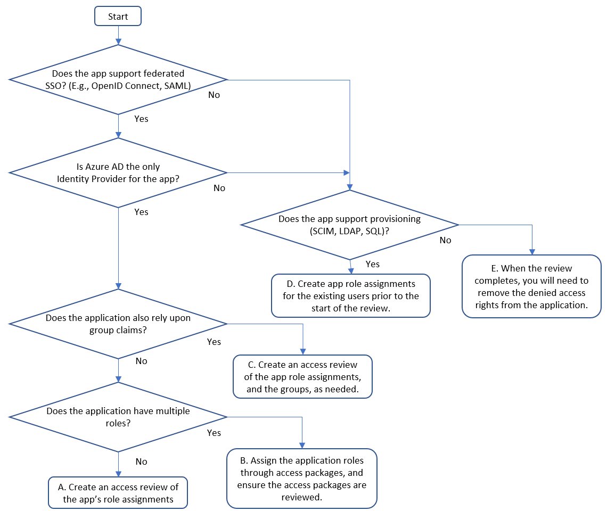
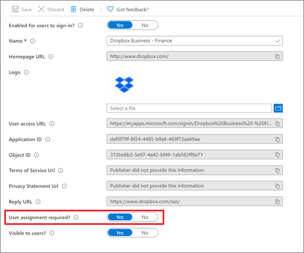

# Prepare for an access review of users' access to an application

[Microsoft Entra ID Governance](identity-governance-overview.md) allows you to balance your organization's need for security and employee productivity with the right processes and visibility. It provides you with capabilities to ensure that the right people have the right access to the right resources.

Organizations with compliance requirements or risk management plans will have sensitive or business-critical applications. The application sensitivity may be based on its purpose or the data it contains, such as financial information or personal information of the organization's customers. For those applications, only a subset of all the users in the organization will typically be authorized to have access, and access should only be permitted based on documented business requirements.  Microsoft Entra ID can be integrated with many popular SaaS applications, on-premises applications, and applications that your organization has developed, using [standard protocol](../architecture/auth-sync-overview.md) and API interfaces. Through these interfaces, Microsoft Entra ID can be the authoritative source to control who has access to those applications.  As you integrate your applications with Microsoft Entra ID, you can then use access reviews to recertify the users who have access to those applications, and remove access of those users who no longer need access.  You can also use other features, including terms of use, Conditional Access and entitlement management, for governing access to applications, as described in [how to govern access to applications in your environment](identity-governance-applications-prepare.md).

## Prerequisites for reviewing access

To use Microsoft Entra ID for an access review of access to an application, you must have one of the following licenses in your tenant:

* Microsoft Entra ID P2 or Microsoft Entra ID Governance
* Enterprise Mobility + Security (EMS) E5 license

While using the access reviews feature does not require users to have those licenses assigned to them to use the feature, you'll need to have at least as many licenses in your tenant as the number of member (non-guest) users who will be configured as reviewers.

Also, while not required for reviewing access to an application, we recommend also regularly reviewing the membership of privileged directory roles that have the ability to control other users' access to all applications. Administrators in the `Global Administrator`, `Identity Governance Administrator`, `User Administrator`, `Application Administrator`, `Cloud Application Administrator` and `Privileged Role Administrator` can make changes to users and their application role assignments, so ensure that [access review of these directory roles](../privileged-identity-management/pim-create-roles-and-resource-roles-review.md) have been scheduled.

## Determine how the application is integrated with Microsoft Entra ID

In order for access reviews to be used for an application, then the application must first be integrated with Microsoft Entra ID. An application being integrated with Microsoft Entra ID means one of two requirements must be met:

* The application relies upon Microsoft Entra ID for federated SSO, and Microsoft Entra ID controls authentication token issuance. If Microsoft Entra ID is the only identity provider for the application, then only users who are assigned to one of the application's roles in Microsoft Entra ID are able to sign into the application. Those users that are denied by a review lose their application role assignment and can no longer get a new token to sign in to the application.
* The application relies upon user or group lists that are provided to the application by Microsoft Entra ID. This fulfillment could be done through a provisioning protocol such as System for Cross-Domain Identity Management (SCIM) or by the application querying Microsoft Entra ID via Microsoft Graph, or groups that are written to AD DS. Those users that are denied by a review lose their application role assignment or group membership, and when those changes are made available to the application, then the denied users will no longer have access.

If neither of those criteria are met for an application, as the application doesn't rely upon Microsoft Entra ID, then access reviews can still be used, however there may be some limitations. Users that aren't in your Microsoft Entra ID or are not assigned to the application roles in Microsoft Entra ID, won't be included in the review.  Also, the changes to remove denied won't be able to be automatically sent to the application if there is no provisioning protocol that the application supports. The organization must instead have a process to send the results of a completed review to the application.

In order to permit a wide variety of applications and IT requirements to be addressed with Microsoft Entra ID, there are multiple patterns for how an application can be integrated with Microsoft Entra ID.  The following flowchart illustrates how to select from three integration patterns, A-C, that are appropriate for applications for use with identity governance.  Knowing what pattern is being used for a particular application helps you to configure the appropriate resources in Microsoft Entra ID to be ready the access review.

   

|Pattern|Application integration pattern|Steps to prepare for an access review|
|:---|---|--|
|A| The application supports federated SSO, Microsoft Entra ID is the only identity provider, and the application doesn't rely upon group or role claims. | In this pattern, you'll configure that the application requires individual application role assignments, and that users are assigned to the application.  Then to perform the review, you'll create a single access review for the application, of the users assigned to this application role. When the review completes, if a user was denied, then they will be removed from the application role. Microsoft Entra ID will then no longer issue that user with federation tokens and the user will be unable to sign into that application.|
|B|If the application uses group claims in addition to application role assignments.| An application may use AD or Microsoft Entra group membership, distinct from application roles to express finer-grained access.  Here, you can choose based on your business requirements either to have the users who have application role assignments reviewed, or to review the users who have group memberships.  If the groups do not provide comprehensive access coverage, in particular if users may have access to the application even if they aren't a member of those groups, then we recommend reviewing the application role assignments, as in pattern A above.|
|C| If the application doesn't rely solely on Microsoft Entra ID for federated SSO, but does support provisioning via SCIM, via updates to a SQL table of users, has a non-AD LDAP directory, or supports a SOAP or REST provisioning protocol. | In this pattern, you'll configure Microsoft Entra ID to provision the users with application role assignments to the application's database or directory, update the application role assignments in Microsoft Entra ID with a list of the users who currently have access, and then create a single access review of the application role assignments.  For more information, see [Governing an application's existing users](identity-governance-applications-existing-users.md)  to update the application role assignments in Microsoft Entra ID.|

### Other options

The integration patterns listed above are applicable to third party SaaS applications, or applications that have been developed by or for your organization.

* Some Microsoft Online Services, such as Exchange Online, use licenses.  While user's licenses can't be reviewed directly, if you're using group-based license assignments, with groups with assigned users, you can review the memberships of those groups instead.
* Some applications may use delegated user consent to control access to Microsoft Graph or other resources.  As consents by each user aren't controlled by an approval process, consents aren't reviewable in. Instead, you can review who is able to connect to the application through Conditional Access policies, that could be based on application role assignments or group memberships.
* If the application doesn't support federation or provisioning protocols, then you'll need a process for manually applying the results when a review completes. For an application that only supports password SSO integration, if an application assignment is removed when a review completes, then the application won't show up on the *myapps* page for the user, but it won't prevent a user who already knows the password from being able to continue to sign into the application. For your on-premises applications, see [govern the users of an application that does not support provisioning](identity-governance-applications-not-provisioned-users.md). For SaaS applications, please [ask the SaaS vendor to onboard to the app gallery](../manage-apps/v2-howto-app-gallery-listing.md) for federation or provisioning by updating their application to support a standard protocol.

## Check the application is ready for the review

Now that you have identified the integration pattern for the application, check the application as represented in Microsoft Entra ID is ready for review.

1. Sign in to the [Microsoft Entra admin Center](https://entra.microsoft.com) as at least a [Identity Governance Administrator](../roles/permissions-reference.md#identity-governance-administrator).
1. Browse to > **Identity** > **Applications** > **Enterprise Applications**. 
1. Here you can check to see whether your application is on the [list of enterprise applications](../manage-apps/view-applications-portal.md) in your tenant.
1. If the application is not already listed, then check if the application is available the [application gallery](../manage-apps/overview-application-gallery.md) for applications that can be integrated for federated SSO or provisioning. If it is in the gallery, then use the [tutorials](../saas-apps/tutorial-list.md) to configure the application for federation, and if it supports provisioning, also [configure the application](../app-provisioning/configure-automatic-user-provisioning-portal.md) for provisioning.  
1. If the application is not already listed, but uses AD security groups and is a web application, [add the application for remote access through Application Proxy](../app-proxy/application-proxy-add-on-premises-application.md) and [configure group writeback to AD](../hybrid/connect/how-to-connect-group-writeback-v2.md).
1. If the application is not already listed, uses AD security groups and is not a web application, then [configure group writeback to AD](../hybrid/connect/how-to-connect-group-writeback-v2.md) and continue at the next section.
1. Once the application is in the list of enterprise applications in your tenant, select the application from the list.
1. Change to the **Properties** tab.  Verify that the **User assignment required?** option is set to **Yes**. If it's set to **No**, all users in your directory, including external identities, can access the application, and you can't review access to the application.

   

1. Change to the **Roles and administrators** tab. This tab displays the administrative roles, that give rights to control the representation of the application in Microsoft Entra ID, not the access rights in the application.  For each administrative role that has permissions to allow changing the application integration or assignments, and has an assignment to that administrative role, ensure that only authorized users are in that role.

1. Change to the **Provisioning** tab.  If automatic provisioning isn't configured, then Microsoft Entra ID won't have a way to notify the application when a user's access is removed if denied during the review.  Provisioning might not be necessary for some integration patterns, if the application is federated and solely relies upon Microsoft Entra ID as its identity provider, or the application uses AD DS groups. However, if your application integration is pattern C, and the application doesn't support federated SSO with Microsoft Entra ID as its only identity provider, then you'll need to configure provisioning from Microsoft Entra ID to the application. Provisioning will be necessary so that Microsoft Entra ID can automatically remove the reviewed users from the application when a review completes, and this removal step can be done through a change sent from Microsoft Entra ID to the application through SCIM, LDAP, SQL, SOAP or REST.

   * If this is a gallery application that supports provisioning, [configure the application for provisioning](../app-provisioning/configure-automatic-user-provisioning-portal.md).
   * If the application is a cloud application and supports SCIM, configure [user provisioning with SCIM](../app-provisioning/use-scim-to-provision-users-and-groups.md).
   * If the application is an on-premises application and supports SCIM, configure an application with the [provisioning agent for on-premises SCIM-based apps](../app-provisioning/on-premises-scim-provisioning.md).
   * If the application relies upon a SQL database, configure an application with the [provisioning agent for on-premises SQL-based applications](../app-provisioning/on-premises-sql-connector-configure.md).
   * If the application relies upon another LDAP directory, configure an application with the [provisioning agent for on-premises LDAP-based applications](../app-provisioning/on-premises-ldap-connector-configure.md).
   * If the application has local user accounts, managed through a SOAP or REST API, configure an application with the [provisioning agent with the web services connector](../app-provisioning/on-premises-web-services-connector.md).
   * If the application has local user accounts, managed through a MIM connector, configure an application with the [provisioning agent with a custom connector](../app-provisioning/on-premises-custom-connector.md).
   * If the application is SAP ECC with NetWeaver AS ABAP 7.0 or later, configure an application with the [provisioning agent with a SAP ECC configured web services connector](../app-provisioning/on-premises-sap-connector-configure.md).

1. If provisioning is configured, then click on **Edit Attribute Mappings**, expand the Mapping section and click on **Provision Microsoft Entra Users**. Check that in the list of attribute mappings, there is a mapping for `isSoftDeleted` to the attribute in the application's data store that you would like to set to false when a user loses access. If this mapping isn't present, then Microsoft Entra ID will not notify the application when a user has gone out of scope, as described in [how provisioning works](../app-provisioning/how-provisioning-works.md).
1. If the application supports federated SSO, then change to the **Conditional Access** tab. Inspect the enabled policies for this application. If there are policies that are enabled, block access, have users assigned to the policies, but no other conditions, then those users may be already blocked from being able to get federated SSO to the application.

1. Change to the **Users and groups** tab.  This list contains all the users who are assigned to the application in Microsoft Entra ID.  If the list is empty, then a review of the application will complete immediately, since there isn't any task for the reviewer to perform.
1. If your application is integrated with pattern C, then you'll need to confirm that the users in this list are the same as those in the applications' internal data store, prior to starting the review. Microsoft Entra ID does not automatically import the users or their access rights from an application, but you can [assign users to an application role via PowerShell](../manage-apps/assign-user-or-group-access-portal.md).  See [Governing an application's existing users](identity-governance-applications-existing-users.md) for how to bring in users from different application data stores into Microsoft Entra ID and assign them to an application role.
1. Check whether all users are assigned to the same application role, such as **User**.  If users are assigned to multiple roles, then if you create an access review of the application, then all assignments to all of the application's roles will be reviewed together.

1. Check the list of directory objects assigned to the roles to confirm that there are no groups assigned to the application roles. It's possible to review this application if there is a group assigned to a role; however, a user who is a member of the group assigned to the role, and whose access was denied, won't be automatically removed from the group. If the application does not itself rely upon groups, then we recommend first converting the application to have direct user assignments, rather than members of groups, so that a user whose access is denied during the access review can have their application role assignment removed automatically.  If the application does rely upon groups, and all of the application's groups are assigned to the same application role, then you'll review the group memberships instead of reviewing the application assignments.

## Check the groups are ready for the review

Next, if the application integration also requires one or more groups to be reviewed, as described in pattern B, then check each group is ready for review.

1. Sign in to the [Microsoft Entra admin Center](https://entra.microsoft.com) as at least a [Identity Governance Administrator](../roles/permissions-reference.md#identity-governance-administrator).
1. Browse to > **Groups**. 
1. Search for and select each group from the list.
1. On the **Overview** tab, verify that the **Membership type** is **Assigned**, and the **Source** is **Cloud**.  If the application uses a dynamic group, or a group synchronized from on-premises, then those group memberships can't be changed in Microsoft Entra ID.  We recommend converting the application to groups created in Microsoft Entra ID with assigned memberships, then copy the member users to that new group.
1. Change to the **Roles and administrators** tab. This tab displays the administrative roles, that give rights to control the representation of the group in Microsoft Entra ID, not the access rights in the application.  For each administrative role that allows changing group membership and has users in that administrative role, ensure that only authorized users are in that role.
1. Change to the **Members** tab.  Verify that the members of the group are users, and that there are no non-user members or nested groups. If there are no members of a group when the review starts, the review of that group will complete immediately.
1. Change to the **Owners** tab. Make sure that no unauthorized users are shown as owners. If you'll be asking the group owners to perform the access review of a group, then confirm that the group has one or more owners.

## Select appropriate reviewers

[!INCLUDE [active-directory-identity-governance-applications-select-reviewers.md](../../../includes/active-directory-identity-governance-applications-select-reviewers.md)]

## Create the reviews

Once you've identified the resources, the application and optionally one or more groups, based on the integration pattern, and who the reviewers should be, then you can configure Microsoft Entra ID to start the reviews.

1. For this step, you'll need to be in the `Global administrator` or `Identity Governance administrator` role.
1. In patterns A and C, you'll create one access review, selecting the application.  Follow the instructions in the guide for [creating an access review of groups or applications](create-access-review.md), to create the review of the application's role assignments.
1. If your application is integrated with pattern B, use the same [guide](create-access-review.md) to create additional access reviews for each of the groups.

   > [!NOTE]
   > If you create an access review and enable review decision helpers, then the decision helper will vary depending upon the resource being reviewed. If the resource is an application, recommendations are based on the 30-day interval period depending on when the user last signed in to the application. If the resource is a group, then the recommendations are based on the interval when the user last signed into to any application in the tenant, not just the application using those groups.

1. When the access reviews start, ask the reviewers to give input. By default, they each receive an email from Microsoft Entra ID with a link to the access panel, where they [review membership in the groups or access to the application](perform-access-review.md).

## View the assignments that are updated when the reviews complete

Once the reviews have started, you can monitor their progress, and update the approvers if needed, until the review completes.  You can then confirm that the users, whose access was denied by the reviewers, are having their access removed from the application.

1. Monitor the access reviews, ensuring the reviewers are making selections to approve or deny user's need for continued access, until the [access review completes](complete-access-review.md).

1. If auto-apply wasn't selected when the review was created, then you'll need to apply the review results when it completes.
1. Wait for the status of the review to change to **Result applied**.  You should expect to see denied users, if any, being removed from the group membership or application assignment in a few minutes.

1. If you had previously configured provisioning of users to the application, then when the results are applied, Microsoft Entra ID will begin deprovisioning denied users from the application. You can [monitor the process of deprovisioning users](../app-provisioning/application-provisioning-when-will-provisioning-finish-specific-user.md). If provisioning indicates an error with the application, you can [download the provisioning log](../reports-monitoring/concept-provisioning-logs.md) to investigate if there was a problem with the application.

1. If you had configured [group writeback](../enterprise-users/groups-write-back-portal.md) for the reviewed groups, then wait until group writeback completes in Microsoft Entra Connect and the changes propagate to all the domain controllers.

1. If provisioning wasn't configured for your application, then you may need to separately copy the list of denied users to the application. For example, in access reviews for a Windows Server AD-managed group, use this [PowerShell sample script](https://github.com/microsoft/access-reviews-samples/tree/master/AzureADAccessReviewsOnPremises). The script outlines the required Microsoft Graph calls and exports the Windows Server AD PowerShell cmdlets to carry out the changes.

1. If you wish, you can also download a [review history report](access-reviews-downloadable-review-history.md) of completed reviews.

1. How long a user who has been denied continued access is able to continue to use a federated application will depend upon the application's own session lifetime, and on the access token lifetime. If the applications used Kerberos, since Kerberos caches the group memberships of a user when they sign into a domain, the users may continue to have access until their Kerberos tickets expire.  To learn more about controlling the lifetime of access tokens, see [configurable token lifetimes](../develop/configurable-token-lifetimes.md).

## Next steps

* [Plan a Microsoft Entra access reviews deployment](deploy-access-reviews.md)
* [Create an access review of a group or application](create-access-review.md)
* [Govern access to applications](identity-governance-applications-prepare.md)
