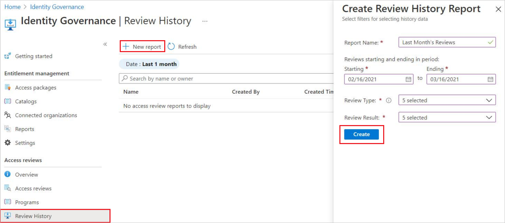

# Create and manage downloadable access review history report in Microsoft Entra access reviews

With access reviews, you can create a downloadable review history to help your organization gain more insight. The report pulls the decisions that are taken by reviewers when a report is created. These reports can be constructed to include specific access reviews, for a specific time frame, and can be filtered to include different review types and review results.
 
## Who can access and request review history

Review history and request review history are available for any user if they're authorized to view access reviews. To see which roles can view and create access reviews, see [What resource types can be reviewed?](deploy-access-reviews.md#what-resource-types-can-be-reviewed). Global Administrator and Global Reader can see all access reviews. All other users are only allowed to see reports on access reviews that they've generated.

## How to create a review history report

**Prerequisite role:** All users authorized to view access reviews

1. Sign in to the [Microsoft Entra admin center](https://entra.microsoft.com) as at least an [Identity Governance Administrator](../roles/permissions-reference.md#identity-governance-administrator).

1. Browse to **Identity governance** > **Access Reviews** > **Review History**.
 
1. Select **New report**. 

1. Specify a review start and end date.

1. Select the review types and review results you want to include in the report. 

    

1. Then select **create** to create an Access Review History Report.

## How to download review history reports

Once a review history report is created, you can download it. All reports that are created are available for download for 30 days in CSV format.

1. Select **Review History** under **Identity Governance**. All review history reports that you created will be available. 
1. Select the report you wish to download. 

## What is included in a review history report?

The reports provide details on a per-user basis showing the following information:

| Element name | Description |
| --- | --- |
| AccessReviewId |	Review object ID |
| AccessReviewSeriesId |	Object ID of the review series, if the review is an instance of a recurring review. If the review is one time, the value is an empty GUID. |
| ReviewType | Review types include group, application, Microsoft Entra role, Azure role, and access package|
|ResourceDisplayName | Display Name of the resource being reviewed |
| ResourceId | ID of the resource being reviewed |
| ReviewName |	Name of the review |
| CreatedDateTime |	Creation datetime of the review |
| ReviewStartDate |	Start date of the review
| ReviewEndDate | End date of the review |
| ReviewStatus | Status of the review. For all review statuses, see the access review status table [here](create-access-review.md) |
| OwnerId | Reviewer owner ID |
| OwnerName | Reviewer owner name |
| OwnerUPN | Reviewer owner User Principal Name |
| PrincipalId | ID of the principal being reviewed |
| PrincipalName | Name of the principal being reviewed |
| PrincipalUPN | Principal Name of the user being reviewed |
| PrincipalType | Type of the principal. Options include user, group, and service principal |
| ReviewDate | Date of the review |
| ReviewResult | Review results include Deny, Approve, and Not reviewed |
|Justification | Justification for review result provided by reviewer |
| ReviewerId | Reviewer ID |
| ReviewerName | Reviewer Name |
| ReviewerUPN | Reviewer User Principal Name |
| ReviewerEmailAddress | Reviewer email address |
| AppliedByName | Name of the user who applied the review result |
| AppliedByUPN | User Principal Name of the user who applied the review result|
| AppliedByEmailAddress | Email address of the user who applied the review result |
| AppliedDate | Date when the review result were applied |
| AccessRecommendation | System recommendations include Approve, Deny, and No Info |
|SubmissionResult | Review result submission statuses include applied, and not applied. |

## Next steps
- [Review access to groups or applications](perform-access-review.md)
- [Review access for yourself to groups or applications](review-your-access.md)
- [Complete an access review of groups or applications](complete-access-review.md)
