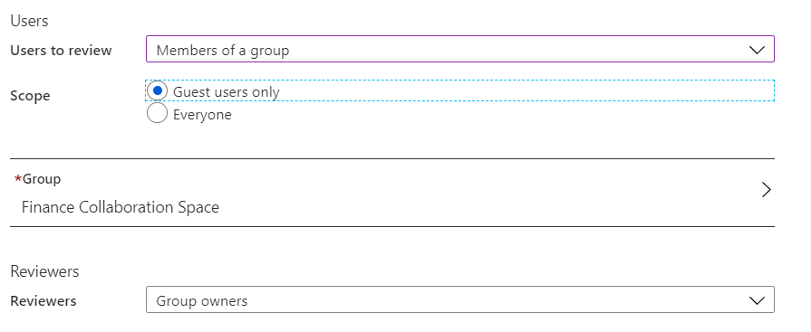
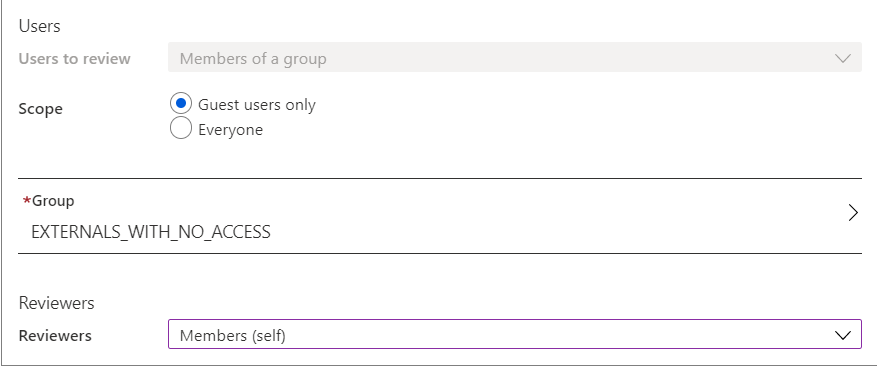
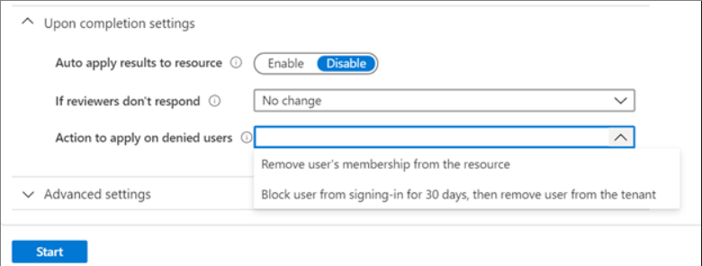

# Use Microsoft Entra ID Governance to review and remove external users who no longer have resource access

This article describes features and methods that allow you to pinpoint and select external identities so that you can review them and remove them from Microsoft Entra ID if they're no longer needed. The cloud makes it easier than ever to collaborate with internal or external users. Embracing Office 365, organizations start to see the proliferation of external identities (including guests), as users work together on data, documents, or digital workspaces such as Teams. Organizations need to balance, enabling collaboration and meeting security and governance requirements. Part of these efforts should include evaluating and cleaning out external users, who were invited for collaboration into your tenant, that originating from partner organizations, and removing them from your Microsoft Entra ID when they're no longer needed.

>[!NOTE]
>A valid Microsoft Entra ID P2 or Microsoft Entra ID Governance, Enterprise Mobility + Security E5 paid, or trial license is required to use Microsoft Entra access reviews. For more information, see [Microsoft Entra editions](../fundamentals/whatis.md).

## Why review users from external organizations in your tenant?

In most organizations, end-users initiate the process of inviting business partners and vendors for collaboration. The need to collaborate drives organizations to provide resource owners and end users with a way to evaluate and attest external users regularly. Often the process of onboarding new collaboration partners is planned and accounted for, but with many collaborations not having a clear end date, it isn't always obvious when a user no longer needs access. Also, identity life-cycle management drives enterprises to keep Microsoft Entra ID clean and remove users who no longer need access to the organization’s resources. Keeping only the relevant identity references for partners and vendors in the directory helps reduce the risk of your employees, inadvertently selecting and granting access to external users that should have been removed. This document walks you through several options that range from recommended proactive suggestions to reactive and cleanup activities to govern external identities.

## Use Entitlement Management to grant and revoke access

Entitlement management features enable the [automated lifecycle of external identities](entitlement-management-external-users.md#manage-the-lifecycle-of-external-users) with access to resources. By establishing processes and procedures to manage access through Entitlement Management, and publishing resources through Access Packages, keeping track of external user access to resources becomes a far less complicated problem to solve. When managing access through [Entitlement Management Access Packages](entitlement-management-overview.md) in Microsoft Entra ID, your organization can centrally define and manage access for your users, and users from partner organizations alike. Entitlement Management uses approvals and assignments of Access Packages to track where external users have requested and been assigned access. Should an external user lose all of their assignments, Entitlement Management can remove these external users automatically from the tenant. 

## Find guests not invited through Entitlement Management

When employees are authorized to collaborate with external users, they may invite any number of users from outside your organization. Looking for and grouping external partners into company-aligned dynamic groups and reviewing them may not be feasible, as there may be too many different individual companies to review, or there's no owner or sponsor for the organization. Microsoft provides a sample PowerShell script that can help you analyze the use of external identities in a tenant. The script enumerates external identities and categorizes them. The script can help you identify and clean up external identities that may no longer be required. As part of the script’s output, the script sample supports automated creation of security groups that contain the identified group-less external partners – for further analysis and use with Microsoft Entra access reviews.
The script is available on [GitHub](https://github.com/microsoft/access-reviews-samples/tree/master/ExternalIdentityUse). After the script finishes running, it generates an HTML output file that outlines external identities that:

- No longer have any group membership in the tenant
- Have an assignment for a privileged role in the tenant
- Have an assignment to an application in the tenant

The output also includes the individual domains for each of these external identities. 

>[!NOTE]
>The script referenced above is a sample script that checks for group membership, role assignments, and application assignments in Microsoft Entra ID. There may be other assignments in applications that external users received outside of Microsoft Entra ID, such as SharePoint (direct membership assignment) or Azure RBAC or Azure DevOps.

## Review resources used by external identities

If you have external identities using resources such as Teams or other applications not yet governed by Entitlement Management, you may want to review access to these resources regularly, too. Microsoft Entra [Access Reviews](create-access-review.md) gives you the ability to review external identities’ access by either letting the resource owner,external identities themselves, or another delegated person you trust attest to whether continued access it required. Access Reviews target a resource and create a review activity scoped to either Everyone who has access to the resource or Guest users only. The reviewer then sees the resulting list of users they need to review – either all users, including employees of your organization or external identities only.

Establishing a resource owner-driven review culture helps govern access for external identities. Resource owners, accountable for access, availability, and security of the information they own, are, in most cases, your best audience to drive decisions around access to their resources and are closer to the users who access them than central IT or a sponsor who manages many externals.

## Create Access Reviews for external identities

Users that no longer have access to any resources in your tenant can be removed if they no longer work with your organization. Before you block and delete these external identities, you may want to reach out to these external users and make sure you haven't overlooked a project, or standing access they have that they still need. When you create a group that contains all external identities as members that you found have no access to any resources in your tenant, you can use Access Reviews to have all externals self-attest to whether they still need or have access – or will still need access in the future. As part of the review, the review creator in Access Reviews can use the **Require reason on approval** function to require external users to provide a justification for continued access, through which you can learn where and how they still need access in your tenant. Also, you can enable the setting **Additional content for reviewer email** feature, to let users know that they'll be losing access if they don’t respond and, should they still need access, a justification is required. If you want to go ahead and let Access Reviews **disable and delete** external identities, should they fail to respond or provide a valid reason for continued access, you can use the Disable and delete option, as described in the next section.

When the review finishes, the **Results** page shows an overview of the response given by every external identity. You can choose to apply results automatically and let Access Reviews disable and delete them. Alternatively, you can look through the responses given and decide whether you want to remove a user’s access or follow-up with them and get additional information before making a decision. If some users still have access to resources that you haven't reviewed yet, you can use the review as part of your discovery and enrich your next review and attestation cycle.

## Disable and delete external identities with Microsoft Entra access reviews

In addition to the option of removing unwanted external identities from resources such as groups or applications, Microsoft Entra access reviews can block external identities from signing-in to your tenant and delete the external identities from your tenant after 30 days. Once you select **Block user from signing-in for 30 days, then remove user from the tenant**, the review stays in the “applying” state for 30 days. During this period, settings, results, reviewers or Audit logs under the current review won't be viewable or configurable. 

When creating a new Access Review, choose the **Select Teams + groups** option and limit the scope to **Guest users only**. In the “Upon completion settings” section, for **Action to apply on denied users** you can define **Block users from signing-in for 30 days, then remove user from the tenant**.

This setting allows you to identify, block, and delete external identities from your Microsoft Entra tenant. External identities who are reviewed and denied continued access by the reviewer will be blocked and deleted, irrespective of the resource access or group membership they have. This setting is best used as a last step after you have validated that the external users in-review no longer carries resource access and can safely be removed from your tenant or if you want to make sure they're removed, irrespective of their standing access. The “Disable and delete” feature blocks the external user first, taking away their ability to signing into your tenant and accessing resources. Resource access isn't revoked in this stage, and in case you wanted to reinstantiate the external user, their ability to sign in can be reconfigured. Upon no further action, a blocked external identity will be deleted from the directory after 30 days, removing the account and their access.

## Next steps

- [Access reviews - Graph API](/graph/api/resources/accessreviewsv2-overview)
- [Entitlement management - Graph API](/graph/api/resources/entitlementmanagement-overview)
