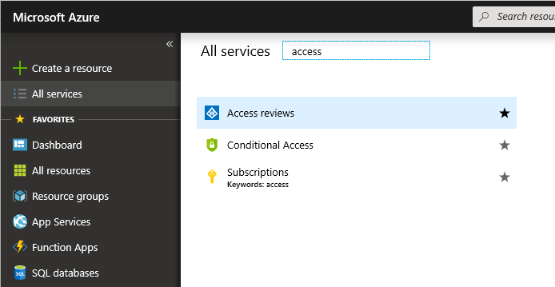
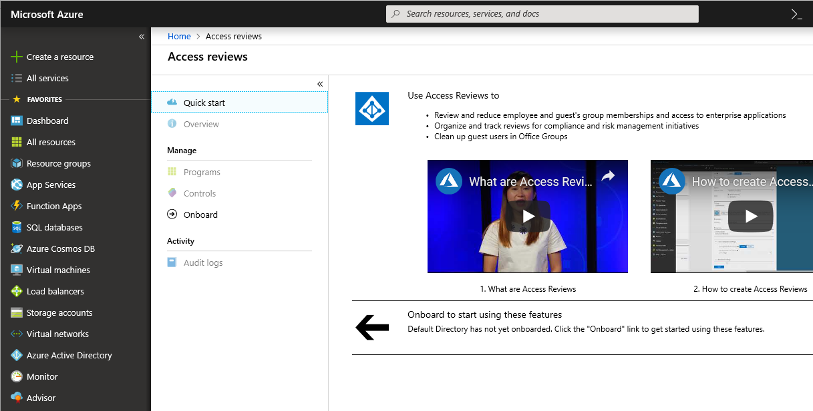
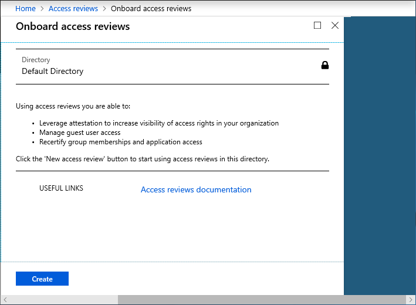
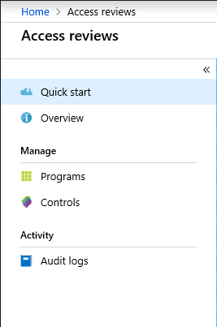

# What are Azure AD Access Reviews?

Azure Active Directory (Azure AD) Access Reviews enable organizations to efficiently manage group memberships and access to enterprise applications. User's access can be reviewed on a regular basis to make sure only the right people have continued access.

Here's a video that provides a quick overview of access reviews:

>[!VIDEO https://www.youtube.com/embed/kDRjQQ22Wkk]

## Why are access reviews important?

Azure AD enables you to collaborate internally within your organization and with users from external organizations, such as partners. Users can join groups, invite guests, connect to cloud apps, and work remotely from their work or personal devices. The convenience of leveraging the power of self-service has led to a need for better access management capabilities.

- As new employees join, how do you ensure they have the right access to be productive?
- As people move teams or leave the company, how do you ensure their old access is removed, especially when it involves guests?
- Excessive access rights can lead to audit findings and compromises as they indicate a lack of control over access.
- You have to proactively engage with resource owners to ensure they regularly review who has access to their resources.

## What can I do with access reviews?

- **Set up recurring reviews**: You can set up recurring access reviews of all users, employees, or guests in groups and applications. Assigned reviewers will be notified. Reviewers can approve or deny access with a friendly interface and with the help of smart recommendations.
- **Review access to groups**: If you have enabled Office groups in your organization to leverage the power of self-service, anyone in the organization can create groups and invite guests into groups. It's convenient that guests can easily gain access to groups, but you also want to make sure that there's oversight for this process. Access reviews can be created on Office and security groups and assign the group owners to confirm who should have continued access, and if the guests are still needed.
- **Review users assigned to applications**: Users assigned to Azure AD-connected applications can also be reviewed, and reviewers will receive recommendations based on the users' sign-in information to make an informative decision.

## What is the difference between Azure AD Access Reviews and Azure AD Privileged Identity Management (PIM)?

Both Azure AD Access Reviews and Azure AD Privileged Identity Management (PIM) allow you to perform access reviews. Azure AD Access Reviews help you to review access to groups and enterprise applications. Access reviews in Azure AD PIM help you to review access to Azure AD directory roles, such as Global Administrator, and Azure resource roles.

## Where do you create reviews?

Depending on what you want to review, you will create your access review in Azure AD Access Reviews, Azure AD enterprise apps (in preview), or Azure AD PIM.

| Access rights of users | Reviewers can be | Review created in | Reviewer experience |
| --- | --- | --- | --- |
| Security group members Office group members | Specified reviewers Group owners Self review | Azure AD Access Reviews Azure AD groups | Access panel |
| Assigned to a connected app | Specified reviewers Self review | Azure AD Access Reviews Azure AD enterprise apps (in preview) | Access panel |
| Azure AD directory role | Specified reviewers Self review | Azure AD PIM | Azure portal |
| Azure resource role | Specified reviewers Self review | Azure AD PIM | Azure portal |

## Prerequisites

To use access reviews, you must have one of the following licenses:

- Azure AD Premium P2
- Enterprise Mobility + Security (EMS) E5 license

For more information, see [How to: Sign up for Azure Active Directory Premium](../fundamentals/active-directory-get-started-premium.md) or [Enterprise Mobility + Security E5 Trial](http://aka.ms/emse5trial).

## Get started with access reviews

To learn more about creating and performing access reviews, watch this short demo:

>[!VIDEO https://www.youtube.com/embed/6KB3TZ8Wi40]

If you are ready to deploy access reviews in your organization, follow these steps in the video to onboard, train your administrators, and create your first access review!

>[!VIDEO https://www.youtube.com/embed/X1SL2uubx9M]

## Enable access reviews

To enable access reviews, follow these steps.

1. As a Global Administrator or User Account Administrator, sign in to the [Azure portal](https://portal.azure.com) where you want to use access reviews.

1. Click **All services** and find the access reviews service.

    

1. Click **Access Reviews**.

    

1. In the navigation list, click **Onboard** to open the **Onboard access reviews** page.

    

1. Click **Create** to enable access reviews in the current directory. The next time you start access reviews, the options will be enabled.

    

## Create reviews via APIs

Microsoft Graph APIs are available for administrators. What you do to manage access reviews of groups, apps, and Azure AD roles in the Azure portal can also be done via APIs. For more information, see the [Azure AD Access Reviews API reference](https://developer.microsoft.com/en-us/graph/docs/api-reference/beta/resources/accessreviews_root). For a code sample, see [Example of retrieving Azure AD Access Reviews via Microsoft Graph](https://techcommunity.microsoft.com/t5/Azure-Active-Directory/Example-of-retrieving-Azure-AD-access-reviews-via-Microsoft/m-p/236096).

## Next steps

- [Create an access review for members of a group or access to an application](create-access-review.md)
- [Create an access review of users in an Azure AD administrative role](../privileged-identity-management/pim-how-to-start-security-review.md)
- [Perform an access review with Azure AD Access Reviews](perform-access-review.md)
- [Complete an access review of members of a group or users' access to an application in Azure AD](complete-access-review.md)
