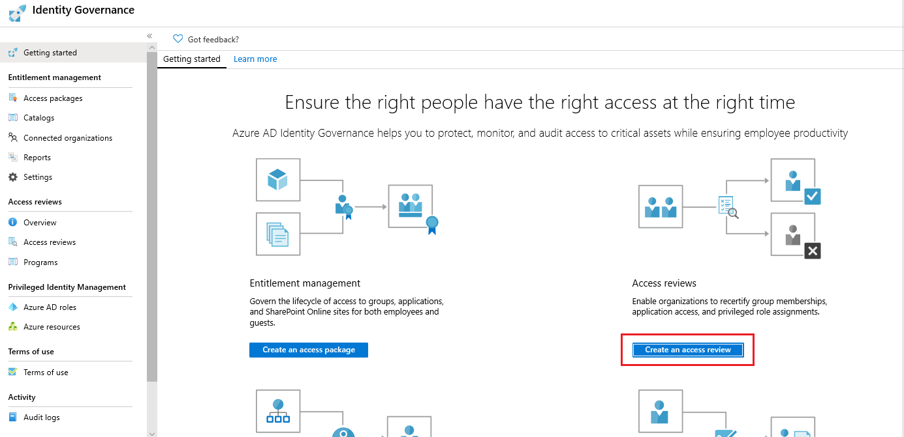

# What are Azure AD access reviews?

Azure Active Directory (Azure AD) access reviews enable organizations to efficiently manage group memberships, access to enterprise applications, and role assignments. User's access can be reviewed on a regular basis to make sure only the right people have continued access.

Here's a video that provides a quick overview of access reviews:

>[!VIDEO https://www.youtube.com/embed/kDRjQQ22Wkk]

## Why are access reviews important?

Azure AD enables you to collaborate internally within your organization and with users from external organizations, such as partners. Users can join groups, invite guests, connect to cloud apps, and work remotely from their work or personal devices. The convenience of leveraging the power of self-service has led to a need for better access management capabilities.

- As new employees join, how do you ensure they have the right access to be productive?
- As people move teams or leave the company, how do you ensure their old access is removed, especially when it involves guests?
- Excessive access rights can lead to audit findings and compromises as they indicate a lack of control over access.
- You have to proactively engage with resource owners to ensure they regularly review who has access to their resources.

## When to use access reviews?

- **Too many users in privileged roles:** It's a good idea to check how many users have administrative access, how many of them are Global Administrators, and if there are any invited guests or partners that have not been removed after being assigned to do an administrative task. You can recertify the role assignment users in [Azure AD roles](../privileged-identity-management/pim-how-to-perform-security-review.md?toc=%2fazure%2factive-directory%2fgovernance%2ftoc.json) such as Global Administrators, or [Azure resources roles](../privileged-identity-management/pim-resource-roles-perform-access-review.md?toc=%2fazure%2factive-directory%2fgovernance%2ftoc.json) such as User Access Administrator in the [Azure AD Privileged Identity Management (PIM)](../privileged-identity-management/pim-configure.md) experience.
- **When automation is infeasible:** You can create rules for dynamic membership on security groups or Office 365 Groups, but what if the HR data is not in Azure AD or if users still need access after leaving the group to train their replacement? You can then create a review on that group to ensure those who still need access should have continued access.
- **When a group is used for a new purpose:** If you have a group that is going to be synced to Azure AD, or if you plan to enable the application Salesforce for everyone in the Sales team group, it would be useful to ask the group owner to review the group membership prior to the group being used in a different risk content.
- **Business critical data access:** for certain resources, it might be required to ask people outside of IT to regularly sign out and give a justification on why they need access for auditing purposes.
- **To maintain a policy's exception list:** In an ideal world, all users would follow the access policies to secure access to your organization's resources. However, sometimes there are business cases that require you to make exceptions. As the IT admin, you can manage this task, avoid oversight of policy exceptions, and provide auditors with proof that these exceptions are reviewed regularly.
- **Ask group owners to confirm they still need guests in their groups:** Employee access might be automated with some on premises IAM, but not invited guests. If a group gives guests access to business sensitive content, then it's the group owner's responsibility to confirm the guests still have a legitimate business need for access.
- **Have reviews recur periodically:** You can set up recurring access reviews of users at set frequencies such as weekly, monthly, quarterly or annually, and the reviewers will be notified at the start of each review. Reviewers can approve or deny access with a friendly interface and with the help of smart recommendations.

## Where do you create reviews?

Depending on what you want to review, you will create your access review in Azure AD access reviews, Azure AD enterprise apps (in preview), or Azure AD PIM.

| Access rights of users | Reviewers can be | Review created in | Reviewer experience |
| --- | --- | --- | --- |
| Security group members Office group members | Specified reviewers Group owners Self-review | Azure AD access reviews Azure AD groups | Access panel |
| Assigned to a connected app | Specified reviewers Self-review | Azure AD access reviews Azure AD enterprise apps (in preview) | Access panel |
| Azure AD role | Specified reviewers Self-review | [Azure AD PIM](../privileged-identity-management/pim-how-to-start-security-review.md?toc=%2fazure%2factive-directory%2fgovernance%2ftoc.json) | Azure portal |
| Azure resource role | Specified reviewers Self-review | [Azure AD PIM](../privileged-identity-management/pim-resource-roles-start-access-review.md?toc=%2fazure%2factive-directory%2fgovernance%2ftoc.json) | Azure portal |

## Create access reviews

To create an access reviews, follow these steps:

1. Go to the [Azure portal](https://portal.azure.com) to manage access reviews and sign in as a Global administrator or User administrator.

1. Search for and select **Azure Active Directory**.

      

1. Select **Identity Governance**.

1. On the Getting started page, click the **Create an access review** button.

    

### Creating access review on a group that can be assigned to Azure AD role
If you are on the newest version of Access Reviews (your reviewers are directed to **My Access** by default) , then only Global Administrator can create access review on role-assignable groups. However, if you are on older version of Access Reviews (your reviewers are directed to the **Access Panel** by default), then both Global Administrator and User Administrator can create access review on role-assignable groups.  

The new experience will be rolled out to all customers on August 1st, 2020 but if you’d like to upgrade sooner, please make a request here - [Azure AD Access Reviews - Updated reviewer experience in My Access Signup](https://forms.microsoft.com/Pages/ResponsePage.aspx?id=v4j5cvGGr0GRqy180BHbR5dv-S62099HtxdeKIcgO-NUOFJaRDFDWUpHRk8zQ1BWVU1MMTcyQ1FFUi4u).

[Learn more about assigning groups to Azure AD roles](https://go.microsoft.com/fwlink/?linkid=2103037).

## Learn about access reviews

To learn more about creating and performing access reviews, watch this short demo:

>[!VIDEO https://www.youtube.com/embed/6KB3TZ8Wi40]

If you are ready to deploy access reviews in your organization, follow these steps in the video to onboard, train your administrators, and create your first access review!

>[!VIDEO https://www.youtube.com/embed/X1SL2uubx9M]

## License requirements

[!INCLUDE [Azure AD Premium P2 license](../../../includes/active-directory-p2-license.md)]

### How many licenses must you have?

Ensure that your directory has at least as many Azure AD Premium P2 licenses as you have employees that will be performing the following tasks:

- Member and guest users who are assigned as reviewers
- Member and guest users who perform a self-review
- Group owners who perform an access review
- Application owners who perform an access review

Azure AD Premium P2 licenses are **not** required for the following tasks:

- No licenses are required for the users with the Global Administrator or User Administrator roles that set up access reviews, configure settings, or apply the decisions from the reviews.

For each paid Azure AD Premium P2 license that you assign to one of your own organization's users, you can use Azure AD business-to-business (B2B) to invite up to five guest users under the External User Allowance. These guest users can also use Azure AD Premium P2 features. For more information, see [Azure AD B2B collaboration licensing guidance](../b2b/licensing-guidance.md).

For more information about licenses, see [Assign or remove licenses using the Azure Active Directory portal](../fundamentals/license-users-groups.md).

### Example license scenarios

Here are some example license scenarios to help you determine the number of licenses you must have.

| Scenario | Calculation | Number of licenses |
| --- | --- | --- |
| An administrator creates an access review of Group A with 75 users and 1 group owner, and assigns the group owner as the reviewer. | 1 license for the group owner as reviewer | 1 |
| An administrator creates an access review of Group B with 500 users and 3 group owners, and assigns the 3 group owners as reviewers. | 3 licenses for each group owner as reviewers | 3 |
| An administrator creates an access review of Group B with 500 users. Makes it a self-review. | 500 licenses for each user as self-reviewers | 500 |
| An administrator creates an access review of Group C with 50 member users and 25 guest users. Makes it a self-review. | 50 licenses for each user as self-reviewers. (guest users are covered in the required 1:5 ratio) | 50 |
| An administrator creates an access review of Group D with 6 member users and 108 guest users. Makes it a self-review. | 6 licenses for each user as self-reviewers + 16 additional licenses to cover all 108 guest users in the required 1:5 ratio. 6 licenses, which cover 6\*5=30 guest users. For the remaining (108-6\*5)=78 guest users, 78/5=16 additional licenses are required. Thus in total, 6+16=22 licenses are required. | 22 |

## Next steps

- [Create an access review of groups or applications](create-access-review.md)
- [Create an access review of users in an Azure AD administrative role](../privileged-identity-management/pim-how-to-start-security-review.md?toc=%2fazure%2factive-directory%2fgovernance%2ftoc.json)
- [Review access to groups or applications](perform-access-review.md)
- [Complete an access review of groups or applications](complete-access-review.md)
