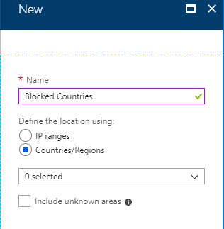
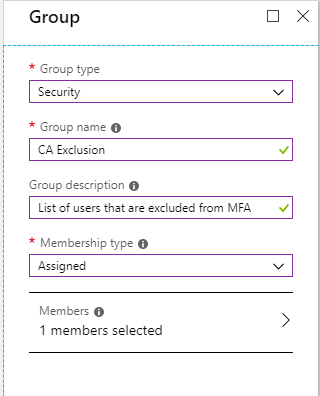
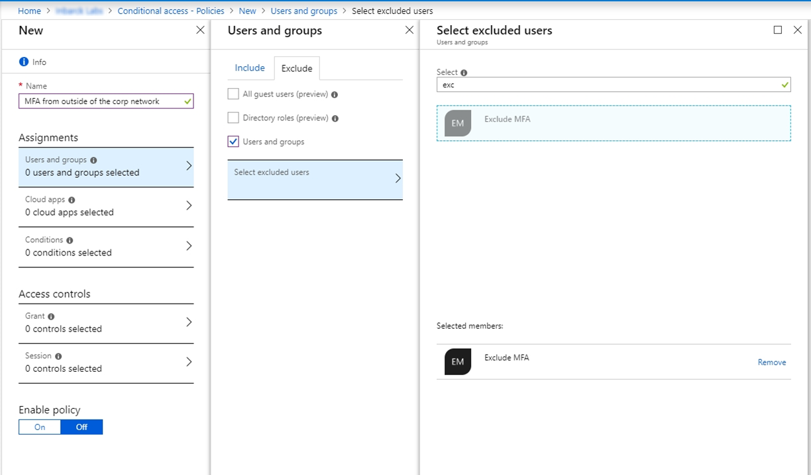
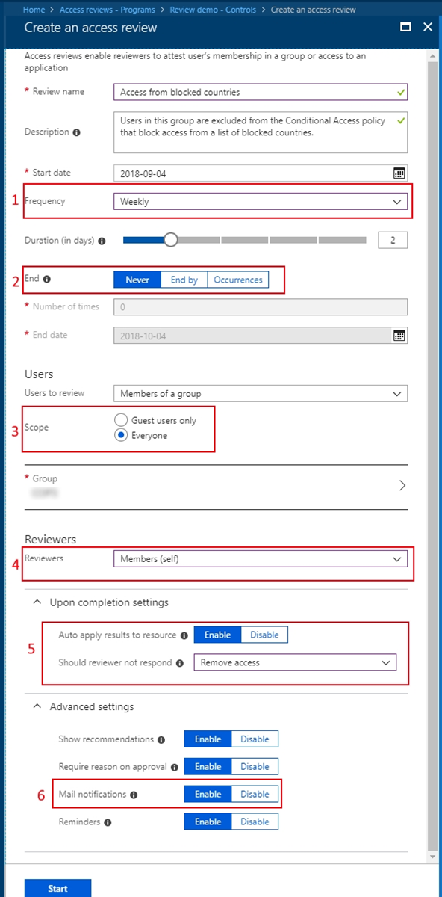
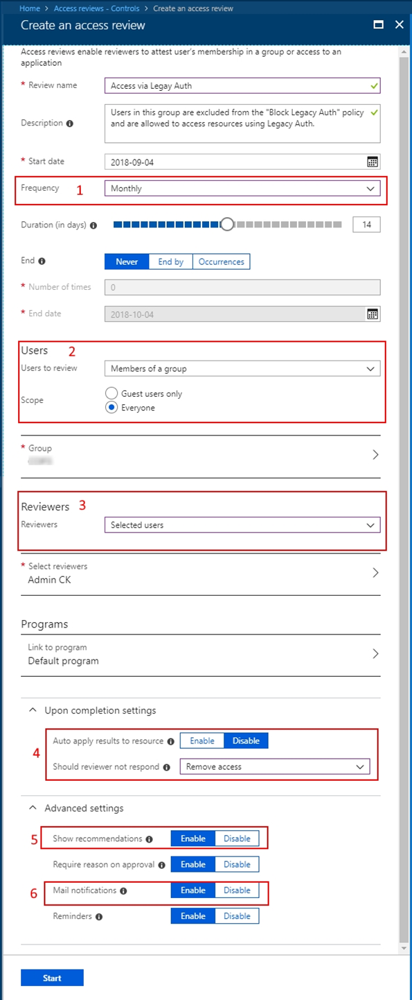
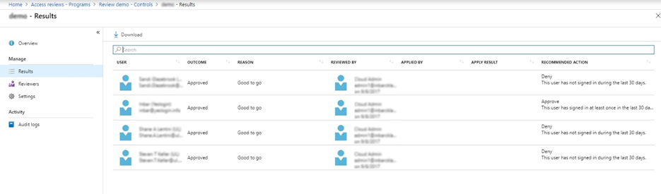
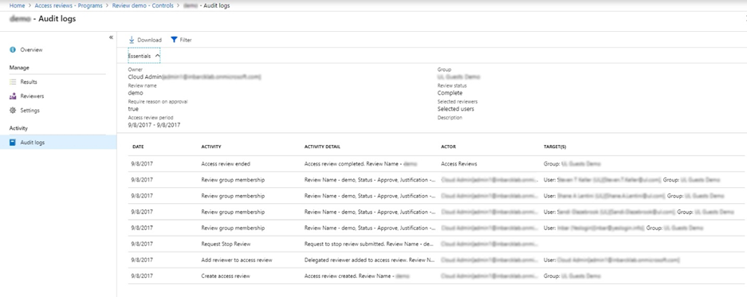

# Use Azure AD access reviews to manage users excluded from Conditional Access policies

In an ideal world, all users follow the access policies to secure access to your organization's resources. However, sometimes there are business cases that require you to make exceptions. This article goes over some examples of situations where exclusions may be necessary. You, as the IT administrator, can manage this task, avoid oversight of policy exceptions, and provide auditors with proof that these exceptions are reviewed regularly using Azure Active Directory (Azure AD) access reviews.

>[!NOTE]
> A valid Azure AD Premium P2, Enterprise Mobility + Security E5 paid, or trial license is required to use Azure AD access reviews. For more information, see [Azure Active Directory editions](../fundamentals/active-directory-whatis.md).

## Why would you exclude users from policies?

Let's say that as the administrator, you decide to use [Azure AD Conditional Access](../conditional-access/concept-conditional-access-policy-common.md) to require multi-factor authentication (MFA) and limit authentication requests to specific networks or devices. During deployment planning, you realize that not all users can meet these requirements. For example, you may have users who work from remote offices, not part of your internal network. You may also have to accommodate users connecting using unsupported devices while waiting for those devices to be replaced. In short, the business needs these users to sign in and do their job so you exclude them from Conditional Access policies.

As another example, you may be using [named locations](../conditional-access/location-condition.md) in Conditional Access to specify a set of countries and regions from which you don't want to allow users to access their tenant.

Unfortunately, some users may still have a valid reason to sign in from these blocked countries/regions. For example, users could be traveling for work and need to access corporate resources. In this case, the Conditional Access policy to block these countries/regions could use a cloud security group for the excluded users from the policy. Users who need access while traveling, can add themselves to the group using [Azure AD self-service Group management](../enterprise-users/groups-self-service-management.md).

Another example might be that you have a Conditional Access policy [blocking legacy authentication for the vast majority of your users](https://cloudblogs.microsoft.com/enterprisemobility/2018/06/07/azure-ad-conditional-access-support-for-blocking-legacy-auth-is-in-public-preview/). However, if you have some users that need to use legacy authentication methods to access your resources via Office 2010 or IMAP/SMTP/POP based clients, then you can exclude these users from the policy that blocks legacy authentication methods.

>[!NOTE]
>Microsoft strongly recommends that you block the use of legacy protocols in your tenant to improve your security posture.

## Why are exclusions challenging?

In Azure AD, you can scope a Conditional Access policy to a set of users. You can also configure exclusions by selecting Azure AD roles, individual users, or guests. You should keep in mind that when exclusions are configured, the policy intent can't be enforced on excluded users. If exclusions are configured using a list of users or using legacy on-premises security groups, you will have limited visibility into the exclusions. As a result:

- Users may not know that they are excluded.

- Users can join the security group to bypass the policy.

- Excluded users may have qualified for the exclusion before but may no longer qualify for it.

Frequently, when you first configure an exclusion, there is a shortlist of users who bypass the policy. Over time, more and more users get added to the exclusion, and the list grows. At some point, you need to review the list and confirm that each of these users is still eligible for exclusion. Managing the exclusion list, from a technical point of view, can be relatively easy, but who makes the business decisions, and how do you make sure it is all auditable? However, if you configure the exclusion using an Azure AD group, you can use access reviews as a compensating control, to drive visibility, and reduce the number of excluded users.

## How to create an exclusion group in a Conditional Access policy

Follow these steps to create a new Azure AD group and a Conditional Access policy that does not apply to that group.

### Create an exclusion group

1. Sign in to the Azure portal.

2. In the left navigation, click **Azure Active Directory** and then click **Groups**.

3. On the top menu, click **New Group** to open the group pane.

4. In the **Group type** list, select **Security**. Specify a name and description.

5. Make sure to set the **Membership** type to **Assigned**.

6. Select the users that should be part of this exclusion group and then click **Create**.

### Create a Conditional Access policy that excludes the group

Now you can create a Conditional Access policy that uses this exclusion group.

1. In the left navigation, click **Azure Active Directory** and then click **Conditional Access** to open the **Policies** blade.

2. Click **New policy** to open the **New** pane.

3. Specify a name.

4. Under Assignments click **Users and groups**.

5. On the **Include** tab, select **All Users**.

6. On the **Exclude** tab, add a checkmark to **Users and groups** and then
    click **Select excluded users**.

7. Select the exclusion group you created.

   > [!NOTE] 
   > As a best practice, it is recommended to exclude at least one administrator account from the policy when testing to make sure you are not locked out of your tenant.

8. Continue with setting up the Conditional Access policy based on your organizational requirements.

  
Let's cover two examples where you can use access reviews to manage exclusions in Conditional Access policies.

## Example 1: Access review for users accessing from blocked countries/regions

Let's say you have a Conditional Access policy that blocks access from certain countries/regions. It includes a group that is excluded from the policy. Here is
a recommended access review where members of the group are reviewed.

> [!NOTE] 
> A Global administrator or User administrator role is required to create access reviews.

1. The review will happen every week.

2. Will never end in order to make sure you're keeping this exclusion group the most up to date.

3. All members of this group will be in scope for the review.

4. Each user will need to self-attest that they still need access from these blocked countries/regions, therefore they still need to be a member of the
    group.

5. If the user doesn't respond to the review request, they will be automatically removed from the group, and they will no longer have access to the tenant while traveling to these countries/regions.

6. Enable email notifications to let users know about the start and completion of the access review.

    

## Example 2: Access review for users accessing with legacy authentication

Let's say you have a Conditional Access policy that blocks access for users using legacy authentication and older client versions and it includes a group
that is excluded from the policy. Here is a recommended access review where members of the group are reviewed.

1. This review would need to be a recurring review.

2. Everyone in the group would need to be reviewed.

3. It could be configured to list the business unit owners as the selected reviewers.

4. Auto-apply the results and remove users that have not been approved to continue using legacy authentication methods.

5. It might be beneficial to enable recommendations so reviewers of large groups can easily make their decisions.

6. Enable mail notifications so users are notified about the start and completion of the access review.

    

>[!IMPORTANT] 
>If you have many exclusion groups and therefore need to create multiple access reviews, we now have an API in the Microsoft Graph beta   endpoint that allows you to create and manage them programmatically. To get started, see the [Azure AD access reviews API reference](/graph/api/resources/accessreviewsv2-root?view=graph-rest-beta&preserve-view=true) and [Example of retrieving Azure AD access reviews via Microsoft Graph](https://techcommunity.microsoft.com/t5/Azure-Active-Directory/Example-of-retrieving-Azure-AD-access-reviews-via-Microsoft/td-p/236096).

## Access review results and audit logs

Now that you have everything in place, group, Conditional Access policy, and access reviews, it is time to monitor and track the results of these reviews.

1. In the Azure portal, open the **Access reviews** blade.

2. Open the control and program you have created for managing the exclusion group.

3. Click **Results** to see who was approved to stay on the list and who was removed.

    

4. Then click **Audit logs** to see the actions that were taken during this review.

    

As an IT administrator, you know that managing exclusion groups to your policies is sometimes inevitable. However, maintaining these groups, reviewing them on a regular basis by the business owner or the users themselves, and auditing these changes can be made easier with Azure AD access reviews.

## Next steps

- [Create an access review of groups or applications](create-access-review.md)
- [What is Conditional Access in Azure Active Directory?](../conditional-access/overview.md)