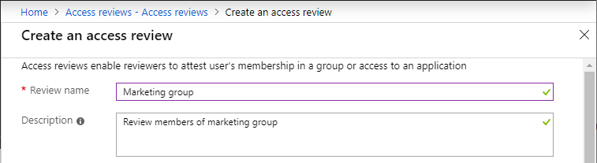
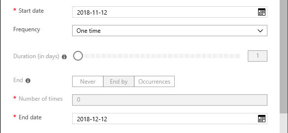
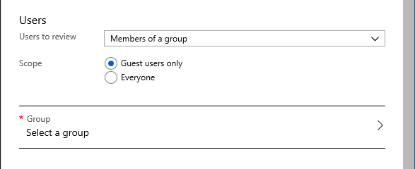
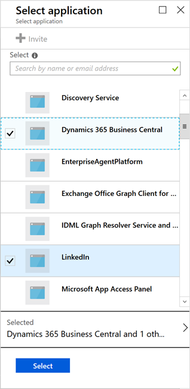
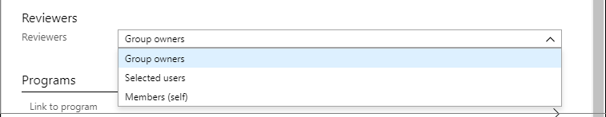
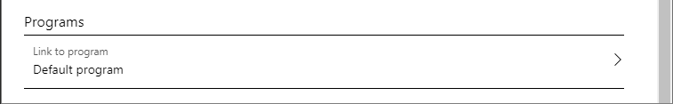
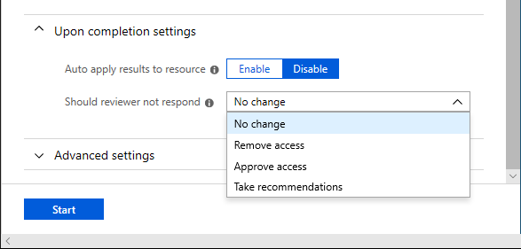

# Create an access review of groups and applications in Azure AD access reviews

Access to groups and applications for employees and guests changes over time. To reduce the risk associated with stale access assignments, administrators can use Azure Active Directory (Azure AD) to create access reviews for group members or application access. If you need to routinely review access, you can also create recurring access reviews. For more information about these scenarios, see [Manage user access](manage-user-access-with-access-reviews.md) and [Manage guest access](manage-guest-access-with-access-reviews.md).

This article describes how to create one or more access reviews for group members or application access.

## Prerequisites

- Azure AD Premium P2
- Global administrator or User administrator

For more information, see [License requirements](access-reviews-overview.md#license-requirements).

## Create one or more access reviews

1. Sign in to the Azure portal and open the [Identity Governance page](https://portal.azure.com/#blade/Microsoft_AAD_ERM/DashboardBlade/).

1. In the left menu, click **Access reviews**.

1. Click **New access review** to create a new access review.

    

1. Name the access review. Optionally, give the review a description. The name and description are shown to the reviewers.

    

1. Set the **Start date**. By default, an access review occurs once, starts the same time it's created, and it ends in one month. You can change the start and end dates to have an access review start in the future and last however many days you want.

    

1. To make the access review recurring, change the **Frequency** setting from **One time** to **Weekly**, **Monthly**, **Quarterly** or **Annually**. Use the **Duration** slider or text box to define how many days each review of the recurring series will be open for input from reviewers. For example, the maximum duration that you can set for a monthly review is 27 days, to avoid overlapping reviews.

1. Use the **End** setting to specify how to end the recurring access review series. The series can end in three ways: it runs continuously to start reviews indefinitely, until a specific date, or after a defined number of occurrences has been completed. You, another User administrator, or another Global administrator can stop the series after creation by changing the date in **Settings**, so that it ends on that date.

1. In the **Users** section, specify the users that the access review applies to. Access reviews can be for the members of a group or for users who were assigned to an application. You can further scope the access review to review only the guest users who are members (or assigned to the application), rather than reviewing all the users who are members or who have access to the application.

    

1. In the **Group** section, select one or more groups that you would like to review membership of.

    > [!NOTE]
    > Selecting more than one group will create multiple access reviews. For example, selecting five groups will create five separate access reviews.
    
    

1. In the **Applications** section (if you selected **Assigned to an application** in step 8), select the applications that you would like to review access to.

    > [!NOTE]
    > Selecting more than one application will create multiple access reviews. For example, selecting five applications will create five separate access reviews.
    
    

1. In the **Reviewers** section, select either one or more people to review all the users in scope. Or you can select to have the members review their own access. If the resource is a group, you can ask the group owners to review. You also can require that the reviewers supply a reason when they approve access.

    

1. In the **Programs** section, select the program you want to use. **Default Program** is always present.

    

    You can simplify how to track and collect access reviews for different purposes by organizing them into programs. Each access review can be linked to a program. Then when you prepare reports for an auditor, you can focus on the access reviews in scope for a particular initiative. Programs and access review results are visible to users in the Global administrator, User administrator, Security administrator, or Security reader role.

    To see a list of programs, go to the access reviews page and select **Programs**. If you're in a Global administrator or User administrator role, you can create additional programs. For example, you can choose to have one program for each compliance initiative or business goal. If you no longer need a program and it doesn't have any controls linked to it, you can delete it.

### Upon completion settings

1. To specify what happens after a review completes, expand the **Upon completion settings** section.

    

1. If you want to automatically remove access for users that were denied, set **Auto apply results to resource** to **Enable**. If you want to manually apply the results when the review completes, set the switch to **Disable**.

1. Use the **Should reviewer not respond** list to specify what happens for users that are not reviewed by the reviewer within the review period. This setting does not impact users who have been reviewed by the reviewers manually. If the final reviewer's decision is Deny, then the user's access will be removed.

    - **No change** - Leave user's access unchanged
    - **Remove access** - Remove user's access
    - **Approve access** - Approve user's access
    - **Take recommendations** - Take the system's recommendation on denying or approving the user's continued access

### Advanced settings

1. To specify additional settings, expand the **Advanced settings** section.

    

1. Set **Show recommendations** to **Enable** to show the reviewers the system recommendations based the user's access information.

1. Set **Require reason on approval** to **Enable** to require the reviewer to supply a reason for approval.

1. Set **Mail notifications** to **Enable** to have Azure AD send email notifications to reviewers when an access review starts, and to administrators when a review completes.

1. Set **Reminders** to **Enable** to have Azure AD send reminders of access reviews in progress to reviewers who have not completed their review.

    By default, Azure AD automatically sends a reminder halfway to the end date to reviewers who haven't yet responded.

## Start the access review

Once you have specified the settings for an access review, click **Start**. The access review will appear in your list with an indicator of its status.

By default, Azure AD sends an email to reviewers shortly after the review starts. If you choose not to have Azure AD send the email, be sure to inform the reviewers that an access review is waiting for them to complete. You can show them the instructions for how to [review access to groups or applications](perform-access-review.md). If your review is for guests to review their own access, show them the instructions for how to [review access for yourself to groups or applications](review-your-access.md).

If you have assigned guests as reviewers and they have not accepted the invite, they will not receive an email from access reviews because they must first accept the invite prior to reviewing.

## Create reviews via APIs

You can also create access reviews using APIs. What you do to manage access reviews of groups and application users in the Azure portal can also be done using Microsoft Graph APIs. For more information, see the [Azure AD access reviews API reference](https://docs.microsoft.com/graph/api/resources/accessreviews-root?view=graph-rest-beta). For a code sample, see [Example of retrieving Azure AD access reviews via Microsoft Graph](https://techcommunity.microsoft.com/t5/Azure-Active-Directory/Example-of-retrieving-Azure-AD-access-reviews-via-Microsoft/m-p/236096).

## Next steps

- [Review access to groups or applications](perform-access-review.md)
- [Review access for yourself to groups or applications](review-your-access.md)
- [Complete an access review of groups or applications](complete-access-review.md)
