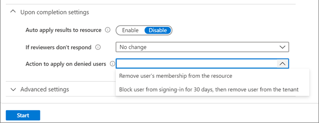
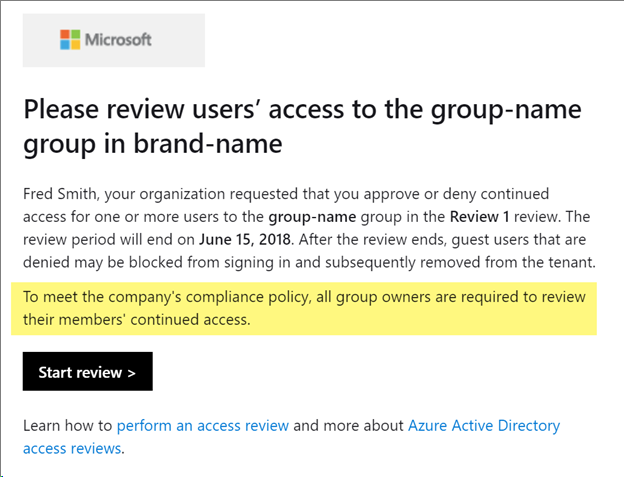

# Create an access review of groups and applications in Azure AD access reviews

Access to groups and applications for employees and guests changes over time. To reduce the risk associated with stale access assignments, administrators can use Azure Active Directory (Azure AD) to create access reviews for group members or application access. If you need to routinely review access, you can also create recurring access reviews. For more information about these scenarios, see [Manage user access](manage-user-access-with-access-reviews.md) and [Manage guest access](manage-guest-access-with-access-reviews.md).

You can watch a quick video talking about enabling Access Reviews:

>[!VIDEO https://www.youtube.com/embed/X1SL2uubx9M]

This article describes how to create one or more access reviews for group members or application access.

## Prerequisites

- Azure AD Premium P2
- Global administrator or User administrator

For more information, see [License requirements](access-reviews-overview.md#license-requirements).

## Create one or more access reviews

1. Sign in to the Azure portal and open the [Identity Governance page](https://portal.azure.com/#blade/Microsoft_AAD_ERM/DashboardBlade/).

1. In the left menu, click **Access reviews**.

1. Click **New access review** to create a new access review.

    

1. Name the access review. Optionally, give the review a description. The name and description are shown to the reviewers.

    

1. Set the **Start date**. By default, an access review occurs once, starts the same time it's created, and it ends in one month. You can change the start and end dates to have an access review start in the future and last however many days you want.

    

1. To make the access review recurring, change the **Frequency** setting from **One time** to **Weekly**, **Monthly**, **Quarterly**, **Semi-annually**, or **Annually**. Use the **Duration** slider or text box to define how many days each review of the recurring series will be open for input from reviewers. For example, the maximum duration that you can set for a monthly review is 27 days, to avoid overlapping reviews.

1. Use the **End** setting to specify how to end the recurring access review series. The series can end in three ways: 
    1. It runs continuously to start reviews indefinitely
    1. Until a specific date,
    1. Until after a defined number of occurrences has completed. 
  
    You, another User administrator, or another Global administrator can stop the series after creation by changing the date in **Settings**, so that it ends on that date.

1. In the **Users** section, specify the users that the access review applies to. Access reviews can be for the members of a group or for users who were assigned to an application. You can further scope the access review to review only the guest users who are members (or assigned to the application), rather than reviewing all the users who are members or who have access to the application.

    

1. In the **Group** section, select one or more groups that you would like to review membership of.

    > [!NOTE]
    > Selecting more than one group will create multiple access reviews. For example, selecting five groups will create five separate access reviews.
    
    

1. In the **Applications** section (if you selected **Assigned to an application** in step 8), select the applications that you would like to review access to.

    > [!NOTE]
    > Selecting more than one application will create multiple access reviews. For example, selecting five applications will create five separate access reviews.
    
    

1. In the **Reviewers** section, select either one or more people to review all the users in scope. Or you can select to have the members review their own access. If the resource is a group, you can ask the group owners to review. You also can require that the reviewers supply a reason when they approve access.

    

1. In the **Programs** section, select the program you want to use. **Default Program** is always present.

    

    You can simplify the collection and tracking of access reviews by organizing them into programs. Each access review can be linked to a program. Then when you prepare reports for an auditor, you can focus on the access reviews in scope for a particular initiative. Programs and access review results are visible to users in the Global administrator, User administrator, Security administrator, or Security reader role.

    To see a list of programs, go to the access reviews page and select **Programs**. If you're in a Global administrator or User administrator role, you can create additional programs. For example, you can choose to have one program for each compliance initiative or business goal. When you no longer need a program and it doesn't have any controls linked to it, you can delete it.

### Upon completion settings

1. To specify what happens after a review completes, expand the **Upon completion settings** section.

    

2. If you want to automatically remove access for denied users, set **Auto apply results to resource** to **Enable**. If you want to manually apply the results when the review completes, set the switch to **Disable**.

3. Use the **If reviewers don't respond** list to specify what happens for users that are not reviewed by the reviewer within the review period. This setting does not impact users who have been reviewed by the reviewers manually. If the final reviewer's decision is Deny, then the user's access will be removed.

    - **No change** - Leave user's access unchanged
    - **Remove access** - Remove user's access
    - **Approve access** - Approve user's access
    - **Take recommendations** - Take the system's recommendation on denying or approving the user's continued access

    

4. (Preview) Use the Action to apply on denied users to specify what happens to guest users if they are denied.
    - **Option 1** will remove denied user’s access to the group or application being reviewed, they will still be able to sign-in to the tenant. 
    - **Option 2** will block the denied users from signing in to the tenant, regardless if they have access to other resources. If there was a mistake or if an admin decides to re-enable one’s access, they can do so within 30 days after the user has been disabled. If there is no action taken on the disabled users, they will be deleted from the tenant.

To learn more about best practices for removing guest users who no longer have access to resources in your organization read the article titled [Use Azure AD Identity Governance to review and remove external users who no longer have resource access.](access-reviews-external-users.md).

>[!NOTE]
> Action to apply on denied users only works if you previously scoped a review to Guest users only (See **Create one or more access reviews** section step 8)

### Advanced settings

1. To specify additional settings, expand the **Advanced settings** section.

1. Set **Show recommendations** to **Enable** to show the reviewers the system recommendations based the user's access information.

1. Set **Require reason on approval** to **Enable** to require the reviewer to supply a reason for approval.

1. Set **Mail notifications** to **Enable** to have Azure AD send email notifications to reviewers when an access review starts, and to administrators when a review completes.

1. Set **Reminders** to **Enable** to have Azure AD send reminders of access reviews in progress to reviewers who have not completed their review. 

    >[!NOTE]
    > By default, Azure AD automatically sends a reminder halfway to the end date to reviewers who haven't yet responded

1. (Preview) The content of the email sent to reviewers is autogenerated based on the review details, such as review name, resource name, due date, etc. If you need a way to communicate additional information such as additional instructions or contact information, you can specify these details in the **Additional content for reviewer email** which will be included in the invitation and reminder emails sent to assigned reviewers. The highlighted section below is where this information will be displayed.

    

## Start the access review

Once you have specified the settings for an access review, click **Start**. The access review will appear in your list with an indicator of its status.

By default, Azure AD sends an email to reviewers shortly after the review starts. If you choose not to have Azure AD send the email, be sure to inform the reviewers that an access review is waiting for them to complete. You can show them the instructions for how to [review access to groups or applications](perform-access-review.md). If your review is for guests to review their own access, show them the instructions for how to [review access for yourself to groups or applications](review-your-access.md).

If you have assigned guests as reviewers and they have not accepted the invite, they will not receive an email from access reviews because they must first accept the invite prior to reviewing.

## Access review status table

| Status | Definition |
|--------|------------|
|NotStarted | Review was created, user discovery is waiting to start. |
|Initializing   | User discovery is in progress to identify all users that are part of the review. |
|Starting | Review is starting. If email notifications are enabled, emails are being sent to reviewers. |
|InProgress | Review has started. If email notifications are enabled emails have been sent to reviewers. Reviewers can submit decisions until the due date. |
|Completing | Review is being completed and emails are being sent to the review owner. |
|Auto-Reviewing | Review is in a system reviewing stage. The system is recording decisions for users who were not reviewed based on recommendations or pre-configured decisions. |
|Auto-Reviewed | Decisions have been recorded by the system for all users who were not reviewed. Review is ready to proceed to **Applying** if Auto-Apply is enabled. |
|Applying | There will be no change in access for users who were approved. |
|Applied | Denied users, if any, have been removed from the resource or directory. |
|Failed | Review could not progress. This error could be related to the deletion of the tenant, a change in licenses, or other internal tenant changes. |

## Create reviews via APIs

You can also create access reviews using APIs. What you do to manage access reviews of groups and application users in the Azure portal can also be done using Microsoft Graph APIs. For more information, see the [Azure AD access reviews API reference](/graph/api/resources/accessreviews-root?view=graph-rest-beta). For a code sample, see [Example of retrieving Azure AD access reviews via Microsoft Graph](https://techcommunity.microsoft.com/t5/Azure-Active-Directory/Example-of-retrieving-Azure-AD-access-reviews-via-Microsoft/m-p/236096).

## Next steps

- [Review access to groups or applications](perform-access-review.md)
- [Review access for yourself to groups or applications](review-your-access.md)
- [Complete an access review of groups or applications](complete-access-review.md)